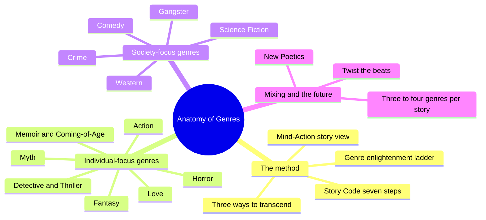
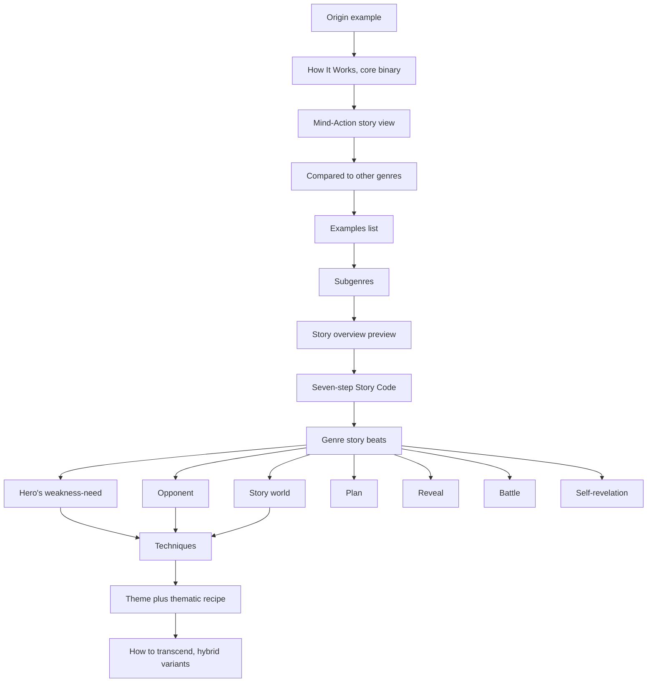
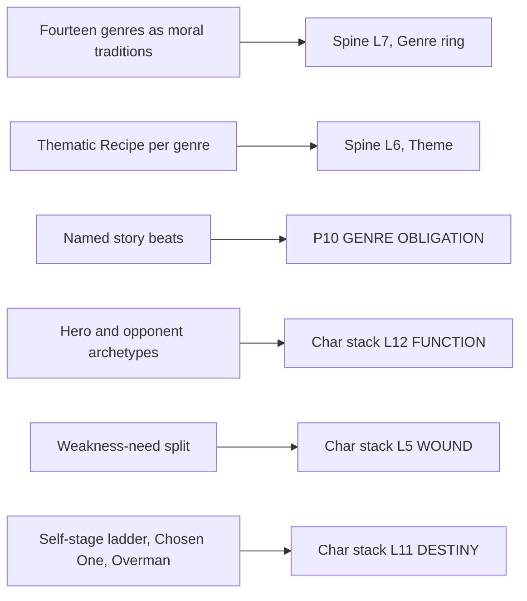
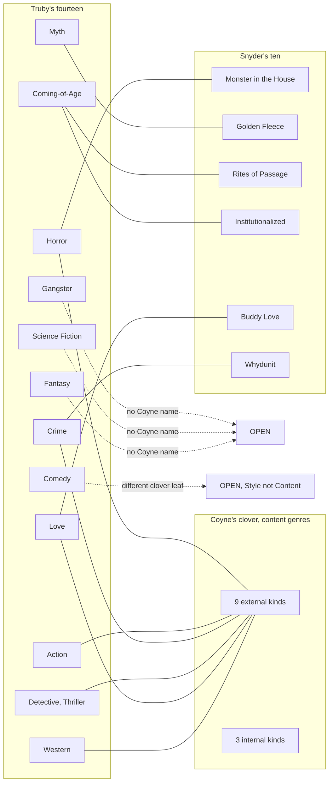

# BVX.0191 — The Anatomy of Genres: How Story Forms Explain the Way the World Works — John Truby (2022)
### Knowledge Entry — Distill

The spine's strong holding for L7 genre as moral-argument tradition: fourteen major genres, each a fixed philosophy proved through a fixed schema of beats, hero, opponent, and story world, plus a method for mixing and transcending them.

## TABLE OF CONTENTS
- [Core Thesis](#1-core-thesis)
- [Mind Models](#2-mind-models)
- [Framework](#3-framework--structure)
- [Key Concepts](#4-key-concepts)
- [Heuristics](#5-heuristics--decision-rules)
- [Invariants](#6-invariants)
- [Pitfalls](#7-pitfalls--myths)
- [Application](#8-application)
- [Cross-References](#9-cross-references)
- [Provenance](#10-provenance--confidence)

---

## 1 · CORE THESIS

Each of Truby's fourteen genres is a moral argument about how to live: a fixed philosophy proved through genre-twisted beats, a genre-typed hero and opponent, and a story world built to embody the hero's weakness. Writers combine three to four genres, then transcend the lead one, to be original.

---

## 2 · MIND MODELS

*Required. Minimum two diagrams, maximum five.*

**Diagram 1 — the whole argument.**
Caption: *fourteen genres split cleanly into individual-focused and society-focused halves, both running under one method: a universal Story Code, a stated philosophy, and a rule for mixing and transcending.*

**Diagram 2 — the central mechanism (the fixed genre-chapter schema, a process in order).**
Caption: *every genre chapter runs the same twelve-part pipeline; only the content twists, the schema never does.*

**Diagram 3 — Truby mapped onto the Command's systems.**
Caption: *Truby's genre-chapter vocabulary keys cleanly to three separate house systems at once: the story spine's outer two rings and two of the character stack's deep layers.*

**Diagram 4 — his fourteen beside Snyder's ten and Coyne's clover.**
Caption: *three vocabularies overlap at Horror, Love, and Coming-of-Age, but Myth, Science Fiction, Fantasy, and Gangster have no Coyne content-genre name at all, and Comedy sits on a different clover leaf entirely.*

---

## 3 · FRAMEWORK / STRUCTURE

Every one of the twelve genre chapters (fourteen genres, since Memoir pairs with Coming-of-Age and Detective pairs with Thriller) runs the identical schema, in the identical order. The content changes; the skeleton never does.

| Fixed element | What it does |
|---|---|
| Origin example | Opens on the oldest instance of the genre, often a myth or founding text, to prove the form predates its modern label |
| "[Genre]: How It Works" | States the genre's single binary distinction or fundamental concern in a sentence |
| Mind-Action story view | The genre's philosophy: how the mind sees the world, plus its recipe for living well |
| Compared to other genres | Places the genre in a family (Myth, Crime, Speculative Fiction) and names its polar opposite |
| Examples | Three fixed lists: Stories, Novels and Films, Television |
| Subgenres | Named diversifications that share the genre's core beats |
| Story overview preview | A table of contents in miniature: which beats, which theme and recipe, which transcending variants follow |
| Seven-step Story Code | The universal engine (weakness-need, desire, opponent, plan, battle, self-revelation, new equilibrium), restated then twisted per genre |
| Story beats | Named beats tagged "[GENRE] STORY BEAT," covering story world, hero's role and weakness-need, opponent, plan, reveal, battle, self-revelation, new equilibrium |
| Techniques | Craft fixes for the genre's structural problems, tagged "TECHNIQUE" |
| Theme plus thematic recipe | The philosophy restated twice: "Being Is [X]," then named "The [Genre] Thematic Recipe: The Way of [Y]" |
| How to transcend | Two or three named hybrid variants (for example "Transcending Science Fiction 1: The Science Fiction/Myth Epic"), each running its own beats and techniques inside the hybrid |

Three rules frame the schema. Genres are bought and sold as structures, not tropes (Rule 1). Popular stories combine three to four genres at once, a strategy Truby dates to *Star Wars* (Rule 2). A writer transcends the primary genre by twisting its beats, voicing its philosophy through theme, or exploring its unique art/story form of life (Rule 3). The fourteen are then ordered on a "ladder of enlightenment," Horror (religion) to Love (the art of happiness), each rung correcting the blind spot below it.

---

## 4 · KEY CONCEPTS

| Concept | What it is | Why it matters |
|---|---|---|
| **Mind-Action story view** | A genre's philosophy: how the mind sees the world, then acts on it | This, not the plot, is what a genre actually sells |
| **Story Code (seven steps)** | Weakness-need, desire, opponent, plan, battle, self-revelation, new equilibrium | The universal engine under all fourteen genres and every hybrid |
| **Fundamental concern** | Each genre's one-phrase subject (Horror: Religion, Love: The Art of Happiness) | Doubles as chapter title and the genre's rung on the enlightenment ladder |
| **Thematic Recipe** | The philosophy restated as "The Way of X" (Memoir: Becoming, Science Fiction: the Social Creator) | The load-bearing theme statement, liftable straight into a logline |
| **Genre families** | Myth (Myth, Action, Western); Crime (Detective, Crime, Thriller, Gangster); Speculative (Horror, Science Fiction, Fantasy) | Groups genres by story-world scale and individual- vs. society-focus |
| **Four-point opposition** | Hero plus three opponents in a hierarchy, so a distant top opponent still has proxies in direct contact | Solves an opponent too powerful to physically confront |
| **Social fractals** | A pattern (headman, hunter, shaman, clown) repeating at every social scale, family to planet | Builds a detailed society without a new logic per scale |
| **Vortex / branching plot** | Branching explores subworlds in sequence; vortex funnels all branches to one named convergence point | Fixes sprawling, low-drive world-spanning plots |
| **Apparent vs. real choice** | A society offers apparent choice while a hidden structure funnels members to a designed exit | Truby's mechanism for how a dystopia enslaves without looking like it |
| **Chosen One vs. Overman** | Chosen One is anointed, rises to an assigned role; Overman is unassigned, produced only by the struggle | The two endpoint shapes a Myth or Science Fiction arc can take |
| **Self-stage ladder** | Nine named self-development stages, childhood forever through hero-to-artist | A genre-agnostic taxonomy for where an arc is headed |
| **Transcending, three ways** | Twist beat order; voice philosophy through theme; explore the genre's unique art form of life | How to write the genre without writing everyone else's version of it |

---

## 5 · HEURISTICS & DECISION RULES

| Situation | Do this | Not this |
|---|---|---|
| Hero feels drowned by a vast story world | Give her a severe weakness-need, especially a moral one | Leave her an innocent victim of the system |
| The opponent is too powerful to meet | Build a four-point opposition, proxies in direct contact with the hero | Write one remote, unreachable villain |
| The story world reads thin | Detail land, people, technology as three separate art forms | Sketch in broad strokes to keep the plot moving |
| A world-spanning plot loses drive | Set a vortex point early and fold all branches toward it | Let branches run open-ended, no named convergence |
| Writing a dystopia | Show apparent choice over a hidden restriction; name the enslaving system | Draw a society that is simply, uniformly evil |
| A genre draft feels generic | Twist the beat order, or voice the philosophy through theme | Skip a beat on the claim of literary exemption |
| Choosing genres to combine | Pair two that don't normally appear together | Default to whichever genres are already selling |
| Structuring a true story | Build a story frame and a Storyteller Structure with a real trigger | Tell events chronologically, hope for a natural climax |

---

## 6 · INVARIANTS

1. A genre expresses its philosophy through structure, the Mind-Action story view, never through a stated message.
2. All fourteen genres, and every hybrid of them, run the same seven-step Story Code underneath; genre only decides which step gets emphasized and how it is twisted.
3. A genre's story beats are reader-contract items, not optional style choices; skip one and, in the book's own words, "you haven't written a [genre] story."
4. Genres cluster into families (Myth, Crime, Speculative Fiction) by shared story-world scale, and split further into individual-focused and society-focused halves.
5. Transcending a genre never means abandoning its beats; it means twisting their order, voicing the philosophy through theme, or exploring the genre's unique art/story form of life.
6. Popular stories today combine three to four genres; mastering one alone is necessary but not sufficient for originality.
7. The genre ladder runs from least to most enlightened, Horror to Love, each rung correcting the blind spot of the rung below it.

---

## 7 · PITFALLS / MYTHS

- Treating tropes (an image, a tagline) as if they were beats; tropes decorate, the beat sequence is the mechanism.
- Letting the story world dwarf the hero, leaving "a big hole in the middle of your story."
- Writing dystopia as uniformly evil; a real enslaving system mixes apparent choice with restriction.
- Claiming literary "gravitas" exempts a story from its genre's obligatory beats.
- Confusing Coming-of-Age with a sensationalized loss-of-virginity plot; it is about challenging and changing a basic belief.
- Mistaking a marketing category (romantic comedy, epic) for one of the fourteen structural genres.
- Assuming a memoir's real events supply a natural dramatic build on their own; they rarely do.

---

## 8 · APPLICATION

- **Spine level:** L7 primary (genre as moral-argument tradition, opposite Dramatica's thin audience-appreciations ring), L6 supporting (each Thematic Recipe is a genre-typed instance of theme), L4 supporting (the Story Code and named beats are a plot template over the spine's signposts, the status Snyder's fifteen beats and Truby's own 22 steps hold in [[BVX.0193]])
- **12-layer character stack:** L12 FUNCTION (genre-typed hero/opponent archetypes), L5 WOUND (genre-conditioned weakness-need presets), L11 DESTINY (the self-stage ladder, Chosen One vs. Overman)
- **plot_systems:** direct feed for P10 GENRE OBLIGATION; the "[GENRE] STORY BEAT" tags are a candidate per-genre checklist under P10, the status Coyne's obligatory scenes and Snyder's beats already hold
- **Setting:** direct feed for the L7 row of the setting touchpoint map; Southern Gothic, space opera, and Western are genre promises about a story world's sensorium, Truby's own claim that "you create a story world to express and manifest your hero"

This book is the load-bearing text for the spine SSOT's claim that Truby supplies "genre as moral-argument tradition" opposite Coyne's reader-contract and Snyder's commercial wheel; where Dramatica leaves L7 thin, Truby names what each genre argues and proves it through a schema detailed enough to card.

**OXO's placement in Truby's terms:** primary genre is Coming-of-Age, the weakness-need to self-revelation frame around a "bad faith" self that has accepted the meritocratic promise without question, exactly DCUS's S9 ALLURE entry. It transcends through a Science Fiction/Horror institutional-dystopia mix (his own "Science Fiction/Horror Epic," unnamed as a Coming-of-Age hybrid but built from the same parts): the Star-Rating and Sync cult are his apparent choice inside a hidden restriction, and the rename lattice (Red Stick Creek to Red Hills to DCUS) is his hidden, erased system that organizes and enslaves the world. The Southern Gothic register supplies the Horror-family sensorium (his genre-setting contract) without OXO being a Horror story outright. Owed beats: the weakness-need/self-revelation frame around the broken belief, a web-of-characters opponent rather than one villain (his Memoir beat "Story World, System of Slavery"), and a world build that shows both real and apparent choice, not uniform oppression.

**For the genre system:**
- **What this book adds to L7 (genre · medium · audience · market):** it supplies the moral-argument content the ring was missing, a genre is not just a set of owed scenes (Coyne) or a page-timed template (Snyder), it is a stated philosophy a story's whole structure exists to prove.
- **Which of the four it feeds hardest:** genre itself, specifically the genre-setting contract sub-row; nothing new on medium or market, only a light touch on audience.
- **His fixed chapter schema as candidate GENRE CARD fields:** origin lineage, core binary/fundamental concern, Mind-Action philosophy, family placement and polar opposite, subgenre list, story-world build (land, people, technology), named story beats keyed to the seven-step Story Code, techniques, theme plus thematic recipe, transcending variants.
- **OXO's genre and its mix:** Coming-of-Age primary, transcended via a Science Fiction/Horror institutional-dystopia mix, Southern Gothic Horror register for the setting contract; the beats it owes are the weakness-need/self-revelation frame, a system-as-opponent rather than a single villain, and an apparent-choice-versus-restriction world build.
- **Reconciling his fourteen with Snyder's ten and Coyne's clover:** three overlapping but non-identical vocabularies, not one. Real alignments exist (Horror/Monster-in-the-House, Love/Buddy-Love, Coming-of-Age/Rites-of-Passage and Institutionalized), but Myth, Science Fiction, Fantasy, and Gangster have no Coyne content-genre name at all, and Truby's Comedy sits on a different clover leaf (Coyne's Style, not Content) entirely. A merged GENRE CARD cannot borrow one source's list wholesale.
- **OPEN candidate:** no current field names Truby's dystopia mechanism itself, the hidden enslaving system running underneath apparent choice; P10 GENRE OBLIGATION records which obligatory beat fires, but not the structural claim a genre's world is making about freedom and restriction. Recommend adding it to the setting-touchpoint OPEN list beside Truby's passageway and McKee's conflict-altitude gaps.

---

## 9 · CROSS-REFERENCES

| Related entry | Relation |
|---|---|
| [[BVX.0193]] | Truby, *The Anatomy of Story*, same author, same orphan status; this entry's L4/L5/L6 counterpart, the 22-step plot engine and character web this book's genre schema sits above |
| [[BVX.0236]] | Coyne, *The Story Grid*, genre as reader-contract and obligatory scenes, the vocabulary this entry's Diagram 4 checks Truby's fourteen against |
| [[BVX.0163]] | Snyder, *Save the Cat!*, the ten commercial genres and fifteen-beat sheet, the other vocabulary in Diagram 4 |
| [[BVX.0576]] | Selbo, distilled in parallel during the same genre wave; a second independent read on genre-as-argument worth checking for convergence once both entries stand |
| [[BVX.0089]] | Dramatica structure chart, the spine's canonical tree whose L7 ring (audience appreciations) this book's genre-as-moral-argument material fills in as the strong rival holding |

---

## 10 · PROVENANCE & CONFIDENCE

Full text, pdftotext extraction, 598pp, approximately 182,000 words, clean text layer. Read in full: Chapter 1 (the introduction: the fourteen genres, the three rules, the Mind-Action story view, the enlightenment ladder, the fundamental concern and Thematic Recipe for all fourteen); Chapter 5 (Memoir and Coming-of-Age, both halves, including the full Coming-of-Age Story Beats section, the nine-stage self-development ladder, and the Myth/Drama hybrid material); Chapter 6 (Science Fiction, start to finish, all named beats, the Theme and Thematic Recipe, both transcending variants); Chapter 14 (the conclusion on mixing genres and the New Poetics); the Appendix (7 Major Story Structure Steps).

Sampled at opening pages, section-header, and named-beat level (not read in full) to confirm the §3 schema holds across the remaining ten genre chapters: Horror, Action, Myth, Crime, Comedy, Western, Gangster, Fantasy, Detective and Thriller, Love. Every fixed-element name in the §3 table was confirmed present, in the same order, in at least three sampled chapters beyond the two full reads.

Source is an orphan PDF, no Zotero key, stored in the Zotero storage folder **P2HPYRFK**, not yet linked to a Zotero record, the same situation as this author's other library holding, [[BVX.0193]].

The L7/L6/L4 spine keying and the `feeds:` wiring are this distill's synthesis against the ruled comparative-tree doctrine, cross-checked against P10 GENRE OBLIGATION and the setting system's genre-setting-contract touchpoint, not asserted by the source. The OXO genre placement in §8 is likewise this distill's inference, run against the DCUS setting instance and the plot doc's own open call to rule OXO's genre against Coyne's and Snyder's vocabularies (04_PLOT_SYSTEMS OPEN item 7); read it as a recommendation for that ruling, not the ruling itself.

## META
- Template: BVX-LEARN-v4.0
- Source classification: full-text book, two chapters plus intro and conclusion read in full, ten genre chapters sampled at schema level
- Created / Updated: 2026-09-16
