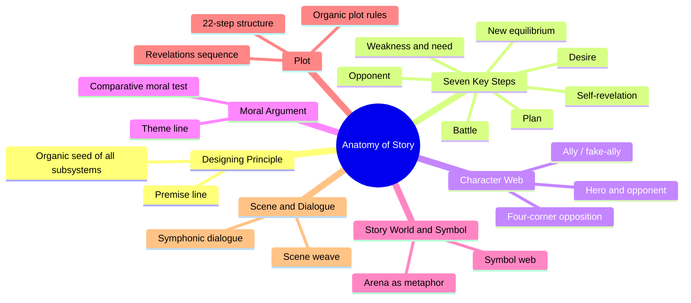
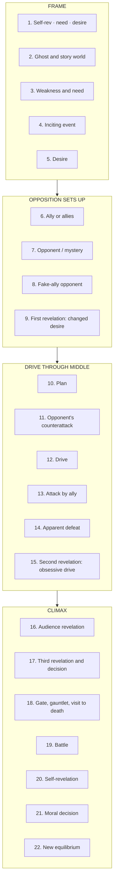
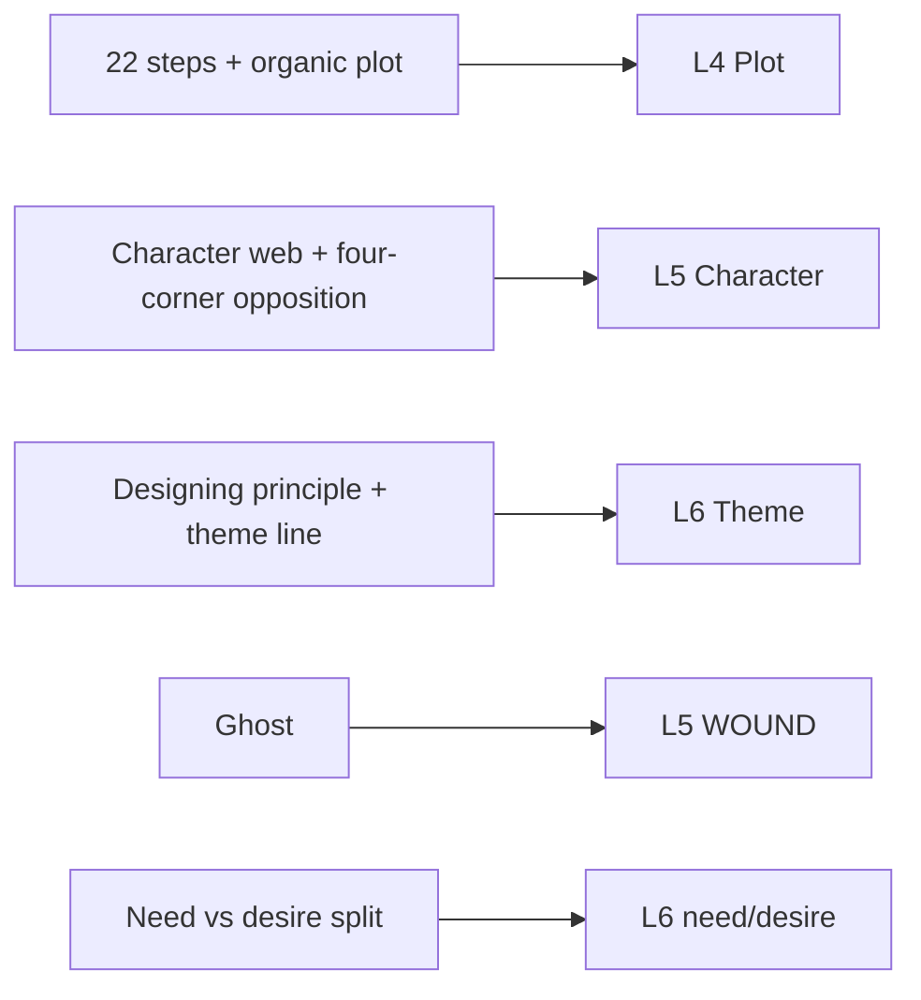
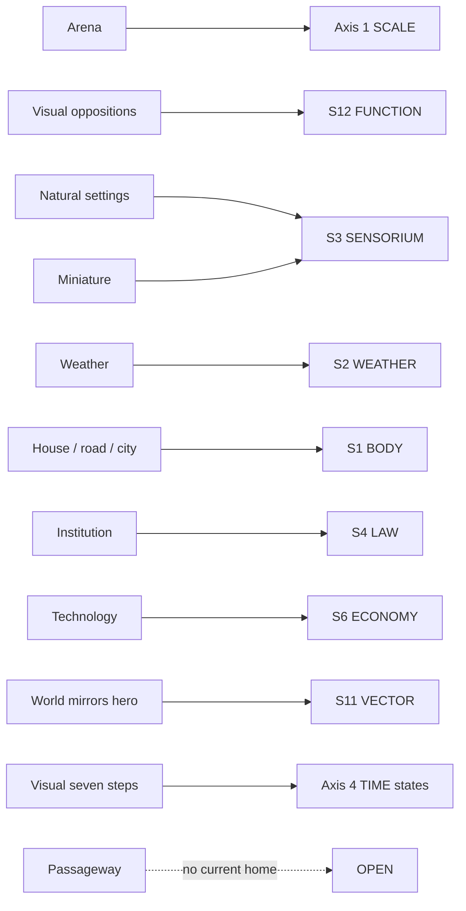

# BVX.0193 — The Anatomy of Story — John Truby (2007)
### Knowledge Entry — Distill

The organic-plot counterweight to Dramatica's structural spine: where the house's ruled model builds a story from a Grand Argument down, Truby builds one from a premise line growing outward like a body — and supplies the most detailed process model in the library for turning that growth into 22 concrete, orderable plot beats.

## TABLE OF CONTENTS
- [Core Thesis](#1-core-thesis)
- [Mind Models](#2-mind-models)
- [Framework](#3-framework--structure)
- [Key Concepts](#4-key-concepts)
- [Heuristics](#5-heuristics--decision-rules)
- [Invariants](#6-invariants)
- [Pitfalls](#7-pitfalls--myths)
- [Application](#8-application)
- [Setting Addendum](#8b-setting-addendum-added-2026-09-16-the-setting-wave)
- [Cross-References](#9-cross-references)
- [Provenance](#10-provenance--confidence)

---

## 1 · CORE THESIS

A story is an **organic body**, not a machine: every part — premise, character web, moral argument, world, symbol, plot, scene, dialogue — must grow out of one **designing principle** (a one-line strategy, not a genre template) so the whole reads as a single unit. The engine of growth is the hero's **weakness and need** converting, under pressure from an **opponent**, into a **self-revelation** — and the **22 steps** are that conversion's organic anatomy, not a formula.

---

## 2 · MIND MODELS

*Required. Minimum two diagrams, maximum five.*

**Diagram 1 — the whole argument.**
Caption: *eight subsystems, one designing principle — Truby's "story body" is organs sharing one seed, not stages in a line.*

**Diagram 2 — the central mechanism (the 22 steps, a process grouped by phase).**
Caption: *the 22 steps are four movements, not 22 equal beats — Ghost/Need frames the ends, Plan/Drive/Ally is the long middle, Reveal is the constant pulse threaded through all of it.*

**Diagram 3 — mapped onto the Command's story spine.**
Caption: *Truby's three big systems key to three spine levels — plot to L4, the character web to L5, the moral argument to L6; none of the three IS Dramatica's element, each is a lens on it.*

---

## 3 · FRAMEWORK / STRUCTURE

Truby's "story body" is eight interlocking subsystems, each its own chapter, all sharing one seed:

| Subsystem | Governing question | Chapter |
|---|---|---|
| **Premise** | What's the one-line idea, and what is its designing principle? | 2 |
| **Seven key steps** | What is the minimum organic skeleton? | 3 |
| **Character web** | Who else exists to define the hero by contrast? | 4 |
| **Moral argument** | What is the story's view of right action? | 5 |
| **Story world** | What physical arena expresses the designing principle? | 6 |
| **Symbol web** | What recurring images carry meaning wordlessly? | 7 |
| **Plot** | How do 22 steps and a revelations sequence weave the events? | 8 |
| **Scene / dialogue** | How does a single scene carry all of the above at once? | 9–10 |

**The seven key steps** (Ch.3) are the minimum organic chain — weakness and need → desire → opponent → plan → battle → self-revelation → new equilibrium. **The 22 steps** (Ch.8) are the same chain expanded to production detail; every 22-step story is still a seven-step story underneath.

---

## 4 · KEY CONCEPTS

| Concept | What it is | Why it matters |
|---|---|---|
| **Designing principle** | *Story process + original execution*, stated in one line — the "seed" the whole story grows from | Distinguishes a premise (what happens) from what makes the story *original*; e.g. *Tootsie*'s premise is a disguised actor falling in love, its designing principle is "force a male chauvinist to live as a woman" |
| **Weakness and need** | The hero's flaw and what he must fix within himself; split into **psychological need** (hurts only him) and **moral need** (hurts others) | The wellspring of the story — the hero must not know his need until the self-revelation, or the story is already over |
| **Ghost** | An unresolved event from the hero's past acting as a **counterdesire** — his internal opponent, "sailing with a corpse in the cargo" | Better than "backstory": it's the one wound the audience needs, dramatized structurally rather than dumped as exposition |
| **Character web** | All characters connect via four channels: **story function, archetype, theme, opposition** — a character is defined by who he is not | Corrects the single-biggest writer's mistake: building the hero in a vacuum |
| **Character web roles** | Hero · Opponent · Ally · Fake-ally opponent · Fake-opponent ally · Subplot character | Each has a precise function; the fake-ally opponent is the most useful complication (torn by a real dilemma); the subplot character contrasts, doesn't assist |
| **Four-corner opposition** | Hero plus three opponents pushed to distinct value-corners, each attacking the hero's weakness a different way, each in conflict with the other three | Multiplies conflict from linear (hero vs. one opponent) to a web, without losing organic unity — because all four still orbit one weakness |
| **Designing principle for theme** | The theme line is found the same way as the premise: condense the designing principle's *moral* effects to one line | Theme isn't a message bolted on — it's structural position, expressed through what actions do to people, not through dialogue |
| **Organic plot** | Events that are causally connected, essential, proportionate, and feel hero-generated rather than author-imposed — "no part can be displaced without ruin to the whole" (Poe) | The test for whether a plot is designed or merely sequenced |
| **Revelations sequence** | Reveals must be logical (occur when the hero would learn them), build in intensity, and come at increasing pace; the strongest reveal is a **reversal** | Plot's real spine is what the audience learns and when — not what happens |
| **Double reversal** | Give the opponent, not just the hero, a self-revelation at the climax, and connect the two lessons | Prevents a story where only the hero is human; the author's moral vision is "the best of what both characters learn" |

---

## 5 · HEURISTICS & DECISION RULES

| Situation | Do this | Not this |
|---|---|---|
| Story feels generic | Find the designing principle by inducing it from the premise | Pick a genre and impose its beats |
| Hero feels flat / alone | Build the character web — define him against opponent, ally, fake-ally, subplot | Develop the hero in isolation, then add supporting cast |
| Cast opposition feels thin | Push four characters to four value corners, each attacking a different facet of the hero's weakness | Oppose the hero on one axis only (good vs. evil) |
| Theme feels preachy | Express it through structure — what actions do to people | Put it in a character's mouth as a stated moral |
| Plot feels mechanical | Ask whether each event is causally connected, essential, proportionate, and hero-generated | Ask only "does this scene fit the outline" |
| Applying the 22 steps | Treat step count and order as a guide for *this* story's organic unfolding | Force every story through all 22 in strict fixed order |
| Ordering revelations | Sequence them to build in intensity and pace, ending with a reversal if possible | Reveal information in whatever order is convenient to write |
| Climax feels flat | Give the opponent a self-revelation too (double reversal) | Let only the hero learn something |
| Hero seems too virtuous or too victimized | Give him a moral need — a way his flaw actively hurts others | Give him only a psychological (self-harming) flaw |

---

## 6 · INVARIANTS

1. **The designing principle organizes everything** — premise, theme, world, symbol all derive from the same one-line seed.
2. **The hero cannot know his need at the start.** Awareness of it *is* the self-revelation; knowing it early ends the story.
3. **A character is defined by contrast**, not in isolation — the web, not the individual, is the unit of character design.
4. **Theme is expressed through structure and action**, not through dialogue stating a moral.
5. **An organic plot is causally connected, essential, and proportionate** in every event; nothing can be removed without damage.
6. **The 22 steps are an organic order, not a fixed formula** — flexible in count and sequence, but breaking the order too drastically reads as contrived, because it mirrors how humans actually solve life problems.
7. **Revelations must build** — in logic, intensity, and pace — or plot goes slack regardless of event count.

---

## 7 · PITFALLS / MYTHS

- Treating three-act structure as organic — it's a theatrical convention (the curtain call) with nothing to do with a story's internal logic.
- Confusing plot with story — story is all eight subsystems together; plot is only the event-weaving one.
- Confusing backstory with ghost — the audience needs the one wound that drives the counterdesire, not the hero's whole history.
- Building the hero first and the cast as afterthought — the web must be designed together, each role earning its place by what it reveals about the hero.
- Opposing hero and opponent on a single axis — trivializes both; four-corner opposition with clustered, positive/negative-paired values is the fix.
- Stating the self-revelation aloud in dialogue — a mark of bad writing; the lesson must be dramatized, not announced.
- Treating the 22 steps as a rigid checklist to "hit," in either direction — over-rigid application is as damaging as ignoring the order entirely.

---

## 8 · APPLICATION

- **Spine level:** L4 (plot — the 22 steps, revelations sequence, organic-plot test), L5 (character — the character web, four-corner opposition, ghost as internal opponent), L6 (theme — designing principle as theme-line source, moral vs. psychological need split)
- **12-layer character stack:** L5 WOUND (the ghost, supporting) — Truby's ghost is the same open-wound mechanism WOUND already holds, named structurally rather than clinically; do not treat it as a clinical source, only as confirmation the mechanism is storytelling-standard.
- **plot_systems:** direct feed candidate for `04_PLOT_SYSTEMS/` (the Command's next domain, currently empty) — the 22 steps are the most granular *ordered* plot-beat model in the library and a strong first occupant once that domain stands up. The revelations-sequence rules (logical order, building intensity, increasing pace, reversal as the strongest reveal) are a ready-made scene-grammar layer beneath the signpost level.
- **Setting:** the story-world chapter (Ch.6, sampled not distilled here) treats the arena as a metaphor tied to the designing principle — relevant to `03_SETTING_SYSTEMS/` if a deeper pass is wanted later.

Truby never mentions Dramatica; the L4/L5/L6 keying above is this distill's synthesis, mapping his vocabulary onto the ruled spine per the comparative-tree doctrine (rivals map on as lenses, Dramatica stays the tree). The clearest house use is diagnostic: run a drafted character web through four-corner opposition to check whether antagonists are actually pushed to distinct value-corners, and run a drafted plot through the organic-plot test (causally connected / essential / proportionate / hero-generated) before trusting it structurally sound. The ghost concept is a fast way to audit whether L5 WOUND entries are dramatized as a counterdesire or merely reported as backstory.

---

## 8b · SETTING ADDENDUM (added 2026-09-16, the setting wave)

*Sourced from Ch.6, "Story World" — sampled at heading level only in the original pass (see §10); pulled full-text for this addendum.*

Truby's Chapter 6 argues that the story world is not backdrop but a third body growing from the same designing principle as premise and character: an arena bounded like a stage, textured by natural settings, man-made spaces, and technology, must mirror the hero's psychology one-to-one — an enslaving world for an enslaved hero, a freeing one at the endpoint. The world's own development, tracked through natural time (seasons, holidays) and through a "visual seven steps" that assigns a distinct subworld to each of the seven key structure beats, is the mechanism by which setting stops being scenery and starts pressuring the story.

**Truby's setting tools, mapped onto the setting system:**

| Truby tool | What it does | Setting-system axis / S-layer |
|---|---|---|
| The arena | A single bounded place ("surrounded by some kind of wall"); four techniques (umbrella, single-line journey, circular journey, fish-out-of-water) keep multiple locations organically one | Axis 1 SCALE — the bounding address a scene plays within |
| Oppositions within the arena | Character-web value conflicts (Gatsby's four-corner opposition, Pottersville/Bedford Falls) translated into visual/spatial oppositions | S12 FUNCTION + Axis 3 FUNCTION → Argue mode |
| Natural settings catalogue | Fixed connotation bank for ocean, forest, jungle, desert/ice, island, mountain, plain, river — each "carries a multitude of meanings" | S3 SENSORIUM |
| Weather correlations | Lightning = passion/terror, rain = sadness, fog = mystery — "a powerful physical representation of the inner experience" | S2 WEATHER |
| Man-made spaces (house, road, city) | House = intimacy, safety-vs-adventure, cellar-vs-attic; city-as-institution = the social machine in microcosm | S1 BODY + S4 LAW (institution) |
| Miniature | A society shrunk down that shows "levels of order" at a glance | S3 SENSORIUM (condensed presentation) |
| Passageway between worlds | A threshold device (rabbit hole, wardrobe, mirror) that moves a character between two subworlds and signals "the rules are about to change" | No current axis/layer — see finding below |
| Technology (tools) | Extensions of the human form; shows how a character's power is magnified and how a system exercises power over him | S6 ECONOMY |
| World mirrors the hero | The world's arc (slavery↔freedom, seven named hero/world correlation patterns) tracks the hero's arc one-to-one | S11 VECTOR |
| The visual seven steps | Each of the seven key structure beats gets its own distinct subworld | Axis 4 TIME (dated states) / the SCENE CARD's `setting: slice + state` field |

**Diagram 4 — Truby's story-world toolkit mapped onto the setting system.**
Caption: *most of the toolkit slots straight onto an existing axis or layer — only the passageway falls outside the four-axis/twelve-layer grid.*

**Quotes (Ch.6, verbatim):**

- "You don't create characters to fill a story world, no matter how fabulous that world may be. You create a story world to express and manifest your characters, especially your hero."
- "Always ask yourself, how is the world of slavery an expression of my hero's great weakness? The world should embody, highlight, or accentuate your hero's weakness or draw it out in its worst form."
- "A passageway... is a kind of decompression chamber, allowing your audience to make the transition from the realistic to the fantastic. It tells the audience that the rules of the story world are about to change in a big way."

**What the setting system does not yet hold:** Truby's passageway between worlds — a liminal threshold device that signals a rules-change when a character crosses between two subworlds — has no home in the four axes or twelve layers; candidate for the SSOT's OPEN list.

---

## 9 · CROSS-REFERENCES

| Related entry | Relation |
|---|---|
| [[BVX.0064]] | McKee, *Character* — both build cast from contrast/contradiction against the protagonist; McKee's dimensions and Truby's character-web functions are complementary lenses on the same L5 problem |
| [[BVX.0191]] | Truby, *The Anatomy of Genres* — same author's genre-as-moral-argument-tradition model, the L7 counterpart to this entry's L4–L6 |
| [[BVX.0090]] | Dramatica Dictionary — the ruled spine's element vocabulary that this entry's character-web/archetype terms map onto as a lens, not a source |

---

## 10 · PROVENANCE & CONFIDENCE

Full text, pdftotext extraction, 494pp, ~140,000 words, clean text layer with a legible TOC and chapter breaks. Distilled from: Ch.1 (Story Space, Story Time — intro), Ch.2 (Premise — designing principle, sampled), Ch.3 (The Seven Key Steps — full extraction of all seven step definitions), Ch.4 (Character — character web, web-by-function roles, four-corner opposition, sampled beyond that), Ch.5 (Moral Argument — intro and theme-line-from-designing-principle, sampled), Ch.8 (Plot — organic plot, plot types intro, full 22-step list with all 22 step names, deep extraction of steps 1, 2, 18, 20–22, revelations sequence). Chapters 6, 7, 9, and 10 (Story World, Symbol Web, Scene Weave, Scene Construction/Dialogue) were sampled only at the TOC/section-heading level, not extracted — **a deeper pass on those four would strengthen the Setting mapping and would feed a future scene-grammar entry under `04_PLOT_SYSTEMS/`.** Chapter 11 (The Never-Ending Story) not read. Status `complete` reflects the load-bearing extraction of the book's two central systems (the 22-step plot process and the character web); upgrade with a request to pull Chapters 6, 7, 9–10 if the remaining subsystems are wanted.

Source is an orphan PDF — no Zotero key; stored in the Drive storage folder **HWSUWSFB**, not yet linked to a Zotero record.

The L4/L5/L6 spine keying and the `feeds:` wiring are this distill's synthesis, built against the ruled comparative-tree doctrine (`ShroomsQ/_CANON/_SSOT/01_NARRATIVE_FRAMEWORKS/📐 ssot_01_story_spine_comparative_tree.md`) — inference from Truby's method, not asserted by the source itself.

## META
- Template: BVX-LEARN-v4.0
- Source classification: full-text book, partial deep extraction (2 of 8 subsystem chapters fully mined, 3 sampled, 3 TOC-only)
- Setting addendum 2026-09-16 from ch. 6.
- Created / Updated: 2026-09-16
