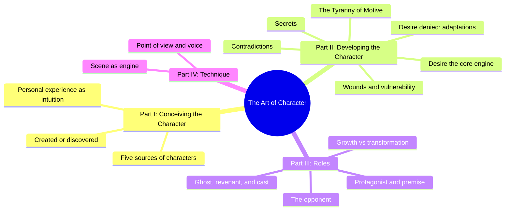
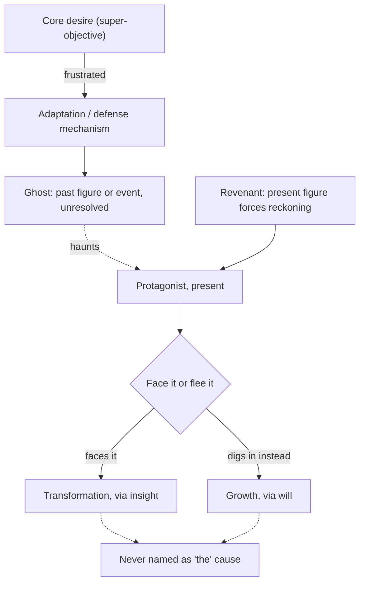
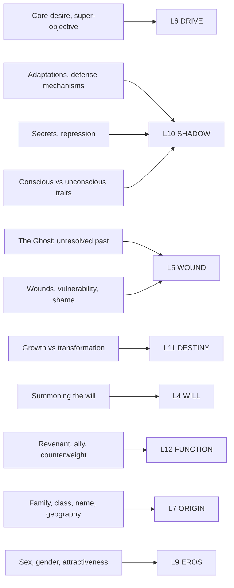

# BVX.0196 — The Art of Character: Creating Memorable Characters for Fiction, Film, and TV — David Corbett (2013)
### Knowledge Entry — Distill

A working novelist and screenwriting teacher's field manual built on five recurring cornerstones (desire, its denial, wounds, secrets, contradictions) and one governing warning: explaining a character's motive too cleanly kills her.

## TABLE OF CONTENTS
- [Core Thesis](#1-core-thesis)
- [Mind Models](#2-mind-models)
- [Framework](#3-framework--structure)
- [Key Concepts](#4-key-concepts)
- [Heuristics](#5-heuristics--decision-rules)
- [Invariants](#6-invariants)
- [Pitfalls](#7-pitfalls--myths)
- [Application](#8-application)
- [Cross-References](#9-cross-references)
- [Provenance](#10-provenance--confidence)

---

## 1 · CORE THESIS

A character comes alive not through consistent traits but through the collision of five forces: desire, its denial, wounds, secrets, and contradictions, played out in scenes rather than explained in exposition. The writer's job is to build enough intuitive substance that the character can act unpredictably and still feel true, defying what Corbett calls the Tyranny of Motive.

---

## 2 · MIND MODELS

*Required. Minimum two diagrams, maximum five. See template §C for the rules.*

**Diagram 1 — the whole argument.**
Caption: *four parts, one throughline: conceive the person, break her open with five cornerstones, cast her into a role, then render her in scene and voice.*

**Diagram 2 — the central mechanism.**
Caption: *desire-denied, wounds, and secrets all resolve to the same engine: a Ghost anchors the failure in the past, a Revenant forces it into the present, and the choice between them is growth or transformation, never a stated cause.*

**Diagram 3 — mapped onto the Command's 12-layer character stack.**
Caption: *Corbett's real weight sits on L10 SHADOW and L5 WOUND, the adaptation/ghost machinery; DRIVE, FUNCTION, DESTINY, and WILL carry the rest, and only two thin chapters touch ORIGIN or EROS.*

---

## 3 · FRAMEWORK / STRUCTURE

Four parts, twenty-five chapters, one hinge at chapter 10.

| Part | Chapters | Governing question |
|---|---|---|
| **I · Conceiving the Character** | 1 Fingering Smoke · 2 Summoning Ghosts (sources) · 3 The Examined Life | Where does a character come from, and how much is found versus made? |
| **II · Developing the Character** | 4 Five Cornerstones · 5 Desire · 6 Desire Denied · 7 Wounds · 8 Secrets · 9 Contradictions · 10 Tyranny of Motive · 11 Biography from scenes · 12-16 Physical, psychological, sociological nature, politics, quirks | What forces, run through scenes rather than checklists, make this person compelling? |
| **III · Roles** | 17 Protagonist and premise · 18 Three protagonist questions · 19 Protagonist problems · 20 The opponent · 21 Secondary characters | What does this person do once cast into a story's structure, opposite an antagonist and a supporting cast? |
| **IV · Technique** | 22 Scene · 23 Point of view · 24 Voice · 25 Dialog | How is all of the above actually rendered on the page? |

Part II's spine is the five cornerstones (chapter 4 states them, chapters 5-9 each take one), with chapter 10 (Tyranny of Motive) as the explicit warning that runs backward over all five: don't reduce any of this to a stated cause. Part III pivots from person to structure: once the character exists, ch17-18 ask what she wants and whether she'll change, ch19-20 diagnose protagonist failure and build a justified opponent, ch21 derives a cast of functional roles (ghost, revenant, ally, betrayer) from her unresolved history.

---

## 4 · KEY CONCEPTS

| Concept | What it is | Why it matters |
|---|---|---|
| **The Five Cornerstones** | Desire, desire denied, wounds, secrets, contradictions: the five questions Corbett returns to for every character | The organizing spine of Part II; a rushed checklist run through these five still beats a trait-grab-bag |
| **The Tyranny of Motive** | The inescapable need to know what a character wants and why, and the trap of over-explaining it | *"Explaining your character kills her"*; McKee's line, that nailing motive to a specific cause diminishes the character, is Corbett's proof text (ch10) |
| **Adaptations / defense mechanisms** | Vaillant's four-tier hierarchy (psychotic, immature, neurotic, mature), built on Anna Freud, for how people respond to frustrated desire | Gives desire-denial a graded, non-binary vocabulary; even "healthy" adaptations like sublimation are dramatically useful, not just pathology |
| **The Ghost and the Revenant** | The ghost is a past character or event that embodies an unresolved failure; the revenant is a present character who forces the reckoning | Corbett's unifying mechanism across desire-denied, wounds, and secrets; almost always best cast as actual people, not internal rumination |
| **Growth vs. transformation** | Growth strengthens an existing capacity through will ("digs deeper"); transformation removes denial through insight ("tears down a wall") | Distinguishes two families of character arc without requiring every protagonist to have an epiphany |
| **The three protagonist questions** | Can I get what I want? Who am I? What do I have to change about myself to get what I want? | Diagnoses which kind of arc a story is actually telling, and whether growth, transformation, or both is in play |
| **Premise and counterpremise** | The moral assertion the story proves through the protagonist's action, paired with its opposite embodied in the opponent (built on Egri's Unity of Opposites) | Reframes "theme" as a lived contest between two ways of life rather than a stated moral |
| **Justifying the opponent** | The opponent needs a fully inhabited, self-justifying worldview, not cartoon villainy, even when genuinely evil | The most compelling drama is good versus good; an opponent argued from the inside raises the stakes for everyone |
| **Steadfast character** | A protagonist who does not change behavior but still undergoes a change in insight, attitude, or acceptance of cost | Refusal to change is a choice, and a choice is inherently dramatic; steadfastness is not stasis |
| **Secondary character taxonomy** | Ghost, revenant, crucial ally, counterweight, betrayer, visitor, the village | A working vocabulary for deriving supporting cast from the protagonist's unresolved need, distinct from but structurally parallel to McKee's Cast Map |

---

## 5 · HEURISTICS & DECISION RULES

| Situation | Do this | Not this |
|---|---|---|
| A character feels flat or generic | Run the five cornerstones: what does she want, how does she handle not getting it, what wound, what secret, what contradiction | Add more biographical trivia or a longer trait list |
| You know exactly why a character does something | Withhold the stated cause; let the action arise from the whole of her personality across all five cornerstones | Spell out the single motive in narration or dialog |
| A protagonist's core desire is frustrated | Show a scene of the frustration and let an adaptation (denial, projection, sublimation, etc.) surface organically | Assert the character's coping style in exposition |
| A character's backstory feels like inert data | Embody the unresolved history in one Ghost character, and assign a Revenant to force the reckoning in the present | Deliver the backstory as narrated history with no scene |
| Writing an antagonist | Build his self-justifying worldview until you could argue his side convincingly | Give him evil as an unexplained given |
| Deciding whether a protagonist should change | Ask which of the three protagonist questions the story is actually posing | Assume every protagonist needs a transformation arc |
| A "steadfast" character isn't landing | Dramatize the internal cost of the choice not to change | Treat refusal to change as an absence of arc |
| A secondary character is flattening into a device | Give her the same freedom, contradiction, and specificity as the leads, even if she stays functionally transparent | Let her function alone carry the characterization |
| A scene explaining a character's psychology drags | Cut the explanation; trust intuition and let the reader infer motive from action | Keep the exposition because it's "important backstory" |

---

## 6 · INVARIANTS

1. Desire, not a trait inventory, is what puts a character in motion; without it, nothing stands in her way.
2. Every frustrated desire produces an adaptation, ranging from psychotic through mature, and even mature adaptations can be dramatically rich.
3. A character's core response to the frustration of her *central* desire is more diagnostic than her response to minor, situational setbacks.
4. Vulnerability, not likability, is what pulls an audience toward a character.
5. Secrets and repressed traits differ in degree, not kind: both are governed by the same fear of exposure.
6. Contradiction is not decoration; it is how complexity, subtext, and suspense get built into a character in a single stroke.
7. Explaining a character's motive too precisely diminishes her; the Tyranny of Motive is defied by intuition, not analysis.
8. The protagonist must be the character who most fully carries the story's moral premise, whether or not she accepts or even perceives it.
9. The most compelling opposition is good versus good; even genuine evil needs a self-justifying interior.
10. A steadfast character still changes in insight or acceptance, even when behavior holds constant; a decision not to change is still a decision.

---

## 7 · PITFALLS / MYTHS

- Granting a protagonist only mature adaptations, producing a psyche that meets every setback with wit and resolve.
- Treating psychoanalytic labels (repression, projection, sublimation) as a diagnosis to state rather than a scene to dramatize.
- Making the ghost a vague historical condition instead of a specific character or event.
- Letting the revenant exist only as internal rumination rather than an actual person in the story.
- Believing a "tragic flaw" (jealousy, pride, ambition) fully explains a character's actions; the tidier the cause, the less compelling the crime (Cain versus Oedipus).
- Writing an opponent as banally wicked instead of self-justifying, even in stories of genuine atrocity.
- Assuming every protagonist arc requires a lightning-bolt transformation rather than incremental growth.
- Treating a steadfast character's lack of behavioral change as a structural failure rather than a dramatized choice.
- Over-intellectualizing characterization until the character reads as an idea rather than a person.
- Withholding information purely as a hide-and-seek device (Reveal to Conceal) instead of building genuine mystery from freedom and unpredictability.

---

## 8 · APPLICATION

- **Spine level:** L5 (character) primary; L6 (theme) supporting, earned by the sustained treatment of premise and counterpremise (ch17-18) as a lived moral argument between protagonist and opponent, not a stated moral.
- **12-layer character stack:** primary on **L6 DRIVE** (core desire, Tyranny of Motive) and **L10 SHADOW** (adaptations, secrets, conscious/unconscious contradiction); supporting on **L5 WOUND** (the Ghost), **L12 FUNCTION** (cast-role taxonomy), **L11 DESTINY** (growth vs. transformation), **L4 WILL** (summoning the will, the steadfast character); contextual on **L7 ORIGIN** and **L9 EROS** — see Diagram 3.
- **plot_systems:** the Ghost/Revenant pairing is Corbett's version of a wound-activation mechanism: it requires a *relational* slot (a pointer to another character) rather than a same-character attribute, and it recurs across three of the five cornerstones (desire-denied, wounds, secrets) as one mechanism under three names.
- **Setting:** touched lightly in ch14 (geography, home, "tribe") as sociological input; not developed as a system of its own.

Where Corbett and Davis (BVX.0075) **agree**: both build the character from circumstance before plot, both treat desire/super-objective as the engine, and both use a want-versus-its-opposite structure (Davis's will/counter-will, Corbett's desire/adaptation) as the internal-conflict primitive. Where they diverge: Davis's counter-will is an internal, single-character opposition; Corbett's Ghost/Revenant is an externalized, two-character mechanism, closer in shape to a relationship than a trait.

Where Corbett and McKee (BVX.0064) **agree**: both warn against over-explaining a character (McKee's line on motive-to-cause is Corbett's proof text verbatim), both insist the opponent needs a self-justifying interior for the protagonist to mean anything, and both build a supporting cast whose function is to illuminate the lead. Where they diverge: McKee's unit is the *dimension*, a static contradiction between levels of self, diagnosed once and cast across concentric circles; Corbett's unit is the *cornerstone set*, five different lenses (want, denial, wound, secret, contradiction) applied to one character across the whole book, with contradiction being only one of the five rather than the master mechanism. Corbett's secondary-character taxonomy (ghost, revenant, crucial ally, counterweight, betrayer, visitor) is a third, non-Dramatica vocabulary for the same cast-derivation problem McKee and Dramatica (BVX.0089) also solve.

**For the character system:**
- Adds a five-question completeness rubric (desire, desire-denied, wound, secret, contradiction) usable as a quick audit pass before or after populating the twelve layers on any character.
- Feeds hardest on **L10 SHADOW** (the adaptation hierarchy and secrets) and **L5 WOUND** (the Ghost), which together carry the book's actual argument; DRIVE, FUNCTION, DESTINY, and WILL are real but secondary.
- Argues the twelve layers need a **relational field the current schema doesn't name**: the Ghost and Revenant are not attributes of one character but *pointers to other characters* that a given character's WOUND and DRIVE resolve against, and are currently undiscoverable from a single character sheet. OPEN candidate: `ghost_ref` / `revenant_ref` cross-links on L5 WOUND.
- Argues L11 DESTINY needs a **typed arc field** (growth vs. transformation vs. hybrid) rather than treating "directional growth vector" as undifferentiated; Corbett's distinction (wins through will vs. wins through insight) is a clean binary the layer doesn't currently capture.
- Names the **Tyranny of Motive** as an authoring constraint that applies across all twelve layers at once, not a layer itself: no single layer's value should ever be presented as *the* stated cause of an action. Worth adding as a house rule for how character queries get narrated, not as new schema.

---

## 9 · CROSS-REFERENCES

| Related entry | Relation |
|---|---|
| [[BVX.0075]] | Davis *Creating Compelling Characters*: Davis's will/counter-will is single-character internal opposition; Corbett's Ghost/Revenant externalizes the same conflict into a second character; both converge on desire/super-objective as the engine |
| [[BVX.0064]] | McKee *Character*: Corbett quotes McKee's motive-to-cause warning directly (ch10); McKee's static cross-level dimension and Corbett's five dynamic cornerstones are complementary passes on complexity |
| [[BVX.0193]] | Truby *The Anatomy of Story*: compare Truby's moral-argument web against Corbett's premise/counterpremise (ch17) for deriving a story's moral structure from opposed characters |
| [[BVX.0089]] | Dramatica: Corbett's secondary-character taxonomy (ghost, revenant, crucial ally, counterweight, betrayer) is a third, non-Dramatica vocabulary for cast derivation; compare against Dramatica's throughline characters and McKee's Cast Map |

---

## 10 · PROVENANCE & CONFIDENCE

Distilled from a full pdftotext extraction (309 pages). Read closely: the Introduction; Part I (ch1-3, source materials and intuition); all of Part II's cornerstone chapters (ch4-10: Five Cornerstones, Desire, Desire Denied, Wounds, Secrets, Contradictions, Tyranny of Motive); Part III's role chapters (ch17-18 closely, protagonist/premise and the three protagonist questions; ch19-21 sampled for protagonist problems, the opponent, and secondary-character taxonomy). Part II's physical/psychological/sociological/political/quirks chapters (ch12-16) and Part IV's technique chapters (ch22-25, scene, POV, voice, dialog) were sampled via table of contents and section headers only, not read in full; a deeper pass on ch22 (Scene) and ch24-25 (Voice, Dialog) would likely strengthen the Technique coverage. Status `complete` reflects the load-bearing extraction (Parts I-III); Part IV is thin by comparison.

No catalog discrepancies found: Zotero key 3PE7D395 matches the copyright-page data (David Corbett, Penguin Books, first published 2013, ISBN 978-0-14-312157-2, full title "The Art of Character: Creating Memorable Characters for Fiction, Film, and TV").

## META
- Template: BVX-LEARN-v4.0
- Source classification: full-text pdftotext extraction; Parts I-III read closely, Part IV sampled by headers
- Created / Updated: 2026-09-16
