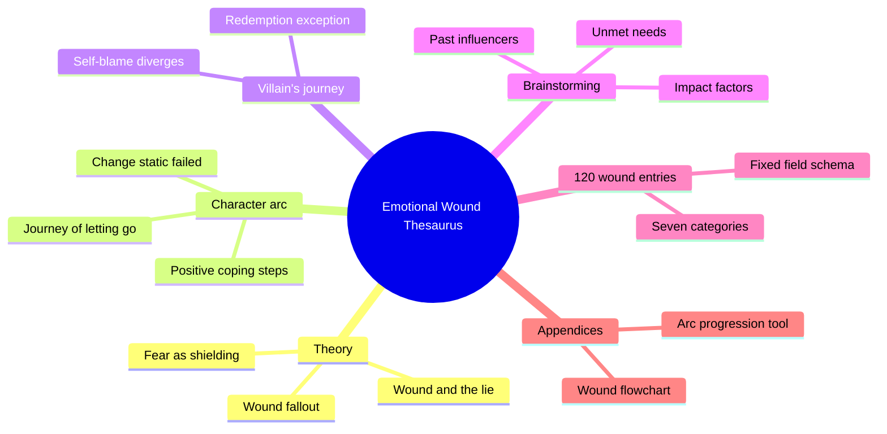
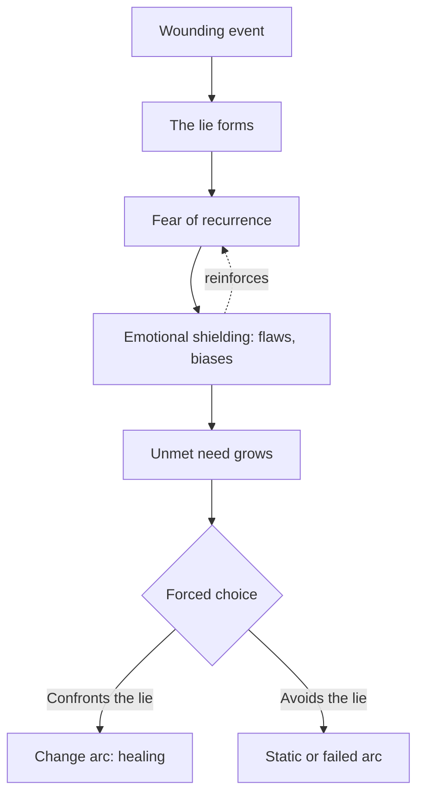
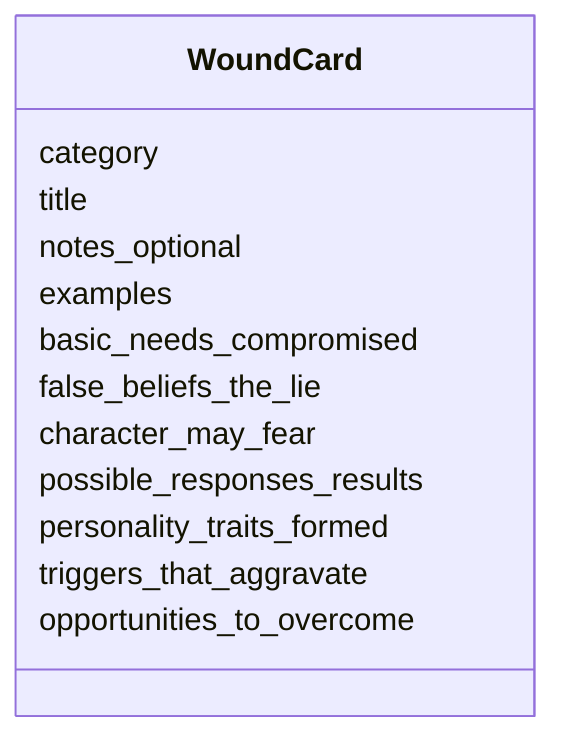
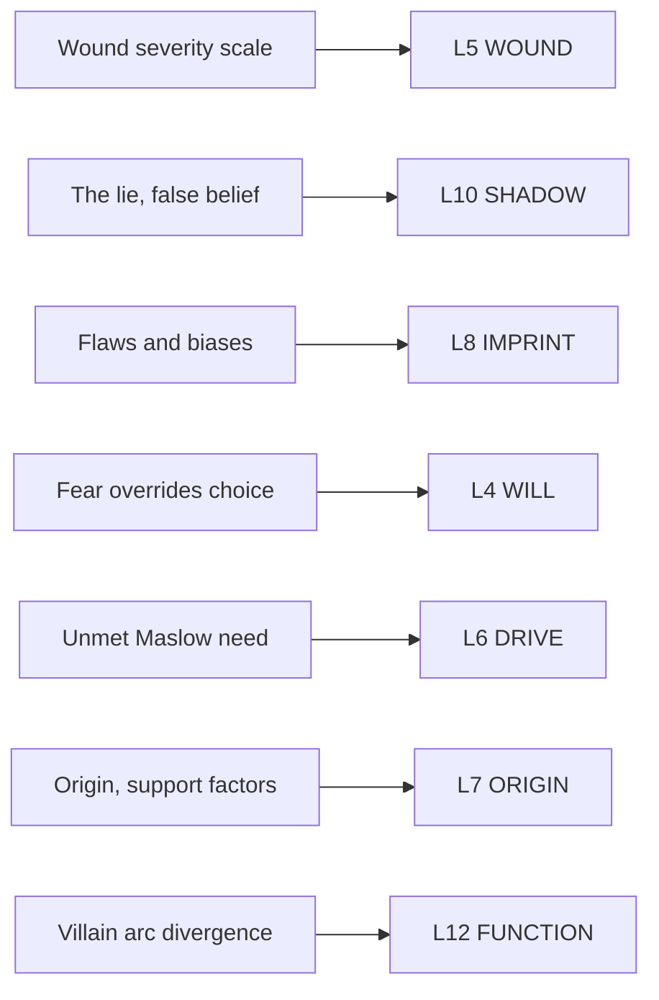

# BVX.0209 — The Emotional Wound Thesaurus: A Writer's Guide to Psychological Trauma — Becca Puglisi & Angela Ackerman (2017)
### Knowledge Entry — Distill

A reference thesaurus of roughly 120 backstory-trauma cards, each built on one fixed schema, preceded by a compact theory of what a wound is, how it manufactures a lie, and how that lie steers a character arc.

## TABLE OF CONTENTS
- [Core Thesis](#1-core-thesis)
- [Mind Models](#2-mind-models)
- [Framework](#3-framework--structure)
- [Key Concepts](#4-key-concepts)
- [Heuristics](#5-heuristics--decision-rules)
- [Invariants](#6-invariants)
- [Pitfalls](#7-pitfalls--myths)
- [Application](#8-application)
- [Cross-References](#9-cross-references)
- [Provenance](#10-provenance--confidence)

---

## 1 · CORE THESIS

An emotional wound seeds a lie the character believes about himself or the world. The lie manufactures fear, fear builds emotional shielding (flaws, biases, avoidance), and shielding blocks an unmet need until a story forces the choice: confront the lie, or stay stuck. Villains run the same mechanism but stall at self-blame.

---

## 2 · MIND MODELS

*Required. Minimum two diagrams, maximum five. See template §C for the rules.*

**Diagram 1 — the whole argument.**
Caption: *the front matter is one continuous machine (wound feeds lie feeds arc); the back matter is 120 instances of the same seven-part card.*

**Diagram 2 — the central mechanism.**
Caption: *the lie is the hinge; everything upstream causes it, everything downstream defends it, and only a forced choice breaks the loop.*

**Diagram 3 — the entry schema.**
Caption: *every one of the 120 cards is the same eleven-field object; only the content changes, never the shape.*

**Diagram 4 — mapped onto the Command's 12-layer character stack.**
Caption: *the book is a single-layer specialist text: nearly everything it says lands on L5, L8, and L10, with L4 and L6 as the mechanism's moving parts.*

---

## 3 · FRAMEWORK / STRUCTURE

Two unequal halves: an eleven-essay theory front matter (~60 pages), then the thesaurus proper (~450 pages, seven categories, roughly 120 wound cards), closed by four appendices.

| Part | Contents | Governing question |
|---|---|---|
| **Front matter (11 essays)** | Self-care · the mirror of fiction · what a wound is · the lie · fear · wound fallout · character arc (three types) · the villain's journey · brainstorming routes · impact factors · revealing through behavior · problems to avoid | How does a dated trauma become a lie, and how does a lie become a story? |
| **Thesaurus (7 categories, ~120 cards)** | Crime and Victimization · Disabilities and Disfigurements · Failures and Mistakes · Injustice and Hardship · Misplaced Trust and Betrayals · Specific Childhood Wounds · Traumatic Events | Given this wound, what does the character believe, fear, do, and need? |
| **Appendices A–D** | Wound flowchart · character arc progression tool · wounding examples from popular stories (Kaffee, Torrance, Hunting, Marlin, Mayo, Woundwort) · backstory wound profile tool | How do I apply this to my own character, on paper? |

The front matter's own spine is causal, not topical: wound causes lie, lie causes fear, fear causes shielding, shielding blocks a need, an unmet need forces the arc. The villain's journey is a labeled fork off that same spine. Every category intro (one paragraph each) restates the same five moves in that category's register before the cards begin.

---

## 4 · KEY CONCEPTS

| Concept | What it is | Why it matters |
|---|---|---|
| **The wounding event** | A negative experience, or pattern of them, sudden or ongoing, that causes lasting psychological pain | The book's unit of analysis; single events and grinding situations (poverty, a cult childhood) count equally |
| **The lie** (false belief / misbelief) | A self-blaming conclusion reached through flawed logic while the character is vulnerable ("I'm not good enough," "I can't be safe") | The load-bearing mechanism: the lie, not the event, is what has to be defeated for the arc to complete |
| **The fear** | The felt guarantee that the wounding pain will recur unless prevented | Converts the lie into ongoing behavior; "prevention becomes the prime directive" |
| **Emotional shielding / armor** | Flaws, self-limiting attitudes, skewed beliefs, and dysfunctional habits adopted to keep hurt at a distance | What the reader actually sees; the wound itself is usually inferred backward from the shielding |
| **Unmet need** | One of Maslow's five (physiological, safety, love/belonging, esteem, self-actualization) sacrificed to the shielding | The pressure valve; once its cost is unbearable it overrides fear and forces the plot forward |
| **The fatal flaw** | The one shielding trait that most blocks the character's goal | The single trait a change arc must dissolve; naming it is the book's diagnostic payoff |
| **Change / Static / Failed arc** | Three shapes: the wound is overcome, the wound is sidestepped by a plot-driven story, or the attempt to overcome it fails | Sets what "resolution" even means for a given story before a wound is chosen |
| **The villain's journey** | The identical wound-to-shielding pipeline, but stalled: self-blame turns outward, or the character prefers the dysfunction, or a prior attempt at healing failed | Explains antagonists without requiring a separate theory of evil |
| **Wound impact factors** | Nine dials, personality, physical/emotional proximity, responsibility, support, recurrence, compounding events, invasiveness, justice, that set how debilitating a given wound is | Lets a writer tune severity instead of only picking from a fixed list |
| **Revealing by-product** | Fear, self-doubt, over/underreaction, triggers, denied emotion, obsession, dialogue, setting, or a defense mechanism, used to hint at a wound without an info dump | The book's answer to "show, don't tell" applied specifically to backstory |

---

## 5 · HEURISTICS & DECISION RULES

| Situation | Do this | Not this |
|---|---|---|
| Choosing a wound for a change-arc protagonist | Pick one that is debilitating enough to force the fatal flaw | Pick a mild inconvenience the character shrugs off |
| Revealing the wounding event | Show it once, in full (Big Reveal) or in scattered hints (Big Tease), tied to a vulnerable or connected moment | Deliver it as an early info dump or an unearned prologue |
| Sustaining the wound's presence mid-story | Rotate fear, triggers, denied emotion, and a defense mechanism as breadcrumbs | Reference the event only once and never again |
| Writing a villain | Give him the same wound pipeline, stalled at self-blame or a failed healing attempt | Leave him "evil for evil's sake" with no backstory logic |
| Making the wound credible | Confirm it connects to the fatal flaw, motivates real choices, and is all-consuming | Let the character bounce back with no lasting behavioral cost |
| Ending the wound's arc | Spread the confrontation with the lie across the whole story, paced through small wins and a black moment | Resolve the lie abruptly in one late scene |
| Deciding how much backstory to build | Brainstorm through past influencers, unmet needs, secrets, and biases until a pattern (not an event list) emerges | Dredge every bad memory the character could plausibly have |
| Sizing a wound's severity | Dial personality, proximity, responsibility, support, and recurrence up or down against the nine impact factors | Treat every instance of a category (e.g. every carjacking) as equally damaging |

---

## 6 · INVARIANTS

1. Every wounding event carries a lie; the lie, not the event, is what the character arc must resolve.
2. Fear generated by a wound is preventive, not reactive: its whole aim is to stop the pain from recurring.
3. Emotional shielding is functionally a set of flaws, even when the character experiences it as protection or even a strength.
4. An unmet need eventually outweighs fear; that crossover point is what forces plot movement.
5. A villain's arc follows the identical pipeline as a hero's; the difference is a stall, not a different mechanism.
6. Wound severity is not fixed by category; the nine impact factors modulate how debilitating any given instance is.
7. Showing (behavioral by-products) is the book's default over telling (info dumps) for revealing a wound.
8. A wound in a change-arc story must connect to the fatal flaw, motivate real choices, and be all-consuming, or it isn't doing narrative work.

---

## 7 · PITFALLS / MYTHS

- Info-dumping the wounding event, especially in an opening prologue, instead of narrowing it and varying the reveal technique.
- A poorly staged flashback dropped too early, before the reader has any empathy bank to draw on.
- A prologue used out of habit rather than necessity, with a jarring, unsmoothed jump back to the present.
- A wound picked for a change arc that isn't actually all-consuming, so the character recovers with no visible cost.
- A wound disconnected from the fatal flaw, so its reveal produces no "aaaaaah" of recognition in the reader.
- Resolving the lie abruptly, which reads as a structural failure rather than an earned turn.
- Treating a villain as inherently evil instead of running his wound through the same pipeline as the hero's.
- Assuming every instance within a wound category (e.g. every home invasion) does equivalent damage, instead of tuning it with the impact factors.
- Believing a fearless character is more realistic; the book treats wounds as "the great equalizer" no character is immune to.

---

## 8 · APPLICATION

- **Spine level:** L5 (story-spine's Character/Wound level; the book operates entirely within a single character's psychology, never at plot-structure levels).
- **12-layer character stack:** primary on **L5 WOUND** (severity scale, categories) and **L6 DRIVE** (unmet need); supporting on **L8 IMPRINT** (shielding), **L10 SHADOW** (the lie), **L4 WILL** (fear overriding resolve); contextual on **L7 ORIGIN** (impact factors) and **L12 FUNCTION** (villain divergence) — see Diagram 4.
- **plot_systems:** the wound-to-arc pipeline is this library's most literal restatement of L5's own SSOT clause ("high WOUND reduces effective WILL... under trigger conditions"); it converts that one-line rule into a nine-factor severity dial and a 120-instance lookup table.
- **Setting:** untouched directly; triggers and settings-as-reveal-vehicles (a prop, a location) are treated as symptoms of the wound, not as world-building in their own right.

This book sits downstream of Davis (BVX.0075) and beside Truby (BVX.0193) on the same terrain from different angles. Davis's will/counter-will is the moment-to-moment engine of internal conflict; this book supplies the *content* that fills Davis's counter-will slot, the wound is why the counter-will exists at all, and the lie is its specific shape. Truby's "ghost" is this book's wounding event by another name, an open wound acting as a counterdesire; where Truby treats the ghost as one structural beat inside 22 steps, this book expands that single beat into its own complete taxonomy (categories, severity factors, reveal techniques). McKee's self-delusion gap (BVX.0075's supporting L10 note, sourced from Davis quoting McKee) and this book's "the lie" name the same SHADOW-layer phenomenon: a false self-belief the audience sees through before the character does.

**For the character system:**
- Adds a severity dial the twelve layers currently lack: WOUND is defined on a 0–10 scale, but this book is the library's first source giving concrete, tunable factors (proximity, responsibility, support, recurrence, compounding events, invasiveness, justice) for actually setting that number instead of eyeballing it.
- Feeds **L5 WOUND** hardest: category, severity factors, and the lie-fear-shielding-need chain are near-total overlap with what the SSOT declares WOUND governs.
- The eleven-field entry schema (Diagram 3) is a strong candidate for L5's own field list almost unchanged: wound category, concrete instances, needs compromised, the lie, associated fears, behavioral fallout, personality shift (attributes/flaws), triggers, and arc-entry opportunities.
- OPEN candidate: the twelve layers have no named field for a **reveal strategy** (Big Reveal vs. Big Tease vs. breadcrumb by-product) or a **trigger list** distinct from the wound itself; both are load-bearing here and currently have no home layer.
- OPEN candidate: **villain-arc divergence** (self-blame turned outward, a failed prior healing attempt, or preference for the dysfunction) is a real fork this book names explicitly, but the twelve-layer stack has no field capturing *why* a character's L5-to-L8 pipeline stalls instead of resolving; L12 FUNCTION currently only records the outcome role, not the mechanism of the stall.

---

## 9 · CROSS-REFERENCES

| Related entry | Relation |
|---|---|
| [[BVX.0075]] | Davis's will/counter-will is the engine this book's wound fuels; the wound supplies the content of Davis's "great fear" and counter-will, this book is the taxonomy behind that one paragraph |
| [[BVX.0193]] | Truby's "ghost" (an open wound acting as a counterdesire, one beat in 22 steps) is this book's wounding event expanded into a full standalone taxonomy of category, severity, and reveal technique |
| [[BVX.0064]] | McKee's self-delusion gap (character belief vs. audience belief) and this book's "the lie" name the same SHADOW-layer mechanism from opposite directions, dramatic irony vs. clinical false belief |

---

## 10 · PROVENANCE & CONFIDENCE

Distilled from a full pdftotext extraction (512 pages, ~112,000 words). The front matter (all eleven essays, roughly the first 60 pages) was read in full and closely, including the Paul case study, the villain's journey, all nine brainstorming routes, all nine impact factors, the reveal techniques and defense mechanisms, and all five "problems to avoid." The thesaurus body (approximately 120 entries across the seven listed categories) was not read cover-to-cover; the entry schema in Diagram 3 was confirmed by direct sampling of eight cards spread across four categories (Crime and Victimization: A Carjacking; Failures and Mistakes: Failing to Save Someone's Life; Misplaced Trust and Betrayals: Finding Out One Was Adopted, Finding Out One's Child Was Abused) plus the four appendices and the closing wounding-examples table (Kaffee, Torrance, Hunting, Marlin, Mayo, Woundwort). One schema variant was found and noted: a minority of cards open with an optional `NOTES:` framing paragraph before `EXAMPLES:`; this is folded into the schema as `notes_optional`. Individual entry content was not transcribed per instruction. `feeds:` layer mappings and the SSOT cross-references were checked directly against `ShroomsQ/_CANON/_SSOT/02_CHARACTER_SYSTEMS/ssot_02_character_systems_vertical_slice.md` lines 39–67 (the 12-layer domain declarations). No catalog discrepancies were found against the Zotero record (title, subtitle, both authors, and 2017 year all match the extracted text and cover page).

## META
- Template: BVX-LEARN-v4.0
- Source classification: full-text front matter (close read) + structural sampling of the thesaurus body (8 entries, 4 categories, 4 appendices) via pdftotext extraction
- Created / Updated: 2026-09-16
