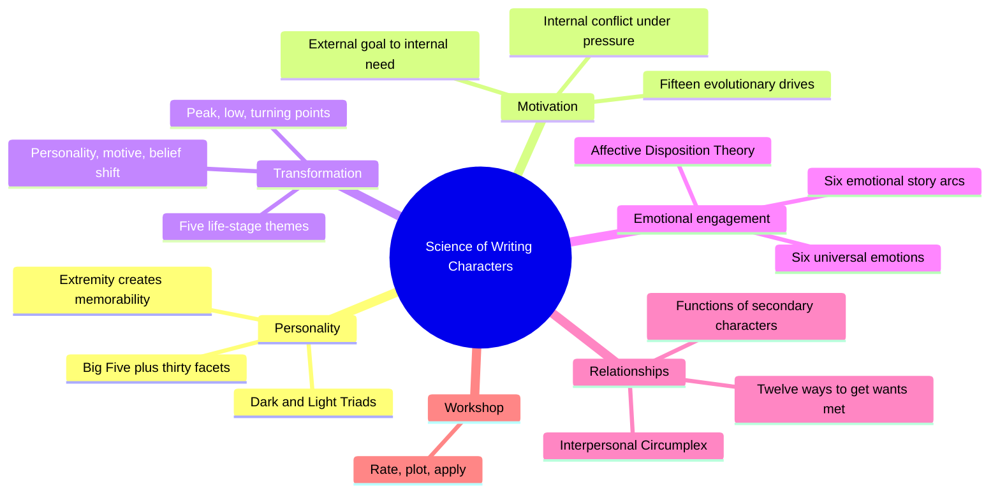
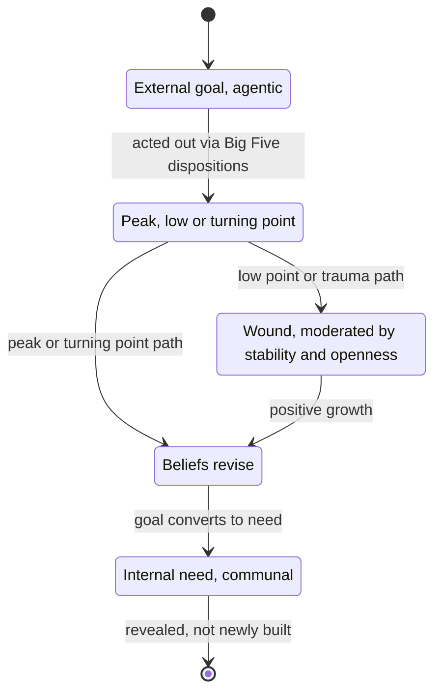
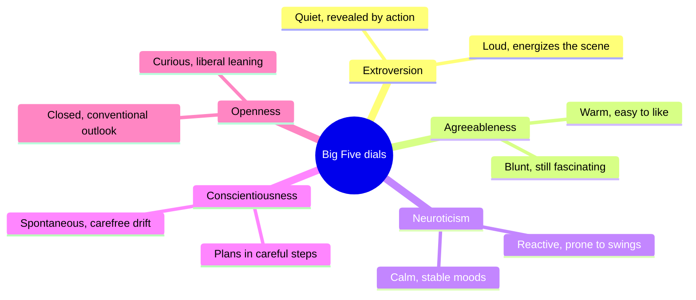
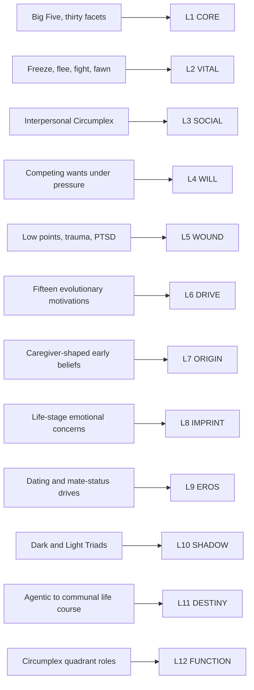

# BVX.0233 — The Science of Writing Characters: Using Psychology to Create Compelling Fictional Characters — Kira-Anne Pelican (2020)
### Knowledge Entry — Distill

A screenwriting consultant's synthesis of six psychology subfields (personality, evolutionary, developmental, narrative, media, neuroscience) into one operating claim: characters are Big Five profiles running evolutionary motivations, broken and mended by dated life events, read by audiences through moral bookkeeping rather than mirrored emotion.

## TABLE OF CONTENTS
- [Core Thesis](#1-core-thesis)
- [Mind Models](#2-mind-models)
- [Framework](#3-framework--structure)
- [Key Concepts](#4-key-concepts)
- [Heuristics](#5-heuristics--decision-rules)
- [Invariants](#6-invariants)
- [Pitfalls](#7-pitfalls--myths)
- [Application](#8-application)
- [Cross-References](#9-cross-references)
- [Provenance](#10-provenance--confidence)

---

## 1 · CORE THESIS

A character is a Big Five personality profile pursuing an evolutionary motivation. Life-event pressure, a peak, a low point, a turning point, converts that motivation from external and agentic into internal and communal, revealing rather than replacing the personality underneath. Audiences track the whole arc through moral-emotion bookkeeping, not simple emotional contagion.

---

## 2 · MIND MODELS

*Required. Minimum two diagrams, maximum five. See template §C for the rules.*

**Diagram 1 — the whole argument.**
Caption: *six chapters build one machine: a trait profile that runs a motivation, which pressure converts and events dramatize, read by an audience that keeps score morally.*

**Diagram 2 — the central mechanism.**
Caption: *the goal does not grow into a need through effort; a dated event forces the conversion, and the personality underneath is only ever revealed, never replaced.*

**Diagram 3 — the Big Five as five dials.**
Caption: *every dial has two readable poles; a memorable character sits near one pole on at least two dials rather than moderate on all five.*

**Diagram 4 — mapped onto the Command's 12-layer character stack.**
Caption: *the book has something for all twelve layers, but only three carry primary weight, DRIVE, CORE and SOCIAL, everything else is a thinner supporting or contextual pass.*

---

## 3 · FRAMEWORK / STRUCTURE

Eight chapters, no formal parts, but the argument runs in five clusters, each handed off from the last.

| Cluster | Chapters | Governing question |
|---|---|---|
| **Foundations** | 1 Introduction · 2 The dimensions of personality · 3 How personality shapes dialogue | Who is this person, and how does that show up in what they say? |
| **Engine** | 4 Motivating character | What do they want, and why does that want change shape? |
| **Arc** | 5 When, why and how characters transform | What life-event converts the want, and on what schedule? |
| **Audience** | 6 The emotional journey | Why do we care, and what shape does caring take across the story? |
| **Ensemble** | 7 Secondary characters | How does this personality collide with other personalities? |
| **Toolkit** | 8 A character workshop | How do I turn all of the above into a rating sheet for my own draft? |

Chapter 2 and Chapter 8 bookend the argument: 2 introduces the instruments (Big Five, facets, Triads), 8 hands them back as literal rating tables (8.1 to 8.11) for the writer's own protagonist.

---

## 4 · KEY CONCEPTS

| Concept | What it is | Why it matters |
|---|---|---|
| **Big Five plus thirty facets** | Five dimensions, six McCrae and Costa facets each | "At the very core of character." Facets let two characters share a dimension score while reading as opposites (Bond and Austin Powers, both high-extroversion) |
| **Extremity drives memorability** | Most people, and most flat characters, score moderately on all five dimensions | A memorable character rates toward an extreme on one or two dimensions; the reader already knows the average person |
| **Dark and Light Triads** | Dark: Machiavellianism, narcissism, subclinical psychopathy. Light: Kantianism, humanism, faith in humanity | A likeability-facing lens over agreeableness; complex characters carry elements of both, not either pole alone |
| **Fifteen evolutionary motivations** | Five clusters (survival, mating, family love, alliance, legacy) scaled by who benefits | Explains why survival stories draw the widest audiences (highest adaptive stakes), status and mating stories the second widest |
| **External goal to internal need** | Self-Determination Theory's three needs, competence, autonomy, belonging, mapped onto early-to-later-life motivational change | Reframes a screenwriting cliche as documented development: agentic goals dominate the story's first half, communal needs the second |
| **Freeze, flee, fight, fawn** | The sequential threat response, plus a tend-or-befriend alternative, both non-deliberated | A menu of instinctive choices for extreme scenes, rather than one generic "fight or flight" |
| **Affective Disposition Theory** | Audiences form moral judgements, then feel pleasure when the good are rewarded and the bad punished (Zillmann and Cantor) | Replaces the weakly evidenced mirror-neuron account of why we root for characters |
| **Six emotional story arcs** | Tragedy, Rags to Riches, Man in a Hole, Quest, Cinderella, Oedipus (Jockers's sentiment-analysis clusters) | Macro fortune curves for a whole narrative, distinct from scene-to-scene "page-turner" rhythm |
| **The Interpersonal Circumplex** | A two-axis grid, agency (status, dominance) by communion (warmth, connectedness) | A plottable x/y position per character, with genuine context-dependent movement (Cersei is colder to strangers than to Jaime) |
| **Twelve ways to get what you want** | Charm, reason, coercion, silent treatment, debasement, regression, appeal to responsibility, reciprocity, bribery, pleasure, social comparison, hardball | Personality predicts tactic choice; manipulation style is as diagnostic as stated goal |

---

## 5 · HEURISTICS & DECISION RULES

| Situation | Do this | Not this |
|---|---|---|
| Building a protagonist's baseline | Set two or three Big Five dials near an extreme | Leave every dimension at a moderate, forgettable middle |
| Wanting complexity within one trait | Mix high and low facets inside the same dimension | Treat a dimension score as a single uniform setting |
| Choosing what the protagonist wants first | Pick from the fifteen evolutionary motivations and note who it benefits | Invent a bespoke want disconnected from any recognizable stake |
| Writing the midpoint | Have the external, agentic goal come under review | Let the goal simply intensify unchanged |
| Converting a want into a need | Route the conversion through a dated peak, low or turning point | Have the character talk themselves into changing |
| Writing a character under extreme threat | Choose from freeze, flee, fight or tend-and-befriend, in that order | Default every threatened character to the same fight response |
| Making an audience root for a flawed lead | Show the selfish-seeming act serves a moral aim (Mildred Hayes) | Rely on charm alone to offset disagreeable behavior |
| Building a relationship pair | Place each character on the Circumplex and use the gap between them | Assume opposite personalities automatically create chemistry |

---

## 6 · INVARIANTS

1. All five Big Five dimensions are required to describe a rounded character; a character missing coverage on one dimension is not fully described, not just simpler.
2. Memorability comes from scoring toward an extreme on some dimensions, not from having more traits listed.
3. A want (motivation) always traces to one of five evolutionary benefit-classes: self, partner, family, group, or society.
4. Under sufficiently extreme pressure, humans default to one of a small, sequential, non-deliberated set of instinctive responses, not to a fresh choice.
5. Motivational change across a life, and across most protagonist arcs, runs one direction: agentic and external toward communal and internal, never reliably the reverse.
6. Audiences' moral judgement of a character, once formed, rarely reverses; morally licensed behavior from a liked character gets waved through.
7. Personality itself changes slowly across a lifetime (rising stability, agreeableness, conscientiousness into midlife, a slight reversal after), it is not fixed at introduction.
8. Relationship style (Circumplex position) is context-dependent for the same character, not a single fixed point.

---

## 7 · PITFALLS / MYTHS

- Treating "roundness" as more traits piled on, rather than full coverage across all five dimensions plus extreme-scoring facets.
- Building a character who is moderate on every dimension and wondering why they read as flat.
- Assuming audiences empathize through emotional contagion or mirror neurons; the evidence is weak, and it cannot explain why we don't empathize with characters we judge immoral.
- Believing "true character revealed under pressure" (McKee) means people are most authentic when threatened; people report feeling most authentic when calm.
- Writing every threatened character with the same fight response, ignoring freeze, flight, and tend-or-befriend.
- Forcing an internal need to grow through willpower or realization alone, skipping the dated life event that actually converts it.
- Writing antagonists as pure Dark Triad with no Light trace, or protagonists as pure Light with none of the Dark, producing cartoons.

---

## 8 · APPLICATION

- **Spine level:** L5 (Character), plus L7, the book gives audience identification (Chapter 6, moral-emotion bookkeeping over emotional contagion) enough independent weight to earn a second spine tag beyond pure character construction.
- **12-layer character stack:** primary on **L6 DRIVE** (evolutionary motivation class, the goal-to-need arc) and **L1 CORE** (the Big Five as the book's own "core of character") and **L3 SOCIAL** (the Interpersonal Circumplex's agency/communion axes); supporting on **L5 WOUND**, **L10 SHADOW**, **L11 DESTINY**; contextual on **L4 WILL** and **L12 FUNCTION**. L2 VITAL, L7 ORIGIN, L8 IMPRINT and L9 EROS are touched but too thin to feed (see Diagram 4).
- **plot_systems:** the external-goal-to-internal-need arc is this book's version of the want/counter-will engine in Davis (BVX.0075) and the contradiction-as-dimension model in McKee (BVX.0064); Pelican's contribution is a developmental-psychology *why*, Self-Determination Theory's competence, autonomy and belonging, where Davis and McKee describe the *what* without explaining its life-course origin.
- **Setting:** untouched. The book is entirely inside the person; no birth marks, class, or environment chapter (that is Davis's territory, BVX.0075).

Pelican and Davis (BVX.0075) **converge**: both center the Big Five, both treat extremity or contradiction as the source of interest over averageness, both use "revealed, not developed" language for change under pressure. They **diverge**: Davis works nature-plus-nurture from birth marks forward; Pelican skips birth context and grounds motivation in evolutionary and developmental-stage research instead, giving her a stronger claim to *why* the want-to-need shift happens on schedule.

Pelican and BVX.0209 **overlap on WOUND and DRIVE but disagree on the needs model**: BVX.0209 runs Maslow's hierarchy and a single dated wounding event with a resulting Lie; Pelican runs Self-Determination Theory's three needs and a spectrum of "low points" whose outcome is itself moderated by Big Five scores. A character system wiring both sources should treat Maslow-vs-SDT as a live, unresolved choice of DRIVE's needs taxonomy, not an interchangeable pair.

**For the character system:**
- Adds a developmental-psychology *clock* to L6 DRIVE that neither BVX.0075 nor BVX.0209 supplies: motivation is timed as well as typed, agentic goals dominate early, communal needs late, so a story's act structure reads as a compressed life course.
- Feeds L6 DRIVE hardest: the fifteen evolutionary motivations (a five-way benefit-class taxonomy, self, partner, family, group, society) are a candidate complement or alternative to Maslow for DRIVE's needs field, and the goal-to-need conversion is DRIVE's recovery-through-narrative-resolution trigger.
- Two instruments are concrete enough to become numeric sub-variables now: the **Interpersonal Circumplex** (two continuous dials, agency and communion, for L3 SOCIAL, replacing one "social legibility" scalar with an x/y position that explains context-dependent warmth) and the **Dark/Light Triad inventories** (six already-scored three-item scales for L10 SHADOW's disadvantage clusters).
- OPEN candidate: the book argues audiences track characters through **moral-emotion bookkeeping**, a running ledger of trust and disgust that rarely reverses, rather than raw empathy. No layer currently names an audience-facing trust ledger; it may belong as a stack-external "reader model" rather than inside L3 SOCIAL, which is the character's own relational interface, not the audience's judgement of it.
- OPEN candidate: despite a full chapter on secondary-character relationships, the book never names attachment theory (secure, anxious, avoidant), staying at the motivation level (the need to belong). If L8 IMPRINT is meant to carry "attachment architecture" per the SSOT, this is a gap the literature has not yet filled.

---

## 9 · CROSS-REFERENCES

| Related entry | Relation |
|---|---|
| [[BVX.0075]] | Davis, *Creating Compelling Characters*. Same Big-Five foundation and the same "revealed, not developed" claim under pressure; Davis supplies birth-context and nurture that Pelican omits, Pelican supplies the evolutionary and developmental *why* that Davis asserts without explaining |
| [[BVX.0064]] | McKee, *Character*. Pelican quotes McKee's "true character revealed under pressure" directly (Ch4), then complicates it with psychological evidence that people feel most authentic when calm, not threatened, sharpening rather than contradicting McKee's dimension-under-pressure model |
| [[BVX.0209]] | Puglisi and Ackerman, *The Emotional Wound Thesaurus*. Both feed L5 WOUND and L6 DRIVE; BVX.0209 runs Maslow's hierarchy and a single dated wounding event, Pelican runs Self-Determination Theory's three needs and a spectrum of low points moderated by personality, a genuine unresolved fork in DRIVE's needs taxonomy |

---

## 10 · PROVENANCE & CONFIDENCE

Read cover to cover from the full pdftotext extraction (197 pages, all eight chapters plus front matter and figure list; index and endnote numbers not separately re-verified). Quotations are drawn from the extracted body text with chapter context; tables whose columns pdftotext reflowed were cross-checked against each table's surrounding prose description rather than trusted as literal cell-order.

Two source-side notes, not distill errors: the book says "fifteen" evolutionary motivations in Chapter 4 (five tables sum to fifteen) but "twelve" in Chapter 8's recap, an inconsistency in the source; and the copyright page says "First published in the United States of America 2021" while the LC print record and this entry both give 2020, likely a UK-2020/US-2021 edition gap, flagged in case it reads as catalog rot on a casual check.

## META
- Template: BVX-LEARN-v4.0
- Source classification: full-text pdftotext extraction, read cover to cover; no highlight layer available for this source
- Created / Updated: 2026-09-16
