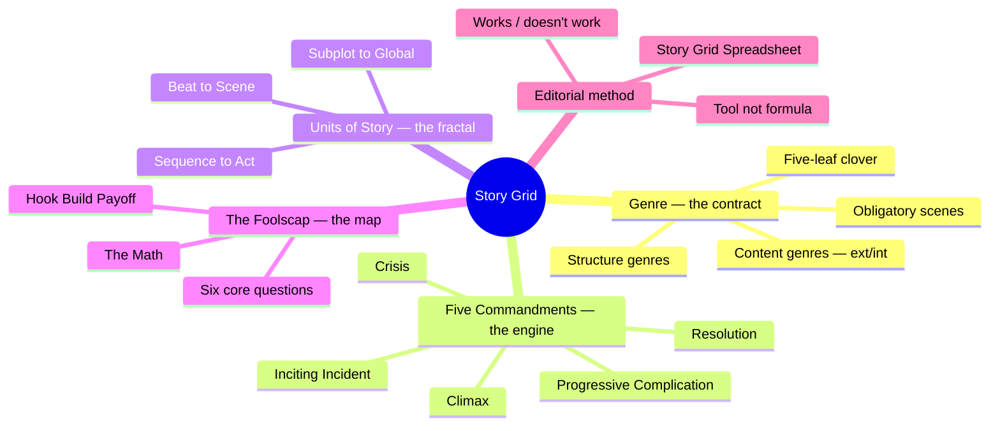
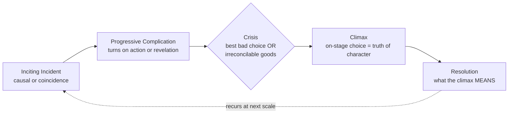

# BVX.0236 — The Story Grid: What Good Editors Know — Shawn Coyne (2015)
### Knowledge Entry — Distill

An editor's diagnostic instrument, not a writing formula: a way to X-ray a manuscript, at any scale from single sentence to whole book, and see whether it "works."

## TABLE OF CONTENTS
- [Core Thesis](#1-core-thesis)
- [Mind Models](#2-mind-models)
- [Framework](#3-framework--structure)
- [Key Concepts](#4-key-concepts)
- [Heuristics](#5-heuristics--decision-rules)
- [Invariants](#6-invariants)
- [Pitfalls](#7-pitfalls--myths)
- [Application](#8-application)
- [Cross-References](#9-cross-references)
- [Provenance](#10-provenance--confidence)

---

## 1 · CORE THESIS

A Story is a fractal: the same five elements (Inciting Incident, Progressive Complication, Crisis, Climax, Resolution) build every unit from beat to global Story, and the same five-leaf Genre choice (Time, Reality, Style, Structure, Content) sets the reader's contract before a word is drafted. Editing is the discipline of checking both against the page — the writer is not the problem; the Story is.

---

## 2 · MIND MODELS

*Required. Minimum two diagrams, maximum five.*

**Diagram 1 — the whole argument.**
Genre sets the contract; the Five Commandments build every unit of Story that fulfills it; the Foolscap and the Spreadsheet are the editor's two instruments for checking the fit.



**Diagram 2 — the central mechanism (a two-axis instrument).**
Every unit of Story sits on two independent axes at once — Genre answers *what contract*, the Five Commandments answer *how it's built* — and both axes repeat at every scale.

```mermaid
quadrantChart
    title The Story Grid's two axes
    x-axis Low Genre specificity --> High Genre specificity
    y-axis Weak Commandment execution --> Strong Commandment execution
    quadrant-1 Works: honors contract, built well
    quadrant-2 Innovates blind: built well, no contract
    quadrant-3 Fails outright
    quadrant-4 Cliché: contract kept, badly built
    Silence of the Lambs: [0.85, 0.9]
    Generic slice-of-life pitch: [0.2, 0.3]
    Rehashed genre potboiler: [0.8, 0.25]
    Ungenred literary riff: [0.3, 0.75]
```

**Diagram 3 — the Five Commandments as fractal process.**
One chain, five links, applied recursively — a Crisis is always a choice between two bad options or two goods that can't both be had, and a Climax must happen on stage.



---

## 3 · FRAMEWORK / STRUCTURE

**Two instruments, one Story:**

1. **The Foolscap Global Story Grid** — a one-page diagnostic answering six questions: Genre? Conventions/obligatory scenes? Point of View? Objects of desire? Controlling idea/theme? Beginning Hook / Middle Build / Ending Payoff? Descends from Norm Stahl's three-act foolscap-paper method (Steven Pressfield's origin story, ch. 27), with a fourth line added.
2. **The Story Grid Spreadsheet** — the micro instrument: tracks every scene's value shift, POV, and Story-event, scene by scene, to find exactly where the Story stops working.

**The units of Story, nested smallest to largest:** Beat → Scene → Sequence → Act → Subplot / Global Story. Each is a self-contained mini-Story carrying all Five Commandments; each combines with peers to form the next size up — "like cells form tissues... organs... systems" (ch. 39).

**The Math:** a commercial novel runs 80–100K words, splits 25/50/25 across Beginning/Middle/End, and needs at minimum 15 scenes (5 obligatory per section: Inciting Incident, Complication, Crisis, Climax, Resolution) at roughly 2,000 words each — "potato-chip length," built to make a reader say "one more chapter" (ch. 36).

---

## 4 · KEY CONCEPTS

| Concept | What it is | Why it matters |
|---|---|---|
| **Genre's Five-Leaf Clover** (via McKee/El-Wakil) | Time, Reality, Style, Structure, Content genres — five independent audience-expectation axes, all nourishing the "Global Story" at the clover's center | A Story is classified on all five at once, not just Content; missing any leaf's promise breaks the contract |
| **Content Genre split: External / Internal** | External = the conscious object of desire (9 kinds: Action, Horror, Crime, Western, War, Thriller, Society, Love, Performance); Internal = the subconscious object of desire (3 kinds: Status, Worldview, Morality) | Storyline A (external quest) vs. Storyline B (internal quest) — "what the character wants vs. what the character needs" |
| **Structure Genre: Arch-plot / Mini-plot / Anti-plot** | Arch-plot = single active protagonist, external antagonism, closed ending, causal, linear (the Story Bell Curve's fat middle). Mini-plot = passive protagonist(s), internal antagonism, open ending, can play with time. Anti-plot = the twentieth-century rebellion against causality itself | Tells the writer which causal contract they're signing before they draft a scene |
| **Conventions vs. Obligatory Scenes** | Conventions = cast/setting/method requirements a Genre demands generally (a sidekick, red herrings). Obligatory Scenes = the *must-happen* beats that pay off the Genre's promise (discovery of the body, hero-at-mercy-of-villain) | Missing an obligatory scene means "I haven't written a [Genre] novel" — not a stylistic choice |
| **Object of Desire (conscious/subconscious)** | The tangible want vs. the intangible need set up by the Inciting Incident | "Focusing on the struggle to get objects of desire will make up for almost every other kind of Story misstep" |
| **Three levels of conflict** | Inner (dithering) · Personal (an antagonist) · Extra-personal (society, nature, Acts of God) | Which dominates is set by Genre choice — coming-of-age leans Inner, Bond leans Personal, survival-thriller leans Extra-personal |
| **Turning Point** | A beat/scene turns only two ways: **Character Action** or **Revelation** | Overusing one makes a Story feel "overly plotted" (all-action) or "melodramatic/soap-opera" (all-revelation) — mix them |
| **Best Bad Choice vs. Irreconcilable Goods** | Two crisis shapes: choosing the least-bad of two negatives (Rocky: fight and get humiliated, or refuse and live with cowardice), or choosing between two goods that can't coexist (Kramer vs. Kramer's career vs. presence) | "If there is an easy way out... you will lose your reader right then and there" |
| **Point of No Return** | The moment a choice makes the character irrevocably different regardless of outcome | Diagnostic test: "how difficult would it be for my character to reverse his decision?" |
| **Controlling Idea / Theme** | McKee's definition, adopted whole: one sentence, states the climactic value charge, names the specific cause of that change | "If I had to boil down all of the events in my Story to one sentence, what would that sentence be?" |
| **MacGuffin** | The villain's object of desire (Hitchcock's term) — must be believable, not necessarily realistic | Thriller convention #3: the crime must reveal a clue to it |

---

## 5 · HEURISTICS & DECISION RULES

| Situation | Do this | Not this |
|---|---|---|
| A scene feels flat / doesn't "turn" | Cut it — it's Shoe Leather/Stage Business, no value shift, no conflict | Polish the prose and keep it in |
| Unsure if the crisis is strong enough | Ask: is there an easy way out? If yes, it's not a real crisis | Let the protagonist have an obvious right answer |
| A character's stated intention and actual behavior diverge | Trust the behavior — climax is the truth of character | Trust what the character (or the narrator) claims |
| Deciding whether an obligatory scene goes on stage in a subplot | Global-Story crises/climaxes must always be on stage; subplot ones can be reported off stage | Show every subplot beat directly |
| Drafting a first attempt at an obligatory scene | Write the cliché version on purpose, then revise past it | Freeze up trying to be original on the first pass |
| Stuck mid-manuscript, unsure what's wrong | Re-fill the Foolscap (6 questions) and check the Spreadsheet scene by scene | Ask friends for unstructured "notes" |
| Choosing whose POV to follow | Match POV to which throughline (external/internal, Genre) the reader must attach to first | Default to alternating every character for "fairness" |
| Evaluating whether complications escalate | Score each 1–10 for reversibility/stakes and track the sequence — it must trend up | Trust instinct that "it feels intense enough" |
| A manuscript won't cohere no matter how good individual scenes are | Check the global climax pays off *every* subplot, not just the A-plot | Assume a strong ending scene alone will resolve loose threads |

---

## 6 · INVARIANTS

1. **Every unit of Story — beat, scene, sequence, act, subplot, global Story — carries all Five Commandments.** No unit is exempt by virtue of being small.
2. **A scene must turn: a clear shift from one value state to its opposite (or its double).** No turn, no scene — just talk or stage business.
3. **The protagonist's climax choice must happen on stage.** Reporting it secondhand voids the promise the Story made.
4. **Crises are never easy choices.** Either the best of two bad options, or a forced pick between goods that exclude each other.
5. **Progressive complications move only forward, never backward** — later dilemmas must be strictly harder than earlier ones.
6. **Genre sets obligations the writer does not get to opt out of by claiming literary exemption.** Fail an obligatory scene, and "you haven't written a [Genre] novel" — full stop.
7. **The Beginning/Middle/End ratio averages 25/50/25** across long-form Story, Arch-plot or Mini-plot alike.
8. **The Story Grid is diagnostic, not generative** — it cannot make a bad execution good, only show where the execution fails.

---

## 7 · PITFALLS / MYTHS

- Believing "real gravitas" work is exempt from Hook/Build/Payoff structure — Coyne's retort: "is your stuff better than *Moby Dick*?"
- Claiming to transcend Genre instead of innovating inside its obligations — "which is complete bullshit."
- Recycling old obligatory scenes verbatim rather than delivering them fresh; genre-expert readers detect this immediately and won't evangelize the book.
- Treating turning points as all-action (reads "overly plotted") or all-revelation (reads "melodramatic/soap opera") instead of mixing the two.
- Mapping every one of 64 scenes in exhaustive detail before drafting — "Paralysis by Analysis."
- Dashing off the Resolution as a one-line summary; it must state what the climax *means*, not recap what happened.
- Assuming a strong global climax alone fixes a manuscript — an unpaid-off subplot is often the real fault line.
- Confusing conventions (flexible, cast/setting-level requirements) with obligatory scenes (mandatory, must-happen beats) — they are not interchangeable categories.

---

## 8 · APPLICATION

- **Spine level:** L4 (plot: scene grammar — the Five Commandments recurring at beat/scene/sequence/act/subplot/global; the Foolscap's Hook/Build/Payoff as the global story arc; value turns as the mechanism the spine's plot layer leaves unspecified) and L7 (genre: the five-leaf clover, External/Internal Content Genre split, obligatory scenes and conventions as reader-contract)
- **12-layer character stack:** none directly — Coyne is a plot/genre book, not a character-psychology one; POV and controlling-idea chapters touch character only insofar as choices reveal it ("what they do is the key"), which is McKee's territory (BVX.0064), not this book's
- **plot_systems:** Direct feed candidate. `04_PLOT_SYSTEMS/` is empty today; Coyne supplies the scene-level grammar the story spine's L4 explicitly defers to plot_systems — the Five Commandments as a per-scene checklist, the turning-point taxonomy (action/revelation), and the Best-Bad-Choice / Irreconcilable-Goods crisis typology are all ready-made plot_systems primitives
- **Setting:** n/a

The spine SSOT already keys Coyne to L4 and L7 as "the scene-level grammar the spine doesn't specify" — this distill is the load-bearing text for that claim. Where Dramatica's structure chart (BVX.0091) gives the Command's story engine its quad-nested argument (Domain→Concern→Issue→Problem), Coyne gives the *execution* layer underneath it: what has to happen, in order, inside any single scene for that argument to land on the page. The two are not competing systems — Dramatica says what the argument is; Coyne says how a scene proves a piece of it. Practically: when plot_systems gets built out, the Foolscap's six questions are a natural per-IP intake form, and the Story Grid Spreadsheet's scene-by-scene value-tracking is a directly portable QA pass for any OXO draft chapter — track Inciting Incident / Complication / Crisis / Climax / Resolution per scene, verify escalation, verify every crisis is a genuine best-bad-choice or irreconcilable-goods dilemma. The genre clover's External/Internal split is also a clean cross-check against the spine's OS/MC split, though Coyne collapses IC and RS into an undifferentiated "subplot," so it should never be treated as replacing the four-throughline model — only as a compatible, coarser lens for genre-contract work.

---

## 9 · CROSS-REFERENCES

| Related entry | Relation |
|---|---|
| [[BVX.0091]] | Dramatica structure chart — the quad-nested argument Coyne's scene-level grammar sits underneath |
| [[BVX.0064]] | McKee, *Character* — controlling idea/theme adopted directly from McKee; POV/character-truth-through-choice overlaps his "characters are what they do" claim |

---

## 10 · PROVENANCE & CONFIDENCE

Full text, pdftotext extraction, 334pp, clean text layer, complete outline. Read: front matter, Preface, Introduction (full); Part 2 Genre — chapters 12–26 (Genre is not a four-letter word, Conventions, Obligatory Scenes, Keys to Innovation, Five-Leaf Clover, Story Bell Curve, Arch/Mini/Anti-plot, Conflict and Objects of Desire, External/Internal Content Genres) fully or near-fully; Part 3 Foolscap — the Foolscap Method, Six Core Questions, Obligatory Scenes/Conventions of the Thriller, Point of View, Controlling Idea/Theme, Beginning Hook/Middle Build/Ending Payoff, The Math, fully; Part 4 Five Commandments — all five commandments plus Best Bad Choice and Irreconcilable Goods chapters, fully; Part 5 Units of Story — Beat, Scene, Sequence, Act, Subplot, Global Story, fully; Epilogue, fully. Not read in depth: Part 1 chapters 3–11 (Coyne's editing-career backstory, the Realpolitik of publishing), Part 6–8 (the full worked Story Grid Spreadsheet and the complete *Silence of the Lambs* case study, chs. 54–70) — these are demonstration/application chapters of material already extracted structurally above; a deeper pass would mine additional Silence of the Lambs illustrative detail but would not change the framework, concepts, or heuristics captured here. Status `complete` reflects the load-bearing extraction.

Quotes are verbatim from the pdftotext scratchpad file, cited by chapter title/number in-line; page numbers are not reliably recoverable from the OCR'd text (chapter-end folio numbers are present but front matter is unpaginated), so citation is by chapter.

## META
- Template: BVX-LEARN-v4.0
- Source classification: full-text book, targeted-chapter extraction
- Created / Updated: 2026-09-16
