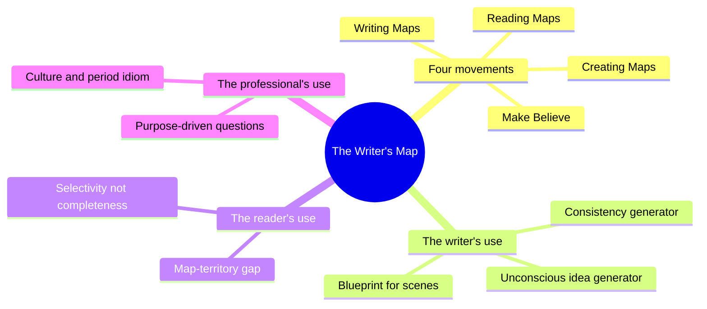
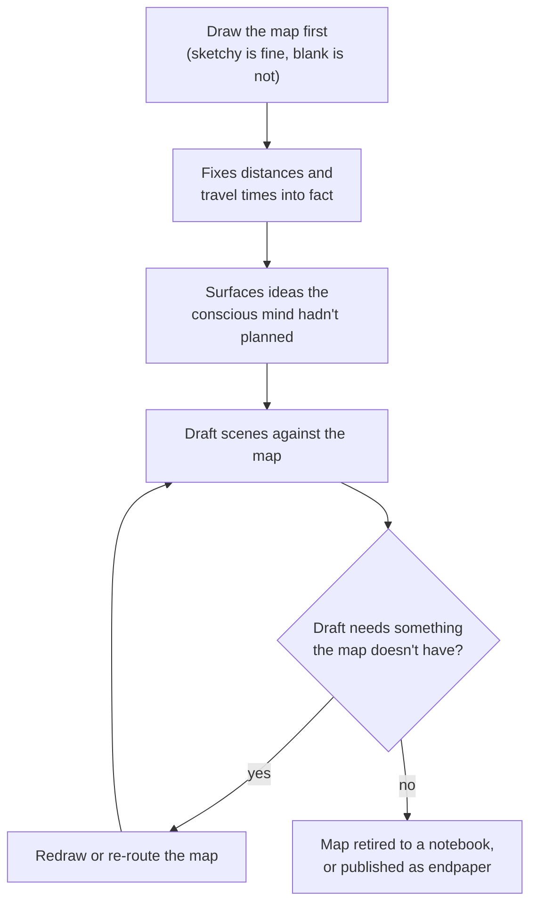
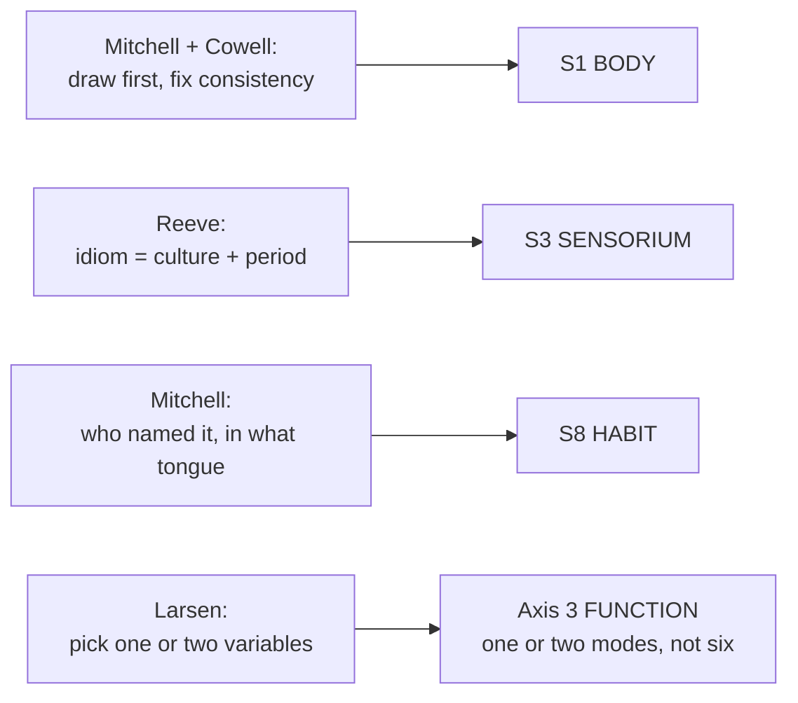

# BVX.0245 — The Writer's Map: An Atlas of Imaginary Lands — ed. Huw Lewis-Jones (2018)
### Knowledge Entry — Distill

A coffee-table anthology of essays by novelists, cartographers, and film prop designers on why and how writers draw maps; the SETTING shelf's dedicated entry on mapmaking as a working tool, not a finished illustration.

## TABLE OF CONTENTS
- [Core Thesis](#1-core-thesis)
- [Mind Models](#2-mind-models)
- [Framework](#3-framework--structure)
- [Key Concepts](#4-key-concepts)
- [Heuristics](#5-heuristics--decision-rules)
- [Invariants](#6-invariants)
- [Pitfalls](#7-pitfalls--myths)
- [Application](#8-application)
- [Cross-References](#9-cross-references)
- [Provenance](#10-provenance--confidence)

---

## 1 · CORE THESIS

A map is not a depiction made after the story is settled but a working tool used during creation: writers draw first to lock in consistency (distances, travel times) and to surface ideas their conscious mind hadn't planned. A map's power for the reader then comes as much from what it withholds as from what it shows.

---

## 2 · MIND MODELS

*Required. Minimum two diagrams, maximum five.*

**Diagram 1 — the whole argument.**
Caption: *the book's four movements sort into three distinct uses of a map — the writer's, the reader's, and the professional cartographer's — and the whole book is really about the first one.*

**Diagram 2 — the central mechanism (a process, run by every working-writer essay in the book).**
Caption: *the map and the draft trade places as leader — the loop runs until the writer stops needing to redraw, and the finished map can retire unpublished and still have done its job.*

**Diagram 3 — mapped onto the Command's SETTING SLICE.**
Caption: *the book's four best craft moves land on four different parts of the Command's own SETTING SYSTEM — S1, S3, S8, and the Axis 3 function-selection rule — evidence the system's axes are cutting the terrain in the right places, not just repeating the Kobold Guide's places.*

---

## 3 · FRAMEWORK / STRUCTURE

Twenty-eight pieces (an editor's prologue plus twenty-seven contributions, envoi included), no shared spine, sorted into four movements by function rather than genre:

| Movement | What it covers |
|---|---|
| **Make Believe** | Why humans map imaginary places at all — the editor's own essay and the opening frame |
| **Writing Maps** | Working novelists on how a map functions inside their own process, before and during a draft |
| **Creating Maps** | Professional cartographers, prop designers and critics on the craft of rendering someone else's imagined world |
| **Reading Maps** | Critics and novelists on how readers consume and are changed by a finished map |

The distill draws its method chiefly from four essays that carry the book's real argument: Philip Pullman's prologue on drawing *Razkavia* by hand for *The Tin Princess*; Cressida Cowell's "First Steps," on mapping Berk before she can write it; David Mitchell's "Imaginary Cartography," on maps as private, often-unpublished scaffolding for his novels; and Daniel Reeve's "Uncharted Territory," the professional Middle-earth mapmaker's account of what a map is actually *for*. Reif Larsen's "Connecting Contours" supplies the reader-facing half of the argument: what a finished map does to, and withholds from, its audience.

---

## 4 · KEY CONCEPTS

| Concept | What it is | Why it matters |
|---|---|---|
| **Map as consistency generator** | Drawing the map fixes distances and travel times before the prose does, so the story can't later contradict a fact the map already settled | Cowell: "as soon as I've drawn a map of Berk, I know exactly how long it takes to get from Hooligan Village to the Harbour" — the map does the continuity work a style sheet would otherwise have to do by hand |
| **Map as unconscious idea generator** | Drawing is a way of "communicating with your unconscious" before the conscious plot exists | Cowell: "when I draw the map of my imaginary world, it will tell me the direction I want to be going in, even when I don't yet know myself" — a legitimate pre-writing move, not a delay tactic |
| **Map as blueprint / organizing principle** | Once a map of a scene's space is drawn, the section of story it depicts is largely plotted out | Mitchell's *Black Swan Green*: a hand-drawn row of back gardens, numbered house by house, became the chapter's scene list — "it's the illustrative map that serves as the chapter's organizing principle" |
| **The ping-pong exchange** | Creative revision as iteration between a rough map and a rough draft, each correcting the other | Mitchell: "not between Nothing and Something, but between Something Okay and Something Better" — names why redrawing a map mid-draft is productive, not wasted motion |
| **Naming implies a namer** | You cannot assign a place-name without deciding whose language and worldview produced it | Mitchell, from his otter-fugitive juvenilia onward: "you can't name a place without thinking about the language and worldview of the people doing the naming" |
| **Transposition (reskinning real geography)** | Laying an invented map over a real coastline, island, or town as verisimilitude scaffolding, later adjusted or discarded | Mitchell transposed a fictional port onto a real Aleutian island; Reeve altered Middle-earth's Gulf of Lune into Wellington Harbour for a film shot — both use real ground as a first draft of a fictional one |
| **Sketchy beats blank** | An unpublished, rough, "only-kind-of-a-map" drawn in a notebook is sufficient to unlock a scene; it need never appear in the finished book | Mitchell: mountain sketches for *The Thousand Autumns of Jacob de Zoet* were "never published in the book, but it could not have existed without them" |
| **Selectivity ("the not-telling game")** | An excellent map, like an excellent sentence, chooses one or two variables to grid and leaves the rest to the reader's imagination | Larsen: "maps are feats of selectivity too... the power in maps of all forms comes as much from what is not shown as what is shown" |
| **The map-territory gap** | A map that tries to include everything (Borges's empire-sized map) becomes useless; the felt truth of a place requires cutting, not completeness | Larsen's Borges citation: the perfect map "coincided point for point" with the empire and was abandoned to rot — literalized completeness kills the tool |
| **Purpose-driven cartography** | A working map answers a checklist of practical questions before it is beautiful: where is this, how far, which direction, what obstacles, how big, how populated, is it navigable | Reeve, professional Middle-earth/Narnia/King Kong mapmaker: "maps are far more than just appearance; they are about conveying information" |
| **Culture- and period-true idiom** | A map's material craft — ink versus quill, watercolour ageing, script style, what's merely decorative versus load-bearing — is itself worldbuilding, independent of the geography drawn | Reeve deliberately varies medium and hand for each world (Middle-earth calligraphy, 1930s Indian Ocean nautical charts) so the map itself reads as period- and culture-true before a caption is read |

---

## 5 · HEURISTICS & DECISION RULES

| Situation | Do this | Not this |
|---|---|---|
| Stuck before you've written a page of a new setting | Draw the map first, however sketchy | Wait for a fully outlined plot before you know the space |
| A repeated scene structure needs each location to feel distinct (garden by garden, room by room) | Vary the map's texture location by location and let the map double as the scene list | Reuse the same generic description at each beat |
| Deciding what to put on the page about a place | Pick the one or two variables the scene needs and cut the rest | Try to convey every fact you invented about the place |
| Naming a place, a people, or a language | Decide who is doing the naming and in what tongue before assigning the name | Bolt on flavour-names disconnected from any in-world namer |
| Choosing a map's material craft (ink, script, ageing, colour) | Match it to the culture and period the place belongs to | Default to one generic "fantasy map" look regardless of world |
| Writing physical movement through a space (a climb, a chase, a journey) | Sketch the space first, even in a notebook that never gets published | Describe movement through a space you haven't visualized |
| A map threatens to sprawl into cataloguing everything imagined | Stop at the point the map still serves the scene or story, not the world encyclopedia | Keep adding detail until the map is "complete" |
| Borrowing real-world geography for an invented place | Transpose it deliberately, then adjust or discard once the fiction diverges | Let the real-world source show through inconsistently and break the illusion |

---

## 6 · INVARIANTS

1. **A map drawn before or during the draft locks distances and travel times into a consistency the writer cannot later violate by accident.**
2. **Selection, not completeness, is what makes a map — or a described setting — feel alive.** A map of everything (Borges's empire-sized map) is a map of nothing.
3. **You cannot name a place without implying who named it and in what language.** Naming is never neutral.
4. **A map used purely as a private planning tool need never appear in the finished work to have shaped it.**
5. **A map's own material idiom (script, ink, weathering, what's decorative versus load-bearing) is itself worldbuilding information, independent of the geography it depicts.**
6. **Revision between map and draft runs both directions.** Neither is fixed first; each corrects the other until the scene works.

---

## 7 · PITFALLS / MYTHS

- Treating mapmaking as decoration or after-the-fact merchandise rather than a working draft tool used *during* invention.
- Mapping everything the imagination generates instead of cutting to what the scene needs — Larsen's warning against "the temptation to simply illustrate it all."
- Assuming a map must appear in the published book to be worth drawing; most of Mitchell's maps never did.
- Letting a real-world geographic borrowing show through inconsistently, so the "beautiful lie" the map was meant to support instead breaks it.
- Believing accuracy and completeness are the same virtue in a map — Larsen's Borges parable: perfect coverage is perfectly useless.
- Skipping the "who named this" question and defaulting to flavour-text toponyms with no namer behind them.

---

## 8 · APPLICATION

- **Spine level:** SETTING (non-story-spine source; keys to the entity beside the L0–L7 spine, per ssot_03's binding rule that setting is a Domain embodied, never a level)
- **12-layer character stack:** none directly — setting-side source; its naming-implies-a-namer rule (Mitchell) is structurally the closest thing to a character-layer echo, since a toponym behaves like an L8 IMPRINT tell for whoever assigned it, but this stays a setting-side observation, not a character feed
- **plot_systems:** contextual candidate once `04_PLOT_SYSTEMS/` opens — Mitchell's garden-by-garden map-as-scene-list is a ready-made pattern for sequencing a SCENE CARD run: draw the space, let each discrete zone become a card
- **Setting:** primary — feeds S1 BODY (the map as the working draft of the physical fabric, keeping distances and travel times consistent) and S3 SENSORIUM (a map's own material idiom as a presentation-surface choice), with S8 HABIT picking up the naming-implies-a-namer rule contextually

Read against the DCUS starter instance in `ssot_03`, this book's method sits upstream of the Kobold Guide's (BVX.0458): where Kobold gives the *order* to build a setting in (nation-first, then coastline, then rivers), this book gives the *practice* of using the drawing itself as a discovery and consistency tool while building it, and as a selective, withholding artifact once it reaches a reader. The two are complementary rather than redundant — one is sequence, the other is process and audience-facing restraint. Larsen's map-territory gap also restates, from a different angle, the Kobold Guide's kitchen-sink pitfall: a setting document that tries to hold everything the writer knows becomes as inert as Borges's empire-sized map. The book is silent on governance, economy, religion and history as subsystems (S4, S6, S7, S9, S10) — it isn't trying to be a worldbuilding manual, and those gaps are expected, not a shortfall of this source.

---

## 9 · CROSS-REFERENCES

| Related entry | Relation |
|---|---|
| [[BVX.0458]] | Kobold Guide to Worldbuilding — the founding SETTING-shelf distill; that book gives the build order (S1 BODY nation-first), this one gives the map-as-tool practice used while building and reading it |
| [[BVX.0349]] | *Against Worldbuilding, and Other Provocations* — this book's map-territory gap and completeness pitfall independently arrive at the same warning: inventory is not the goal, pressure/legibility is |
| [[BVX.1122]] | GURPS Hot Spots: Renaissance Venice — a worked concrete instance of a SETTING SLICE; this entry's purpose-driven-cartography rule (Reeve's practical-question checklist) is a good filter to run that instance's map through |

---

## 10 · PROVENANCE & CONFIDENCE

Full text, pdftotext extraction (~9,500 lines), a two-column coffee-table layout that interleaves body text with sidebar captions on extraction — legible but requires care distinguishing essay prose from image captions. Year taken from the book's own copyright line ("The Writer's Map © 2018 Thames & Hudson Ltd, London"). Read closely: the front-matter contents list; the Prologue (Huw Lewis-Jones's framing plus Philip Pullman's "A Plausible Possible," on hand-drawing Razkavia for *The Tin Princess*); "First Steps" (Cressida Cowell, full); "Imaginary Cartography" (David Mitchell, full); "Uncharted Territory" (Daniel Reeve, full); "Connecting Contours" (Reif Larsen, full through the Borges/map-territory argument); the contributors page and back matter. Sampled only (chapter openings or TOC-adjacent, not deep-extracted): "Off the Grid" (Macfarlane), "Those Who Wander" (Hardinge), "Rebuilding Asgard" (Harris), "To Know the Dark" (Millwood Hargrave), "The Wild Beyond" (Torday), "Beyond the Blue Door" (Elphinstone), "Real in My Head" (Moss), "Mischief Managed" (Mina), the Reading Maps section (Grossman, Toksvig, and others), and the envoi. This selection follows the brief's instruction to pull the chapters carrying the book's method for building, planning, and revealing a setting through maps, staying under the ~120k-token reading budget; the sampled essays lean toward personal-reading-history and genre-survey content rather than method, so their omission from deep extraction should not have cost the distill much.

## META
- Template: BVX-LEARN-v4.0
- Source classification: full-text essay collection, deep extraction on 5 of ~28 pieces (the method-bearing ones), sampled on the rest
- Created / Updated: 2026-09-29
