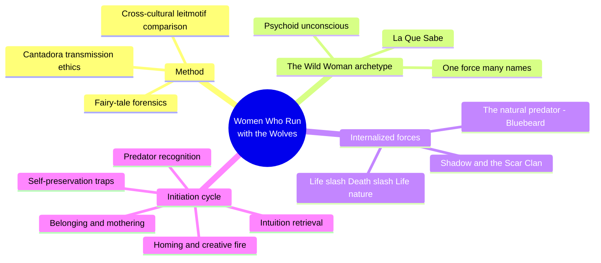
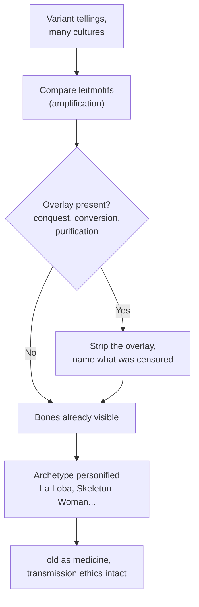
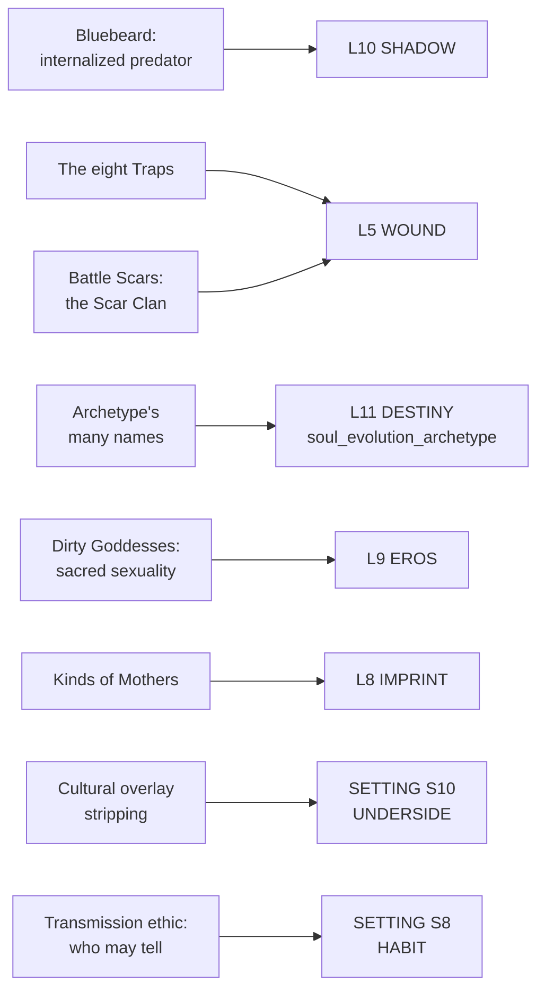

# BVX.0258 — Women Who Run with the Wolves: Myths and Stories of the Wild Woman Archetype — Clarissa Pinkola Estés (1995)
### Knowledge Entry — Distill

A Jungian analyst and cantadora (keeper of the old stories) reads sixteen fairy tales across cultures as compressed psychological instruction, and lays out, mostly in the afterword, the comparative method she uses to recover what censorship and conquest scrubbed out of them.

## TABLE OF CONTENTS
- [Core Thesis](#1-core-thesis)
- [Mind Models](#2-mind-models)
- [Framework](#3-framework--structure)
- [Key Concepts](#4-key-concepts)
- [Heuristics](#5-heuristics--decision-rules)
- [Invariants](#6-invariants)
- [Pitfalls](#7-pitfalls--myths)
- [Application](#8-application)
- [Cross-References](#9-cross-references)
- [Provenance](#10-provenance--confidence)

---

## 1 · CORE THESIS

A fairy tale is a culture's compressed psychology, not entertainment: its "bones" survive centuries of religious and political overlay, and can be recovered by comparing variants across cultures. An archetype named inside it is a real psychic force wearing a local mask, transmissible only through story told with its ethics intact.

---

## 2 · MIND MODELS

*Required. Minimum two diagrams, maximum five.*

**Diagram 1 — the whole argument.**
Caption: *the book reads as a method chapter (mostly in the afterword) wrapped around a graduated cycle of initiation tales — read the method first, then the cycle makes sense as one argument, not sixteen separate essays.*

**Diagram 2 — the central mechanism (a process: how a buried psychological truth is recovered from a corrupted tale).**
Caption: *the method is archival, not interpretive — you strip the overlay before you read the meaning, and if the overlay isn't there, the bones were never lost.*

**Diagram 3 — mapped onto the Command's L5/12-layer stack and SETTING SLICE.**
Caption: *the book's mythic register lands on the same fields Corbett and BVX.0458 already key, just narrated instead of itemized — confirmation, not a new taxonomy.*

---

## 3 · FRAMEWORK / STRUCTURE

No single spine; sixteen chapters, each keyed to one or two fairy tales, arranged as a graduated cycle of initiation rather than a linear argument. The method that makes sense of the whole book (fairy-tale forensics, cross-cultural comparison, the cantadora transmission ethic) is laid out explicitly only in the afterword ("Story as Medicine"), though it is practiced silently from chapter 1 onward.

| Movement | Chapters | Governing question |
|---|---|---|
| Recognition | 1–2 (Resurrection; Stalking the Intruder) | What is the Wild Woman archetype, and what preys on her? |
| Retrieval | 3–5 (Nosing Out the Facts; The Mate; Hunting) | How is instinct, intuition, and love recovered once lost? |
| Belonging & body | 6–7 (Finding One's Pack; Joyous Body) | What does exile cost, and what does the body know? |
| Defense | 8 (Self-Preservation) | What are the specific traps that recapture a freed psyche? |
| Return & creativity | 9–11 (Homing; Clear Water; Heat) | How does a woman come back to herself and stay creative and sexual? |
| Boundary & damage | 12–13 (Marking Territory; Battle Scars) | How is rage metabolized, and what does a wound-community look like? |
| Deep initiation | 14–16 (La Selva Subterránea; Shadowing; The Wolf's Eyelash) | What does full underworld initiation demand? |
| Method | Afterword (Story as Medicine) | How is a story recovered, and how must it be told? |

---

## 4 · KEY CONCEPTS

| Concept | What it is | Why it matters |
|---|---|---|
| **Fairy-tale forensics** | Comparing leitmotifs across cultural variants, plus anthropological cross-checks, to reconstruct what a corrupted telling originally carried | The book's actual method; treats a story as an artifact with a recoverable original state, not a fixed text |
| **Cultural overlay** | Later religious or political layers painted over older tale content: Grimm-era informants "purifying" stories for the collecting brothers, turning a healer into a witch, a caul into a handkerchief | Names the failure mode a worldbuilder can reverse-engineer: what a culture's official myth-version is hiding, and why |
| **The Wild Woman archetype / La Que Sabe** | One psychic force personified under dozens of local names (Rio Abajo Rio, Durga, Hekate, Dakini) across cultures with no contact | Demonstrates the archetype is the invariant; name, iconography, and ritual are the local mask |
| **The natural predator of the psyche (Bluebeard)** | An internalized, repressed complex common to the species, not a personal biography, read through a lineage of "failed magician" figures (Icarus, Lucifer, the sorcerer's apprentice) | A template for an antagonist as a psychic force with mythic ancestry, not a one-off villain |
| **Life/Death/Life nature** | A cycle of animation, decline, death, and re-animation treated as the operating pattern of nature and psyche alike, not a crisis to be solved once | Reframes recurring loss in a character's arc as participation in a pattern, not failure to fix something permanently |
| **The cantadora transmission ethic** | A story has a "mother," "godparents," and a lineage of tellers; permission and crediting are required before telling it; a story-keeper trains for years, not a workshop | Gives lore a social structure: who may tell what, to whom, under what conditions, not just content |
| **La invitada, the empty chair** | A seat left open at every telling for whichever listener's unspoken need the story must serve that night | A live-audience rule: the same lore is told differently depending on who is present to receive it |
| **The eight Traps (Self-Preservation)** | A named catalog: the gilded carriage, the dry old woman, burning the treasure, injury to instinct, the split-in-two secret life, cringing before the collective, faking it, dancing out of control | A checklist for how a freed or awakened character gets recaptured; each trap is a distinct failure mode, not a generic relapse |
| **Kinds of Mothers** | The ambivalent, collapsed, and unmothered mother, read through "The Ugly Duckling": an internal mother complex shaped by both personal and cultural images of "good" mothering | A formative-conditioning typology for how a culture's expectations get internalized as a character's own inner voice |
| **Battle Scars / the Scar Clan** | Membership formed by shared, disclosed wounds rather than by choice or blood | Treats trauma as a source of community and identity, not only private damage to be hidden |
| **Story as medicine vs. entertainment** | Medicine-telling requires training, permission, timing, and knowing what *not* to do | The dividing line the book insists on: content extracted from its transmission context is defanged |

---

## 5 · HEURISTICS & DECISION RULES

| Situation | Do this | Not this |
|---|---|---|
| Building a culture's folklore | Give it a surface version that has been "purified" by conquest or religion, with older content still detectable underneath | Invent a tidy, internally consistent myth with no scars of historical overwriting |
| Naming a psychological or divine force across a setting | Let one force wear many names across factions or peoples, same wellspring, different masks | Invent an unrelated deity or force per culture with no unifying logic |
| Building a mythic antagonist | Root it in a nameable internalized complex with its own lineage of parallel figures across cultures | Write a one-off villain with no archetypal resonance or ancestry |
| Writing a character's backstory wound | Model it as an accumulated record with a severity scale and specific named triggers (the Traps), not one stated event | Reduce trauma to a single line of backstory exposition |
| Placing myth or lore inside a culture | Give it transmission rules: who may tell it, to whom, under what conditions, with what permission | Treat myths as free-floating flavor text any character can access equally |
| Writing a character's growth arc | Name the archetype or force the character is moving toward or wrestling with | Leave the direction of growth vague or unnamed |
| Depicting recurring hardship or loss | Treat it as participation in a cycle (Life/Death/Life) that recurs by nature | Write loss as a one-time crisis fully and permanently resolved |
| Writing a support network formed by shared damage | Let disclosed wounds be the thing that forms belonging (a Scar Clan) | Make wounds purely private, invisible to the character's community |

---

## 6 · INVARIANTS

1. **A genuine archetype survives cultural overlay.** Its bones show through even when the tale has been censored, Christianized, or bowdlerized for centuries.
2. **The same force is named differently by every culture that carries it; the force itself is singular.** Local names and iconography are the variable, not the archetype.
3. **Story only instructs or heals when transmitted with its ethics intact.** Content stripped from its lineage, permission, and telling-context is defanged, regardless of how faithfully the words are preserved.
4. **The internal predator/shadow complex is common to the species, not particular to one person's biography.** It recurs across unrelated cultures with the same functional shape.
5. **Psychic damage accumulates and is best modeled as a graded record with specific triggers, not a single formative event.**
6. **Cyclical decline is not malfunction.** It is the mechanism by which renewal becomes possible; fighting the cycle rather than joining it is the actual failure mode.

---

## 7 · PITFALLS / MYTHS

- Treating a fairy tale as a fixed, single-source text instead of one variant worth comparing against others from different cultures.
- Reading a Grimm-collected tale as pristine pre-Christian material without accounting for centuries of "purification" by the collectors themselves.
- Flattening an archetype into one fixed "meaning" instead of letting it stay personified inconsistently across tellings and contexts.
- Extracting a myth's content while discarding its transmission ethics: the "story collector" error the book names directly, taking a story of consequence without knowing what one is asking for.
- Writing trauma as an isolated plot event rather than an accumulating condition with its own severity and behavior under triggers.
- Making an antagonist purely external and biographical, missing the more resonant register of an internalized, species-wide predator complex.
- Assuming intellectual analysis alone can "know" an archetype; contact without change in the teller is "rhetorical translation," not transmission.

---

## 8 · APPLICATION

- **Spine level:** L5 (story-spine Character, "functions before persons," per `ssot_01`) and SETTING (a culture's folk tales as the carrier of its psychology; a Domain embodied, not an L0–L7 rung)
- **12-layer character stack:** L5 WOUND primary (the Traps, the Scar Clan), L10 SHADOW primary (the natural predator / Bluebeard complex), L11 DESTINY primary (soul_evolution_archetype, the book's whole naming vocabulary), L9 EROS supporting (sacred sexuality, the Dirty Goddesses), L8 IMPRINT supporting (Kinds of Mothers)
- **plot_systems:** contextual candidate once `04_PLOT_SYSTEMS/` opens: fairy-tale forensics (Diagram 2) is a ready template for a faction's suppressed or censored history, draft the official surface version first, then decide what got scrubbed and by whom
- **Setting:** primary, feeds SETTING S10 UNDERSIDE and S8 HABIT, both already opened by BVX.0458

The two shelves this distill sits on turn out to be one method seen from two directions. Fairy-tale forensics (§2 Diagram 2) is a SETTING tool (how a culture's official story hides what it actually believes) and an L5 tool (how a person's official self-story hides the wound and the predator underneath it) at once. Against the SETTING SLICE, this book supplies the mechanism BVX.0458's S10 UNDERSIDE only asserted: Cook's public/personal religion split named the shape of the buried layer, and Estés gives the technique for locating it (compare variants, name the overlay, strip it). Against the 12-layer character stack, the naming practice, La Loba, Skeleton Woman, the Handless Maiden, demonstrates what an L11 soul_evolution_archetype field holds: not a label pasted on, but a force the character is in active relationship with, changed by real contact and unchanged by fake contact. The predator/Bluebeard material (L10 SHADOW) is the strongest single craft tool here: give an antagonist a cross-cultural lineage of parallel failed-magician figures, and it stops reading as one story's villain and starts reading as a recurring psychic fact several cultures have each had to name.

---

## 9 · CROSS-REFERENCES

| Related entry | Relation |
|---|---|
| [[BVX.0064]] | McKee, *Character*: direct match to the L5 story-spine definition, "functions before persons"; McKee's Cast Map is the craft-book version of the same L5 shelf this book occupies mythically |
| [[BVX.0196]] | Corbett, *The Art of Character*: L5 WOUND sibling via the Ghost; Corbett is clinical/craft register, Estés is mythic/narrative register on the same field |
| [[BVX.0209]] | Puglisi & Ackerman, *The Emotional Wound Thesaurus*: L5/L6 sibling; a taxonomic reference-book counterpart to this book's narrative treatment of accumulated damage |
| [[BVX.0271]] | Weiland, *Writing Archetypal Character Arcs*: undistilled sibling, same L5 shelf, direct archetype-and-arc overlap; a natural next distill against this entry |
| [[BVX.0458]] | *The Kobold Guide to Worldbuilding*: SETTING-shelf sibling; its "masks of the gods" (S9/S10) is the TTRPG-craft version of this book's one-force-many-names practice, and its S10 UNDERSIDE keying is the concept this distill supplies the working method for |

---

## 10 · PROVENANCE & CONFIDENCE

Full text, pdftotext extraction (OCR quality uneven in places: stray diacritics and line-break artifacts throughout, content unaffected). Read in full: front matter, TOC, foreword, and the complete introduction ("Singing Over the Bones," the stated aims and the first exposition of fairy-tale forensics). Read in full: the afterword ("Story as Medicine"), the book's actual methods chapter, for the comparative-leitmotif method, the cantadora transmission ethic, and la invitada. Read in full: chapter 1 ("The Howl," the complete "La Loba" tale and its analysis) and the "Natural Predator of the Psyche" section of chapter 2 ("Stalking the Intruder"), both worked demonstrations of the method against a specific tale. Sampled for concept confirmation: chapter 5 (Life/Death/Life via Skeleton Woman), chapter 6 (Kinds of Mothers), and the TOC-level content of chapter 8 (the eight Traps) and chapter 13 (Battle Scars). Chapters 3-4, 7, 9-12, and 14-16 were not directly read; their content here is drawn from the TOC and cross-references within the read material, consistent with the brief's 120k-token ceiling and the book's length (~537 pages).

The `feeds:` keying against the 12-layer character stack and the SETTING SLICE is this distill's synthesis, made by testing the read material's concepts directly against the field definitions in `_tools/charsys/character-system.html` and the S-layer keying already established by BVX.0458. `spine: [L5, SETTING]` follows the same dual-shelf pattern BVX.0458 established for sources that carry both an L-level story-spine concern and a Domain-embodied setting concern; per the v4 template's binding rule, SETTING is asserted as an entity beside the L0–L7 spine, never itself a spine rung.

## META
- Template: BVX-LEARN-v4.0
- Source classification: full-text book, deep extraction on introduction/afterword/chapters 1–2, sampled on chapters 5–6/8/13, TOC-only on remaining chapters
- Created / Updated: 2026-09-29
