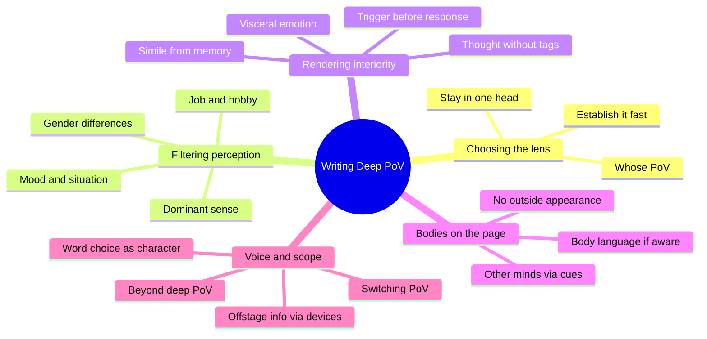
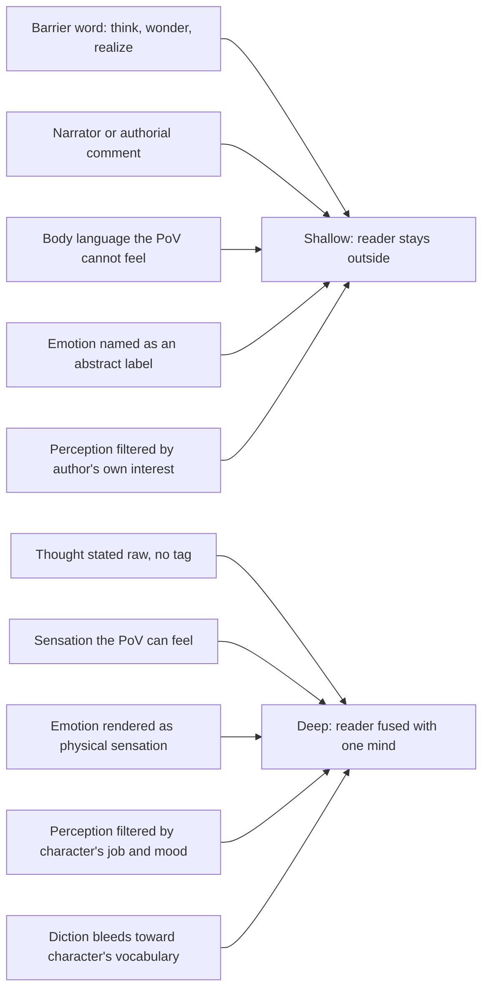
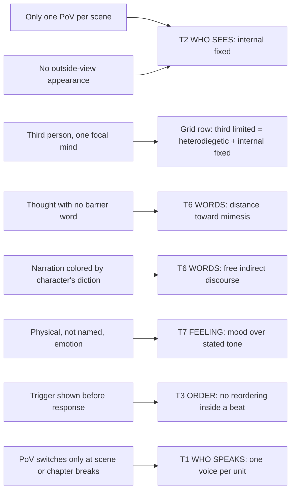

# BVX.0273 — Writing Deep Point of View: Professional Techniques for Fiction Authors — Rayne Hall (2015)
### Knowledge Entry — Distill

A short, exercise-driven craft manual that treats "deep PoV" not as a person choice but as a removal campaign: strip every word and habit that reminds the reader a narrator stands between them and the character's mind.

## TABLE OF CONTENTS
- [Core Thesis](#1-core-thesis)
- [Mind Models](#2-mind-models)
- [Framework](#3-framework--structure)
- [Key Concepts](#4-key-concepts)
- [Heuristics](#5-heuristics--decision-rules)
- [Invariants](#6-invariants)
- [Pitfalls](#7-pitfalls--myths)
- [Application](#8-application)
- [Cross-References](#9-cross-references)
- [Provenance](#10-provenance--confidence)

---

## 1 · CORE THESIS

Deep PoV takes third-limited focalization and pushes the distance dial to its mimetic extreme: delete barrier words, authorial commentary, and body language the focal character cannot perceive, and render only felt sensation, raw thought, and mood-tinted diction. The result fuses narrator and character until the reader experiences, rather than reads about, one mind.

---

## 2 · MIND MODELS

*Required. Minimum two diagrams, maximum five. See template §C for the rules.*

**Diagram 1 — the whole argument.**
Caption: *five clusters, one campaign: choose a lens, filter through it, render its interior raw, keep bodies honest, then decide when and whether the lens ever moves.*

**Diagram 2 — the central mechanism (the distance dial).**
Caption: *every technique in the book sorts into one of two piles; deep PoV is what's left after every item in the "shallow" pile has been deleted.*

**Diagram 3 — mapped onto the Ten Questions and the translation grid.**
Caption: *deep PoV is not a new question, it is T2 and T6 both dialed to their strictest settings, with T1, T3 and T7 following along.*

---

## 3 · FRAMEWORK / STRUCTURE

Twenty chapters and three sample stories, organized here by mechanism rather than Hall's own chapter order, since the book proceeds as a flat list of techniques rather than a nested argument.

| Cluster | Chapters | Governing question |
|---|---|---|
| **Choosing and establishing the lens** | 1–3, 8 | Whose mind, and how does the reader know it within a sentence or two? |
| **Filtering perception** | 4–7 | What does this particular mind notice first, and on whose authority (job, hobby, upbringing, gender, mood)? |
| **Rendering interiority** | 9–12 | How does thought and feeling reach the page without a tag announcing "this is a thought"? |
| **Bodies on and off the page** | 13–16 | What can the focal mind actually see, feel, or be told, and what must simply stay unstated? |
| **Voice, scope, and beyond** | 17–20 + samples | Whose diction colors the prose, when is the lens allowed to move, and what other lenses exist if this one isn't right? |

The book has no stated throughline connecting these clusters; the throughline supplied here is the distance dial (Diagram 2), which is implicit in every chapter but never named as a single mechanism by Hall herself.

---

## 4 · KEY CONCEPTS

| Concept | What it is | Why it matters |
|---|---|---|
| **Barrier words** | Closed verb list (think, wonder, realize, know, understand, reflect, consider, muse, deliberate, contemplate) that announces a thought is being reported (Ch9) | Deleting the tag and restating the thought directly is Hall's single most repeatable, mechanical technique |
| **Filter through interest** | A character's job, training, hobbies, childhood, and education decide which stimuli reach conscious notice (Ch4) | The commonest deep-PoV failure is the author's own noticing substituted for the character's; this is the fix |
| **Trigger and response order** | Show the stimulus before the reaction, same order as it happens, never reversed (Ch10) | A reversed order forces the reader briefly outside the PoV to ask why, breaking the fusion the technique exists to build |
| **Visceral emotion** | Physical, bodily description of an emotion instead of naming it ("stomach soured" instead of "felt angry") (Ch11) | Naming an emotion is diegetic; its physical signature is mimetic — the book's largest catalogued vocabulary |
| **Awareness-gated body language** | The PoV's own body language appears only if she can perceive it *and* is attending to it; unconscious cues (a blush, widened eyes) are off-limits (Ch14) | Unnoticed cues are the most common way writers leave deep PoV without noticing they've left it |
| **Simile as backstory** | A comparison drawn only from the PoV's remembered experience, smuggling background without a flashback (Ch12) | "Cluttered as her husband's garden shed" teaches marital and domestic history with zero exposition |
| **Sanctioned appearance workarounds** | Action, mirror, and other-character-reaction are the three legal ways to convey the PoV's own looks without stepping outside her head (Ch13) | Deep PoV forbids outside-view physical description of the focal character; these are the exceptions when plot requires it |
| **Voice bleed** | Narration's vocabulary and syntax shift toward the PoV's age, education, and native-language habits, short of full transcription (Ch17) | Hall's version of free indirect discourse: the prose is "in character" even in third person, never a neutral author register |

---

## 5 · HEURISTICS & DECISION RULES

| Situation | Do this | Not this |
|---|---|---|
| A thought needs to reach the page | State it directly ("What now?") | Tag it with a barrier word ("she wondered what to do") |
| Describing a room, object, or person the PoV meets | Filter it through her job, hobbies, and upbringing | Describe whatever the author personally finds noteworthy |
| A spider drops, a punch lands, any stimulus-reaction pair | Write the trigger first, response second | Write the response, then explain what caused it |
| The PoV feels an emotion | Describe its physical sensation | Name the emotion abstractly ("she felt scared") |
| The PoV's own body does something involuntary | Show it only if she can feel it, and is attending to it | Show any cue an outside observer would see |
| The reader needs to know the PoV's looks | Route it through action, a mirror, or another character's comment | State it in an outside-observer sentence |
| Something happens off the page the reader needs | Deliver it via a device the PoV receives (call, text, overheard talk) | Cut away from the PoV to narrate it directly |
| The cast needs more than one PoV | Switch only at a chapter or scene break, re-anchor immediately | Switch mid-paragraph or mid-scene |
| Weather or setting needs describing under a mood | Choose verbs that create the mood without naming it | Default to pathetic fallacy (storm means inner turmoil) |

---

## 6 · INVARIANTS

1. Only what the PoV character senses, thinks, and feels belongs on the page; nothing occurring elsewhere or in another mind fits, no matter how relevant to plot.
2. Trigger always precedes response, in sentence and paragraph order, never the reverse.
3. A stated thought needs no announcing tag; naming the tag (think, know, realize, wonder) is what erects the barrier the technique is named against.
4. The PoV's own body language may appear only if she can perceive it and is actively attending to it in that moment; unconscious cues are unavailable.
5. Emotion is rendered through physical, bodily sensation rather than named as an abstract label.
6. Perception is filtered through the PoV's profession, hobbies, upbringing, gender, and current mood or situation, never through the author's own noticing.
7. Similes and comparisons draw only from material inside the PoV's remembered experience.
8. A PoV switch happens only at a scene, chapter, or part break, is re-established within the first sentence or two, and (per work) stays consistently either all-first-person or all-third-person.

---

## 7 · PITFALLS / MYTHS

- Head-hopping: narrating a second character's thoughts or feelings inside a scene already anchored in the first PoV.
- Telling the emotion's name instead of its physical signature ("felt angry" versus stomach souring, fists clenching).
- Describing the PoV's own appearance from an outside-observer stance, as if a camera were narrating.
- Pathetic fallacy: matching weather to the character's mood as an automatic default rather than a considered choice.
- Reporting a stimulus-reaction pair backwards, forcing the reader to retroactively construct the cause.
- Stating what the PoV does *not* notice, or what will happen in future, both requiring a vantage point outside her present awareness.
- Authorial moralizing ("of course, sinners always get punished") dropped into otherwise-PoV prose.
- Switching PoV mid-sentence or mid-paragraph rather than at a clean break.
- A twist ending that exists only to surprise the reader about the PoV's identity or gender, with no thematic payoff.

---

## 8 · APPLICATION

- **Spine level:** TEXTURE only. Deep PoV is a discourse-side configuration (T2 × T6); it makes no story-spine content claim and should never be forced into an L0–L7 slot.
- **12-layer character stack:** primary on **L8 IMPRINT** (Ch4's filter-by-job/hobby/childhood mechanism is IMPRINT surfacing as moment-to-moment attention, not stated backstory); supporting on **L10 SHADOW** (barrier-word-free interiority, at its edge in the sample story *Only A Fool*, delivers repressed content the character would suppress under any narratorial commentary). Viewpoint mechanics are otherwise out of scope for the stack per [[BVX.0061]] and the SSOT's own boundary statement.
- **plot_systems:** not applicable; the book makes no claim about event structure, only about how chosen events are rendered.
- **Setting:** touches the setting slice only through T4's pause/stretch machinery — filtered noticing (Ch4–7) is a rule for what a scene's description layer may contain, given who is looking.

**For the texture system:**
- This book is the clearest available operationalization of T6's "distance dial toward mimesis": it converts an abstract diegesis-versus-mimesis spectrum into a checkable technique inventory (barrier-word removal, felt-versus-unseen body language, visceral-versus-named emotion, filtered-versus-authorial noticing).
- It feeds **T6 WORDS** hardest, and **T2 WHO SEES** second; deep PoV is not a new answer to any of the Ten Questions, it is internal-fixed focalization combined with the distance dial at its strictest setting, exactly Card's ([[BVX.0061]]) "levels of penetration" under different vocabulary.
- As a TELLING PROFILE setting: **T1 voice** heterodiegetic (or homodiegetic for first-person) with narration time subsequent by default; **T2 sees** internal fixed, single focal character per scene; **T6 words** distance policy at its mimetic ceiling, FID: yes, barrier-word policy excised except as a licensed re-anchoring device in the sentence or two after a PoV switch (Ch18).
- The T6 "distance policy" field needs a named scale, not free text: import Hall's and Card's shared three-point scale (cinematic / light / deep), since two independent craft sources already converge on the same three settings.
- **OPEN candidate:** the Ten Questions has no measurable proxy for where a passage sits on T6's dial. Hall's closed barrier-word list (Ch9) is a countable lexicon that could serve as exactly that, a rough, automatable distance metric by word density, worth flagging as "T6 needs a countable instrument."

---

## 9 · CROSS-REFERENCES

| Related entry | Relation |
|---|---|
| [[BVX.0061]] | Card, *Characters and Viewpoint*: Card's "levels of penetration" (cinematic/light/deep) inside limited third person is the same T2×T6 dial Hall spends an entire book operationalizing; Card names the dial in a page, Hall supplies the technique inventory for turning it to maximum |
| [[BVX.0598]] | Hühn et al. (narratology), distilled in parallel: shares the same T2 focalization vocabulary this distill leans on for Diagram 3; a formal-theory counterweight to Hall's purely craft-side treatment of the same mechanism |

---

## 10 · PROVENANCE & CONFIDENCE

Distilled from a full-text pdftotext extraction (91pp, all 20 chapters plus the three sample stories and front/back matter read in full; this is a short, example-dense book with little compression available). Every chapter contributed at least one Key Concept, Heuristic, or Invariant; nothing was sampled via table-of-contents only. The sample stories (*Ten Sixty-Six*, *Four Bony Hands*, *Only A Fool*) were read as worked demonstrations, not merely listed, and *Only A Fool* specifically informs the L10 SHADOW feed.

**Catalog note:** the extracted PDF's title page reads "August 2019 Edition" and the copyright line reads "2015-2019 Rayne Hall," consistent with the 2015 year given in this task's brief (the book's first publication year); no discrepancy found against the brief.

## META
- Template: BVX-LEARN-v4.0
- Source classification: full-text pdftotext extraction, read in full (short book, no chapters sampled)
- Created / Updated: 2026-09-16
