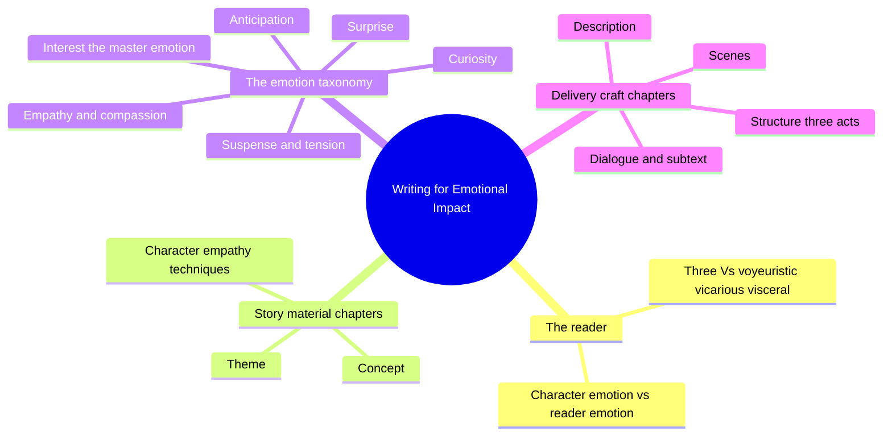
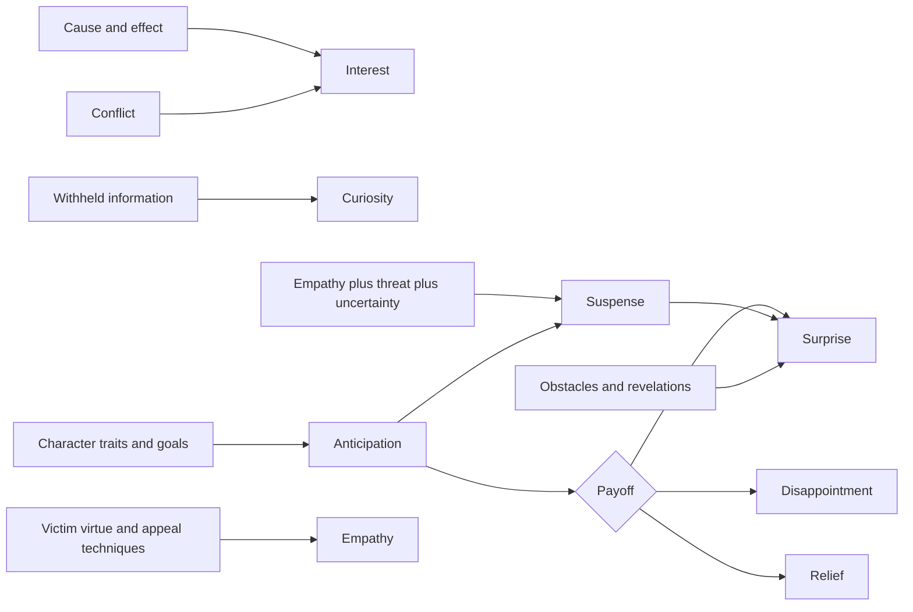
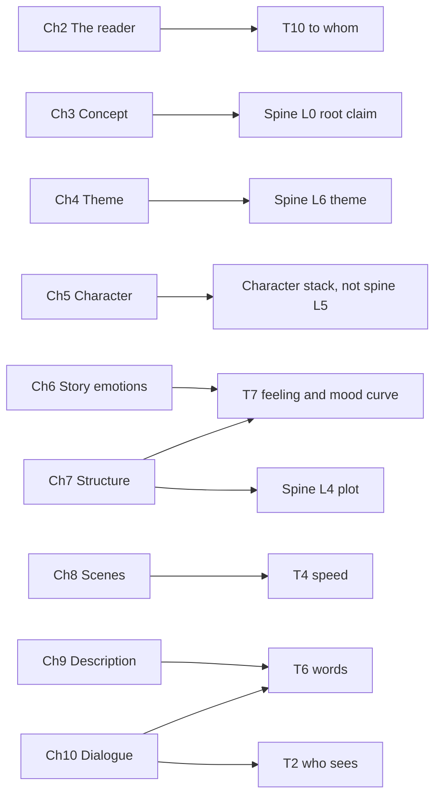
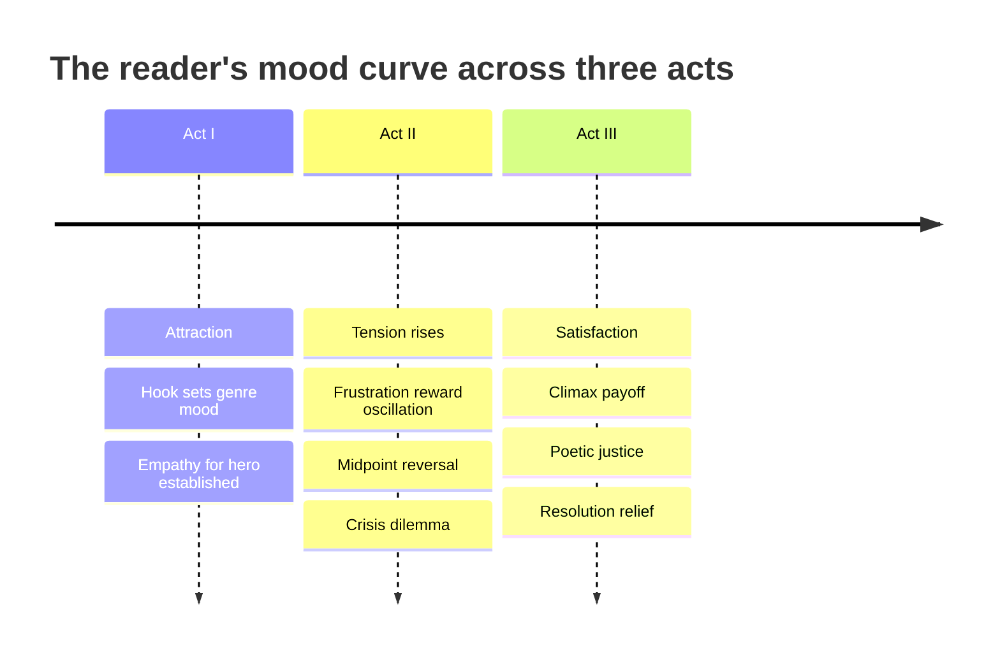

# BVX.0279 — Writing for Emotional Impact — Karl Iglesias (2005)
### Knowledge Entry — Distill

A UCLA Extension screenwriting instructor's craft book that relocates the entire discipline onto one axis: not what happens on the page, but what happens in the reader. It is the shelf's clearest source for T7 (tone and affect, the target mood curve) and for the reader-facing half of T10, built around a seven-emotion taxonomy (interest, curiosity, anticipation, suspense, surprise, thrill, empathy) and the named techniques that produce each.

## TABLE OF CONTENTS
- [Core Thesis](#1--core-thesis)
- [Mind Models](#2--mind-models)
- [Framework](#3--framework--structure)
- [Key Concepts](#4--key-concepts)
- [Heuristics](#5--heuristics--decision-rules)
- [Invariants](#6--invariants)
- [Pitfalls](#7--pitfalls--myths)
- [Application](#8--application)
- [Cross-References](#9--cross-references)
- [Provenance](#10--provenance--confidence)

---

## 1 · CORE THESIS

A script survives on reader emotion, not character emotion: readers feel Voyeuristic curiosity, Vicarious identification, and Visceral thrill, in that order of leverage. Interest is the master emotion that curiosity, anticipation, suspense, and surprise all specialize; craft techniques exist only to produce these, chapter by chapter, page by page. Character emotion is necessary but insufficient; only reader emotion sells.

---

## 2 · MIND MODELS

**Diagram 1 — the whole argument.**
Caption: *two source chapters and one character chapter build the story; the emotion taxonomy in Ch.6 is the hinge; three delivery chapters shape how the story reaches the page.*

**Diagram 2 — the central mechanism (technique family to reader response).**
Caption: *each technique family targets a named response; anticipation is the pivot, its payoff branches into surprise, disappointment, or relief, and suspense only fires when its three-part formula is complete.*

**Diagram 3 — mapped onto the Ten Questions of the Telling (and, where the content is not texture, onto the spine or the character stack instead).**
Caption: *only Ch.6, Ch.7's mood overlay, and Ch.8 through Ch.10's texture choices are texture; Concept and Theme key to the spine, and Character keys to the character stack downstream of it, never to spine L5.*

**Diagram 4 — the mood curve across a three-act script.**
Caption: *the plot's act breaks and the reader's mood curve share the same seams, but they answer two different questions: what happens, versus what the reader feels.*

---

## 3 · FRAMEWORK / STRUCTURE

The book runs eleven chapters in three bands. **The frame** (Ch.1–2): the reader is named the only real audience, the "emotion-delivery business" premise is stated, and the three V's (Voyeuristic, Vicarious, Visceral) are set up as the categories every later technique targets. **The source chapters** (Ch.3–5, Concept/Theme/Character): each opens with "The basics: what you need to know," then "The craft," building the raw story material an emotion can be hung on. **The delivery chapters** (Ch.6–10, Story/Structure/Scenes/Description/Dialogue): each repeats the same three-part recipe, "the basics," "the craft" (a numbered taxonomy of named techniques), and "on the page," a classic-film scene-by-scene walkthrough tagging every beat with the technique used. Ch.11 closes with rewriting advice and a "painter on the page" metaphor for prose craft.

Ch.6 (Story) is the load-bearing chapter: it names the seven-part emotion taxonomy, interest/fascination/insight/awe, curiosity/wonder/intrigue, anticipation/hope/worry/fear, suspense/tension/anxiety/concern/doubt, surprise/dismay/amusement, thrill/joy/laughter/sadness/triumph, empathy/compassion/admiration/contempt, and every other chapter's technique list is written to produce one or more of these seven named states. Ch.7 (Structure) then relabels the three-act plot skeleton in this vocabulary: Act I is Attraction, Act II is Tension and Anticipation, Act III is Satisfaction, laid directly over Set-up/Conflict/Resolution.

---

## 4 · KEY CONCEPTS

| Concept | What it is | Why it matters |
|---|---|---|
| **The three V's** | Voyeuristic (curiosity about new worlds/info), Vicarious (identification, feeling what the character feels), Visceral (the raw thrill emotions themselves) | The book's master taxonomy of *why* a reader feels anything; every technique in the book targets one of the three |
| **Character emotion vs. reader emotion** | "It's not about what happens to people on a page; it's about what happens to a reader in his heart and mind" (Gordon Lish, epigraph) | The book's founding correction: a crying character doesn't guarantee a crying reader |
| **Interest, the master emotion** | The emotion that "encompasses all the other storytelling emotions" (Ch.6) — curiosity, anticipation, suspense, and surprise are all species of it | Reframes every later technique as a special case of one problem: don't be boring |
| **Curiosity / the power of questions** | "A question demands an answer" — set up a central question, then a nested sub-question per act, sequence, scene, and beat (worked in full on *North by Northwest*) | Gives curiosity a concrete, layered engineering method rather than "keep them guessing" |
| **Anticipation and its payoff** | Looking forward to a future event; must always resolve into surprise, disappointment, or relief | Names the failure mode "unpaid anticipation" — a promised phone call that never comes |
| **The suspense formula** | "Character empathy + Likelihood of threat + Uncertainty of outcome = SUSPENSE" (Ch.6) | A checklist, not a mood: remove any one ingredient and suspense collapses |
| **Suspense vs. curiosity vs. surprise** | Curiosity = not knowing the goal; suspense = knowing the goal but not the outcome; surprise = the unexpected, felt in an instant | The book's sharpest disambiguation of three constantly confused craft terms |
| **Tension** | "A slight offshoot of suspense... about delaying anticipation of outcome" — Hitchcock's bomb-under-the-table example | Distinguishes the instant of surprise from the sustained stretch of tension; "fifteen minutes of tension is better than ten seconds of surprise" |
| **Obstacle vs. complication** | Obstacle = temporary detour, same destination; complication = permanent fork, different path ("plot twist") | A precise vocabulary split most writers use interchangeably |
| **Discovery vs. revelation** | Discovery = the hero actively finds information; revelation = information is given to the hero | Balances active/passive information delivery across a script |
| **Empathy techniques, three families** | We care about victims (undeserved mistreatment, misfortune, handicap); we care about humanistic virtue; we like desirable qualities | The book's most detailed craft taxonomy — a checklist for instant character appeal |
| **Four protagonist types** | Hero (superior, admiration), Average Joe (equal, sympathy), Underdog (inferior, compassion+admiration+suspense), Lost Soul (opposite, fascination) | Ties reader-relative status directly to a specific, predictable empathy emotion |
| **Attraction / Tension / Satisfaction** | Iglesias's emotional relabeling of Act I/II/III, run parallel to Set-up/Conflict/Resolution and Subject/Development/Fulfillment | The book's clearest instance of a mood-curve overlay on an existing plot structure |
| **Subtext** | "The river of emotion that flows beneath the words" — dialogue is indirect because direct statement costs a character too much, or because indirection recruits the reader's inference | Reframes "show don't tell" in dialogue as a distance-and-engagement choice, not a rule |
| **Melodrama vs. drama** | Melodrama is emotion display in excess of its dramatized cause; "no tears in the writer, no tears in the reader" (Robert Frost) | A calibration test, not a ban on strong emotion |

---

## 5 · HEURISTICS & DECISION RULES

| Situation | Do this | Not this |
|---|---|---|
| A scene or act feels flat/predictable | Withhold a piece of information the reader wants, and set up a fresh sub-question | Explain the character's plan or feelings outright "for clarity" |
| You want suspense in a scene | Confirm all three: reader cares about the character, threat is likely, outcome is genuinely uncertain | Rely on a single scary event with no established stakes or care |
| You've set up anticipation | Pay it off, as surprise, disappointment, or relief, before the reader forgets it was promised | Let a set-up dangle unresolved past the point the reader tracks it |
| You want a twist to land | Make it unexpected and give it a logical, already-planted cause | Introduce a twist with no groundwork ("comes out of nowhere") |
| Introducing your protagonist | Establish empathy (victim/virtue/appeal technique) before revealing flaws | Lead with the character's flaws or unlikeability |
| A dramatic scene isn't landing | Ground the emotion in a proportionate, dramatized cause | Turn up the emotional volume (tears, rage) without the earned cause |
| The middle act sags | Set up a fresh question per sequence and per scene, not just one act-level question | Coast on the single central dramatic question for 60 pages |
| Choosing an opening | Pick a hook that does double duty: character empathy plus drama, mystery, or spectacle | Open with static information or scene-setting that isn't itself a story event |

---

## 6 · INVARIANTS

1. Reader emotion, not character emotion, is the target; a crying character does not guarantee a crying reader.
2. Interest is the master emotion; curiosity, anticipation, suspense, and surprise are its specialized forms, not separate systems.
3. Anticipation must always be paid off, as surprise, disappointment, or relief; an unpaid promise reads as a broken one.
4. Suspense requires empathy, likelihood of threat, and uncertainty of outcome together; remove any one and it becomes something else (dread, boredom, or plain curiosity).
5. Curiosity and suspense cannot coexist on the same question: curiosity ends the moment the goal becomes known, and only then does suspense begin.
6. A surprise must be both unexpected and logically explicable; an unearned twist reads as authorial cheating, not craft.
7. Subtext exists for one of two reasons: the character has too much to lose by being direct, or indirection recruits the reader into actively building the meaning.
8. Melodrama is not a matter of how much emotion is shown but whether the shown emotion is proportionate to its dramatized cause.
9. The three-act plot skeleton and the three-act mood curve (Attraction/Tension/Satisfaction) are two labels on one structure, not two competing ones.

---

## 7 · PITFALLS / MYTHS

Confusing suspense with curiosity (they run on opposite information states, not degrees of the same feeling) · treating a character's displayed emotion as sufficient proof the reader will feel anything · leaving anticipation unpaid past the point the reader still tracks it · running only one central dramatic question for an entire act instead of nesting a fresh one per sequence, scene, and beat · on-the-nose dialogue used as "insurance" against a reader missing the point, which instead disengages him · melodrama produced by turning up emotional intensity instead of grounding its cause · treating three-act structure as a page-number formula rather than an emotional design problem · introducing a flaw before establishing empathy, which locks the reader into judgment instead of identification.

---

## 8 · APPLICATION

- **Spine level:** TEXTURE for Ch.1–2 (the reader, the three V's) and for Ch.6, Ch.9, and Ch.10's craft choices; L4 (Plot) for Ch.7 Structure's act architecture, which the emotional Attraction/Tension/Satisfaction labels overlay rather than replace. Not spine L5: despite Ch.5 Character running over twenty pages, its content is person-level (traits, empathy techniques, reader-relation types), and the character SSOT's own binding places persons downstream of the spine, in the character stack, never in it.
- **12-layer character stack:** L5 WOUND (supporting) via the victim/misfortune/handicap empathy techniques; L4 WILL (contextual) via the "powerful dilemma" forced-choice technique, the same Crisis Decision McKee (BVX.0175) supplies from the plot side; L3 SOCIAL (contextual) via the four protagonist types, flagged because this is a reader-facing read on a character, not the in-story social projection L3 actually defines.
- **plot_systems:** none claimed directly; Ch.7's nested question engineering (a central question, then one per act, sequence, scene, and beat) is a reader-engagement instrument riding on top of McKee's beat/scene/sequence/act grammar (BVX.0175), not a rival grammar of its own.
- **Setting:** not applicable; the book never addresses place, period, or duration.

The book's real contribution is content for T7's blank "target mood curve" field and worked material for T10's reader-construction half, neither of which had a craft source in the library before this pass. Its emotion taxonomy gives the Telling Profile's T7 line something concrete to hold instead of a single adjective, and its suspense/anticipation-payoff formulas give a scene-level check that could run against any future OXO Telling Profile once one is ruled: for each unit, name the intended emotion, the technique producing it, and (if it is anticipation) the payoff type it owes the reader.

**For the texture system:**
- Feeds T7 hardest: it supplies the actual content the Telling Profile's "tone; target mood curve" line leaves blank, a per-unit sequence of named reader emotions (interest, curiosity, anticipation, suspense, surprise, thrill, or empathy) rather than a mood adjective.
- A target mood curve entry should hold three things per unit (scene, sequence, or act): the intended emotion from the seven-part taxonomy, the technique producing it, and, if the emotion is anticipation, the payoff type it owes (surprise, disappointment, or relief), so an unpaid anticipation is visible as a design gap before the page is drafted.
- It also touches T10 (to whom): the three V's, especially Voyeuristic (curiosity recruited through withheld information) and Vicarious (identification recruited through empathy technique), describe how an implied reader gets built into a text, usable as T10's worked content rather than a new axis.
- What belongs elsewhere: Concept and Theme (Ch.3–4) key to spine L0 and L6, not texture; Character's empathy techniques (Ch.5) key to the character stack (L3, L4, L5 above), downstream of the spine per the SSOT's own binding, despite the chapter's length inviting a spine-L5 tag.
- OPEN candidate: the book argues, without naming it, for a reader-response ledger the Ten Questions don't carry outright, a running per-page account of paid vs. unpaid anticipation and which of the three V's is firing; this could live as T7's worked method or be proposed as an eleventh question. Flagged, not ruled.

---

## 9 · CROSS-REFERENCES

| Related entry | Relation |
|---|---|
| [[BVX.0175]] | McKee's Gap and Crisis Decision supply the escalation mechanism; Iglesias's suspense formula and "powerful dilemma" technique supply the reader-side reason it works. Read together for one plot engine, two vantage points. |
| [[BVX.0236]] | Coyne (Story Grid) works the same below-the-floor scene/beat grain from the craft-diagnostic side; Iglesias's per-scene emotional palette and Coyne's fractal scene commandments are complementary plot_systems material. |
| [[BVX.0084]] | Kempton, distilled in the same texture wave; both are craft-side T7/T10 candidates and should be cross-checked against each other once complete for taxonomy overlap. |
| [[BVX.0233]] | Pelican's Big Five plus dated-event motivation feeds the character stack directly (L1/L2/L6); Iglesias's victim/virtue/appeal techniques are the reader-facing craft version of producing sympathy for that same content. |

---

## 10 · PROVENANCE & CONFIDENCE

Full text, pdftotext extraction (~99,000 words, 10,659 lines, no page-break markers beyond the running headers, so citations above are by chapter heading). Read in full: the Introduction (the emotion-delivery business, the three V's, character vs. reader emotion); Ch.6 (Story) in its entirety, including all seven named emotion sections (Interest/Fascination/Insight/Awe through Empathy/Compassion/Admiration/Contempt) and the Melodrama and Sentimentality closing note; Ch.7 (Structure) in full, Act I/II/III's emotional design and the opening-hook taxonomy. Read substantially: Ch.5 (Character), the five key questions, the four protagonist types, and the "instant character appeal and empathy" technique taxonomy (victims/virtue/desirable qualities); Ch.10 (Dialogue)'s subtext section opening (why subtext is necessary, the two reasons). Sampled openings, taxonomically-headed technique lists, and closings only: Ch.3 (Concept), Ch.4 (Theme), Ch.8 (Scenes), Ch.9 (Description), Ch.11 (Final thoughts). The Index (Ch.230+) was checked only to confirm chapter/technique structure, not read as content.

The pdftotext extraction carries visible OCR/encoding artifacts (a garbled cover-page title, "�" substituted for curly quotes and the copyright symbol, occasional dropped ligatures); none of the passages quoted above fell in a corrupted span, and quotes are verbatim from the extraction. The texture-vs-spine-vs-character-stack triage in §8 (which chapters are TEXTURE, which are L4, which belong to the character stack rather than spine L5) is **my analysis**, not Iglesias's; he never mentions the spine, the character stack, or the Ten Questions of the Telling.

## META
- Template: BVX-LEARN-v4.0
- Source classification: full-text book, pdftotext extraction
- Created / Updated: 2026-09-16
