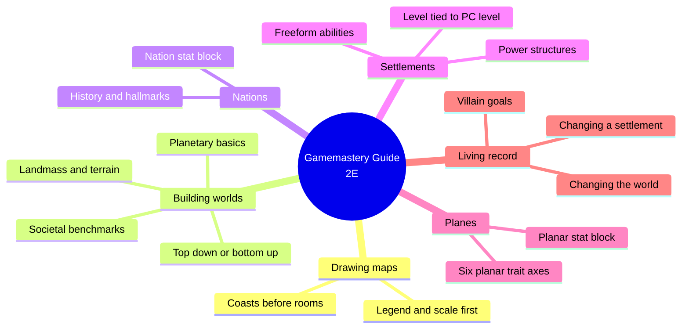
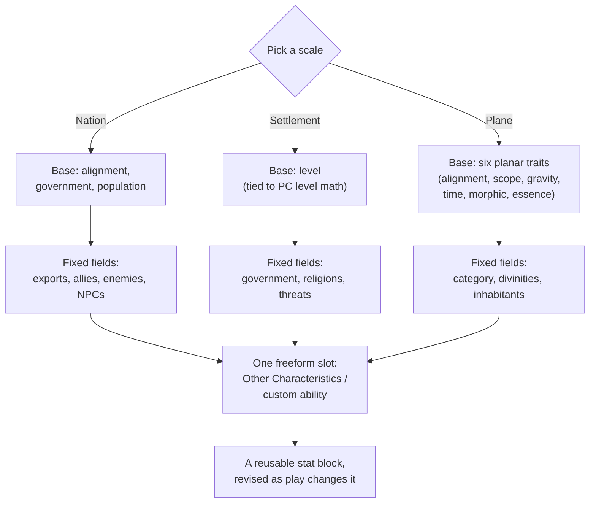
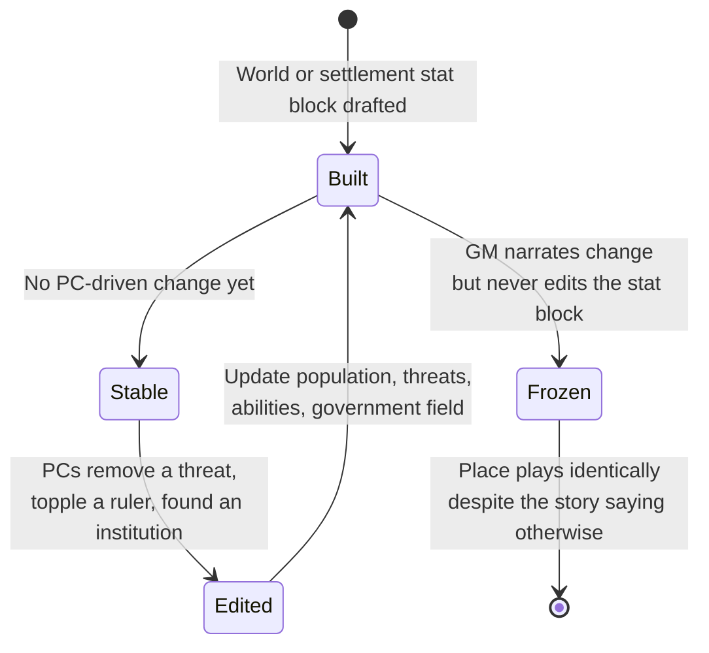
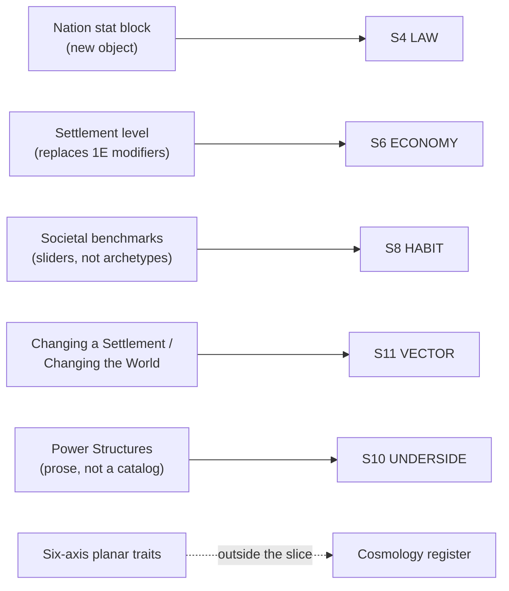

# BVX.0343 — Pathfinder Gamemastery Guide (Second Edition) — Logan Bonner and Mark Seifter et al. (2020)
### Knowledge Entry — Distill

A GM's-manual companion to 1E's GameMastery Guide (BVX.0480): the same build-order pipeline survives, but every object it produces, nation, settlement, plane, is rebuilt as a leaner, level-scaled stat block with a freeform ability slot instead of a fixed catalog.

## TABLE OF CONTENTS
- [Core Thesis](#1-core-thesis)
- [Mind Models](#2-mind-models)
- [Framework](#3-framework--structure)
- [Key Concepts](#4-key-concepts)
- [Heuristics](#5-heuristics--decision-rules)
- [Invariants](#6-invariants)
- [Pitfalls](#7-pitfalls--myths)
- [Application](#8-application)
- [Cross-References](#9-cross-references)
- [Provenance](#10-provenance--confidence)

---

## 1 · CORE THESIS

A world is still built top-down or bottom-up, but 2E collapses every scale of it, nation, settlement, plane, into the same object: named traits, a level or axis position, a fixed description, and one freeform GM-authored ability. Scale, not archetype, organizes the setting; catalogs of fixed options give way to sliders and custom slots.

---

## 2 · MIND MODELS

*Required. Minimum two diagrams, maximum five.*

**Diagram 1 — the whole argument.**
Caption: *the setting-relevant material sorts into a build pipeline (map to world to nation to settlement to plane) plus a living-record doctrine for revising all of it once play starts.*

**Diagram 2 — the central mechanism (the same instancing move run at three scales).**
Caption: *nation, settlement, and plane are built by one recipe, base traits plus a fixed field plus a freeform field, with only the base-trait source changing by scale.*

**Diagram 3 — Changing a Settlement / Changing the World, the living-record mechanism.**
Caption: *a stat block is a snapshot, not a verdict; PC action is the only trigger that legitimately rewrites it, at both the settlement and the campaign scale.*

**Diagram 4 — mapped onto the Command's SETTING SLICE, showing the delta against 1E (BVX.0480).**
Caption: *the same eight S-layers get touched as in 1E, but three of them (S6, S8, S11) are rebuilt by a materially different mechanism, and cosmology now sits its own genuinely new register above S1.*

---

## 3 · FRAMEWORK / STRUCTURE

The setting-relevant material spans four locations across two chapters:

**Chapter 1, Gamemastery Basics** — Campaign Structure gives five named campaign shapes (one-shot through epic), each with a fixed adventure count, level range, and time frame, closing with Changing the World: an explicit doctrine that the setting must visibly register what the PCs did. Drawing Maps gives a five-step process for any adventure-scale map, independent of world scale.

**Chapter 2, Tools** — Building Worlds runs the same top-down/bottom-up pipeline 1E used (concept, geography, culture, cosmology), folding planetary and solar-system menus directly in. Nations and Settlements each deliver a stat block: named traits, fixed prose fields, one freeform ability. Planes closes the chapter with the six-axis planar trait system and per-plane stat blocks.

1E organized its Chapter 7 around six recurring adventure environments (dungeon, tavern, urban, water, wilderness, planar), with the settlement stat block as one entry inside that toolbox. 2E has no equivalent chapter here; the settlement and nation stat blocks stand alone, and 1E's "behaves like" doctrine does not reappear.

---

## 4 · KEY CONCEPTS

| Concept | What it is | Why it matters |
|---|---|---|
| **Level-scaled settlement** | One Level stat sets item availability, Earn Income ceilings, and spellcasting access, read against the PC's own level and the treasure-by-level table | Replaces 1E's Economy/Danger/Corruption modifier set with one number tied to character-advancement math |
| **Nation stat block** | A new formal object (Government, Capital, Population, Religions, Exports/Imports, Allies, Enemies, Factions, Threats, NPCs) 1E never had as a discrete card | Nations get the reusable-object treatment settlements already had |
| **Societal benchmarks** | Three independent sliders replace named archetypes: technology (Primeval to Steam), divine involvement (None to Ubiquitous), magic prevalence (No Magic to High) | A culture is coordinates on independent axes, not a pick from 1E's primitive/feudal/cosmopolitan menu; axes recombine in ways a menu can't |
| **Freeform settlement abilities** | Custom, GM-authored powers (Artists' Haven, Magical Academy, Religious Bias) built to taste, not picked from an enumerated Qualities list | Trades 1E's fixed catalog for an open slot; identity is designed like a monster's special ability |
| **Power Structures** | Prose on who actually rules a settlement versus who appears to (puppet mayor, secret cabal, shapechanger) | Restates 1E's Disadvantage-tagged underside doctrine without the tag |
| **Changing a Settlement / World** | Explicit instructions to update population, threats, government, and abilities as PCs act, at settlement and campaign scale | The clearest addition over 1E: a named editing discipline, not an implied one |
| **Villain Goals** | A recurring antagonist's stated plan and underlying goal keep mattering even after individual schemes are foiled | Turns "changing the world" into a trackable throughline; a villain is the world's vector made character |
| **Six-axis planar traits** | Every plane is tagged on six independent axes: alignment, scope, gravity, time, morphic, planar essence | A combinatorial cosmology generator; any two axes recombined produce a usable plane without hand-authoring one |
| **Planetary basics menu** | Named shape options (Globe, Hollow World, Irregular), outer-space compositions, solar-system layouts | Makes the physical cosmos a menu of decisions, ahead of the terrain algorithm both editions share |
| **Campaign Reference** | A living document (geography, factions, history, plots) started before play and annotated throughout | The book's scoped-down world bible, echoing Hungerford's essay in BVX.0458 |

---

## 5 · HEURISTICS & DECISION RULES

| Situation | Do this | Not this |
|---|---|---|
| Pricing what a settlement can sell or supply | Set one Level stat and read it against the PC's own level and the treasure-by-level table | Hand-build a separate Economy modifier and base-value formula from scratch |
| Giving a settlement its flavor | Write one bespoke, freeform ability suited to that place | Pick from a fixed catalog of Qualities that force a generic label onto it |
| Designing who really runs a place | Narrate the gap between the visible ruler and the actual power directly in the stat block's prose | Wait for a Disadvantage tag to tell you the place has a hidden ruler |
| Placing a culture on the map | Set it independently on a technology rung, a divine-involvement rung, and a magic-prevalence rung | Pick the single closest-sounding named archetype and stop |
| PCs meaningfully change a settlement or nation | Edit its population, threats, government, or abilities in the stat block itself | Narrate the change in the fiction while leaving the stat block frozen |
| Building a plane or afterlife realm | Set its six planar traits independently and let the combination generate its feel | Reuse a named plane wholesale because inventing new trait combinations feels like extra work |
| Choosing a campaign's physical cosmos | Pick a shape, an outer-space composition, and a solar-system layout on purpose | Default to Earth-normal physics without ever deciding |
| A recurring villain reappears | Give them a stated goal that survives individual defeats | Make them a one-note obstacle who vanishes once a single plot is foiled |

---

## 6 · INVARIANTS

1. **A place's level (or a nation's traits) sets a ceiling on what it can offer, not a fixed inventory** — availability still scales up for a determined, higher-level character, same underlying logic as 1E, expressed through one stat instead of several.
2. **A stat block is a snapshot that must be edited, not a description that can be left to rot.** Changing a Settlement and Changing the World make this an explicit rule rather than an implied one.
3. **Freeform abilities replace catalog membership.** A settlement's identity comes from one custom-written power, not from checking boxes on a fixed list.
4. **Visible authority and real authority are independently variable at every scale**, nation, settlement, or plane, and the gap between them is worth writing down.
5. **Cosmology is a menu of independent decisions** (shape, outer-space composition, solar-system layout, six planar axes), not a default inherited from Earth physics.
6. **The physical build order still holds**: geography constrains civilization, which constrains detail; skipping ahead still produces incoherence a GM must patch later.

---

## 7 · PITFALLS / MYTHS

- Reusing 1E's Economy/Danger/Corruption modifier habits instead of trusting the single Level stat to do that work in 2E.
- Building a settlement's identity from a mental checklist of "qualities" that no longer exists as a formal catalog in this edition.
- Narrating that PCs changed a settlement or a nation while leaving its stat block's population, threats, and government fields untouched.
- Treating a recurring villain as disposable once a single scheme is foiled, losing the throughline Villain Goals is meant to preserve.
- Defaulting a planar or cosmological design to Earth-normal gravity, time, and shape without ever running the menu of alternatives.
- Assuming the six-environment "behaves like a dungeon" doctrine from 1E (BVX.0480) still applies; this edition doesn't restate it in the material covered here.
- Building a nation only in prose because no stat block existed in 1E, missing that 2E now gives nations the same reusable-object treatment settlements have.

---

## 8 · APPLICATION

- **Spine level:** SETTING (non-story-spine source; keys beside the L0-L7 spine per the v4 template's binding rule)
- **12-layer character stack:** none directly — a setting-side source; its level-scaled, freeform-ability stat-block pattern is structurally the same move as giving a character one custom-written signature trait instead of picking from a trait catalog, but it is not itself a character-layer feed
- **plot_systems:** contextual candidate once `04_PLOT_SYSTEMS/` opens — Villain Goals is a ready-made throughline generator (a stated goal that survives individual defeated schemes), and Changing the World / Changing a Settlement is a ready-made consequence-tracking discipline for any location or faction a plot needs to register change against
- **Setting:** primary — updates five of eight S-layers BVX.0480 already fed (S1, S4, S6, S8, S10, S11) with a materially different mechanism at three of them, and introduces a genuinely new object (the nation stat block) plus a register outside the slice entirely (the six-axis planar trait system)

Read against BVX.0480: where 1E proved a place could be a reusable object via modifiers plus a fixed Quality/Disadvantage catalog, this edition simplifies the base math to one Level stat and replaces the catalog with a freeform slot. Three steals for a prose SETTING system: (1) the freeform-slot move, a handful of fixed tags (S4 LAW, S6 ECONOMY, S8 HABIT reduced to short fields) plus one bespoke, hand-written ability per place, rather than a shared checklist; (2) Changing the World's editing discipline, edit a place's tracked fields the same turn a scene changes its power or standing, rather than trusting prose alone to carry it; (3) the six-axis planar trait system, independent alignment, scope, gravity, time, morphic, and essence axes as a combinatorial generator for any exotic setting a science-fiction universe needs, swapping "planar essence" for a physics or ecology axis as appropriate. Societal benchmarks' slider model (technology, divine involvement, magic prevalence as independent axes, not a named-archetype menu) is a fourth, smaller steal for any culture in the setting.

---

## 9 · CROSS-REFERENCES

| Related entry | Relation |
|---|---|
| [[BVX.0480]] | Pathfinder Roleplaying Game: GameMastery Guide (1E) — direct predecessor and primary point of comparison; this entry exists specifically to mark what changed: level-scaled settlements over modifiers, freeform abilities over a Quality/Disadvantage catalog, a new nation stat block, and an explicit living-record doctrine |
| [[BVX.0458]] | Kobold Guide to Worldbuilding — sibling SETTING-shelf source; its present-tense-history rule and world-bible chapter both echo, more thinly, in this book's History bullet and Campaign Reference sidebar |
| [[BVX.1122]] | GURPS Hot Spots: Renaissance Venice — a worked prose gazetteer instance; contrasts with this book's stat-block-first, mechanically instanced approach to the same problem |

---

## 10 · PROVENANCE & CONFIDENCE

Full text, pdftotext extraction, 322pp, clean text layer with a machine-readable table of contents. Read in full: front matter and credits; the complete table of contents; Chapter 1's introduction and Campaign Structure (Basic Structures through Ending the Campaign, including Changing the World, Power Level, Rewards); Drawing Maps; Chapter 2's introduction and section list; Building Worlds in full (Design Approach, Planetary Basics, Landmass, Environment, Mapping a World, Civilization, Societal Benchmarks, Divine Involvement, Magic, Cosmology through Planets and Moons); Designing Nations and the full Nation Stat Block section with both Lost Omens sample nations; Building Settlements and the full Settlement Stat Block section, with Sample Settlement Abilities and both Lost Omens sample settlements; the Planes chapter's introduction and all six Planar Traits categories through the Material Plane stat block.

Sampled only: the remainder of Gamemastery Basics (Running Encounters/Exploration/Downtime, Adjudicating Rules, Resolving Problems, Narrative Collaboration, Adventure/Encounter Design); the individual plane entries past the Material Plane; and Chapter 2's non-world-building tools (Building Creatures, Hazards, Items, Relics, Artifacts), plus Chapters 3-5 (Subsystems, Variant Rules, NPC Gallery), none of which the brief's setting focus required in depth.

The S-layer keying and Diagram 4 are this distill's synthesis, reading this source as a mechanism-level revision of BVX.0480: every comparative claim (level replacing modifiers, freeform replacing catalog, nation stat block as new) is checked against BVX.0480's own text, read in full for this purpose.

## META
- Template: BVX-LEARN-v4.0
- Source classification: full-text single-credited game manual (2nd edition), deep extraction on the world-building, nation, settlement, and planar-trait sections plus campaign-structure's living-record doctrine, sampled on the remaining rules chapters
- Created / Updated: 2026-09-29
