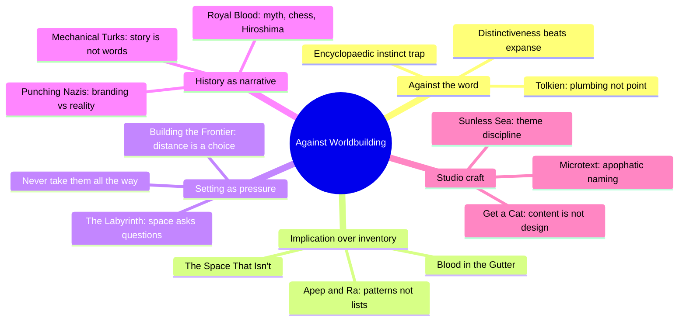
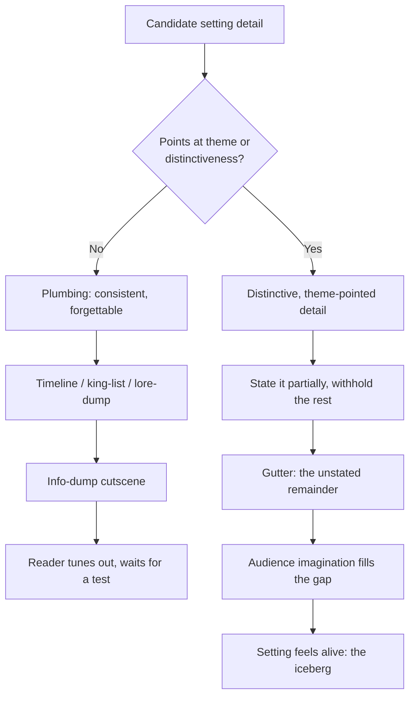
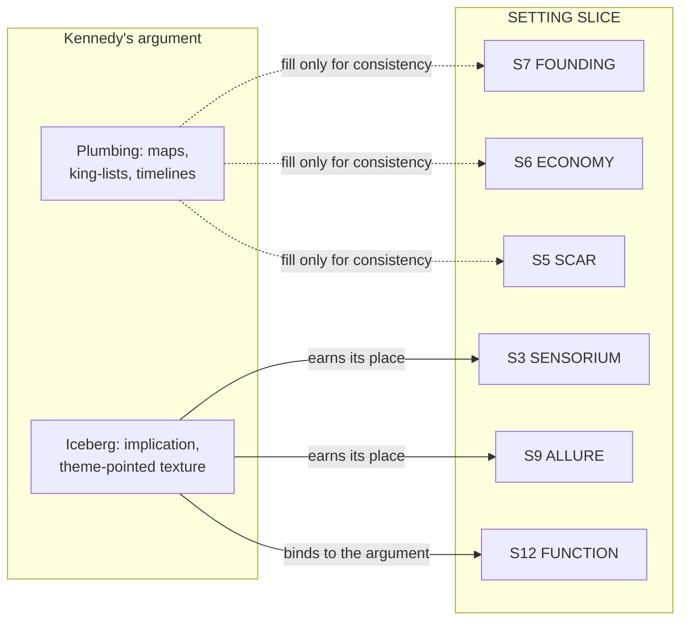

# BVX.0349 — Against Worldbuilding, and Other Provocations — Alexis Kennedy (2021)
### Knowledge Entry — Distill

The SETTING shelf's counter-voice: a working narrative designer's essay collection arguing that "worldbuilding" as method and word rewards encyclopaedic inventory over the felt, thematic, implication-driven texture that actually makes a place matter — the provocation the Command's SETTING SLICE has to survive contact with.

## TABLE OF CONTENTS
- [Core Thesis](#1-core-thesis)
- [Mind Models](#2-mind-models)
- [Framework](#3-framework--structure)
- [Key Concepts](#4-key-concepts)
- [Heuristics](#5-heuristics--decision-rules)
- [Invariants](#6-invariants)
- [Pitfalls](#7-pitfalls--myths)
- [Application](#8-application)
- [Cross-References](#9-cross-references)
- [Provenance](#10-provenance--confidence)

---

## 1 · CORE THESIS

"Worldbuilding" trains writers to think big, physical, encyclopaedic — maps, timelines, king-lists — when a setting's quality is measured on **distinctiveness, not expansiveness**. Detail is plumbing, not the point: the reader/player needs three telling things pointed at the theme and a gutter of implication to fill in themselves, not a building whose architect only ever discusses the pipes.

---

## 2 · MIND MODELS

*Required. Minimum two diagrams, maximum five.*

**Diagram 1 — the whole argument.**
Caption: *five clusters, one target — every essay attacks the same encyclopaedic instinct from a different craft angle (word choice, space design, history, or studio process).*

**Diagram 2 — the central mechanism (does this detail earn its place?).**
Caption: *the fork between plumbing and iceberg is the whole essay collection in one decision — most 'worldbuilding' fails at the first diamond.*

**Diagram 3 — mapped onto the Command's SETTING SLICE.**
Caption: *Kennedy would leave the origin/economy layers thin by default and spend the budget on sensorium, allure, and the S12 argument-binding — exactly the layers the FUNCTION axis already privileges.*

---

## 3 · FRAMEWORK / STRUCTURE

Not a system — an essay collection, unified by one recurring move: take a craft irritant (a word, a design habit, an industry panic) and trace it back to a first-principles question about what a game actually needs from its setting, its history, or its story. The book has no chapters in the architectural sense; the Command reads it through five functional clusters (see Diagram 1), not the book's own two-part "Writing About Games / About Writing Games" split, because the second part is mostly studio-process essays that only sometimes touch setting.

| Cluster | Governing question | Anchor essays |
|---|---|---|
| **Against the word** | What does "worldbuilding" train a writer to value? | *Against Worldbuilding* (title essay) |
| **Implication over inventory** | What does the audience do with what you don't show them? | *Blood in the Gutter*, *The Space That Isn't*, *Apep and Ra* |
| **Setting as pressure** | What does a place's design ask of the person moving through it? | *The Labyrinth*, *Building the Frontier*, *Seven Ways Into Poetic Design* |
| **History as narrative** | Why does "what really happened" always turn out to be a story shape? | *Royal Blood*, *Punching Nazis*, *Mechanical Turks* |
| **Studio craft** | How do you keep a setting's documentation honest at scale? | *Sunless Sea: The Post-Mortem*, *Get a Cat*, *Writing Pithy Game Microtext* |

---

## 4 · KEY CONCEPTS

| Concept | What it is | Source essay |
|---|---|---|
| **Worldbuilding as "plumbing"** | Maps, timelines, invented languages, king-lists — needed for consistency, not the source of appeal; "I wouldn't want to visit a building where the architect said 'this building is all about the plumbing.'" | *Against Worldbuilding* |
| **The "turn"** | Tolkien's term for the emotional catch a good fantasy delivers — "a beat and lifting of the heart" — which detail and timeline can support but never substitute for | *Against Worldbuilding* |
| **Distinctiveness over expansiveness** | The real measure of setting quality; most settings can't be "innovative" by definition, but any can be distinctive if pointed hard enough at one idea | *Against Worldbuilding* |
| **Blood in the gutter** | McCloud's term for the comic-panel gap the reader's imagination completes; games have bigger gutters than any prior medium since players move at their own pace | *Blood in the Gutter* |
| **"There's no there there"** | Virtual space isn't a standing dimension; it's assembled on demand, "like a book narrating how you turned left" — nothing exists until the software is asked "what's here?" | *The Space That Isn't* |
| **Apophatic detail** | Naming a thing by what's *absent* ("time has long erased the original blood-stains") does more work than stating it outright — implies without committing | *Writing Pithy Game Microtext* |
| **DRY setting documentation** | "Every piece of knowledge must have a single, unambiguous, authoritative representation" — distil to patterns, not detail white-lists; new team members retain guidelines, not lists | *Apep and Ra* |
| **Labyrinth vs. maze** | A maze offers choices; a labyrinth is unicursal, asking one question at a time — "a labyrinth is architecture that asks a question," and every navigable game space is one | *The Labyrinth* |
| **Distance as design, not default** | "Distance doesn't exist in a virtual world unless you put it there on purpose" — LambdaMOO's builders fought to make the world hard to traverse, then players fought to remove that friction | *Building the Frontier* |
| **The Skyrim Problem** | A space's *first* traversal carries meaning repeat traversal (fast travel) cannot — you don't get it back, but "the fact it's past doesn't mean it's gone" | *Building the Frontier* |
| **"Never take them all the way"** | Point every element at the theme, but always leave space for the audience's own response — the gutter's law applied to mechanics and art direction, not just prose | *Seven Ways Into Poetic Design* |
| **History as narrative shape** | Frazer's dying king, chess's vizier-to-queen promotion, and the chaos before the Jewel Voice Broadcast prove "history is complicated" — tragedy and farce together; a clean origin story is almost always a later edit | *Royal Blood* |
| **Branding beats accuracy in enemy design** | Nazis are the default video-game villain not for historical death toll (Stalin's, Leopold II's are comparable) but because the uniform reads instantly as "certified evil" | *Punching Nazis* |
| **Story is not words, buildings are not bricks** | Procgen/AI can arrange words the way machines arrange bricks; a wall and a library are different problems — "gameplay is what keeps happening the same, story is what keeps happening different" | *Mechanical Turks* |
| **Content spreads thin / "get a cat"** | Adding content to fix a design problem (mice in the monastery) treats the symptom; changing the system (get a cat) fixes the cause — more lore isn't automatically more pressure | *Get a Cat* |

---

## 5 · HEURISTICS & DECISION RULES

| Situation | Do this | Not this |
|---|---|---|
| Drafting a new setting/world | Find the designing detail that points at theme, then decide what to withhold | Start with a map and a timeline |
| A setting detail feels flat | Ask whether it connects to anything else, or to itself | Add more invented detail around it to compensate |
| Deciding how much backstory to write | Write only enough plumbing to keep the world consistent | Write centuries of history "just in case" |
| An NPC or place needs a name | Choose one that plausibly belongs to the setting's register, even if invented | Optimize for how cool the name sounds in isolation |
| Documenting setting for a team | Store the canonical fact once, in the system if possible; document patterns, not white-lists | Duplicate the same fact across multiple docs |
| Choosing documentation tools | Pick tools that open fast and encourage brevity (spreadsheets, text files) | Pick a wiki or a slow CMS and hope discipline compensates |
| Deciding how much of a space to describe | Give three sensory details and let the gutter do the rest | Fully specify every room, corner, and object |
| Designing traversal / distance | Decide deliberately whether distance should be friction or should be earned once and then removable | Default to either "always fast travel" or "always footslog" without asking what the first traversal should feel like |
| Players ask for "more content" | Check whether the request is really pointing at a design problem | Add content reflexively to quiet the request |
| Writing setting-adjacent history/lore | Treat it like real history: messy, contingent, farcical alongside tragic | Write a clean, single-cause founding myth |
| Choosing a video-game antagonist's dressing | Remember branding (uniform, symbol) does more work than historical accuracy | Assume period accuracy alone will make an enemy legible |

---

## 6 · INVARIANTS

1. **A setting's quality is measured on distinctiveness, not on how much of it exists.** Volume of invented material is not correlated with appeal.
2. **Every visible detail implies an invisible remainder the audience completes themselves.** The gutter/iceberg mechanism is not optional flavor — it's how audiences become emotionally invested in an incomplete world.
3. **Consistency is necessary but insufficient.** A world can be perfectly self-consistent and still be dull; consistency is the plumbing's job, not the appeal's source.
4. **Distance, traversal friction, and withheld information are design decisions, not defaults.** Nothing about a virtual space's difficulty or ease is neutral; it was chosen, and removing it is also a choice.
5. **Code and systems assert things prose can leave ambiguous.** A simulation that models one thing and omits another makes a claim whether or not the designer intended one (*The Rhetorical Effects of System Design*).
6. **History resists clean narrative shape, but audiences (and historians) keep imposing one anyway.** The presence of a satisfying story pattern in an historical account is itself a signal to be suspicious of, not a mark of accuracy.
7. **Documentation entropy is constant, not solved.** ("The struggle of Ra with the serpent Apep... there is no enduring victory.") A setting bible needs maintenance discipline for the life of the project, not a one-time write-up.

---

## 7 · PITFALLS / MYTHS

- Treating "worldbuilding" as synonymous with "good setting" — the word smuggles in an encyclopaedic, physical, map-first bias that the actual craft doesn't require.
- Believing invented languages or deep timelines are what make Tolkien's world work — they're the plumbing Tolkien happened to enjoy building, not the source of "the turn."
- Assuming more content automatically increases perceived richness — content that "spreads thin" (repeated, low-variance, backloaded) can make a world feel smaller, not bigger.
- Confusing a fully-simulated, photorealistic environment with a *felt* one — "things that look like things aren't actually things," and over-specifying a space can break the illusion it was meant to support (Second Life's decline as the example).
- Info-dumping setting history in an opening cutscene, then testing the player on it later — the single most-cited failure mode in the title essay.
- Adding a date to a timeline "for flavor" — every date you commit to constrains you to getting it right forever, at a cost disproportionate to the flavor gained.
- Believing period/historical accuracy alone makes an antagonist legible — branding (a uniform, a symbol) does the work of "certified evil" faster and more reliably than research does.
- Assuming a setting bible, once written, stays authoritative without maintenance — new team members write new docs rather than fix stale old ones unless DRY discipline is actively enforced.
- Assuming procedurally generated or AI-assisted setting content solves the "more content" problem — it solves the words-in-order problem, not the make-it-matter problem, which is a design problem, not a throughput problem.

---

## 8 · APPLICATION

- **Spine level:** `SETTING` (primary — this is the shelf's counter-voice) · touches `L0` (narratology-adjacent: the Kuleshov Effect, McCloud's gutter, and the Frazer/history-as-narrative material are all implication/reception-theory, not story-spine structure) · touches `L7` (Tolkien's fairy-story genre contract — what a reader expects "worldbuilt" fantasy/SF to deliver, and why breaking it with exposition breaks trust)
- **12-layer character stack:** none directly — this source is setting- and craft-facing, not character-facing
- **plot_systems:** contextual only — "never take them all the way" and the gutter mechanism apply as much to plotting withheld information as to setting, a link worth revisiting once `04_PLOT_SYSTEMS/` opens
- **Setting:** direct primary feed — see `feeds:` above; maps onto S3 SENSORIUM, S7 FOUNDING (as a caution), S9 ALLURE, and S12 FUNCTION

**Where Kennedy challenges the SETTING SLICE, stated plainly:** the slice is, structurally, the encyclopaedic method Kennedy provokes against — a 12-layer place sheet with a header, a rename lattice, an economy, a founding stack, is worldbuilding-as-inventory in everything but name. Instanced to full depth on every layer for every place, it's the "start with a map and a timeline" instinct the title essay calls the trap. Kennedy wouldn't say the taxonomy is wrong; he'd say most layers should sit thin, with effort concentrated on whichever two or three a scene's pressure actually needs — the discipline the SCENE CARD's "active strata" field already enforces (max two function modes, three sensorium details), and that DCUS's own instance already models by leaving S2 WEATHER an honest "canon-thin" gap instead of a forced fill.

The SSOT's own answer is already in its root claim: **"a place that pressures nothing is scenery, not setting."** Axis 3 FUNCTION keeps the slice from becoming plumbing — a layer earns detail only when it's doing anchor, characterize, pressure, mood, argue, or afford work in a scene — and S12's binding rule says the same thing structurally: **S1–S11 may run empty; S12 filled is what makes a setting load-bearing.** That's the house's iceberg, as schema rule rather than craft heuristic. Kennedy supplies the *why* (audience imagination does the real work) and the *how* (which sensory details earn their place, which timeline commitments to avoid); DCUS's S9 ALLURE row — "the meritocratic promise... the exact premise Tori must stop believing" — is the slice's best existing proof it can produce his iceberg rather than his plumbing.

---

## 9 · CROSS-REFERENCES

| Related entry | Relation |
|---|---|
| [[📐 ssot_03_setting_system]] | The SETTING SLICE this distill is the counter-voice to; §8 above states the challenge and the schema's built-in answer directly |
| [[BVX.0193]] | Truby, *Anatomy of Story* — Truby's story-world chapter (sampled, not distilled) treats the arena as metaphor tied to the designing principle, the same "point every element at the theme" discipline Kennedy names explicitly |
| [[BVX.0144]] | *Once Upon a Pixel: Storytelling and Worldbuilding in Video Games* — the mainstream worldbuilding-shelf source this entry is positioned directly against; a useful read-together pair for the Afford/environmental-storytelling axis |

---

## 10 · PROVENANCE & CONFIDENCE

Full text, pdftotext extraction, ~50,400 words, 170-page source, clean text layer, essay-collection structure with no numbered chapters (each essay stands alone with its own original-publication dateline). Read in full: the title essay (*Against Worldbuilding*), *The Space That Isn't*, *Blood in the Gutter*, *The Labyrinth*, *Building the Frontier*, *Royal Blood*, *Apep and Ra*, *Seven Ways Into Poetic Design*, *Mechanical Turks*, *Punching Nazis*, *The Rhetorical Effects of System Design, and Toilets*, and substantial portions of *Sunless Sea: The Post-Mortem* and *Get a Cat*. Sampled at heading/opening level per the purely game-industry-process or audience-management essays that don't bear on setting/history/lore/narrative design: *How It Happened to Happen*, *Resistance Isn't Futile*, *How to Survive the Internet*, *Worth It*, *How Things End*, *"It Gives Me Great Pleasure, A Good Name,"* the "Three Reviews of..." pieces, and *One Weird Trick to Get Started in Games Writing*. *Writing Pithy Game Microtext* was read closely for its apophatic-detail technique but not distilled line-by-line.

All quotes attributed to their essay title inline in §4 and §6–7. The SETTING SLICE mapping in §2 (Diagram 3) and §8 is this distill's synthesis — Kennedy never references the Command's schema; the mapping applies his craft argument to the SSOT's own layer names and binding rule, built against `ShroomsQ/_CANON/_SSOT/03_SETTING_SYSTEMS/📐 ssot_03_setting_system.md` PART A and PART B (read in full) and cross-checked against the SETTING × LIBRARY section, which already logs BVX.0349 as "the counter-argument (worldbuilding serves pressure, not inventory — the doc's own root claim)."

## META
- Template: BVX-LEARN-v4.0
- Source classification: full-text essay collection, deep extraction on setting/history/narrative-design essays, heading-level sampling on pure games-industry/audience-management essays
- Created / Updated: 2026-09-16
