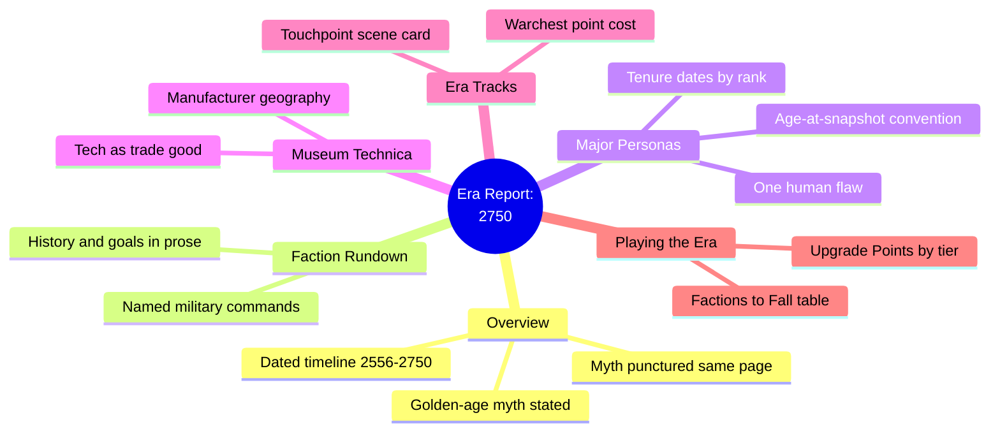
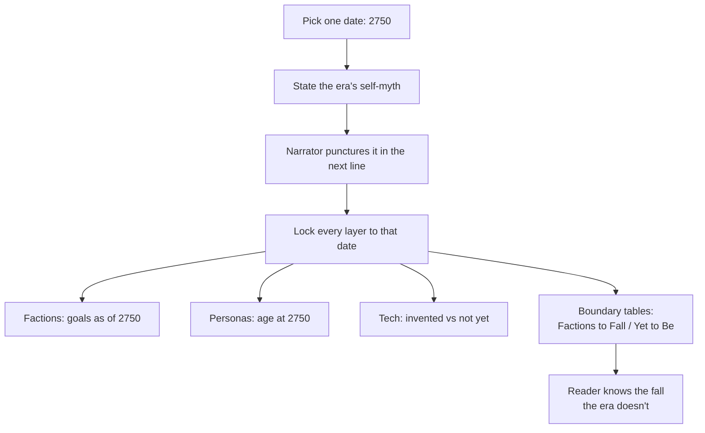
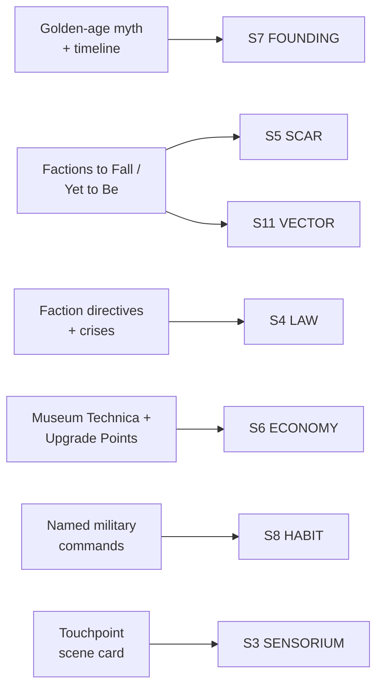

# BVX.0362 — BattleTech: Era Report — 2750 — Aaron Pollyea, Joel Steverson (Catalyst Game Labs) (2012)
### Knowledge Entry — Distill

A published TTRPG worldbook, not a craft essay: an in-universe snapshot of the BattleTech universe frozen at one date, showing how a working game studio actually builds and dates an era slice of a science-fiction setting.

## TABLE OF CONTENTS
- [Core Thesis](#1-core-thesis)
- [Mind Models](#2-mind-models)
- [Framework](#3-framework--structure)
- [Key Concepts](#4-key-concepts)
- [Heuristics](#5-heuristics--decision-rules)
- [Invariants](#6-invariants)
- [Pitfalls](#7-pitfalls--myths)
- [Application](#8-application)
- [Cross-References](#9-cross-references)
- [Provenance](#10-provenance--confidence)

---

## 1 · CORE THESIS

An era snapshot locks a whole setting to one date and tells it twice: the era's own golden-age myth, then the truth underneath it. Timeline, factions, named persons, and technology all stay dated to that same instant, including a dissolution ledger the era's people don't yet know to fear.

---

## 2 · MIND MODELS

*Required. Minimum two diagrams, maximum five.*

**Diagram 1 — the whole argument.**
Caption: *six chapters, each locked to 2750, running the same date through history, faction, person, and hardware in turn.*

**Diagram 2 — the central mechanism (the date-lock, run once per layer).**
Caption: *every layer answers to the same clock, and the boundary tables are what keep the clock honest.*

**Diagram 3 — mapped onto the Command's SETTING SLICE (S1–S12).**
Caption: *six chapters land cleanly on five S-layers plus a scene-card match — this book is a worked instance, not a theory of setting design.*

---

## 3 · FRAMEWORK / STRUCTURE

Six chapters, each a different lens on the same fixed date (2750, the year First Lord Simon Cameron's Peace Tour begins the Star League's visible unraveling), stated explicitly in the book's own "How to Use This Book":

| Chapter | Governing move |
|---|---|
| Humanity's Zenith (overview) | State the era's general shape and a dated timeline, 2556–2750 |
| 2750 Faction Rundown | Each Great House and Periphery power: history, goals, then its iconic military commands |
| Major Personas | The named figures shaping the era, keyed to rank, tenure, and age |
| Museum Technica | The technological state of the Inner Sphere at its industrial peak |
| Era Tracks | Scenario seeds (Touchpoints) built on named historical battles |
| Playing the Star League Era | Chargen and campaign rule modifications, plus hard boundary tables on what can and can't exist yet |

The book states its own method up front rather than leaving it implicit: overview, then faction, then persona, then hardware, then play — each pass narrower than the last, all locked to the same year.

---

## 4 · KEY CONCEPTS

| Concept | What it is | Why it matters |
|---|---|---|
| **The myth-then-puncture open** | The book's epigraph states the era's own self-image ("the days when we all stood united... prosperity was the order of the day") and the very next paragraph contradicts it ("It is no small shame that none of that was true") | Bakes dramatic irony into the setting's own front matter instead of leaving it for the reader to infer later |
| **Date-lock** | Every chapter — history, faction, persona, tech — is written as true only as of the one stated year | Makes the era snapshot internally consistent and cross-checkable against every other era in the same shelf |
| **Factions to Fall / Factions Yet to Be** | A table naming which major powers dissolve during this era (with exact date ranges) and which don't exist yet and must not be used | A forward SCAR ledger: the wound's date is fixed before the wound is narrated, so writers using a later era can't contradict this one |
| **Iconic military command** | A faction's political-history prose is followed immediately by named units, each with a nickname, composition, and a battle anecdote | Belonging and esprit de corps delivered as story texture, not as a morale number |
| **Persona stat-block convention** | Rank/Title with tenure dates, Born with computed age-at-snapshot, then career bio ending in one personal flaw | A fast, repeatable way to introduce a dated cast without a full biography for each name |
| **Technology as trade good** | Museum Technica traces weapons and equipment through who manufactures them, where, and how rival powers acquire them (often by reverse-engineering through legitimate subcontract work) | Technology is geopolitics and economy first, spec sheet second |
| **Upgrade Points by affiliation** | A numeric table (Star League 8, Great Houses 6, Periphery/mercenary 4, pirate 2) converts "how advanced is this faction's tech" into a spendable resource at the table | Encodes setting-wide asymmetry as a mechanic a GM can hand a player, not just a paragraph of description |
| **Touchpoint** | A named historical battle rebuilt as a playable scenario: a planet's full physical stat block, an eyewitness epigraph, victory conditions, and optional paid bonuses (Warchest Points) | A place and a dramatic incident packaged together — a scene card built for a different purpose than the Command's, arriving at the same shape |

---

## 5 · HEURISTICS & DECISION RULES

| Situation | Do this | Not this |
|---|---|---|
| Opening an era snapshot | State the era's own myth, then puncture it in the same breath | Let the reader discover the irony chapters later, unsignposted |
| Writing a faction at a fixed date | Root governance in the crisis directives issued during this window | Describe a timeless, static government structure |
| Introducing a named figure | Give rank/tenure dates, compute their age at the snapshot date, and one human flaw | List a full cradle-to-grave biography for every name |
| Deciding whether a technology, faction, or organization can appear | Check it against an explicit boundary table (exists yet / already gone) | Assume "it's in the setting bible somewhere" means it's live at this date |
| Showing a military unit's character | Give it a nickname and one battle anecdote per sub-formation | List its order of battle and stop |
| Building a scenario from setting material | Package the place's stat block with a specific dated incident and an eyewitness voice | Hand the GM a battle map and a faction name with no texture |
| Encoding a faction's tech or resource edge | Convert it to a number (points, tiers) the table can spend | Leave power asymmetry as prose the GM has to eyeball |

---

## 6 · INVARIANTS

1. **An era snapshot is dated, not evergreen.** Every claim in it is true only as of the stated year; a later or earlier era in the same setting can openly contradict it.
2. **The era's self-myth and the narrator's knowledge of its fall coexist on the same page.** Dramatic irony is structural, not a twist saved for later.
3. **A faction's history and its named units are inseparable.** Political prose without an iconic command to embody it stays abstract; the units are where belonging lives.
4. **A named person needs an age at the snapshot date, not just a birth year.** The reader should be able to do the arithmetic of "how old, how established, how much time is left" without doing math.
5. **What doesn't exist yet is as load-bearing as what does.** A boundary table (Factions to Fall / Yet to Be) is a consistency tool, not decoration.
6. **Technology diffuses through economics and politics, not spontaneously.** Who builds a weapon and who reverse-engineers it is part of the setting, not an appendix.
7. **A scenario built from setting material needs a place and a moment together.** A stat block alone is inert; an incident alone has no ground under it.

---

## 7 · PITFALLS / MYTHS

- Treating an era's own propaganda as the setting's truth instead of stating it and then cracking it open.
- Writing faction history as static structure instead of a sequence of dated crises and directives.
- Giving a persona a birth year but never doing the subtraction — readers shouldn't have to compute "how old is she now."
- Letting a later-era organization or technology bleed backward into an earlier snapshot because "it's all one setting bible."
- Describing a military unit only by hardware loadout, skipping the nickname and the one battle that explains its reputation.
- Publishing a scenario as a bare map and faction pairing, with no eyewitness voice or planetary specificity to make the place real.
- Leaving power asymmetry between factions as unmeasured prose instead of a number a table can use.

---

## 8 · APPLICATION

- **Spine level:** SETTING (non-story-spine source; keys to the entity beside the L0–L7 spine, per the SETTING SLICE's own binding rule)
- **12-layer character stack:** none directly — the persona stat-block convention (tenure dates, age-at-snapshot, one flaw) is a fast dated-cast-introduction pattern, structurally adjacent to a quick L1 CORE/L7 ORIGIN card but not itself an L-layer feed
- **plot_systems:** contextual candidate once `04_PLOT_SYSTEMS/` opens — the Touchpoint format (place stat block + dated incident + eyewitness epigraph + stakes) is a ready-made scenario generator for turning a setting fact into a playable or writable scene
- **Setting:** primary — feeds S3 SENSORIUM, S4 LAW, S5 SCAR, S6 ECONOMY, S7 FOUNDING, S8 HABIT, S11 VECTOR at the strengths listed in frontmatter

Read against DCUS and its own rename lattice (Red Stick Creek → Red Hills → DCUS), the "Factions to Fall / Yet to Be" table is the single most portable idea here: a plain boundary ledger, dated, stating what has already happened and what hasn't happened yet at a given snapshot, would let the Command run dated cross-sections of DCUS the way Catalyst runs dated cross-sections of the Inner Sphere — without a writer accidentally letting a later development bleed into an earlier scene. The myth-then-puncture open is the second exportable move: state the setting's own official story in-world, then let the narrating voice (or the next paragraph) crack it, so the reader carries the dramatic irony forward instead of receiving it as an authorial aside. Both techniques are TTRPG tools a writer can steal outright — they cost nothing narratively and buy consistency across every future dated slice of the same setting.

---

## 9 · CROSS-REFERENCES

| Related entry | Relation |
|---|---|
| [[BVX.0458]] | Kobold Guide to Worldbuilding — the theory/toolkit counterpart on the same SETTING shelf; this entry is the worked instance of an era-dated slice, that one the essay collection on setting craft generally |
| [[BVX.1122]] | GURPS Hot Spots: Renaissance Venice — sibling worked instance; that one proves S12 unfillable from a gazetteer, this one proves S5/S11 fillable from a dated era snapshot |
| [[BVX.0363]] | BattleTech: Era Report — 3052 — undistilled sibling in the same era-report series, a later dated cross-section of the same setting |
| [[BVX.0364]] | BattleTech: Era Report — 3062 — undistilled sibling, same series |
| [[BVX.0365]] | BattleTech: Era Report — 3145 — undistilled sibling, same series |

---

## 10 · PROVENANCE & CONFIDENCE

Full text, pdftotext extraction, 162pp. The opening pages (title page and a map bleeding text underneath, roughly the first 180 lines) extract badly garbled — text laid over a starmap renders as scrambled character soup — but the credits page, "How to Use This Book," and every body chapter thereafter extract clean with legible headers. Read in full: the table of contents; the front-matter epigraph and "How to Use This Book"; the opening of "History and Review" (Beginnings, Andurien, the timeline device); the Capellan Confederation faction entry in full, including three of its named military commands (Eighth Liao Lancers, First Capellan Chargers, Third Chesterton Cavalry); the Capellan Major Personas block (Warex Liao, Li Ming Ling, Shari Beatrice Madsen, Maylin Lorix); the Museum Technica introduction and its autocannon/Gauss rifle entries; the Golden Age of Technology section with the Star League Upgrade Table and Upgrade Costs Table; Factions to Fall / Factions Yet to Be; the opening of Creating Characters in the Star League Era; and the "Death of a Prince" Touchpoint scenario in full, including its planetary stat block and Warchest bonuses. Sampled by table of contents only (not deep-extracted): the remaining four Great House faction entries and their named units, the full Major Personas roster for the other five factions, the remaining Museum Technica entries (missile systems, combat equipment, mega-engineering), the other three Touchpoints, and the Martial Olympiad mini-campaign chapter.

The S-layer keying in frontmatter `feeds:` is this distill's synthesis against `ssot_03_setting_system.md` (PART A, the twelve-layer SETTING SLICE), following the same worked-instance method BVX.1122 established for GURPS Hot Spots: Renaissance Venice — this book is read as a second concrete instance of a SETTING-SLICE cross-section, dated rather than geographic. `spine: [SETTING]` and the empty character-stack application are asserted per the v4 template's binding rule that setting is an entity beside the story-spine, never an L0–L7 rung.

## META
- Template: BVX-LEARN-v4.0
- Source classification: full-text TTRPG sourcebook, deep extraction on the Capellan faction/persona thread plus Museum Technica, Golden Age of Technology, and one full Touchpoint; sampled elsewhere by TOC
- Created / Updated: 2026-09-29
