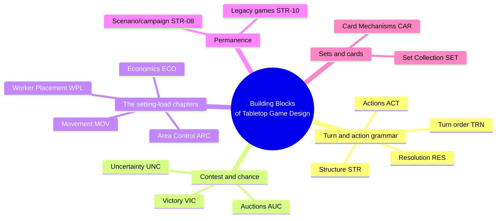
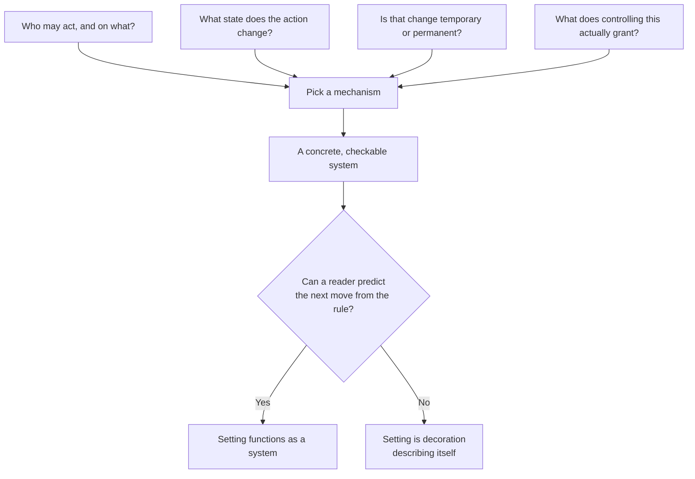
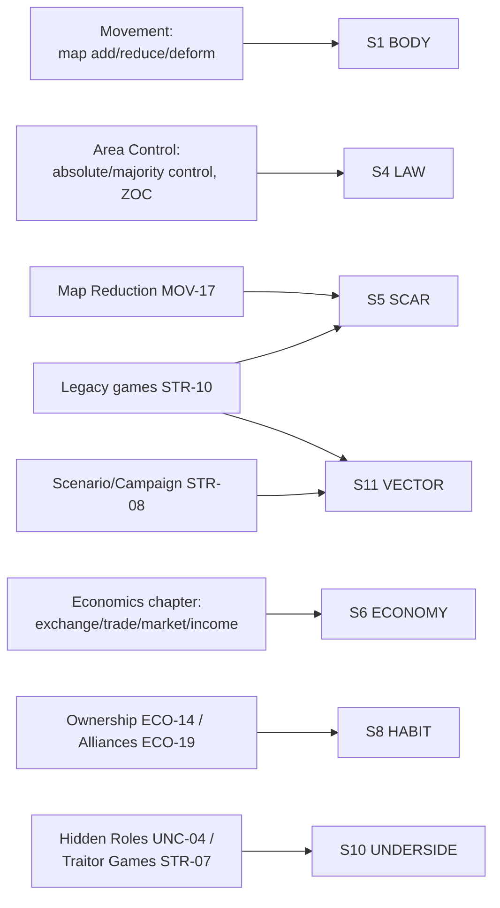

# BVX.0387 — Building Blocks of Tabletop Game Design: An Encyclopedia of Mechanisms — Geoffrey Engelstein and Isaac Shalev (2020)
### Knowledge Entry — Distill

A ~200-entry encyclopedia of tabletop game mechanisms, organized by function (structure, turn order, actions, resolution, victory, uncertainty, economics, auctions, worker placement, movement, area control, set collection, cards); read here not for its rules but for its systems vocabulary, which is a ready-made toolkit for making a fictional setting behave like something with real, checkable mechanics rather than describable flavor.

## TABLE OF CONTENTS
- [Core Thesis](#1-core-thesis)
- [Mind Models](#2-mind-models)
- [Framework](#3-framework--structure)
- [Key Concepts](#4-key-concepts)
- [Heuristics](#5-heuristics--decision-rules)
- [Invariants](#6-invariants)
- [Pitfalls](#7-pitfalls--myths)
- [Application](#8-application)
- [Cross-References](#9-cross-references)
- [Provenance](#10-provenance--confidence)

---

## 1 · CORE THESIS

A game mechanism is a reusable answer to a design question (how do resources move, how is territory held, how does state change permanently), not a theme-specific rule. Read as worldbuilding craft: a setting's economy, law, and history stop being adjectives the moment they are specified as mechanisms — who can act, what changes, and what cannot be undone.

---

## 2 · MIND MODELS

*Required. Minimum two diagrams, maximum five.*

**Diagram 1 — the whole argument.**
Caption: *thirteen chapters of mechanism, but only four chapters carry the setting-shelf's weight — economics, area control, movement, and the structures that make state permanent.*

**Diagram 2 — the central mechanism (a design process, run on any setting question).**
Caption: *every mechanism in the book answers the same four questions — the questions, not the specific answers, are what transfers to a fictional setting.*

**Diagram 3 — mapped onto the Command's SETTING SLICE (S1–S12).**
Caption: *the mechanisms chapters land almost entirely on the "how it functions" layers (BODY, LAW, SCAR, ECONOMY, HABIT, UNDERSIDE, VECTOR) — this book is a structural engine, not a sensory or founding-myth source; it complements BVX.0458 (Kobold) rather than duplicates it.*

---

## 3 · FRAMEWORK / STRUCTURE

The book organizes ~200 mechanisms into thirteen chapters, each a functional category rather than a genre: Game Structure, Turn Order, Actions, Resolution, Game End and Victory, Uncertainty, Economics, Auctions, Worker Placement, Movement, Area Control, Set Collection, Card Mechanisms. Every entry follows one template: Description (one sentence), Discussion (how it is implemented, with variants and named games), Sample Games. There is no narrative or worldbuilding chapter; the authors say so directly — "we do brush lightly on topics like narrative... there remains a lot of unmapped terrain." The setting-shelf value is not in any one chapter's stated purpose but in reading four chapters (Economics, Area Control, Movement, and the permanence-mechanisms buried in Game Structure) as a systems specification for a fictional place.

---

## 4 · KEY CONCEPTS

| Concept | What it is | Why it matters |
|---|---|---|
| **Asset vs. resource** | Asset is anything of value (money, capital goods, intangibles like turn order); resource narrows to money and fungible goods | Forces a designer (or a worldbuilder) to name precisely what a place's economy trades in before describing its wealth |
| **Open vs. closed economy** | Open: a bank injects new resources into play. Closed: all resources already exist and just move between holders | A setting's economy is either growing (open, hopeful, expansionist) or zero-sum (closed, cutthroat, scarcity-driven) — naming which one is a single decision that governs a lot of downstream tone |
| **Hierarchical vs. lateral exchange** | Hierarchical: resources convert one-way up a value ladder (wood -> boards -> fuel -> coin). Lateral: resources trade sideways at flexible rates | Hierarchical economies produce specialists and bottlenecks; lateral economies produce generalists and price wars — a structural choice, not flavor |
| **Absolute vs. majority (proportional) control** | Absolute: one faction holds a territory outright, others are barred. Majority: multiple factions can occupy the same ground, and the largest presence wins the benefit | The single most useful area-control distinction for a story's map: does a contested region belong to one side, or is it messily, measurably shared? |
| **Zone of Control (ZOC)** | Spaces adjacent to a unit or faction constrain what an opposing unit may do there, without that faction ever occupying the space | A mechanical account of "sphere of influence" — how a faction projects authority past its own borders without conquest |
| **Force Projection** | The range, reach, or threat radius of a unit or faction that shapes opponents' decisions before any contest occurs | Deterrence, coded as a mechanism: a faction's power is what it can reach, not just what it already holds |
| **Map Addition / Reduction / Deformation** | A place's geography can grow (exploration reveals more), shrink (ground is lost, options close off), or reshape (the board itself rotates or is redrawn) | Three distinct, nameable ways a setting's physical layer changes over the story, each with a different emotional register (expansion, loss, upheaval) |
| **Legacy mechanism** | Permanent, irreversible changes to shared state carry forward from session to session — torn cards, defaced boards, unlocks that cannot be undone | The mechanical definition of a setting that actually has history: what happened stays happened, and the story world after Movement 2 is not resettable to Movement 1 |
| **Contracts (public/private)** | Public contracts are visible and race-able by anyone; private contracts belong to one holder, visible or hidden | A model for how obligations and quests function structurally in a setting — some promises are common knowledge and contested, others are secretly held |
| **Alliances (formal vs. informal)** | Negotiation (ECO-18) is agreement with no mechanical teeth; Alliance (ECO-19) is a formal state the rules track and enforce, entered and exited at defined moments | Distinguishes a handshake deal between factions from a treaty — useful for deciding how binding a setting's political relationships actually are |
| **Hidden Roles / Traitor structure** | One or more actors carry an identity or allegiance unknown to the others, revealed by pressure or self-disclosure rather than by declaration | A mechanical account of the "who is really loyal here" question that a faction-heavy setting runs on |

---

## 5 · HEURISTICS & DECISION RULES

| Situation | Do this | Not this |
|---|---|---|
| Defining a place's economy | Name what counts as an asset vs. a resource, and whether the system is open or closed, before describing wealth or poverty | Describe a place as "rich" or "poor" with no mechanism for how value moves or is created |
| A faction holds territory | Decide explicitly: absolute control (theirs alone) or majority control (contested, proportional, others still present) | Leave "who controls this region" as an unexamined given — it changes what conflict there looks like |
| A faction's reach exceeds its borders | Give it a Zone of Control or Force Projection logic — what it can threaten without occupying | Draw a hard border and treat everything past it as simply "not theirs" |
| The world needs to show scars from war, collapse, or loss | Use Map Reduction logic: territory, options, or resources are permanently removed, not just described as ruined | Narrate devastation while leaving every mechanic and location fully intact and available |
| A campaign or movement structure spans multiple story arcs | Treat state changes as Legacy-style: irreversible, carried forward, unlocking what comes next | Reset the setting to a clean slate between movements for narrative convenience |
| A faction's loyalty or allegiance is in question | Give it Hidden-Role structure — an identity it knows and the room does not, revealed under specific pressure | Have characters simply announce their true allegiance when the plot needs it |
| A political relationship between factions needs weight | Decide if it's a Negotiation (informal, breakable at will) or an Alliance (formal, entered/exited at defined moments, mechanically binding) | Treat all inter-faction deals as equally solid or equally worthless |
| Introducing a setting-wide obligation or quest thread | Decide public (everyone races for it) or private (only the holder can act on it, visible or hidden) | Leave every plot hook equally available to everyone with no ownership logic |

---

## 6 · INVARIANTS

1. **A mechanism is a reusable answer, not a themed rule.** The same Area Majority structure works for Spanish provinces (El Grande) or Cold War influence (Twilight Struggle) — the underlying question (who has the most presence, and what does that grant) is separable from its dressing.
2. **Control is never a single concept.** "Who holds this place" always resolves to one of a small number of named structures (absolute, majority, zone of control, force projection), and picking one is a design decision with real consequences, not a narrative afterthought.
3. **Permanent change requires a permanence mechanism.** A setting does not "have history" just because a designer says it does; something has to be actually, irreversibly altered (Legacy-style) for consequence to be real and trackable.
4. **Economic systems need a stated flow, not just a stated value.** Money or resources need to enter, move, and (sometimes) leave the system through named channels (income, market, loans, contracts) or "wealth" is unfalsifiable set dressing.
5. **Hidden information needs a resolution moment.** A secret (an identity, an allegiance, a scar) is inert until the system defines when and how it surfaces — pressure, a vote, a self-reveal, a discovered card.

---

## 7 · PITFALLS / MYTHS

- Treating "territory" as binary and uncontested when the interesting story case is almost always proportional, shared, or contested majority control (ARC-02) — flat "this land belongs to X" flattens the politics that make a setting alive.
- Narrating devastation, decline, or loss without an actual removed asset behind it — Map Reduction (MOV-17) works because something concrete and countable is gone, not because a scene says the world is worse now.
- Confusing a Negotiation (informal, no teeth) with an Alliance (formal, tracked, entered and exited under rules) — political relationships that are supposed to be binding need a mechanism, not just a promise made on the page.
- Letting "hidden agenda" characters simply announce themselves at the convenient dramatic moment instead of building the pressure/reveal structure that makes Hidden Roles (UNC-04) work as suspense rather than exposition.
- Building an economy with value but no flow — a resource that has worth but no channel to be earned, spent, traded, or lost isn't an economy, it's a stat.
- Assuming legacy-style permanence only applies to physical destruction; the book is explicit that unlocks (new mechanisms, factions, maps becoming available) are just as central to the legacy structure as the torn card — a setting's history is written as much in what becomes newly possible as in what is destroyed.

---

## 8 · APPLICATION

- **Spine level:** SETTING (non-story-spine source; keys to the entity beside the L0–L7 spine, per ssot_03's binding rule that setting is a Domain embodied, never a level)
- **12-layer character stack:** none directly — this is a mechanisms-for-systems source; its "who may act, what changes, is it permanent" question set is structurally the same shape as auditing an L6 DRIVE want against its costs, but it does not itself feed a character layer
- **plot_systems:** strong contextual candidate once `04_PLOT_SYSTEMS/` opens — Area Control's absolute/majority distinction and Zone of Control give a ready vocabulary for scene-level faction contests; Legacy-game unlocks give a template for how a movement's ending should hand concrete new capability to the next movement, not just new description
- **Setting:** primary — this distill's real contribution is mechanizing four SETTING SLICE layers that BVX.0458 (Kobold Guide) treats descriptively: S4 LAW gets a menu of control types instead of one word ("governed"), S5 SCAR gets a named removal-mechanism instead of a mood, S6 ECONOMY gets a full parts list (exchange, market, income, loans, ownership, contracts, bribery, negotiation, alliances), and S11 VECTOR gets a concrete permanence rule via Legacy Games

Read against DCUS (the working SETTING instance in `ssot_03`), this book's method sharpens two already-ruled layers rather than opening new ones. S5 SCAR's rename lattice (Skeeter Creek -> Red Hills -> DCUS) is functionally a Legacy-game unlock-in-reverse: something was permanently removed (the old name's legitimacy) and something was permanently granted (the new administration's authority) at each rename, exactly the "torn card, new capability" pairing the book insists Legacy structure always carries. S11 VECTOR's six-movement descent (clean -> NEON-ROT -> hunt) reads directly as a Map Reduction arc: each movement should be specifiable as what concrete asset, territory, or option was removed, not just as a mood shift. The clearest unclaimed opportunity is S4 LAW: DCUS's Administration and Star-Rating system currently reads as a single "depersonalized OS," but the Absolute/Majority/Zone-of-Control taxonomy here gives a way to specify exactly how contested any given hall, dorm, or department actually is — which the Command has not yet written down. Any writer building a TTRPG-adjacent story setting can steal this book wholesale as a worldbuilding tool: run a place's law, economy, and history through "which named mechanism is this, concretely" before trusting it as more than mood.

---

## 9 · CROSS-REFERENCES

| Related entry | Relation |
|---|---|
| [[BVX.0458]] | Kobold Guide to Worldbuilding — the descriptive/narrative-craft counterpart on the same SETTING shelf; that book supplies geography-order, history-that-bites, and religion method, this book supplies the mechanical grammar (control types, economy parts, permanence rules) those methods lack |
| [[BVX.0349]] | *Against Worldbuilding, and Other Provocations* — the counter-argument sibling; this book's mechanism-first discipline is a structural answer to Kennedy's kitchen-sink complaint, since a named mechanism is inherently thinner and more legible than an encyclopedic description |
| [[BVX.1122]] | GURPS Hot Spots: Renaissance Venice — the worked-example sibling; where that book fills BODY/LAW/ECONOMY/FOUNDING richly from trade-gazetteer convention, this book supplies the underlying mechanism vocabulary (control types, market structure) that gazetteer content is implicitly running on |

---

## 10 · PROVENANCE & CONFIDENCE

Full text, pdftotext extraction, ~15,300 lines, clean text layer with a machine-readable TOC and page-numbered chapter/section headers. Read in full: Foreword (Eric Zimmerman), Acknowledgments, Authors, Introduction (including "A Note on References"), Chapter 1 Game Structure (all ten sections, STR-01 through STR-10, including Traitor Games, Scenario/Mission/Campaign Games, Score-and-Reset Games, and Legacy Games in full), Chapter 7 Economics (chapter intro plus all nineteen sections, ECO-01 through ECO-19, in full), Chapter 11 Area Control (chapter intro plus all eight sections, ARC-01 through ARC-08, in full), Chapter 10 Movement (chapter intro, MOV-01 Tessellation in full, and MOV-16 through MOV-22 — Map Addition, Map Reduction, Map Deformation, Move Through Deck, Movement Template, Pieces as Map, Multiple Maps — in full), Chapter 6 Uncertainty (UNC-04 Hidden Roles and UNC-05 Roles with Asymmetric Information, in full). Sampled via table of contents and targeted grep for cross-references only: Chapters 2–5 (Turn Order, Actions, Resolution, Game End and Victory), Chapter 8 Auctions, Chapter 9 Worker Placement, Chapter 12 Set Collection, Chapter 13 Card Mechanisms, and the Game Index. The book explicitly disclaims narrative/theme coverage in its own Introduction; no distillable content was skipped there, the disclaimer was taken at the authors' word.

The S-layer keying in frontmatter `feeds:` and Diagram 3 is this distill's synthesis against `ssot_03_setting_system.md` (PART A, the twelve-layer SETTING SLICE), reading the mechanisms chapters (Economics, Area Control, Movement, and Game Structure's permanence sections) against the layers they most concretely specify. Unlike BVX.0458, this book supplies no content for S2 WEATHER, S3 SENSORIUM, S7 FOUNDING, S9 ALLURE, or S12 FUNCTION — it is a structural-mechanism source, not a descriptive or thematic one, and those gaps are expected rather than a shortfall of this source.

## META
- Template: BVX-LEARN-v4.0
- Source classification: full-text nonfiction reference/encyclopedia, deep extraction on 4 of 13 chapters plus full front matter, TOC-sampled on the remaining 9
- Created / Updated: 2026-09-29
