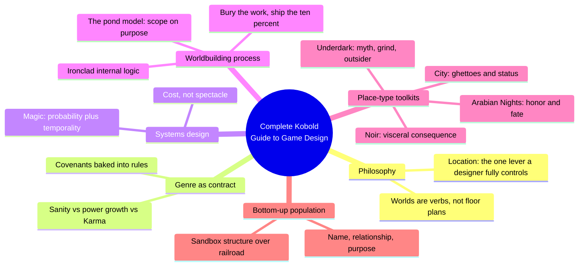
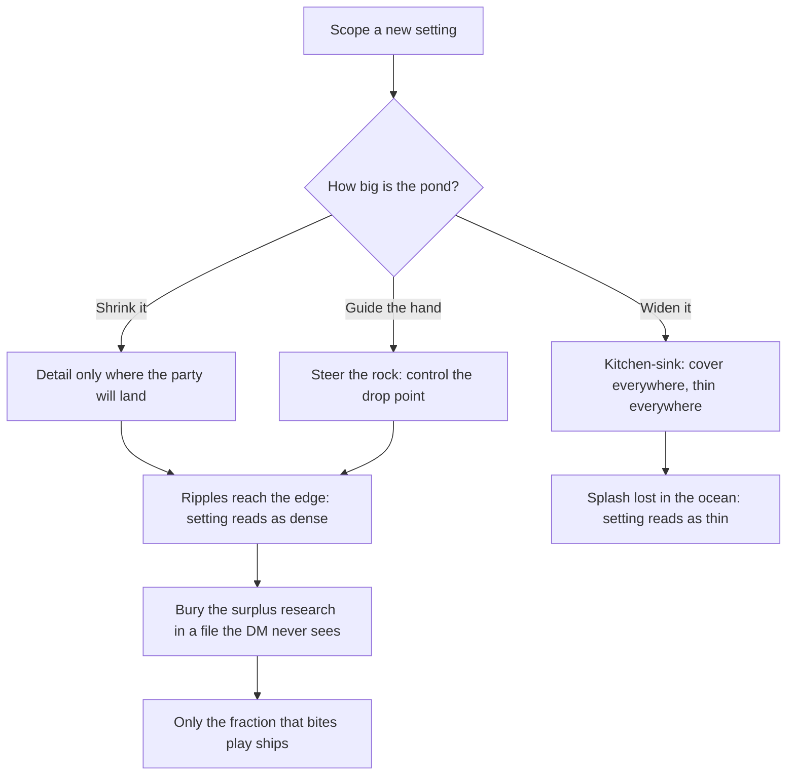
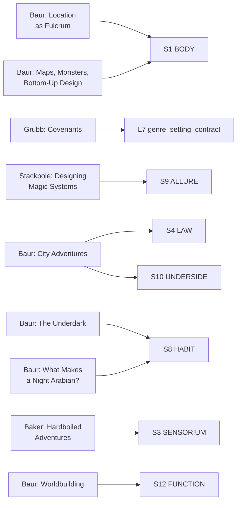

# BVX.0394 — Complete Kobold Guide to Game Design (Second Edition) — ed. Janna Silverstein (2019)
### Knowledge Entry — Distill

A 40-essay tabletop-RPG-design anthology (mostly Wolfgang Baur, with Grubb, Stackpole, Baker, and others); ten of its essays carry setting-building method and form the mechanics-and-craft companion to BVX.0458's worldbuilding philosophy.

## TABLE OF CONTENTS
- [Core Thesis](#1-core-thesis)
- [Mind Models](#2-mind-models)
- [Framework](#3-framework--structure)
- [Key Concepts](#4-key-concepts)
- [Heuristics](#5-heuristics--decision-rules)
- [Invariants](#6-invariants)
- [Pitfalls](#7-pitfalls--myths)
- [Application](#8-application)
- [Cross-References](#9-cross-references)
- [Provenance](#10-provenance--confidence)

---

## 1 · CORE THESIS

A game designer's only fully controlled story element is the setting, so build outward from location, not lore: pick a place that is exotic, plausible, and worthy of the story's stakes, then bury ninety percent of the research and ship only what the table will touch. Genre, magic, and monsters are mechanical contracts, not mood board choices.

---

## 2 · MIND MODELS

*Required. Minimum two diagrams, maximum five.*

**Diagram 1 — the whole argument.**
Caption: *ten essays out of forty sort into six setting-craft moves — the book is a toolbox for the table, not a worldbuilding theory.*

**Diagram 2 — the central mechanism (the Pond Model, a scoping process).**
Caption: *the same rock makes a bigger splash in a small pond than in an ocean — narrow scope is the mechanism that makes a setting feel dense, not a compromise forced by lack of time.*

**Diagram 3 — mapped onto the Command's SETTING SLICE (S1–S12).**
Caption: *nine essays land on six S-layers plus L7 — this book sharpens the same layers BVX.0458 already claims, from the rules-and-mechanics side rather than the narrative-philosophy side, and partly fills the S3 gap BVX.0458 flagged as thin.*

---

## 3 · FRAMEWORK / STRUCTURE

Forty essays across three sections (Design; Enhancing Adventures; Writing, Pitching, Publishing), assembled from three earlier Kobold Guide volumes. Most of the book is craft that isn't setting-specific (combat systems, playtesting, pitching, editing, career advice); ten essays carry the setting-building method this distill draws on:

| Essay | Author | Governing question |
|---|---|---|
| Covenants: Genre Expectations and Mechanics in RPG Design | Grubb | What unwritten genre promise does the rulebook enforce? |
| Designing Magic Systems | Stackpole | What does a spell cost, not just what does it do? |
| Location as a Fulcrum for Superior Design | Baur | What's the one setting element a designer fully controls? |
| Worldbuilding | Baur | How much world does a table actually need? |
| City Adventures | Baur | How does a city break the dungeon's combat rules? |
| The Underdark | Baur | What three appeals make an underground setting work? |
| Maps, Monsters, and Bottom-Up Design | Baur | What three facts does every speaking monster need? |
| Buckets in the Sandbox | Baur | Does "open world" mean "no structure"? |
| Hardboiled Adventures: Make Your Noir Campaigns Work | Baker | What makes a fantasy city read as noir? |
| What Makes a Night Arabian? | Baur | What turns a desert into "Arabian Nights," not just sand? |

No single spine ties these together beyond the author's recurring craft instinct: a setting is judged by what it does at the table, never by how completely it's documented.

---

## 4 · KEY CONCEPTS

| Concept | What it is | Why it matters |
|---|---|---|
| **Location as the designer's one lever** | The DM improvises NPC voice, tactics, and plot beats; only the map, sequence, and area descriptions reliably survive contact with the table | Redirects design effort toward the one layer that stays as written |
| **Exotic / Plausible / Worthy triad** | The three tests a location must pass: strange enough to justify the trip, familiar enough to be legible, and connected to something bigger than the current quest | A location failing any leg reads as filler no matter how well-drawn |
| **The Pond Model** | Worldbuilding scope control: shrink the pond, guide the party's hand, or widen the pond to swallow any splash; the author recommends shrinking | A small, deliberately scoped setting produces a denser, more memorable splash than an encyclopedic one |
| **Genre covenant** | Genre is a mechanical promise the rules enforce (sanity loss, power growth, Karma spending), not a description in the intro chapter | A horror game without a cost for fear is a fantasy game wearing a horror costume |
| **Probability and temporality** | The two dials under any magic (or technology) system: how likely is the effect, and how fast does it happen | Flashy window dressing is cosmetic; balance always reduces to these two axes |
| **Bottom-up population (name, relationship, purpose)** | Every speaking creature gets a name, a place in a hierarchy, and a reason to exist beyond fighting | Cheap, three-fact minimum that turns a stat block into someone players negotiate with instead of just killing |
| **Ghetto as underside** | An identifiable zone where a city's crime, cults, and violence concentrate, tolerated by the law and denied by respectable society | Gives a DM a legal place to stage the fights the rest of the city can't absorb |
| **Map-first design** | Draw the encounter map before the encounter text is finalized | Drawing surfaces cover, sightline, and escape-route problems that prose hides until playtest |
| **Sandbox structures** | Three hidden scaffolds behind an "open" region: non-linear (any-order clue gathering), bucket (parallel independent threads), event-trigger (player action fires scripted consequences) | "Open" is a player-facing illusion; a workable sandbox always hides one of these underneath |
| **The Underdark's three appeals** | Myth (underworld as afterlife), grind (survival wilderness), outsider status (heroes as permanent strangers) | A reusable template for any hostile, alien environment, not just caves |

---

## 5 · HEURISTICS & DECISION RULES

| Situation | Do this | Not this |
|---|---|---|
| Deciding what a designer actually controls | Design the map, sequence, and area descriptions with full intent | Count on NPC dialogue or plot beats surviving as written |
| Scoping a new setting | Shrink the pond to what the first sessions will touch | Detail a continent before session one exists |
| Choosing a magic or technology system's rules | Tie every effect's power to its probability and time cost | Let flashy description stand in for balance |
| Writing genre flavor | Bake the genre's promise into a mechanic that enforces it | Describe the mood in prose and leave the rules untouched |
| Populating a dungeon, city, or ship | Give every speaking NPC a name, a relationship, a purpose | Leave rank-and-file monsters as unnamed stat blocks |
| Building a city adventure | Give crime, cults, and violence an identifiable ghetto the law tolerates | Scatter danger evenly so no street reads as forbidden |
| Building a hostile alien environment | Layer myth, survival grind, and permanent-outsider status together | Treat it as a re-skinned dungeon with worse lighting |
| Designing an encounter space | Draw the map first, then write the encounter around what it affords | Write the encounter, then sketch a map to match afterward |
| Running an open, player-driven region | Choose non-linear, bucket, or event-trigger structure on purpose | Call a pile of locations and quests a "sandbox" and hope |

---

## 6 · INVARIANTS

1. **The designer fully controls only the setting** — map, sequence, area descriptions — while NPC voice, tactics, and player choice all get overridden or improvised at the table.
2. **Genre is enforced through mechanics or it isn't really the genre.** A promise made only in prose is a promise the table can ignore.
3. **Any magic or technology system reduces to two dials: probability of success and time to effect.** Window dressing changes flavor, never the underlying math.
4. **Worldbuilding detail that never touches play is a cost, not a virtue.** Ship what the table needs; bury the rest in a file.
5. **A named, positioned, purposed creature outperforms a fully statted anonymous one** at every table, regardless of system.
6. **Scope small on purpose.** A small pond makes any splash feel bigger than the same splash in an ocean.
7. **"Open" is not "unstructured."** Every workable sandbox hides one of three scaffolds — non-linear, bucket, or event-trigger — under its apparent freedom.

---

## 7 · PITFALLS / MYTHS

- Believing the DM will run NPCs, plot, and dialogue exactly as written — only the setting reliably does.
- Publishing a magic or tech system that is all flash with no probability/cost logic underneath.
- Building the whole world before the first session, instead of just what the opening rock disturbs.
- Treating "sandbox" as a synonym for "no design work" — an unstructured pile of locations reads as lazy, not free.
- Statting a monster with no name, relationship, or purpose, then being surprised when players kill it on sight.
- Scattering danger evenly across a city instead of giving it a ghetto, which makes every street feel equally (and unbelievably) dangerous.
- Confusing "exotic" with "arbitrary" — stereotypes are load-bearing shared vocabulary; discard one only with a plan for what replaces it.

---

## 8 · APPLICATION

- **Spine level:** SETTING (this entry also carries L4 per its assignment; the craft essays sit beside the L0–L7 spine as setting-side material, same binding rule as BVX.0458)
- **12-layer character stack:** none directly — the name/relationship/purpose bottom-up method is the same move as sketching an L1 CORE and L6 DRIVE thumbnail for a minor character before deciding whether they earn a full character-stack pass
- **plot_systems:** primary candidate once `04_PLOT_SYSTEMS/` opens — Buckets in the Sandbox's three structures (non-linear, bucket, event-trigger) is a ready-made menu for how a SCENE CARD's `threads` field advances without a rail; City Adventures' list of scene-derailing city events ("Use the Innocent") is a stock of event triggers a GM, or a generator, can draw from directly
- **Setting:** primary — supporting feed into six SETTING SLICE layers (S1, S3, S4, S8, S9, S10) plus L7 genre_setting_contract at primary strength, functioning as the mechanics-and-craft companion to BVX.0458's already-primary worldbuilding-philosophy claims

Tested directly against the DCUS starter instance in `ssot_03`: Grubb's covenant argument (genre enforced by mechanics, not mood) sharpens DCUS's own S4 LAW entry — the Star-Rating and Sync Cult mechanics ARE the campus's genre covenant made systemic, exactly the move Grubb describes for Call of Cthulhu's sanity meter. Baur's ghetto concept lands on DCUS's S10 UNDERSIDE almost without translation: the legacy/Sync-era faculty and student split, and the buried Skeeter Creek name, function as an unofficial ghetto of the old identity that respectable Star-Rated campus life denies rather than erases. The Underdark's "permanent outsider" heroism (S8 HABIT) reads directly against the meritocratic promise Tori must reject (S9 ALLURE) — both are belonging-architecture arguments approached from opposite ends, insider allure versus outsider survival. This is a supporting, rules-and-craft companion to BVX.0458's philosophy-first SETTING distill, not a duplicate: neither essay set overlaps the other's primary claims, and together they cover both why a setting is built the way it is and how the table enforces it.

---

## 9 · CROSS-REFERENCES

| Related entry | Relation |
|---|---|
| [[BVX.0458]] | Kobold Guide to Worldbuilding — sibling volume, mostly the same author (Baur), primary SETTING distill; this entry supplies the mechanics-enforcement layer (genre covenants, magic probability/cost) that 0458 treats more as narrative philosophy |
| [[BVX.1122]] | GURPS Hot Spots: Renaissance Venice — worked SETTING-SLICE instance; the name/relationship/purpose bottom-up method here is a cheap populate-a-gazetteer tool that runs directly against a sourcebook's NPC roster |
| [[BVX.0349]] | Against Worldbuilding, and Other Provocations — counter-argument sibling; the Pond Model (shrink the pond, bury the work) is Baur's own craft answer to the kitchen-sink warning, arrived at independently and from the opposite side of the industry |
| [[BVX.0193]] | Truby, The Anatomy of Story — story-spine sibling; the Location-as-Fulcrum "worthy" test (a place must connect to family, institution, history, myth) mirrors Truby's demand that setting carry thematic weight rather than mere texture |

---

## 10 · PROVENANCE & CONFIDENCE

Full text, pdftotext-style extraction, 10,538 lines, clean text layer with a machine-readable table of contents and legible page-footer chapter markers. Read in full: "Covenants: Genre Expectations and Mechanics in RPG Design" (Grubb); "Designing Magic Systems" (Stackpole); "Location as a Fulcrum for Superior Design" (Baur); "Worldbuilding" (Baur); "City Adventures" (Baur); "The Underdark" (Baur); "Maps, Monsters, and Bottom-Up Design" (Baur, through its full name/relationship/purpose and recurring-villain sections). Sampled (partial, not deep-extracted): "Hardboiled Adventures: Make Your Noir Campaigns Work" (Baker — the back half, the flavor/description/alignment sections; the essay's opening definition of noir was not read); "What Makes a Night Arabian?" (Baur — the opening third, through "Strange but Familiar"; the essay continues past what was read); "Buckets in the Sandbox: Non-Linear and Event-Driven Design" (Baur — the opening "Non-linear Structure" section only; the bucket-structure and event-trigger subsections named in the essay's own title were not read). Not read: the remaining ~30 essays (design philosophy, combat systems, character advancement, plotting, playtesting, pitching, editing, and career chapters) — out of scope per the brief's setting-building focus; the table of contents confirms none of the unread titles concern geography, culture, faction, history, or cosmology.

The S-layer keying in frontmatter `feeds:` and Diagram 3 is this distill's synthesis against `ssot_03_setting_system.md` (PART A, the twelve-layer SETTING SLICE), cross-checked against BVX.0458's existing feed claims to avoid duplicate primary strength on the same layer — this entry deliberately runs supporting/contextual except where it uniquely sharpens a layer (L7 genre_setting_contract) that 0458 only touched contextually. `spine: [L4, SETTING]` follows the keys supplied with this task; the source is craft-and-mechanics material for TTRPG setting design, not itself a story-spine text, so its L4 key should be read as a generic library classification rather than a story-structure claim this distill makes.

## META
- Template: BVX-LEARN-v4.0
- Source classification: full-text essay collection, deep extraction on 7 of 40 essays, sampled on 3, remainder out of scope
- Created / Updated: 2026-09-29
