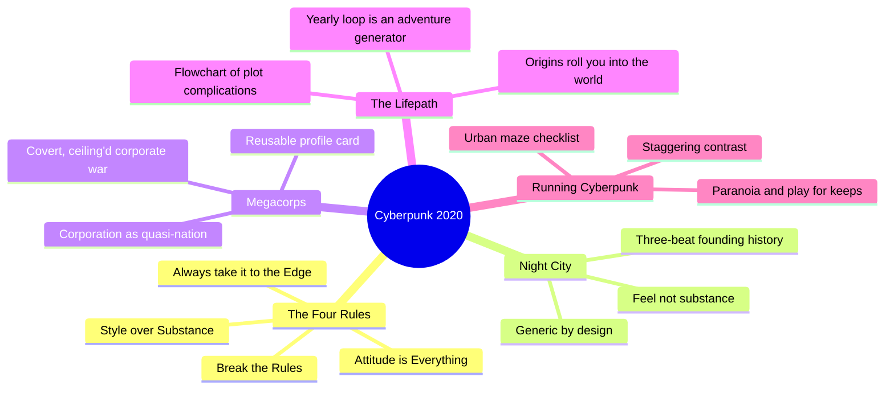
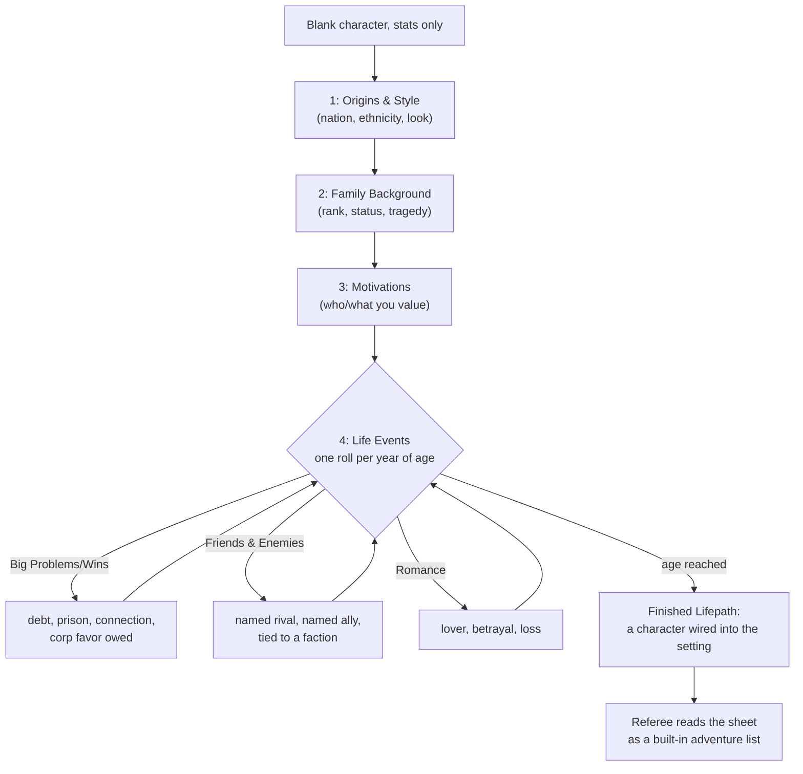
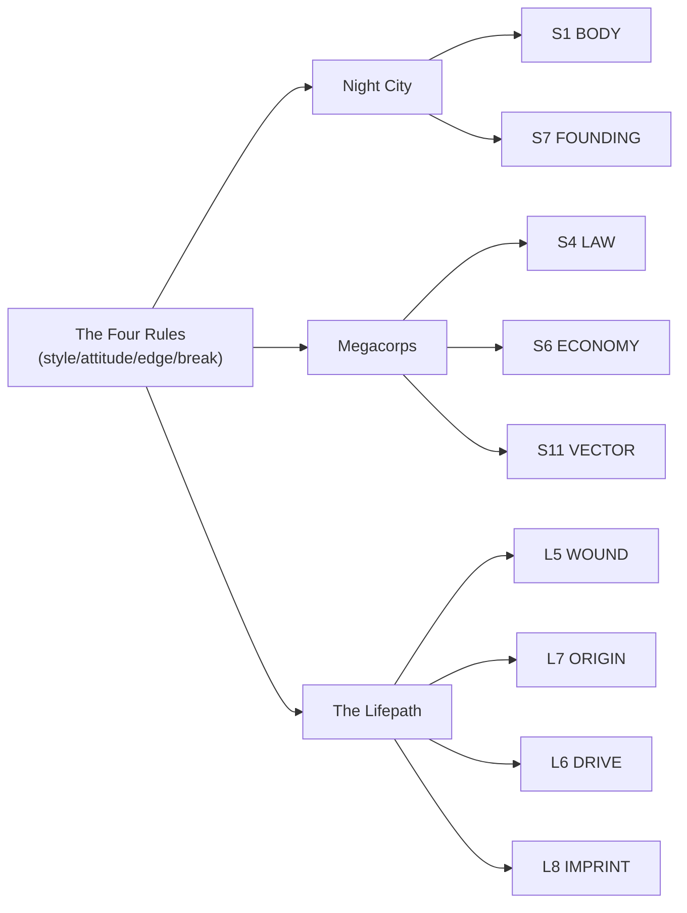

# BVX.0399 — Cyberpunk 2020 (Version 2.0) — Mike Pondsmith (1991)
### Knowledge Entry — Distill

The core rulebook for the original Cyberpunk tabletop RPG: a genre attitude stated as four rules, a placeholder city (Night City) built to be stolen and renamed, a corporation stat block usable for any faction, and the Lifepath, a chargen flowchart that manufactures backstory by rolling characters into the setting's institutions.

## TABLE OF CONTENTS
- [Core Thesis](#1-core-thesis)
- [Mind Models](#2-mind-models)
- [Framework](#3-framework--structure)
- [Key Concepts](#4-key-concepts)
- [Heuristics](#5-heuristics--decision-rules)
- [Invariants](#6-invariants)
- [Pitfalls](#7-pitfalls--myths)
- [Application](#8-application)
- [Cross-References](#9-cross-references)
- [Provenance](#10-provenance--confidence)

---

## 1 · CORE THESIS

A setting doesn't need to be described, it needs to be performed: state the attitude ("style over substance") as four rules, then build every downstream piece, city, corporation, character, as a reusable card that manufactures that attitude on contact. Depth comes from the roll, not the writeup.

---

## 2 · MIND MODELS

*Required. Minimum two diagrams, maximum five.*

**Diagram 1 — the whole argument.**
Caption: *four attitude-rules sit upstream of everything else; city, faction, and character are all built as reusable cards that perform those rules rather than as unique lore.*

**Diagram 2 — the central mechanism (the Lifepath as a world-seeding flowchart).**
Caption: *every table a Lifepath player rolls on names a world institution (nation, family, corp, gang), so the backstory that comes out already points at the setting, not away from it.*

**Diagram 3 — mapped onto the Command's SETTING SLICE and character stack.**
Caption: *the book splits cleanly down the middle: Night City and Megacorps feed the place-side SETTING SLICE, the Lifepath feeds the person-side L-layers, and both halves are built from the same four rules.*

---

## 3 · FRAMEWORK / STRUCTURE

The book is a stack of four load-bearing chapters, front-loaded doctrine then progressively concrete instances:

| Chapter | Governing move |
|---|---|
| Soul of the New Machine (intro) | States the genre's attitude as four numbered rules before a single stat exists |
| Tales From the Street (the Lifepath) | Converts the attitude into a chargen flowchart: seven sections, random tables, a yearly loop |
| Megacorps 2020 + Corporate Profiles | Converts the attitude into a faction template: one fixed-slot card, filled per corporation |
| Welcome to Night City / Running Cyberpunk | Converts the attitude into a place and a GM-behavior checklist: a generic city plus four running tricks |

Nothing in the book argues for the attitude. Rule 1 is asserted on page one and never re-litigated. Everything downstream (city, corp, character) is judged by whether it performs the rule, not by internal consistency with some deeper theory of the world.

---

## 4 · KEY CONCEPTS

| Concept | What it is | Why it matters |
|---|---|---|
| **The Four Rules** | "1) Style Over Substance. 2) Attitude Is Everything. 3) Always take it to the Edge. 4) Break the Rules." Stated as in-fiction advice from a rockstar character (Johnny Silverhand), not as design notes | The whole setting is downstream of these four lines; every other chapter is an instance of one of them |
| **Style over Substance** | "It doesn't matter how well you do something, as long as you look good doing it" | The book's own thesis about craft, stated as street wisdom rather than a design essay — form is doctrine, not decoration |
| **The nine Roles** | Rockerboy, Solo, Netrunner, Corporate, Techie, Cop, Fixer, Media, Nomad — each a "face a person projects to the outside world," each with one Special Ability | A Role is a genre badge plus one mechanical lever, not a job description — cheap to define, immediately legible |
| **The Lifepath** | A seven-section flowchart (origins, family, motivations, life events, friends/enemies, romance, big problems) described as "a flowchart of plot complications" and "a guaranteed adventure generator" | Character creation and world-seeding are the same act — you cannot finish a Lifepath without naming setting-side people, debts, and enemies |
| **The yearly Life Events loop** | For every year of age past 16, roll once on a table (Big Problems/Wins, Friends & Enemies, Romance, or nothing) and resolve the result | Backstory accretes as a sequence of discrete, table-driven beats rather than a single authored paragraph — each beat is independently a scene hook |
| **The corporate profile card** | A fixed slot format: business type, HQ, regional offices, major shareholder and stake %, worldwide/troop/covert employee counts, one background paragraph, equipment and resources | A corporation is a stat block, not an essay — any Referee can improvise a new one in the same shape in five minutes |
| **Megacorp as quasi-nation** | "They are very nearly nations in themselves, with their own laws, cities, factories and armies" | Faction power is measured the same way state power is — law, territory, economy, military — collapsing "corporation" and "nation" into one design category |
| **Night City's three-beat history** | Founded as a planned safe corporate city by Richard Night; murdered founder, gang takeover, decade of war; Corp-backed strike teams retake and "clean" the city | A founding history exists only to explain the present map (Corporate Center vs. Combat Zone) — no deep time beyond what the current districts need |
| **"Feel, not substance"** | "The important thing about Night City is the feel, not the substance... Night City is any big city in the world — it could be yours" | The book explicitly tells the Referee the city is a placeholder: swap in a real hometown, keep the shape |
| **The Future History Timeline** | A year-by-year headline list (1990–2020: treaties, crashes, wars, tech firsts) building from the present day outward to the game's now | History-as-worldbuilding done as an extrapolated newsfeed rather than an invented deep past — every entry is a plausible escalation of a real 1991 anxiety |
| **Corporate war doctrine** | Corporate wars "must be covert" and "never last longer than necessary" because open combat on sovereign soil invites government intervention | Faction conflict has an explicit escalation ceiling built into the setting's physics, not left to GM fiat |
| **Running Cyberpunk's atmosphere checklist** | Urban maze, staggering contrast (rich citadels vs. desperate Street), moral ambiguity/paranoia, genre immersion via outside media, "play for keeps" | Tone is delivered as a Referee behavior checklist, not as prose description the players read once and forget |

---

## 5 · HEURISTICS & DECISION RULES

| Situation | Do this | Not this |
|---|---|---|
| You need a city to run tonight | Steal Night City's shape (five named districts, one three-beat history, one signature contrast) and rename it | Invent a full unique geography before you need one |
| You need a faction with teeth | Fill the corporate-profile card: HQ, offices, major shareholder %, employee/troop/covert counts, one background paragraph, equipment | Write a lore essay about the faction's history and culture |
| You need a character's backstory | Roll a Lifepath-style yearly table and keep the result, even the bad one | Have the player invent a clean backstory that touches no named faction or place |
| You want the world to feel real without deep lore | State the attitude and let behavior communicate it (style over substance, played straight) | Front-load exposition about how the world works |
| You want history that matters | Write a headline timeline of escalating, connected crises that explains today | Write static "ancient lore" that never touches present stakes |
| You want two big factions at war without breaking the setting | Keep it covert, deniable, and short | Stage an open, declared war between them |
| You want tension in every scene | Juxtapose a showcase (corporate, safe, clean) against a ruin (Combat Zone) one block over | Make the whole setting uniformly grim or uniformly safe |
| You want moral texture instead of good/evil teams | Make every side capable of one good act and one bad act, and hide which is which at a glance | Color-code factions as heroes and villains |

---

## 6 · INVARIANTS

1. **Every setting element exists to manufacture conflict or instigation, not to be admired for completeness.** A city, a corp, or a backstory that inspires no scene has failed regardless of how well it's written.
2. **Attitude communicates world truth faster than exposition.** The Four Rules are advice about behavior, and behavior is what players actually see at the table.
3. **A place doesn't need unique geography to function — a labeled generic template is sufficient and explicitly reusable.** Night City says so about itself.
4. **Character backstory should be generated through the setting's institutions (nation, family, corp, gang), not invented in isolation from them.** The Lifepath's tables are the mechanism that enforces this.
5. **Factions with real power read as small nations**: law, territory, economy, and a covert military instrument, all compressed into one reusable card.
6. **Conflict between major factions has an escalation ceiling.** Once it becomes visible enough to draw a bigger power's attention, it has already gone on too long.
7. **History is load-bearing only as far back as it explains the present map.** A founding needs three beats, not a genealogy.

---

## 7 · PITFALLS / MYTHS

- Writing deep, static lore that never touches present-day stakes — the opposite failure to the Future History Timeline's headline-escalation method.
- Letting a player invent a backstory that names no faction, place, or setting fact — this defeats the entire point of running a Lifepath.
- Treating a corporation (or any faction) as a monolithic, undetailed antagonist with no fillable stat block, so nobody at the table can improvise a heist or a firefight against it.
- Removing the "staggering contrasts" between rich and poor, safe and dangerous — a uniformly grim setting loses the punk half of cyberpunk as fast as a uniformly safe one loses the cyber half.
- Treating a Role (Rockerboy, Solo, Netrunner, etc.) as a costume rather than a mechanical badge tied to one Special Ability and one genre promise.
- Declaring an open, visible war between major factions — it breaks the setting's own stated physics (corporate war must stay covert or short).
- Mistaking "the important thing is the feel, not the substance" for permission to skip preparation entirely — the book still hands the Referee a filled-in Night City to start from; genericity is a template, not an absence.

---

## 8 · APPLICATION

- **Spine level:** SETTING (non-story-spine source; keys to the entity beside the L0–L7 spine, per the SETTING SLICE's binding rule)
- **12-layer character stack:** primary — the Lifepath is a ready-made chargen-to-worldbuilding bridge. Its Family Tragedy and parent-loss tables are a direct L5 WOUND generator tied to named world forces; its Ethnic/National Origins and Family Ranking tables assign L7 ORIGIN by rolling the character into the setting's class structure rather than by free invention; its Motivations tables ("Person You Value Most," "What Do You Value Most") are a one-roll L6 DRIVE seed stated as a want plus an implied cost; its yearly Life Events loop accretes L8 IMPRINT one habit-forming beat at a time
- **plot_systems:** primary candidate once `04_PLOT_SYSTEMS/` opens — the yearly Life Events loop is explicitly self-described as "a guaranteed adventure generator," and the corporate-profile card's employee/troop/covert counts are ready scene-hook fuel (a heist target, a headhunting job, an extraction)
- **Setting:** primary — Night City is a worked S1 BODY / S7 FOUNDING instance built deliberately generic; Megacorps 2020 is a worked S4 LAW / S6 ECONOMY faction-card template; the corporate-war doctrine and Future History Timeline both feed S11 VECTOR as an escalation with an explicit ceiling

This is the first SETTING-shelf source in the library built for a science-fiction genre rather than fantasy, and it converges independently on several of the Kobold Guide's rulings (BVX.0458): a present-tense-only history requirement (the Future History Timeline is a headline extrapolation from the present, not a deep past), a conflict-generation mandate (the Four Rules restated in genre-neutral form as "detail without payoff is inert"), and a reusable faction card in place of a faction essay. Where it goes further than Kobold is the Lifepath — a mechanism that makes the character-generation step itself do setting-seeding work, which is exactly the piece this distill was commissioned to surface: build the world once, in cards (a city card, a corp card, a Lifepath table), and let every new character or faction come out already wired into it.

---

## 9 · CROSS-REFERENCES

| Related entry | Relation |
|---|---|
| [[BVX.0458]] | Kobold Guide to Worldbuilding — the fantasy-genre sibling theory/toolkit; both converge on present-tense history and conflict-first design from opposite genres |
| [[BVX.1122]] | GURPS Hot Spots: Renaissance Venice — the worked concrete SETTING-SLICE instance; Night City is this book's equivalent worked instance, built generic on purpose rather than historically specific |
| [[BVX.0349]] | Against Worldbuilding, and Other Provocations — counter-argument sibling; Night City's explicit "feel not substance, could be yours" stance is this book's own answer to the kitchen-sink trap, arrived at independently |
| [[BVX.0463]] | Matt Davids, The Book of Random Tables: Cyberpunk — undistilled sibling; a direct descendant of the Lifepath's random-table chargen-as-worldbuilding method, worth distilling next for the same shelf |
| [[BVX.0389]] | Carbon 2185: A Cyberpunk RPG — undistilled sibling; a modern re-solution of the same genre-and-chargen design problem, useful as a compare-and-contrast once distilled |

---

## 10 · PROVENANCE & CONFIDENCE

Full text, extracted via OCR/pdftotext from the scanned original (visible OCR noise throughout, e.g. garbled running headers and table borders; body prose is legible). Read in full: the front matter and table of contents; "Soul of the New Machine" (the intro, including the four numbered Rules and the Role/Special Ability list); the Lifepath chapter "Tales From the Street" through Origins & Style, Family Background, and the start of Motivations and the yearly Life Events loop; "Welcome to Night City" (Overview, History, Present, Particulars — political, public services, transportation); a sample of the Night City daytime/evening encounter tables; "Megacorps 2020" (Corporate Life, Mediacorporations, Agricorps, the World Stock Exchange, Corporate Espionage, Corporate Wars, the Corporate City); two full corporate profiles (Biotechnica, Infocomp) and partial profiles (WorldSat, Arasaka, Merrill Asukaga & Finch, WNS, Petrochem) read for the profile-card shape; "Future Shock: History of An Alternate Time" and its Future History Timeline (1990–1995 sampled in full, structure confirmed across the full range); "Running Cyberpunk" (full, all four "tricks").

Not read in this pass: the character-creation rules chapters beyond Lifepath (stats, skills, combat, cybertechnology, netrunning mechanics), the remaining Corporate Profiles, the "Never Fade Away" adventure/story, and the Screamsheets adventure supplements — out of scope for a SETTING-shelf distill per the brief's focus on world-building chapters rather than rules crunch.

The `feeds:` keying against the SETTING SLICE (S1–S12) and the 12-layer character stack follows the v4 template's binding rule and mirrors BVX.0458's method; the L5/L6/L7/L8 character-layer feeds are this distill's own synthesis, reading the Lifepath as a chargen-to-setting bridge rather than as a setting-only source, per the brief naming "the Lifepath as a way to seed a world into characters" as a required focus.

## META
- Template: BVX-LEARN-v4.0
- Source classification: full-text OCR scan, deep extraction on the four focus chapters (intro, Lifepath, Night City, Megacorps) plus Running Cyberpunk in full; sampled on corporate profiles and the timeline's full range
- Created / Updated: 2026-09-29
