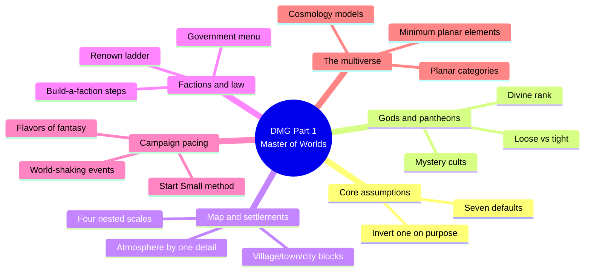
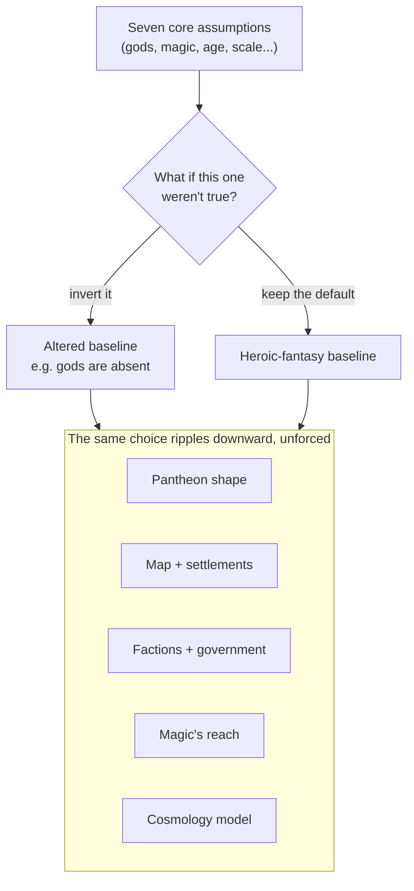
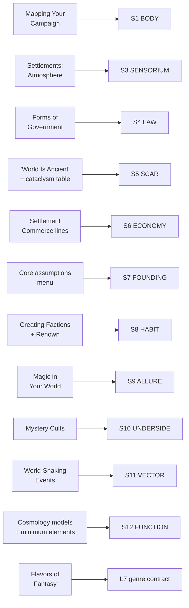

# BVX.0405 — Dungeon Master's Guide (5th ed.) — Mearls & Crawford (2014)
### Knowledge Entry — Distill

The core D&D 5e rulebook for running a game; Part 1, "Master of Worlds" (chapters 1-2), is a from-scratch worldbuilding manual: gods, maps, settlements, factions, magic, campaign pacing, and the planar multiverse, aimed at a working GM rather than a theorist.

## TABLE OF CONTENTS
- [Core Thesis](#1-core-thesis)
- [Mind Models](#2-mind-models)
- [Framework](#3-framework--structure)
- [Key Concepts](#4-key-concepts)
- [Heuristics](#5-heuristics--decision-rules)
- [Invariants](#6-invariants)
- [Pitfalls](#7-pitfalls--myths)
- [Application](#8-application)
- [Cross-References](#9-cross-references)
- [Provenance](#10-provenance--confidence)

---

## 1 · CORE THESIS

A campaign world is a short list of default assumptions (gods are real, magic is rare-to-common, the world is ancient or new) that a GM either keeps or deliberately inverts; every downstream layer, from map to pantheon to cosmology, is built by answering "what if this weren't true?" once and following it through.

---

## 2 · MIND MODELS

*Required. Minimum two diagrams, maximum five.*

**Diagram 1 — the whole argument.**
Caption: *Part 1 sorts into six working stations a GM visits in roughly this order, from the assumption menu down to the shape of the cosmos.*

**Diagram 2 — the central mechanism (a process, run once per layer).**
Caption: *the book's actual unity isn't its chapter order, it's this cascade: change one assumption, and every layer below inherits the change without needing its own justification.*

**Diagram 3 — mapped onto the Command's SETTING SLICE (S1-S12).**
Caption: *ten of twelve S-layers land directly, two only lightly (S2 WEATHER stays thin, matching the SSOT's own flagged DCUS gap) — the multiverse chapter alone carries S11 and S12, the heaviest layers in the whole slice.*

---

## 3 · FRAMEWORK / STRUCTURE

Two chapters, each a fixed march from assumption to detail:

| Chapter | Governing move |
|---|---|
| 1 — A World of Your Own | State seven core assumptions about the game world, then let the GM invert any of them; fill in gods, map, settlements, languages, factions, magic, campaign structure, and genre flavor under whichever assumptions survive. |
| 2 — Creating a Multiverse | Sort the default planes into categories (Material + echoes, Transitive, Inner, Outer, Positive/Negative); state the minimum planar elements every cosmology needs; offer nine named cosmology models as competing shapes to hang those elements on. |

The chapter break is itself a scale jump: chapter 1 works at the settlement-and-region scale, chapter 2 zooms out to the scale of reality itself, using the same method (name the defaults, decide what to keep) at a much larger radius.

---

## 4 · KEY CONCEPTS

| Concept | What it is | Why it matters |
|---|---|---|
| **Core assumptions + inversion** | Seven defaults (gods are real, much of the world is untamed, the world is ancient, conflict shapes history, magic exists at some level, gods may or may not walk the earth) stated explicitly, each paired with "what if not?" | The single generative move of the whole chapter; every published D&D setting is defined by which defaults it kept and which it flipped |
| **Loose vs. tight pantheon** | Loose: many gods, independent portfolios, public shrines. Tight: one dogma binds a small family of gods, with aberrant/cult gods outside it | Determines whether religion in a setting reads as a marketplace of cults or a single household with in-laws |
| **Mystery cult** | A secretive initiation rite that personally identifies the initiate with a god, layered underneath (or inside) a public pantheon | The public/personal split is the reusable trick for putting a hidden layer under an official one without contradiction |
| **Divine rank** | Greater (unreachable) / lesser (encounterable, embodied somewhere in the planes) / quasi-deities (demigods, titans, vestiges) | Lets a GM decide how close a deity can get to the table without breaking cosmic scale |
| **Four map scales** | Province (1 mile/hex), kingdom (6 miles/hex), continent (60 miles/hex), each filled coastline -> mountains -> rivers -> settlements | Geography-first, culture-second drafting order; smaller scales only get drawn once the larger one exists |
| **Settlement stat blocks** | Village/town/city, each with fixed Population, Government, Defense, Commerce, and Organizations lines | A one-paragraph settlement generator; scale dictates government complexity and commerce range automatically |
| **Atmosphere by one detail** | Pick a single defining sensory factor (canals, fog, a stench) and extrapolate sight/sound/smell/feel from it | The book's own S3 SENSORIUM method: coherence over inventory |
| **Government-form menu** | Fourteen named forms (autocracy, confederacy, theocracy, magocracy, kleptocracy, etc.), rollable on a d100 table | Governance keyed to a chosen structural type, not improvised per settlement |
| **Faction-building steps** | Decide role, goal, founder, and typical members before choosing a symbol and motto | Design order matters: personality (symbol/motto) is the last step, not the first |
| **Renown** | A per-faction numerical track that unlocks rank, attitude thresholds, and perks as a character serves an organization's interests | Turns "belonging" into a legible, table-usable progression system |
| **Magic consequence-questions** | Is magic common or rare? Regulated or free? What does it cost, and who can afford it? | The DMG's compressed version of a high-magic consequence checklist: magic is judged by what it changes, not by its rules text |
| **World-shaking events** | Large-scale disruptions (rise/fall of a leader, cataclysm, invasion, rebellion, discovery, prophecy) budgeted at roughly three per campaign: beginning, middle, end | Explicit anti-inertia rule; ties directly to dramatic three-part structure |
| **Minimum planar elements** | Every cosmology needs an origin plane each for fiends, celestials, and elementals; a place for deities; an afterlife; and a way to travel between planes | A checklist for legality before a cosmology is playable, independent of which shape it takes |
| **Cosmology models** | Nine named shapes for arranging the planes: Great Wheel, World Tree, World Axis, Orrery, Winding Road, Mount Olympus, Solar Barge, One World, Otherworld, Omniverse, Myriad Planes | No mortal in-world can verify the "true" arrangement; the model is a GM convenience, chosen for tone, not discovered as fact |
| **Flavors of Fantasy** | Named genre modes (heroic, sword-and-sorcery, epic, mythic, dark, intrigue, mystery, swashbuckling) | A genre-contract menu, naming the tone before writing rather than drifting into it |

---

## 5 · HEURISTICS & DECISION RULES

| Situation | Do this | Not this |
|---|---|---|
| Starting a new setting | Pick one core assumption to invert and let it ripple downward | Copy the heroic-fantasy default unexamined |
| Drawing the first map | Coastline, then mountains, then rivers, then settlements, biggest scale first | Detail streets before the continent-scale shape exists |
| Introducing a settlement | Pick one defining sensory detail and extrapolate from it | List buildings and NPCs exhaustively before play needs them |
| Setting a government | Choose a binding principle from the fourteen-type menu | Default to "a king rules" with no reason why |
| Designing a faction | Fix role, goal, founder, and typical members before naming a symbol or motto | Invent a membership roster before the faction has a reason to exist |
| Publishing a magic system | Answer how common, how regulated, and what it costs before writing spell lists | Call a world "high magic" and stop at the spell list |
| Pacing a campaign | Budget world-shaking events at beginning, middle, and end, three max | Reorder the world every time the table has a lull |
| Choosing a cosmology | Pick the model (Wheel, Tree, Axis, Otherworld...) that fits the campaign's tone | Chase a "correct" or exhaustive arrangement of every plane |
| Picking a genre | Name the flavor (heroic, dark, mythic, swashbuckling...) before writing a page | Let tone drift session to session by accident |

---

## 6 · INVARIANTS

1. A world is the sum of assumptions a GM chooses to keep or invert, not a fixed canon owed to any source material.
2. Geography is drawn top-down, biggest scale first, so smaller-scale detail has something to sit inside.
3. A settlement's felt identity comes from one governing detail extrapolated outward, not an inventory of its buildings.
4. Government form follows a chosen binding principle, not population size alone.
5. A faction needs a role and a goal before it needs a roster; personality (symbol, motto) is designed last.
6. A magic system or cosmology is judged by what it changes about ordinary life, travel, or war, not by its internal rules.
7. Change is what keeps a campaign from going inert; a world that stays reliable for too long has stopped generating story.
8. The exact shape of the cosmos is a GM's theoretical convenience; no being inside the world can verify it.

---

## 7 · PITFALLS / MYTHS

- Treating the heroic-fantasy baseline as mandatory instead of one setting among many equally valid options.
- Detailing every street and NPC of a settlement before the table ever needs them.
- Handing out a government, religion, or magic system with no "why" behind its structure.
- Publishing a magic system as a spell list with no traceable effect on trade, war, or daily life.
- Letting a campaign run purely on inertia, with no world-shaking event at beginning, middle, or end.
- Chasing a single "correct" cosmology diagram instead of picking the model that fits the campaign's tone.
- Overriding a player's character concept outright instead of bending the world slightly to fit a convincing reason ("say yes if you can").

---

## 8 · APPLICATION

- **Spine level:** L4 (Plot — the argument dramatized in time). World-Shaking Events are keyed explicitly to a story's beginning, middle, and end, and the book's own anti-inertia rule ("when the world becomes reliable, it's time to shake things up") is the setting arc's placement rule made structural rather than aesthetic.
- **12-layer character stack:** none directly. Renown is the closest thing to a character-facing hook, but it stays organizational (rank, attitude, perks) rather than psychological — it tracks standing, not interiority.
- **plot_systems:** primary candidate once `04_PLOT_SYSTEMS/` opens. The World-Shaking Events tables (rise/fall of a leader, cataclysm, invasion, rebellion, discovery, prophecy, myth) are ready-made event generators, each keyed to exactly the Axis 4 baseline-to-state transition the SETTING SSOT already reserves for the setting arc.
- **Setting:** primary — feeds ten of twelve SETTING SLICE layers (S1, S3, S4, S5, S6, S7, S8, S9, S10, S11, S12 at varying strength; see frontmatter), plus L7 genre-contract contextually via Flavors of Fantasy.

Run against the DCUS starter instance already in `ssot_03`: the core-assumptions method reframes DCUS's founding stack cleanly — "Gods Oversee the World" inverts into the Administration as a depersonalized OS (S4 LAW), and "Magic Is Everywhere" becomes "the Feed is everywhere" (S9 ALLURE, the meritocratic promise, same consequence-checklist logic as Baker's high magic). The rename lattice (Skeeter Creek -> Red Hills -> DCUS) is "The World Is Ancient" pushed to institutional scale. On cosmology, DCUS currently reads as the "One World" model (no other planes named; the Movements are states within one reality) rather than a Great-Wheel multiverse — flag as a deliberate choice, not a gap, once OXO needs an explicit cosmology page.

---

## 9 · CROSS-REFERENCES

| Related entry | Relation |
|---|---|
| [[BVX.0458]] | *The Kobold Guide to Worldbuilding* — the theory/toolkit sibling; this entry is the working GM's-manual counterpart, thinner on philosophy (no "dynamite not encyclopedia" argument) but more procedural (stat blocks, tables, a d100 government roll) |
| [[BVX.0349]] | *Against Worldbuilding, and Other Provocations* — counter-argument sibling; this book's own anti-inertia rule ("a reliable world has stopped generating story") is its closest point of agreement with Kennedy's pressure-over-inventory thesis |
| [[BVX.1122]] | *GURPS Hot Spots: Renaissance Venice* — the worked-example sibling; this entry's settlement stat blocks (population/government/defense/commerce/organizations) are the generic template Venice fills in as a concrete instance |

---

## 10 · PROVENANCE & CONFIDENCE

Full text, pdftotext extraction of a scanned two-column layout; OCR is noisy (merged words, scrambled headers, occasional column-bleed) but legible throughout. Per the brief's scope, only Part 1 "Master of Worlds" (chapters 1-2) was read; Parts 2-3 (adventures, treasure, running the game, the DM's workshop) were not opened.

Read in full: The Big Picture (core assumptions); Gods of Your World (pantheons, mystery cults, divine rank, humanoids and the gods); Mapping Your Campaign (all four scales); Settlements (size tiers, atmosphere, government, forms-of-government table); Factions and Organizations (creating factions, renown, sample factions); Magic in Your World (consequence questions, restrictions, schools, teleportation circles); Creating a Campaign (Start Small); Campaign Events (world-shaking events, leader types, cataclysmic disasters); Creating a Multiverse through Planar Categories, Putting the Planes Together, and all nine cosmology models; Known Worlds of the Material Plane. Sampled: Languages and Dialects (opening only); Flavors of Fantasy (several entries read, rest skimmed); Astral/Ethereal/Feywild/Shadowfell/Inner/Outer Plane detail beyond the cosmology-model material, out of this distill's Part 1 scope.

The S-layer keying in `feeds:` and Diagram 3 is this distill's synthesis against `ssot_03_setting_system.md` (PART A, the SETTING SLICE), following the precedent set by BVX.0458. `spine: [L4, SETTING]` follows `ssot_01_story_spine_comparative_tree.md`'s definition of L4 as "the argument dramatized in time" — World-Shaking Events is this book's direct instance of that definition.

## META
- Template: BVX-LEARN-v4.0
- Source classification: full-text OCR extraction, deep extraction on Part 1 (chapters 1-2), Parts 2-3 out of scope
- Created / Updated: 2026-09-29
