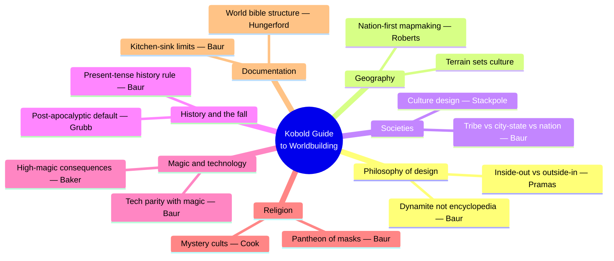
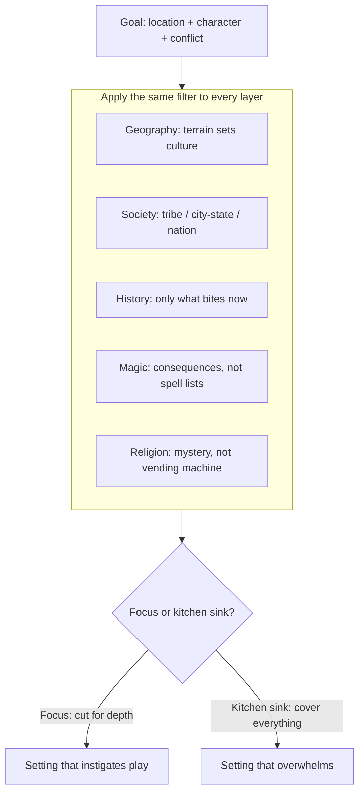
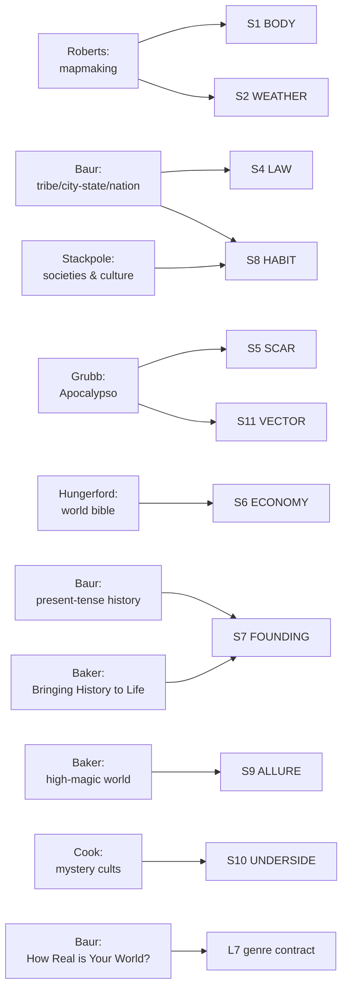

# BVX.0458 — The Kobold Guide to Worldbuilding — ed. Janna Silverstein (2012)
### Knowledge Entry — Distill

Eleven TTRPG-industry designers (Baur, Baker, Cook, Cook, Grubb, Hungerford, Pramas, Roberts, Silverstein, Stackpole, Winter) each take one layer of campaign-setting design; the first SETTING-shelf distill in the library, feeding the SETTING SLICE (S1–S12) directly.

## TABLE OF CONTENTS
- [Core Thesis](#1-core-thesis)
- [Mind Models](#2-mind-models)
- [Framework](#3-framework--structure)
- [Key Concepts](#4-key-concepts)
- [Heuristics](#5-heuristics--decision-rules)
- [Invariants](#6-invariants)
- [Pitfalls](#7-pitfalls--myths)
- [Application](#8-application)
- [Cross-References](#9-cross-references)
- [Provenance](#10-provenance--confidence)

---

## 1 · CORE THESIS

A campaign setting is a stack of dynamite, not an encyclopedia: every layer — geography, society, history, magic, religion — exists to manufacture conflict and instigation, not to document a world. Depth beats completeness; kitchen-sink coverage kills the setting it tries to serve.

---

## 2 · MIND MODELS

*Required. Minimum two diagrams, maximum five.*

**Diagram 1 — the whole argument.**
Caption: *eighteen essays sort into seven working layers — the book is a toolkit indexed by setting-subsystem, not a linear read.*

**Diagram 2 — the central mechanism (a design process, run identically on every layer).**
Caption: *the same conflict-first filter is applied to geography, society, history, magic, and religion in turn — the book's real unity is this filter, not its table of contents.*

**Diagram 3 — mapped onto the Command's SETTING SLICE (S1–S12).**
Caption: *eleven essays land on eight of twelve slice layers, cleanly — the book is thin on S3 SENSORIUM and silent on S12 FUNCTION, exactly where the SSOT already expected other sources to carry the weight.*

---

## 3 · FRAMEWORK / STRUCTURE

Eighteen essays (plus Ken Scholes's introduction), no single spine — each essay owns one setting-subsystem and its own governing question:

| Essay | Author | Governing question |
|---|---|---|
| What is Setting Design? | Baur | What is a setting *for*? |
| Different Kinds of Worldbuilding | Cook | How does a novelist's world differ from a GM's world? |
| Worldbuilding Inside Out and Outside In | Pramas | Start local and grow outward, or start broad and zoom in? |
| How Real is Your World? | Baur | Where does this setting sit on the historical-to-wahoo spectrum? |
| Bringing History to Life | Baker | How does dramatized history serve play rather than decorate it? |
| Apocalypso | Grubb | Why is nearly all fantasy secretly post-apocalyptic? |
| Here Be Dragons | Roberts | What order do you draw a world map in? |
| How to Design a City-State, Tribe, or Nation | Baur | What is the atomic social unit, and how does governance scale with it? |
| They Do What, Now? | Stackpole | How do you build a believable culture instead of a costume? |
| How to Make a High-Magic World | Baker | What are a magic system's consequences, not just its rules? |
| Worlds and Technology | Baur | How do magic and technology share a tech tree without canceling each other? |
| Why No Monotheism? | Winter | Why do fantasy worlds default to polytheism, and how would a real monotheism work? |
| Designing a Pantheon | Baur | How do gods generate conflict instead of dispensing spells? |
| It's a Mystery! | Cook | How does a secret cult deepen a public religion? |
| How to Design a Guild | Baur | What holds a guild together, and what does it cost to join? |
| How to Write a World Bible | Hungerford | How do you organize a setting as a living reference document? |
| Playing in Someone Else's Backyard | Silverstein | What changes when the world isn't yours to change? |
| The Limits of Design: Kitchen Sink | Baur | When does "more setting" start destroying the setting? |

Bookended design: Baur's opening essay states the goal (conflict, not coverage) and his closing essay states the failure mode (kitchen sink) — everything between is that same argument run once per subsystem.

---

## 4 · KEY CONCEPTS

| Concept | What it is | Why it matters |
|---|---|---|
| **Dynamite design** | Setting design stacks conflict-generating elements ("boxes of dynamite") for the GM to detonate, rather than documenting a world encyclopedically | Baur's founding metric: a setting succeeds if it inspires play, not if it's complete |
| **Present-tense history rule** | Backstory earns inclusion only if it "bites" the present — a 10,000-year-old war matters only if its consequences are live now | The single most load-bearing craft rule in the book; directly opposes Tolkien-style deep-time worldbuilding as a design trap |
| **Inside-out / outside-in** | Two build orders: start hyper-local and expand (Freeport), or start with a broad shallow frame and zoom in (Greyhawk) | Neither is wrong; the failure mode is drifting between them without choosing, which produces neither momentum nor coherence |
| **Five fantasy lineages** | Hard historical fantasy, real fantasy, anchored high fantasy, wild-eyed wahoo fantasy, low fantasy — a spectrum from grounded-in-real-history to unmoored premise-driven invention | Each lineage is a different contract with the audience about how much realism is owed; picking one before writing avoids tonal drift |
| **Post-apocalyptic default** | Ruins, dungeons, and lost magic items structurally require a fallen precursor civilization — ancient tomb-builders who built things that outlasted them | Explains why nearly every classic fantasy setting (Greyhawk, Realms, Dragonlance, Eberron, Middle-earth) is secretly post-apocalyptic |
| **Tribe / city-state / nation** | Three binding principles for a social unit: blood ties (tribe), shared residence (city-state), shared language/culture/aristocracy (nation) | The binding principle, not population size, determines what governance, law, and belonging look like |
| **Nation-first mapmaking order** | Countries and culture first, then coastline, then mountains, then rivers, then climate, then cities, then roads, then fantasy exceptions | Geography-follows-culture, not the reverse — a country famed for cavalry needs plains, not the other way around |
| **Masks of the gods** | Multiple deity-names across cultures resolve to the same divine wellspring (or to eternal rivals) — a syncretic solution to pantheon bloat | Kills the "tenth Forest God" problem while manufacturing built-in sectarian conflict between masks of the same god |
| **Public vs. personal religion** | State religion (temples, official hierarchy, everyone belongs) vs. mystery cult (voluntary, secret ritual, joinable multiple times) | The historical Greco-Roman model for stacking a secret layer under an official one without contradiction |
| **High-magic consequence checklist** | Work magic's effect through transportation, warfare, and medicine before anything else | Turns "magic exists" into an actual society; the checklist is the difference between flavor and infrastructure |
| **World bible's three parts** | World (name, races, magic/tech, economy) → Cast (characters, monsters) → Appendices (timeline, maps, glossary) | A living document, not a finished one — Hungerford ran his at WizKids as a revision target, not a deliverable |
| **Kitchen sink design (KSD)** | Providing every possible race, nation, and option to please the largest audience | Baur's explicit failure mode: "an abdication of design responsibility" that trades coherence for shelf-space |

---

## 5 · HEURISTICS & DECISION RULES

| Situation | Do this | Not this |
|---|---|---|
| Setting reads like a chore | Design every element toward conflict and instigation | Document it encyclopedically for its own sake |
| Starting a new setting | Deliberately choose inside-out (campaign-first) or outside-in (framework-first) | Drift between the two without committing |
| Writing setting history | Write only the history that bites in the present | Write a 10,000-year backstory no player will ever touch |
| Placing dungeons or ruins | Give them a fallen precursor civilization that built them | Hand-wave "ancient evil place" with no builder, no fall |
| Drawing a world map | Nations and culture first, then coastline, mountains, rivers, climate, cities, roads — in that order | Start with fine local detail before the continental frame exists |
| Building a magic system | Trace consequences through transportation, warfare, and medicine | Publish a spell list and call the world "high magic" |
| Designing gods | Give them masks, mystery, and conflict with each other | Make each god a single-domain vending machine with no rivalry |
| Choosing what to cut | Cut toward focus and depth in a few regions | Chase kitchen-sink completeness to please every reader |
| Picking a genre lineage | Choose one of the five (historical / real / anchored / wahoo / low fantasy) before writing | Mix tones by accident and let realism drift scene to scene |

---

## 6 · INVARIANTS

1. **A setting exists to generate conflict.** Detail without a conflict payoff is inert, regardless of how well-researched it is.
2. **History only matters to design when it bites in the present tense.** Depth of the past is not itself a virtue.
3. **Ruins imply a builder.** Precursor civilizations are structurally required wherever dungeons, lost magic, or ancient guardians exist — not optional flavor.
4. **Geography constrains culture before culture can be invented freely.** Terrain-first ordering (nations → coastline → mountains → rivers → climate → cities → roads) prevents incoherent worldbuilding.
5. **Social organization scales by binding principle, not population size**: blood (tribe) → residence (city-state) → shared culture/aristocracy (nation) → conquest and bureaucracy (empire).
6. **A world-departure (magic, lost tech, divine intervention) must be worked through its consequences** or it stays decorative rather than structural.
7. **Completeness is the enemy of playability.** Kitchen-sink coverage collapses under its own weight and eventually forces a reset.

---

## 7 · PITFALLS / MYTHS

- Treating worldbuilding as an encyclopedic hobby for its own sake — the "clomping foot of nerdism" (M. John Harrison, quoted by Baur).
- Writing deep backstory that never touches present-day play (the Tolkien trap, named directly).
- Copying default single-god-per-character monotheism from real-world theology without noticing it was ever a choice.
- Designing gods as answer machines — no mystery, no masks, no rivalry between them.
- Mistaking "more races / nations / splatbooks" for richness rather than dilution (kitchen-sink feature creep).
- Violating basic terrain logic when drawing a map: rivers flowing uphill or coast-to-coast, deserts bordering forests with no transitional band, mountain ranges scattered rather than following fault lines.
- Publishing a magic system as a spell list without tracing its effect on transportation, warfare, or medicine — magic that changes nothing about daily life isn't "high magic," it's set dressing.

---

## 8 · APPLICATION

- **Spine level:** SETTING (non-story-spine source; keys to the entity beside the L0–L7 spine, per ssot_03's binding rule that setting is a Domain embodied, never a level)
- **12-layer character stack:** none directly — this is a setting-side source; its consequence-checklist method (magic → transportation/warfare/medicine) is structurally the same move as auditing an L6 DRIVE want against its costs, but it is not itself a character-layer feed
- **plot_systems:** contextual candidate once `04_PLOT_SYSTEMS/` opens — the conflict-first filter (Diagram 2) is a ready-made scene-hook generator: run any drafted location through "what conflict does this manufacture" before trusting it playable
- **Setting:** primary — this is the founding SETTING-shelf distill, feeding eight of the twelve SETTING SLICE layers (S1, S2, S4, S5, S6, S7, S8, S9, S10, S11 at varying strength) plus L7 genre-contract contextually

The eleven essays read as a working toolkit against the ruled SETTING SLICE (S1–S12, `ssot_03_setting_system.md`) rather than as a unified theory — each essay is strongest exactly where it stays narrow (Roberts on maps, Grubb on ruins, Cook on cults) and weakest where it gestures at the whole system at once (the two "kinds of worldbuilding" essays, useful for philosophy but thin on mechanism). Tested directly against the DCUS starter instance already in `ssot_03`: Apocalypso's precursor-civilization requirement is the same shape as DCUS's S5 SCAR rename lattice (Red Stick Creek → Red Hills → DCUS — a buried precursor at institutional rather than civilizational scale), and Baur's present-tense-history rule confirms DCUS's S7 FOUNDING record should stay lean, detailing the founding stack only as far as it bites the active Movement. The book is conspicuously silent on S3 SENSORIUM and S12 FUNCTION — S3 is explicitly reserved in `ssot_03` for Rozelle/Hall's craft-of-description sources, and S12 (storyform binding) is outside a TTRPG design book's vocabulary entirely; both gaps are expected, not a failure of this source.

---

## 9 · CROSS-REFERENCES

| Related entry | Relation |
|---|---|
| [[BVX.0541]] | Duplicate catalog entry for the same book (same Zotero source, indexed twice) — collapse on next index pass, this distill is canonical |
| [[BVX.0067]] | Collaborative Worldbuilding for Writers and Gamers — undistilled sibling, same SETTING shelf, same craft-not-theory register |
| [[BVX.0349]] | *Against Worldbuilding, and Other Provocations* — undistilled counter-argument sibling; its root claim (worldbuilding should serve pressure, not inventory) is this book's kitchen-sink pitfall stated as a thesis rather than a warning |
| [[BVX.1122]] | GURPS Hot Spots: Renaissance Venice — the first sourcebook distilled as a concrete SETTING-SLICE *instance*; this entry is the theory/toolkit counterpart, that one the worked example |
| [[BVX.0193]] | Truby, *The Anatomy of Story* — story-spine sibling; Truby's story-world chapter (sampled, not distilled) is the story-side mirror of this book's terrain-first mapmaking method |

---

## 10 · PROVENANCE & CONFIDENCE

Full text, pdftotext extraction, 116pp (~52,000 words), clean text layer with legible chapter breaks and a machine-readable TOC. Read in full: the introduction (Scholes); "What is Setting Design?" (Baur); "Different Kinds of Worldbuilding" (Cook); "Worldbuilding Inside Out and Outside In" (Pramas); "How Real is Your World? On History and Setting" (Baur — full, the "how real is too real" essay named in the brief); "Here Be Dragons: On Mapmaking" (Roberts — full); "How to Design a City-State, Tribe, or Nation" (Baur — full); "How to Make a High-Magic World" (Baker — full); "Why No Monotheism?" (Winter — full); "Designing a Pantheon" (Baur — full); "It's a Mystery! Designing Mystery Cults" (Cook — full through the cult-design framework); "How to Write a World Bible" (Hungerford — full); "The Limits of Design: Kitchen Sink Design" (Baur — full, closing essay). Sampled (opening pages / TOC-adjacent, not deep-extracted): "Bringing History to Life" (Baker), "Apocalypso: Gaming After the Fall" (Grubb — first third, the post-apocalyptic-default argument fully extracted; remainder sampled), "They Do What, Now?" (Stackpole — opening only), "Worlds and Technology" (Baur), "How to Design a Guild" (Baur), "Playing in Someone Else's Backyard" (Silverstein — opening only), contributor bios.

The S-layer keying in frontmatter `feeds:` and Diagram 3 is this distill's synthesis against `ssot_03_setting_system.md` (PART A, the twelve-layer SETTING SLICE) — the SSOT's own `feeds:` line already anticipated this book seeding Axis 2 (STRATA) and the SCALE axis's settlement/region rungs; this entry makes that anticipated mapping concrete, essay by essay. The `spine: [SETTING]` and empty character-stack application are asserted per the v4 template's binding rule (setting is an entity beside the spine, never an L0–L7 level) and per `ssot_03`'s own root claim (setting is a Domain embodied, not a story-spine rung).

## META
- Template: BVX-LEARN-v4.0
- Source classification: full-text essay collection, deep extraction on 13 of 18 essays, sampled on 5
- Created / Updated: 2026-09-16
