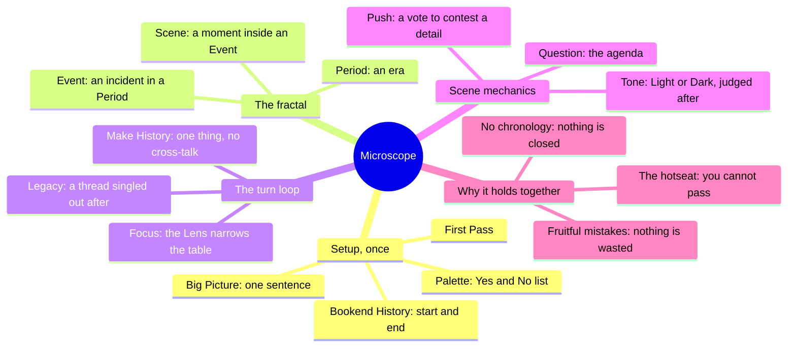
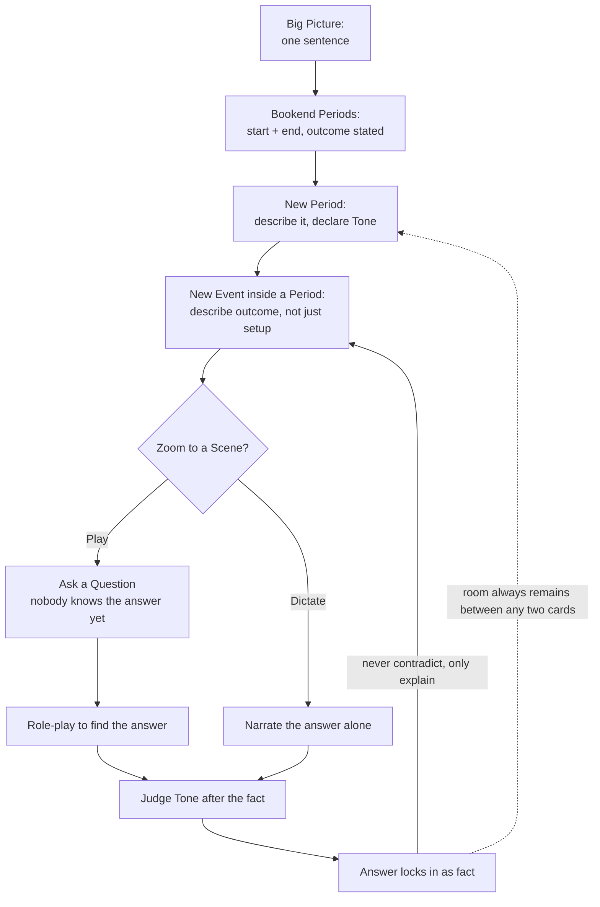
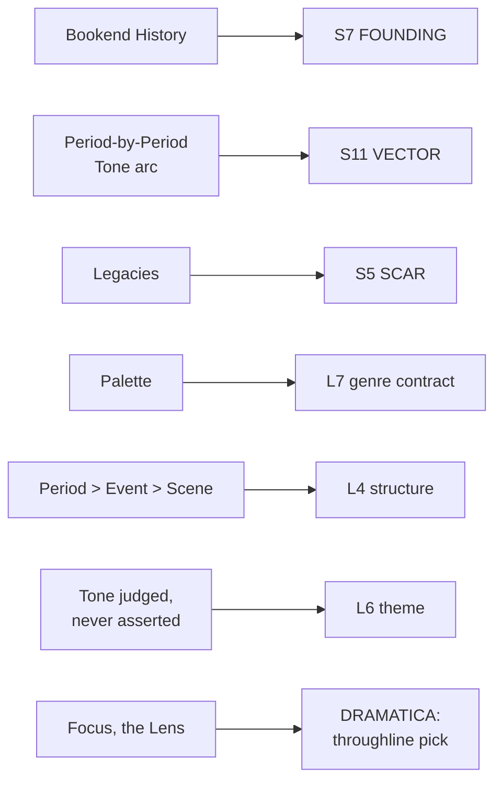

# BVX.0465 — Microscope: A Fractal Role-Playing Game of Epic Histories — Ben Robbins (2011)
### Knowledge Entry — Distill

A GM-less tabletop game where players build an entire epic history (empires, dynasties, dead worlds) outside-in through three zoom levels: Period, Event, Scene. The whole book is the setting shelf's cleanest example of a structure-generation engine.

## TABLE OF CONTENTS
- [Core Thesis](#1-core-thesis)
- [Mind Models](#2-mind-models)
- [Framework](#3-framework--structure)
- [Key Concepts](#4-key-concepts)
- [Heuristics](#5-heuristics--decision-rules)
- [Invariants](#6-invariants)
- [Pitfalls](#7-pitfalls--myths)
- [Application](#8-application)
- [Cross-References](#9-cross-references)
- [Provenance](#10-provenance--confidence)

---

## 1 · CORE THESIS

A history is built outside-in: state the big picture and the two bookend outcomes first, then zoom in through Period, Event, and Scene, each layer already declaring its outcome before the next explains how. Removing chronological order and group brainstorming, one uncontested creator per turn, makes a world's becoming surprising instead of consensus-flattened.

---

## 2 · MIND MODELS

*Required. Minimum two diagrams, maximum five.*

**Diagram 1 — the whole argument.**
Caption: *setup happens once and locks; everything after is one fractal loop of Focus, contribution, and Legacy, repeated until the table stops.*

**Diagram 2 — the central mechanism (a recursive zoom-and-lock process).**
Caption: *every layer must state its outcome before the next layer is allowed to ask how; once stated, a fact can never be undone, only explained.*

**Diagram 3 — mapped onto the Command's SETTING and spine systems.**
Caption: *Microscope's own six moving parts land cleanly on three different Command axes, structure, theme, and setting, at once, which is exactly why it keys to L4, L6, and SETTING together.*

---

## 3 · FRAMEWORK / STRUCTURE

Setup runs once, in order, and is the only phase where the group talks as a group:

1. **Big Picture** — one sentence, the whole history in outline (e.g. "mankind leaves the sick Earth and spreads to the stars").
2. **Bookend History** — write the start Period and the end Period, each a short paragraph, each stamped Light or Dark. Everything built later sits between these two fixed points.
3. **Palette** — a fast, capped negotiation: each player adds one Yes (an unexpected thing permitted) or one No (an expected thing banned), round-robin, until someone passes. Then negotiation is over for the whole game.
4. **First Pass** — each player adds one Period or Event, unilaterally, no discussion.

Play then loops, with no fixed end:

1. The **Lens** (rotates left each round) declares a **Focus**, the topic the whole table must relate their next contribution to.
2. Going around the table, each player adds one Period, Event, or Scene that relates to the Focus (the Lens may nest two, an Event inside a new Period, or a Scene inside a new Event).
3. The Lens goes again, closing out the Focus.
4. The player to the Lens's right names a **Legacy** from what just happened, then immediately builds an Event or dictated Scene exploring a Legacy.
5. The player to the Lens's left becomes the new Lens. Repeat.

A Scene, the only collaboratively played unit, has its own four-step protocol: state the Question, set the stage and review known facts, require/ban and then pick characters (turn order reversed, right to left), reveal one thought each. Play proceeds until the Question is answered; the table then judges the Scene's Tone.

---

## 4 · KEY CONCEPTS

| Concept | What it is | Why it matters |
|---|---|---|
| **Outside-in construction** | Big Picture, then bookend outcomes, then Periods, then Events, then Scenes: each pass adds detail, never revises the outcome above it | Inverts the usual chronological build; you know the ending before you know how it happened, which is what makes the "how" worth playing out |
| **Bookend History** | The two fixed endpoints (start Period, end Period) written before any detail exists between them | Everything else is negotiated space between two known points, not an open-ended forecast; this is what keeps a group project from drifting |
| **The Palette** | A one-pass Yes/No list, capped at one addition per player per round | A fast, bounded genre-contract negotiation; it settles what's allowed and forbidden once, then negotiation ends for good |
| **Period / Event / Scene** | Three fixed zoom levels: Period (an era, birds-eye), Event (a specific incident inside a Period), Scene (a moment-by-moment beat inside an Event, the only played, not narrated, unit) | The fractal itself: each level has its own card orientation, its own granularity of detail, and its own rule about what "birds-eye" means at that scale |
| **The hotseat** | On your turn you must contribute; no one may suggest, coach, or discuss; you cannot pass | Deliberately kills groupthink and lets quiet contributors surprise the table; discussion at setup time, silence during play |
| **Focus** | The Lens's declared topic; every contribution that round must relate to it | The zoom dial: broad Focus spreads exploration out, narrow Focus concentrates it into a single incident or person |
| **Tone (Light/Dark)** | A subjective judgment, stamped on every Period, Event, and Scene, argued but never provably right or wrong | Tone is decided after the description, not baked into it; the argument over what something "means" is where the table's shared values surface |
| **Legacy** | A specific thing (object, bloodline, law, place) singled out from what already happened, revisited between Focuses | The mechanism for manufacturing recurring threads without planning them in advance; a discovered SCAR, not an authored one |
| **Push** | A vote-resolved way to contest a detail someone else is describing mid-Scene (propose an alternative, vote, winner narrates the outcome) | The only in-Scene mechanism that breaks unilateral authority; it exists specifically for facts no character could have perceived yet |
| **Implied incidents** | A description can gesture at an obvious Event or Scene ("a saucer lands") without anyone ever formally making it | The history only contains what was actually put on the table; a vivid mention is not the same as a played fact |
| **The past is never closed** | Any Period, Event, or Scene can always be revisited, expanded, or explained later, no matter how much time has "passed" at the table | Removes the fear of ruining the world: nuking a city doesn't foreclose visiting it before the bomb, or after the rebuild |

---

## 5 · HEURISTICS & DECISION RULES

| Situation | Do this | Not this |
|---|---|---|
| Choosing a starting concept | Pick something with a lot of time and physical space to range across | Confine the history to one city or one short span; there's no escape valve if it goes wrong |
| Describing a Period or Event | State the outcome as part of the description | Describe a setup and stop, leaving a cliffhanger no one asked for |
| Picking a Focus | Default to something narrow: a person, one incident | Default to something broad and vague; broad Focus works only as an occasional change of pace |
| Writing a Question for a Scene | Make it specific and loaded, ideally with a built-in "even though" tension | Ask an open "what happens next?" question that any outcome could answer |
| A player seems to be re-describing an existing Event | Treat it as a Scene inside that Event instead | Create a second, redundant Event that really describes the same thing |
| Someone's turn produces something odd or "wrong" | Let it stand; someone can go back later and explain why it makes sense | Gloss over it, quietly discard it, or ask the player to take it back |
| A quiet player is in the hotseat and stuck | Remind them a small, simple contribution is enough | Offer a suggestion or fill the silence for them |
| Deciding a history's founding depth | Only build backstory that bears on the two bookend Periods | Draft ten thousand years of prehistory before the bookends are even nailed down |
| Tempted to let a character live across Periods, or travel through time | Avoid it; keep character lifespans inside one Period | Allow immortals or time travelers to weld Periods together and collapse the fractal's freedom |

---

## 6 · INVARIANTS

1. **State the outcome before the next layer asks how.** A Period or Event description that stops at a setup, with no visible result, is incomplete by the game's own rule.
2. **Nothing already established can be contradicted, only explained.** New material fills gaps; it never erases or reverses a stated fact.
3. **The past is never closed.** Any card, at any zoom level, can be revisited no matter how much later-in-time material has since been added.
4. **One contributor, one turn, no committee.** Suggestions, coaching, and requests for input are all off-limits outside setup and the Legacy/Palette phases.
5. **Tone is a judgment, not a property.** Light or Dark is decided after the fact, argued, and can be disputed; it is never simply true.
6. **A Scene is the only unit anyone role-plays; a Period and an Event are always unilaterally narrated.** Zooming past Event into Scene is the one point where control is handed to the table.
7. **The three zoom levels are fixed and cannot be skipped.** An Event must sit inside a Period; a Scene must sit inside an Event; there is no such thing as a freestanding Scene.

---

## 7 · PITFALLS / MYTHS

- Starting with a tiny setting (one city, one short war) because it feels manageable; it removes the escape valve that makes the whole method safe to play.
- Treating a Period or Event description as finished once the setup is vivid, without ever stating what actually happened.
- Writing a Focus so broad ("Love", "the Empire") that contributions scatter with no shared thread at all.
- Asking a Scene Question so open ("what happens next?") that any outcome satisfies it, producing a muddled, directionless Scene.
- Splitting what is really one incident into two separate Events instead of nesting the second as a Scene, which bloats the history without adding information.
- Discussing or brainstorming mid-game "just this once" to help a stuck player; it re-imports the groupthink the hotseat was built to prevent.
- Letting a single preconceived vision (the person who first pitched the concept) quietly govern what other players feel free to add.

---

## 8 · APPLICATION

- **Spine level:** L4 (structure, primary) and L6 (theme, secondary) — the fractal zoom itself is a structure-generation method; the Tone-judged-after-the-fact procedure is a portable theme-testing move
- **12-layer character stack:** none directly; Focus (picking what to dramatize next) and Tone (judging what a beat means, after it happens) are DRAMATICA-adjacent contextually, not a character-layer feed
- **plot_systems:** contextual candidate once `04_PLOT_SYSTEMS/` opens — Focus is a ready-made scene-selection lens ("what part of the timeline earns a beat right now"), and the outcome-first rule is a checkable discipline for any drafted scene card
- **Setting:** primary — the whole book is a setting-history-generation engine, feeding S7 FOUNDING, S11 VECTOR, and S5 SCAR directly

The Period/Event/Scene fractal is the book's real export for a solo or small-group worldbuilder: it is a nested zoom discipline (era, then incident, then moment) where each level must commit to an outcome before the next level is allowed to explain the mechanism behind it. Applied to a written setting's history, this reverses the usual drafting order: write the founding condition and the present-day condition first, as two short paragraphs, then only add mid-history material that is forced to sit between those two fixed points without contradicting either. Bookend History is directly usable as an S7 FOUNDING technique even outside any game: state where the institution or world started and where it stands now, then only backfill what actually bears on that gap, exactly the present-tense-history discipline the setting shelf's Kobold Guide distill ([[BVX.0458]]) independently arrived at from the GM's chair. Legacies are a usable technique for discovering a SCAR (S5) without pre-planning it: build forward without deciding in advance what the recurring wound will be, then look back over what just happened and name the thread that deserves to keep recurring. The Palette is a compressed genre-contract negotiation, a single fast round instead of an essay, that does the same job as the Kobold Guide's five-lineage spectrum (contextual L7 feed there): settle in one pass what's structurally permitted before a single scene gets drafted, and never revisit the argument again.

Tone (Light or Dark, judged only after a beat resolves, never assigned in advance, and always contestable) is the book's cleanest theme-craft export: rather than deciding a scene's meaning before writing it, write what happened, then argue about what it means, and treat disagreement as the point rather than a failure of clarity. That is a direct, reusable L6 procedure independent of the game it comes from.

---

## 9 · CROSS-REFERENCES

| Related entry | Relation |
|---|---|
| [[BVX.0458]] | The Kobold Guide to Worldbuilding — sibling SETTING-shelf source; its present-tense-history rule (Baur) and this book's Bookend History method arrive at the same S7 FOUNDING discipline from opposite directions, GM improvisation versus a structured turn-based game |
| [[BVX.1122]] | GURPS Hot Spots: Renaissance Venice — a worked SETTING-SLICE instance; Microscope is the generative engine that could produce a history like Venice's rather than a finished example of one |
| [[BVX.0349]] | Against Worldbuilding, and Other Provocations — counter-argument sibling; Microscope's outcome-first, no-preconceptions method is a structural answer to the same kitchen-sink and over-planning failure modes this source warns against |
| [[BVX.0089]] | Dramatica, A New Theory of Story — the Focus mechanic's throughline-selection function and Tone's after-the-fact judgment are lightweight, table-friendly analogues to Dramatica's storyform and Story Judgment axis |

---

## 10 · PROVENANCE & CONFIDENCE

Full text, pdftotext extraction, ~79pp, clean text layer with a legible table of contents and section breaks (a handful of OCR-mangled characters in headers, e.g. em-dashes rendered as `�`, did not affect content). Read in full: the introduction ("What is Microscope?"); the entire "Starting a New Game" setup chapter (Big Picture, Bookend History, Palette, First Pass); the entire "Playing the Game" chapter (Overview of Play, Picking the Focus, Making History for Periods/Events/Scenes, Playing Scenes, Push, Dictating Scenes, Ending Scenes, Legacies); the Discussion & Advice chapter's craft sections (What's a Good Idea for a History?, How Do I Make a Good Focus?, How Do I Make a Good Question?, Beware Time Travel & Immortality, Choosing Your Bookend Periods, Number of Players, Implied Incidents); and the full Afterword ("How Microscope Works": Great Power Without Great Responsibility, The Hotseat, Independence & Interdependence, Fruitful Mistakes, Time Is Not So Confusing After All). Skimmed only: the playtester thank-you lists and the back-cover reference sheet (a condensed restatement of material already read in full).

The SETTING and DRAMATICA feed keying in frontmatter is this distill's synthesis against `ssot_03_setting_system.md` (the twelve-layer SETTING SLICE) and the library's Dramatica entry ([[BVX.0089]]); Microscope itself uses none of that vocabulary; the mapping is functional, not textual. `spine: [L4, L6, SETTING]` matches the library-wide spine keying already on record for this title (`_meta/SPINE-KEYS.md`, TOC-keyed to both the L4 and L6 shelves) with `SETTING` added per this distill's brief (BOLO 87, the setting shelf) since the book's central export, once distilled, is a history-and-setting-generation method rather than pure story-structure or pure theme craft.

## META
- Template: BVX-LEARN-v4.0
- Source classification: full-text, complete short game manual, deep extraction on every rules and craft chapter, skim only on playtester credits and the reference-sheet appendix
- Created / Updated: 2026-09-29
