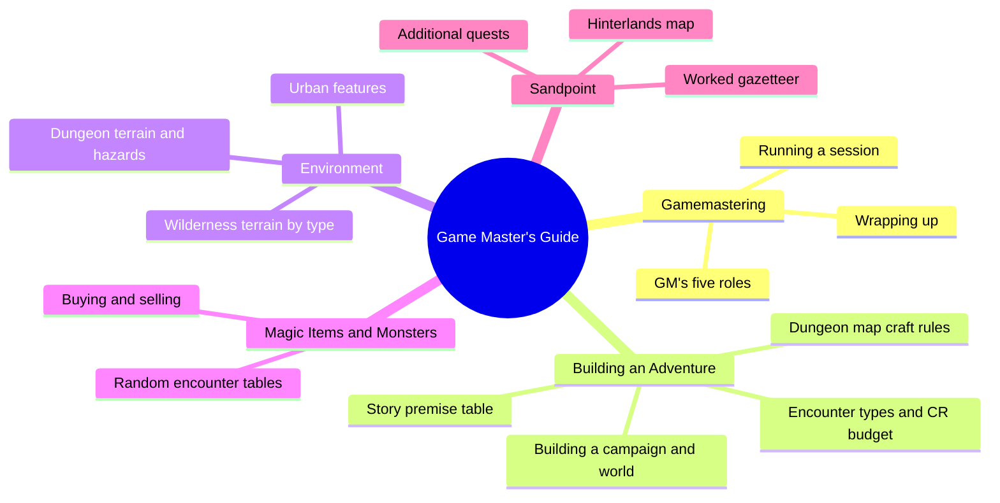
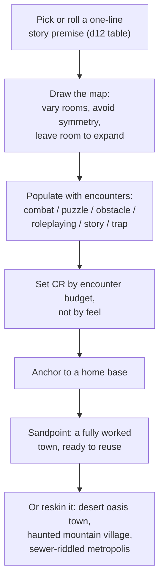
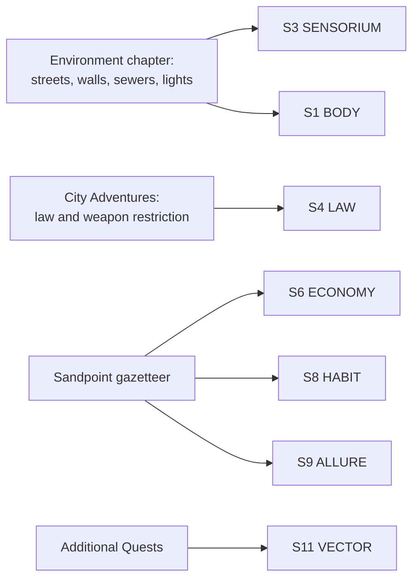

# BVX.0479 — Pathfinder Roleplaying Game Beginner Box: Game Master's Guide — Jason Bulmahn and Sean K Reynolds (2011)
### Knowledge Entry — Distill

The entry-level sibling to the GameMastery Guide (BVX.0480): where that book gives a full build pipeline and a mechanical settlement object, this one strips setting-building down to what a first-time GM can actually use in one sitting, and delivers its single best idea as a worked example rather than a system.

## TABLE OF CONTENTS
- [Core Thesis](#1-core-thesis)
- [Mind Models](#2-mind-models)
- [Framework](#3-framework--structure)
- [Key Concepts](#4-key-concepts)
- [Heuristics](#5-heuristics--decision-rules)
- [Invariants](#6-invariants)
- [Pitfalls](#7-pitfalls--myths)
- [Application](#8-application)
- [Cross-References](#9-cross-references)
- [Provenance](#10-provenance--confidence)

---

## 1 · CORE THESIS

A beginning world-builder needs three things in order: a one-line premise, a map drawn by a few craft rules, and encounters dropped onto it, plus one fully worked home-base settlement to copy. Everything else, including deep terrain physics and law, is optional texture layered on only as far as play actually reaches it.

---

## 2 · MIND MODELS

*Required. Minimum two diagrams, maximum five.*

**Diagram 1 — the whole argument.**
Caption: *a slim beginner manual splits cleanly into "how to run a session," "how to build one," and "here is a whole town to steal" — the third branch is the book's real contribution to a setting library.*

**Diagram 2 — the central mechanism (the fill-order pipeline, then the copyable settlement).**
Caption: *the book runs one short build chain to populate a dungeon, then hands over a second, separate object, an entire home-base town, explicitly offered as a template for a different genre.*

**Diagram 3 — mapped onto the Command's SETTING SLICE (S1-S11).**
Caption: *the book's two chapters land on opposite ends of the same layers BVX.0458 and BVX.0480 already scored, this time filling the S3 SENSORIUM gap both of them left open.*

---

## 3 · FRAMEWORK / STRUCTURE

Seven chapters, roughly in the order a first-time GM needs them: a fully written sample dungeon adventure ("Black Fang's Dungeon"), Gamemastering (the GM's job and how to run a session), Building an Adventure (premise, map, encounters, campaign, world, treasure), Environment (dungeon, wilderness, and city terrain rules plus hazards), Magic Items, Monsters (with random encounter tables by terrain), and Sandpoint (a small gazetteer of a worked home-base town). A GM's Reference and Conditions appendix close the book.

The structure has a deliberate seam: Building an Adventure answers "how do I make this" in the smallest number of steps a beginner can hold in their head at once, while Sandpoint answers the same question by just handing over a finished answer to copy or reskin. The book trusts a worked example over a taught method wherever the two would otherwise compete for the same page space, which is the opposite emphasis from BVX.0458 (all method, essay by essay) and a simpler cousin of BVX.0480 (method plus a mechanical object).

---

## 4 · KEY CONCEPTS

| Concept | What it is | Why it matters |
|---|---|---|
| **Story premise table** | A d12 table of one-line dungeon storylines ("a tribe of goblins led by a barghest moves into an old shipwreck") | Removes blank-page paralysis; a premise this short is enough to start drawing a map, matching the bullseye-method instinct in BVX.0480 but compressed to one roll |
| **Dungeon map craft rules** | Vary room shapes, avoid symmetry, avoid too many empty rooms, mix corridor widths, leave room for expansion, number rooms as tags | Room-level composition craft, a finer grain than either Roberts' nation-first order or the GameMastery terrain hierarchy, both of which stop at the continental scale |
| **Six encounter types** | Combat, puzzle, obstacle, roleplaying, story, and trap encounters, each with its own resolution logic | Story encounters exist purely to deliver lore (a journal, a carving, a talkative ghost) with no danger attached, a clean, reusable vehicle for exposition that doesn't gate progress |
| **Encounter budget (CR to XP)** | A fixed XP total per Challenge Rating that caps how many monsters an encounter can hold | Turns "is this too hard" into arithmetic instead of guesswork, and ties directly to the Treasure Values per Encounter table so reward tracks difficulty |
| **Sandpoint** | A fully worked frontier coastal town: population, mayor, four NPCs sorted by civic role, a tavern, a hinterlands map with marked adventure sites, and a shopping price list | The single most useful steal in the book: a complete, small, copyable settlement instance rather than a checklist for building one |
| **NPC-role gazetteer** | Sandpoint's write-up organizes its people by function (Mayor, Clerics, Rogues, Wizards, Fighters) rather than by government structure | A belonging/access architecture that answers "who do I talk to for what" directly, a softer, faster-to-use cousin of BVX.0458's tribe/city-state/nation binding-principle taxonomy |
| **Reskin instruction** | The book states outright that Sandpoint can be swapped for a desert oasis town, a haunted mountain village, or a sewer-riddled metropolis | Confirms the worked example is meant as a portable pattern, not a fixed canon fact; the shape survives the reskin, the flavor doesn't |
| **Measured urban texture** | City Streets (15-20 feet wide), sewers (10 feet below street level), walls (5 feet thick, 20 feet high), watchtowers, gate staffing, and lantern spacing (every 60 feet) | Concrete numbers instead of mood words; a writer can lift these directly as sensory scaffolding even with the combat math stripped out |
| **Populating without authoring** | Terrain-keyed random encounter tables fill unplanned regions of the map so an unvisited area still feels consistent rather than empty | Solves the same problem BVX.0480's bullseye method solves from the other direction: instead of detailing outward from the center, this leaves the edges genuinely blank and covers them with a table roll only when a player actually goes there |
| **Story-encounter-as-lore-delivery** | A GM can hand out world history strictly through in-fiction objects (journals, carvings, an NPC) rather than narration | The mechanism, not just the rule, for BVX.0458's present-tense-history discipline: history only gets written down if there's a concrete artifact that delivers it in play |

---

## 5 · HEURISTICS & DECISION RULES

| Situation | Do this | Not this |
|---|---|---|
| Starting a first adventure | Grab a one-line premise (roll the d12 table if stuck) and start drawing | Outline a setting bible before anyone has rolled a die |
| Drawing a dungeon map | Vary room shapes, mix corridor widths, leave an edge open for expansion | Build a symmetrical maze that takes forever to draw and bores players to explore |
| Delivering backstory | Attach it to a story encounter (a journal, a carving, a talking ghost) the PCs can find | Read a paragraph of history at the table with no in-fiction source |
| Sizing a combat encounter | Pick a target CR, then add monsters until their XP hits the budget | Guess at difficulty and adjust after someone almost dies |
| Filling unplanned map regions | Roll on the terrain-appropriate random encounter table when PCs actually go there | Pre-author every hex of the world before the campaign starts |
| Building a home base | Give it a population figure, a named contact per civic function, a price list, and a short quest-hook list | Leave the PCs' home town as an unnamed, undetailed backdrop |
| Reusing Sandpoint's shape for a different setting | Keep the four-role NPC structure and hinterlands-with-marked-sites layout, swap the flavor | Copy Sandpoint's specific names and history into an unrelated genre |
| Restricting magic or weapons in a city | Decide the city's stance once (peace-bonding, spellbook checks) and apply it consistently | Improvise different rules for every visit to the same city |

---

## 6 · INVARIANTS

1. **Premise precedes map, and map precedes encounters.** The book never lets a GM populate a space that hasn't been drawn, or draw a space that hasn't been given a one-line reason to exist.
2. **A home base needs named access points to function**: somewhere to sell loot, somewhere to heal, somewhere to hear rumors. Without these three, a settlement is scenery, not a base of operations.
3. **Terrain effects are fixed, checkable numbers, not adjectives.** Visibility distances, movement costs, and wall dimensions are stated so two different GMs would run the same terrain the same way.
4. **An unvisited region still needs a rule for what's there**, even if nothing about it has been authored yet; random tables are that rule.
5. **Lore only enters play through a concrete carrier** (an object, an NPC, a story encounter), never through GM narration alone.
6. **A worked settlement is reusable across genre** as long as its underlying shape (population figure, per-role contacts, marked surrounding sites, quest hooks) survives the reskin.

---

## 7 · PITFALLS / MYTHS

- Building a maze-like, heavily symmetrical dungeon because it looks impressive on paper; it plays as tedious and unfair.
- Leaving a home-base town undetailed because the "real" adventure is elsewhere, so PCs have nowhere concrete to sell loot or hear rumors.
- Reading history aloud at the table with no in-world source, instead of routing it through a journal, carving, or NPC.
- Forcing a random encounter that's clearly too tough for the party rather than rerolling; killing PCs by dice alone isn't fun.
- Assuming every settlement, regardless of size, stocks the same magic items and services; a farming village shouldn't out-shop a city.
- Treating measured environment detail (street widths, wall heights, lantern spacing) as busywork instead of the cheapest available sensory grounding for a scene.

---

## 8 · APPLICATION

- **Spine level:** SETTING (non-story-spine source; keys beside the L0-L7 spine per ssot_03's binding rule)
- **12-layer character stack:** none directly — a setting-side source; its "story encounter" mechanism (deliver lore only through a concrete in-fiction carrier) is structurally close to how an L9 VOICE beat should be shown rather than told, but it is not itself a character-layer feed
- **plot_systems:** contextual candidate once `04_PLOT_SYSTEMS/` opens — the six-way encounter typology (combat/puzzle/obstacle/roleplaying/story/trap) is a ready-made scene-function tag set, and "populate without authoring" (random tables covering unvisited regions) is a cheap consistency rule for any part of a story-world the plot hasn't reached yet
- **Setting:** primary supporting — the book's real contribution is Sandpoint, the first fully worked home-base gazetteer read against `ssot_03_setting_system.md`, plus the strongest S3 SENSORIUM material the SETTING shelf has seen so far

Read directly against its sibling BVX.0480 and the founding BVX.0458: where the Kobold Guide teaches worldbuilding philosophy and the GameMastery Guide supplies a mechanical settlement object, this book supplies neither theory nor a state machine, it supplies a finished, small, working example and says outright: copy this shape, change the flavor. For a writer building a SETTING system rather than running a table, Sandpoint is the steal worth taking whole: a population number, four or five named contacts sorted by what they're for (not by rank), a small map of surrounding sites each carrying one adventure hook, and a short shopping/economy list. That shape is genre-agnostic exactly the way the book claims (desert oasis, haunted mountain village, sewer metropolis), and it answers, in miniature, the same "why would anyone want in" question BVX.0480 left as an abstract checklist item and BVX.0458 answered only for magic systems. The Environment chapter's measured urban and terrain facts are the second steal: concrete numbers (street width, wall height, lantern spacing, sewer depth) that a prose writer can lift directly as textural scaffolding, filling exactly the S3 SENSORIUM gap that both BVX.0458 and BVX.0480 flagged and left open, pending Rozelle/Hall's craft-of-description sources. Finally, the story-encounter mechanism, deliver history only through a found object or a talking NPC, is the concrete enactment of Baur's present-tense-history rule (BVX.0458): it doesn't just say to keep backstory lean, it hands over the actual delivery mechanism for doing so in scene.

---

## 9 · CROSS-REFERENCES

| Related entry | Relation |
|---|---|
| [[BVX.0480]] | Pathfinder GameMastery Guide — sibling SETTING-shelf source, same publisher and game line; that book supplies the full build pipeline and a mechanical settlement stat block, this one supplies a beginner-scale worked example and fills the S3 SENSORIUM gap that book left open |
| [[BVX.0458]] | The Kobold Guide to Worldbuilding — founding SETTING-shelf source; this book's story-encounter mechanism is the concrete, playable version of Baur's present-tense-history rule, and its NPC-role gazetteer is a faster, less doctrinal cousin of Baur's tribe/city-state/nation taxonomy |
| [[BVX.1122]] | GURPS Hot Spots: Renaissance Venice — a worked gazetteer instance at a much deeper, single-city scale; Sandpoint is this same move compressed to a beginner-friendly two pages |

---

## 10 · PROVENANCE & CONFIDENCE

Full text, pdftotext extraction, ~100pp, clean text layer for prose sections; heavily interleaved sidebar and combat-reference-card layouts (pages 17-19-ish) produce garbled OCR runs in a few spots, none of which affected the sections read for this distill. Read in full: "Gamemastering" (the GM's five roles, running a session, using a published adventure); the entirety of "Building an Adventure" (story premise table, dungeon map craft rules, encounter types, encounter budgets, treasure, building a campaign and world, the Ruins of Raven's Watch worked example); the "Environment" chapter's Storytelling with Setting framing, dungeon terrain types and hazards, Forest/Swamp/Mountain/Desert/Aquatic/Hills/Plains terrain, and Urban Features (city adventures, law enforcement, walls, watchtowers, gates, guards, streets, sewers, buildings, lights); the "Random Encounters" chapter's framing (populating a world, encounter frequency, day/night, non-combat encounters); and the full Sandpoint gazetteer (facts about the town, NPCs by role, the town map, the hinterlands map, shopping and pricing, and the Additional Quests list). Sampled only (table structure and opening framing, not deep-extracted): the Magic Items chapter's item-by-item listings and the Monsters chapter's individual stat blocks, neither of which the brief's setting-and-world-building focus required in depth; the sample adventure "Black Fang's Dungeon" (used only to confirm it anchors near Sandpoint, not read encounter by encounter); and the GM's Reference / Conditions appendix.

The S-layer keying in frontmatter `feeds:` and Diagram 3 is this distill's synthesis against `ssot_03_setting_system.md` (PART A, the twelve-layer SETTING SLICE), reading this source as the concrete-instance-plus-sensory-texture counterpart to BVX.0458's philosophy and BVX.0480's mechanical pipeline on the same layers. Title, author, and year are taken from the book's own credits page and copyright line ("Pathfinder Roleplaying Game Beginner Box is published by Paizo Publishing, LLC... © 2011, 2013, Paizo Publishing, LLC"; authors "Jason Bulmahn and Sean K Reynolds").

## META
- Template: BVX-LEARN-v4.0
- Source classification: full-text beginner-tier game manual, deep extraction on the world-building, environment, and Sandpoint chapters, sampled on magic items, monster stat blocks, and the sample adventure
- Created / Updated: 2026-09-29
