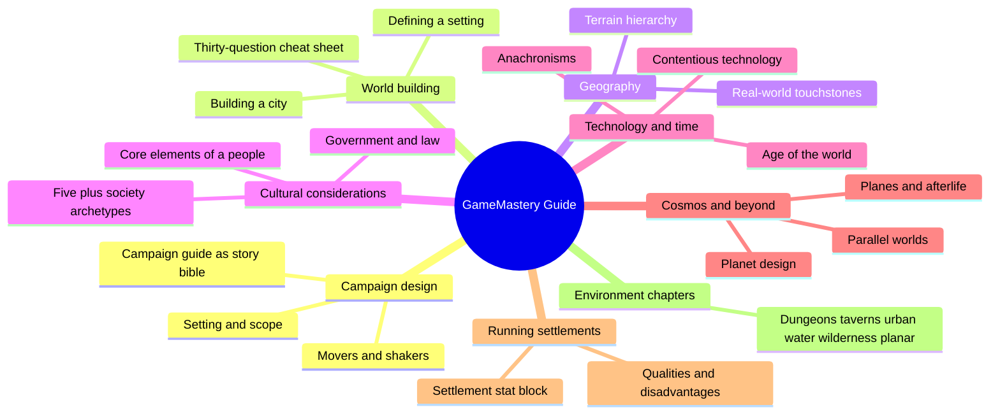
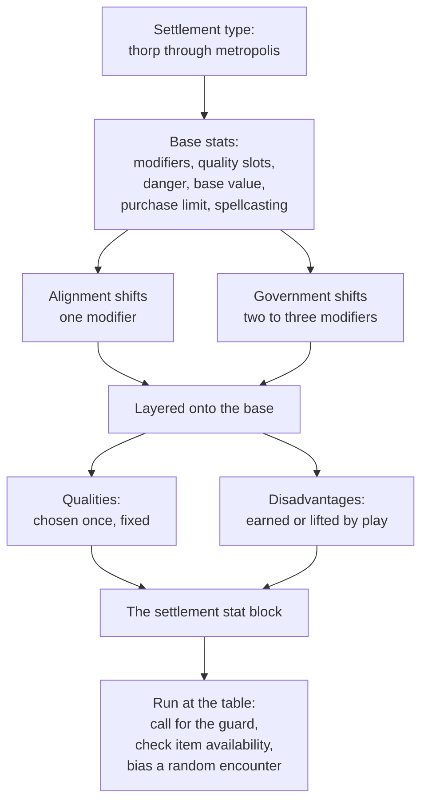
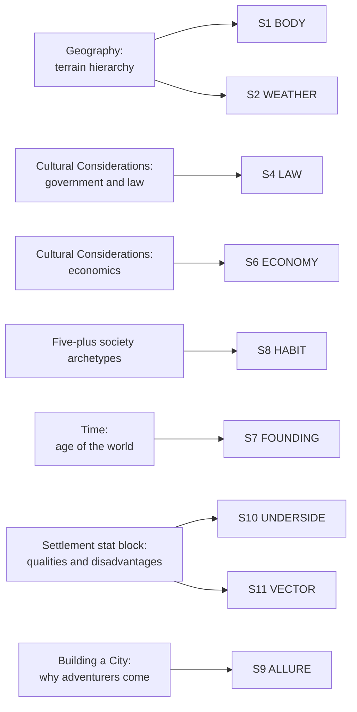

# BVX.0480 — Pathfinder Roleplaying Game: GameMastery Guide — Sean K Reynolds et al. (2010)
### Knowledge Entry — Distill

A GM's-manual companion to the Kobold Guide (BVX.0458): where Kobold gives worldbuilding philosophy essay by essay, the GameMastery Guide gives a fill-order pipeline and, in its settlement stat block, the first mechanical instance of a place-as-character system in this library.

## TABLE OF CONTENTS
- [Core Thesis](#1-core-thesis)
- [Mind Models](#2-mind-models)
- [Framework](#3-framework--structure)
- [Key Concepts](#4-key-concepts)
- [Heuristics](#5-heuristics--decision-rules)
- [Invariants](#6-invariants)
- [Pitfalls](#7-pitfalls--myths)
- [Application](#8-application)
- [Cross-References](#9-cross-references)
- [Provenance](#10-provenance--confidence)

---

## 1 · CORE THESIS

A campaign world is built in a fixed dependency order (definition, then geography, then culture, then government and economy) and then run as a set of instanced, adjustable objects, not documented once and left static. Its clearest proof is the settlement stat block: a place with modifiers, qualities, and disadvantages, built and revised exactly like a character sheet.

---

## 2 · MIND MODELS

*Required. Minimum two diagrams, maximum five.*

**Diagram 1 — the whole argument.**
Caption: *the book runs one build pipeline (definition to cosmology) and then hands the GM a second, separate toolkit for running the six recurring environments play actually happens in.*

**Diagram 2 — the central mechanism (the settlement stat block assembly line).**
Caption: *a place is built the same way a character is: base stats by type, then two independent modifier passes, then a fixed feature slot and a mutable one -- and the whole thing gets used at the table, not just read.*

**Diagram 3 — mapped onto the Command's SETTING SLICE (S1-S11).**
Caption: *the book's two toolkits split cleanly along the slice: geography and culture feed the deep layers, the settlement stat block feeds the surface-visible ones -- and both together still leave S3 SENSORIUM thin, exactly where BVX.0458 also left it.*

---

## 3 · FRAMEWORK / STRUCTURE

The relevant material spans two chapters with different jobs:

**Chapter 6, Creating a World** — a linear build pipeline. Define the setting in one sentence, answer thirty questions to sketch it fast, draw the geography by a fixed five-step algorithm, layer culture and government and economy on top of that terrain, pick a technology level and a calendar, then decide how far out the campaign needs to reach (cosmos, planes, parallel worlds) — each stage explicitly optional past the point the campaign actually touches it.

**Chapter 7, Adventures** — a running toolkit, not a build order. "Elements of Adventure" names six recurring environments (taverns, dungeons, wilderness, urban, water, planar) and argues a location's *behavior* matters more than its label — a drow city plays like a dungeon, a fey-touched forest plays like a plane. The Urban section then delivers the settlement stat block: the mechanism for running a place as a persistent, adjustable object across repeat visits, rather than re-improvising it every session.

The pipeline answers "how do I build this world"; the toolkit answers "how do I run it once built." Kobold Guide (BVX.0458) covers only the first job, essay by essay, with no mechanism for the second.

---

## 4 · KEY CONCEPTS

| Concept | What it is | Why it matters |
|---|---|---|
| **Bullseye method** | Detail the setting outward from where the campaign starts; leave the edges of the map blank | Blank space reads as mystery, not laziness, and caps the GM's workload to what the story will actually touch |
| **Thirty-question cheat sheet** | Ten "heroic" questions (base of operations, who's in charge, what am I doing with these other guys), ten "mundane" questions (economics, travel, landmarks), ten "scholarly" questions (cosmology, magic's source, what happens when you die) | A fast, ordered fill sequence for a setting's whole S1-S11 span in under two hours, explicitly sequenced player-facing-first |
| **Terrain hierarchy** | Coastlines, then elevations, then rivers, then vegetation, then tags (cities, borders, adventure sites) — in that order, non-negotiable | A runnable algorithm, not a preference: draw out of order and rivers flow uphill or deserts sit in swamps with no cause |
| **Core elements of a people** | Survival, language, religion, foreign relations, each placed on a spectrum rather than fixed | None of the four sits independently; moving one (say, isolation) predictably shifts the others (language purity, xenophobia) |
| **Settlement stat block** | A settlement built from type-based defaults (modifiers, danger, base value, purchase limit, spellcasting), then adjusted by alignment, government, qualities, and disadvantages | Turns a place into a reusable, mechanically consistent object instead of an ad hoc description invented fresh each visit |
| **Settlement qualities and disadvantages** | Qualities are chosen once and fixed (academic, holy site, prosperous, notorious...); disadvantages (cursed, hunted, impoverished, anarchy) are earned or removed by events in play | Gives a place a state machine: the same settlement card can register a PC's actions as measurable change |
| **Five-plus society archetypes** | Primitive, feudal, rural/agrarian, cosmopolitan, plus bureaucracy, caste, decadent, magocracy, matriarchy, monstrous, and theocracy as named variants | A menu of belonging-architectures, each with its own leadership logic and question checklist, that can be combined for hybrids (a pastoral bureaucracy, a decadent theocracy) |
| **Environment-over-label rule** | A location's mechanical and narrative treatment should follow what it *behaves like*, not what it's labeled | The single most portable craft rule in the book: a city block under siege behaves like a dungeon; treat it as one |
| **Campaign guide voice** | Subjective voice (in-world documents, biased, flavorful) versus objective voice (GM-voice, concise, complete) versus a deliberate mix | The choice trades completeness for immersion; most working guides mix both rather than picking one absolutely |
| **Shallow-history discipline** | Five dated events are enough to seed dozens of adventures; ages should stay physically plausible (a millennium erases most of a city without upkeep) | A softer cousin of Baur's present-tense-history rule (BVX.0458): the failure mode here is named as scale-cheating, not just irrelevance |

---

## 5 · HEURISTICS & DECISION RULES

| Situation | Do this | Not this |
|---|---|---|
| Starting a new setting | Write a one-sentence mission statement, then run the thirty-question cheat sheet | Draft a sixty-page setting bible before the first session |
| Drawing a world map | Follow the terrain hierarchy in strict order: coasts, elevations, rivers, vegetation, tags | Place rivers or deserts before the mountains that would cause them |
| A PC visits a settlement more than once | Build (or generate) its stat block once and reuse it | Reinvent its prices, danger, and government fresh each visit |
| A settlement changes because of what the PCs did | Add or remove a disadvantage, or note the shift in its modifiers | Leave the place's stats frozen while narrating that "everything is different now" |
| Designing a location's genre feel | Ask what it behaves like (dungeon, plane, urban) regardless of its label | Default to generic treatment because of the location's surface category |
| Writing setting history | Fix five or so dated, consequence-bearing events and stop | Chase a self-consistent ten-thousand-year timeline no one will use |
| Choosing a government for a place | Pick the binding logic (single ruler, council, secret hand, none) and let it set the modifiers | Bolt on a government label with no mechanical or narrative follow-through |
| Publishing a campaign guide to players | Choose a voice (subjective, objective, or a deliberate mix) on purpose | Drift between voices without noticing, confusing players about what's flavor and what's fact |

---

## 6 · INVARIANTS

1. **Geography constrains culture, and culture constrains government** — the terrain hierarchy and the cultural-elements spectrum both assume this order; skipping ahead produces incoherence the world builder has to patch later.
2. **A settlement's type sets a ceiling, not a fixed value** — modifiers, qualities, and available magic all scale off settlement type before any alignment, government, quality, or disadvantage is layered on.
3. **Disadvantages are earned and removable; qualities, once chosen, are not** — a place's fixed identity and its mutable state are architecturally different kinds of fact.
4. **A location's treatment follows its behavior, not its label** — the same six environment types recur regardless of the setting's genre dressing.
5. **History only needs to be as deep as the campaign will touch** — five events, or thirty questions, are explicitly sized to be sufficient, not partial.
6. **Real-world physics still bounds fantasy invention** — rivers do not flow uphill, ruins do not survive millennia unmaintained, even in a world with magic; departures from this need a stated reason.

---

## 7 · PITFALLS / MYTHS

- Handing new players a sixty-page setting bible before their first session — a major, named incentive to go play something else.
- Drawing map features out of hierarchy order (rivers before mountains, deserts with no rain shadow) and only noticing when a player or a geologist friend points it out.
- Treating a settlement's description as disposable flavor text instead of a reusable, adjustable object — forcing the GM to reinvent prices and danger every time the PCs return.
- Freezing a settlement's stats after the PCs change its politics, so the place narrates differently but plays identically.
- Inflating fantasy dates for epic effect ("cities ten thousand years old") without checking that stone, wood, and unmaintained ruins would actually survive that long.
- Drifting between subjective and objective voice in a campaign guide without deciding to, leaving players unsure what's in-world bias and what's GM fact.
- Assuming a location's genre treatment from its label rather than its behavior — playing a haunted city block as a generic urban scene instead of as the dungeon it functions like.

---

## 8 · APPLICATION

- **Spine level:** SETTING (non-story-spine source; keys beside the L0-L7 spine per ssot_03's binding rule)
- **12-layer character stack:** none directly — a setting-side source; its state-machine treatment of a place (fixed qualities plus mutable, earnable/removable disadvantages) is structurally the same move as an L11 DESTINY arc tracked through discrete state flags, but it is not itself a character-layer feed
- **plot_systems:** contextual candidate once `04_PLOT_SYSTEMS/` opens — the settlement disadvantage/quality pair is a ready-made state-tracking notation for any recurring location a plot needs to register change against
- **Setting:** primary — feeds nine of eleven non-storyform SETTING SLICE layers (S1, S2, S3, S4, S6, S7, S8, S9, S10, S11) at varying strength, and is the library's first source to deliver a *mechanical instance* of a place as an adjustable object rather than prose description alone

Read directly against `ssot_03_setting_system.md` and its sibling BVX.0458: where Kobold Guide supplies worldbuilding philosophy essay by essay with no mechanism for revisiting a place across sessions, this book supplies exactly that mechanism. The settlement stat block is the single most useful steal for a SETTING system built for prose rather than tabletop play: give any load-bearing place a small set of adjustable knobs (something like S4 LAW, S6 ECONOMY, S8 HABIT reduced to a few numbers or tags) plus a fixed-feature slot and a mutable-disadvantage slot, and a writer gets the same benefit a GM does — a place that can register the story's pressure on it as a tracked change rather than a rewritten description. The terrain hierarchy is a second, smaller steal: it is a literal, checkable algorithm for S1 BODY that catches internal-consistency errors (impossible rivers, causeless deserts) before they reach the page, complementing rather than duplicating Roberts' nation-first ordering in BVX.0458. The thirty-question cheat sheet is a fast diagnostic: running any DCUS-scale place through it in one sitting would surface exactly which S-layers are canon-thin, the way it already surfaced S2 WEATHER as a gap in BVX.0458.

---

## 9 · CROSS-REFERENCES

| Related entry | Relation |
|---|---|
| [[BVX.0458]] | Kobold Guide to Worldbuilding — sibling SETTING-shelf source; that book supplies build-philosophy per S-layer, this one supplies the fill-order pipeline plus the settlement stat block, the mechanism Kobold never builds |
| [[BVX.1122]] | GURPS Hot Spots: Renaissance Venice — a worked gazetteer instance; the settlement stat block here is this book's equivalent move at a more abstract, systemically adjustable register than Venice's prose-only detail |

---

## 10 · PROVENANCE & CONFIDENCE

Full text, pdftotext extraction, ~322pp, clean text layer with a machine-readable table of contents. Read in full: "Creating a Campaign Guide" (Chapter 1, the story-bible sidebar covering System, Setting, Story, Voice, and Publication); the entirety of Chapter 6, Creating a World (World Building, Detailing Your World's thirty-question cheat sheet, Building a City, Geography's terrain hierarchy, Cultural Considerations, The Primitive Society, The Feudal Society, The Rural/Agrarian Society, The Cosmopolitan Society, Other Societies, Technology, Time, The Cosmos, The Planes, Parallel Worlds); "Elements of Adventure" and "Choosing Your Adventure" opening Chapter 7; and the full Urban section (The Shape of Civilization through the Settlement Stat Block, Settlement Modifiers, Settlement Alignment, Settlement Government, Settlement Qualities, Settlement Disadvantages, and the four Sample Settlements). Sampled only (headers and opening paragraphs, not deep-extracted): the Dungeons, Planar, Taverns, Water, and Wilderness "toolbox" sections of Chapter 7 past their opening framing, plus Chapters 2 through 5, 8, and 9 (Running a Game, Player Characters, NPCs, Rewards, Advanced Topics, NPC Gallery) and the Appendix, none of which the brief's focus (world-building, campaign design, settlements, environment) required in depth.

The S-layer keying in frontmatter `feeds:` and Diagram 3 is this distill's synthesis against `ssot_03_setting_system.md` (PART A, the twelve-layer SETTING SLICE), reading this source as the mechanical-instancing counterpart to BVX.0458's philosophy-and-taxonomy coverage of the same layers.

## META
- Template: BVX-LEARN-v4.0
- Source classification: full-text single-author-credited game manual, deep extraction on the world-building and settlement chapters, sampled on the remaining environment chapters and non-setting chapters
- Created / Updated: 2026-09-29
