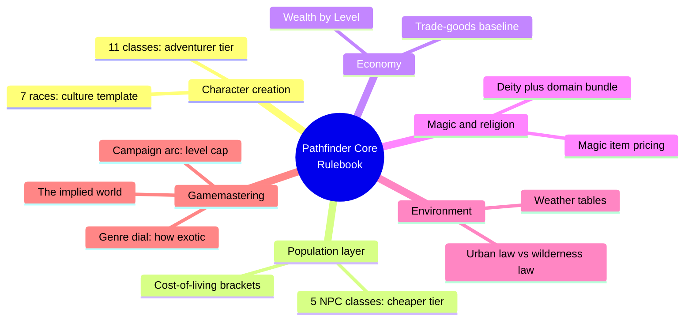
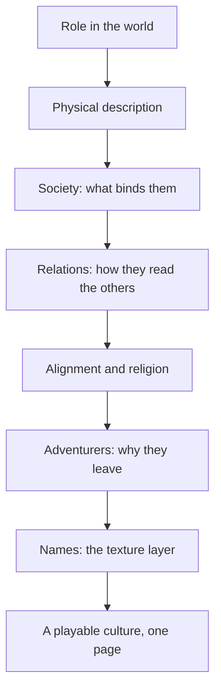
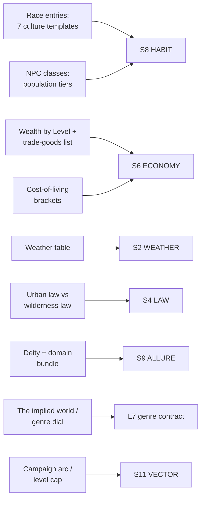

# BVX.0483 — Pathfinder Roleplaying Game Core Rulebook — Jason Bulmahn (Paizo Publishing) (2009)
### Knowledge Entry — Distill

A 578-page D&D-3.5-descended core rulebook: the first SETTING-shelf source built entirely of mechanics rather than essays, read for what its tables, race entries, and GM-advice chapter imply about the world underneath the rules.

## TABLE OF CONTENTS
- [Core Thesis](#1-core-thesis)
- [Mind Models](#2-mind-models)
- [Framework](#3-framework--structure)
- [Key Concepts](#4-key-concepts)
- [Heuristics](#5-heuristics--decision-rules)
- [Invariants](#6-invariants)
- [Pitfalls](#7-pitfalls--myths)
- [Application](#8-application)
- [Cross-References](#9-cross-references)
- [Provenance](#10-provenance--confidence)

---

## 1 · CORE THESIS

A core rulebook is worldbuilding disguised as arithmetic: every table (wealth by level, weather, deity domains) is a default claim about the world, made before a GM writes a word of lore. Pathfinder's races, NPC classes, and price lists are a reusable population, economy, and climate toolkit, not just its own game's math.

---

## 2 · MIND MODELS

*Required. Minimum two diagrams, maximum five.*

**Diagram 1 — the whole argument.**
Caption: *setting leaks out of every rules chapter, not one designated "worldbuilding" section — the book never says so, but its numbers do.*

**Diagram 2 — the central mechanism (a process, run identically on all seven races).**
Caption: *the race entry is a six-step compression: run any invented people through the same six fields and it becomes a playable culture in one page.*

**Diagram 3 — mapped onto the Command's SETTING SLICE (S1–S12).**
Caption: *four systems land as primary feeds (S2, S4, S6, S8); the rest are implied, present as flavor text riding on a mechanic rather than a designed layer.*

---

## 3 · FRAMEWORK / STRUCTURE

Fifteen chapters, ordered by what a player needs at the table (character creation, races, classes, skills, feats, equipment, additional rules, combat, magic, spells, prestige classes, gamemastering, environment, NPCs, magic items), not by worldbuilding topic. Setting is never its own chapter; it rides inside four of the fifteen:

| Chapter | Setting content riding inside it |
|---|---|
| 2 · Races | Seven cultures, each on the same six-field template |
| 6 · Equipment | Wealth and Money: coinage, trade goods, the priced economy |
| 12 · Gamemastering | Campaign Tips: the implied world, the genre dial, the campaign arc |
| 13 · Environment | Urban Adventures (city law and structure), Weather (a full climate system) |
| 14 · Creating NPCs | Adept / Aristocrat / Commoner / Expert / Warrior: the population substrate |

The book's only explicit worldbuilding advice sits in one subsection of Chapter 12 (Campaign Tips, four pages); everything else is setting inferred from mechanics designed for another purpose entirely.

---

## 4 · KEY CONCEPTS

| Concept | What it is | Why it matters |
|---|---|---|
| **The implied world** | The default baseline the rules assume if a GM changes nothing: 7 core races, standard wealth by level, an Earth-like planet | Every published fantasy heartbreaker starts from an implied world; naming it turns "no worldbuilding yet" into "one deliberate baseline," a decision rather than a default |
| **Race-as-culture template** | Six repeating fields per race: Physical Description, Society, Relations, Alignment and Religion, Adventurers, Names | A minimum viable culture write-up; proof that a full people can be built on one page if the fields are chosen right |
| **NPC classes as population substrate** | Adept, Aristocrat, Commoner, Expert, Warrior: five weaker, cheaper mirror-classes of the PC-grade eleven | Stratifies a setting's cast into protagonist-grade and background-grade without inventing new mechanics — the same move as a concentric cast map, done in stats instead of prose |
| **Deity bundle** | Alignment + domains + favored weapon + one-line portfolio, repeated per god | Compresses theology to a mechanical unit; religion becomes something a table can generate instead of something an essay must argue for |
| **Wealth by Level** | A gold-piece figure assigned to every character level, doubling roughly every few levels | Makes the setting's whole economy legible as one curve; "how rich is a 9th-level noble" becomes a lookup, not a guess |
| **Cost-of-living brackets** | Destitute / Poor / Average / Wealthy / Extravagant, each a monthly gp figure and a lifestyle description | A five-rung social-class ladder any setting can borrow directly to answer "what does this NPC's life look like" |
| **Zone-scoped law** | Dungeons and wilderness run on no law; cities run on codified, staffed, enforced law | Law is a property of the place you're standing in, not a blanket property of the nation |
| **Weather table** | Calm/windy/storm/powerful-storm categories, seasonal temperature bands, precipitation odds, named consequences (visibility, flame, travel) | A full S2 system with mechanical teeth, not scenery — weather changes what characters can do |
| **The genre dial ("Monstrous Characters")** | A GM decision, named explicitly: narrow player race options for a grounded world, or open them for an exotic one | The same decision as a five-lineage taste spectrum, collapsed to one binary knob a GM sets before session one |
| **The campaign arc / level cap** | GMs are told to pick a stopping level in advance, tuned to capstone abilities (9th, 13th, 20th) | The party's power curve is an authored trajectory, not an emergent accident — a mechanical VECTOR |

---

## 5 · HEURISTICS & DECISION RULES

| Situation | Do this | Not this |
|---|---|---|
| Starting a homebrew world | Default to an Earth-like baseline first | Answer every geography and physics question before session one |
| Deciding how much of the world to detail | Detail one adventure ahead of the players | Build the whole continent before anyone plays |
| Writing up a new culture or people | Fill the six race-template fields (description, society, relations, faith, role, names) | Write open-ended lore with no fixed shape |
| Populating a city or crowd scene | Give background cast NPC-class stats | Give every extra a full PC-grade class |
| Setting player race/species options | Pick the genre dial once, up front | Let it drift scene to scene as new options get allowed |
| Pricing anything in the world | Build from the trade-goods baseline (grain, salt, silk, livestock) | Invent prices ad hoc per scene |
| Writing a religion | Assign one deity bundle: alignment, domains, favored weapon, one-line portfolio | Draft a page of freeform theology before any mechanic needs it |
| Setting law in a scene | Match the law to the zone (none in the wild, codified in the city) | Apply one blanket law everywhere |
| Planning how far power will climb | Choose a level cap tied to a capstone moment | Let the campaign run indefinitely with no designed ceiling |

---

## 6 · INVARIANTS

1. **Every number in a rules chapter is a worldbuilding claim.** Wealth by Level asserts a monetized adventuring economy; the weather table asserts that climate has mechanical teeth. Neither is neutral math.
2. **The six-field race template is sufficient to make a culture playable.** Nothing more is structurally required to seat a people at the table.
3. **Law is zone-scoped, not nation-scoped.** The place you're standing in, not the country on the map, decides what law applies right now.
4. **Background population is mechanically cheaper than adventurer population by design.** This is how a setting stays populated without becoming a world of superheroes.
5. **A deity is a bundle, not a biography.** Alignment, domain list, favored weapon, and one line of portfolio are what the game needs; more is optional flavor riding on top.
6. **The implied world is a default, not a mandate.** It exists to be knowingly kept or knowingly swapped, never accidentally inherited.
7. **Detail should stay one step ahead of where play is actually going**, never precede it by more than necessary.

---

## 7 · PITFALLS / MYTHS

- Treating the implied default (7 races, standard wealth, standard law) as canon rather than a deliberately swappable baseline.
- Fully detailing a world before the first session instead of staying one adventure ahead — burns prep and invites overwhelm.
- Letting exotic race or magic options in piecemeal without setting the genre dial first, causing tonal drift session to session.
- Giving every background NPC full player-grade stats, which erases the population-cost design and slows every crowd scene down.
- Applying wilderness "no law" rules inside a city, or a city's codified law out in the wild.
- Running a campaign to 20th level and beyond with no chosen stopping point, so the story arc outruns what the rules were built to support.

---

## 8 · APPLICATION

- **Spine level:** SETTING (non-story-spine source; keys to the entity beside the L0–L7 spine, per ssot_03's binding rule that setting is a Domain embodied, never a level)
- **12-layer character stack:** none directly — a setting-side source; its deity-bundle method (alignment + domain + favored weapon = one compressed unit) is structurally the same compression move as an L4/L9 field, but it is not itself a character-layer feed
- **plot_systems:** contextual candidate once `04_PLOT_SYSTEMS/` opens — the encounter-design chain (APL → CR → XP budget → treasure) is a ready-made difficulty-and-reward calculator a plot system could borrow the shape of, even divorced from D20 math
- **Setting:** primary — feeds S2, S4, S6, S8 at primary strength; S1, S9 at supporting; S5, S7, S10, S11 at contextual; plus L7 genre-contract contextually

Read against `ssot_03_setting_system.md`'s SETTING SLICE, this book is the crunchiest source on the shelf: where BVX.0458 (Kobold Guide to Worldbuilding) argues its layers in essays, this one hands the writer literal tables — a weather chart, a wealth curve, a five-rung cost-of-living ladder, a race template with six fixed fields. For a science-fiction setting system, the transferable move isn't the fantasy content, it's the compression pattern: pick a small fixed field set per subsystem (a people, a law zone, a lifestyle bracket, a faith) and force everything through it, the same way DCUS's S8 HABIT could borrow the race template's six fields wholesale to write up a faction or bloc in one page instead of an open-ended lore dump. The genre-dial concept ("Monstrous Characters") is the same decision as Baur's five-lineage spectrum in BVX.0458, just collapsed to a single switch, useful as the fast, table-ready version of that slower taxonomy. The campaign-arc advice (choose a level cap tied to capstone abilities) is a concrete worked instance of an authored VECTOR: DCUS's own six-movement descent (clean to NEON-ROT to hunt) is the same shape, a deliberately chosen escalation curve rather than an emergent one.

---

## 9 · CROSS-REFERENCES

| Related entry | Relation |
|---|---|
| [[BVX.0458]] | Kobold Guide to Worldbuilding — essay-form sibling on the same SETTING shelf; this book is its crunch-form mirror, tables where that one has arguments |
| [[BVX.1122]] | GURPS Hot Spots: Renaissance Venice — a worked setting instance; Pathfinder's price lists and cost-of-living brackets are the generic version of what that book prices for one specific city |
| [[BVX.0349]] | Against Worldbuilding, and Other Provocations — counter-argument sibling; this book is the strongest possible reply, since its "worldbuilding" is entirely a byproduct of rules built for something else and still generates a coherent implied world |
| [[BVX.0067]] | Collaborative Worldbuilding for Writers and Gamers — undistilled sibling, same craft-not-theory register |

---

## 10 · PROVENANCE & CONFIDENCE

Full text, pdftotext extraction, 578pp per catalog, two-column layout with irregular line interleaving in places. Read in full or near-full: front matter and Introduction (Monte Cook, Jason Bulmahn); the Races chapter's framing text and the Dwarves entry complete (used as the representative instance of the six-field template; the remaining six race entries confirmed structurally identical by targeted grep, not deep-read); Chapter 6's Wealth and Money section (coinage, trade goods, starting wealth); Chapter 12 Gamemastering in full (Starting a Campaign, Published Adventures, Building an Adventure, Designing Encounters, Awarding Experience, Placing Treasure, Campaign Tips, Monstrous Characters, Ending the Campaign, Beyond 20th Level); Chapter 13 Environment's Urban Adventures and Weather sections in full; Chapter 14 Creating NPCs' opening framing plus the Adept, Expert, and Warrior class blocks. Sampled, not deep-read: the six remaining race entries beyond Dwarves; Chapter 3 Classes; Chapters 4–5 (Skills, Feats); Chapters 8–10 (Combat, Magic, Spells) beyond the domain/deity table embedded in the Cleric class entry; Chapter 11 Prestige Classes (one entry, Arcane Archer, read for its Requirements-gate pattern); Chapter 15 Magic Items; the appendices. Golarion, Paizo's house setting, appears only in back-of-book advertisements for other product lines, confirming the core rulebook itself is written setting-neutral — every worldbuilding claim traced above comes from the rules chassis, not from campaign-setting lore.

The S-layer keying in frontmatter `feeds:` and Diagram 3 is this distill's synthesis against `ssot_03_setting_system.md` (PART A, the twelve-layer SETTING SLICE), following the same essay-to-layer mapping method BVX.0458 established for this shelf. `spine: [SETTING]` and the empty character-stack application follow the v4 template's binding rule and `ssot_03`'s root claim that setting is a Domain embodied, not a story-spine rung.

## META
- Template: BVX-LEARN-v4.0
- Source classification: full-text rules book, deep extraction on the four setting-bearing chapters (Races framing + one full race entry, Equipment's economy section, Gamemastering in full, Environment's urban/weather sections, Creating NPCs' framing), sampled elsewhere
- Created / Updated: 2026-09-29
