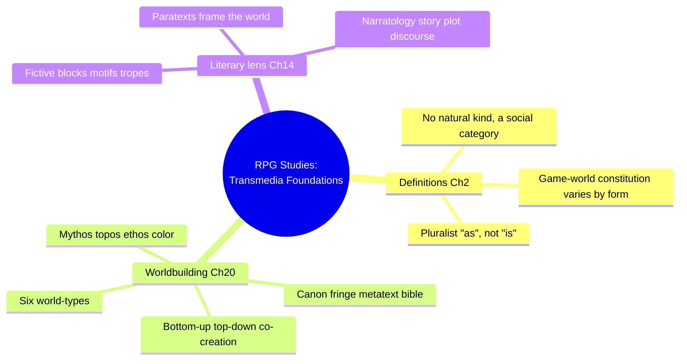
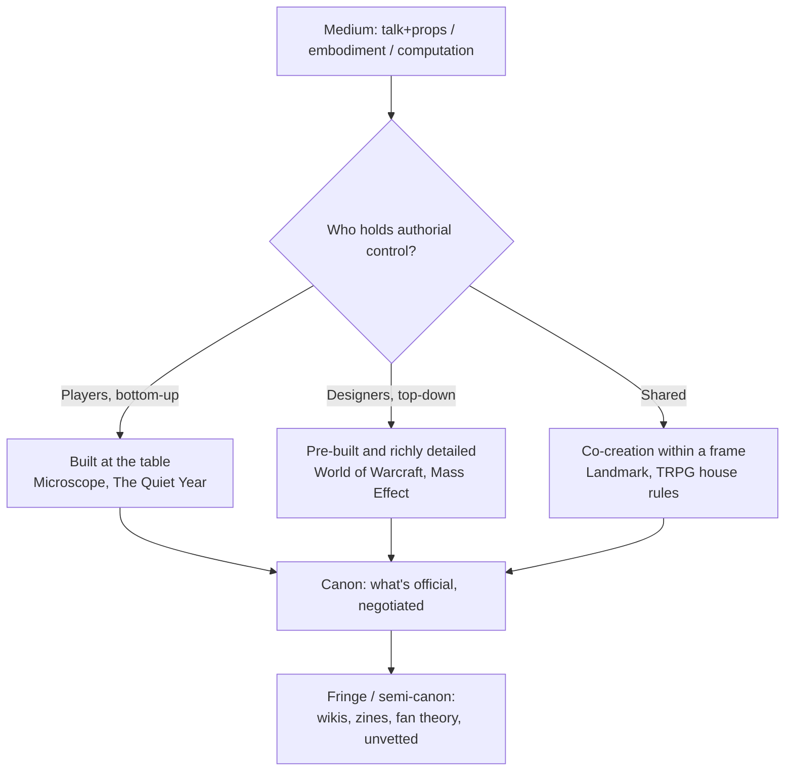
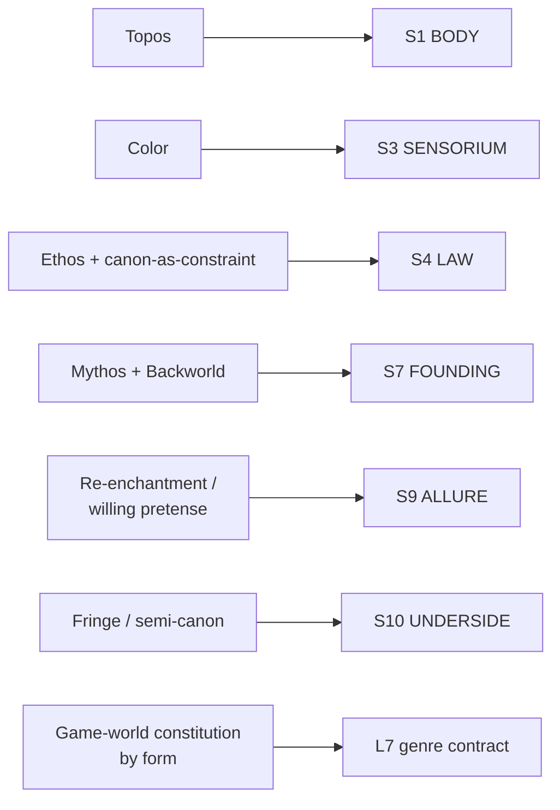

# BVX.0504 — Role-Playing Game Studies: Transmedia Foundations — eds. Zagal & Deterding (2018)
### Knowledge Entry — Distill

A 27-chapter academic textbook surveying RPG Studies across disciplines and media; this distill pulls the three chapters load-bearing for setting craft, Definitions (Ch. 2), Worldbuilding in RPGs (Ch. 20), and Literary Studies (Ch. 14), as the theory layer underneath the Command's SETTING SLICE.

## TABLE OF CONTENTS
- [Core Thesis](#1-core-thesis)
- [Mind Models](#2-mind-models)
- [Framework](#3-framework--structure)
- [Key Concepts](#4-key-concepts)
- [Heuristics](#5-heuristics--decision-rules)
- [Invariants](#6-invariants)
- [Pitfalls](#7-pitfalls--myths)
- [Application](#8-application)
- [Cross-References](#9-cross-references)
- [Provenance](#10-provenance--confidence)

---

## 1 · CORE THESIS

A role-playing game world isn't handed down, it's negotiated: "role-playing game" resists one definition because it's a social category enacted differently through talk, embodied larp, or computation. A fictional world is a contested stack of canon, fringe, and metatext, not a finished fact, and it convinces when mythos, topos, ethos, and color cohere into a reason to enter.

---

## 2 · MIND MODELS

*Required. Minimum two diagrams, maximum five.*

**Diagram 1 — the whole argument.**
Caption: *three chapters, one throughline: RPGs are a social category, not a natural one, so both "what is an RPG" and "what is a setting" get settled by negotiation, not definition.*

**Diagram 2 — the central mechanism (who holds authorial control over the world, and how that settles into canon).**
Caption: *the same authority question runs through Ch. 2's forms table and Ch. 20's worldbuilding models: wherever control sits, it still has to resolve into an official canon with an unofficial fringe underneath.*

**Diagram 3 — mapped onto the Command's SETTING SLICE (S1–S12).**
Caption: *this book supplies a second, reader-psychology vocabulary for four layers Kobold (BVX.0458) already staked out from the designer's side; mythos and backworld both land on S7, from a different direction.*

---

## 3 · FRAMEWORK / STRUCTURE

Three chapters, three jobs, read as one setting-craft argument:

| Chapter | Authors | Job |
|---|---|---|
| Ch. 2, Definitions of "Role-Playing Games" | Zagal & Deterding | Establishes that RPGs are a social, not natural, category, so any definition is a perspective, not a discovery. Surveys four forms (TRPG, larp, CRPG, MORPG) by how each constitutes its game world. |
| Ch. 14, Literary Studies and RPGs | Jara & Torner | Imports narratology and textual-interpretation tools: what counts as "the text," fictive blocks, paratexts, canon, the ludology-vs-narratology debate. |
| Ch. 20, Worldbuilding in Role-Playing Games | Schrier, Torner & Hammer | The direct setting-craft chapter: defines the six world-types, the mythos/topos/ethos/color quality-axes, the documentation stack (canon/fringe/metatext/bible), and the three worldbuilding-authority models. |

The book's unifying move, stated in Ch. 2 and re-enacted in Ch. 20, is to refuse a single essentialist definition and ask "what is useful if we see X as ___?" — applied first to "role-playing game," then implicitly to "world."

---

## 4 · KEY CONCEPTS

| Concept | What it is | Why it matters |
|---|---|---|
| **RPGs as social, not natural, kind** | "Role-playing game" has no essence; it's a category people build and rebuild through talk and practice (Ch. 2) | Licenses a pluralist, perspective-first approach to any definition problem, including "what is a setting" |
| **Game-world constitution** | How the fictional world is materially built: joint talk + props (TRPG), embodiment + physical space (larp), a computational model (CRPG/MORPG) (Ch. 2) | The medium sets a hard ceiling on who can edit the world mid-session and how fast |
| **Fictional world vs. storyworld vs. backworld vs. possible world vs. virtual world vs. transmedia world** | Six adjacent but distinct terms (Ch. 20): the internally-consistent secondary world; the sensory world a specific story unfolds in (diegesis); the pre-history behind the "now" state; a logic-driven variant of our own world; a computer-simulated space; a world built to be told across platforms | Precision here prevents conflating "the setting" with "this campaign's current diegesis"; they're related but not identical objects |
| **Mythos / Topos / Ethos / Color** (Klastrup & Tosca) | Four axes of a working fictional world: the backstory-of-backstories, the geography-and-period, the moral rules, and the richness of sensory detail | A compact quality checklist: a world can be strong on topos and weak on ethos, and that imbalance is diagnosable |
| **Core canon** | The official elements agreed on by makers and audience; always a negotiation, not a fixed deliverable | Canon disputes (what "really" happened) are evidence the world is alive enough to fight over |
| **Fringe / semi-canon** | Unofficial or half-accepted material: zines, wikis, fan theories, local house-canon | A world without a fringe has no interpretive community forming around it; fringe growth is a health signal |
| **Metatext** | Extra-diegetic material (wikis, maps, timelines) that describes or organizes the world from outside it | Distinguishes "world material" (in-world) from "world documentation" (about the world); both matter, in different ways |
| **World bible / core book** | The document that establishes a world for production; format differs by RPG type (TRPG core books, sensory exploration in CRPGs, blue-sheet handouts in larp) | The delivery medium for setting material is itself a design decision |
| **Bottom-up / top-down / co-creation worldbuilding** | Three authority models: players build the world through play (Microscope, The Quiet Year); designers pre-build a rich world players inhabit (WoW, Mass Effect); both share the load (Landmark, TRPG house rules) | Naming the model up front prevents a table or a writing team from silently drifting between them |
| **Willing activation of pretense** (Saler) | An active, chosen belief in the secondary world, distinct from passive "suspension of disbelief" | Reframes audience buy-in as something the world must earn through craft, not something owed to it by genre |
| **Fictive blocks** (Mackay) | Reusable literary motifs, tropes, and themes that let players and designers build on each other's input in real time without breaking the fiction | The unit of improvisation in collaborative worldbuilding: a table runs on shared blocks, not shared plans |
| **Paratext** (Genette, via Ch. 14) | Material surrounding the "main text": titles, covers, back-cover copy (peritext) and trailers, reviews, walkthroughs (epitext) | A setting is pitched before it's entered; back-cover copy is doing real worldbuilding work, not just marketing |
| **Ludology vs. narratology (resolved)** | The old debate over whether games can be narratives at all; resolved by treating RPG narrative as simulative, emergent, participatory, and simultaneous rather than scripted | Frees a setting-builder from designing a fixed plot: the world needs to generate story, not contain one |

---

## 5 · HEURISTICS & DECISION RULES

| Situation | Do this | Not this |
|---|---|---|
| Deciding who builds the world | Name the model explicitly: bottom-up (players), top-down (author), or co-creation | Let authority drift silently mid-project between "the world is fixed" and "the world is negotiable" |
| Checking whether a setting is actually working | Audit it against mythos, topos, ethos, and color separately | Judge it as one vague "does it feel real" impression |
| Deciding what's official | Write down the core canon explicitly, even for a wholly original world | Assume "everyone just knows" what counts as true |
| Handling fan theories, house rules, or discarded drafts | Let them live as fringe/semi-canon rather than deleting them | Treat anything not in the "real" canon as waste |
| Choosing how to document the world | Match the medium to the audience: a core book for depth, sensory reveal for exploration media, a blue-sheet for what's load-bearing | Build one giant bible and assume every audience wants all of it |
| Trying to hook an audience into the world | Design for willing activation of pretense: give them a reason to want in (Verino: make them feel welcome, not an outsider) | Assume genre alone (space opera, high fantasy) does the immersion work |
| Improvising world detail at the table or on the page | Reach for a fictive block, a motif, trope, or theme others can build on | Invent unconnected, one-off details that don't recur or accumulate meaning |
| Writing the pitch, back cover, or logline | Treat it as a paratext that frames and commits the world's tone | Treat it as separate from "the real worldbuilding" |
| Justifying a world's structure to a skeptic | Argue from use ("this framing is productive for X") | Argue from essence ("this is what a world/RPG really is") |

---

## 6 · INVARIANTS

1. **A world is negotiated, not discovered.** Canon, like the category "role-playing game" itself, is a social settlement, not a fact waiting to be found.
2. **The medium constrains who can edit the world, and when.** Talk-and-props, embodiment, and computation each set different limits on real-time revision.
3. **Mythos, topos, ethos, and color are separable axes.** A world can succeed on one and fail on another; they don't move together automatically.
4. **Canon always implies a fringe.** Wherever an official version exists, unofficial and semi-official material accumulates beneath it; this is evidence of engagement, not contamination.
5. **Immersion is willingly chosen, not passively suffered.** The audience is an active participant in activating belief, which means the world has to give them something to activate belief with.
6. **RPG narrative is generated, not contained.** A world built for RPG use should produce story through play (simulative, emergent, participatory) rather than pre-script one.
7. **Documentation format is a design decision.** How a world's information reaches its audience (core book, exploration, blue sheet) shapes what that audience can know and when.

---

## 7 · PITFALLS / MYTHS

- Treating "role-playing game" (or "setting") as if it had one true essential definition, rather than as a useful-for-some-purpose category.
- Assuming worldbuilding authority is fixed by genre or medium rather than chosen and stated: TRPGs, larps, CRPGs, and MORPGs all show examples across the bottom-up/top-down/co-creation spectrum.
- Deleting or dismissing fringe and semi-canon material as noise, when its accumulation is a sign the world has an interpretive community.
- Confusing "the setting" with "this session's diegesis": a storyworld is a narrower, sensory-specific instance of the broader fictional/secondary world.
- Writing a monolithic world bible without matching its format to how the audience will actually receive the world (reading a book vs. exploring a game space vs. skimming a blue sheet).
- Treating genre alone (space opera, dark fantasy) as sufficient to produce immersion, skipping the actual craft of mythos/topos/ethos/color.
- Re-litigating the ludology-vs-narratology fight as though RPG narrative must be either fully scripted or not a narrative at all.

---

## 8 · APPLICATION

- **Spine level:** SETTING (non-story-spine source, per the v4 binding rule) plus L7 contextually, via the genre/authority-contract angle
- **12-layer character stack:** none directly; the willing-activation-of-pretense concept is the reader-side mirror of an L9 EROS seduction move but is not itself a character-layer feed
- **plot_systems:** the "narrative as generated, not contained" resolution (Ch. 14) is a ready argument for why `04_PLOT_SYSTEMS/` should treat setting as a story-generator rather than a story-container once that module opens
- **Setting:** primary; feeds S1, S3, S4, S7 (double-anchored via mythos and backworld), S9 primary, S10 supporting, S12 contextual, plus L7 genre-contract contextually

Read against the DCUS starter instance in `ssot_03`: this book's mythos/backworld vocabulary for S7 confirms the present-tense discipline Kobold's Baur argues from the designer's chair (BVX.0458). DCUS's founding stack (Skeeter Creek to Red Hills to DCUS) is exactly a mythos, "the central knowledge one needs to have in order to interact with or interpret events in the world successfully," staying only as deep as it still bites. Canon/fringe maps onto DCUS's S10 UNDERSIDE (the first name under the second) as a parallel, not a duplicate: S10 is what a place represses, canon/fringe is what a community half-admits. This book's edge over Kobold is Ch. 2's forms table and Ch. 20's authority models: DCUS's writers-room runs "top-down richly created" rather than "player bottom-up," and naming that model heads off drift mid-project. Willing-activation-of-pretense also gives a scene-level test: does it give the reader a reason to want into DCUS, or assume the Ultra-prestige premise does that work alone?

---

## 9 · CROSS-REFERENCES

| Related entry | Relation |
|---|---|
| [[BVX.0458]] | Kobold Guide to Worldbuilding, the designer-craft counterpart; where Kobold gives S7 a rule (present-tense history), this book gives the same layer a vocabulary (mythos, backworld) from reader-response theory |
| [[BVX.0562]] | Wolf, Building Imaginary Worlds, cited directly in Ch. 20 as the source of "secondary world infrastructures" and "subcreation"; the deeper theoretical treatment this chapter compresses |
| [[BVX.0530]] | Mizer, Tabletop Role-Playing Games and the Experience of Imagined Worlds, undistilled sibling on the player-experience side of the same worldbuilding-authority question |
| [[BVX.0349]] | Against Worldbuilding, and Other Provocations, counter-argument sibling; this book's canon/fringe negotiation model implicitly answers Kennedy's challenge by treating incompleteness (fringe, unresolved canon) as a feature, not a failure |

---

## 10 · PROVENANCE & CONFIDENCE

Full text, pdftotext extraction, 491pp total (front matter, 27 chapters, glossary, index). Read in full: front matter and foreword; Chapter 2, "Definitions of 'Role-Playing Games'" (Zagal & Deterding, including the forms table and the "Comparisons and Conclusions" close); Chapter 20, "Worldbuilding in Role-Playing Games" (Schrier, Torner & Hammer, front to Summary and Further Reading); Chapter 14, "Literary Studies and Role-Playing Games" (Jara & Torner, through the narratology and future-narratives sections). Grepped for cross-chapter reuse: Chapter 18's rules-to-setting-fit discussion (Björk & Zagal) confirmed thin relative to Ch. 20 and isn't separately distilled here. Not read: Chapters 3–13, 15–19, 21–27 (forms histories, other disciplinary perspectives, subculture/fandom, immersion, players-and-characters, transgression, sexuality, representation, power), outside this SETTING-shelf brief's scope of worlds, fiction/narrative, and definitions.

The S-layer keying in `feeds:` is this distill's synthesis against `ssot_03_setting_system.md` (PART A), matching this book's reader-response vocabulary (mythos/topos/ethos/color, canon/fringe) onto layers BVX.0458 already anchored from the designer-craft side. Where the two sources double-anchor a layer (S7, via mythos/backworld here and present-tense-history there), that convergence is treated as confirmation, not redundancy: two independent literatures arriving at the same joint in the schema.

## META
- Template: BVX-LEARN-v4.0
- Source classification: full-text academic essay collection, deep extraction on 3 of 27 chapters (Ch. 2, 14, 20), spot-checked 1 more (Ch. 18)
- Created / Updated: 2026-09-29
