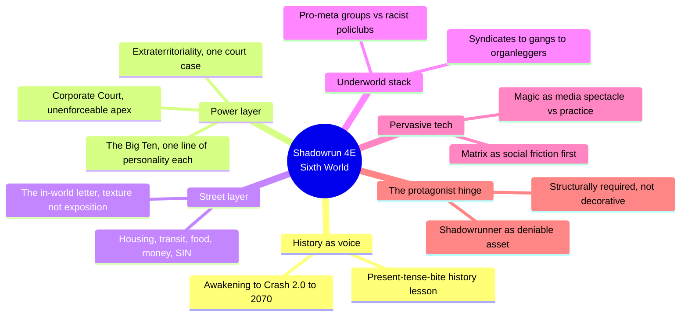
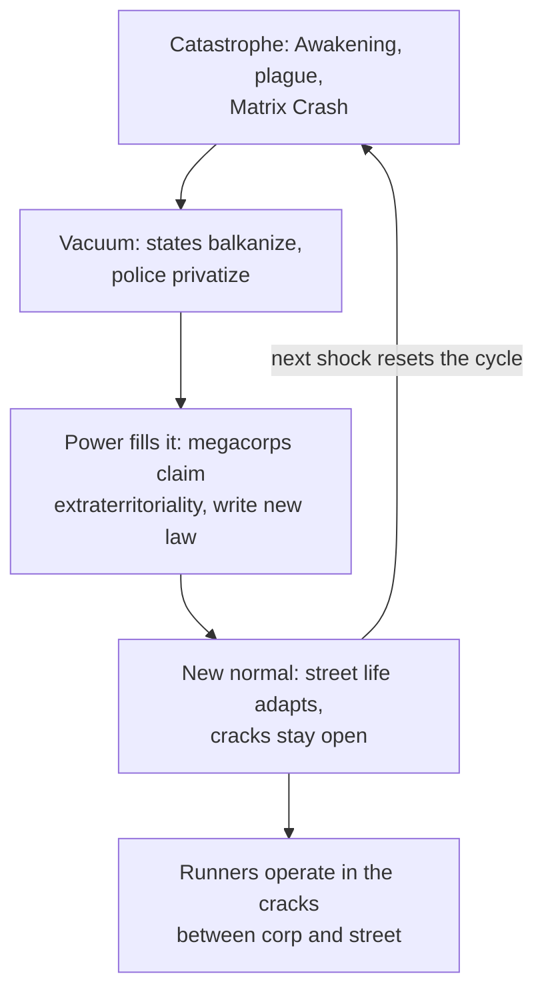
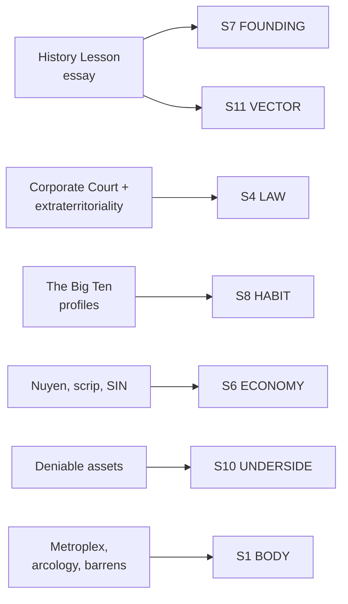

# BVX.0508 — Shadowrun, Fourth Edition — FanPro LLC (2005)

### Knowledge Entry — Distill

The core rulebook for Shadowrun 4E: a dystopian-2070 cyberpunk-plus-magic setting built for a shadowrunner protagonist; distilled here for its Sixth World setting chapters, a worked TTRPG example of building a corporate near-future from the street up rather than the boardroom down.

## TABLE OF CONTENTS
- [Core Thesis](#1-core-thesis)
- [Mind Models](#2-mind-models)
- [Framework](#3-framework--structure)
- [Key Concepts](#4-key-concepts)
- [Heuristics](#5-heuristics--decision-rules)
- [Invariants](#6-invariants)
- [Pitfalls](#7-pitfalls--myths)
- [Application](#8-application)
- [Cross-References](#9-cross-references)
- [Provenance](#10-provenance--confidence)

---

## 1 · CORE THESIS

Shadowrun builds its corporate world from the bottom of the food chain, not the top: history is told by a street survivor who ties every event to a present consequence, factions stack from Corporate Court down to gang, and the protagonist role (deniable asset) is architecturally required by the power structure above it, not bolted on as flavor.

---

## 2 · MIND MODELS

*Required. Minimum two diagrams, maximum five.*

**Diagram 1 — the whole argument.**
Caption: *the setting is one causal engine (catastrophe, then corporate consolidation) viewed from six different altitudes, not six separate topics.*

**Diagram 2 — the central mechanism (a repeating catastrophe-to-order cycle).**
Caption: *every era of the setting's history runs the same four-beat engine, and that repetition, not any single event, is what makes 2070 feel inevitable rather than arbitrary.*

**Diagram 3 — mapped onto the Command's SETTING SLICE (S1–S12).**
Caption: *the book's strongest feeds cluster on LAW, ECONOMY, FOUNDING, HABIT, and UNDERSIDE, exactly the layers a corporate-megacity setting needs most and the layers a fantasy-worldbuilding source (BVX.0458) is thinnest on.*

---

## 3 · FRAMEWORK / STRUCTURE

The setting-relevant chapters run outside-in, then back out again:

| Section | Governing move |
|---|---|
| Opening fiction (a job going bad) | Cold open in the protagonist's voice, no exposition, establishes tone before a single rule is stated |
| "Welcome to the Shadows" | States what a shadowrunner is and why the job exists before describing the world that needs one |
| "A History Lesson for the Reality Impaired" | Seventy years of backstory told by one embittered narrator, each beat closed with its present-day consequence |
| "Life on the Edge" | The street-level survey: housing, transit, food, money, SIN, healthcare, the Matrix as daily friction, magic as media |
| The Big Ten | Ten megacorps, each given a one-paragraph personality, not a spreadsheet of assets |
| "Criminal Elements (Other Than You)" | The underworld stacked macro to micro: syndicates, gangs, organleggers, activist and hate groups |
| Mechanics chapters | Rules only arrive after the world has been lived in on the page |

The load-bearing move is sequence: rules are the last thing introduced, after fiction, history-as-voice, and street texture have already done the work of making the world feel inhabited.

---

## 4 · KEY CONCEPTS

| Concept | What it is | Why it matters |
|---|---|---|
| **Present-tense-bite history** | Seventy years of setting history told first-person by a jaded, joking survivor, who ties nearly every beat to what it means "for you" today | A reusable delivery method: history reads as live consequence, not homework, because the narrator keeps translating past event into present stakes |
| **Extraterritoriality from one court case** | The entire corporate-law layer of the setting traces to a single Supreme Court ruling (the Shiawase Decision) letting corps police their own territory like foreign soil | One small, plausible legal fiction, planted early, is enough to license an entire power structure; the setting doesn't need ten separate laws, it needs one good one |
| **The Corporate Court** | Thirteen justices from the Big Ten megacorps, based off-world, with no way to actually enforce its rulings | An apex that is respected but not obeyed by force is a better engine for ongoing conflict than a government that can crush dissent outright |
| **The Big Ten profile template** | Each megacorp gets: headquarters, one line of corporate culture, its specialization, and its shadow-side reputation with runners | A repeatable four-slot template for stamping out factions fast without writing an org chart for each one |
| **Faction stack** | Corporate Court, then the Big Ten, then AA/AAA corps, then organized-crime syndicates (Mafia, Yakuza, Triads, Vory), then street gangs, then individual operators | Gives every scale of story a rung to stand on; a player character's power level maps directly onto which rung of the stack they can plausibly touch |
| **The street-level letter** | An in-world letter from an ex-con named Mike to a friend, describing his first day back on the streets in 2070 | Delivers the same wireless-Matrix, AR-saturated world as the mechanics chapters, but through a bewildered, ordinary voice instead of a spec sheet |
| **Matrix as social friction first** | The Matrix chapter for general readers describes spam, dating profiles, ad clutter, and RFID "dots" before it describes signal ratings or hacking rules | Pervasive technology reads as real when it is introduced as a nuisance and a convenience before it is introduced as a rules subsystem |
| **SIN as an underclass generator** | A single bureaucratic artifact, the System Identification Number, determines whether a citizen can rent an apartment, own a car, or fly | One piece of setting plumbing produces an entire underclass (the SINless), a black market in fake identities, and a two-tier justice system, without new lore for each |
| **Deniable asset** | Shadowrunners exist specifically so megacorps can fight each other without either side's fingerprints on the outcome | The protagonist role is load-bearing: remove it and the top-tier factions have no mechanism for indirect conflict, which is most of what the setting runs on |
| **Metahuman social layer** | Goblinization and UGE (people transforming into elves, dwarfs, orks, trolls) retrofit real-world discrimination patterns onto a fantasy-biology event | A species-level worldbuilding shock generates faction texture (pro-meta activist groups, racist policlubs) for free, by reusing a recognizable social grammar instead of inventing a new one |

---

## 5 · HEURISTICS & DECISION RULES

| Situation | Do this | Not this |
|---|---|---|
| Delivering setting history | Write it in one survivor's voice, close every beat with its present-day consequence | Write a neutral, complete timeline nobody in the world would actually say aloud |
| Licensing a power structure (corp law, guild law, church law) | Root it in one plausible precedent or ruling, then let consequences cascade | Assert the power structure as background fact with no origin |
| Introducing a megacorp, guild, or faction | Give it a home base, one line of culture, a specialization, and its street-level reputation | Give it a full org chart and asset table before establishing who it is |
| Building the underworld of a crime-adjacent setting | Stack it macro to micro (apex court to syndicate to gang to individual) so any protagonist has a rung | Flatten it into one undifferentiated "criminal underworld" |
| Introducing a pervasive technology or magic system | Show it as everyday friction and convenience before explaining its mechanics | Open with the rules subsystem and let the social texture follow, if at all |
| Explaining an underclass or excluded group | Hang it on one bureaucratic lever (a document, a status, a currency) | Invent a separate reason for every symptom of exclusion |
| Placing the protagonist role in the setting | Make it structurally necessary to how the top factions operate | Make it a job description layered on top of a world that would run fine without it |

---

## 6 · INVARIANTS

1. **History reads as real when it keeps translating into present consequence, not when it is complete.** The narrator's "what this means for you" habit is the mechanism, not the trivia.
2. **An apex authority that cannot enforce itself but is still obeyed is a better long-term engine than one with total power.** The Corporate Court's weakness is what keeps the setting's central conflict alive.
3. **Faction depth comes from stacking rungs, not from detailing any single rung exhaustively.** The Big Ten need one paragraph each; the stack itself is what does the worldbuilding work.
4. **Pervasive technology and magic are introduced through their social effect before their mechanism.** Spam and dating profiles land before signal ratings do.
5. **One bureaucratic lever can generate an entire social layer.** SIN status alone produces housing options, an underclass, a black market, and a two-tier legal system.
6. **A protagonist role that is structurally required by the power layer above it is more durable than one that is merely permitted to exist in the setting.**

---

## 7 · PITFALLS / MYTHS

- Writing setting history as a dry, voiceless timeline instead of a narrator with stakes and jokes.
- Treating factions as interchangeable stat blocks: two megacorps with no distinguishing culture line collapse into one in the reader's mind.
- Opening a pervasive-tech or pervasive-magic setting with its rules chapter instead of its social texture.
- Giving the underworld a single flat tier, which leaves no room for a protagonist to be small relative to the world.
- Making the setting's apex authority either toothless-and-ignored or all-powerful; neither sustains ongoing conflict as well as toothless-but-still-feared.
- Bolting the protagonist role onto the setting as a job title rather than wiring it into how the power structure actually functions.

---

## 8 · APPLICATION

- **Spine level:** SETTING (non-story-spine source, keyed beside the L0–L7 spine per the SETTING SLICE's binding rule)
- **12-layer character stack:** none directly; the deniable-asset mechanism (a protagonist role required by the power structure) is structurally the same move as auditing an L6 DRIVE want against its cost, but this is a setting-side source, not a character feed
- **plot_systems:** contextual candidate once `04_PLOT_SYSTEMS/` opens; the catastrophe-to-order cycle (Diagram 2) is a ready-made engine for generating setting-level stakes that outlast any single scene
- **Setting:** primary; this is the first megacorp/near-future SETTING-shelf distill, feeding S1, S4, S6, S7, S8, S10 at primary strength and S11 at supporting strength

Tested directly against a corporate-institution setting like DCUS: the extraterritoriality trick (one court case licensing a whole power layer) is the same shape DCUS needs for how the Bishops' acquisition actually became binding, and the Big Ten's four-slot faction template (HQ, culture line, specialization, street reputation) is a fast way to stand up rival institutions or feeder programs around DCUS without writing an org chart for each. The present-tense-bite history method is the strongest single steal in the book: it answers, directly, how to deliver DCUS's rename lattice (Skeeter Creek to Red Hills to DCUS) as lived consequence rather than as a wiki entry. Where this source is thin: it has almost nothing on S2 WEATHER, S3 SENSORIUM, or S9 ALLURE as their own topics; its magic-and-tech-as-lifestyle material substitutes for allure only partially, and its geography (S1) is a byproduct of the legal and corporate layers rather than a method of its own, the inverse of Roberts' terrain-first mapmaking order in BVX.0458.

---

## 9 · CROSS-REFERENCES

| Related entry | Relation |
|---|---|
| [[BVX.0458]] | Kobold Guide to Worldbuilding, the SETTING-shelf theory counterpart; where that book maps terrain-first and treats history as present-tense-bite in the abstract, this entry is a full worked instance of the same rule at book length |
| [[BVX.1122]] | GURPS Hot Spots: Renaissance Venice, the first concrete SETTING-SLICE instance distilled; this entry is a second worked instance, corporate-megacity rather than historical-city |
| [[BVX.0399]] | Cyberpunk 2.0.2.0, undistilled sibling; the genre-adjacent corporate-dystopia RPG most useful to cross-check the megacorp/faction-stack method against |
| [[BVX.0389]] | CARBON 2185, undistilled sibling; a modern cyberpunk RPG likely to show how the same faction-stack and street-level-texture moves have evolved since 2005 |

---

## 10 · PROVENANCE & CONFIDENCE

Full text, pdftotext extraction, 354pp. Read in full or near-full: front-matter and credits page; the opening fiction vignette; "Welcome to the Shadows" (roleplaying-game overview, runner types, the Matrix and astral plane as two settings); "A History Lesson for the Reality Impaired" in full (Seretech, the Shiawase Decision, the Lone Eagle Incident, VITAS, the Awakening, Goblinization, the Crash of '29, Echo Mirage, the Wireless Matrix Initiative, Crash 2.0, post-Crash nation-building); "Life on the Edge" in full (the in-world letter; Day to Day; A Place to Stash Your Gear; Getting Around; You Are What You Eat; Show Me the Money; SINless in Seattle; The Doctor Is In; Welcome to the Machine; Matrix 2.0 consumer-facing material; magic in the media); the Corporate Court and extraterritoriality sections; the Big Ten megacorp profiles in full (Ares, Aztechnology, Evo, Horizon, MCT, NeoNET, Renraku, Saeder-Krupp, Shiawase, Wuxing); "Criminal Elements (Other Than You)" in full (organized-crime syndicates, gangs, organleggers, race relations, pro-meta activist groups, racist organizations). Sampled via targeted grep and table of contents: later mechanics chapters (combat, skills, gear, cyberware, the deep Matrix and magic rules chapters), the sample-character and adventure-hook material, and the index.

The S-layer keying in frontmatter `feeds:` and Diagram 3 is this distill's synthesis against `ssot_03_setting_system.md` (PART A, the twelve-layer SETTING SLICE), following the same keying method BVX.0458 established for the SETTING shelf. `spine: [SETTING]` and the empty character-stack application are asserted per the v4 template's binding rule that setting is a Domain embodied beside the story spine, never an L0–L7 rung on it.

## META
- Template: BVX-LEARN-v4.0
- Source classification: full-text core rulebook, deep extraction on the setting/history/street-level chapters, sampled on the crunch chapters
- Created / Updated: 2026-09-29
