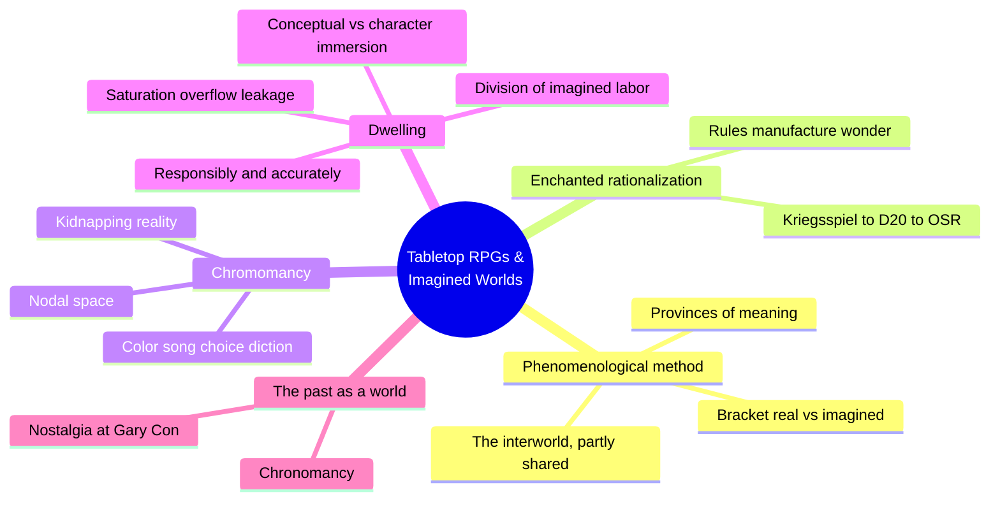
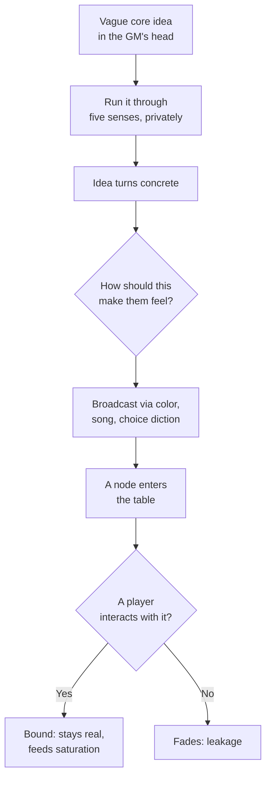
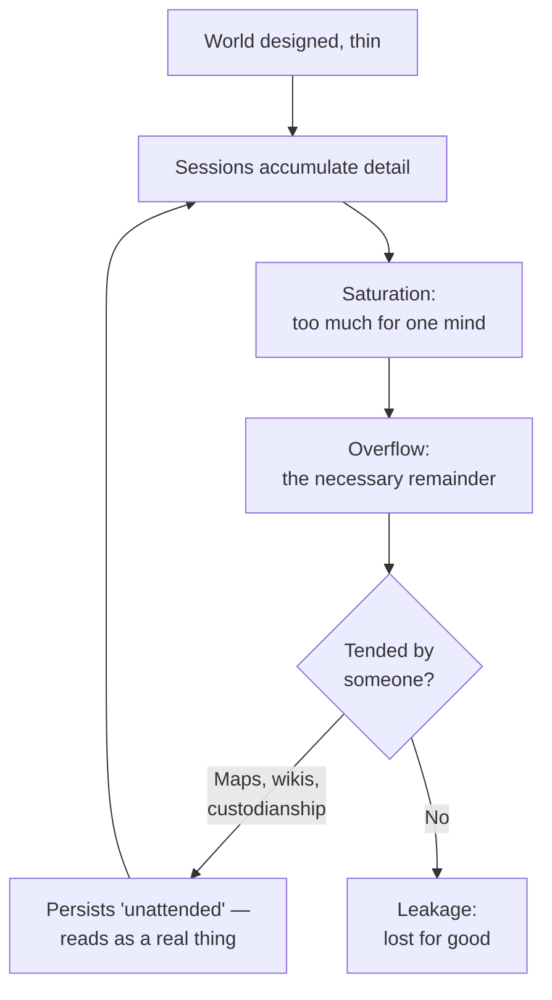
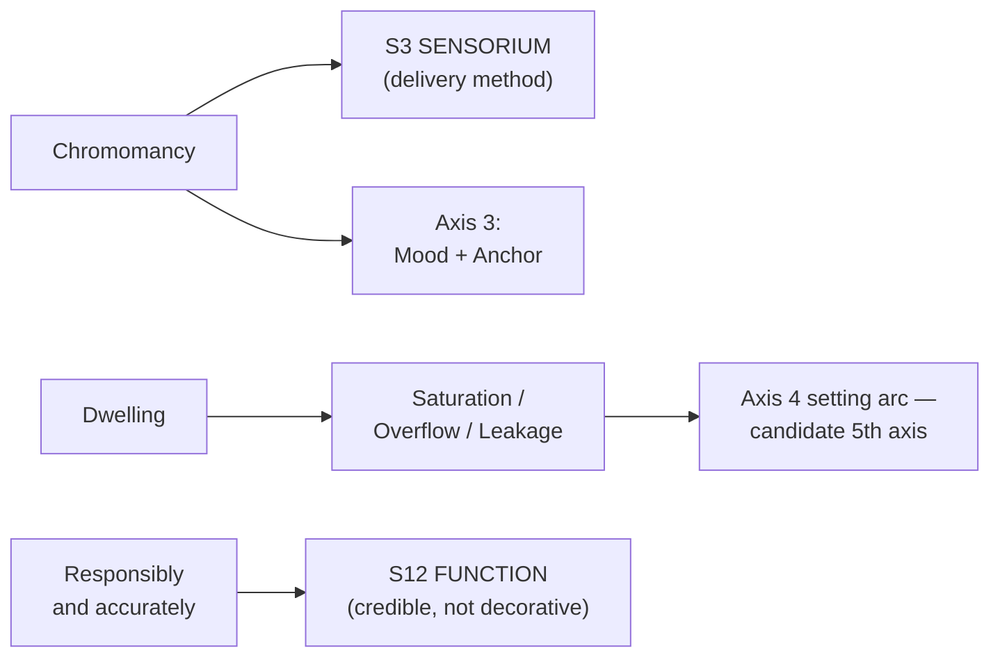

# BVX.0530 — Tabletop Role-Playing Games and the Experience of Imagined Worlds — Nicholas J. Mizer (2019)
### Knowledge Entry — Distill

A phenomenological ethnography of TRPG players (old-school and long-campaign gamers, 2012-2016 fieldwork) asking not what a game world *is* but how players come to experience it as real; the first library source keyed to the delivery and maintenance side of the SETTING SLICE rather than its content side.

## TABLE OF CONTENTS
- [Core Thesis](#1-core-thesis)
- [Mind Models](#2-mind-models)
- [Framework](#3-framework--structure)
- [Key Concepts](#4-key-concepts)
- [Heuristics](#5-heuristics--decision-rules)
- [Invariants](#6-invariants)
- [Pitfalls](#7-pitfalls--myths)
- [Application](#8-application)
- [Cross-References](#9-cross-references)
- [Provenance](#10-provenance--confidence)

---

## 1 · CORE THESIS

A game world becomes real through two linked techniques: chromomancy, broadcasting imagined sense-data as color, song, and choice diction to kidnap players' attention, and dwelling, playing the world responsibly and accurately long enough that it saturates memory, overflows any single mind, and persists unattended. Realness is built by ambience and duration, not documentation.

---

## 2 · MIND MODELS

*Required. Minimum two diagrams, maximum five.*

**Diagram 1 — the whole argument.**
Caption: *one phenomenological method run across four sites — an engine (the rules), a session (chromomancy), a decade (dwelling), a memorial (the past as a world) — each a different way an audience comes to treat an imagined world as present.*

**Diagram 2 — the central mechanism (chromomancy, a process).**
Caption: *realness is manufactured node by node — an unbroadcast idea stays private fiction, an unbound node fades; only interaction fixes a detail into the shared world.*

**Diagram 3 — the second mechanism (dwelling, a recurring cycle).**
Caption: *a world does not get realer by being finished — it gets realer by outgrowing any one mind and having someone catch what spills over.*

**Diagram 4 — mapped onto the Command's SETTING SLICE.**
Caption: *this book feeds the SETTING SYSTEM's delivery layer (S3, Axis 3) and its maintenance-over-time layer (Axis 4/S12) — it is a how-to-run source, not a what-to-build source like the Kobold Guide.*

---

## 3 · FRAMEWORK / STRUCTURE

Six chapters, each a "base camp" field site rather than a step in a single argument — Mizer calls the book a travelogue, not an unfolding of a thesis:

| Chapter | Site | Governing question |
|---|---|---|
| 1. Introduction | Method | What is phenomenology, and why bracket "is it real" to study play? |
| 2. Entering Imagined Worlds Through Enchanted Rationalization | D&D's origin, to the OSR | Why do the very tools of rationalization (rules, numbers, bureaucracy) produce enchantment instead of killing it? |
| 3. A Life Well Played | Gary Con | How does shared imagination let a group access the past as another world? |
| 4. Color, Song, and Choice Diction: Using Chromomancy to Summon Worlds | Denton, TX (Liz Larsen / Nabonidus IV) | What craft actually conjures a world into a room for the length of a session? |
| 5. Responsibly and Accurately: Dwelling in Imagined Worlds | New York (Glantri) and Connecticut (FoJ) | What changes when a group inhabits the same world for years instead of hours? |
| 6. Journey's End | Synthesis | What do these techniques say about how humans always take reality hostage with imagination? |

Chapters 2 and 3 build the theoretical entry point (enchantment-through-rules, and time as a visitable world); chapters 4 and 5 are the load-bearing craft chapters — one for a single session's worth of realness, one for a decade's.

---

## 4 · KEY CONCEPTS

| Concept | What it is | Why it matters |
|---|---|---|
| **Bracketing (epoche)** | Suspending the real/imagined, objective/subjective split to describe experience directly, as it presents itself | The method that lets the whole book take players' claims ("we kidnapped reality") seriously as data instead of explaining them away |
| **The interworld** | Merleau-Ponty's term (via Berger): a world "partially drawn into the subject's experience and partially shared between subjects" | Names exactly what a shared imagined space is — never fully private, never fully common; every player at the table experiences a different slice of the same fiction |
| **Provinces of meaning / frames** | Schutz/Goffman: bounded systems of meaning, each with its own "accent of reality," that a person moves between | A TRPG world is one such province; the craft questions in this book are about how strongly a given province's "accent of reality" registers |
| **Enchanted rationalization** | The finding that rules, dice, and bureaucratic systems (XP tables, encounter budgets) are themselves the engine of wonder, not its opposite | Directly transferable: a setting's *systems* (law, economy, calendars) aren't just flavor to layer over the "real" fun — building them out is itself a re-enchantment technique |
| **Chromomancy** | Liz Larsen's coined craft: using color, song, and choice diction to "divine the contours" of an imagined world and summon it into the room | The book's single most exportable technique — description as conjuring, not inventory |
| **The two-stage technique** | (1) Privately run a scene through the five senses until a vague idea turns concrete; (2) ask "how should this make them feel," then broadcast that affect via color/song/diction | A repeatable procedure a GM or writer can run on any scene before touching prose or a table |
| **Kidnapping reality / the viewscreen** | Description doesn't represent a world, it enacts capture — pushing a fictional reality "outward" through a narrow frame until it takes hold of the room | Reframes "worldbuilding" as an active seizure of attention rather than a passive act of documentation |
| **Nodal space** | Space organized as discrete, interactable nodes (a room, a hex point) rather than continuous geometry, borrowed from MUD design | A practical answer to "how much do I need to map" — describe the node, not the terrain between nodes |
| **Conceptual immersion** | Immersion in a world's facts, geography, and history — distinct from character immersion (feeling what the character feels) | The kind of immersion long-running groups actually chase; explains why high character mortality doesn't ruin their fun |
| **Saturation, overflow, leakage** | Saturation = more world-detail than one mind can hold; overflow = the necessary remainder that keeps a world feeling bigger than its telling; leakage = overflow nobody retained, lost for good | The mechanism behind "it feels like a real place" — a world earns that feeling only once it exceeds any single participant's grasp |
| **Playing responsibly and accurately** | The referee's obligation to rule what the world's own logic actually produces, including character death and inconvenient consequences, rather than bending outcomes to protect a story | The GM-craft term for narrative integrity; a setting that never enforces its own stakes reads as fake regardless of detail |
| **Division of imagined labor** | Long-running groups distribute custodianship of world-facts — a mapper, a lore-keeper, a detail-noticer — so saturation doesn't depend on one mind | The practical fix for leakage: cultivation is a team sport, not a solo design act |
| **Dwelling** | Heidegger's building-and-cultivating, applied to imagined worlds: a place becomes real by being tended over years, not finished once | The frame that separates "a setting I designed" from "a setting that is inhabited" |

---

## 5 · HEURISTICS & DECISION RULES

| Situation | Do this | Not this |
|---|---|---|
| Want a scene to land as real | Run it through the five senses privately first, then push it out as color, song, or choice diction | Read a spec sheet of established facts at the audience |
| Deciding what to add to a description | Ask "how should this place make them feel," then pick one function (mood, anchor) and commit | Describe every physical detail and hope a feeling emerges |
| Describing overland or unexplored space | Chunk it into discrete, interactable nodes tied to points of interest | Model it as continuous, uniformly detailed geometry |
| A twist would be convenient but the world's own logic says otherwise | Rule what the world would actually do, even against a favorite character or plot | Bend the outcome to protect the story you had planned |
| Worried your setting's detail will evaporate between sessions/chapters | Assign custodianship (a map-keeper, a lore document) and write the load-bearing facts down | Keep the entire world's state in one person's head |
| Want a world to feel bigger than any single visit | Deliberately let it exceed what one session or chapter can cover — build in overflow | Explain everything the moment it's introduced |
| A quiet stretch with no "content" | Let mundane, low-stakes beats stand — they build trust that the world exists apart from being interesting | Pad every scene with an encounter or reveal to keep pace |
| Introducing a system (magic, currency, law) | Systematize it fully; rules-detail is itself an enchantment technique, not a chore to minimize | Treat mechanical detail as separate from, or opposed to, wonder |

---

## 6 · INVARIANTS

1. **A shared world is only ever partially shared.** The interworld is drawn partly into each participant's experience and partly held in common; nobody perceives the whole of it, including its builder.
2. **Rationalization and enchantment are not opposites.** Rules, numbers, and systems can manufacture wonder as readily as they can flatten it — the difference is craft, not the presence of structure.
3. **Bare fact is inert; ambience is what registers.** A place becomes present to an audience through broadcast affect (color, song, choice diction), not through the completeness of what's stated about it.
4. **A world must exceed saturation to feel real.** No single mind, including its designer's, can hold all of a living setting — overflow is a required feature, not evidence of failure to finish.
5. **Whatever nobody retains is lost.** Leakage is real and constant; a setting survives only as far as someone tends it (documentation, custodianship, retelling).
6. **A world reads as real in proportion to how honestly it is refereed.** Enforcing a setting's own consequences, including unwelcome ones, is what "responsibly and accurately" means in practice.
7. **Duration changes the register of experience.** A place visited once is summoned; a place tended for years is dwelt in — these are different qualities of realness, not the same one at different volumes.

---

## 7 · PITFALLS / MYTHS

- Treating setting-building as a one-time act of design rather than an ongoing act of cultivation — Mizer's "dwelling" is explicitly active and continuous, never a finished state.
- Confusing "detailed" with "felt real." Encyclopedic completeness is not ambience; a fact-dump does not kidnap anyone's attention.
- Softening consequences to protect a favorite character, faction, or plotline — this is exactly what "playing responsibly and accurately" forbids, and it is the fastest way to drain a world's credibility.
- Trying to hold a large setting's saturation in one mind (writer or GM) instead of distributing custodianship — this guarantees leakage over time.
- Assuming immersion is always about interior character feeling (method-acting style). For long-dwelling audiences, the immersion that matters most is conceptual — in the world's facts and geography, not the protagonist's emotions.
- Mistaking rules and systems for the "unfun" opposite of wonder. The book's whole opening argument is that rationalized structure is one of imagination's most reliable engines, not its enemy.

---

## 8 · APPLICATION

- **Spine level:** assigned [L4, L5, SETTING]; the load-bearing content here is SETTING-side — this is a phenomenology of how any world (not a specific story's L4/L5 material) comes to feel inhabited. Treat the SETTING keying as primary and the L4/L5 tags as the broad story-spine shelf this entry was filed under, not as claims about specific plot or antagonist content.
- **12-layer character stack:** none directly. This book studies the audience's relationship to a world, explicitly distinguishing conceptual immersion (in the world) from character immersion (in a persona) — its unit of analysis sits beside the character stack, not inside it.
- **plot_systems:** contextual candidate — "responsibly and accurately" is a ready-made referee/writer contract: rule a scene's true consequences rather than the convenient ones. Pairs directly with the SCENE CARD's `invariants: checked` field once `04_PLOT_SYSTEMS/` opens.
- **Setting:** primary, but on the delivery and maintenance axis rather than the content axis. Chromomancy (ch. 4) is an operational method for S3 SENSORIUM and for two of Axis 3's FUNCTION modes (Mood, Anchor): concretize a scene through five senses privately, then broadcast the chosen affect through color, song, or word choice, one node at a time, and let unbound nodes fade rather than over-explaining them. Dwelling (ch. 5) names the mechanism behind why a setting that has been played for years (DCUS across its Movements, say) reads as more "real" than one just designed: saturation (more detail than one mind holds) must be allowed to run past any single telling into overflow, and overflow must be tended (a place-bible, a rename-lattice log, a faction ledger) or it becomes leakage and the place goes thin again. For a SETTING SYSTEM meant to hold a science-fiction story universe across Movements, the actionable move is to build custodianship into the process from the start — who is tracking S5 SCAR's rename lattice, who holds S7 FOUNDING's lean-by-design record — rather than trusting one writer's memory to carry saturation alone.

This book answers the brief's question directly: players come to experience an imagined world as real less through how much is specified about it and more through (1) how it is delivered in the moment — sense-first, affect-broadcast, node-by-node — and (2) how honestly and how long it is subsequently inhabited, tended, and allowed to outgrow any single mind's grasp of it. Neither move is a content decision; both are process decisions a setting-builder can adopt regardless of genre.

---

## 9 · CROSS-REFERENCES

| Related entry | Relation |
|---|---|
| [[BVX.0458]] | Kobold Guide to Worldbuilding — content-toolkit sibling: that book tells you *what* to put in a setting (S1-S11 material, essay by essay); this book tells you *how* an audience comes to believe it, once written. Diagram 4 above makes the split explicit. |
| [[BVX.1122]] | GURPS Hot Spots: Renaissance Venice — the worked SETTING-SLICE instance; Mizer's dwelling/saturation frame explains *why* a gazetteer this dense would feel inhabited at a table, where the Kobold Guide explains what it's made of. |
| [[BVX.0349]] | Against Worldbuilding, and Other Provocations (Kennedy) — the kitchen-sink counter-argument; this book's overflow/leakage distinction is a sharper version of the same warning — overflow is only a feature when *someone tends it*, otherwise it is exactly the untended kitchen-sink waste Kennedy is naming. |

---

## 10 · PROVENANCE & CONFIDENCE

Full text, pdftotext extraction, clean text layer, legible chapter breaks (171pp including front matter, index, and appendix). Read in full: the Introduction (theoretical background, phenomenological method, research sites, structure of the book); Chapter 2, "Entering Imagined Worlds Through Enchanted Rationalization" (complete, D&D's kriegsspiel-to-OSR history); Chapter 4, "Color, Song, and Choice Diction: Using Chromomancy to Summon Worlds" (complete, the Liz Larsen / Nabonidus IV field site); Chapter 5, "Responsibly and Accurately: Dwelling in Imagined Worlds" (complete, the Glantri and FoJ long-campaign field sites); Chapter 6, "Journey's End" (complete, synthesis) and the opening of the Appendix. Sampled: Chapter 3, "A Life Well Played" (the Gary Con nostalgia/chronomancy opening section, roughly its first quarter — the chapter's own material is bridging/theoretical rather than load-bearing for the setting-craft focus of this distill and was judged lower-yield against the ~120k token reading budget).

The S-layer and Axis keying in frontmatter `feeds:` and Diagram 4 is this distill's synthesis against `ssot_03_setting_system.md` (PART A, the SETTING SLICE, and PART B, the four-axis taxonomy). The candidate fifth "realness gradient" axis (`axis4_time`, contextual strength) is flagged as an open question for the SSOT rather than asserted as canon — saturation/overflow/leakage describes a felt mechanism the current four axes touch but do not name.

## META
- Template: BVX-LEARN-v4.0
- Source classification: full-text ethnography, deep extraction on 4 of 6 chapters plus introduction and conclusion, one chapter sampled
- Created / Updated: 2026-09-29
