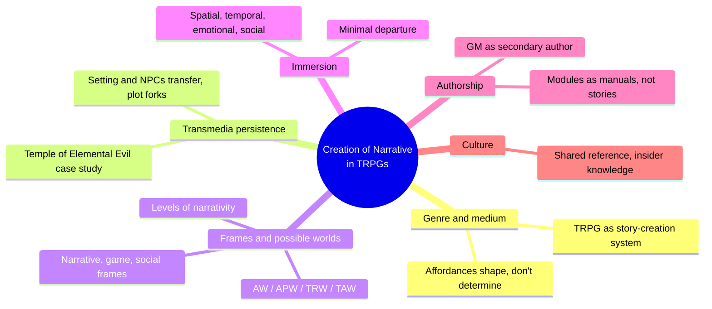
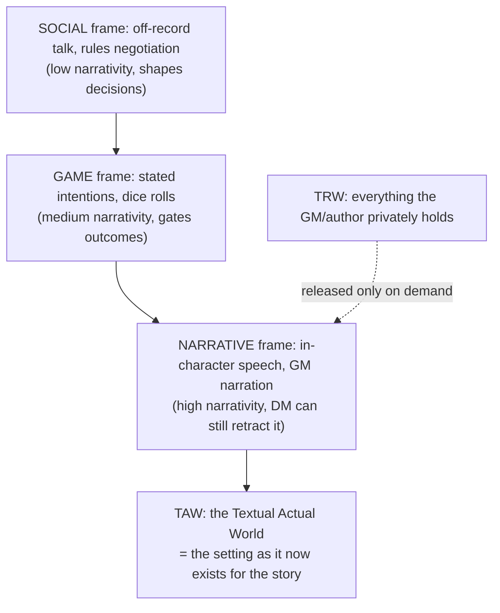
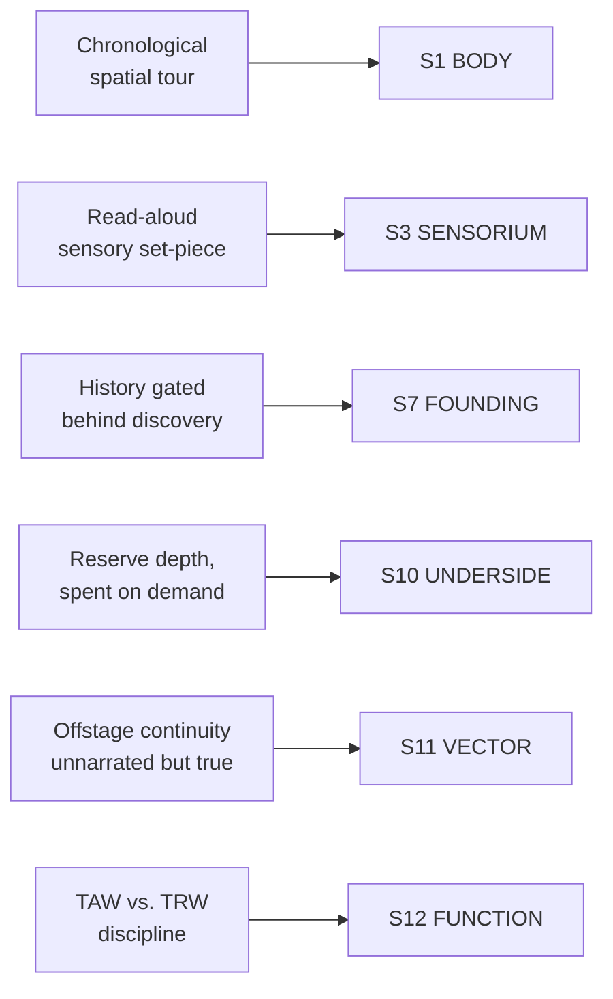

# BVX.0538 — The Creation of Narrative in Tabletop Role-Playing Games — Jennifer Grouling Cover (2010)
### Knowledge Entry — Distill

A rhetoric-and-narrative-theory study of Dungeons & Dragons play, built from transcripts, surveys, and a multi-media case study; its real payload for a setting builder is the machinery of *how a world becomes real at the table* — what gets told, what stays reserved, and what survives when the same world crosses formats.

## TABLE OF CONTENTS
- [Core Thesis](#1-core-thesis)
- [Mind Models](#2-mind-models)
- [Framework](#3-framework--structure)
- [Key Concepts](#4-key-concepts)
- [Heuristics](#5-heuristics--decision-rules)
- [Invariants](#6-invariants)
- [Pitfalls](#7-pitfalls--myths)
- [Application](#8-application)
- [Cross-References](#9-cross-references)
- [Provenance](#10-provenance--confidence)

---

## 1 · CORE THESIS

A game-world is only as real as what has actually been told: the GM (or writer) privately holds a whole world, but the story's truth is the narrated slice of it, built moment to moment and gated by audience attention. Setting and key figures are what survive when a story crosses formats; plot does not.

---

## 2 · MIND MODELS

*Required. Minimum two diagrams, maximum five.*

**Diagram 1 — the whole argument.**
Caption: *six chapters sort into three working questions — is it a game or a narrative, how does its world get told, and what does telling it do to an audience.*

**Diagram 2 — the central mechanism (a process, run every gaming session).**
Caption: *three registers of talk, ranked by how much of the world they actually build — only the top register writes the TAW, everything else is scaffolding around it.*

**Diagram 3 — mapped onto the Command's SETTING SLICE.**
Caption: *the book supplies mechanics, not new layers — how S1/S3 get told, how S7/S10/S11 get gated and spent, and the writing-desk discipline behind S12.*

---

## 3 · FRAMEWORK / STRUCTURE

Nine chapters, each answering one question about how a TRPG's world becomes a story:

| Chapter | Governing question | Payload for a setting builder |
|---|---|---|
| Intro: Defining the TRPG | What is a TRPG, structurally? | GM "develops a setting where the game takes place" before anything else happens |
| 1. Early Models | What earlier interactive forms shape it? | War-gaming (terrain, counters) and fantasy fiction (Tolkien) are the two parent traditions of a game-world |
| 2. RPG Genres | How do TRPGs differ from other RPG forms? | (sampled; genre boundary-drawing, thin on setting method) |
| 3. A Transmedia Tale | What survives when one story crosses media? | Setting and key NPCs persist across module, novel, CRPG; plot does not — the case study for the whole distill |
| 4. Reconciliation of Narrative and Game | Is a world-with-no-story-yet still meaningful? | Campaign settings are built as *spaces for stories*, not as stories; excess, offstage continuity, on-demand depth |
| 5. Frames of Narrativity | How does talk at the table build the world? | Three frames (social/game/narrative), possible-worlds terms (AW/APW/TRW/TAW), the levels-of-narrativity ladder |
| 6. Immersion | What makes a told world feel present? | Spatial, temporal, emotional, social immersion; the principle of minimal departure |
| 7. Levels of Authorship | Who actually writes the world? | GM as secondary author; modules as manuals raided in pieces, not scripts run whole |
| 8–9. Culture / Conclusions | What does knowing this world signal? | (sampled; social capital of shared setting knowledge) |

---

## 4 · KEY CONCEPTS

| Concept | What it is | Why it matters |
|---|---|---|
| **TAW — Textual Actual World** | The slice of the world that has actually been narrated aloud or in print | This, not the author's private notes, is the story's operative truth — the only part an audience can act on |
| **TRW — Text Reference World** | The total world the GM or author holds as "real," including everything never told | The reservoir TAW is drawn from; keeping the two distinct is what lets a GM improvise without contradicting themselves |
| **The frame ladder (social / game / narrative)** | Three registers of table talk, ranked by how much they build the TAW | Only narrative-frame speech writes the world; game-frame talk gates it (dice), social-frame talk shapes it from outside |
| **Principle of minimal departure** | An audience assumes an invented world matches the actual world except where explicitly told otherwise | You only need to write the departures — an entangled orc still needs no explanation for why orcs normally walk |
| **Transmedia setting persistence** | Across module, novel, and CRPG versions of the same story, the town, the dungeon, and the deities stayed constant while plot, motive, and viewpoint varied freely | Setting and key figures are the identity anchor of a world across adaptation; plot is the least portable element |
| **The excess-information module** | Published adventures detail locations, NPCs, and treasure many groups will never reach (33 locations in one village) | Presence, not use, is what makes a place feel whole — unused detail is not wasted, it's what makes the used parts credible |
| **Campaign setting vs. module** | A campaign setting (Ptolus, Sorpraedor) is built as a reusable space for many stories; a module is closer to an instruction manual, raided for one piece at a time | Confusing the two produces either an over-scripted world or an unusable travel brochure |
| **Just-in-time depth (the iceberg, spent)** | A GM builds a location's real detail only once players show interest in it — the twin rulers of Lugyere had no fleshed motives until the party chose to visit | Depth is a budget spent on demand, not front-loaded across the whole map before anyone asks |
| **Offstage continuity** | Factions and plots keep moving whether or not anyone narrates them (the Blood Fist tribe wins its war unseen) | A world that can progress without the audience watching reads as inhabited; one that freezes off-screen reads as a stage set |
| **Read-aloud passage as its own beat** | Modules set aside dense, multi-sense description, deliberately breaking from action to deliver it | Description is written and delivered as a narrative event in its own right, not filler between encounters |
| **Four modes of immersion** | Spatial (response to place), temporal (response to plot/suspense), emotional (response to character), and social (response to the group itself) | A world can be richly described and still fail to feel present if the other three channels are silent |
| **Levels of narrativity** | Not every utterance at the table builds the world equally; narrativity is a gradient, not a binary | Useful diagnostic for any collaborative or serialized telling: rank what you're producing by how much of it actually becomes canon |

---

## 5 · HEURISTICS & DECISION RULES

| Situation | Do this | Not this |
|---|---|---|
| Introducing a location | Write one dense, sensory-loaded passage, sequenced as a spatial walk-through, delivered as its own beat | Scatter facts about the place across dialogue or bury them in a stat block |
| Deciding how much of the world to build in advance | Sketch the whole map thinly, then build any region in depth only once the story or reader actually goes there | Fully detail every region before anyone has reason to visit it |
| Adapting a setting across formats | Keep the landmarks, factions, and key figures fixed; let plot, viewpoint, and motive vary freely per medium | Try to force an identical plot to survive the move between formats |
| Revealing history or backstory | Gate it behind a discovery action — the right question to the right NPC, the right search | Deliver it as an opening infodump before anyone has a reason to want it |
| Keeping a world believable off-screen | Let factions and plots keep moving when the audience isn't watching, and let that continuity surface later | Freeze every faction the moment the "camera" leaves the scene |
| Writing a description passage | Sequence it as a chronological or spatial tour — approach, threshold, interior | List attributes of the place with no order or point of view |
| Deciding what to explain about an invented rule or world-fact | Explain only what departs from the audience's default assumptions | Re-explain the parts of the world that already behave the way reality does |
| Judging whether an idea is "in the world yet" | Treat it as real only once it's been actually said or written (TAW), even if you privately decided it already | Assume a fact is established just because you, the author, have settled it in your head (TRW) |

---

## 6 · INVARIANTS

1. **A world's story-truth is what has actually been told, not what the author privately holds.** TRW exceeds TAW by design; only TAW is operative for the audience.
2. **Setting and key figures are the most transmedia-portable narrative elements; plot and viewpoint are the least.** What a world "is" survives adaptation far better than what happens in it.
3. **Description sequenced as a spatial or temporal path reads as narrative order, even with zero causal links between its facts.**
4. **An audience interprets an invented world by the principle of minimal departure** — assuming it matches base reality except where explicitly told otherwise.
5. **A setting stays load-bearing only if it can be shown to proceed without the audience's attention.** Offstage continuity is what separates a world from a stage set.
6. **Immersion runs on four independent channels — space, time, emotion, and the social bond of the telling itself.** A world can fail to feel present even when richly described, if the other three are silent.
7. **Detail is a budget best spent on demand.** A place earns its depth when someone shows interest in it, not on a front-loaded schedule.

---

## 7 · PITFALLS / MYTHS

- Confusing the author's or GM's private world-bible (TRW) with what the audience has actually experienced (TAW) — completeness of notes is not the same as presence in the story.
- Treating a campaign setting as a container built for one specific plot, rather than a reusable space designed to generate many.
- Front-loading backstory instead of gating it behind a discovery action, so history is recited rather than earned.
- Assuming a description technique that works in a visual medium (cut-scenes, minis on a battle map) will translate directly to prose or oral telling without adaptation — each medium affords different tools for the same spatial immersion.
- Letting a faction or subplot evaporate the instant the point of view leaves it, instead of letting it keep moving offstage.
- Over-explaining: restating world-facts the audience would already assume by minimal departure, which clutters a set-piece instead of sharpening it.
- Assuming story is what players or readers remember most — survey evidence here shows setting and single emotional beats (a lost character, a temple's four-element floor plan) often outlast the plot in memory.

---

## 8 · APPLICATION

- **Spine level:** TEXTURE and SETTING (non-story-spine source; keys to entity/technique beside the L0–L7 spine)
- **12-layer character stack:** none directly — the TAW/TRW discipline is a general writing-desk habit rather than a character-layer feed; noted contextually against S12 FUNCTION above because it is the same "only what's on the page is canon" logic a storyform record needs
- **plot_systems:** contextual candidate — the levels-of-narrativity ladder (Diagram 2) is a ready-made checklist for any collaborative or serialized world: rank a scene's contributions by how much of it actually became canon before trusting it as established
- **Setting:** primary — six of twelve SETTING SLICE layers get concrete technique rather than new taxonomy: S1 BODY (the chronological tour), S3 SENSORIUM (the read-aloud set-piece as its own beat), S7 FOUNDING (history gated behind discovery), S10 UNDERSIDE (reserve depth spent just-in-time), S11 VECTOR (offstage continuity as proof of load), and S12 FUNCTION (the TAW/TRW discipline)

Read against the DCUS starter instance and the Kobold Guide distill (BVX.0458) already anchoring the SETTING SLICE, this book supplies the missing *mechanics* layer under Kobold's rules. Kobold says history should only be included if it "bites now"; this book supplies the actual mechanic for how that bite gets delivered — gated behind a discovery action, not narrated up front. Kobold treats a setting as a stack of dynamite; this book explains why the stack only detonates once, at the table: only what gets said becomes true for the story, and everything else stays inert reserve until a reader or player reaches for it. For a science-fiction setting system built to run across formats (novel, sourcebook, game), the transmedia-persistence finding is the most directly load-bearing idea in the book: lock the landmarks and the key figures first, because those are what will survive every future adaptation; leave plot loose, because it is what should.

---

## 9 · CROSS-REFERENCES

| Related entry | Relation |
|---|---|
| [[BVX.0458]] | Kobold Guide to Worldbuilding — SETTING-shelf sibling; that entry supplies the rules (present-tense history, terrain-first order), this one supplies the delivery mechanics (gated discovery, TAW/TRW, offstage continuity) behind the same rules |
| [[BVX.0056]] | Buckham, *A Writer's Guide to Active Setting* — undistilled TEXTURE sibling; Buckham's active-setting functions are the deployment-mode taxonomy this book's read-aloud-passage analysis is a worked example of |
| [[BVX.1122]] | GURPS Hot Spots: Renaissance Venice — a concrete SETTING-SLICE instance; this book's module analysis (excess information, raided in pieces) explains why a sourcebook like Venice is structured the way it is |

---

## 10 · PROVENANCE & CONFIDENCE

Full text, ~220pp (pdftotext extraction, clean text layer, machine-readable TOC). Read in full: Preface and Acknowledgments; Introduction ("Defining the Tabletop Role-Playing Game"); Chapter 3 ("A Transmedia Tale — The Temple of Elemental Evil," full, the transmedia case study); Chapter 4 ("The Reconciliation of Narrative and Game," full, including "Campaign Settings in D&D" and "Manuals for Stories"); Chapter 5 ("Frames of Narrativity in the TRPG," full, the possible-worlds and frame-ladder chapter); Chapter 6 ("Immersion in the TRPG," full, the four-modes-of-immersion chapter). Sampled (opening pages / TOC-adjacent, not deep-extracted): Chapter 1 ("Early Models of Interactive Narrative"), Chapter 2 ("Role-Playing Game Genres"), Chapter 7 ("Levels of Authorship"), Chapter 8 ("The Culture of TRPG Fans"), Chapter 9 (conclusions), the appendix ("The Orc Adventure at Blaze Arrow," referenced throughout the read chapters as primary transcript data rather than read as a standalone unit).

The S-layer keying in frontmatter `feeds:` and Diagram 3 is this distill's synthesis against `ssot_03_setting_system.md` (PART A, the twelve-layer SETTING SLICE), reading this book as a mechanics layer under BVX.0458's rules rather than as an independent taxonomy — it names no new S-layers and contradicts none of Kobold's. The `spine: [TEXTURE, SETTING]` and empty character-stack application follow the same v4 binding rule Kobold's entry uses: setting and telling-technique sources sit beside the L0–L7 spine, not on it.

## META
- Template: BVX-LEARN-v4.0
- Source classification: full-text academic monograph, deep extraction on 5 of 9 chapters plus intro, sampled on 4
- Created / Updated: 2026-09-29
