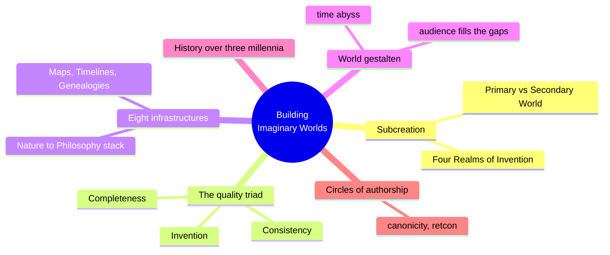
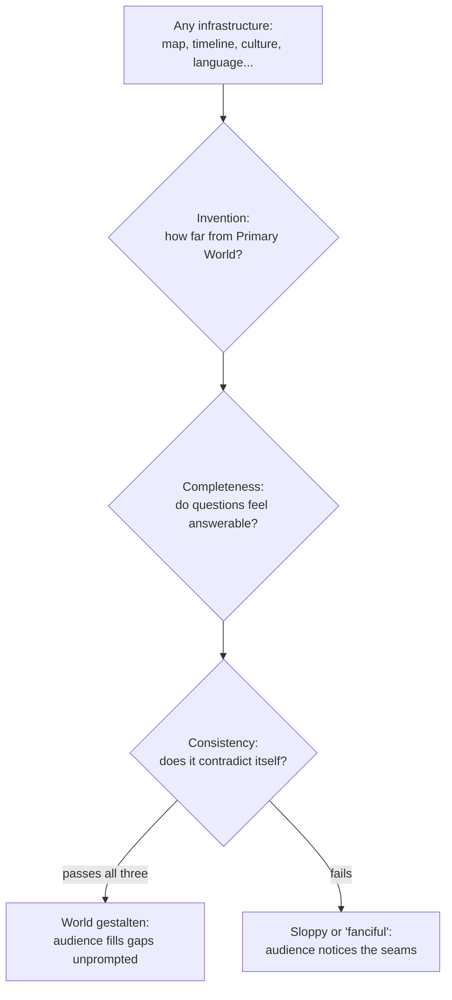
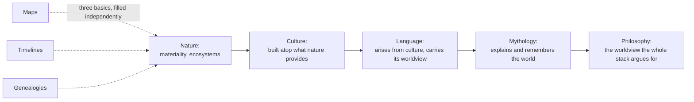
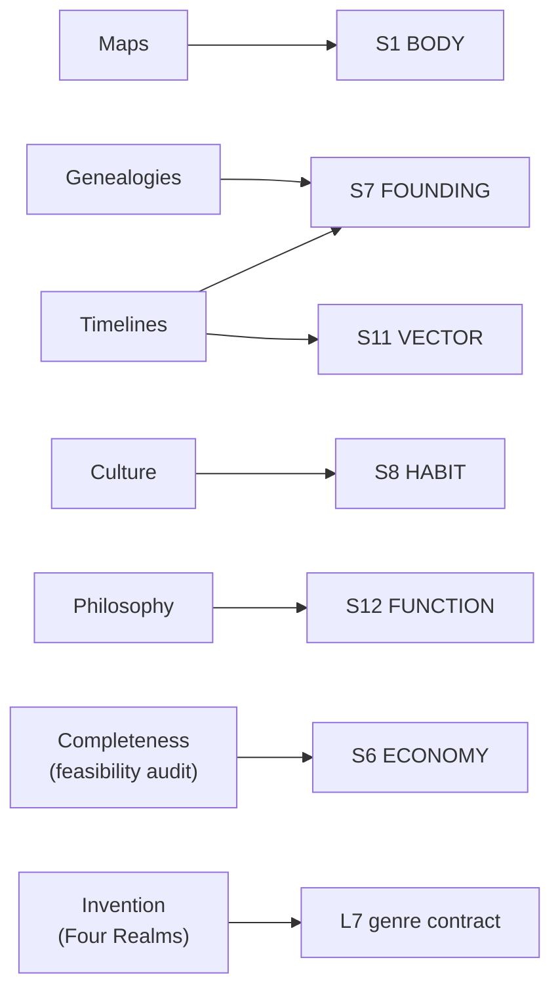

# BVX.0562 · Building Imaginary Worlds: The Theory and History of Subcreation · Mark J. P. Wolf (2012)
### Knowledge Entry: Distill

A media-studies theory of world-building as its own object of study, independent of any one story told in a world; the audit method (invention, completeness, consistency) and the eight-infrastructure stack in Chapter 3 are directly usable as a setting-build checklist, TTRPG or otherwise.

## TABLE OF CONTENTS
- [Core Thesis](#1-core-thesis)
- [Mind Models](#2-mind-models)
- [Framework](#3-framework--structure)
- [Key Concepts](#4-key-concepts)
- [Heuristics](#5-heuristics--decision-rules)
- [Invariants](#6-invariants)
- [Pitfalls](#7-pitfalls--myths)
- [Application](#8-application)
- [Cross-References](#9-cross-references)
- [Provenance](#10-provenance--confidence)

---

## 1 · CORE THESIS

A world is not a story's backdrop but a separate object built from infrastructures — maps, timelines, genealogies, then nature, culture, language, mythology, philosophy, each built atop the last. A world convinces to the degree it balances invention (how much it departs from the Primary World) against completeness and consistency (whether an audience's questions about it feel answerable and non-contradictory).

---

## 2 · MIND MODELS

*Required. Minimum two diagrams, maximum five.*

**Diagram 1 — the whole argument.**
Caption: *world-building splits into a quality triad (how believable) and an infrastructure stack (what to build), and both serve the same payoff — the audience filling in gaps on its own.*

**Diagram 2 — the central mechanism (the audit run against every infrastructure).**
Caption: *the same three-part check runs on every infrastructure in turn; passing it produces world gestalten — an audience that fills gaps on its own instead of noticing them.*

**Diagram 3 — the infrastructure build order (a dependency chain, not a menu).**
Caption: *the five deeper infrastructures are not independent categories — each is built on top of the one before it, so philosophy without nature-culture-language beneath it reads as a slogan, not a world.*

**Diagram 4 — mapped onto the Command's SETTING SLICE (S1–S12).**
Caption: *the book's eight infrastructures land cleanly on five S-layers plus a genre-contract mechanism at L7 — thin exactly where BVX.0458 is thick (economy, allure, underside), a genuine complement rather than a duplicate.*

---

## 3 · FRAMEWORK / STRUCTURE

Wolf's argument runs in two movements. Chapter 1 sets the theory: what a "secondary world" is (a place experientially distinct from the Primary World, bounded and hard to reach), how deeply invention can run through it (Four Realms: nominal, cultural, natural, ontological), and the three-part quality check — invention, completeness, consistency — that determines whether a world holds together. Chapter 2 gives the three-thousand-year history (Homer to Avatar). Chapter 3, the one this entry is keyed to, gives the actual toolkit: eight world infrastructures, three foundational (maps, timelines, genealogies) and five layered (nature, culture, language, mythology, philosophy), each depending on the one before it. Chapters 4 through 7 extend the argument to narrative fabric, self-reflexive subcreation, transmedial growth, and circles of authorship — useful, but outside this distill's focus.

The book's own summary of the five-layer stack: "nature... is not only the flora and fauna of a world, but also all of its materiality... Culture is built atop nature... Language arises from culture and contains a culture's worldview embedded within it... Mythology emerges from a combination of the previous layers... philosophy is the set of worldviews arising from the world itself."

---

## 4 · KEY CONCEPTS

| Concept | What it is | Why it matters |
|---|---|---|
| **Secondary World** | A fictional place experientially distinct from the Primary World, with a real border and difficulty of access (island, mountain valley, other planet) | A place is not automatically a world; "world" means everything a character experiences, not just geography — the bar for calling something a setting |
| **Four Realms of Invention** | Nominal (new names), cultural (new objects/institutions/customs), natural (new species/ecosystems/planets), ontological (new physics, space, time) | A depth-dial: the first two realms are easy to reshape, the last two are hardest and most rarely attempted; most invention should live in the cultural/natural middle where Secondary Belief is easiest to sustain |
| **Completeness (the illusion of)** | Not true completeness — true completeness is impossible — but enough detail that an audience's questions feel answerable, even if unanswered | Directly answers the kitchen-sink trap: completeness is a *feeling of answerability*, not a requirement to actually answer everything |
| **Consistency** | The degree to which world details are plausible and non-contradictory, especially where they matter to the story vs. sit in the background | Inconsistencies in a main storyline damage credibility fast; the same inconsistency buried in world infrastructure or background detail barely registers |
| **World Gestalten** | Borrowed from Gestalt psychology: an audience automatically fills in a world's missing pieces from the details it's given, the same way perception completes a shape from partial cues | The actual payoff of good invention/completeness/consistency — a world that makes its own audience do free worldbuilding labor |
| **Time Abyss** (John Clute) | A moment of perceived scale: the reader senses an immense gap between the story's present and the true age of what changed it, without being told the history | The cheapest way to manufacture apparent deep-founding: imply the abyss, do not narrate it |
| **The Eight Infrastructures** | Three foundational (maps = space, timelines = time, genealogies = character-context) plus five layered (nature → culture → language → mythology → philosophy) | The chapter's literal toolkit: name the infrastructure you're missing and go build that one, instead of "worldbuilding" as an undifferentiated activity |
| **Tying Infrastructures Together** | Each infrastructure must be internally consistent AND consistent with every other infrastructure it touches (a map must match its own climate logic; a language must match its own culture) | Consistency is not per-layer, it's cross-layer — the actual failure mode of most amateur settings is layers that don't argue with each other |
| **Retcon / Canonicity** | Revising earlier material to agree with later material (Tolkien revising The Hobbit for The Lord of the Rings); a formal apparatus (Star Wars's 30,000-entry continuity database) for managing it at scale | Consistency is not a one-time achievement, it's ongoing maintenance the moment a world outlives a single work |
| **Cook's Tour problem** | A map that shows only the places the story visits, nothing beyond — lazy mapmaking that reveals the author only built what the plot needed | The corrective heuristic: a map (or any infrastructure) should suggest territory beyond the story's reach, since unused detail is what invites audience speculation |

---

## 5 · HEURISTICS & DECISION RULES

| Situation | Do this | Not this |
|---|---|---|
| Deciding how much to invent | Concentrate invention in the cultural and natural realms | Push invention into the ontological realm (new physics) unless the whole work is built to explore it |
| Drawing a map | Draw a nation-first order: countries/culture, then coastline, mountains, rivers, climate, cities, roads | Sketch only the route the plot travels and stop there (the Cook's Tour) |
| Filling in a culture's economy or food supply | Give it just enough logic that an audience's questions feel answerable, like Dune's spice | Leave a visible gap the audience actively notices, like Tatooine's uncertain food supply |
| Implying deep history | Use ruins, silent wear, and gaps (the time abyss) | Front-load exposition explaining the whole history before it's needed |
| Building a culture's belonging system | Coin one untranslatable custom-word that carries the whole concept (tanrydoon) | Explain the custom in a paragraph of narration |
| Placing an inconsistency | Accept it if it sits in background/world-mechanics detail nobody will cross-reference | Let it sit in the main storyline, where it breaks the reader's mental model |
| Embedding a worldview | Let geography, culture, and causality itself carry the argument | State the theme directly through a character's mouth |
| Growing a world past one work | Build (or delegate) a continuity record before contradictions accumulate | Wait until the fanbase is already arguing about canon to start one |

---

## 6 · INVARIANTS

1. **A place is not a world until it is experiential.** Geography alone does not qualify; a world is everything a character (and by extension, an audience) experiences within it.
2. **Invention scales inversely with ease of world-maintenance.** Nominal and cultural changes are easy to sustain; natural and especially ontological changes multiply the consistency burden on everything built afterward.
3. **True completeness is impossible; only the illusion of it is achievable, and that illusion is the actual design target.**
4. **Consistency's damage is proportional to narrative proximity.** The same contradiction is fatal in a main storyline and invisible in background world-mechanics.
5. **The five layered infrastructures are ordered, not parallel.** Culture depends on nature, language on culture, mythology on the combination, philosophy on all of it; skipping a layer under-supports the ones above it.
6. **Unused detail is not waste — it is what makes a world feel larger than its story.** Deliberately mapped, named, or historied elements the plot never visits do the speculation-generating work exposition cannot.
7. **A world that outlives one telling requires an explicit consistency-maintenance mechanism**, whether a per-author revision habit (Tolkien) or a formal database (Star Wars).

---

## 7 · PITFALLS / MYTHS

- Treating "worldbuilding" as one undifferentiated activity instead of eight distinguishable infrastructures with different failure modes.
- Confusing completeness with actually answering every question — the goal is a feeling of answerability, not an encyclopedia.
- Drawing a map that covers only what the plot visits (the Cook's Tour), signaling there is nothing else to the world.
- Inventing at the ontological level (new physics) as a first move, when it multiplies the consistency burden on every layer built afterward and is rarely sustained past a premise.
- Writing culture, language, or mythology as decoration layered on top of an unconsidered nature layer, producing a world where nothing "grows out of" anything else.
- Assuming inconsistency is always fatal — it is fatal in the main storyline and largely forgivable in background/world-mechanics detail.
- Letting a growing world drift into contradiction with no maintenance mechanism until a fanbase is already fighting about canon.

---

## 8 · APPLICATION

- **Spine level:** SETTING (non-story-spine source; per the v4 binding rule, setting is a Domain embodied, never an L0–L7 level)
- **12-layer character stack:** none directly, though S7 FOUNDING and S8 HABIT (both fed here) mirror L7 ORIGIN and L8 IMPRINT closely enough that a Genealogies pass on a place doubles as backstory material for any character rooted there
- **plot_systems:** contextual candidate once `04_PLOT_SYSTEMS/` opens — the time abyss and the Cook's Tour heuristic are both ready-made scene-hook generators: an implied gap in the record, or a mapped-but-unvisited location, is a pre-built plot hook waiting on a reason
- **Setting:** primary — this distill's true contribution is the audit method (invention/completeness/consistency) that runs across every S-layer, plus concrete primary feeds to S1 BODY, S7 FOUNDING, S8 HABIT, S12 FUNCTION, and supporting feeds to S11 VECTOR and S6 ECONOMY

Tested against BVX.0458 (Kobold Guide to Worldbuilding), the sibling founding SETTING distill: that book is the craft-toolkit half (how a GM fills S1–S11 fast, essay by essay), while this one is the theory half (why the fill has to be ordered, what "enough" detail even means, and how to know when a world has failed its own audience). Where Kobold's "dynamite" thesis says design toward conflict, Wolf's completeness/consistency pair supplies the actual acceptance test for whether a filled S-layer will hold: does it survive an audience asking questions of it (Tatooine's food supply is the book's own worked failure case). The S12 FUNCTION feed is the strongest single finding here — Wolf's Philosophy chapter independently arrives at the same binding rule the Command's SSOT states directly: a place's structures carry the story's argument without a word of exposition. For DCUS specifically, the nation-first mapmaking order (culture before coastline) reframes the already-ruled S5 SCAR rename lattice (Skeeter Creek → Red Hills → DCUS) as a *timeline* problem before it is a map problem: the Command has erasure events but no worked timeline infrastructure showing how the campus's founding stack (S7) produces its current geography (S1), which is exactly the dependency order this chapter insists on.

---

## 9 · CROSS-REFERENCES

| Related entry | Relation |
|---|---|
| [[BVX.0458]] | Kobold Guide to Worldbuilding — theory/craft sibling pair: this entry supplies the audit method and infrastructure taxonomy, BVX.0458 supplies the per-layer fill technique; read together, not redundantly |
| [[BVX.0349]] | Against Worldbuilding (Kennedy) — counter-argument sibling; Kennedy's kitchen-sink critique is partly pre-answered by this book's own "illusion of completeness" (D1: true completeness was never the goal), though Kennedy would likely say the illusion still costs too much author-time to fake |
| [[BVX.1122]] | GURPS Hot Spots: Renaissance Venice — worked instance; a natural test case for the eight-infrastructure checklist against a professional gazetteer that (per BVX.1122's own provenance note) is strong on body/law/economy/founding and thin on exactly the layers this book calls out as hardest to fake (language, mythology, philosophy) |
| [[BVX.0193]] | Truby, The Anatomy of Story — story-spine sibling; Truby's story-world chapter is the character-craft mirror of this book's terrain-first, infrastructure-ordered method |

---

## 10 · PROVENANCE & CONFIDENCE

Full text, pdftotext extraction (~1,165 KB, 28,712 lines), clean text layer with a machine-readable table of contents. Read in full: the front matter and Table of Contents; Chapter 1's "Degrees of Subcreation" (sampled for the Four Realms of Invention) and its "Invention," "Completeness," and "Consistency" subsections in full; the "World Gestalten: Ellipsis, Logic, and Extrapolation" section in full; and the whole of Chapter 3 ("World Structures and Systems of Relationships") — "Secondary World Infrastructures" (overview), "Maps," "Timelines," "Genealogies," and "Nature" in full; "Culture" and "Language" through their core argument and worked examples (Islandia, invented-language mechanics); "Mythology" through the Dunsany/Lovecraft/Tolkien throughline; "Philosophy" in full; and "Tying Different Infrastructures Together" in full. Not read: Chapter 2 (history), Chapters 4–7 (narrative fabric, self-reflexive subcreation, transmedial growth, circles of authorship), the Appendix timeline, and the Glossary — all outside this distill's SETTING-shelf focus and the brief's Chapter 3 keying.

The S-layer keying in `feeds:` and Diagram 4 is this distill's synthesis against `ssot_03_setting_system.md` (PART A, the twelve-layer SETTING SLICE); no S-layer terminology exists in the source itself. `spine: [SETTING]` follows the v4 template's binding rule and matches the Zotero record's own pre-existing `spine: SETTING` tag.

## META
- Template: BVX-LEARN-v4.0
- Source classification: full-text book, deep extraction on Ch. 1's I/C/C sections and all of Ch. 3, sampled on Ch. 1's framing sections, Ch. 2 and Ch. 4–7 not read (outside focus)
- Created / Updated: 2026-09-29
