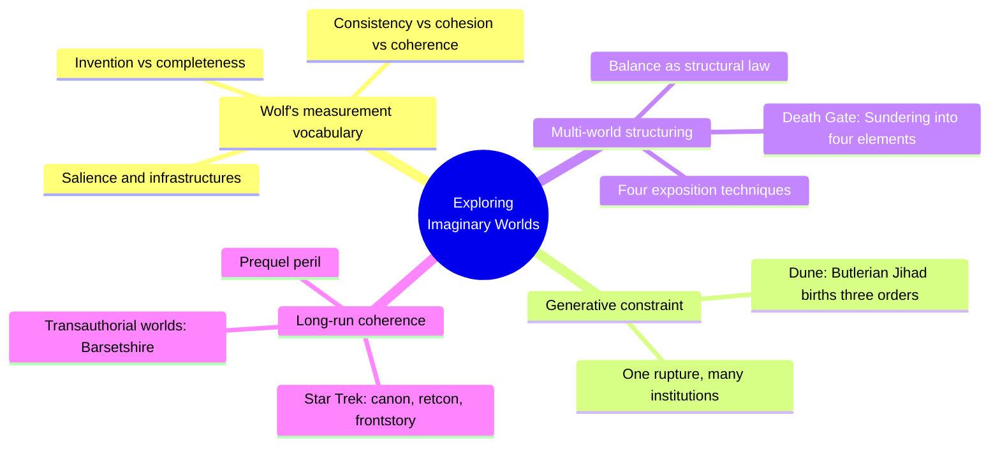
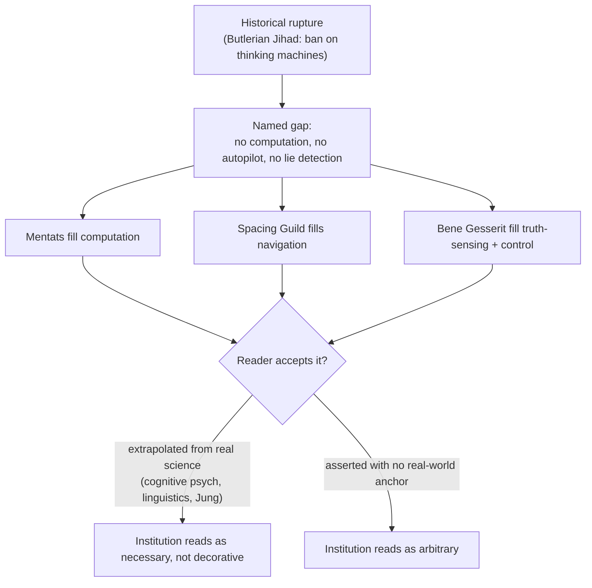
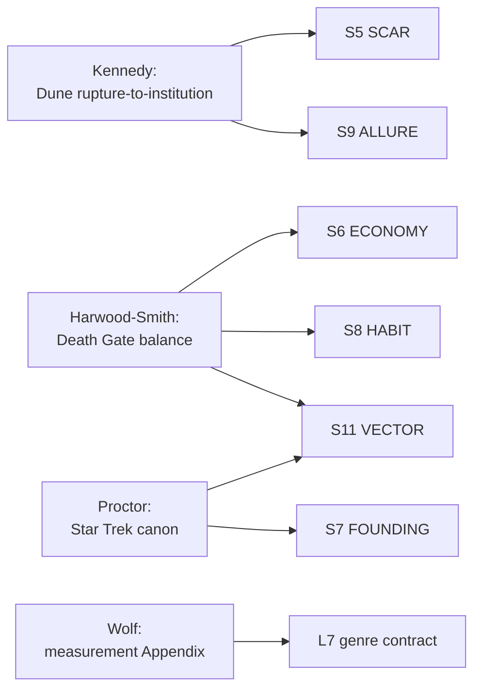

# BVX.0575 — Exploring Imaginary Worlds: Essays on Media, Structure, and Subcreation — ed. Mark J. P. Wolf (2021)
### Knowledge Entry — Distill

Twelve Subcreation Studies scholars each analyze one built world (Dune, Star Trek, Death Gate, Vorkosigan, Gormenghast, and others) as a case study; unlike the Kobold Guide's build-order craft manual, this collection reverse-engineers *how the finished thing holds together*, and its sharpest tools are for exposition management and long-term coherence.

## TABLE OF CONTENTS
- [Core Thesis](#1-core-thesis)
- [Mind Models](#2-mind-models)
- [Framework](#3-framework--structure)
- [Key Concepts](#4-key-concepts)
- [Heuristics](#5-heuristics--decision-rules)
- [Invariants](#6-invariants)
- [Pitfalls](#7-pitfalls--myths)
- [Application](#8-application)
- [Cross-References](#9-cross-references)
- [Provenance](#10-provenance--confidence)

---

## 1 · CORE THESIS

A world is not judged by how much data it contains but by how well that data holds together: invention, completeness, consistency, cohesion, and coherence — Wolf's own five-term vocabulary — are separable qualities, and a setting can excel at one while failing another entirely.

---

## 2 · MIND MODELS

*Required. Minimum two diagrams, maximum five.*

**Diagram 1 — the whole argument.**
Caption: *twelve case studies cluster into three transferable toolkits — generative constraint, multi-world structuring, and long-term coherence management — the book's real spine, not its table of contents.*

**Diagram 2 — the central mechanism (a generative process, run on Dune but transferable to any setting).**
Caption: *the plausibility of an invented institution comes from naming the gap it fills, not from describing the institution itself — describe the wound before the scar tissue.*

**Diagram 3 — mapped onto the Command's SETTING SLICE (S1–S12).**
Caption: *this book's strongest feeds cluster on S5/S7/S9/S11 — the causal and temporal layers — leaving S1–S3 (body, weather, sensorium) almost untouched; it is the coherence-over-time complement to BVX.0458's geography-first method.*

---

## 3 · FRAMEWORK / STRUCTURE

Fifteen essays in three sections (Worlds of Words, Worlds across Media, Transmedia Worlds), plus Wolf's introduction and closing Appendix. No single method binds them; each essay is a case study of one world, examined for how its medium shapes what world-building can do. The load-bearing essays for a SETTING system are the outliers that generalize past their one example:

| Essay | Author | What it generalizes |
|---|---|---|
| Introduction | Wolf | Media incarnation determines what a world can show vs. withhold |
| The Softer Side of Dune | Kennedy | Rupture → named gap → institution is a repeatable generative move |
| Earth, Air, Fire, and Water | Harwood-Smith | Balance as a structural law; four exposition techniques (text, footnote, appendix, map) |
| The Fault in Our Star Trek | Proctor | Canon, retcon, and prequel risk as tools for managing a setting that outlives its first draft |
| Appendix: On Measuring and Comparing Imaginary Worlds | Wolf | Invention / completeness / consistency / cohesion / coherence as five separable, auditable qualities |

The remaining essays (Barsetshire, Vorkosigan, Gormenghast, Dark Shadows, King's Quest, Twin Peaks, Niels Klim, Dostoevsky, Our Town) are worked single-world examples; several corroborate the same mechanisms from a different angle (Barsetshire as transauthorial canon management, Vorkosigan as a series that keeps adding to an established world without breaking it) but were not deep-extracted for this distill.

---

## 4 · KEY CONCEPTS

| Concept | What it is | Why it matters |
|---|---|---|
| **Invention vs. completeness** | Invention = how far a world departs from Primary World defaults. Completeness = how fully imagined it is, independent of how much it departs | A setting can be highly invented but thin (a wild premise, barely worked out) or barely invented but exhaustively complete (Barsetshire); the two axes are not the same question |
| **Cohesion vs. coherence** | Cohesion = how well world data sticks together stylistically. Coherence = whether the parts form a sense-making whole that consistency can even be judged against | Coherence must exist before consistency is a meaningful question at all — a world with aesthetic cohesion but no coherence (Wolf's example: the Codex Seraphinianus) cannot be called "consistent" or "inconsistent", the concept doesn't apply |
| **Salience** | A location, event, or element counted only if narrative action actually happens there — not by raw size or map presence | Lets a single small town (Twin Peaks, Barsetshire) out-detail an entire unvisited planet; scope should follow where story happens, not geographic ambition |
| **Rupture-to-institution generation** | A named historical break (war, ban, catastrophe) creates a gap; every new institution in the setting is justified as filling that specific gap | Turns "here are three cool orders" into "here is one wound and three kinds of scar tissue" — institutions read as necessary instead of decorative |
| **Appendix-vs-narrative exposition split** | Load-bearing worldbuilding facts go in footnotes/appendices (encyclopedic, dry, consulted after or alongside the action); characterization and stakes stay in the scene | Prevents the infodump: technical detail (how rune magic works, what the Butlerian Jihad was) sits outside the narrative's pacing, available to the curious without stalling the plot |
| **Balance as structural law** | In Death Gate, every act of division (the Sundering) generates an equal and opposite corrective (the Wave); the setting's magic system and its plot mechanics are the same rule | A multi-world or multi-faction setting can use an explicit conservation law (division always answers itself) as the reason the pieces stay related instead of drifting into unrelated silos |
| **Canon / retcon / fanon** | Canon = what an IP holder declares official. Retcon = deliberately rewriting established history so future stories reflect the new version, old version voided. Fanon = audience-constructed, non-authoritative | A working vocabulary for what a setting's stewards are allowed to change, and what changing it costs in trust — directly useful once a setting has an audience or a co-author |
| **Frontstory** | In a prequel, the "future" the audience already knows is fixed; every new event must resolve into it without contradiction | The mirror image of backstory: a prequel's real constraint isn't inventing history, it's inventing history that lands exactly where the already-published present begins |
| **Textual conservationism** | Fans (or, in a solo project, a future version of the author) who track and police continuity as a form of expertise and investment | Treat your own setting's memory as a real audience from day one — the discipline of "does this break what I already established" pays off whether or not anyone else is watching |
| **Hard/soft science blend** | A setting need not commit to one register; Dune blends hard ecology with soft psychology/anthropology and succeeds because of the mix, not despite it | Permission to build a science-fiction setting on social sciences (institutions, belief, training, culture) as the load-bearing material, with hard science as backdrop rather than the whole engine |

---

## 5 · HEURISTICS & DECISION RULES

| Situation | Do this | Not this |
|---|---|---|
| Inventing a new institution, order, or faction | Name the specific historical gap it fills first, then design the institution to fill exactly that gap | Design a cool organization and bolt on a justification afterward |
| Explaining how magic/tech/a system works | Put the technical mechanism in an appendix-style aside the reader can skip | Stop the scene to explain the rules in-line (the infodump) |
| Building more than one linked world or region | Give the split an explicit rule for what keeps the pieces related (a conservation law, a shared resource, a shared origin) | Let each world/region be self-contained with no structural reason they belong in one setting |
| Extending an established setting with a prequel | Treat the already-published "future" as a fixed constraint and write backward into it | Introduce elements that would require the audience's memory of later material to be wrong |
| Revising an established fact after the fact | Call it what it is (a retcon) and decide if the story needs it enough to spend audience trust | Quietly overwrite and hope no one notices the seam |
| Judging whether a setting "works" | Ask separately: is it invented, is it complete, is it cohesive, is it coherent, is it consistent — a weakness in one doesn't sink the others | Collapse all of it into a single vague "does the worldbuilding feel good" verdict |
| Deciding what counts as "the setting" for measurement or scope purposes | Count only what is salient — where story action actually occurs | Count map area, population numbers, or word count as a proxy for how big or rich a setting is |
| Choosing which sciences carry a setting's plausibility | Let social sciences (psychology, anthropology, linguistics, economics) do real structural work, not just flavor | Assume only "hard" sciences (physics, engineering) can make a setting feel serious |

---

## 6 · INVARIANTS

1. **Coherence must exist before consistency can be judged.** A world with no sense-making whole cannot meaningfully be called consistent or inconsistent — the question doesn't apply yet.
2. **A setting's size grows, its inconsistency risk grows with it.** More content and more contributors mechanically increase the odds of contradiction; nothing about growth is self-correcting.
3. **A prequel's future is already fixed.** Whatever is published as "later" constrains whatever gets written as "earlier" — the frontstory is a real structural limit, not a suggestion.
4. **An institution invented with no named cause reads as arbitrary.** Plausibility comes from the gap it fills, not from internal detail alone.
5. **Salience, not size, determines what a setting is "about".** Where the story's action actually happens is the setting, regardless of how much unvisited territory the map implies.
6. **Retconning spends trust.** Changing established history is available, but it is a cost paid against the audience's (or your own future self's) confidence in the record, not a free action.

---

## 7 · PITFALLS / MYTHS

- Mistaking raw world-data volume (number of names, places, entries) for richness — procedurally generated worlds prove volume alone builds nothing.
- Explaining a system's mechanics inside the scene where it matters most, stalling the pacing exactly when tension should be rising (the infodump).
- Inventing a faction or order with no named historical cause, so it reads as set dressing rather than as necessary.
- Treating a multi-world or multi-region setting as several unrelated boxes with no structural reason they cohere into one setting.
- Writing a prequel without treating the already-established "future" as a real constraint, producing contradictions that cost audience trust to fix.
- Silently retconning instead of acknowledging the change, which reads to a careful audience (or a careful future self) as carelessness rather than revision.
- Assuming a setting must be "hard" science-fiction to feel serious; soft-science institutions (training orders, belief systems, social structures) can carry as much structural weight as physics.

---

## 8 · APPLICATION

- **Spine level:** SETTING (non-story-spine source; setting is a Domain embodied, not an L0–L7 rung)
- **12-layer character stack:** none directly — the rupture-to-institution mechanism (Diagram 2) is structurally similar to auditing an L6 DRIVE want against its cost, but this stays a setting-side source
- **plot_systems:** contextual candidate — the balance/conservation-law mechanism (Death Gate) is a ready-made engine for generating plot consequence whenever a setting element is disturbed: division always answers itself
- **Setting:** primary — feeds S5 SCAR, S6 ECONOMY, S7 FOUNDING, S8 HABIT, S9 ALLURE, S11 VECTOR, plus L7 genre-contract contextually

Where BVX.0458 (Kobold Guide) supplies the build order — geography before culture, present-tense history, the post-apocalyptic default — this book supplies the discipline for keeping a setting coherent once it starts accumulating material over years, sessions, or installments. Its most directly stealable TTRPG tool is Kennedy's Dune mechanism: before inventing a faction, guild, or order for DCUS, name the specific gap in the setting it fills, and let that gap do the justifying work instead of flavor text. Its second most useful tool is the appendix/footnote split from Death Gate — keep load-bearing mechanical detail (how a system works) out of in-scene exposition and in a reference the reader can consult on their own time, exactly the same discipline a GM's world bible or campaign wiki already wants. Proctor's canon/retcon/frontstory vocabulary is the sharpest available language for a project like DCUS that already has a rename lattice (Red Stick Creek → Red Hills → DCUS) and will keep accumulating history: treat every established fact as canon until a retcon is named and paid for, and treat any future-published material as a frontstory constraint on what gets written into the past. Wolf's five-term measurement vocabulary (invention, completeness, consistency, cohesion, coherence) is the most useful available diagnostic for a stalled setting: naming which specific quality is missing is more actionable than a vague sense that "the worldbuilding isn't working."

---

## 9 · CROSS-REFERENCES

| Related entry | Relation |
|---|---|
| [[BVX.0458]] | Kobold Guide to Worldbuilding — build-order counterpart; that book is the construction manual (geography → culture → history), this one is the coherence-and-exposition manual for what happens after construction, as the setting accretes over time |
| [[BVX.0349]] | Against Worldbuilding, and Other Provocations — counter-argument sibling; Wolf's completeness/coherence framework is the measured version of the same worry that provocation states as a blanket objection |
| [[BVX.0067]] | Collaborative Worldbuilding for Writers and Gamers — undistilled sibling, same SETTING shelf; likely overlaps with this book's transauthorial-canon concerns (Barsetshire, multiple hands on one world) |
| [[BVX.0193]] | Truby, The Anatomy of Story — story-spine sibling; Truby's story-world chapter is the story-side mirror of this book's setting-side coherence concerns |

---

## 10 · PROVENANCE & CONFIDENCE

Full text, pdftotext extraction, 244pp (~46,000 words per wc), clean text layer with a machine-readable TOC and page-number running heads. Read in full: front matter, Foreword, Acknowledgments, and the Introduction (Wolf, orientation to all fifteen essays and the book's three-section structure); "The Softer Side of Dune" (Kennedy, full); "Earth, Air, Fire, and Water" (Harwood-Smith, full); the Appendix, "On Measuring and Comparing Imaginary Worlds" (Wolf, full). Sampled (opening section, not deep-extracted): "The Fault in Our Star Trek" (Proctor — canon/retcon/frontstory argument fully extracted through its setup section; the Enterprise/Discovery case-study detail past that point sampled only). Not deep-read for this pass, noted from TOC and index only: the essays on Niels Klim, Barsetshire, Dostoevsky's Journeyworld, the Vorkosigan Universe, Our Town, Gormenghast, Dark Shadows, Daventry/King's Quest, and the Twin Peaks essay — several of these (Barsetshire's transauthorial continuity, Vorkosigan's series-expansion method) likely carry additional SETTING-relevant method and are flagged as a return-pass candidate if BOLO 87 wants deeper S7/S11 coverage.

The S-layer keying in frontmatter `feeds:` is this distill's synthesis against `ssot_03_setting_system.md`, reading this book as the coherence-over-time complement to BVX.0458's construction-order method: this collection is conspicuously strong on S5/S7/S9/S11 (causal and temporal layers, because its case-study method is "how did this already-built world hold together or fracture") and correspondingly silent on S1–S3 (body/weather/sensorium), which is expected — this is a media-studies and continuity-management source, not a mapmaking one.

## META
- Template: BVX-LEARN-v4.0
- Source classification: full-text essay collection, deep extraction on 4 of 15 essays plus Introduction and Appendix, 1 essay sampled, remainder TOC/index-level only
- Created / Updated: 2026-09-29
