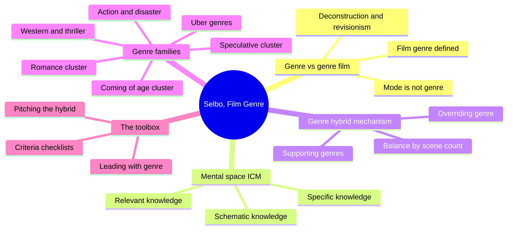
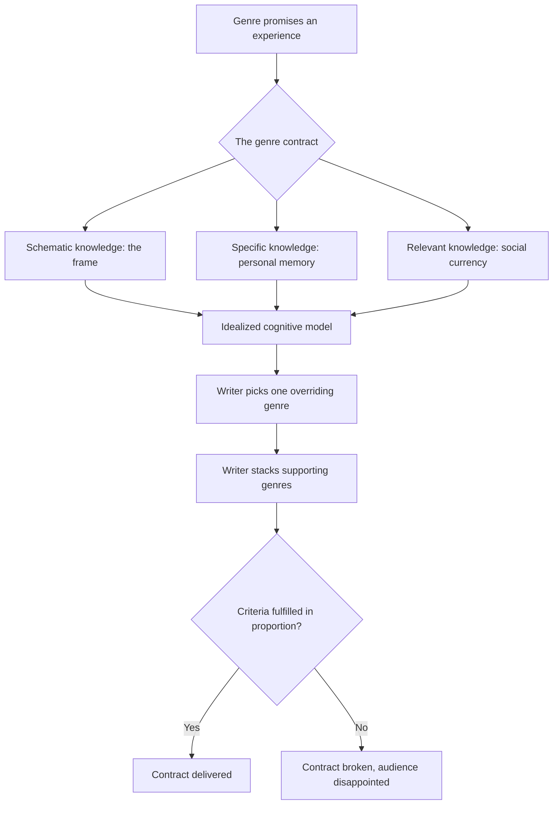
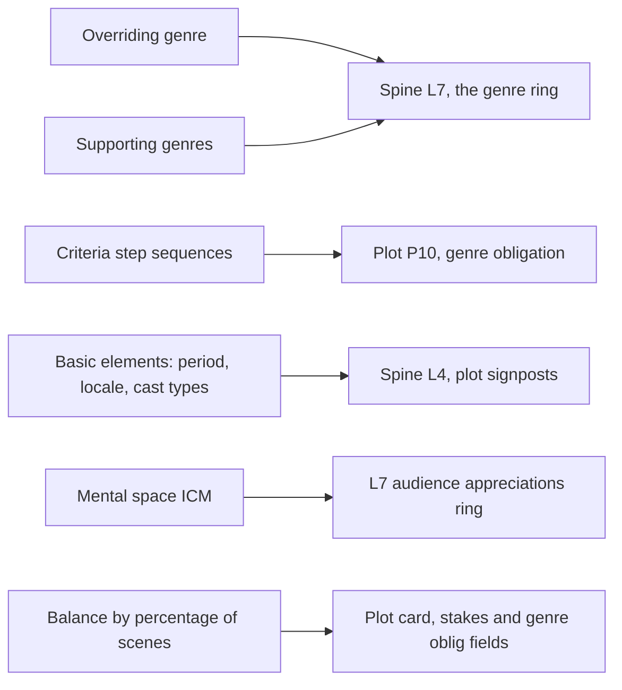
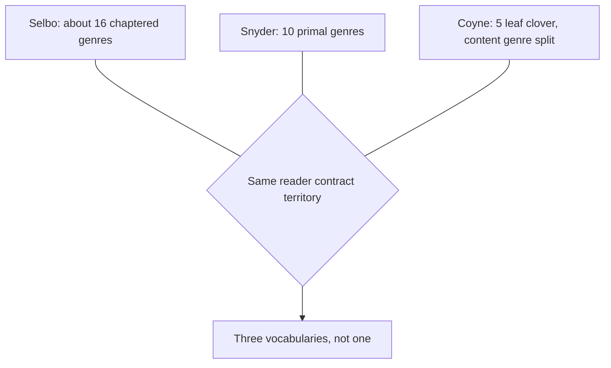

# BVX.0576 — Film Genre for the Screenwriter — Jule Selbo (2015)
### Knowledge Entry — Distill

A screenwriting-craft text, not a film-theory survey: Selbo takes the academic genre scholarship (Altman, Neale, Schatz, Bordwell) and converts it into a construction tool, chapter by chapter, for the working screenwriter choosing and combining genres before and during drafting.

## TABLE OF CONTENTS
- [Core Thesis](#1-core-thesis)
- [Mind Models](#2-mind-models)
- [Framework](#3-framework--structure)
- [Key Concepts](#4-key-concepts)
- [Heuristics](#5-heuristics--decision-rules)
- [Invariants](#6-invariants)
- [Pitfalls](#7-pitfalls--myths)
- [Application](#8-application)
- [Cross-References](#9-cross-references)
- [Provenance](#10-provenance--confidence)

---

## 1 · CORE THESIS

Film genre is a contract: a "mental space" built from schematic, specific, and relevant knowledge that promises the audience a specific experience and obligates specific components. The screenwriter picks one overriding genre, stacks supporting genres beneath it, and must fulfill each genre's criteria in rough proportion to the screen time it is given.

---

## 2 · MIND MODELS

*Required. Minimum two diagrams, maximum five.*

**Diagram 1 — the whole argument.**
Caption: *her method (definition, mental space, hybrid mechanics) sits above the genre families; the families are groupings, not a flat list of sixteen chapters.*

**Diagram 2 — the central mechanism (genre as a contract, a process).**
Caption: *the three knowledges build the audience's idealized cognitive model before a scene is drafted; the writer then stacks genres onto it and the criteria check is what actually delivers or breaks the promise.*

**Diagram 3 — mapped onto the Command's systems.**
Caption: *the overriding/supporting split and the ICM land on L7's genre and audience rings; the per-genre criteria sequences and basic elements are exactly the plot-obligation and scene-grammar material L4 and P10 already reserve room for.*

**Diagram 4 — Selbo's genre list beside Snyder's ten and Coyne's clover.**
Caption: *all three claim the same reader-contract territory at different resolutions; none of them substitute for the others.*

---

## 3 · FRAMEWORK / STRUCTURE

**Two opening chapters build the method, fourteen chapters apply it.**

1. **Chapter 1, Film Genre for the Screenwriter** — separates "film genre" (a type of story, no quality judgment attached) from "genre film" (a pejorative, imitative-work label), then separates genre again from Bordwell's "mode" (the delivery vehicle: animation, documentary, mini-series, and so on, which says nothing about content). Closes with her working definition: film genre is the type of film story and its essential elements (locations, iconography, characters, themes, mental space, and filmic/story attributes and intentions) that carry a historical heritage known to attract and emotionally affect a particular audience.
2. **Chapter 2, Creating the Mental Space** — the theoretical engine. Borrows Fauconnier's linguistics term "idealized cognitive model" (ICM) and proposes that a screenwriter builds an audience's mental space for a genre out of three knowledges: **schematic** (the structural frame the genre imposes), **specific** (the audience member's own memory/experience of that kind of story), and **relevant** (the social and ideological currency of the moment). These three, not spatial setting alone, are what "mental space" means.
3. **Chapters 3 through 14, the genre chapters** — grouped, not flat: Overview (a 30-term primer); the Uber Genres (comedy and drama, tonal umbrellas broad enough to host almost every other genre); Romance, Romantic Comedy, and Buddy; Speculative overview, then Horror, Science Fiction, Fantasy each on their own; Western; Thriller; Action and Adventure; Disaster and War; Coming-of-Age and Fish-Out-of-Water. Each runs the same shape: terms to understand, historical/mythological grounding, "basic elements" (period, locale, character types, or the tonal equivalent for passive genres), audience-expectation analysis, illustrative films worked into prose, and a closing "Suggested Exercises" block.
4. **Chapter 15, Balancing Film Genres** — the payoff chapter: two paired comparisons (*Bringing Up Baby* vs. *His Girl Friday*; *Gangs of New York* vs. *The Departed*) that count scenes by genre and convert the count to a percentage, showing that an unbalanced hybrid (99% one genre) reads thin while a properly weighted hybrid reads rich, and that a hybrid only "counts" a genre if its own criteria are actually met, not merely gestured at.
5. **Chapter 16, Conclusion: A Practical Tool in the Screenwriter's Toolbox** — restates the three-part definition and the mental space, and frames the whole book as guideposts to follow or subvert, not rules.

---

## 4 · KEY CONCEPTS

| Concept | What it is | Why it matters |
|---|---|---|
| **Film genre vs. genre film** | Film genre = type of story, no quality judgment (Altman). Genre film = a pejorative label for imitative, unoriginal work | Lets a screenwriter commit fully to a genre's components without treating that commitment as a confession of unoriginality |
| **Mode** (Bordwell) | The delivery vehicle: animation, documentary, CGI, web-series, mini-series | Mode and genre are independent axes; knowing a film is animated says nothing about whether it is a war drama or a comedy |
| **Mental space / ICM** | An idealized cognitive model built from schematic, specific, and relevant knowledge, standing in for Fauconnier's "possible world" | The screenwriter's real target is not "realism" but a deliberately incomplete world that includes only what the genre and story need |
| **Overriding genre / supporting genres** | One genre dominates a story's frame; others (per Neale, "genre hybrid") support it | Most produced films are hybrids; identifying which genre is overriding tells the writer whose obligatory criteria must be fully met |
| **Uber genres: comedy and drama** | Tonal umbrellas broad enough to pair with almost any other genre; the choice is a lens (lighthearted/ironic vs. serious/realistic), not a plot template | Explains why "comedy/action" and "drama/action" can share a plot skeleton and still read as entirely different films |
| **Active vs. passive genres** (via Tudor) | Active genres (western, thriller) supply attributes and structure; passive genres (comedy, drama) supply mostly tone | Predicts how much of a genre's "components" will be plot-shaped (L4-adjacent) versus purely tonal (L7-only) |
| **Deconstruction vs. revisionism** | Deconstruction lets a genre comment on itself inside the narrative (*Scream*); revisionism inverts a genre's classic values while keeping its shape (*Unforgiven*) | Two named, repeatable techniques for the "sense of newness" every genre-savvy audience now expects |
| **Basic elements** | Per-genre concrete building blocks, e.g., the western's Period (1860 to 1900), Locale (the Frontier Strip), and Characters (hero, society, villains, per Wright and Cawelti) | The genre-specific version of "components"; period and locale in particular double as setting-genre contract material |
| **Criteria step sequences** | An ordered checklist a genre's plot must hit, e.g., the seven-step romance progression (meet, want, pursue, get, lose, epiphany, win back) used to score *Bringing Up Baby* and *His Girl Friday* | A directly countable obligatory-scene sequence per genre, not just a mood or a setting |
| **Balance by percentage of scenes** | Count total scenes, count scenes played for each genre, convert to a percentage; a hybrid only reads as balanced when no single genre swallows the others and each genre present clears its own criteria | Selbo's own diagnostic instrument, parallel to but independent of Coyne's Story Grid Spreadsheet |
| **Leading with genre** | Opening a film with a beat native to its overriding genre (an early scare for horror, an early action beat for action) | A short-circuit (Altman) that primes the audience's mental space before the plot proper begins |

---

## 5 · HEURISTICS & DECISION RULES

| Situation | Do this | Not this |
|---|---|---|
| Unsure which of a story's genres is dominant | Identify the overriding genre and check that it alone satisfies its full criteria list | Treat all present genres as equally weighted |
| A hybrid feels thin or repetitive | Count scenes by genre and convert to percentages; look for one genre swallowing 90%+ of scenes | Assume the problem is dialogue or pacing before checking genre balance |
| Want a familiar genre to feel fresh | Apply deconstruction (let characters comment on the genre) or revisionism (invert its classic values, keep its shape) | Simply avoid or omit the genre's obligatory elements |
| Choosing an opening beat | Lead with a beat native to the overriding genre (danger for horror, an action beat for action) | Open in a tonally neutral scene and let genre reveal itself late |
| Deciding if a genre is really present in a script | Check it against that genre's own criteria/step sequence, not just its setting or iconography | Count a genre as fulfilled because of a superficial marker (cowboy hats, a spaceship) |
| Building audience trust in an unfamiliar premise | Draw on schematic knowledge (the genre's structural frame) before layering specific or relevant knowledge | Front-load novelty before the audience has the genre's frame to hang it on |
| Worried genre knowledge will kill originality | Treat creativity as synthesis of known elements into a sense of newness (the normative model), not virgin inspiration | Avoid genre convention altogether in pursuit of pure originality |
| Constructing an everyman protagonist for drama or uber-comedy | Build relatability first (ordinary powers, real flaws), then escalate stakes | Give the protagonist extraordinary powers and expect drama's "this could be me" effect anyway |

---

## 6 · INVARIANTS

1. **Film genre carries no quality judgment; genre film does.** Conflating the two is a category error the screenwriter must not make about their own material.
2. **Mode (the delivery vehicle) is never genre.** An animated film, a documentary, a mini-series can carry any genre content whatsoever.
3. **Every genre promises an audience a specific experience; failing to deliver produces measurable disappointment**, not merely a matter of taste (Selbo's own 100-screenwriter survey: all respondents agreed audiences choose films by marketed genre).
4. **Most produced films are genre hybrids**, one overriding genre supported by others; a "pure" single-genre commercial film is the exception.
5. **A supporting genre only counts toward a hybrid if its own criteria are substantially met**, not merely gestured at by setting or iconography.
6. **Active genres constrain structure and attributes; passive genres constrain tone only.** This is a spectrum property of the genre itself, not a writer's choice.
7. **The classic form of a genre must be understood before it can be usefully deconstructed or revised.** Both techniques are inversions or reflections of a known baseline, not escapes from it.

---

## 7 · PITFALLS / MYTHS

- Treating "genre film" and "film genre" as interchangeable terms, then either avoiding genre entirely or apologizing for using it.
- Believing mode (animation, documentary, streaming) tells an audience anything about content or tone.
- Fearing that genre knowledge forecloses originality; Selbo's counter is the normative model of creativity, synthesis producing a sense of newness, not the Romantic myth of virgin inspiration.
- Assuming a hybrid is "rich" simply because multiple genre labels are claimed for it, without checking whether each genre's criteria are actually fulfilled on the page (her diagnosis of *Bringing Up Baby*'s 99%-comedy imbalance).
- Mistaking setting or iconography (cowboy hats, a spaceship) for genre fulfillment when the underlying criteria sequence is absent.
- Assuming all genres are equally structural; passive genres like comedy and drama supply tone, not a plot template, and should not be mined for plot beats the way an active genre like the western or thriller can be.
- Skipping the classic/baseline version of a genre and attempting deconstruction or revisionism directly, producing confusion rather than a "sense of newness."

---

## 8 · APPLICATION

- **Spine level:** L7 primarily, the audience-contract ring the SSOT already flags as Dramatica's weakest holding; L4 secondarily, where her per-genre criteria step sequences (the seven-step romance progression, the western's period/locale/character basics) function as obligatory-scene ordering rather than pure tone.
- **12-layer character stack:** L12 FUNCTION, contextual only. Her genre-typed casting conventions (western hero/society/villains, thriller's flawed investigator/innocent victim/unwitting protagonist, drama's everyman) are a parallel industry taxonomy of narrative role, independent of Dramatica's eight archetypes; useful as a cross-check, not a source.
- **plot_systems:** Candidate feed for P10 GENRE OBLIGATION specifically. Her criteria-step sequences are directly convertible to a per-genre obligatory-scene checklist, and her scene-count/percentage balance method is a ready-made QA pass distinct from Coyne's Five Commandments tracking (it measures genre load per scene, not value-turn quality).
- **Setting:** Touches the L7-setting touchpoint the SSOT already names ("genre-setting contracts... western, space opera are genres that ARE setting promises"). Her "basic elements" (period, locale) for the western map cleanly onto that touchpoint and onto McKee's own Period/Location setting dimensions (BVX.0175 §8b), though Selbo never uses setting-system vocabulary herself.

Selbo's contribution is not a rival structure theory (she cites McKee, Field, and Vogler only to say they don't cover genre) but a working mechanism for two things the spine's L7 ring leaves thin: how a genre expectation gets built cognitively (the ICM), and how a writer manages more than one genre at once without one swallowing the others (overriding/supporting, scored by scene percentage). Where Coyne gives the editor's diagnostic clover and Snyder the pitch-room's ten-genre wheel, Selbo gives the classroom's working method, closer to marketing categories than either, and the only one of the three with a countable scene-balance audit tool. Practically, her romance seven-step and scene-percentage method are directly usable QA passes for OXO or any multi-genre draft.

**For the genre system:**

- **What this book adds to L7 (genre · medium · audience · market):** a cognitive mechanism for *why* genre functions as a contract (the ICM built from schematic, specific, and relevant knowledge), plus a concrete, countable craft method (overriding/supporting genre, percentage-of-scenes balance) that the spine's own note calling Dramatica's genre ring "thin" does not yet have from any single source.
- **Which of the four it feeds hardest:** genre and audience together, inseparably in her method, since the ICM is explicitly an audience-cognition model *of* a genre. Medium is fenced off on purpose (mode is not genre, per Bordwell) rather than fed. Market is touched only lightly, through her own screenwriter survey on audience-driven marketing, and is the weakest of the four in this book.
- **What a genre "component list" would look like as a field:** a genre card carrying `basic_elements` (period, locale, cast types, or the tonal equivalent for passive genres), `criteria_steps` (an ordered obligatory list like romance's seven steps), and an `active_or_passive` flag; on the PLOT CARD, each `criteria_steps` entry discharges one P10 `genre oblig` value per scene, exactly as Coyne's obligatory scenes already do, giving P10 two independent, cross-checkable sources.
- **How her genre list reconciles with Snyder's ten and Coyne's clover:** three vocabularies, not one. Coyne's clover is theoretical and axis-based (five independent dimensions); Snyder's ten is commercial and mechanism-based (locked to his 15-beat template); Selbo's roughly sixteen chaptered genres (plus a thirty-term overview list) track industry marketing categories most closely and supply the richest per-genre criteria detail of the three, but none maps one-to-one onto another: Selbo splits Action from Adventure and Disaster from War where Snyder folds comparable material into single genres, and she names Coming-of-Age and Fish-Out-of-Water as full genres, which neither Snyder nor Coyne does by name.
- **OPEN candidates the Command has not named:** (1) a per-scene "genre load" percentage metric, distinct from Coyne's value-turn tracking, that the SCENE CARD or PLOT CARD does not currently carry; (2) Bordwell's mode/genre distinction (delivery vehicle vs. content) has no explicit home in the medium grammars doc, which documents medium (prose, film, TV) but not mode-within-medium (animated vs. live-action vs. documentary film, all still M2 FILM); both are candidates for a future OPEN item, not asserted as canon here.

---

## 9 · CROSS-REFERENCES

| Related entry | Relation |
|---|---|
| [[BVX.0163]] | Snyder, *Save the Cat!* — the commercial ten-genre wheel; where Snyder locks genre to a fixed 15-beat page template, Selbo works genre criteria independent of page count, and covers roughly six genres (Coming-of-Age, Fish-Out-of-Water, Disaster, War, Buddy, Fantasy) Snyder's ten do not name separately |
| [[BVX.0236]] | Coyne, *The Story Grid* — the five-leaf clover and obligatory-scenes vocabulary; Selbo's criteria-step sequences and scene-percentage balance are a parallel, independently arrived-at obligatory-scene and diagnostic method, keyed to marketing-category genres rather than Coyne's five theoretical axes |
| [[BVX.0175]] | McKee, *Story* — Selbo cites McKee by name as a structure book that does not go deep on genre; her Period/Locale basic elements for the western echo McKee's own Period/Location setting dimensions (§8b) without either author citing the other's genre-setting overlap |
| [[BVX.0580]] | Neale, distilled in parallel from the academic side Selbo herself draws on (Altman, Neale, Schatz, Bordwell); Selbo is the constructive, screenwriter-facing translation of the same genre-theory literature Neale treats analytically |

---

## 10 · PROVENANCE & CONFIDENCE

Full text, pdftotext extraction, 341pp, clean text layer. **Read closely, in full or near-full:** front matter and blurbs; Introduction; Chapter 1 (film genre vs. genre film, mode, deconstruction, revisionism, hybrids); Chapter 2 (the ICM and the three knowledges); Chapter 3 (the 30-term recognized-genres list and quick-primer entries); Chapter 4 opening (the Uber Genres, tone criteria, short history); Chapter 10 (Western, fully, for its basic-elements method and closing exercises); Chapter 15 (Balancing Film Genres, in full); Chapter 16 (Conclusion, in full).

**Sampled at heading/opening/closing level:** Romance/Romantic Comedy/Buddy (the seven-step romance criteria confirmed via Chapter 15's analysis rather than read at first appearance); the Speculative Genres overview and the Horror, Science Fiction, and Fantasy chapter openings and terms lists; Thriller, Action and Adventure, Disaster and War, and Coming-of-Age/Fish-Out-of-Water chapter openings, terms lists, and closing exercises. The book has no formally headed "case study" sections; its film analyses are worked directly into chapter prose and were sampled rather than read exhaustively.

**Not read in depth:** the full body of each speculative-genre and action/adventure/disaster/war/coming-of-age chapter between opening and closing; the Index. A deeper pass would likely surface additional per-genre criteria-step lists worth mining for `04_PLOT_SYSTEMS`, but is unlikely to change the load-bearing framework extracted here (Chapters 1, 2, and 15).

Quotes are verbatim from the pdftotext scratchpad file; intermittent OCR artifacts (stray characters for curly quotes and dashes, occasional dropped ligatures) were silently corrected where unambiguous. Page numbers follow the book's own printed folios where visible, not pdftotext line numbers.

## META
- Template: BVX-LEARN-v4.0
- Source classification: full-text book, targeted-chapter extraction plus heading-level sampling of the remaining genre chapters
- Created / Updated: 2026-09-16
