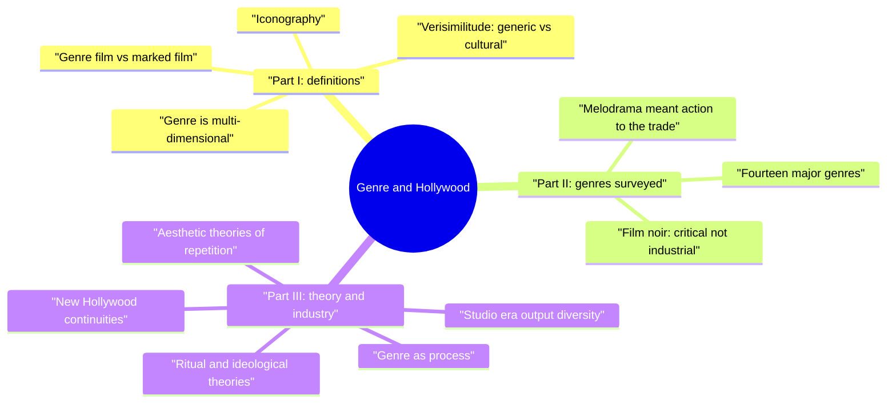
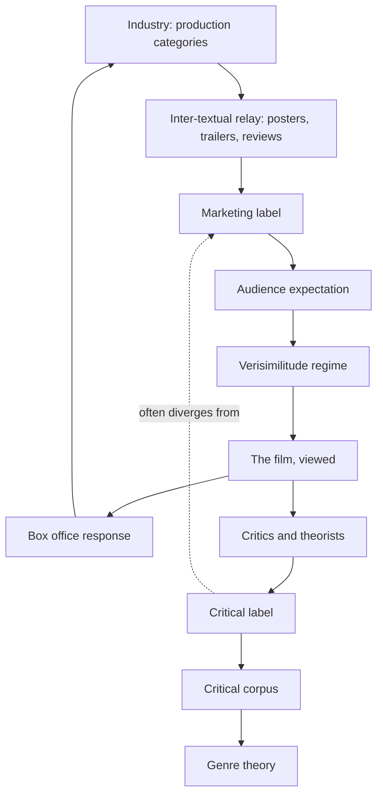
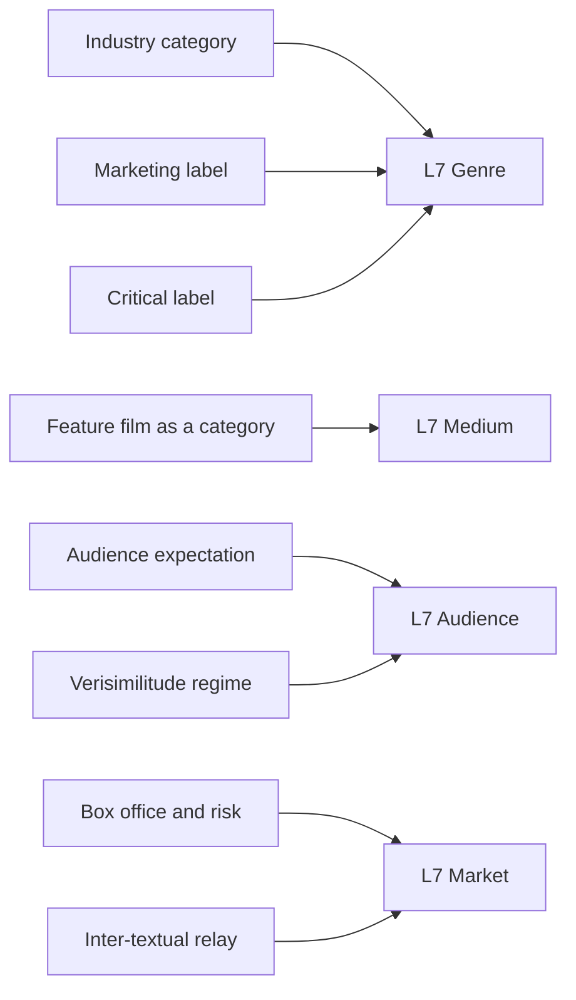
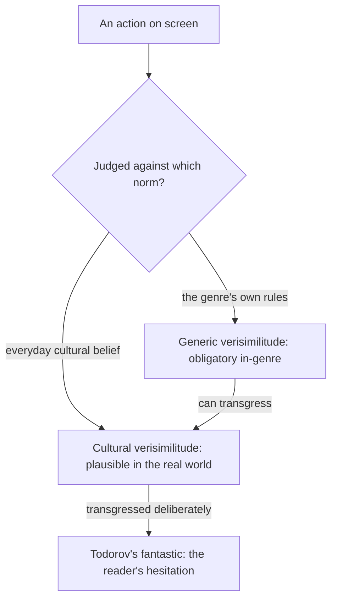

# BVX.0580 — Genre and Hollywood — Steve Neale (2000)
### Knowledge Entry — Distill

The L7 shelf's institutional counter-weight: an empirically driven takedown of genre-as-textual-essence that relocates genre in the industry's inter-textual relay, the critic's corpus, and the audience's regime of verisimilitude. It is the Command's source for treating "audience" and "market" as genre fields in their own right, not afterthoughts to "genre" and "medium."

## TABLE OF CONTENTS
- [Core Thesis](#1-core-thesis)
- [Mind Models](#2-mind-models)
- [Framework](#3-framework--structure)
- [Key Concepts](#4-key-concepts)
- [Heuristics](#5-heuristics--decision-rules)
- [Invariants](#6-invariants)
- [Pitfalls](#7-pitfalls--myths)
- [Application](#8-application)
- [Cross-References](#9-cross-references)
- [Provenance](#10-provenance--confidence)

---

## 1 · CORE THESIS

Genre is a multi-dimensional process, not a fixed set of textual traits: it runs between Hollywood's industry and inter-textual relay, the films themselves, and audience expectation held in regimes of verisimilitude. Industrial, marketing, critical, and audience uses of a genre label routinely diverge, so no single corpus or definition can serve all four at once.

---

## 2 · MIND MODELS

*Required. Minimum two diagrams, maximum five.*

**Diagram 1 — the whole argument.**
Caption: *three parts, one argument. Definitions must expand before the survey can be trusted, and the survey's cracks (noir, melodrama) force the industrial history that closes the book.*

**Diagram 2 — the central mechanism (genre as a process among three parties).**
Caption: *no single party owns a genre label. Industry, critics, and audience each run their own loop, and the loops only sometimes agree.*

**Diagram 3 — Neale mapped onto the Command's L7 ring.**
Caption: *Neale supplies working definitions for the two outer words the ring names but under-specifies. Audience and market are industrial facts here, not just reception vibes.*

**Diagram 4 — the two verisimilitudes.**
Caption: *the same on-screen action can be judged by two different rulebooks at once, and genre lives in the gap between them.*

---

## 3 · FRAMEWORK / STRUCTURE

Three parts, each correcting the excesses of the one that would follow if left unchecked.

- **Part I (ch. 1-2), definitions and concepts.** Traces genre theory's history (Alloway's iconography, Buscombe/McArthur, Ryall's audience-and-industry triangle, Tudor's "empiricist dilemma," Hirsch/Derrida/speech-act theory) to one conclusion: genre is ubiquitous, multi-dimensional, and not exclusive to Hollywood. Chapter 2 adds verisimilitude and the inter-textual relay as the mechanisms that actually produce genre-in-use.
- **Part II (ch. 3-5), genres surveyed.** A stock-taking of fourteen "major genres" at summary level, then two extended case studies, film noir and melodrama, chosen because they break the assumption built up in Part I that critical and industrial genre terms coincide.
- **Part III (ch. 6-7), theory, industry and history.** Chapter 6 audits aesthetic theories (Schatz's "predetermined" genre-film, Russian Formalist stage theory, Altman's semantic/syntactic split, Jauss and Cohen's genre-as-process) and socio-cultural theories (ritual, ideological, Kapsis's "production of culture" alternative). Chapter 7 tests all of it against actual Variety output in the mid-1930s and mid-1980s, and concludes that cycles, production trends, budget tiers, star-genre formulations, and hybrids outnumber and outrank "genre" as Hollywood's own planning unit in both eras.

The whole book argues by demonstrated exception. Every chapter produces a case (the western's atypical iconography, noir's non-existence as an industry term, melodrama's opposite trade meaning, 1930s Variety's sixty-one-category "Genre Index") that a tidier theory would have to suppress.

---

## 4 · KEY CONCEPTS

| Concept | What it is | Why it matters |
|---|---|---|
| **Genre as multi-dimensional** | Genre = expectations + categories + labels/names + discourses + texts + corpuses + the conventions governing all of them, never reducible to one dimension | The book's founding move; every later argument is a refusal to let one dimension (usually "the text") stand in for the whole |
| **Iconography** (Panofsky via Alloway, Buscombe, McArthur) | Recurring visual motifs (guns/cars/clothes in gangster films; castles/coffins in horror) read as a genre's visual conventions | Works well for the western and gangster film, fails for the biopic, social problem film, romantic drama — genres are heterogeneous in what actually defines them |
| **Verisimilitude: generic vs cultural** (Todorov, Culler) | Generic verisimilitude = plausible by the genre's own rules (singing in a musical); cultural/social verisimilitude = plausible by everyday belief | Every genre negotiates a balance between the two; non-realist genres (horror, sci-fi, fantasy) carry a heavier expositional burden because they cannot borrow real-world norms |
| **Inter-textual relay** (Lukow and Ricci) | Posters, trailers, stills, reviews, credit sequences, cinema programming, marquee copy — the industry's own machinery for producing a film's "narrative image" | The primary evidence base for what a genre actually was at a given historical moment, as opposed to what critics later say it was |
| **Genre film vs generically marked/modelled film** (Altman, refined by Neale) | "Genre film" = self-consciously produced/consumed against a specific generic model; Neale's refinement separates the moment of production (modelled) from the moment of reception (marked) | Prevents conflating genre-as-category with genre-as-corpus, and lets parody/pastiche be theorized without assuming all genre engagement is self-conscious |
| **Genre as process** (Jauss, Cohen) | Genres are not fixed essences but a continual founding and revising of "horizons of expectation" as each new text adds to, alters, or contradicts the corpus | The book's load-bearing theoretical claim: it licenses treating melodrama's and noir's shifting meanings as normal genre behavior rather than definitional failure |
| **Semantic / syntactic approach** (Altman) | Semantic = a genre's building-block elements (traits, settings, iconography); syntactic = the structural relations those elements are arranged into | Useful but porous — Neale shows the frontier between the two is not clean (is a shoot-out semantic or syntactic? both, depending on the genre's stage) |
| **Ritual vs ideological theories** (Cawelti/Schatz vs Wright/Screen-school) | Ritual: genres are audience-authored collective cultural expression, validated by box office. Ideological: genres manipulate audiences on behalf of capital | Neale rejects both as unfalsifiable and historically thin; box-office success indexes popularity, not ideological consent, and popularity is never culturally uniform |
| **Production of culture perspective** (Kapsis) | Genre/cycle production explained by the interorganizational network — studios, distributors, mass-media gatekeepers, censors (CARA/MPAA), domestic and foreign markets | The book's preferred alternative: the early-1980s horror cycle ended over perceived foreign-market saturation, not declining domestic popularity or textual exhaustion |
| **Film noir as a critical, not industrial, category** | Coined by French critics (Nino Frank, 1946) after the fact; never used by the contemporary American industry or press | The book's central case study for the whole thesis: a term with no consistent defining criteria that has nonetheless become genuinely generic since, via neo-noir and retrospective relabeling |
| **Melodrama's double meaning** | Hollywood's trade term meant action/suspense (a synonym for "thriller"); Film Studies redirected the word to mean the woman's film; "woman's film" itself was never the industry's term | A second, parallel demonstration that critical and industrial vocabularies can point at nearly opposite corpora under the same word |
| **Studio-era output diversity** | A/B/programmer budget tiers, series, cycles, production trends, and star-genre/star-formula combinations, not "genre," were the industry's actual units of planning | Even at the studio system's mid-1930s height, Variety's reviews show dozens of ad hoc categories ("racetrack yarn," "Igloo drama") alongside canonic genre terms |
| **New Hollywood continuities** | Sequels, series, and hybridity are treated as distinctively "New Hollywood," but 1940s Hollywood had roughly six times the rate of "recycled-script" films that the 1970s did, and studio-era films were already routinely hybrid | Undercuts both post-modern-hybridity accounts and sequelitis accounts of New Hollywood as historically naive comparisons |

---

## 5 · HEURISTICS & DECISION RULES

| Situation | Do this | Not this |
|---|---|---|
| Assessing whether a category is a "real" genre | Check whether the term appears in the industry's own inter-textual relay at the time | Assume a critic-coined label (noir) has industrial or historical priority |
| Comparing Hollywood eras for genre practice | Sample actual trade-press reviews and output for the period | Rely on canonic film lists or a genre's classic-era reputation |
| Explaining a film or cycle's cultural significance | Check exhibition patterns, market segmentation, and audience-survey data first | Assume box-office success equals audience ideological approval |
| Building a genre definition or model | Track industry label, marketing label, critical label, and audience expectation as separate variables | Assume the four converge on one stable definition |
| Judging whether an on-screen event is "unrealistic" | Ask whether it's being judged by the genre's own rules or by everyday cultural belief | Treat "unrealistic" as one undifferentiated failure mode |
| Theorizing why a genre changed | Treat each new film as adding to or revising the genre's horizon of expectation | Assume genres pass through fixed stages (experimental to classical to self-conscious) |
| Explaining why a cycle ended | Look for interorganizational and market-side causes (foreign sales, censorship, saturation fears) | Assume the cycle exhausted itself creatively or that audiences simply lost interest |

---

## 6 · INVARIANTS

1. Genre is always multi-dimensional — expectation, category, label, text, corpus, convention — never reducible to any one of them.
2. Industrial, marketing, critical, and audience uses of a genre term can diverge sharply at the very same historical moment.
3. Every genre negotiates a balance between generic verisimilitude and cultural verisimilitude; the balance is never fixed and never absent.
4. A critical category never used by the industry at the time (film noir) is a legitimate object of study only if its proponents apply explicit, consistent criteria to a broad corpus — not one assembled backward from an already-canonized core.
5. Hollywood's actual output is always more diverse than any genre census suggests; budget tier, series, cycle, production trend, star vehicle, and hybrid combination operate alongside, and often instead of, genre as the industry's planning unit.
6. Generic repertoires always exceed any single film, and hybridity and overlap are the rule in every era of Hollywood, not a late or postmodern development.
7. A genre's history is as much the history of a term — its shifting boundaries, uses, and disputes — as it is of the films the term gets applied to.

---

## 7 · PITFALLS / MYTHS

- Treating a retrospective critical label (film noir) as though it were the industry's own contemporary category.
- Taking the western's unusually rigorous, well-documented iconography as the general model for how genre works; most genres (biopic, social problem film, romantic drama) lack a stable iconography altogether.
- Assuming box-office popularity proves ideological approval or cultural consensus — westerns were mass-produced in the studio era despite being disliked by most of the viewing population.
- Assuming studio-era companies specialized in single genres for extended periods; most studios diversified across many trends within any given year.
- Treating hybridity, allusion, and sequels as distinctively "New Hollywood"; 1940s Hollywood recycled scripts at a far higher rate than the 1970s did, and studio-era films (*Tripoli*, 1950) were routinely multi-generic.
- Confusing melodrama the trade term (action/suspense, a synonym for thriller) with melodrama the Film Studies term (the woman's film) — the two name nearly opposite corpora.
- Confusing "genre" as category (a type) with "genre" as corpus (an actual group of films) — a slippage Neale flags even in Altman's own terminology.

---

## 8 · APPLICATION

- **Spine level:** `L7` (genre, medium, audience, market — the outermost ring). Neale's argument stays at this ring; his "genre as process" claim (Jauss/Cohen) is about how a *category* accrues and revises its boundaries over time, not a claim about what a story fundamentally is, so `L0` is not added here — that would conflate a claim about genre-labeling with a claim about narrative's root nature.
- **12-layer character stack:** none — `feeds: []`. Neale operates one ring outward from character entirely: his unit of analysis is the industry-critic-audience triangle around a *category*, not a person. Nothing in this book maps onto CORE, WOUND, DRIVE, or FUNCTION without inventing a connection Neale himself never makes.
- **plot_systems:** n/a directly — Neale explicitly treats genre as a reader/industry contract layered over plot and structure, not a plot-events source.
- **Setting:** contextual only — the "genre-setting contract" touchpoint the SSOT already names (Southern Gothic, western, space opera as genres that *are* setting promises) is a live thread; Neale's iconography discussion (visual conventions tied to milieu) is the craft-side evidence for why that touchpoint holds for some genres (western, gangster film) and not others (biopic, social problem film).

Where Dramatica treats genre as a thin appreciation-layer (arena, style, feel) and Coyne's clover treats it as a reader-contract of conventions and obligatory scenes, Neale supplies the missing institutional machinery underneath both: a genre label is never just a textual promise, it is simultaneously an industry production category, a marketing claim, a critical construct, and an audience expectation, and these four routinely disagree about the same film. The Command's L7 ring names "audience" and "market" as co-equal words alongside "genre" and "medium," but until now the shelf's holdings (Dramatica, Coyne, Truby) have treated audience and market as thin reception-effects of a textual genre decision. Neale reverses the direction of the arrow for two of the four: market conditions (budget tier, foreign-sales anxiety, censorship pressure) and industry categories can *produce* a genre label independent of any stable textual pattern, and critical/audience uses can then diverge from that industrial origin without either side being "wrong." A genre model built on this book would need at minimum four separate fields per genre entry — industry label, marketing label, critical label, and audience-expectation/verisimilitude-regime — rather than one canonical name, because Neale's central case studies (noir, melodrama) are exactly the entries where those four fields hold different values.

**For the genre system:**
- Adds a documented institutional mechanism (the inter-textual relay) for how a genre label actually forms and circulates, which the Command's L7 ring currently names but does not model as a process with its own evidence trail.
- Feeds `market` hardest: Neale's whole industrial-history argument (studio-era budget tiers, cycles, star-genre formulations; New Hollywood's blockbuster/conglomerate economics) is a direct source for what "market" should mean as a genre field — production risk-management, not just box-office reception.
- As fields in a genre model: `industry label` = the term the production/distribution/marketing apparatus actually used at the time; `marketing label` = the term circulated in posters/trailers/reviews (often looser and more opportunistic than the industry's internal planning term); `audience expectation` = the regime of verisimilitude and generic knowledge a viewer brings to the film; these three plus `critical label` are independent variables, not synonyms for one "genre" slot.
- The difference the book insists on, stated as a rule: a genre as the trade uses it is a production/marketing convenience keyed to risk and cost (budget tier, cycle, star vehicle); a genre as critics use it is a retrospective, criteria-dependent corpus built for analytical or evaluative purposes — the two can name entirely different, even opposite, sets of films under the same word (melodrama is the clearest case on file).
- OPEN candidate: the model has no field yet for a genre's *contemporaneous industrial absence* — a critically vital, generically coherent-feeling category (like noir) that had no trade-press name at all when its films were made. Neale's answer (it can still be studied, but only by explicit consistent criteria over a full corpus, never a canon-backward selection) is a methodological rule the Command's library-keying process should probably adopt whenever a BVX-LEARN genre tag is critic-coined rather than industry-attested.

---

## 9 · CROSS-REFERENCES

| Related entry | Relation |
|---|---|
| [[BVX.0236]] | Coyne's genre clover (conventions/obligatory scenes as reader-contract) is the craft-side complement Neale's industrial argument sits underneath; Coyne asks what a genre owes the reader, Neale asks who gets to say what the genre even is |
| [[BVX.0163]] | Snyder's commercial genre wheels are exactly the kind of "marketing label" / commercial-compression genre use Neale's industry-vs-critic distinction is built to separate out from critical genre theory |
| [[BVX.0576]] | Selbo, distilling in parallel on the same L7 shelf wave; a live pairing for how a craft-side genre taxonomy squares with Neale's institutional skepticism about any single stable genre definition |
| [[BVX.0581]] | Bawarshi and Reiff, distilling in parallel; their genre-as-social-action rhetorical theory is a non-cinema, non-industrial confirmation of Neale's core claim that genre is a process of expectation-formation rather than a fixed textual essence |

---

## 10 · PROVENANCE & CONFIDENCE

Full text, pdftotext extraction of the 2005 Taylor & Francis e-Library reprint of the 2000 Routledge first edition, 337-page source (~154,000 words), clean text layer, complete front matter and table of contents recovered. Part I (Introduction; ch. 1 "Definitions of Genre"; ch. 2 "Dimensions of Genre") read in full and closely, including the iconography, verisimilitude, inter-textual relay, and early-western sections. Part II (ch. 3 "Major Genres"; ch. 4 "Film Noir"; ch. 5 "Melodrama and the Woman's Film") sampled per the brief: ch. 3's framing and Action-Adventure section read in full, the Westerns section's opening and Kitses-grid passage read closely, remaining eleven genre summaries (biopics, comedy, gangster/thriller, epics, horror/sci-fi, social problem, teenpics, war films, detective films) sampled at heading level only; ch. 4 (Film Noir) and ch. 5 (Melodrama) read at opening and closing sections, which carry the chapters' load-bearing arguments, with the extensive mid-chapter textual/stylistic detail sampled rather than read line-by-line. Part III (ch. 6 "Genre Theory"; ch. 7 "Genre and Hollywood") read in full and closely, including the aesthetic-theory critique of Schatz, the Jauss/Cohen genre-as-process argument, the ritual/ideological/production-of-culture review, and the full studio-era/New-Hollywood Variety-sourced industrial history and its concluding "Issues, Conclusions and Questions" section. Appendix and Bibliography not read (reference matter only, ~2,000 works cited).

All key-concept attributions and quotations are drawn from the source text itself (Neale citing Todorov, Culler, Altman, Schatz, Jauss, Cohen, Kapsis, Balio, Maltby, and others in turn); this distill preserves Neale's own citation chain rather than going to those secondary sources directly. The L7-ring mapping in §2 (Diagram 3) and §8 is this distill's synthesis — Neale never references the Command's schema; the mapping applies his industry/critic/audience distinctions to the SSOT's own four-word ring, cross-checked against `ShroomsQ/_CANON/_SSOT/01_NARRATIVE_FRAMEWORKS/📐 ssot_01_story_spine_comparative_tree.md` (L7 section and the setting touchpoint map, read in full) and `ShroomsQ/_CANON/_SSOT/02_CHARACTER_SYSTEMS/📐 ssot_02_character_systems_vertical_slice.md` (the 12-layer table, read in full, to confirm `feeds: []` is accurate rather than a gap).

## META
- Template: BVX-LEARN-v4.0
- Source classification: full-text book; Part I and Part III read in full/closely, Part II sampled per brief (two chapters read at open/close, one genre read in full, remainder heading-level)
- Created / Updated: 2026-09-16
