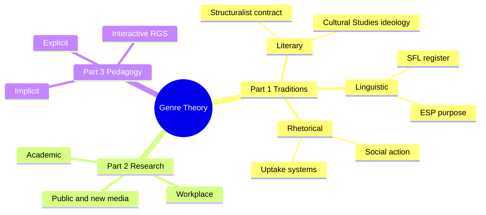
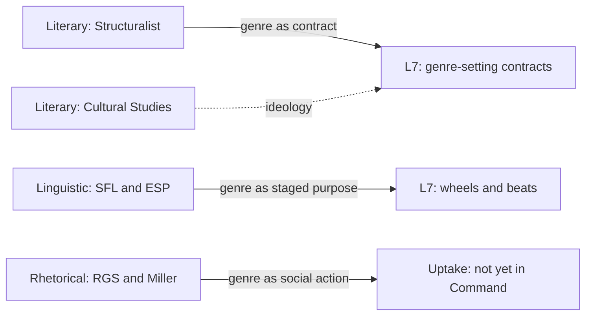
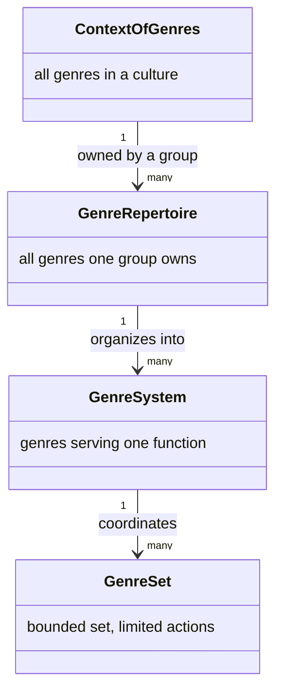

# BVX.0581 — Genre: An Introduction to History, Theory, Research, and Pedagogy — Anis S. Bawarshi & Mary Jo Reiff (2010)
### Knowledge Entry — Distill

The field's own reference guide to itself: traces three incompatible answers to "what is a genre" (literary, linguistic, rhetorical) into Rhetorical Genre Studies' synthesis, and supplies Carolyn Miller's founding definition, genre as typified social action, that most of the field now builds on.

## TABLE OF CONTENTS
- [Core Thesis](#1--core-thesis)
- [Mind Models](#2--mind-models)
- [Framework](#3--framework--structure)
- [Key Concepts](#4--key-concepts)
- [Heuristics](#5--heuristics--decision-rules)
- [Invariants](#6--invariants)
- [Pitfalls](#7--pitfalls--myths)
- [Application](#8--application)
- [Cross-References](#9--cross-references)
- [Provenance](#10--provenance--confidence)

---

## 1 · CORE THESIS

A genre is not a container for texts but a typified rhetorical action that helps constitute the recurrent situation it responds to (Miller). Literary, linguistic, and rhetorical traditions each locate that typification somewhere different: as an implicit contract on a text, as a staged realization of social purpose, or as the social action itself, stabilized only for now.

---

## 2 · MIND MODELS

*Required. Minimum two diagrams, maximum five. See §C for the rules.*

**Diagram 1 — the whole argument.**
Caption: *three parts, three traditions, one throughline: each part narrows from theory to research to classroom, and the rhetorical tradition (right branch) is the one the other two get measured against.*

**Diagram 2 — the central mechanism (genre as typified social action, a reproducing loop).**
Caption: *the loop never closes cleanly: the genre set or system that forms at the end reproduces the very situation that started the loop, which is why a genre can feel both invented and simply given.*

**Diagram 3 — the three traditions mapped onto L7, and where the Command's contract reading sits.**
Caption: *the Command's own genre-as-contract language descends from the Literary-Structuralist branch, not from Miller's rhetorical tradition, which is why uptake and genre systems have no home in L7 yet.*

**Diagram 4 — genre sets and genre systems, a nested taxonomy of scale.**
Caption: *genre set is the smallest bounded unit a group owns for one task; genre system coordinates several sets toward one overarching function; the ring keeps widening outward toward a whole culture.*

---

## 3 · FRAMEWORK / STRUCTURE

Eleven chapters in three parts, each narrowing from theory to research to classroom practice:

1. **Introduction** frames the thirty-year "genre turn": genre moving from a classifying label to a way of understanding kinds of social action, and names the etymological split (Latin *genus*, kind, vs. *gener-*, to generate) that the whole book keeps re-litigating.
2. **Part 1 (ch. 2–6): Historical Review and Theories of Genre.** Ch. 2 covers five literary trajectories (Neoclassical, Structuralist, Romantic/post-Romantic, Reader Response, Cultural Studies). Ch. 3–4 cover linguistic traditions: Systemic Functional Linguistics (Halliday, Martin), historical/corpus linguistics, and English for Specific Purposes (Swales). Ch. 5 sets up Rhetorical Genre Studies (RGS) by contrasting ESP's *communicative* orientation with RGS's *sociological* one, then traces RGS's roots through rhetorical criticism (Burke, Black, Bitzer, Campbell and Jamieson) and social phenomenology (Schutz), landing on Miller's "Genre as Social Action." Ch. 6 builds RGS's own apparatus: situated cognition, uptake, genre sets and systems, distributed cognition, meta-genres, activity systems.
3. **Part 2 (ch. 7–9): Genre Research in Multiple Contexts.** Empirical studies of genre in academic, workplace/professional, and public/new-media settings, organized around genre learning, genre systems in practice, and historical change.
4. **Part 3 (ch. 10–11): Genre Approaches to Teaching Writing.** Ch. 10 surveys implicit, explicit, and interactive pedagogies (Freedman's tacit-acquisition model vs. the SFL teaching-learning cycle vs. Brazilian synthesis models). Ch. 11 is RGS's own pedagogy: genre awareness, critical analysis, teaching genres in their contexts of use, and Writing in the Disciplines/Writing Across the Curriculum.

---

## 4 · KEY CONCEPTS

| Concept | What it is | Why it matters |
|---|---|---|
| **Genre's etymology** | Latin *genus* (kind, class) vs. *gener-* (to generate) | The book's whole argument is a fight between these two senses: classifier vs. generator of social action |
| **Typification (Schutz)** | Socially derived "stocks of knowledge" for recognizing situations as similar to past ones | Underlies Miller's whole move; explains why a genre convention *feels* given rather than chosen |
| **Rhetorical situation / exigence (Bitzer)** | A modifiable urgency, addressable by discourse, that calls a response into being | Miller's target: Bitzer treats situations as apriori and material; Miller will re-derive them as socially constructed |
| **Genre as social action (Miller)** | "Typified rhetorical actions based in recurrent situations" | RGS's founding definition; makes action and interpretation inseparable, and genre both noun (habitation) and verb (habit) |
| **Genre as literary institution / social contract (Jameson, Culler)** | Genre "specifies the proper use of a particular cultural artifact," like the institution of promising | The Structuralist-literary root of the Command's own "genre as contract" language |
| **Register vs. genre (Halliday, Martin)** | Register (field, tenor, mode) realizes *context of situation*; genre operates one level up, at *context of culture* | Explains why the same register can serve different genres, and why genre analysis can't stop at the sentence level |
| **Communicative purpose (Swales, ESP)** | The discourse community's shared goal that gives a genre its rationale and its internal moves and steps | ESP's starting point; produces move-analysis tools like the CARS model (Establish territory, niche, occupy niche) |
| **Uptake (Freadman)** | The conditioned, memoried way one genre's move calls forth a specific genre in response, like a played tennis shot | The mechanism that connects genres to each other in time; selective, not causal |
| **Ceremonial, genre, shot (Freadman)** | Ceremonial = rules for setting a game; genre = rules for playing it; text = the actual exchange | Distinguishes context (ceremonial) from convention (genre) from performance (text) in one analogy |
| **Genre set / genre system / repertoire / context of genres (Devitt, Bazerman)** | Four nested scales: a bounded task's genres, several sets coordinated toward one function, everything one group owns, everything in a culture | Names the levels a "single genre" analysis routinely erases |
| **Meta-genre (Giltrow)** | An "atmosphere" text or shared talk that teaches and stabilizes uptakes at a community's boundary | Genre about genre; explains style guides, outcomes statements, diagnostic manuals like the DSM |
| **Activity system (Engeström, Russell)** | Subjects, mediational means, object/motive, rules, community, division of labor, interacting toward an outcome | Genre systems operationalize activity systems; explains why genres carry power and status differences |
| **Chronotope / kairotic coordination (Bakhtin, Schryer, Yates and Orlikowski)** | Genres organize not only what gets said but when a response becomes socially due | Ties genre to timing and opportunity, not just to form |
| **Primary / secondary genres (Bakhtin)** | Simple, unmediated genres (a "hello," a private letter) get absorbed and transformed inside complex ones | A courtroom transcript recontextualizes a phone greeting; explains how genres are made of other genres |

---

## 5 · HEURISTICS & DECISION RULES

| Situation | Do this | Not this |
|---|---|---|
| You want to say what a genre "is" | Name which tradition you're borrowing from: taxonomy, staged process, or social action | Treat "genre" as one settled term the same across all three |
| A student knows a genre's formal features but still can't write it | Ask whether they've acquired the object/motive and the authority to act (Tardy) | Assume more explicit instruction in structure will fix it |
| Two genres seem to "go together" in practice | Name the uptake relation: what specific move in one calls forth what specific move in the other | Describe them as separate, merely related conventions |
| A convention feels timeless or "just how it's done" | Treat that feeling as typification doing its job, then historicize the convention | Treat the convention as natural, inevitable, or apolitical |
| You're describing a franchise, workplace, or course as "a genre system" | Distinguish the genre set (one group's bounded task) from the genre system (the whole coordinated activity) | Use "genre system" loosely for any pile of related texts |
| A genre is taught only through explicit models | Check whether the genre has been severed from its context of use and its appropriate uptake (Freadman) | Assume explicit modeling transfers automatically into situated performance |

---

## 6 · INVARIANTS

1. Every answer to "what is a genre" implies a theory of what genre *is* (classifier, staged process, or social action); the three are not interchangeable vocabularies for the same object.
2. A recurrent situation is not perceived, it is *defined*; genres are among the tools that do the defining (Miller, after Schutz).
3. Genre operates at the level of context of culture; register operates at the level of context of situation; the two realize each other but are not the same axis (Martin, Halliday).
4. Uptake is selective, not causal: a genre "calls for" a response only because that calling has been learned and remembered, not because one text mechanically triggers another (Freadman).
5. A genre never does its full social work alone; that work requires its set, its system, and often a meta-genre, not the isolated genre.
6. Cognition, timing, and authority are distributed unevenly across a genre system; access to a genre is not the same as access to its power (Schryer, Paré).
7. A genre is "stabilized for now," never permanently; it remains a site of ongoing ideological and social negotiation, not a closed contract (Schryer, Miller).

---

## 7 · PITFALLS / MYTHS

- Treating "genre" as if all scholarship means the same thing by it; the differences between the three traditions are not cosmetic.
- Assuming explicit teaching of a genre's formal features produces the ability to perform it; Freedman, Freadman, and Tardy each show genre knowledge needs the real object/motive and felt authority, not conventions alone.
- Confusing communicative purpose (why a discourse community uses a genre) with social action (what a genre does to and for the situation it answers); these are ESP's and RGS's different starting points, not synonyms.
- Reading "genre convention" as proof that genres are static; Bakhtin, Miller, and Schryer all treat conventions as stabilized only for now, under constant renegotiation.
- Mistaking a genre's obligatory conventions, the contract reading, for the whole of what a genre does; the contract reading is silent on how genres also reproduce or transform the situations they answer.
- Analyzing a single genre's features in isolation, without its genre set, system, or meta-genre, and missing most of its actual social work as a result.

---

## 8 · APPLICATION

- **Spine level:** L7, primarily; all three traditions in this book map directly onto the outermost ring's live debate over what a genre contract actually is. L0, provisionally; Miller's account of typification, the mechanism by which any recurrent action becomes recognizable as itself, is a root-level claim about how patterned human action comes to exist at all, standing beside rather than replacing Dramatica's argument theory.
- **12-layer character stack:** none directly; `feeds: []` is the honest call. This book's genres are non-fiction, functional texts (patents, tax forms, therapy notes, syllabi); nothing here scores a fictional character variable the way an actantial model or a trait taxonomy would.
- **plot_systems:** not applicable. Swales' CARS model (Establish a territory, Establish a niche, Occupy the niche) is a move-and-step grammar for a non-fiction genre (the research-article introduction); a structural analogy to scene grammar worth noting, not a source for it.
- **Setting:** not directly applicable, though the chronotope work (Bakhtin, Schryer: genres organize space-time relations and who gets to act where and when) is a distant echo of setting-as-entity thinking, worth flagging rather than citing.

Bawarshi and Reiff's real contribution to the Command is diagnostic rather than generative: it names the tradition the Command has already been speaking in at L7 without saying so, and it hands over a vocabulary (uptake, genre set, genre system, meta-genre) for the parts of genre's social life that a contract-only reading cannot see.

**For the genre system:**
- This book adds a genealogy the Command's L7 currently lacks: it proves that "genre as reader-contract" is not the neutral, default definition of genre, but one specific inheritance (Literary-Structuralist) among at least three live, mutually incompatible traditions, and that RGS's own definition, genre as typified social action, is the field's dominant contemporary position, not a footnote to the contract reading.
- Of the four L7 words, genre and medium, audience, market, it feeds **genre** hardest by a wide margin; it feeds **audience** second, through uptake and Reader Response's reader-as-genre-performer; it barely touches **medium** (new-media genres appear only at chapter-opening depth in ch. 9) and does not address **market** at all.
- The Command's "genre as contract" reading (Truby's obligatory conventions, Coyne's genre conventions owed, the genre-setting-contracts touchpoint) traces to the **Literary-Structuralist tradition**, specifically Jameson's "genres are social contracts between a writer and a specific public" and Culler's promise-breaking analogy, not to Miller's rhetorical tradition. What it is missing from the **Rhetorical tradition**: the claim that a genre also reproduces or transforms the recurrent situation it answers, plus the entire apparatus (uptake, genre sets and systems, activity systems) for how one genre's obligation gets discharged into another's across a production-to-reception pipeline. What it is missing from the **Linguistic tradition**: the register/realization architecture (field, tenor, mode realizing a genre's context of culture) that gives a systematic method for deriving which formal features actually discharge which social purpose, and ESP's move-and-step analysis for describing a genre's internal staged obligations rather than only asserting that obligations exist.
- Yes: **genre system** and **uptake** earn fields in a genre model. A contract-only reading can describe a single genre's owed conventions but has no way to represent how a genre's promise gets discharged intertextually, a pitch calling forth a treatment calling forth an option calling forth a greenlight memo, which is exactly the work genre system and uptake are built to name.
- OPEN candidates a genre model needs that the Command has not named: (1) **meta-genre** (Giltrow), an atmosphere-level text or talk, a style bible, a showrunner's tone memo, that teaches and stabilizes how a genre gets used, sitting above genre and register both; (2) **genre chronotope / kairotic coordination** (Bakhtin, Schryer, Yates and Orlikowski), genre's power to organize not just content but when in space-time a response becomes due, relevant to release cadence and seriality but currently unnamed; (3) **typification** (Schutz) itself as the cognitive mechanism under genre recognition, a theory of why a convention feels given rather than chosen, which the Command's contract language assumes but never explains.

---

## 9 · CROSS-REFERENCES

| Related entry | Relation |
|---|---|
| [[BVX.0580]] | Neale, film genre theory, distilled in parallel; check whether Neale's industrial, reader-expectation account of genre lands in this book's Literary-Structuralist contract lineage or closer to the rhetorical tradition |
| [[BVX.0614]] | Todorov, distilled in parallel; Bawarshi and Reiff's own theoretical-versus-historical genre distinction (ch. 2) is lifted directly from Todorov's *The Fantastic*, worth cross-checking against Todorov's own text |
| [[BVX.0236]] | Coyne, *The Story Grid*; the Command's clearest working instance of the Literary-Structuralist contract reading (obligatory conventions, genre conventions owed) this entry traces back to Jameson |

---

## 10 · PROVENANCE & CONFIDENCE

Full text, pdftotext extraction (279 pages, approx. 95,000 words). Read closely: Introduction and Overview; Chapter 2 (Genre in Literary Traditions), all five trajectories; Chapters 3–4 (Genre in Linguistic Traditions: SFL, historical/corpus linguistics, ESP) at moderate depth; Chapter 5 (Genre in Rhetorical and Sociological Traditions), full close read including Bitzer, Miller, and Schutz; Chapter 6 (Rhetorical Genre Studies), full close read covering uptake, genre sets and systems, distributed cognition, meta-genres, and activity systems. Read at chapter-opening and chapter-closing level only: Chapters 7–9 (Part 2, genre research in academic, workplace, and public/new-media contexts) and Chapters 10–11 (Part 3, genre pedagogies), plus the Glossary for terminology confirmation.

The L7 tradition-placement, the L0 provisional assignment, and the identification of the Command's "genre as contract" language with the Literary-Structuralist branch specifically are my inference; the authors never mention the Command, Dramatica, or the story-spine. Quotes are verbatim from the extraction, which occasionally garbles diacritics in proper names (Genette, Todorov, Bazerman's collaborators), silently normalized here where unambiguous.

## META
- Template: BVX-LEARN-v4.0
- Source classification: full-text book, pdftotext extraction
- Created / Updated: 2026-09-16
