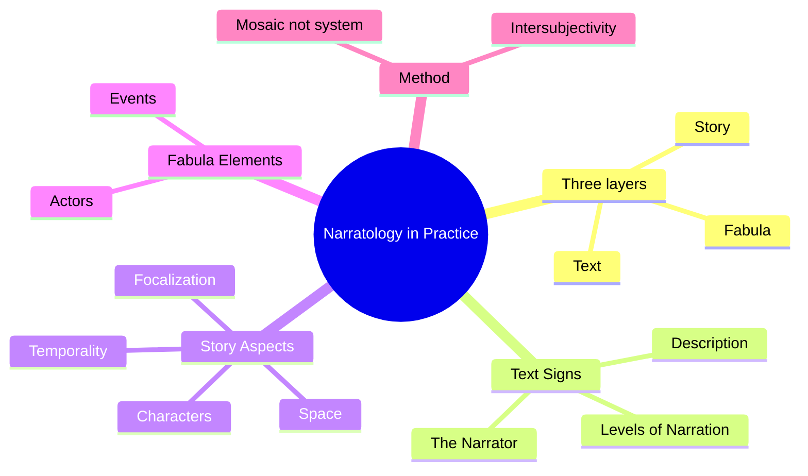
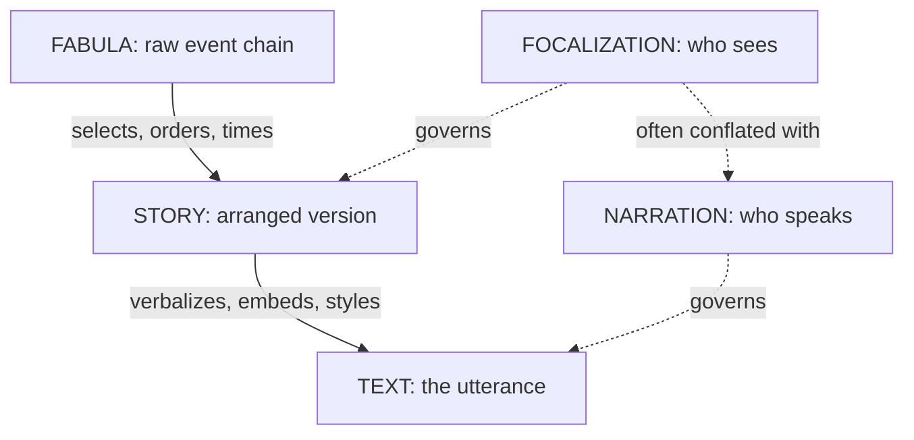
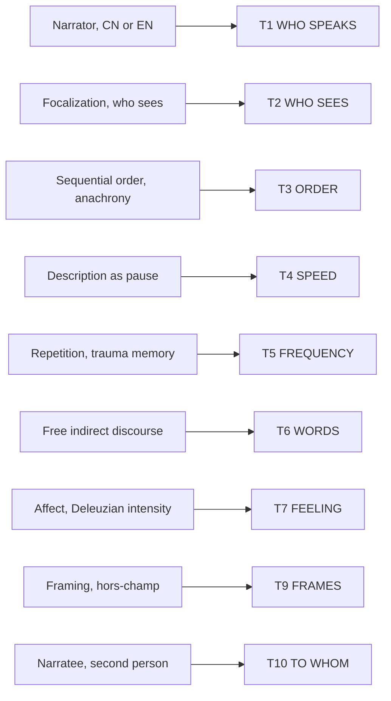
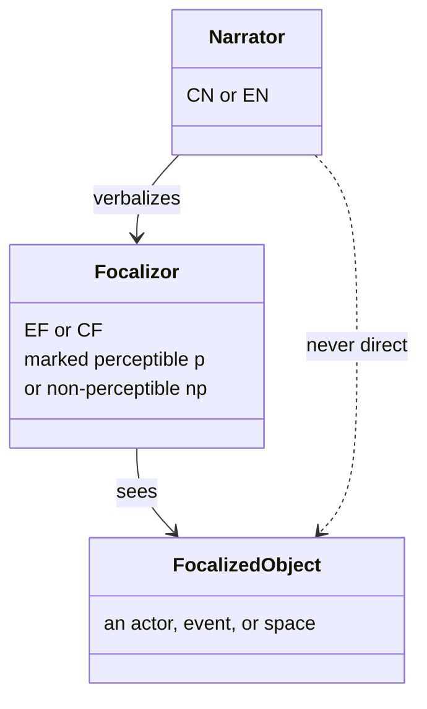

# BVX.0596 — Narratology in Practice — Mieke Bal (2021)
### Knowledge Entry — Distill

The companion volume to Bal's own theory book (*Narratology: Introduction to the Theory of Narrative*, 4th ed. 2017), trading systematic exposition for worked analysis; the library's deepest holding on focalization, description, and the case for a three-layer (not two-layer) cut of narrative, all cited directly in the Command's own texture and setting SSOTs.

## TABLE OF CONTENTS
- [Core Thesis](#1--core-thesis)
- [Mind Models](#2--mind-models)
- [Framework](#3--framework--structure)
- [Key Concepts](#4--key-concepts)
- [Heuristics](#5--heuristics--decision-rules)
- [Invariants](#6--invariants)
- [Pitfalls](#7--pitfalls--myths)
- [Application](#8--application)
- [Cross-References](#9--cross-references)
- [Provenance](#10--provenance--confidence)

---

## 1 · CORE THESIS

Narrative divides, for analysis only, into three layers: fabula (a chronological chain of events caused or undergone by actors), story (how that chain is arranged, timed, and colored), and text (the utterance that conveys it). Focalization, who sees, cuts across all three and outranks narration, who speaks, as the decisive site of meaning and manipulation.

---

## 2 · MIND MODELS

**Diagram 1 — the whole argument.**
Caption: *five parts, one recurring move: take a received binary or a settled term, and show a third, hidden layer or a buried subject inside it.*

**Diagram 2 — the central mechanism (fabula to story to text, a shaping pipeline).**
Caption: *the fabula gets arranged and colored into a story before it is ever spoken into a text, and focalization does that coloring one level below narration, which is exactly why collapsing the two is the single most common critical error.*

**Diagram 3 — mapped onto the Ten Questions of the Telling.**
Caption: *Bal's own vocabulary already answers eight of ten questions outright; T8 thresholds is the one she never touches, that is Genette's paratext territory, not hers.*

**Diagram 4 — focalization in Bal's own terms.**
Caption: *the narrator never touches the object directly, it always passes through a focalizor first, marked visible (p) or hidden (np), and that pass-through is where manipulation lives.*

---

## 3 · FRAMEWORK / STRUCTURE

The book mirrors the theory volume's table of contents but swaps systematic exposition for a "mosaic" of worked analyses, deliberately non-comprehensive (Preface, Introduction). Five parts, arranged as text, transition, story, transition, fabula:

1. **Introduction** lays the load-bearing claim: the older two-way split (text/fabula, or story/plot, or form/content) collapses two very different operations into one, so Bal inserts a middle term, story, and makes focalization the reason the middle term is needed at all.
2. **Text: Signs** (the outermost layer): the Narrator (who speaks, in what person, at what level, with what reliability), Description, Levels of Narration (embedding, quoted speech, free indirect discourse).
3. **Transition: Between Text and Society** reconnects the technical distinction to social stakes, arguing distinction is not separation.
4. **Story: Aspects** (the middle, shaping layer): Temporality (heterochrony, sequential ordering), Characters, Space, and last, longest, and most emphasized, Focalization.
5. **Transition: Media in Dialogue** extends the whole apparatus to film, painting, and installation art, arguing narratology is medium-general, not novel-specific.
6. **Fabula: Elements** (the innermost, content layer): Events (defined as transitions between states), Actors (grouped by function into actants: subject, object, helper, opponent, power), Time, Location.
7. **No Conclusion**: refuses closure on principle; the book's own fragmented, mosaic form is offered as proof of its argument about "theoretical relativism" and intersubjectivity (disagreement, not consensus, as the goal).

---

## 4 · KEY CONCEPTS

| Concept | What it is | Why it matters |
|---|---|---|
| **Fabula** | Chronologically related events, caused or experienced by actors | The content layer; what Chatman's story-side (events + existents) already names |
| **Story** | The manifestation, inflection, and coloring of a fabula | The layer Bal adds between content and utterance; ordering, timing, focalization happen here |
| **Text** | An utterance conveying a story to an addressee, in any medium | The surface layer; where the narrator actually speaks |
| **Narrator** | CN (character-narrator) or EN (external narrator) | Answers "who speaks," never "who sees"; marked perceptible (p) or non-perceptible (np) |
| **Focalizor** | EF (external focalizer) or CF (character-focalizer); whoever's vision colors the story | Answers "who sees"; the single most load-bearing concept in the book, per Bal's own Preface |
| **The narrator/focalizer law** | "Who speaks" and "who sees" are never automatically the same agent | Collapsing them is, in Bal's words, "as nonsensical" as claiming a character narrates a sentence she is merely seen inside |
| **Description** | Attribution of features to fabula elements, bound to focalization for its coloring | Governed by delimitation, motivation, and rhetorical features; a pacing device (pause) as much as a content device |
| **Levels of narration** | Embedded, second-level speech or thought inside a first-level narration | Discrepancies between what is narrated and focalized are a text's primary manipulation tool (Colette's *The Cat*) |
| **Free indirect discourse (FID)** | Narrator and character voice fused, no clear marker of the switch | Produces "immersive" narrative (Flaubert); makes levels of narration undecidable by design |
| **Heterochrony** | Time as multiple and unequal across subjects, not one objective line | Motivates Bal's temporal analysis; time of telling versus time of events versus their mismatch |
| **Actants** | Subject, object, helper, opponent, power, organized around a function | Fabula-level structural grammar for "who does what to whom," via Greimas and Hamon |
| **Event** | A transition from one state to another, caused or experienced by actors | Frame-change (Zizek) and rupture are two competing definitions Bal keeps open rather than resolving |
| **"Paper people"** | A character (e.g., Proust's Albertine) with no psychological depth of its own | Realist, moralizing readings of character are a "major ideological trap"; character is fleshed out by repetition, accumulation, relation, transformation |
| **The political (Mouffe)** | The dimension of antagonism constitutive of social life, distinct from "politics" (which manages it) | Bal's ethical ground for why focalization-centered analysis matters beyond the seminar room |
| **Intersubjectivity / mosaic** | Clarity enabling disagreement, not consensus; the book's own fragmented form | The stated goal of the project; a "conclusion" would betray it |

---

## 5 · HEURISTICS & DECISION RULES

| Situation | Do this | Not this |
|---|---|---|
| A sentence reports what a character sees | Ask separately who speaks it and who sees it; they can diverge | Assume first-person prose or third-limited automatically fuses the two |
| A narrator's judgment feels oddly harsh or oddly favorable to one character | Check whether that judgment is actually the character's own focalization laundered through the narrator (as in Colette's *The Cat*) | Read the judgment as neutral, omniscient truth |
| A passage is heavy with sensory or spatial detail | Ask what it is delimiting, what motivates its presence, and whose vision colors it | Treat description as inert scenery separable from plot |
| A character seems flat, contradictory, or morally repugnant by modern standards | Ask whether the text is building a "paper person" for structural or ideological ends before judging it as a failed psychological portrait | Import realist, moralist expectations onto non-realist or historically distant characters |
| A term from a source culture (virgin, concubine, rape as a noun) needs translating | Track what the fabula's actual structure does with it before reaching for the nearest modern equivalent | Assume the modern noun's connotations transfer intact across time and culture |
| Two agents seem to be "the same voice" across a scene shift | Check for embedding: is this second-level, quoted speech now running without its markers (FID)? | Treat the whole passage as one undifferentiated level of narration |
| An "event" seems too minor or too diffuse to count | Ask whether it marks a transition between states, or a rupture, or a frame-change; slow, barely-visible events still qualify | Require spectacle or a clean single moment before calling something an event |
| A reading of a text or a case study won't resolve to a single tidy interpretation | Treat the productive uncertainty itself as the analytic yield, and make it discussable | Force closure for its own sake |

---

## 6 · INVARIANTS

1. Fabula, story, and text are provisional analytic layers, not separable substances; distinguishing them is useful precisely because it is not the same as separating them.
2. Who speaks (narration) and who sees (focalization) are never the same question, and a text's narrator and focalizer need not be, and often are not, the same agent.
3. Description is never merely decorative; it is inseparably bound to focalization (whose vision colors it) and functions as a pacing device (a pause or a stretch in story-time), not only a content device.
4. Any narrated vision (a character's, an external focalizer's, a memory) can diverge from what "actually" happened in the fabula; that gap is where manipulation and ideology operate.
5. Character is a textual effect built by repetition, accumulation, relation, and transformation; it is not a pre-existing psychology waiting to be described.
6. Nominalizing an event (turning a verb like "rape" into a noun) erases the subject of the action and the question of whose focalization is being trusted; this loss is structural, not accidental.
7. Narratology is medium-general: film, painting, installation art, and even an abstract sculpture can be narrators, focalizors, and fabulas exactly as a novel can.
8. The theory's own goal is intersubjectivity (principled, discussable disagreement), not consensus or closure; a completed, airtight analysis is neither possible nor the point.

---

## 7 · PITFALLS / MYTHS

- Treating "who tells the story" and "who sees the story" as one question; Bal calls the resulting confusions (e.g., claiming a third-person-narrated character is "telling his own story") outright nonsensical.
- Reading "show, don't tell" as a moral commandment rather than what it is: a dial between diegesis (telling) and mimesis (showing), a distance setting.
- Assuming description is realism's servant; the best realist writers (Flaubert) are, in Bal's account, "the worst realists" by that standard, using description to critique rather than mirror reality.
- Judging fictional characters, especially from older, non-realist, or non-Western texts, by modern psychological "roundness"; this produces both a myth of "primitivism" and misapplied charges of misogyny onto texts with different representational rules.
- Assuming a fixed order of description (head to foot, foreground to background) is a rule rather than a convention the best writers deliberately violate.
- Assuming that swapping an anachronistic modern term (like "rape") for a softer one ("forcing into marriage") escapes ideology; it can just relocate the ideology into the substitute term.
- Expecting or demanding a conclusion; Bal argues a tidy synthesis would betray the book's own claim that theory should remain discussable and provisional.

---

## 8 · APPLICATION

- **Spine level:** TEXTURE, primarily; Bal is the texture layer's own cited source for T2 (focalization) and half of T4 (description as the pause/stretch mechanism). SETTING, secondarily; her Space section (Story: Aspects) is a substantial, independent treatment of how space frames, imprisons, and characterizes, already cited in the setting SSOT's library. L0, provisionally; her fabula/story/text three-way division is a rival root-claim about what "story" is made of, standing beside Chatman's story/discourse binary rather than replacing it.
- **12-layer character stack:** contextual only. L12 FUNCTION via the actantial model (subject, object, helper, opponent, power organized around a function); a parallel structuralist grammar to Dramatica's archetypes, offered as comparison, not substitution. L3 SOCIAL via the "paper people" and binary-opposition critique, a caution about how a character's legibility gets built and misread, not a scoring input.
- **plot_systems:** not directly applicable. Bal's definition of an event (a transition between states, caused or experienced by actors) is a clean, minimal primitive that could seed the currently empty `04_PLOT_SYSTEMS/` domain if and when it opens, but nothing in this pass constitutes a worked plot grammar the way McKee's beat-scene-sequence-act hierarchy does.
- **Setting:** applicable. The Space section's account of framing (rooms within rooms, the doorway as threshold, space as imprisonment) is compatible with S1 BODY, S3 SENSORIUM, and especially S10 UNDERSIDE (what a space's framing represses or encloses); it deepens rather than revises the setting SSOT's existing citation of Bal.

Bal's central move, a middle layer between raw content and surface utterance, is already implicit in the texture SSOT's split of T1 (who speaks) from T2 (who sees): that split *is* the claim that narration and focalization are different operations, by potentially different agents. Reading Bal does not require moving anything in the Command's architecture; it supplies the theoretical apparatus (CN/EN, EF/CF, perceptible/non-perceptible marking, the narrator-focalizer discrepancy as a manipulation diagnostic) behind a rule the SSOT currently states as a law without unpacking its mechanics.

**For the texture system:**
- Bal supplies the working vocabulary and the diagnostic method for T2 (WHO SEES): the EF/CF split, the perceptible (p) / non-perceptible (np) marking of both narrator and focalizor, and the explicit warning that narrator and focalizer discrepancies are where a text manipulates its reader.
- She feeds T2 hardest, by a wide margin. Focalization is, in her own words in the Preface, "the most important, most penetrating, and most subtle means of manipulation" the theory offers; T1 (narration) and T4 (description as pause) are the next strongest, both secondary to T2 in her own account.
- Her fabula/story/text cut does not change the Command's story/discourse split; her fabula fully occupies the story-side of Chatman's binary, and her story and text layers are both discourse-side operations. What she does contribute is the justification for why discourse itself must never be treated as one operation: it is at minimum two, shaping (story: order, timing, focalization) and telling (text: narration, embedding, style), and the Ten Questions already keep these separate as T1 through T10 rather than collapsing them.
- She would split the TELLING PROFILE's T2 field into an EF/CF distinction plus a perceptible/non-perceptible marker for both the narrator and the focalizor, and she would add a sub-note under T4 for description's three governing operations (delimitation, motivation, and the rhetorical triad of aspectualization, modalization, subjectivation) wherever a scene leans on pause or stretch.
- OPEN candidates the Ten Questions do not currently name: (1) a notation for narrator/focalizer *discrepancy* as a manipulation diagnostic, distinct from simply recording each of T1 and T2 on its own; (2) memory as a distinct mode of focalization (retrospective, unreliable, sense-based, and itself narrativized) rather than only a perceptual one; (3) description's threefold motivation test (delimitation, motivation, rhetorical binding) as a required check wherever a scene card marks the Pause duration.

---

## 9 · CROSS-REFERENCES

| Related entry | Relation |
|---|---|
| [[BVX.0598]] | Hühn et al., the reference-shelf, multi-author counterpart to Bal's single-author theory; distilled in the same wave, cross-check T1 through T10 coverage against its handbook entries |
| [[BVX.0061]] | Card's explicit exclusion of viewpoint, person, and tense from the character layers is a practical rule; Bal's narrator/focalizer apparatus is the full theory underneath that rule |
| [[BVX.0349]] | Kennedy on description within the setting system; Bal's description theory (delimitation, motivation, rhetorical features) is the narratological source Kennedy's setting-facing account sits beside, worth comparing where the two agree and where Kennedy narrows Bal's scope |

---

## 10 · PROVENANCE & CONFIDENCE

Full text, pdftotext extraction (232 pages, approx. 91,000 words). Citations follow the source's own chapter and section headings, since the extraction carries page-footer markers rather than clean breaks. Read in full: Preface and Introduction; Chapter 1 (Text: Signs) sections 2, 4, 5 (Narrator, Description, Levels of Narration); Chapter 3 (Story: Aspects) sections 2 through 5 (Temporality, Characters, Space, Focalization); Chapter 5 (Fabula: Elements) sections 1 through 3 (Preliminary Remarks, Events, Actors), plus the closing "No Conclusion." Read at heading level only: Chapter 2 and Chapter 4 (the two Transition chapters) and Chapter 5 sections 4 to 5 (Time, Location); a deeper pass would likely add frame-narrative and location-specific material, flag "Upgrade BVX.0596" if wanted.

Quotes are verbatim from the extraction, which drops or garbles some diacritics and ligatures, silently normalized here where unambiguous. The Ten Questions mapping, the SETTING axis assignment, and the L3/L12 entries in §8 are my inference, not Bal's; she never mentions the Command, OXO, DCUS, or Dramatica.

## META
- Template: BVX-LEARN-v4.0
- Source classification: full-text book, pdftotext extraction
- Created / Updated: 2026-09-16
