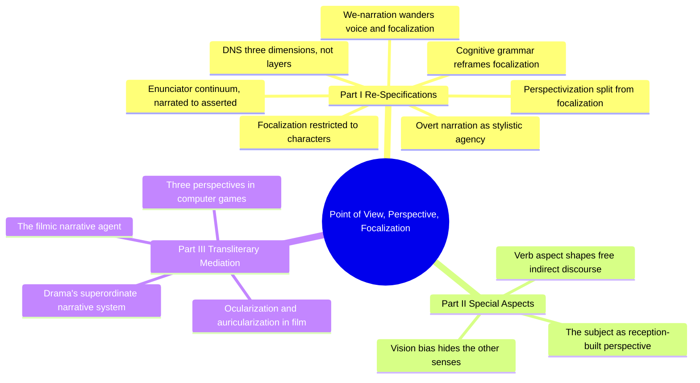
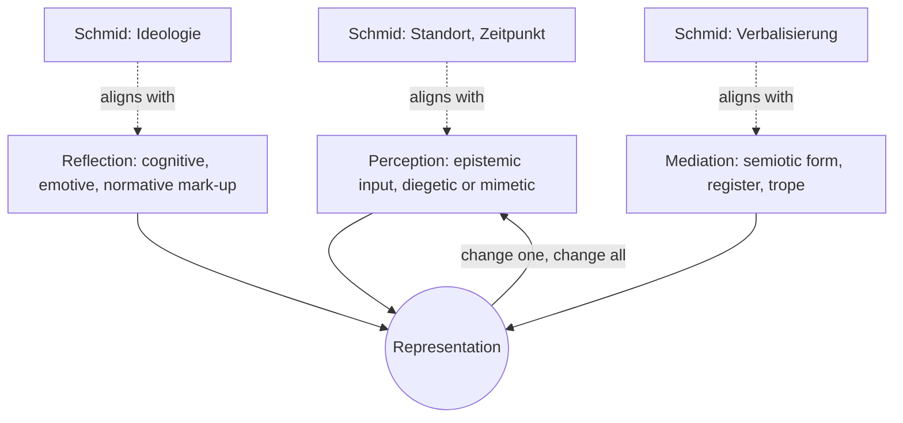
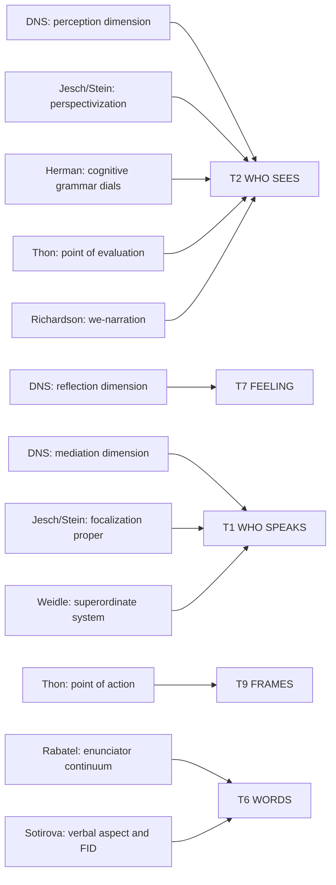
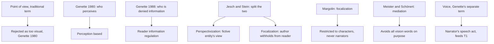

# BVX.0598 — Point of View, Perspective, and Focalization: Modeling Mediation in Narrative — Hühn, Schmid & Schönert, eds. (2009)
### Knowledge Entry — Distill

An edited-volume battlefield map of narratology's mediation vocabulary: fourteen essays, each trying to fix, split, or push past Genette's "focalization," converging on one law the rest of the texture shelf needs, who speaks is not who sees.

## TABLE OF CONTENTS
- [Core Thesis](#1-core-thesis)
- [Mind Models](#2-mind-models)
- [Framework](#3-framework--structure)
- [Key Concepts](#4-key-concepts)
- [Heuristics](#5-heuristics--decision-rules)
- [Invariants](#6-invariants)
- [Pitfalls](#7-pitfalls--myths)
- [Application](#8-application)
- [Cross-References](#9-cross-references)
- [Provenance](#10-provenance--confidence)

---

## 1 · CORE THESIS

Mediation runs through three interacting activities, perceiving, evaluating, and materializing into words, not a stack of independent categories. Genette's single term focalization actually names two different things: a fictive entity's subjective view, and the author's control over what the reader may know. Every essay here writes from that one seam.

---

## 2 · MIND MODELS

*Required. Minimum two diagrams, maximum five. See template §C for the rules.*

**Diagram 1 — the whole argument.**
Caption: *fourteen essays, three parts, one shared irritant: Genette's focalization has always secretly meant two things, and every essay here picks a side of that seam.*

**Diagram 2 — the central mechanism (the DNS, Dynamic Narrative System).**
Caption: *representation is not assembled from independent layers, it is the live output of three dimensions running at once, and moving one moves the other two.*

**Diagram 3 — mapped onto the Command's Ten Questions of the Telling.**
Caption: *nearly every essay in this volume feeds T2 WHO SEES, and several argue T2 needs sub-fields the current single focalization-mode value does not carry.*

**Diagram 4 — the terminological map: who uses which word for what.**
Caption: *"point of view" was retired for being too visual, and its replacement, focalization, immediately split into the same two meanings it was meant to end.*

---

## 3 · FRAMEWORK / STRUCTURE

Three parts, fourteen essays, one throughline: Part I re-specifies perspective at the theoretical core, Part II tests it against under-examined aspects (language, reception, the senses), Part III pushes it out of prose entirely, into drama, film, and games.

| Part | Essays | Governing question |
|---|---|---|
| **I · Re-Specifications of Perspective** | Meister & Schönert (DNS) · Margolin · Jesch & Stein · Rabatel · Martens · Herman · Richardson | Is Genette's focalization one concept or two, and what replaces or refines it? |
| **II · Some Special Aspects of Mediation** | Sotirova · Kubíček · Huck | What does perspective look like once you stop assuming a single, visual, language-neutral reader? |
| **III · Transliterary Aspects of Mediation** | Weidle · Schlickers · Kuhn · Thon | Do voice and focalization, distinguishable in prose, survive intact in drama, film, and interactive media? |

Part I's own spine is a single irritant worked seven ways: the DNS essay diagnoses focalization's two buried meanings and proposes a three-dimension process model instead of a taxonomy; Margolin resolves the ambiguity by amputation, keeping only the perceptual half; Jesch and Stein resolve it by naming both halves separately (perspectivization, focalization) and testing the split against a real text; Rabatel resolves it linguistically, as a continuum of markers rather than a binary; Martens, Herman, and Richardson each show a case (overt narration, cognitive construal, plural voice) where the tidy taxonomy visibly strains.

---

## 4 · KEY CONCEPTS

| Concept | What it is | Why it matters |
|---|---|---|
| **The DNS (Dynamic Narrative System)** | Meister and Schönert's model: mediation runs across three simultaneous dimensions, perception (input), reflection (cognitive/emotive/normative mark-up), and mediation proper (semiotic form), each on a diegetic vs mimetic axis | Replaces Genette's stacked, static layers with a dynamic system where changing one dimension predisposes the other two, "change one, change all" |
| **Genette's two focalizations** | In *Narrative Discourse* (1980), focalization means who perceives; in *Narrative Discourse Revisited* (1988), it means what the reader is allowed to know | The single term silently covers two operations, one epistemic, one communicative; this ambiguity is what the volume argues over |
| **Perspectivization vs focalization** (Jesch & Stein) | Perspectivization is a narrator's or character's subjective view; focalization is the author's withholding of information from the reader, tested against a three-level coherence standard | A testable definition of "withheld information," predicting four real combinations, from focalization-through-perspectivization to neither |
| **Focalization restricted to characters** (Margolin) | Focalization should name only storyworld participants' perception, simulation, empathy, and recollection; an "omniscient" narrator's voice is not focalized, since it is not position-dependent | The cleanest possible line around half the ambiguity Jesch and Stein diagnose, at the cost of leaving narratorial perspective unaddressed |
| **The enunciative continuum** (Rabatel) | A first speaker (produces the whole utterance) and an intratextual enunciator (filters content through evaluation) may or may not coincide; markers place a passage on a continuum from narrated through represented to asserted | Gives free indirect discourse a gradient description instead of a binary direct/indirect label |
| **Cognitive-grammar parameters** (Herman) | Reframes focalization as construal along independent dials: scanning, distance (distal/medial/proximal), scope, figure/ground, granularity, vantage point, objectivity/subjectivity | Focalization stops being one mode label and becomes a small vector of settings that can move independently within a passage |
| **Ocularization and auricularization** (Schlickers, Kuhn) | In film, focalization (knowledge) splits from ocularization (what is shown) and auricularization (what is heard); each can independently be zero, internal, or external | Voice and vision, distinguishable in prose, are fused in the camera, so the literary test has to be run once per channel |
| **Three perspectives in games** (Thon) | Point of view (spatial), point of action (agentic, the player's position), and point of evaluation (ideological) | Names an axis with no print equivalent, actional perspective, since the player occupies a position in the storyworld |
| **Wandering / plural focalization** (Richardson) | "We"-narration blurs homodiegetic/heterodiegetic and voice/focalization, the collective narrator's perspective shifting among its members | The tidy taxonomy breaking down in a common technique, not a theoretical edge case |
| **The superordinate narrative system** (Weidle) | In drama, an impersonal, extradiegetic narrating agency controls selection and arrangement though no narrator speaks | Voice does not require a speaking narrator; it can be structural and invisible, expressed only through composition |

---

## 5 · HEURISTICS & DECISION RULES

| Situation | Do this | Not this |
|---|---|---|
| Deciding whether a passage is "focalized" | Ask what the reader is denied that the coherence standard would otherwise supply | Ask only whose eyes the camera seems to be behind |
| Analyzing a limited third-person passage | Separately name the perceiving instance (perspectivization) and check what the reader gets beyond it (focalization) | Collapse both into one "point of view" label |
| Working with free indirect discourse | Place the passage on the narrated-to-represented-to-asserted continuum | Force a binary direct/indirect classification |
| Comparing a novel to its film adaptation | Track focalization, ocularization, and auricularization as three separate channels | Assume the camera's viewpoint alone settles "focalization" |
| Describing a scene's felt closeness | Use the cognitive-grammar dials (distance, scope, granularity, scanning) | Treat "limited third" as internally undifferentiated |
| Analyzing an interactive narrative | Track point of view, point of action, and point of evaluation as independent axes | Import literary categories unmodified, missing the agentic dimension |
| Encountering "we"-narration | Expect voice and focalization to wander independently within the group | Assume a plural narrator implies uniform, shared perception |
| A drama or screenplay has no narrator | Look for the superordinate narrative system, in selection, arrangement, motif | Conclude the text has no narratorial layer at all |

---

## 6 · INVARIANTS

1. Perceiving and speaking are logically independent operations; a narrator's position in the storyworld (voice) never by itself fixes whose eyes the reader sees through (focalization).
2. "Focalization" as Genette used it names two different operations, epistemic position and information regulation, and confusing them is the single most common error the volume corrects.
3. Mediation is a dynamic system, not a stack of independent layers; changing one dimension's setting (perception, reflection, mediation) predisposes the other two.
4. Every mediating instance, narrator, character, or camera, sits somewhere on a diegetic (narratorial) to mimetic (actorial) continuum, never fixed once for a whole work.
5. In non-literary media the channels literary theory treats as fused (voice and vision) come structurally apart, so the same tests must be run once per channel.
6. A collective or "we" narrator does not guarantee uniform focalization across its members; plural voice and singular, wandering focalization can and do coexist.
7. Interactive media add a position literary narrative has no equivalent for, an agentic point of action, alongside the perceptual and ideological positions it shares with print.

---

## 7 · PITFALLS / MYTHS

- Treating "point of view," "perspective," and "focalization" as interchangeable synonyms for one undifferentiated thing.
- Assuming a narrator's voice settles what the reader is allowed to know; voice and information regulation are separate decisions.
- Reading Genette's "focalization zero" as an absence of perspective rather than an unrestricted one.
- Holding one focalization label for a scene when dials like distance and granularity are visibly shifting within it.
- Assuming film's camera position alone determines "focalization," ignoring that ocularization and auricularization can diverge from it.
- Applying literary focalization categories to games unmodified, missing the actional (point of action) dimension.
- Assuming a narratorless text (drama, screenplay) has no narratorial layer, rather than an impersonal, structural one.
- Mistaking the visual bias in terms like "point of view" for a neutral, sense-independent vocabulary.

---

## 8 · APPLICATION

- **Spine level:** TEXTURE. A pure discourse-side source with no story-spine content; it earns no L0-L7 address.
- **12-layer character stack:** none, `feeds: []` explicit. The volume's own working assumption, that mediation is a property of the telling and never of the person told about, is the positive theoretical case for the exclusion the character system's SSOT already states via Card ([[BVX.0061]]): viewpoint is out of scope for all twelve layers.
- **plot_systems:** not applicable; the volume does not address events or the value-in/value-out engine.
- **Setting:** touched only glancingly, through description theory referenced in passing (pause and stretch as description's machinery); the volume's own center of gravity sits elsewhere, in mediation, not in place.

This is the shelf's densest source for T1 WHO SPEAKS and T2 WHO SEES, and the direct textual warrant for the texture layer's own law, who speaks is not who sees. Where the texture layer doc states that law in one line, this volume spends fourteen essays proving it cannot collapse back into one question: every attempt to re-fuse voice and vision, in prose, drama, film, or games, breaks on a real example within a page or two.

**For the texture system:**
- The volume's central law is the strongest available textual warrant for keeping T1 and T2 as two separate questions rather than one collapsed "point of view" field; it also surfaces a third axis, the DNS's dimension of reflection (evaluative, cognitive, emotive mark-up), that currently has no clean home among the ten.
- It feeds T2 WHO SEES hardest, and with more structure than the Ten Questions doc currently carries: Jesch and Stein's split argues T2's single "focalization mode" value is really two bundled decisions, a perceptual one (whose subjective view) and an informational one (what the reader is denied), and the TELLING PROFILE's T2 line should record both, not one.
- Thon's three-way split for games argues T2 needs an ideological sub-field distinct from the perceptual one (point of evaluation vs point of view); Herman's cognitive-grammar parameters argue the perceptual sub-field itself is not a single mode label but a small vector of independent dials (distance, scope, granularity, scanning), useful wherever a scene card's `telling:` line needs more resolution than "internal fixed."
- **OPEN candidate:** the DNS's dimension of reflection, the narrator's or character's cognitive, emotive, and normative mark-up of what is perceived (its Geisteshaltung), is argued here to be a necessary third axis alongside voice and focalization, and it does not map cleanly onto any current question. T7 FEELING is the closest fit but is defined as tone and reader-facing mood, not this in-text evaluative stance; worth a ruling on whether T7 absorbs it or a T2b is warranted.
- Cross-reference: this book's texture-only purity, no character-construction content anywhere in it, sharpens rather than blurs Card's boundary ([[BVX.0061]]): where Card excludes viewpoint from the twelve layers as an aside, this volume is the positive theory of why that exclusion is correct.

---

## 9 · CROSS-REFERENCES

| Related entry | Relation |
|---|---|
| [[BVX.0061]] | Card, *Characters and Viewpoint*: Card excludes viewpoint from character construction as an aside; this volume is the positive theory of why that exclusion holds, mediation belongs to the telling, not the told |
| [[BVX.0596]] | Bal, distilled in parallel: Bal's focalization and description-theory work sits directly upstream of Jesch/Stein's and Margolin's re-specifications here; compare her narrator/focalizer split to this volume's "who speaks is not who sees" law |
| [[BVX.0175]] | McKee, distance and dialogue craft: McKee's "show, don't tell" is the workshop-level version of the diegesis/mimesis distance dial this volume treats formally under T6 WORDS |

---

## 10 · PROVENANCE & CONFIDENCE

Distilled from a full-text pdftotext extraction (312pp). Closely read: the editor's Introduction (Hühn) in full, which summarizes all fourteen essays' individual arguments in sequence; Meister and Schönert's "The DNS of Mediacy" in full, including the terminology-revisited table (section 1.1) and the three-dimension model (section 3, subsections 3.4.1-3.4.3); Jesch and Stein's "Perspectivization and Focalization: Two Concepts, One Meaning?" in full, including the Kafka application (section 4). Herman's "Beyond Voice and Vision" was read closely for its cognitive-grammar parameter list and worked passages (distance, scope, granularity, scanning). Margolin, Rabatel, Martens, and Richardson (Part I); Sotirova, Kubíček, and Huck (Part II); and Weidle, Schlickers, Kuhn, and Thon (Part III) were read at heading level and through the Introduction's own detailed per-essay summaries, not independently extracted in full.

**Catalog note:** the task brief that generated this distill named Niederhoff, Jahn, and Nünning as likely essay authors, and Schmid as a probable essay contributor. None of the three former names is a contributing essayist in this volume's actual table of contents (fourteen essays under Meister & Schönert, Margolin, Jesch & Stein, Rabatel, Martens, Herman, Richardson, Sotirova, Kubíček, Huck, Weidle, Schlickers, Kuhn, and Thon). Niederhoff (2001) and Jahn (1996, 2005) appear only as cited secondary sources within the DNS essay and the Jesch and Stein essay; Nünning appears only on the series' editorial board. Wolf Schmid is a co-editor and the series' executive editor but contributes no standalone essay; his 2005 model (Standort/Zeitpunkt, Ideologie, Verbalisierung) is discussed by Meister and Schönert as the closest analogue to their own DNS, not authored fresh here. This is a mismatch between the brief's assumed contents and the book's actual contents, not a Zotero metadata error: the record's title, editors, year (2009), and series (Narratologia 17) all check out against the PDF's front matter.

## META
- Template: BVX-LEARN-v4.0
- Source classification: full-text pdftotext extraction; editor's introduction and two load-bearing essays (DNS of Mediacy; Perspectivization and Focalization) read in full, remaining essays sampled via TOC and the introduction's per-essay summaries
- Created / Updated: 2026-09-16
