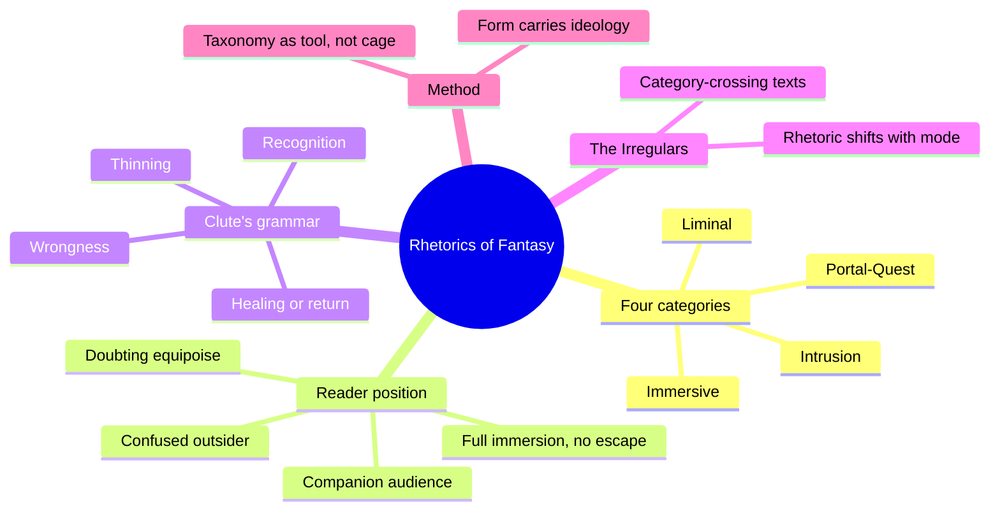
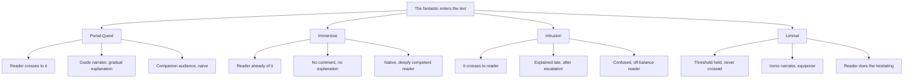
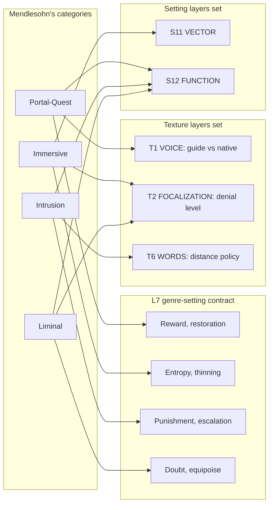
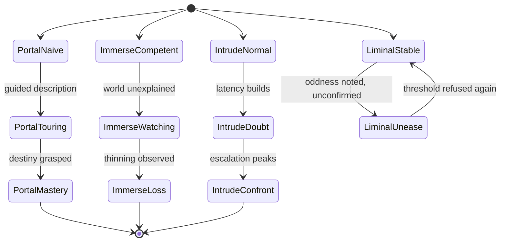

# BVX.0599 — Rhetorics of Fantasy — Farah Mendlesohn (2008)
### Knowledge Entry — Distill

The genre shelf's clearest case that a fantasy is defined by how the fantastic is delivered, not by what it contains: four categories, sorted by the means by which the fantastic enters the narrated world, each with its own narrator position, explanation policy, and reader position.

## TABLE OF CONTENTS
- [Core Thesis](#1-core-thesis)
- [Mind Models](#2-mind-models)
- [Framework](#3-framework--structure)
- [Key Concepts](#4-key-concepts)
- [Heuristics](#5-heuristics--decision-rules)
- [Invariants](#6-invariants)
- [Pitfalls](#7-pitfalls--myths)
- [Application](#8-application)
- [Cross-References](#9-cross-references)
- [Provenance](#10-provenance--confidence)

---

## 1 · CORE THESIS

Fantasy divides into four categories by how the fantastic enters the narrated world: portal-quest (we are led through), immersive (we are already of it), intrusion (it breaks into the frame world), and liminal (it hovers, uncrossed). Each demands its own rhetoric; techniques are not interchangeable across categories.

---

## 2 · MIND MODELS

*Required. Minimum two diagrams, maximum five.*

**Diagram 1 — the whole argument.**
Caption: *four categories, one grammar underneath them, and a fifth chapter whose job is to prove the first four are tools, not cages.*

**Diagram 2 — the central mechanism (four positions of the fantastic, relative to reader and frame world).**
Caption: *the same four questions, narrator, explanation, reader, answer differently in each category; that difference is the whole rhetorical system.*

**Diagram 3 — mapped onto the Command's L7, TEXTURE, and SETTING layers.**
Caption: *each category is a distinct genre-setting contract, and each sets specific texture and setting layers differently, not the same layers filled to different depths.*

**Diagram 4 — the reader's knowledge over time, per category.**
Caption: *portal-quest climbs to mastery, immersive watches a loss it never had to learn about, intrusion escalates toward a forced confrontation, liminal oscillates and refuses to resolve.*

---

## 3 · FRAMEWORK / STRUCTURE

The book is five interlocking essays plus an epilogue, unified by one recurring question per chapter: how do we get there, how do we meet the fantastic, and where are we asked to stand in relation to it. Not a system of props or plot beats; a system of delivery.

| Part | Governing move | Anchor texts |
|---|---|---|
| **Introduction** | States the four-category taxonomy, keyed to Clute's quadripartite grammar (wrongness, thinning, recognition, healing/return); distinguishes reader position from focalization/point of view | Booth, Attebery, Clute, Schlobin |
| **Ch. 1 Portal-Quest** | Entry, transition, negotiation; the club-story taproot (uninterruptible, incontestable narrator); reward and restoration | *The Lord of the Rings*, *The Lion, the Witch and the Wardrobe*, *The Scar* (as anti-quest) |
| **Ch. 2 Immersive** | No portal; the world assumed, not entered; ironic mimesis and double estrangement; thinning as the dominant mood; rationalized fantasy shares its logic with SF | *Perdido Street Station*, *The Pastel City*, magic realism as an immersive cousin |
| **Ch. 3 Intrusion** | The fantastic breaches the normal world; latency and escalation as the engine; can nest inside an immersive fantasy | *The Wolves in the Walls*, *The Woman in the Wall*, Anita Blake novels |
| **Ch. 4 Liminal** | The threshold is approached, never crossed; irony plus equipoise; reader, not protagonist, does the hesitating; the rarest, most demanding category | *Lud-in-the-Mist*, Aiken's Armitage stories, M. John Harrison |
| **Ch. 5 The Irregulars** | Texts that shift mode mid-narrative, or use one category's rhetoric to earn another category's effect; a stress test of the taxonomy, not an exception bin | *Vellum*, *The Legends of the Land*, *Galveston* |
| **Epilogue** | Taxonomy as tool kit, not color chart; belief, not classification, is the center every fuzzy set circles | — |

---

## 4 · KEY CONCEPTS

| Concept | What it is | Why it matters |
|---|---|---|
| **The four categories** | Portal-quest, immersive, intrusion, liminal, sorted by how the fantastic enters the narrated world | The book's whole taxonomy; not sorted by trope, setting, or age market |
| **Reader position** | Where the text asks the reader to stand relative to the fantastic, distinct from focalization or point of view | Mendlesohn's real variable; a first-person immersive and a first-person liminal text can share grammatical person and diverge completely in rhetoric |
| **Clute's quadripartite grammar** | Wrongness, thinning, recognition, healing/return, from the *Encyclopedia of Fantasy* | Every category plays all four notes; what differs is which note each category emphasizes |
| **Club story** | A tale told by an uninterruptible, incontestable narrator to a sheltered audience (Clute, via Conrad) | The taproot of the portal-quest's closed, hierarchical narrative authority; either the whole story is believed, or it collapses |
| **Ironic mimesis / double estrangement** | The immersive fantasy's technique: the reader sits between the shell around the narrative and the shell around the world, sharing the world's assumptions without comment (Westfahl) | Explains why the best immersive fantasy reads as unexplained rather than under-explained |
| **Rationalized fantasy** | Fantasy built with a coherent, discoverable system of rules, indistinguishable in technique from science fiction | The corollary to Clarke's Law: sufficiently immersive fantasy reads as SF because both demand a workable world |
| **Latency and escalation** | The intrusion fantasy's rhythm: withheld visuals or events, then rising magnitude and scope | The aural, musical engine of intrusion fantasy; horror and its heirs run on this cycle |
| **Equipoise** | Clute's term, related to but distinct from Todorov's hesitation: a positioned doubt shared between text and reader | The liminal fantasy's load-bearing mechanism; irony alone is not enough without it |
| **The transliminal moment** | M. John Harrison's term for the point where a crossing is offered and refused | Generates more fear, awe, and confusion than confrontation would; crossing reduces the fantastic, refusal intensifies it |
| **Fuzzy sets and taproot texts** | Attebery's fuzzy-set model of genre, extended by Clute's notion of a taproot text anchoring each fuzzy set | Mendlesohn's taxonomy is several linked fuzzy sets, not one, with liminal fantasy as the set most fully supported by the other three |
| **The anti-quest** | A portal-quest structure that denies the reward, the hero, or the resolution the form promises (*The Scar*) | Shows the rhetoric can be inverted while the underlying grammar, and the reader's trained expectation, stays intact |

---

## 5 · HEURISTICS & DECISION RULES

| Situation | Do this | Not this |
|---|---|---|
| Writing a world the protagonist is entering for the first time | Use a guide-narrator, gradual explanation, elaborate description | Assume the reader already understands the system |
| Writing a world the protagonist has always lived in | Withhold explanation entirely, let competence imply the rules | Have characters explain their own world to each other |
| Building horror or dread | Withhold the event, then escalate in scope and frequency | Reveal the threat early and hold it steady |
| Wanting sustained ambiguity, not resolution | Bring the reader to the threshold and hold it there | Have a character cross and normalize what's on the other side |
| Classifying an existing text | Check which rhetoric governs voice, explanation, and reader position | Classify by setting, props, or age market alone |
| A story changes category mid-narrative | Expect voice and distance to shift at the seam | Keep one register running across the mode-shift |
| Deciding how much of a magic system to show | Match the disclosure to the category: full and gradual for portal-quest, none for immersive | Apply one default disclosure policy to every fantasy |
| A plot looks like an anti-quest or a subverted structure | Trace whether the rhetoric (voice, authority, closure) still runs the old category's grammar underneath | Assume subverted plot content means subverted rhetoric too |

---

## 6 · INVARIANTS

1. Category is set by how the fantastic enters the text, never by its props, setting, or trappings.
2. Each category has its own rhetoric; a technique native to one category reads as leaden or overcontrived in another.
3. Reader position, not focalization or grammatical person, is the operative variable; any category can be told in first, second, or third person.
4. All four categories run Clute's four-note grammar (wrongness, thinning, recognition, healing/return); they differ in which note is emphasized.
5. Mixing categories forces a rhetorical shift at the seam; very few texts sustain more than one category at once, though immersive fantasies can host an intrusion.
6. The taxonomy is a comparative tool, not an exhaustive or fixed classification; texts that break it are essential evidence, not noise to discard.
7. Form carries ideological weight: the portal-quest's closed, hierarchical club-story authority and the intrusion fantasy's punitive treatment of the Other are structural, not incidental.

---

## 7 · PITFALLS / MYTHS

- Treating the four categories as a checklist of setting or plot features rather than a rhetorical/reader-position system.
- Writing an immersive fantasy with a portal-quest's guided, explanatory voice; it "will feel leaden."
- Writing a liminal fantasy with an intrusion fantasy's naive amazement; it "will feel overcontrived."
- Confusing reader position with focalization or point-of-view choice; the categories cut across grammatical person.
- Assuming intrusion fantasy always starts in the "real world"; it can nest inside an already-immersive fantasy.
- Equating liminal fantasy with slipstream or interstitial fiction; liminal stays inside the fantastic's belief-contract, slipstream does not.
- Assuming a quest plot guarantees portal-quest rhetoric, or that an anti-quest plot escapes the form's underlying grammar.
- Assuming the taxonomy claims universal applicability; Mendlesohn states outright that a theory claiming that is "not worth a damn."

---

## 8 · APPLICATION

- **Spine level:** TEXTURE (primary): the whole book is organized around T1 VOICE, T2 FOCALIZATION, and T6 WORDS as the site where category lives. SETTING (secondary): each category implies a distinct default for S11 VECTOR and S12 FUNCTION. L7 (genre): her four categories are four distinct genre-setting contracts, argued from delivery rather than component inventory.
- **12-layer character stack:** none. `feeds: []`. Mendlesohn explicitly excludes point-of-view/focalization-as-character-mechanism from her argument ("It is important to understand that I am not discussing point of view"); her reader-position claims are a texture-layer argument about narration and disclosure, not a character-function argument, so no L12 FUNCTION entry is warranted.
- **plot_systems:** contextual only. Clute's four-note grammar (wrongness, thinning, recognition, healing/return), which every category runs in a different balance, is a candidate template overlay once `04_PLOT_SYSTEMS/` opens, distinct from but compatible with the ladder's own signpost/beat machinery.
- **Setting:** applicable. Immersive fantasy's defining claim, that it is "a fantasy of thinning," is a direct description of an S11 VECTOR default (collapse, not restoration); portal-quest and intrusion fantasy both trend toward an S12 FUNCTION default of restoration or punishment rather than entropy.

Mendlesohn's book supplies the missing middle term between a genre's component list and its felt effect: the same magic system, monster, or quest structure reads as four different genres depending on who is told what, and when. Her four categories are not settings or plots; they are four different answers to "what does the text tell the reader, and who is allowed to already know it." That is a texture-layer claim wearing a genre-taxonomy coat, and it is why she keys hardest to T2 FOCALIZATION: her whole system is organized around what the reader is denied, and for how long.

**For the genre system:**
- L7's genre-setting contract currently reads as a list of conventions owed (props, tropes, obligatory scenes); Mendlesohn argues the contract also has to specify a *delivery mode*, how the strange enters the text and how (or whether) it gets explained, because two texts with identical components in different delivery modes are different genres in her account.
- She feeds T2 FOCALIZATION hardest: her four categories are, structurally, four settings of "what the reader is denied and for how long" (full and gradual for portal-quest, total for immersive, delayed for intrusion, permanent for liminal), with T1 VOICE and T6 WORDS as the load-bearing seconds.
- The case that a genre entry needs a delivery-mode field beside its component list: a checklist of magic-system, monster, and quest-goal cannot distinguish an immersive fantasy from a portal-quest fantasy built from the same parts; only the entry/explanation rhetoric does, so L7 genre entries should carry a delivery-mode slot, not just a convention list.
- OXO's DCUS is an **immersive fantasy** in Mendlesohn's terms: Tori and her classmates are natives of the Sync/Feed/Star-Rating system from the first page, not visitors led through it by a guide-narrator; there is no portal, no tour, and the system is used, not explained. That entails T2 FOCALIZATION set to high informational denial (Sync is inferred from use, never tutorialized) and T1 VOICE set to an assumed-competent narrator; on the setting side it entails S11 VECTOR running a thinning/collapse trajectory, exactly DCUS's already-instanced clean-to-NEON-ROT-to-hunt descent, which is Mendlesohn's diagnostic claim that immersive fantasies are, structurally, fantasies of entropy rather than discovery.
- OPEN candidate: the model has no notation for a text (or a Movement) that changes genre-setting contract mid-narrative, the way Harry Potter opens as intrusion and transmutes into portal-quest, or the way Mendlesohn's Irregulars chapter treats mode-shift as a rhetorical event with its own signature. A genre-setting contract may need a state track parallel to Axis 4 TIME (setting states) and the texture layer's own T12 storyform binding, rather than one fixed contract per work.

---

## 9 · CROSS-REFERENCES

| Related entry | Relation |
|---|---|
| [[BVX.0614]] | Todorov, *The Fantastic*; Mendlesohn builds liminal fantasy in explicit, partial disagreement with Todorov's hesitation, naming equipoise as the broader term and stating that his concern with "the fantastic" is encompassed within but does not describe the whole liminal category |
| [[BVX.0349]] | Kennedy, *Against Worldbuilding*; both books argue that what a text withholds does more work than what it states, Kennedy's gutter/iceberg and Mendlesohn's informational denial are the same mechanism named from craft and from taxonomy respectively |
| [[BVX.0576]] | Selbo, *Film Genre for the Screenwriter*; a parallel genre-as-contract argument in a sibling medium, worth cross-checking where screen genre's convention-and-obligatory-scene model does or doesn't need Mendlesohn's delivery-mode axis |
| [[📐 ssot_01_texture_system.md]] | The TEXTURE SLICE this distill feeds hardest at T2 FOCALIZATION; §8 above states the mapping directly |
| [[📐 ssot_03_setting_system.md]] | The DCUS instance already runs the S11 VECTOR collapse arc Mendlesohn's immersive-fantasy claim predicts independently |

---

## 10 · PROVENANCE & CONFIDENCE

Full text, pdftotext extraction, 348-page source, approximately 145,000 words. Read closely: the Health Warning, the front-matter definitions, the full Introduction (including "A Note on the Selection of Texts" and "The Categories"), and the opening and closing sections of all four category chapters (Portal-Quest, Immersive, Intrusion, Liminal), including the "Rationalized Fantasy" subsection of chapter 2. Chapter 5 ("The Irregulars") read at heading and case-study level: its framing opening, the Legends of the Land and Galveston discussions sampled in full, remaining case studies (the Peter Beagle and related material) sampled at paragraph level. The Epilogue read in full. The body of each chapter's worked close readings (The Lord of the Rings, The Scar, Perdido Street Station, The Wolves in the Walls, The Woman in the Wall, Lud-in-the-Mist, lost boy lost girl, The Separation) sampled rather than read start to finish; quotations in §3 and §4 above are drawn from passages read directly. Notes, Bibliography, and Index not read.

The mapping onto L7, TEXTURE, and SETTING in §2 (Diagrams 3 and 4) and §8 is this distill's synthesis; Mendlesohn never references the Command, OXO, DCUS, or the twelve-layer stacks. The `feeds: []` call and the OXO category assignment (immersive) are inferences built directly from her own definitional passages (the immersive fantasy as a "fantasy of thinning," her explicit exclusion of point-of-view/focalization from the reader-position argument), cross-checked against `ShroomsQ/_CANON/_SSOT/03_SETTING_SYSTEMS/📐 ssot_03_setting_system.md`'s existing DCUS S11/S12 instance, which independently already runs a collapse trajectory.

## META
- Template: BVX-LEARN-v4.0
- Source classification: full-text book, pdftotext extraction, deep read on Introduction and all four category-chapter frames, heading/case-study-level sampling on Chapter 5 and the worked close readings throughout
- Created / Updated: 2026-09-16
