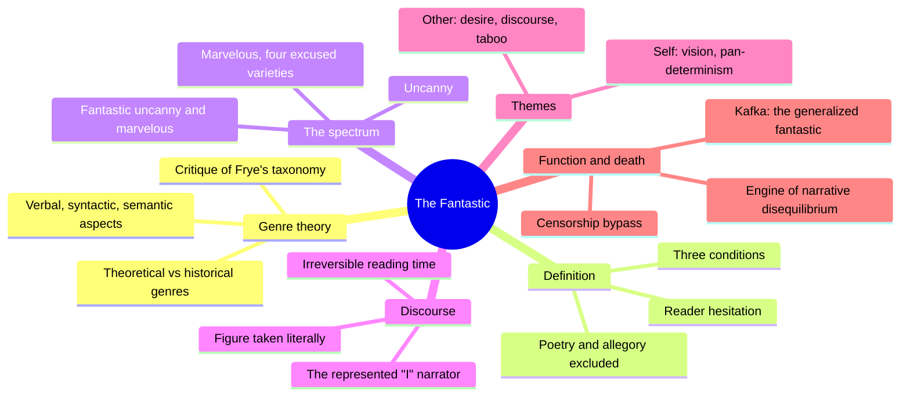
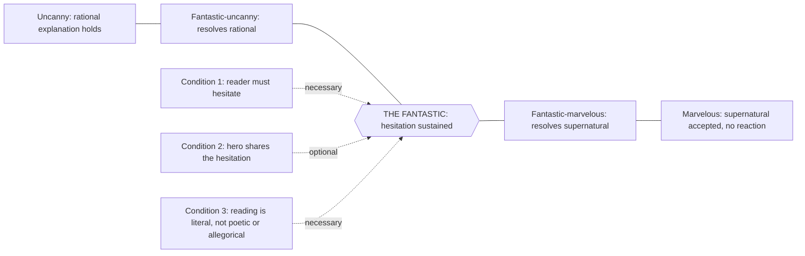
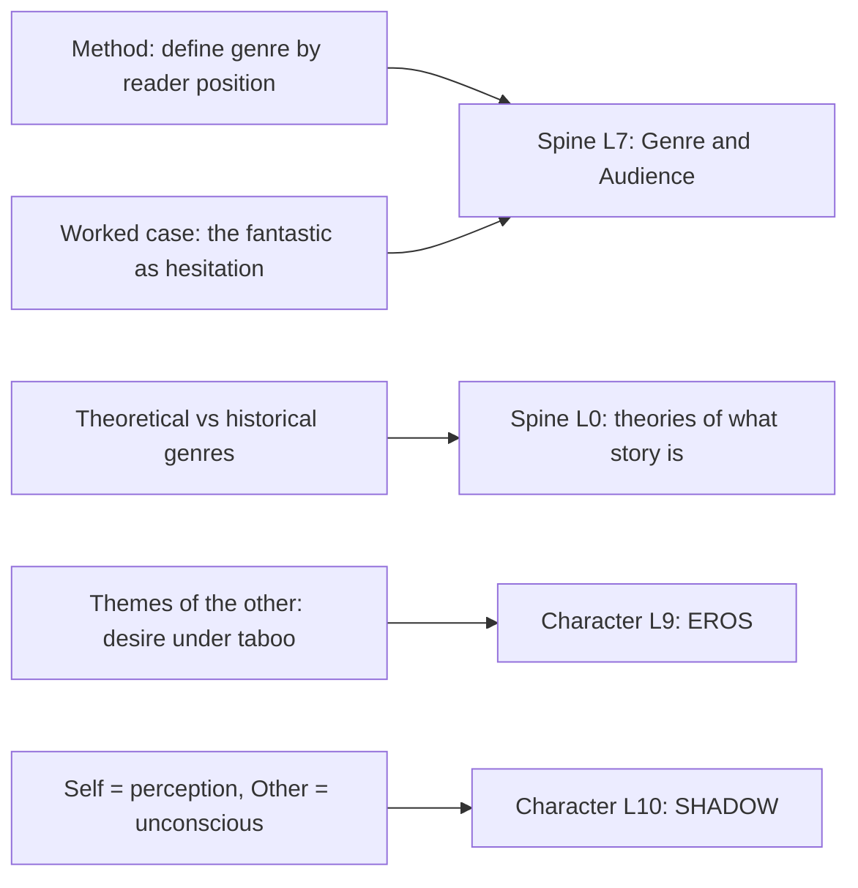
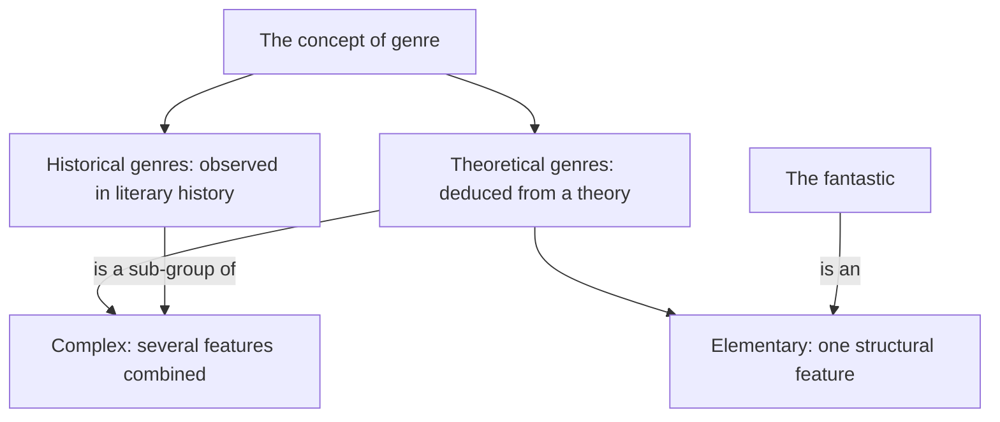

# BVX.0614 — The Fantastic: A Structural Approach to a Literary Genre — Tzvetan Todorov (1975)
### Knowledge Entry — Distill

The founding structuralist account of genre-as-reader-position: a genre defined not by its props but by where it puts the reader, worked out through one genre, the fantastic, that lives entirely inside a sustained hesitation between a natural and a supernatural explanation of an event.

## TABLE OF CONTENTS
- [Core Thesis](#1--core-thesis)
- [Mind Models](#2--mind-models)
- [Framework](#3--framework--structure)
- [Key Concepts](#4--key-concepts)
- [Heuristics](#5--heuristics--decision-rules)
- [Invariants](#6--invariants)
- [Pitfalls](#7--pitfalls--myths)
- [Application](#8--application)
- [Cross-References](#9--cross-references)
- [Provenance](#10--provenance--confidence)

---

## 1 · CORE THESIS

A genre is a structural position a reader is asked to take, not an inventory of props. The fantastic names one such position: a text that holds the reader, hesitating without resolution, between a natural and a supernatural explanation of an event inside an otherwise ordinary world. Resolve the hesitation and the text becomes the uncanny or the marvelous instead.

---

## 2 · MIND MODELS

**Diagram 1, the whole argument.**
Caption: *ten chapters resolve into one method (chapters 1 to 3) applied twice, once to the sentence and narrator (5) and once to theme (6 to 9), then turned on its own genre's death (10).*

**Diagram 2, the central mechanism.**
Caption: *the fantastic is not a genre with content, it is the median line itself; three conditions hold the reader there, and the story's ending, not its imagery, decides which side it falls to.*

**Diagram 3, mapped onto the Command's systems.**
Caption: *almost everything in the book is aimed at one spine level; only the themes chapters reach down into the character stack, and only lightly.*

**Diagram 4, theoretical vs historical genres.**
Caption: *a historical genre like the Gothic novel is what critics observe already existing; a theoretical genre like the fantastic is deduced first and only then checked against real books, and the fantastic is the rarer, harder kind.*

---

## 3 · FRAMEWORK / STRUCTURE

Ten chapters in three movements. **Setup (1 to 4):** chapter 1 dismantles Frye's Anatomy of Criticism as a method (a catalogue of "often," not a rule), then proposes that a genre must be located on one of a work's three aspects, verbal, syntactic, semantic, and that genres come in two kinds, historical (observed) and theoretical (deduced), with historical genres a sub-case of complex theoretical ones. Chapter 2 gives the definition: (1) the reader takes the text's world as real and hesitates between a natural and supernatural account of an event, (2) optionally, a character shares that hesitation, (3) the reader refuses a poetic or allegorical reading. Chapter 3 places the fantastic on a five-point spectrum between the uncanny and the marvelous. Chapter 4 (skimmed here) rules out poetry, non-representative by nature, and allegory, which cashes out its own ambiguity, as neighboring but incompatible genres. **The machine (5 to 9):** chapter 5 traces the definition's consequences at the sentence level (figurative language read literally), the narration level (the "dramatized" first-person narrator, neither fully trusted nor fully suspect), and reading time (the genre is irreversible; knowing the end destroys it). Chapters 6 to 9 turn to theme: chapter 6 rejects existing image-catalogues (Caillois, Penzoldt, Vax) as unruled lists, proposing instead a distributional method, group by what co-occurs, before interpreting. Chapter 7 finds the "themes of the self": the limit between mind and matter has broken down (pan-determinism, metamorphosis, dissolved subject and object, elastic time and space), a network of vision. Chapter 8 finds the "themes of the other": desire under taboo, escalating from sexuality through incest and necrophilia to cruelty and death, a network of discourse. Chapter 9 draws the two together as poetics, not interpretation, and hazards an analogy, self to perception-consciousness (childhood, drugs, psychosis), other to unconscious impulse (neurosis). **The turn (10):** Todorov steps outside the genre to ask why it exists, then why it died, closing on Kafka.

---

## 4 · KEY CONCEPTS

| Concept | What it is | Why it matters |
|---|---|---|
| **Theoretical vs historical genre** | Deduced kinds versus observed-in-history kinds; historical genres are a sub-group of complex theoretical ones | The method itself: a genre is justified by structure, not by being a familiar shelf category |
| **The three conditions** | Reader hesitation (necessary), hero hesitation (optional), literal not poetic/allegorical reading (necessary) | Only two of the three are load-bearing |
| **Hesitation** | The undecided state, reader's and usually hero's, between a natural and supernatural account of one event | The fantastic's entire substance; a relation, not a content |
| **The spectrum** | Uncanny, fantastic-uncanny, the pure fantastic (a median line, not a zone), fantastic-marvelous, marvelous | Famous "fantastic" works (the Gothic novel) mostly sit off-center; the pure fantastic is rare and unstable |
| **The four excused marvelous** | Hyperbolic (exaggeration), exotic (unfamiliar to the narrator's world), instrumental (period gadgets), scientific (magnetism, science fiction) | Separates "pure" marvelous from marvelous-with-an-alibi; science fiction is the modern instrumental/scientific case |
| **Figure taken literally** | A supernatural event often literalizes an idiom already in the text ("as if," "seemed") | The supernatural is generated by language, not just described in it |
| **The represented narrator** | A first-person, "dramatized" narrator: exempt from the truth-test as narrator, subject to it as character | Carries identification and doubt at once; the marvelous rarely needs "I" |
| **Irreversible reading time** | The genre depends on start-to-end order; knowing the ending in advance collapses it | Ties the genre to the act of reading, not only to its content |
| **Themes of the self / vision** | Pan-determinism, metamorphosis, dissolved subject-object and self-other limits, elastic time and space | Correlates with descriptions of childhood, drugs, psychosis |
| **Themes of the other / discourse** | Desire under taboo: incest, plural love, necrophilia, sadism, cruelty, death, always against a censoring authority | Correlates with neurosis and repression |
| **Poetics vs interpretation** | Poetics states what is present (verifiable); interpretation assigns meaning (never uniquely provable) | A genre distill belongs to poetics, not to fixed-symbol reading |
| **Function of the supernatural** | Socially, a bypass of censorship; narratively, the fastest engine for breaking a stable equilibrium | Explains why storytellers, not analysts, reach for it |
| **The generalized fantastic (Kafka)** | The abnormal opens the story and the world normalizes around it, instead of disrupting a normal world | How the classical genre ends; the exception becomes the rule |

---

## 5 · HEURISTICS & DECISION RULES

| Situation | Do this | Not this |
|---|---|---|
| Deciding whether a text or scene is "fantastic" | Check whether the natural/supernatural ambiguity is still open at that point, and check the ending | Judge by surface furniture (ghosts, castles, ray guns) or by whether it scared you |
| Defining a genre for a system or shelf | Deduce it from a structural relation, here the reader's stance toward an event, then verify against real texts | Build a catalogue of recurring images or beats and call the catalogue the genre |
| A supernatural or uncanny event needs to land fast in a plot | Use it to break a stable equilibrium directly, the fastest engine narrative has | Rely on accumulating coincidence, which reads as contrivance |
| Interpreting a recurring image (double, mirror, vampire) | Ask what it means inside this work's own network of co-occurring themes | Assign it one fixed universal meaning and carry it unexamined to the next text |
| Taboo content (desire, violence) needs a way into the text | Consider a supernatural register as the historical bypass mechanism, one of the genre's two purposes | Treat the supernatural marker as decoration unconnected to what it lets the text say |
| Planning a long or serial "sustained mystery" register | Know the pure fantastic is evanescent, a median line one sentence can collapse | Expect a series to hold true hesitation indefinitely without sliding to uncanny or marvelous |

---

## 6 · INVARIANTS

1. The fantastic is defined relationally, against the uncanny, the marvelous, poetry, and allegory; it has no substance of its own.
2. Only two of the three defining conditions are strictly necessary, reader hesitation and literal reading; character hesitation is not, though most examples supply it.
3. The genre exists only in the present tense of reading; the marvelous is the genre of an accepted future, the uncanny of an explained past.
4. The spectrum is continuous and asymmetric, not a binary switch, and a work's genre can be decided only by cutting it at a chosen endpoint.
5. Poetics (what is present) and interpretation (what it means) are different activities; a genre account belongs to the first and must not slide into the second.
6. One syntactic function, breaking a stable equilibrium fast, explains why the supernatural clusters in storytellers rather than in psychological analysts.
7. The literary function (transgressing a narrative rule) and the social function (transgressing a taboo) of the supernatural are the same operation seen from two sides.
8. The genre is historically bounded (Cazotte to Maupassant) and ends once a rival vocabulary, psychoanalysis, and a rival technique, Kafka's normalized abnormal, absorb what it alone used to do.

---

## 7 · PITFALLS / MYTHS

- Treating the fantastic as a subject matter (ghosts, vampires, castles) instead of a structural effect: Radcliffe's "explained supernatural" and Lewis's "accepted supernatural" both feel fantastic mid-read, but the genre is decided at the ending.
- Making fear or "irreducible strangeness" the criterion (Lovecraft, Caillois): fear is common but neither necessary (Hoffmann, Villiers de l'Isle-Adam have none) nor sufficient (fairy tales can frighten without being fantastic).
- Assuming a list of concrete images (the vampire theme, the double theme) constitutes a theory: no rule generates or limits Caillois's or Penzoldt's catalogues, only an unruled inventory.
- Treating the detective story and the fantastic as the same trick because both defer a solution: they are structural opposites in emphasis, one stakes everything on the solution, the other on the reaction.
- Reading "self" and "other" as content labels (psychology, sexuality) rather than as the formal distribution classes, what co-occurs, that happen to correlate with that content.
- Collapsing the marvelous into "the fairy tale": the fairy tale is one style of the marvelous, not its definition; hyperbolic, exotic, instrumental, and scientific marvelous are each excused variants of it.

---

## 8 · APPLICATION

- **Spine level:** L7 (Genre and Audience), primary; the entire book is a worked case of "genre as reader-contract." L0 (theories of what story is), secondary; the theoretical/historical genre split is a rival root-claim about what a literary kind is, alongside Dramatica's argument theory.
- **12-layer character stack:** L9 EROS, supporting, via the themes-of-the-other chapter's account of desire structured, escalated, and disguised under taboo. L10 SHADOW, contextual, via Todorov's own (hedged) analogy between the self/other split and the perception-consciousness/unconscious-impulse split.
- **plot_systems:** applicable narrowly. Todorov's minimal-narrative primitive, a movement between two non-identical equilibriums, with the supernatural as the fastest available engine for the middle disequilibrium, is a clean, general-purpose unit comparable to Bal's event-as-transition; useful wherever a scene needs the quickest possible break in a stable situation.
- **Setting:** touches the L7 touchpoint (genre-setting contracts) rather than the setting slice directly; not separately applicable here.

DCUS reads as a case built to test against this spectrum. Its opening register (Southern Gothic campus, Feed-linked clothing, Sync mechanics not yet explained) plays briefly in the fantastic-uncanny zone, strange enough to raise the supernatural question, resolved eventually by institutional and technological explanation (S12: the Administration, the Star-Rating, the rename lattice). But the deeper fit is not the classical spectrum, it is the book's account of the genre's death. DCUS's abnormal, an institution that erases a place's history twice and enforces legibility through Feed-linked clothing, is given from page one as the campus's ordinary weather, not as a disruption of a normal world. That is Todorov's Kafka shape: the exception given as the rule, so the reader's work is not discovering that something is wrong but watching how long everyone, reader included, takes to finish adapting to what was already wrong. That commits the telling to a Gregor Samsa-style adaptation curve rather than a Radcliffe-style unmasking scene, which is already what Tori's Growth: Stop arc against the meritocratic promise (S9 ALLURE) is built to do.

**For the genre system:**
- Todorov gives L7 a method, not another convention list: define a genre by the structural position it holds the reader in (hesitate, resolve natural, resolve supernatural) rather than by an inventory of stock furniture, the discipline the trade's genre wheels and prop lists lack.
- He feeds L7 hardest by a wide margin; almost the whole book is one worked L7 case, with L0 touched only in service of the same argument.
- The genre model needs a field beside the component list for what a text does to the reader's epistemic stance and for how long: recommend a `resolution_mode` value on the L7 genre-contract entry (sustained hesitation, resolves natural, resolves supernatural, normalized-from-the-start) alongside the existing convention inventory.
- OXO sits mostly outside the classical spectrum: DCUS's early Sync-and-Feed ambiguity is fantastic-uncanny, but the series runs on Kafka's generalized-fantastic move, the abnormal given as background norm, which commits it to an adaptation-curve payoff rather than an unmasking-scene payoff.
- OPEN candidate: a rival vocabulary can fully absorb a genre's content and end it (Todorov's account of the fantastic's death); the L7 doctrine has no historicity or expiry note tracking when a convention set stops doing work a text cannot do without it.

---

## 9 · CROSS-REFERENCES

| Related entry | Relation |
|---|---|
| [ShroomsQ/_CANON/_SSOT/01_NARRATIVE_FRAMEWORKS/_narratology_shelf/frameworks/Tier 3/GT-3505 Genre and Narrative Typology/3todorovgenre_genres_as_structures_framework_todorov.md](../../ShroomsQ/_CANON/_SSOT/01_NARRATIVE_FRAMEWORKS/_narratology_shelf/frameworks/Tier%203/GT-3505%20Genre%20and%20Narrative%20Typology/3todorovgenre_genres_as_structures_framework_todorov.md) | The shelf's prior one-sheet paraphrases Todorov as an "evolutionary/dynamic genre theory" (flexible, responsive, adaptive) built without the source text; this distill replaces that vocabulary with the book's actual method, theoretical versus historical genres, elementary versus complex, deduced from structure not observed as a trend |
| [ShroomsQ/_CANON/_SSOT/01_NARRATIVE_FRAMEWORKS/_narratology_shelf/frameworks/Tier 3/GT-3505 Genre and Narrative Typology/4todorovfmf_fantastic_mode_framework_todorov.md](../../ShroomsQ/_CANON/_SSOT/01_NARRATIVE_FRAMEWORKS/_narratology_shelf/frameworks/Tier%203/GT-3505%20Genre%20and%20Narrative%20Typology/4todorovfmf_fantastic_mode_framework_todorov.md) | The shelf's prior one-sheet flattens "hesitation" into a single bullet under generic narrative-mode categories (POV, style, tense); this distill supplies the book's own three conditions, the five-point spectrum, the four excused varieties of the marvelous, and the Kafka argument for the genre's end, none of which the one-sheet carries |
| [[BVX.0599]] | Mendlesohn's four rhetorics of fantasy (portal-quest, immersive, intrusion, liminal) descend from exactly this uncanny-marvelous spectrum; compare her categories against Todorov's fantastic-uncanny and fantastic-marvelous once her distill lands |
| [[BVX.0581]] | Bawarshi and Reiff's rhetorical genre theory (genre as recurrent social action) is a rival answer to the same question Todorov asks; both reject the prop-list definition of genre, but locate the alternative in different places, reader-position here, recurrent social situation there |
| [[BVX.0175]] | McKee's genre chapter treats genre as an audience contract of obligatory conventions, the convention-and-prop-list method Todorov's structural method is built to replace; a direct, useful contrast for the L7 "reader-position versus component-list" argument |

---

## 10 · PROVENANCE & CONFIDENCE

Full text, pdftotext extraction (185 pages, approximately 59,000 words). Read in full: chapters 1, 2, 3, 5, 7, 8, 9, and 10 (genres, definition, the spectrum, discourse, both theme chapters, the conclusion, and Kafka). Read at a lighter, argument-level pass: chapter 4 (poetry and allegory), for its two structural exclusions rather than example by example, and chapter 6 (introduction to themes), for its rejection of prior catalogues and its distributional method rather than every cited critic. Back-matter checked only to confirm names and dates.

The extraction carries OCR noise (dropped diacritics, garbled ligatures, occasional line-order scrambling in dense quotations); reproduced as given, cleaned only where the intended word is unambiguous. The mapping onto L7, L0, L9, and L10 is my inference, not Todorov's; he never mentions the Command, OXO, DCUS, or the character stack. Catalog rot confirmed: the Zotero record lists "Reeder, Todorov, Howard" as authors. Todorov is the sole author, Richard Howard the translator, Robert Scholes wrote the foreword; "Reeder" matches no contributor on the title or copyright page and appears to be metadata noise, not a name to preserve.

## META
- Template: BVX-LEARN-v4.0
- Source classification: full-text book, pdftotext extraction
- Created / Updated: 2026-09-16
