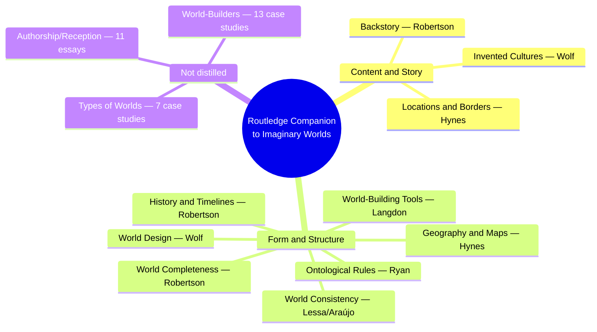
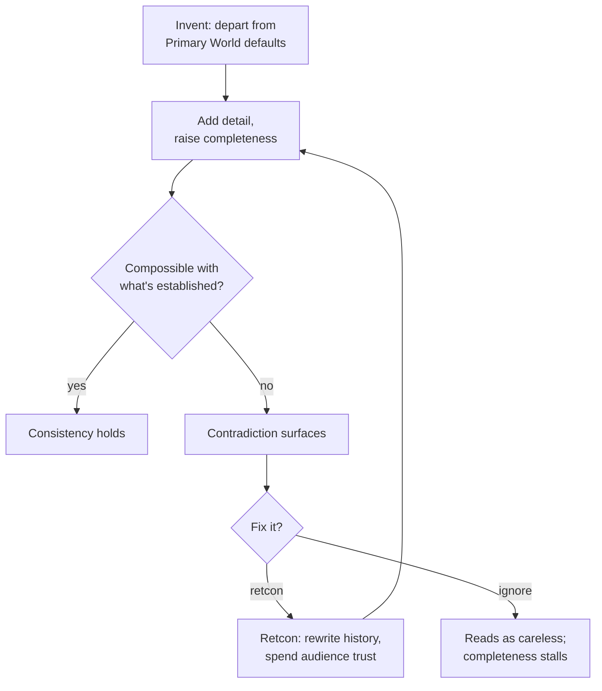
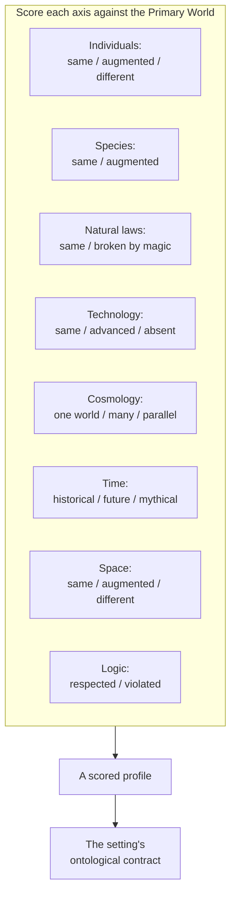
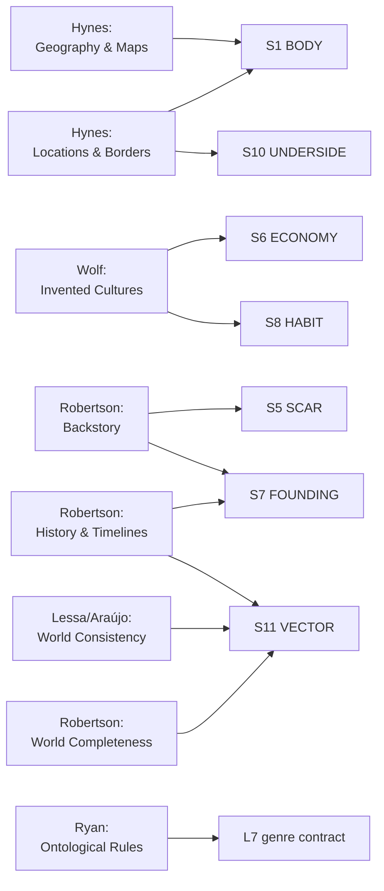

# BVX.0630 — The Routledge Companion to Imaginary Worlds — ed. Mark J. P. Wolf (2018)
### Knowledge Entry — Distill

Forty-nine essays by thirty-four scholars, split into five parts; this distill covers the ten essays of Parts 1–2 (Content and Story; Form and Structure) that carry transferable SETTING-system method, and skips the thirty-one single-world case studies in Parts 3–5 already served in spirit by BVX.0575's narrower twelve-essay slice.

## TABLE OF CONTENTS
- [Core Thesis](#1-core-thesis)
- [Mind Models](#2-mind-models)
- [Framework](#3-framework--structure)
- [Key Concepts](#4-key-concepts)
- [Heuristics](#5-heuristics--decision-rules)
- [Invariants](#6-invariants)
- [Pitfalls](#7-pitfalls--myths)
- [Application](#8-application)
- [Cross-References](#9-cross-references)
- [Provenance](#10-provenance--confidence)

---

## 1 · CORE THESIS

A world is judged on four separable, auditable qualities — invention, completeness, consistency, coherence — not one vague "does it feel real." Ryan's ontological-rules axes replace a genre label with a scored checklist of named departures from the Primary World. Borders, backstory, and timelines are productive gaps, not just decoration or absence.

---

## 2 · MIND MODELS

*Required. Minimum two diagrams, maximum five.*

**Diagram 1 — the whole argument.**
Caption: *ten essays across two parts carry transferable method; the other thirty-nine, in three parts, are case studies and media theory — cite them, don't distill them for this shelf.*

**Diagram 2 — the central mechanism (a process, run across four essays).**
Caption: *invention buys completeness, completeness spends consistency, and a retcon is the only way to buy consistency back — at a real, named cost.*

**Diagram 3 — the central diagnostic (a taxonomy of scored axes).**
Caption: *nine scored choices, not one genre word — naming the combination is the setting's ontological contract.*

**Diagram 4 — mapped onto the Command's SETTING SLICE (S1–S12).**
Caption: *the Form-and-Structure half clusters on S11 VECTOR and L7 — this book is the diagnostic-vocabulary complement to BVX.0458's build order and BVX.0575's case-study coherence.*

---

## 3 · FRAMEWORK / STRUCTURE

Forty-nine essays in five parts; this distill draws only on Parts 1–2, the theory core:

| Part | Chapters | Distilled here | What it covers |
|---|---|---|---|
| 1. Content and Story | 8 | Locations and Borders; Invented Cultures; Backstory | Recurring content building blocks: place, language, culture, history, narrative texture, saviors, portals |
| 2. Form and Structure | 10 | World Design; Ontological Rules; World Completeness; World Consistency; Geography and Maps; History and Timelines; World-Building Tools | How to measure and audit a world, not just build one |
| 3. Types of Worlds | 7 | none | Case studies by world-type (islands, underground worlds, planets, utopias, virtual worlds…) |
| 4. Authorship and Reception | 11 | none | Canonicity, retcon, fandom, escapism, genre, worlds as satire/paracosm/experiment/politics |
| 5. Worlds and World-Builders | 13 | none | Single-world case studies (More's Utopia, Tolkien's Arda, Roddenberry's Star Trek, Minecraft…) |

Parts 1–2 are essay-per-concept, not essay-per-world: each names one auditable quality or structural device and shows it across many worlds at once, rather than reverse-engineering one world in full (the method BVX.0575 uses).

---

## 4 · KEY CONCEPTS

| Concept | What it is | Why it matters |
|---|---|---|
| **Invention / completeness / consistency (Wolf's triad)** | Three separable qualities: how far a world departs from the Primary World, how thoroughly it's filled in, how free of contradiction it is | A weak spot in one doesn't sink the others; names which specific quality a stalled setting is actually missing |
| **Ontological rules (Ryan)** | Nine named axes, each scored same/augmented/different against the Primary World | Turns "pick a genre" into an explicit, auditable checklist rather than a vibe |
| **Principle of minimal departure** | Readers assume the Primary World fills every gap a text doesn't explicitly change (Ryan, after Walton's "reality principle") | The default that makes partial worldbuilding readable; change only what needs changing, let inference carry the rest |
| **Emergent completeness** | Completeness isn't fixed in the text; it emerges from readers piecing together text, paratext, and intertext over time (Robertson) | A world can feel complete through fan wikis and ancillary material even when no single book states everything |
| **Immersive vs. portal-quest delivery** | Portal: a guide-character explains the world to a newcomer standing in for the reader. Immersive: the text assumes the reader already belongs, no guided tour | A deliberate choice for how much founding history a scene states outright versus leaves the reader to infer |
| **Backstory conditions, it doesn't just explain** | Borrowed from Marxist determinism: what happened before doesn't just justify the present, it constrains what can be thought, said, or built now | Backstory is infrastructure, not flavor text; it limits future material, it doesn't just decorate past material |
| **Three-dimensional consistency** | Consistency operates on single entities, on compossibility between elements, and on conformity to genre/franchise expectations — three axes, each can pass or fail independently | James Bond's changing actors are "consistently inconsistent" (predictable, self-aware); Jupiter Ascending's plot holes aren't — the difference is which dimension breaks |
| **Retcon economics** | Rewriting established history to preserve consistency is always available but always spends audience trust; never a free action | Treat every established fact as canon until a retcon is deliberately named and paid for |
| **Map as paratext vs. artifact** | Paratext (an endpaper map) orients the audience from outside the world; artifact (a map a character consults) exists inside the world and must reflect its own culture's cartography | The same geography reads differently depending on which one it is; an artifact map defaulting to north-up, modern fonts quietly imports Primary World assumptions |
| **Water margins** | The unmapped, undescribed edge of a world (Clute) — not necessarily water, any impassable barrier — framing "what's on the map is all there is" | A deliberate design choice, not an unfinished world; a blank edge invites speculation and leaves room for sequels |
| **Borders, boundaries, polder, crosshatch, dyadic world** | Border = line between two adjacent places. Boundary = line around one place. Polder = an enclave actively defended against the Wrongness outside it. Crosshatch = two domains sharing one territory, barely distinguished. Dyadic world = one setting housing two domains under contrary rules | A vocabulary for internal world division sharper than "there's a wall"; a polder (Lothlórien) reads differently than a crosshatch (Miéville's twin cities) though both put two realities in contact |
| **Invented culture as environment-plus-resources** | A culture is the solution-set a people build from their terrain and available materials, not an aesthetic chosen freely (Wolf) | Two deserts, two different answers (Fremen stillsuits vs. Tatooine moisture farms) — culture design should trace back to a stated environment, not get invented first and justified after |

---

## 5 · HEURISTICS & DECISION RULES

| Situation | Do this | Not this |
|---|---|---|
| Picking a genre for a new setting | Score it against Ryan's nine ontological axes explicitly | Reach for a single genre label and hope it holds together |
| Deciding how much founding history to state on-page | Choose portal (a guide-character explains it) or immersive (assume the reader belongs) deliberately | Drift between explaining and assuming within the same scene |
| Writing backstory | Ask what it constrains going forward, not just what it explains | Treat it as flavor text with no downstream cost |
| Adding detail to raise completeness | Check it against everything already established first | Add it and check for contradictions later |
| Finding a contradiction in established canon | Name it as a retcon and decide if the story is worth the trust it spends | Quietly overwrite and hope no one notices |
| Drawing or describing a map | Decide first whether it's a paratext (for the audience) or an artifact (for the world) | Default to north-up, modern cartographic convention without asking what in-world mapmakers would produce |
| Leaving part of the world unmapped | Treat the edge (water margin) as a deliberate frame | Apologize for or rush to fill every blank space |
| Placing two orders or realities in one setting | Name the structure — border, polder, crosshatch, dyadic — and let it drive the scene mechanics | Default to "there's a wall" for every kind of internal division |
| Designing an invented culture | Start from environment and available resources, then let customs follow | Design costumes and customs first, invent a reason after |

---

## 6 · INVARIANTS

1. **Invention, completeness, and consistency are separable.** A world can excel at one while failing another entirely.
2. **Coherence must exist before consistency can even be judged.** Asking "is it consistent" of an incoherent world is a category error, not a low score.
3. **The bigger and longer a world runs, the more its inconsistency risk grows.** Nothing about scale self-corrects.
4. **A retcon always spends trust.** There is no cost-free way to rewrite established history.
5. **Backstory constrains future material.** It is never merely decorative.
6. **Every map is selective and written in a tense.** Even a "present-tense" map encodes history through ruins, place names, and what it omits.
7. **Borders connect as much as they divide.** A border implies the two things it separates were already part of one setting.

---

## 7 · PITFALLS / MYTHS

- Picking a genre label first and never checking it against what the setting's rules actually allow.
- Treating backstory as trivia instead of a constraint on what can happen next.
- Adding detail for its own sake without checking compossibility, then being surprised when consistency breaks.
- Silently overwriting an established fact instead of naming it a retcon and accepting the cost.
- Using a default Primary-World map style (north-up, modern fonts) for a culture that would never have drawn it that way.
- Mistaking an unmapped edge for an unfinished world rather than a deliberate water margin.
- Collapsing every kind of internal world division into "there's a wall" instead of naming border, polder, or crosshatch.

---

## 8 · APPLICATION

- **Spine level:** SETTING (non-story-spine source; setting is a Domain embodied, not an L0–L7 rung)
- **12-layer character stack:** none directly — Ryan's axis-scoring method and Robertson's completeness/consistency tension are structurally close to auditing an L6 DRIVE want against its cost, but this stays a setting-side source
- **plot_systems:** contextual candidate — the invention → completeness → consistency → retcon engine (Diagram 2) is a ready-made scene generator: every added "cool" setting detail gets checked against what's already compossible before it's kept
- **Setting:** primary — feeds S1 BODY, S5 SCAR, S6 ECONOMY, S7 FOUNDING, S8 HABIT, S10 UNDERSIDE, S11 VECTOR at varying strength, plus L7 genre-contract primary

Where BVX.0458 supplies build order and BVX.0575 supplies coherence-over-time through worked case studies, this companion supplies the diagnostic vocabulary: named axes and named failure modes rather than examples to imitate. Its single most stealable tool for a science-fiction setting is Ryan's ontological-rules checklist (Diagram 3): run a new SETTING instance through all nine axes explicitly — same, augmented, or different from the Primary World, one axis at a time — instead of reaching for a single genre word. A science-fiction campus with Feed-linked bodies and a Star-Rating caste system is a specific, nameable combination ("augmented technology" + "same natural laws" + "same cosmology"), not just "sci-fi." Second most useful: Hynes's border/boundary/polder/crosshatch vocabulary gives S1 and S10 a sharper structural grammar than "there's a wall" — a legible, Star-Rated campus surface sitting over whatever a rename lattice buried underneath reads as a crosshatch (two orders sharing one territory, one trained to "unsee" the other) more precisely than a plain public/private divide. Third: Lessa and Araújo's retcon economics names the cost of any rename lattice directly — every rename is a retcon, and Robertson's Backstory chapter confirms it doesn't just explain the present state of a place, it constrains what future material is allowed to say about it.

---

## 9 · CROSS-REFERENCES

| Related entry | Relation |
|---|---|
| [[BVX.0575]] | Sibling companion, same editor (Wolf) — that volume is case-study coherence-over-time via twelve worked examples (Dune, Death Gate, Star Trek); this volume is the theoretical vocabulary (ontological rules, three-dimensional consistency, emergent completeness) those case studies assume but rarely name |
| [[BVX.0458]] | Kobold Guide to Worldbuilding — build-order counterpart; that book says what order to design in, this book says how to audit what's been designed |
| [[BVX.0067]] | Collaborative Worldbuilding for Writers and Gamers — undistilled sibling, same SETTING shelf |
| [[BVX.0349]] | Against Worldbuilding, and Other Provocations — counter-argument sibling; Robertson's completeness/consistency tension (Diagram 2) is the measured version of the same worry stated as a blanket objection |
| [[BVX.0193]] | Truby, The Anatomy of Story — story-spine sibling |

---

## 10 · PROVENANCE & CONFIDENCE

Full text, pdftotext extraction, 445pp, clean text layer with a machine-readable TOC. This is a forty-nine-essay reference companion across five parts; per the brief's guidance to stay within a bounded reading budget and to cover what BVX.0575 (Wolf's prior, already-distilled companion) does not, this pass deep-read the ten essays of Parts 1–2 (Content and Story; Form and Structure) that carry transferable, source-agnostic SETTING method: "Locations and Borders" (Hynes, full), "Invented Cultures" (Wolf, full), "Backstory" (Robertson, full), "World Design" (Wolf, full), "Ontological Rules" (Ryan, full), "World Completeness" (Robertson, full), "World Consistency" (Lessa & Araújo, full), "Geography and Maps" (Hynes, full), "History and Timelines" (Robertson, full), "World-Building Tools" (Langdon, full).

Not read for this pass: Part 1's "The Hero's Journey," "Invented Languages," "Narrative Fabric," "Saviors," "Portals"; Part 2's "Mythology," "Philosophy," "Transmediality"; all of Parts 3–5 (Types of Worlds; Authorship and Reception; Worlds and World-Builders) — thirty-one single-world case-study and media-theory essays, flagged as a return-pass candidate if BOLO 87 wants specific worked examples (Utopia, Arda, Star Trek's own canonicity essay by Proctor, Minecraft) rather than method.

The S-layer keying in frontmatter `feeds:` and Diagram 4 is this distill's synthesis against `ssot_03_setting_system.md`: the Form-and-Structure half of this companion clusters on S11 VECTOR (consistency-over-time) and L7 (genre contract), complementing rather than duplicating BVX.0458's S1/S4/S5/S8 build-order strengths and BVX.0575's S5/S7/S9/S11 coherence-over-time strengths from worked examples.

## META
- Template: BVX-LEARN-v4.0
- Source classification: full-text academic reference companion, deep extraction on 10 of 49 essays (Parts 1–2, the theory core), remainder (Parts 3–5, 31 case-study/media-theory essays) TOC-level only
- Created / Updated: 2026-09-29
