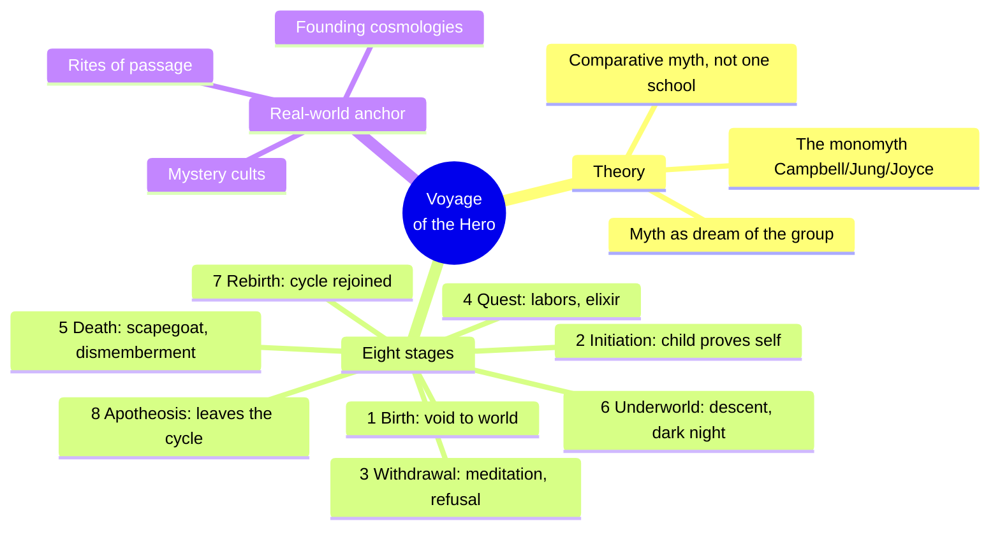
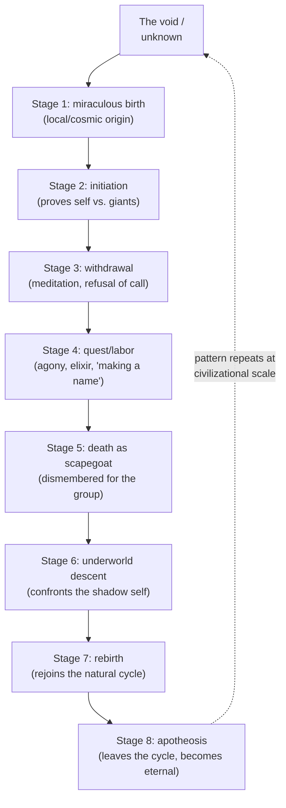
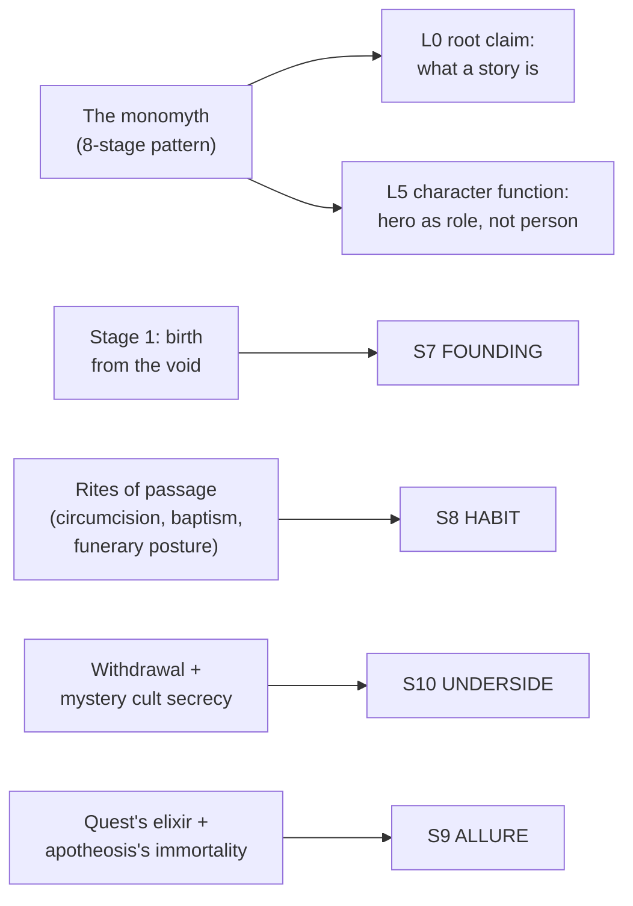

# BVX.0822 — Mythology: The Voyage of the Hero — David Adams Leeming (1998)
### Knowledge Entry — Distill

A textbook anthology of world hero-myths (Krishna to Christ, Osiris to Odysseus) organized not by culture but by the eight beats of a single shared story; the commentary closing each part is a psychological argument for why every culture tells the same tale in different clothes.

## TABLE OF CONTENTS
- [Core Thesis](#1-core-thesis)
- [Mind Models](#2-mind-models)
- [Framework](#3-framework--structure)
- [Key Concepts](#4-key-concepts)
- [Heuristics](#5-heuristics--decision-rules)
- [Invariants](#6-invariants)
- [Pitfalls](#7-pitfalls--myths)
- [Application](#8-application)
- [Cross-References](#9-cross-references)
- [Provenance](#10-provenance--confidence)

---

## 1 · CORE THESIS

Every culture's hero narrative is one monomyth in local costume: birth, initiation, withdrawal, quest, death, underworld, rebirth, apotheosis. Each stage is a rite of passage the hero performs for the whole society, and a culture's rituals and cosmology are that same pattern acted out, not invented separately.

---

## 2 · MIND MODELS

*Required. Minimum two diagrams, maximum five.*

**Diagram 1 — the whole argument.**
Caption: *the book is eight stages, each doing double duty as a stage of psychic growth and a real-world rite — read down the branches for what a culture is doing when it performs one.*

**Diagram 2 — the central mechanism (a psychological cycle re-run at every scale).**
Caption: *the eight stages are one repeating move, lose the self to find the self, applied at birth scale, adolescence scale, death scale, and cosmic scale in turn — the setting-design payoff is that the same move can be scripted for a person, a founding, or a faith.*

**Diagram 3 — mapped onto the Command's SETTING SLICE.**
Caption: *the monomyth is not itself a setting layer; it is the generator that fills three of them, plus the story-spine's root claim and its character-function layer — a fifth, thinner line touches ALLURE.*

---

## 3 · FRAMEWORK / STRUCTURE

Eight parts, each built the same way: a run of myth texts from unrelated cultures (Greek beside Aztec beside Buddhist beside Christian), then one closing "Commentary" essay that names the shared pattern underneath. The book withholds analysis until after the reader has felt the pattern, by design (stated in the Preface): texts first, theory second, so recognition does the persuading. The Introduction ("The Meaning of Myth") precedes all eight parts and lays out the comparative-mythology lineage Leeming is working from — Frazer, Jung, Campbell, Eliade, Coomaraswamy — before naming his own method: comparison strips a myth of its local color until only the universal pattern remains.

| Part | Stage | Governing question |
|---|---|---|
| 1 | Miraculous birth, hiding of the child | How does the hero enter the world from the unknown? |
| 2 | Childhood, initiation, divine signs | How does the child prove the god within? |
| 3 | Preparation, meditation, withdrawal, refusal | What does the hero find by turning inward? |
| 4 | Trial and quest | What does adult life demand, and what does it reward? |
| 5 | Death and the scapegoat | Why must the hero die for the group? |
| 6 | Descent to the underworld | What must be confronted in the self's depths? |
| 7 | Resurrection and rebirth | How does the hero rejoin the cycle of nature? |
| 8 | Ascension, apotheosis, atonement | How does the hero finally leave the cycle? |

---

## 4 · KEY CONCEPTS

| Concept | What it is | Why it matters |
|---|---|---|
| **The monomyth** | Joseph Campbell's (via Joyce) term for the single hero-journey pattern every culture's myths express in local dress | The book's organizing spine; a setting's founding myth, initiation rite, and eschatology should be readable as the same eight-stage arc, not three unrelated inventions |
| **Myth as the dream of the group** | Jung's frame: dreams serve individuals, myths serve whole societies the same way — wish and fear expressed collectively | A culture's public myths are diagnostic of its collective anxieties; write them as symptoms, not lore dumps |
| **The virgin/miraculous birth** | Divine or otherworldly conception, present almost universally in hero myths; Leeming reads it as the psyche's need for a "new beginning" unstained by human failing | The template for any founder-figure's origin story, and for a world's cosmological creation myth (see next row) |
| **Cosmology as birth myth at scale** | Leeming's own footnote: "creation stories are what might be called cosmological expressions of the birth myth" | A setting's creation myth should be built with the same beats as its hero's birth (void, miraculous origin, hidden beginning), because it is structurally the same story told bigger |
| **Refusal of the call / withdrawal** | The hero turns inward or refuses the summons before acting (Moses, Achilles, the Buddha under the Bo Tree); a positive act of "losing the self to find the self" | A ready beat for any character (or founding order, or prophet) who must retreat before a founding act; withdrawal is not delay, it is the mechanism |
| **The quest as the only myth** | Leeming's strongest structural claim: every other stage is itself a form of quest; the hero's whole life is one search for the self played out as birth-quest, death-quest, underworld-quest | Any "quest" content a writer designs should be understood as a compressed rerun of the whole eight-stage arc, not a side activity |
| **Death as scapegoat** | The hero's death, often violent and dismembering, is undergone on behalf of the group, followed by a woman's lament and a promise of new fertility | A model for any sacrificial-death lore: the death must cost the group something (barren land, loss of fertility) to earn its resurrection payoff |
| **The underworld descent** | A "night journey" confronting the shadow side of the self (Inanna vs. Ereshkigal, Christ vs. Adam); it is the meditation-withdrawal stage repeated at cosmic depth | The template for any descent-to-the-underside content: it must force the hero to recognize, not just survive, a rejected part of themselves |
| **Rebirth as cycle-rejoining** | The hero returns from death reincorporated into nature's cycle (seasons, moon, harvest); often marked by trees, flowers, or animal-hibernation myths | The mechanism behind any seasonal or vegetation-cult religion; rebirth belief systems should be built from a concrete natural cycle, not left abstract |
| **Apotheosis as leaving the cycle** | The hero's final move: taken out of the birth-death cycle entirely and granted permanent, cosmic status (ascension, godhood, the androgyne) | The template for any culture's promise of true immortality, as distinct from mere rebirth — a stronger, rarer, more sacred claim |
| **The public/mystery split** | State religion is visible and institutional; mystery cults (Eleusis, secluded monastic orders) run underneath it, voluntary and secret, built around withdrawal and descent | Doubles as a belief-system design rule: a culture's official religion and its underground cult should answer the same monomyth stages with different degrees of secrecy |

---

## 5 · HEURISTICS & DECISION RULES

| Situation | Do this | Not this |
|---|---|---|
| Writing a world's creation myth | Build it as the birth-myth pattern (void, miraculous origin, exposure/hiding) run at cosmic scale | Invent a creation myth from scratch, disconnected from the culture's hero stories |
| Designing an initiation rite | Tie it to a specific monomyth beat (proving the self against a "giant," receiving a sign) | Write ceremony as flavor text with no stage-function behind it |
| Building a mystery cult under a state religion | Key it to withdrawal and descent (secrecy, voluntary joining, inward focus) | Make the "secret religion" just a smaller copy of the public one |
| Writing a faith's recruiting pitch (S9 ALLURE) | Name the exact promise: escape death, eternal youth, cosmic union, per the quest and apotheosis stages | Leave "why people join" implicit or generic ("power") |
| Placing a sacrificial death in lore | Cost the land or group something concrete (fertility, a season, a harvest) before the resurrection payoff | Kill a god-figure with no consequence to justify the mourning |
| Deciding how "real" a religion's history should read | Ask which monomyth stage the culture's public myth lingers on; that stage is what the culture is currently anxious about | Write a religion's myths as a flat historical record |
| A character functions as "the hero" of a scene | Identify which of the eight stage-functions they currently occupy (quester, scapegoat, psychopomp) | Treat "hero" as a fixed trait rather than a role that changes across the arc |
| Building a culture's death/burial practice | Root it in the underworld-descent and rebirth logic (the "night journey," fetal-position burial, the promise of a cycle) | Invent burial custom with no tie to the culture's afterlife belief |

---

## 6 · INVARIANTS

1. **A hero is a function performed, not a person born to it.** The same eight-beat role recurs across every named figure in the book; personhood is the costume, the function is the constant.
2. **Every stage is "losing the self to find the self."** Withdrawal, death, and the underworld descent are the same psychological move at increasing depth, not three unrelated events.
3. **Creation myths are birth myths at civilizational scale.** A world's cosmology and its hero's nativity share one grammar; design them together.
4. **A death in myth must cost the group something before it can pay off in rebirth.** Fertility, a season, or a harvest is owed before resurrection is earned.
5. **Public religion and mystery cult answer the same stages at different visibility.** The split is a design axis (visible vs. secret), not two unrelated belief systems.
6. **Rebirth returns the hero to the cycle; apotheosis removes the hero from it.** These are not the same promise — rebirth is renewal, apotheosis is escape — and a culture's theology should be explicit about which one it is actually offering.
7. **The quest is the container myth; every other stage can be read as a quest at a different depth.** A world's "questing" content is a compressed rerun of the whole arc, not a side quest.

---

## 7 · PITFALLS / MYTHS

- Treating a founding myth as a one-off invention, disconnected from the culture's hero-narrative grammar; Leeming's model says they share a source.
- Writing ritual as decoration (a parade, a chant) with no stage-function underneath it — no proof of self, no rite of passage actually enacted.
- Collapsing rebirth and apotheosis into the same promise; the book insists they are psychologically and theologically distinct (cycle-rejoining vs. cycle-escaping).
- Giving a sacrificial death no cost to the world — no mourning, no barrenness — which drains the resurrection of its payoff.
- Making a "secret religion" a smaller copy of the public one instead of keying it to withdrawal/descent, the stages that are structurally private.
- Assuming one theorist's lens (Freudian, Jungian, structuralist) is the only valid read; Leeming opens by warning that mythology "is the property of no single theorist or theory."
- Reading the eight-part order as a rigid sequence a single myth must follow start to finish; Leeming states plainly that most myths mix stages (the Buddha's tree scene is withdrawal, quest, and near-descent at once).

---

## 8 · APPLICATION

- **Spine level:** L0 primary (the monomyth is a root claim about what a story is) and L5 primary (hero as recurring function, not fixed person); SETTING primary for the belief layer.
- **12-layer character stack:** none directly load-bearing as a character-database feed; L5's "function before person" lens is a story-spine concept (which stage-role a character currently occupies), distinct from the 12-layer character stack's own fields.
- **plot_systems:** contextual candidate once `04_PLOT_SYSTEMS/` opens — Diagram 2's eight-stage cycle is a ready arc-generator: any character's current scene can be located on the wheel (withdrawal, quest, descent) to predict what should happen next.
- **Setting:** primary — this is a SETTING-shelf distill aimed at a world's belief layer, keyed to S7 FOUNDING (creation myth as birth myth at scale), S8 HABIT (rites of passage as staged monomyth beats), S10 UNDERSIDE (mystery cults as the withdrawal/descent stages gone private) at primary-to-supporting strength, and S9 ALLURE (what a faith promises, keyed to the quest and apotheosis stages) at supporting strength.

Read against a science-fiction setting rather than a fantasy one, the method transfers cleanly: a colony's founding charter is its birth myth (miraculous origin from "the void" of empty space or a prior world's collapse); a generation ship's coming-of-age ritual is its initiation stage; an AI or founder-figure's withdrawal into isolation before a decisive act follows the meditation/refusal beat; and a faction's stated ideology (whether it promises escape from mortality through upload, cryonics, or ascension to a Dyson-scale civilization) is legible directly as apotheosis-stage allure versus mere rebirth-stage renewal — the same distinction Deudney's Promethean cosmic-destiny narrative names from the political-science side ([[BVX.1159]]). Where the Kobold Guide ([[BVX.0458]]) supplies the terrain-first method for a world's geography and Dark Skies ([[BVX.1159]]) supplies the material-context method for its politics, Leeming supplies the missing psychological grammar for a world's belief layer: what a culture's founding story, its rites, and its promise of an afterlife are actually doing for the people who hold them, stage by stage, rather than as inert lore.

---

## 9 · CROSS-REFERENCES

| Related entry | Relation |
|---|---|
| [[BVX.0458]] | Kobold Guide to Worldbuilding: sibling SETTING-shelf source; Kobold's S10 UNDERSIDE (public/personal religion split, mystery cults) is the same public/mystery axis Leeming derives psychologically here, from the withdrawal and descent stages rather than from craft convention |
| [[BVX.1159]] | Dark Skies: Space Expansionism: independent convergence on S9 ALLURE — Deudney's "Promethean cosmic-destiny narrative" (ascent, apotheosis, species vocation) names, from political science, the exact stage-function (apotheosis) Leeming derives from comparative myth |

---

## 10 · PROVENANCE & CONFIDENCE

Full text, plain-text extraction, ~300pp. Read in full: the Preface, Acknowledgments, and the entire Introduction ("The Meaning of Myth," the comparative-mythology lineage and monomyth statement); all eight part-closing Commentary essays in full (Commentary on Parts 1 through 8), which carry the book's analytical argument. The individual myth texts collected within each part (Krishna, Heracles, Osiris, Quetzalcoatl, Inanna, and roughly 80 others) were sampled via headnotes and representative passages rather than read exhaustively story by story, per the brief's direction to pull the book's method rather than transcribe its anthology; the Commentaries synthesize and cite the same texts directly, so their content is captured at one remove for stories not separately sampled. The Selected Bibliography was scanned for the citation lineage (Frazer, Jung, Campbell, Eliade, Coomaraswamy, Rank, Weston) referenced throughout but not read as content.

The S-layer keying in `feeds:` and Diagram 3 is this distill's own synthesis against `ssot_03_setting_system.md` (the SETTING SLICE) and `ssot_01_story_spine_comparative_tree.md`'s definitions of L0 (root claim) and L5 (character function); no prior distill anticipated this specific mapping, though BVX.0458's S10 UNDERSIDE keying anticipated the public/mystery axis this entry now supplies a psychological rationale for.

## META
- Template: BVX-LEARN-v4.0
- Source classification: full-text extraction, deep read on Introduction and all eight Commentaries, sampled on the anthologized myth texts themselves per brief's method-over-anthology focus
- Created / Updated: 2026-09-29
