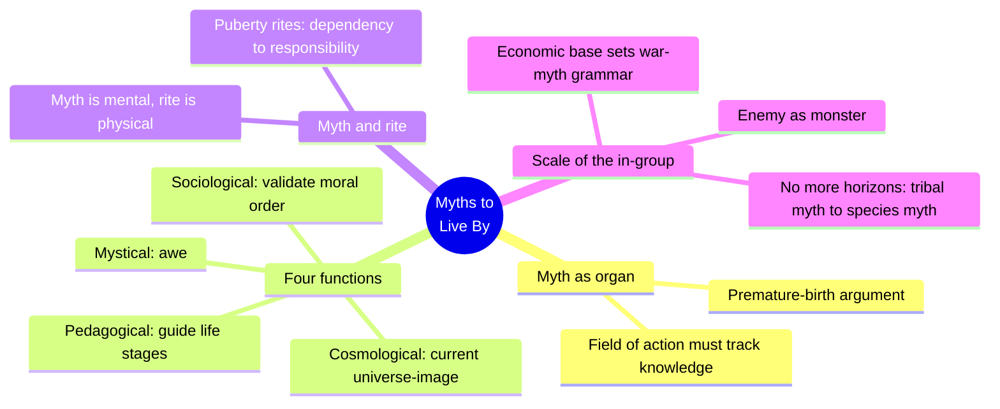
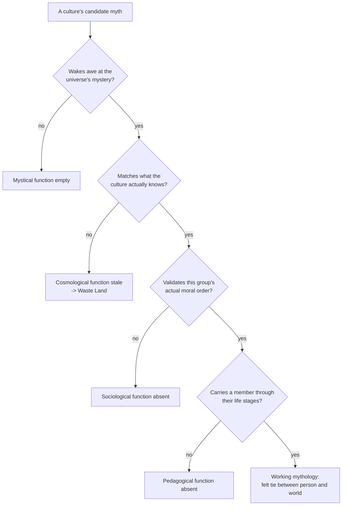
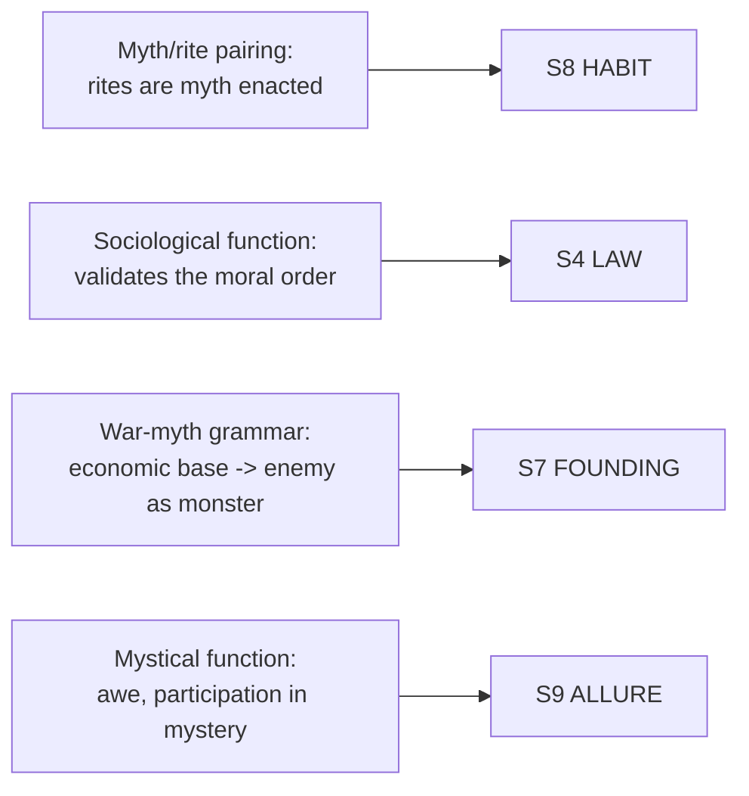

# BVX.0823 — Myths to Live By — Joseph Campbell (1988)
### Knowledge Entry — Distill

Thirteen Cooper Union Forum lectures (1958-1971) on what a living mythology is *for*, read here as a functional spec for the myth layer of a built culture, not a survey of world religions.

## TABLE OF CONTENTS
- [Core Thesis](#1-core-thesis)
- [Mind Models](#2-mind-models)
- [Framework](#3-framework--structure)
- [Key Concepts](#4-key-concepts)
- [Heuristics](#5-heuristics--decision-rules)
- [Invariants](#6-invariants)
- [Pitfalls](#7-pitfalls--myths)
- [Application](#8-application)
- [Cross-References](#9-cross-references)
- [Provenance](#10-provenance--confidence)

---

## 1 · CORE THESIS

A working mythology is an organ, not decoration: it wakes awe at the universe, keeps that picture current with real knowledge, validates the group's moral order, and carries each member through life's stages. Myth is the mental support of rite; rite is myth enacted. Without this work, people live in a Waste Land, cut off from their world.

---

## 2 · MIND MODELS

*Required. Minimum two diagrams, maximum five.*

**Diagram 1: the whole argument.**
Caption: *four named jobs, one biological necessity, and one closing frontier: the book is a function spec for a culture's myth layer, not a catalog of gods.*

**Diagram 2: the central mechanism (the four-function test, run against any candidate myth).**
Caption: *a myth doesn't fail generically — it fails at one of four specific, diagnosable jobs, and the failure has a name.*

**Diagram 3: mapped onto the Command's SETTING SLICE (S1-S12).**
Caption: *the book lands on four of twelve slice layers, each keyed to one of Campbell's own named mechanisms, not to "religion" as a single undifferentiated tag.*

---

## 3 · FRAMEWORK / STRUCTURE

Thirteen lectures, no single spine: each is a self-contained talk, but three carry the load-bearing argument for a setting builder.

| Lecture | Governing question |
|---|---|
| I. The Impact of Science on Myth | What happens to a mythology once its cosmology is factually wrong? |
| II. The Emergence of Mankind | Why does myth outrank economics as the human species' organizing force? |
| III. The Importance of Rites | What does ritual actually do to an "open," under-instinctive nervous system? |
| IV–VIII (East/West, art, Zen, love) | How do differing mythic postures toward nature and self produce differing civilizations? (sampled, not load-bearing here) |
| IX. Mythologies of War and Peace | Why does a culture's subsistence mode predict the shape of its founding/war myth? |
| X. Schizophrenia, the Inward Journey | What are the four functions a living mythology must perform? |
| XI. The Moon Walk, the Outward Journey | What happens to a myth's horizon when the group sees its own world from outside it? (sampled) |
| XII. Envoy: No More Horizons | What replaces a parochial, in-group myth once the horizons that justified it collapse? |

The three load-bearing chapters (II, III, X) build the mechanism; IX and XII apply it at the scale of the faction and the species. The rest (IV-VIII, XI) are regional case studies in mythic posture: useful color, not required to run the mechanism.

---

## 4 · KEY CONCEPTS

| Concept | What it is | Why it matters |
|---|---|---|
| **Four functions of a living mythology** | Mystical (awe at cosmic mystery), Cosmological (an image of the universe matching current knowledge), Sociological (validates the moral order of a specific society), Pedagogical (guides a person stage by stage through life) | A myth that isn't working is failing at one of four *nameable* jobs, not "mythology in general" |
| **Myth/rite pairing** | "Myths are the mental supports of rites; rites, the physical enactments of myths." | Ritual isn't separate from belief: a culture's ceremonies *are* its myths made physical and repeatable |
| **The premature-birth argument** | Human infants are born roughly ten to twelve years before they are behaviorally ready; unlike animals with fixed "innate releasing mechanisms," our nervous system is "open," so myth and rite supply the imprinting that instinct doesn't | Myth is structural, not optional decoration: a culture without a working myth layer is a culture failing to finish raising its own members |
| **Puberty / threshold rites** | Rites that switch a member's response system from dependency to responsibility at a life-stage boundary | The template for any coming-of-age, promotion, or initiation system: the rite must change what the member owes and is owed, not just mark a date |
| **The field of action** | The environment (physical, social, cosmological) a culture's mythology has to actually address, and which keeps moving: new science, new geography, new contact | A myth stops working the moment its field of action moves and the myth doesn't follow; this is the specific design failure, not vague "myths get old" |
| **Waste Land / schizophrenic break** | The named symptom of a person whose myth doesn't talk to the world they actually live in: "the world does not talk to him; he does not talk to the world" | The diagnostic line for "this character or culture has no working myth layer," not absence of belief, but a myth misfitted to the actual field of action |
| **Static vs. innovating social ideal** | A culture's myth can be built to reproduce a fixed ancestral pattern, or to license each member as "an initiating yet cooperating center" moving the group forward | A direct dial for differentiating built cultures: conservative/legalist myth versus frontier/innovating myth, independent of tech level |
| **Economic base → war-myth grammar** | Hunting peoples: rebirth-of-the-slain-animal myths, war as bravura. Tropical/horticultural peoples: death-feeds-life myths, headhunt logic. Walled agricultural towns: raided-by-nomads epics (the *Iliad*, the Old Testament) | A faction's subsistence mode predicts the shape of its founding/war myth before a single proper noun is invented |
| **Enemy as monster** | "It is a basic idea of practically every war mythology that the enemy is a monster and that in killing him one is protecting the only truly valuable order of human life on earth" | The mechanism by which a faction's founding myth manufactures a justified out-group — useful and dangerous in equal measure when writing SF factions |
| **No more horizons** | Once separate cultures collide — trade, conquest, or a "single spaceship Earth" moment — their old parochial myths (built to love the in-group and project hatred outward) collide too, producing turbulence until a wider, inclusive myth replaces them | The mechanism for playing first contact, unification wars, or post-scarcity shifts as *myth*-collision events, not only plot events |
| **Myths as psyche, not history** | Myths and gods are "productions and projections of the psyche," not dependable historical or scientific claims; read literally, they curdle into either fundamentalism or unbelief | Governs how "true" a built religion should be inside its own setting — the literal claim is the least interesting and most fragile layer of it |

---

## 5 · HEURISTICS & DECISION RULES

| Situation | Do this | Not this |
|---|---|---|
| Giving a culture its myth layer | Design it to still do all four jobs — awe, current cosmology, moral validation, life-stage guidance | Write a decorative pantheon that does none of the four jobs |
| The setting's known facts outrun a culture's old cosmology | Show the myth's cosmological image updating, straining, or splitting into literal/allegorical readings | Paste a real-world religion onto an alien starfield unchanged, forever accurate to no one's actual knowledge |
| Designing a culture's rites of passage | Tie the rite to a real threshold that changes standing (birth, majority, war, death) | Invent ceremony with no life-stage function behind it |
| Building a faction's founding or war myth | Derive it from the faction's economic-ecological base and let it cast the enemy as a monster | Write a generic "evil empire" myth with no derivation from how the faction actually feeds and organizes itself |
| Two long-separated cultures make contact or unify | Play the collision of their myths (turbulence, then a wider inclusive myth), not just the collision of their armies or markets | Treat contact as a purely military or economic event with the myth layer unchanged on both sides |
| Writing a character alienated from their culture | Diagnose it as a Waste Land symptom — their myth no longer talks to their actual world | Write generic "loss of faith" with no named mechanism underneath it |
| Deciding how literally a built religion is "true" in-setting | Keep the literal claim thin and let the mystical/sociological/pedagogical functions carry the weight | Make the religion's literal historical claims load-bearing for the whole culture's coherence |

---

## 6 · INVARIANTS

1. **A living mythology performs four functions — mystical, cosmological, sociological, pedagogical — or it is failing at a specific, nameable one of them.**
2. **Myth and rite are one thing in two forms**: myth is the mental support, rite is its physical enactment.
3. **A mythology must track the culture's actual field of action.** When the field of action moves and the myth doesn't, the result is a Waste Land, not a quaint anachronism.
4. **The human nervous system is "open," not stereotyped** — culture, via myth and rite, supplies the imprinting that instinct supplies in other species; this is why myth is structural rather than optional.
5. **Economic-ecological base sets the base grammar of a faction's founding and war myth** — hunter, planter, herder, or spacefarer each produce a different shape of "why we fight."
6. **War mythology casts the enemy as a monster and one's own order as the only valid one** — structural in any culture that has fought for survival, not incidental flavor.
7. **When a culture's horizon collapses (contact, conquest, unification), its old exclusive myth must expand to an inclusive one or produce sustained turbulence.**

---

## 7 · PITFALLS / MYTHS

- Confusing a myth's literal claim with its actual referent (the psyche, the felt tie to the world) — reading religion as failed science produces either brittle literalism or a Waste Land unbelief with nothing put in its place.
- Writing deep sacred lore that never touches present-day life or play — the mythic-register version of kitchen-sink worldbuilding.
- Freezing every culture's cosmology at "first contact" instead of letting it strain and update as the culture's own knowledge grows.
- Designing rites as pure spectacle, decoupled from any actual life-stage threshold they mark.
- Treating "religion" as one monolithic dial instead of four separable functions, which makes it impossible to diagnose which one a given culture's myth is failing at.
- Playing first contact or conquest as a purely military or economic event and leaving both sides' myth layers untouched by the collision.

---

## 8 · APPLICATION

- **Spine level:** SETTING (non-story-spine source; setting is a Domain embodied, never an L0–L7 level, per the SSOT's binding rule)
- **12-layer character stack:** none directly fed — this is a setting-side source; the premature-birth/imprinting argument runs structurally parallel to L8 IMPRINT (myth does at the cultural scale what imprinting does at the individual scale) but is not itself a character-layer feed
- **plot_systems:** contextual candidate once `04_PLOT_SYSTEMS/` opens — "no more horizons" is a ready-made engine for first-contact, unification, and post-scarcity plot beats: play the myth-collision, not only the event that causes it
- **Setting:** primary — feeds S8 HABIT (rites as myth enacted, the belonging/threshold architecture), S4 LAW (myth as the felt backing under written law), S7 FOUNDING (war-myth grammar keyed to economic base, enemy-as-monster), and S9 ALLURE contextually (the mystical function as a culture's or cult's draw)

For a science-fiction setting specifically: treat each culture's myth layer as a running four-function system, not a costume. A faction that has crossed into a new field of action (new star system, new tech, first contact) but kept its old cosmological myth unchanged is not "traditional" — it is, by Campbell's own diagnostic, heading for a Waste Land break, and that break is a plot event waiting to be written. Conversely, a faction whose myth has updated its cosmological function but abandoned its mystical one (pure engineering-materialist culture with no awe left) is just as diagnosably broken, in the opposite direction. The economic-base-to-war-myth chain (§4, §6) gives a fast, derivable way to generate a faction's founding legend directly from its subsistence and technology, rather than inventing pantheon color first and justification later. And "no more horizons" (§4, §6) is the load-bearing model for playing any moment where a setting's separated cultures are forced into the same field of action: the turbulence is the myths colliding, not merely the armies or the markets.

---

## 9 · CROSS-REFERENCES

| Related entry | Relation |
|---|---|
| [[BVX.0458]] | Kobold Guide to Worldbuilding — the TTRPG-craft counterpart already keying S4/S7/S8/S9; Baur's "present-tense history" rule (write only the backstory that bites now) is a craft restatement of this book's field-of-action requirement |
| [[BVX.0575]] | Exploring Imaginary Worlds: Essays on Media, Structure, and Subcreation — worldbuilding-theory sibling on the same SETTING shelf; its subcreation argument sits one level up from this book's functional-organ argument |
| [[BVX.1122]] | GURPS Hot Spots: Renaissance Venice — a worked historical instance where public state religion vs. private confraternity/mystery practice offers a concrete case for this book's public/mystery split possibility, one register below S10 UNDERSIDE |
| [[BVX.0349]] | Against Worldbuilding, and Other Provocations — its warning against inert, encyclopedic worldbuilding parallels this book's warning against myth read literally as dead history rather than lived function |

---

## 10 · PROVENANCE & CONFIDENCE

Full text, plain-text extraction (~6,860 lines), clean chapter breaks with a machine-readable table of contents and dated reference notes per chapter (1961–1971). Read in full: Preface; Foreword; Chapter II, "The Emergence of Mankind" (the premature-birth/imprinting argument); Chapter III, "The Importance of Rites" (myth/rite pairing, puberty rites, static-vs-innovating social ideal); Chapter IX, "Mythologies of War and Peace" (economic base → war-myth grammar, enemy-as-monster); Chapter X, "Schizophrenia — the Inward Journey" (the four-functions passage, the Waste Land diagnostic); Chapter XII, "Envoy: No More Horizons" (parochial-to-inclusive myth collapse, closing argument) — plus the opening of Chapter I, "The Impact of Science on Myth," for the cosmological-currency argument. Sampled only (not deep-extracted): Chapters IV–VIII (East/West, Oriental art, Zen, the mythology of love) and Chapter XI ("The Moon Walk") — regional/thematic case studies whose specific content (Hindu, Buddhist, Zen, and courtly-love material) is not load-bearing for the SETTING-shelf application and was set aside to stay inside the reading budget for this pass.

The S-layer keying in frontmatter `feeds:` and Diagram 3 is this distill's synthesis against `ssot_03_setting_system.md` (PART A, the twelve-layer SETTING SLICE), matching S8 HABIT (rites, belonging, threshold architecture), S4 LAW (the moral-order-validating function), S7 FOUNDING (war/origin myth keyed to economic base), and S9 ALLURE (the mystical function as draw) to Campbell's own named mechanisms rather than to an undifferentiated "religion" tag. `spine: [SETTING]` and the empty character-stack application follow the v4 template's binding rule that setting is an entity beside the spine, never a story-spine rung.

## META
- Template: BVX-LEARN-v4.0
- Source classification: full-text lecture collection, deep extraction on 6 of 13 lectures (the load-bearing ones for this application), sampled on the remaining regional/thematic chapters
- Created / Updated: 2026-09-29
