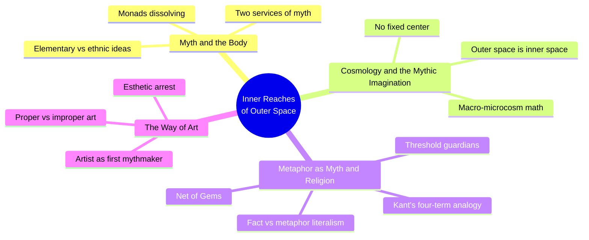
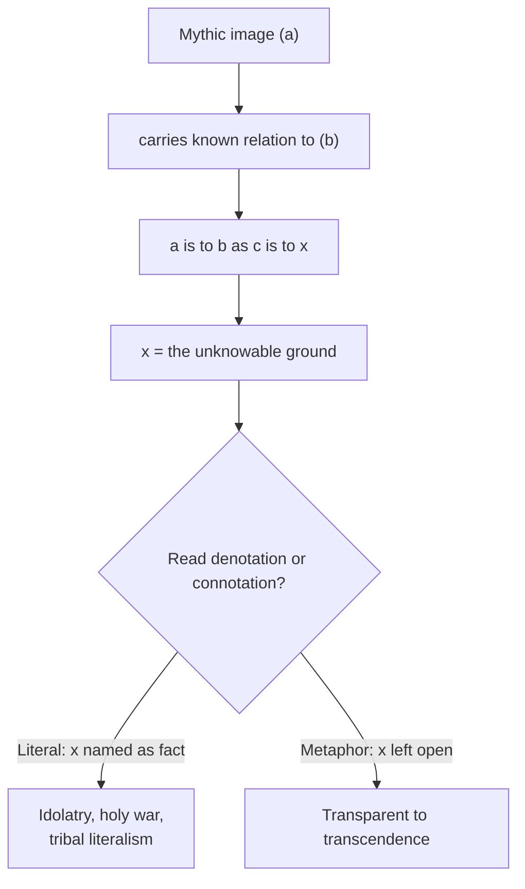
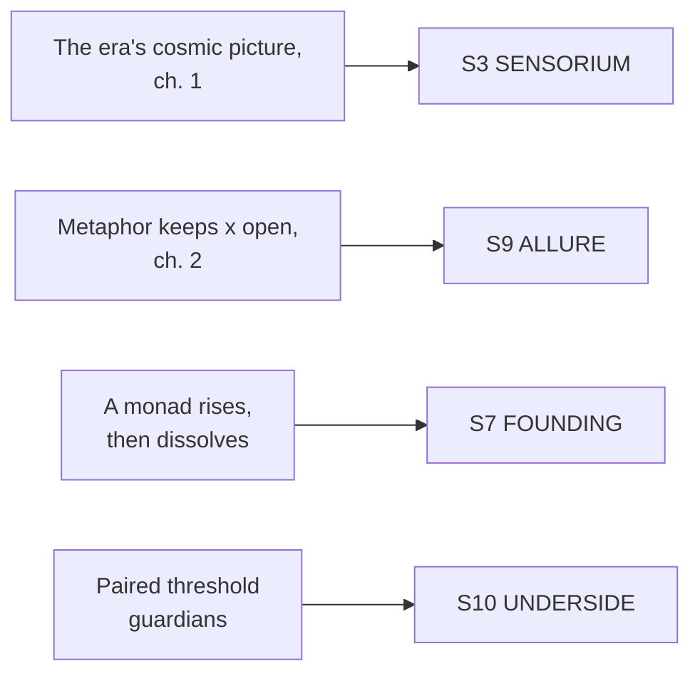

# BVX.0831 — The Inner Reaches of Outer Space: Metaphor as Myth and as Religion — Joseph Campbell (1986)
### Knowledge Entry — Distill

Campbell's last book, built from 1981-84 San Francisco lectures (one shared a stage with Apollo 9 astronaut Rusty Schweickart); its argument is that the moon landing did not retire mythology, it handed mythology a new cosmology to catch up to.

## TABLE OF CONTENTS
- [Core Thesis](#1-core-thesis)
- [Mind Models](#2-mind-models)
- [Framework](#3-framework--structure)
- [Key Concepts](#4-key-concepts)
- [Heuristics](#5-heuristics--decision-rules)
- [Invariants](#6-invariants)
- [Pitfalls](#7-pitfalls--myths)
- [Application](#8-application)
- [Cross-References](#9-cross-references)
- [Provenance](#10-provenance--confidence)

---

## 1 · CORE THESIS

Outer space and inner space are one thing known two ways, so every change to a culture's picture of the universe is a debt owed to its mythology. Metaphor is the instrument that pays that debt: it holds an image open to an unknowable x instead of collapsing it into a claimed fact.

---

## 2 · MIND MODELS

*Required. Minimum two diagrams, maximum five.*

**Diagram 1 — the whole argument.**
Caption: *four movements, one claim repeated at four scales: the cosmology a culture holds and the myths it can still believe must match.*

**Diagram 2 — the central mechanism (the metaphor engine).**
Caption: *the fork is the whole craft test: does a mythic image name its unknown term, or keep it open?*

**Diagram 3 — mapped onto the Command's SETTING SLICE (S1-S12).**
Caption: *four Campbell moves land on four S-layers; there is no COSMOLOGY layer yet in ssot_03, and this book is the strongest candidate seed for one.*

---

## 3 · FRAMEWORK / STRUCTURE

Four parts, each answering the same question at a different scale: what does a mythology owe a culture that now knows more about the universe than its old images account for?

| Part | Governing question |
|---|---|
| Introduction, "Myth and the Body" | What in a mythology is universal (biological) and what is merely local costume? |
| Ch. 1, "Cosmology and the Mythic Imagination" | What happens to mythology when the pictured universe changes scale? |
| Ch. 2, "Metaphor as Myth and as Religion" | What, exactly, is a metaphor, and what breaks when it is read as fact? |
| Ch. 3, "The Way of Art" | Who makes the next mythology's images, and by what craft? |

The book is bookended by the same move that opens it: the Apollo Ground Control exchange ("Who's navigating now?" "Newton!") sets up chapter 1's claim that outer space is knowable because it is inner; chapter 3 closes by handing the actual authorship of the next mythology to artists, not institutions, because "a mythology is not something projected from the brain, but something experienced from the heart."

---

## 4 · KEY CONCEPTS

| Concept | What it is | Why it matters |
|---|---|---|
| **Elementary ideas vs. ethnic ideas** (Bastian, Jung's archetypes) | The universal, biologically grounded motifs (death, birth, hunger, desire, plunder, mercy) versus their local costume (this culture's gods, calendar, rites) | Names what survives contact with a bigger cosmos and what does not. A spacefaring culture's flag and pantheon are costume; the drives underneath are the constant. |
| **Monad** (Frobenius, Spengler) | A whole culture's shared psychological posture; every feature of the society (art, tools, weapons, rites, war customs) is symbolic of that one stance | A setting's civilization is a monad. When its cosmology stops matching what it knows, the monad is already dissolving even while its institutions still function. |
| **Outer space is inner space** | Campbell's core move off the Apollo broadcast: the laws of space are knowable a priori because humanity is materially made of that same space (born of the galaxy, the sun, the earth) | The oldest mythic move, ascent to a heaven beyond the sky, becomes literally true once a species leaves its planet; going to space fulfills the myth instead of retiring it. |
| **Cosmological correction** | Each era's mythology must be re-keyed to its era's actual picture of the universe: three-layered Sumero-Babylonian cosmos, then Ptolemaic spheres, then heliocentric, then the current supercluster picture | Skipping the correction does not remove the old images, it strands them: ascension and virgin birth stories keep circulating as claimed biological fact long after the cosmology under them has changed. |
| **Macro-microcosm mathematics** | Ancient priesthoods encoded cosmic cycles into ritual numbers and the body's own rhythm: the precession of the equinoxes (25,920 years) divided by 60 gives 432, which is also buried in a resting heart's 86,400 beats a day | A concrete, reusable worldbuilding technique: derive a setting's calendar and ritual numerology from its own orbital and physiological facts so the numbers are load-bearing, not decorative flavor text. |
| **Kant's four-term metaphor formula** (a is to b as c is to x) | Metaphor states a perfect resemblance of relationships between dissimilar things, not a resemblance of the things themselves; x is defined as unknowable | Gives a testable craft rule: if a mythic line names x as a fact, it has stopped being myth; if it leaves x open, it is still doing myth's job. |
| **Fact-as-metaphor / metaphor-as-fact** (the literalism trap) | Reading a psychological image (Virgin Birth, bodily Ascension) as literal biology or history, which historically produces holy war between rival literalisms of what was originally one elementary idea | The Beirut example (1984-85, three inflections of one god-type bombing each other) is Campbell's own case study; directly reusable for building rival spacefaring factions whose "different" gods turn out to be masks of the same elementary idea. |
| **Threshold guardians** | Paired, opposite-natured figures (one silent, one roaring; lunar breath and solar breath) flanking a portal; the way opens only once their dual energies fuse | A ready structure for any crossing in a spacefaring setting, a jump gate, a quarantine lock, a border shrine: the cost of passage should be the fusing of two opposed things, not a fuel gauge. |
| **Net of Gems / mutual arising** | The Indian image where every gem in a net reflects every other gem; paired here with the Michelson-Morley finding that no experiment can locate absolute rest | A cosmology-building principle for a post-relativity space setting: no single homeworld, species, or empire is the ontological center. "The center is everywhere," per Black Elk, quoted directly against the earthrise photograph. |
| **The Way of Art / esthetic arrest** | The artist, not the priest, authors the next mythology's images, because the priest's vocabulary is already coined; "proper" art (Joyce's stasis) holds the mind in contemplation instead of moving it toward desire or fear (kinesis) | An operational answer to "who writes the new religion": it is felt into being by artists who make the current cosmic picture trigger the same "Ah!" that lightning once triggered, not decreed by institutions. |

---

## 5 · HEURISTICS & DECISION RULES

| Situation | Do this | Not this |
|---|---|---|
| Building a spacefaring culture's calendar or ritual numbers | Derive them from that setting's own orbital mechanics, day length, moons | Import Earth's zodiac or calendar unexamined |
| Writing a first-contact or FTL-jump scene | Play it as a literal event and keep it open as a threshold or rebirth metaphor at once | Handle it only as an engineering beat (kinetic, no esthetic arrest) |
| Two spacefaring factions worship differently | Reveal, late, that they are regional inflections of one elementary idea | Design their religions as unrelated and arbitrary |
| Setting needs a gate, lock, or crossing point | Give it paired opposite guardians whose energies must fuse to pass | Make it a pure resource-cost checkpoint |
| A culture's old cosmology stops matching known space | Show the monad visibly dissolving (rites going hollow, gods going private) before the new myth arrives | Have the new mythology appear instantly and fully formed |
| Deciding what is "the center" of the setting's cosmology | Make it relative or floating, true from wherever it is asked | Anchor the cosmology to one homeworld or empire as objectively central |
| A character has a transcendent or mystic experience | Keep the imagery physical-sounding but its connotation inward | Send the character literally to a place named Heaven |
| A new public myth needs an author | Give it to an artist or craft-figure whose image triggers the "Ah!" | Have it handed down by institutional decree alone |

---

## 6 · INVARIANTS

1. Every mythology carries two layers at once: a local costume and a universal substrate. Only the substrate survives contact with a larger cosmos.
2. A culture's picture of the universe and its mythology must match, or the mythology calcifies into tribal literalism wearing cosmic language.
3. Metaphor is defined by an unknowable term (x). The moment a myth names x as a fact, it has stopped being myth and become either dogma or a lie.
4. Once relativity or deep space enters a setting's own physics, there is no fixed center; any claimed absolute center is a political move, not a cosmological fact.
5. Images and rites stay alive only as long as they keep opening inner space to outer space. Documentation without that opening is inert.
6. New mythic images are made by artists reflecting the current cosmic picture, not legislated top-down by institutions.
7. Load-bearing ritual numerology is derived from a setting's own astronomical and physiological facts, never borrowed wholesale from Earth's.

---

## 7 · PITFALLS / MYTHS

- Treating a founding myth as a fixed origin fact rather than a metaphor for something psychological or structural: the exact fundamentalism that produces Campbell's own Beirut example.
- Giving one species, empire, or homeworld an unearned "center of the universe" status the setting's own physics does not support.
- Writing first contact purely as plot mechanics (kinesis: moving the audience to desire or fear) with no esthetic-arrest moment, no "Ah!"
- Designing rival factions' religions as wholly unrelated when Campbell's own pattern (Yahweh, Zeus, Indra as one god-type) argues they read better as masks of one elementary idea.
- Borrowing Earth's zodiac or calendar wholesale for an off-Earth setting instead of deriving new ritual numbers from that setting's own cycles.
- Letting institutions, not artists, legislate "the next mythology": a mythology cannot be projected from the brain like an ideology.

---

## 8 · APPLICATION

- **Spine level:** SETTING (non-story-spine source; keys to the entity beside the L0-L7 spine, per the binding rule that setting is a Domain embodied, never a level)
- **12-layer character stack:** none directly. The artist-as-first-mythmaker principle structurally parallels an L6 DRIVE want tested against an unknown cost (x), but it is not itself a character-layer feed.
- **plot_systems:** contextual candidate once `04_PLOT_SYSTEMS/` opens. Diagram 2's fork (name x, or leave it open) is a ready test for any reveal scene: does the reveal collapse the mystery into a fact-twist, or keep it open as theme?
- **Setting:** primary. This is the shelf's myth-and-cosmology method book: build a spacefaring setting's ritual numerology and gods from its own physics, and treat every scale-jump the story's characters actually witness (first contact, an FTL threshold, a new instrument reading) as an event that owes the setting's mythology a correction, the same debt the moon landing put on Earth's.

Read against BOLO 87's SETTING shelf, this book fills a gap the Kobold Guide to Worldbuilding (BVX.0458) leaves open: Kobold's S9 ALLURE note is about a magic system's promised transportation, medicine, and power, while Campbell's S9 contribution is about what a cosmology promises the psyche once believed, the "Ah!" of recognized divinity, prior to and beneath any specific magic or tech system. There is no COSMOLOGY or MYTH layer yet named in `ssot_03_setting_system.md`'s S1-S12; this book is the strongest candidate the shelf has produced so far to seed one, since its whole argument is precisely the thing S3 SENSORIUM, S7 FOUNDING, and S9 ALLURE currently have to split between them. Chapter 2's threshold-guardian image is a direct, steal-able TTRPG tool for a spacefaring setting: any jump gate, quarantine lock, or border shrine reads stronger built as a paired, opposed-energy crossing than as a checkpoint gated on fuel or clearance alone.

---

## 9 · CROSS-REFERENCES

| Related entry | Relation |
|---|---|
| [[BVX.0458]] | Kobold Guide to Worldbuilding, the shelf's founding S1-S11 toolkit; this entry supplies the myth-and-cosmology register that book's essays gesture past |
| [[BVX.0616]] | Campbell, The Hero With a Thousand Faces, undistilled sibling; the monomyth's structural claims sit one level below this book's cosmological one |
| [[BVX.0823]] | Campbell, Myths to Live By, undistilled sibling; overlaps this book's "new mythology of the unified earth" argument from an earlier lecture set |
| [[BVX.0834]] | Campbell, The Masks of God, Vol. III Occidental Mythology, undistilled sibling; the historical case studies (Yahweh, the Near East literalism trap) this book compresses to a paragraph |
| [[BVX.0841]] | Campbell, The Power of Myth (with Moyers), undistilled sibling; the accessible companion piece to this book's denser argument |
| [[BVX.0349]] | Kennedy, Against Worldbuilding, undistilled sibling; its root claim (worldbuilding should serve pressure, not inventory) matches this book's own warning against documenting a cosmology instead of letting it open the mind |

---

## 10 · PROVENANCE & CONFIDENCE

Full text, extraction of a scanned reprint (OCR carries visible character-substitution noise, e.g. "rhe" for "the", "l" for "I"; unaffected in reading comprehension). Read in full: the Foreword; the Introduction, "Myth and the Body" (all); Chapter 1, "Cosmology and the Mythic Imagination" (all, including the Indra/Vishvakarman/Vishnu tale used as the chapter's closing exemplum); Chapter 2, "Metaphor as Myth and as Religion," sections "The Problem," "Metaphor As Fact and Fact As Metaphor," the threshold-guardians passage, and "The Net of Gems" through the Galileo/Don Quixote close. Chapter 3, "The Way of Art," read from its opening through its closing pages (the Vishvakarman/Shachi frame, Joyce's proper/improper art distinction, the closing Jeffers quotation). Not separately extracted: the intervening "Metaphorical Journey" and "Metaphorical Identification" subsections of chapter 2, and the Chapter Notes/Bibliography/Index back matter, none load-bearing for the setting-shelf brief.

Title-page copyright block reads "Copyright (c) 1986, 2002 by Joseph Campbell Foundation," "Originally published: New York: A. van der Marek, (c)1986," "First printing, January 2002." The frontmatter `year` is taken as 1986, the book's own original publication date named on its title/copyright page and confirmed by the dust-jacket copy ("Originally published in 1986, The Inner Reaches of Outer Space was the last book Joseph Campbell completed before his death"); this is a New World Library 2002 reissue of that 1986 edition. The S-layer keying in `feeds:` and Diagram 3 is this distill's synthesis against `ssot_03_setting_system.md`'s twelve-layer SETTING SLICE; no COSMOLOGY/MYTH layer currently exists there, so S9 ALLURE (primary), S3 SENSORIUM (supporting), and S7 FOUNDING/S10 UNDERSIDE (contextual) are the nearest existing rungs, flagged in Application as a candidate gap rather than a clean fit.

## META
- Template: BVX-LEARN-v4.0
- Source classification: full-text, deep extraction on 3 of 4 named parts (Introduction, ch. 1, ch. 2 in part, ch. 3), two chapter-2 subsections sampled by proxy of surrounding sections
- Created / Updated: 2026-09-29
