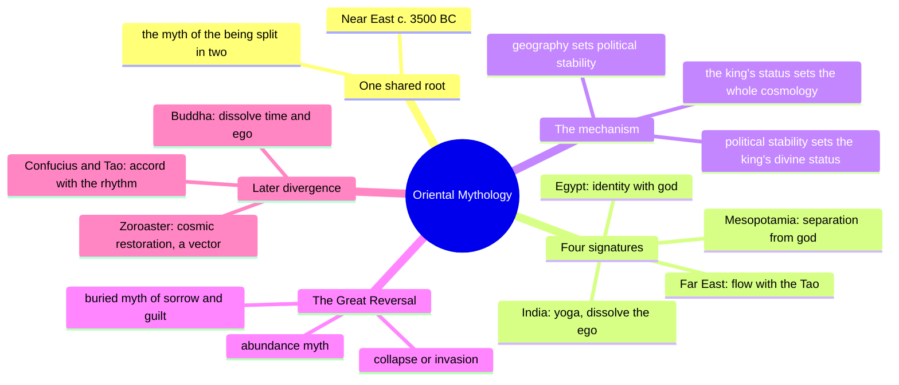
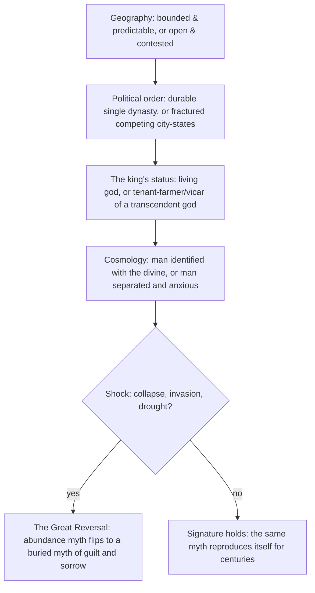
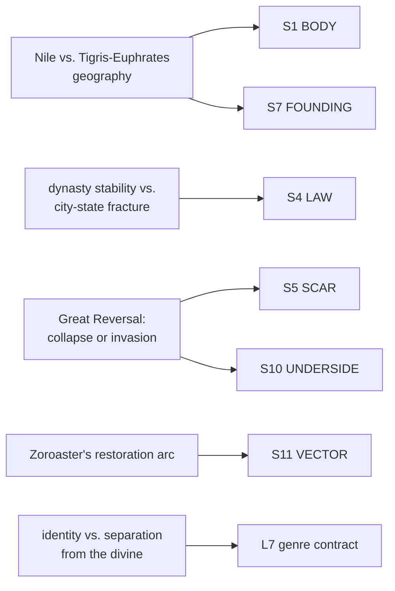

# BVX.0835 — The Masks of God, Volume II: Oriental Mythology — Joseph Campbell (1963)
### Knowledge Entry — Distill

Campbell's comparative study of how Near Eastern, Indian, Chinese, Japanese, and Tibetan mythology diverged from one shared root; read here not for its theology but for its method: myth as the compressed record of a civilization's geography, political order, and history.

## TABLE OF CONTENTS
- [Core Thesis](#1-core-thesis)
- [Mind Models](#2-mind-models)
- [Framework](#3-framework--structure)
- [Key Concepts](#4-key-concepts)
- [Heuristics](#5-heuristics--decision-rules)
- [Invariants](#6-invariants)
- [Pitfalls](#7-pitfalls--myths)
- [Application](#8-application)
- [Cross-References](#9-cross-references)
- [Provenance](#10-provenance--confidence)

---

## 1 · CORE THESIS

Mythology is not invented freely; it is the signature a civilization's geography and political history leave on its account of the divine. Predictable terrain breeds gods you can identify with; unpredictable, contested terrain breeds gods you can only serve, fear, and try to read.

---

## 2 · MIND MODELS

*Required. Minimum two diagrams, maximum five.*

**Diagram 1 — the whole argument.**
Caption: *one root myth forks into four regional "signatures," and each fork traces back to a geography-and-history difference, not a doctrinal choice.*

**Diagram 2 — the central mechanism (geography to cosmology, a causal chain).**
Caption: *the same four-step chain runs under every civilization in the book — swap the geography and every downstream layer changes in lockstep.*

**Diagram 3 — mapped onto the Command's SETTING SLICE.**
Caption: *Campbell's method lands almost entirely on S7 FOUNDING and S4 LAW, with S5/S10/S11 catching the historical shock and its aftertaste — a designer can run any fictional civilization through this same left-to-right chain.*

---

## 3 · FRAMEWORK / STRUCTURE

Three parts, each running the same geography-to-cosmology chain on a different region:

| Part | Chapters | What it traces |
|---|---|---|
| **I — The Separation of East and West** | 1: Signatures of the Four Great Domains · 2: The Cities of God · 3: The Cities of Men | The one shared Near Eastern root myth (the being split in two) forking, by way of the Nile's predictability against Mesopotamia's two undependable rivers, into Egypt's god-king continuity and Mesopotamia's anxious priest-king dissociation |
| **II — The Mythologies of India** | 4: Ancient India · 5: Buddhist India · 6: The Indian Golden Age | How successive geographic and political shocks (Indus collapse, Aryan invasion by chariot and horse, the Buddha's response to caste-bound society) reshape the cosmology from within, arriving at yoga: dissolve the ego rather than serve an external god |
| **III — The Mythologies of the Far East** | 7: Chinese Mythology · 8: Japanese Mythology · 9: Tibet: the Buddha and the New Happiness | Isolated, cyclically fertile river-valley geography (the Yellow River loess lands) and long dynastic continuity producing a mythology of flowing-with rather than escaping-from or serving |

Chapters 2 and 3 (Cities of God / Cities of Men) are the load-bearing pair for a setting designer: Chapter 2 shows the temple-compound and ziggurat as built theology (the city's own claim to cosmic order); Chapter 3 shows the political fact underneath the theology (whose river can you trust, and therefore what can your king credibly claim to be).

---

## 4 · KEY CONCEPTS

| Concept | What it is | Why it matters |
|---|---|---|
| **The signature** | A civilization's distinct mythological "accent" — its specific answer to a shared root question (why are god and man split?) | Campbell's organizing unit; a signature is diagnosable from geography and political history before a single myth-text is read |
| **Identity vs. separation** | Egypt's king is a living god (identity with the divine); Mesopotamia's king is a "Tenant Farmer," a servant of a god above (separation) | The single hinge the whole East/West mythological split turns on; traceable to which river you can trust |
| **The Nile's predictability** | Annual flood, timed to the star Sirius, in a valley sealed by sea and desert on three sides | Produces continuity: one dynastic form, essentially unbroken, from c. 3850 BC to the Christian era |
| **The undependable Tigris-Euphrates** | Flash floods, shifting courses, an open desert frontier feeding wave after wave of nomadic invasion (Akkadian, Amorite, Assyrian, Chaldean, Aramaean, Arab) | Produces instability: city-states, competing gods, an obsessive divination industry (liver-reading, oil-reading, star-watching) trying to read an unreadable world |
| **The ziggurat as built theology** | A stepped tower with two temples, one above (where the god dwells) and one below (where the god descends to receive worship) | The city's architecture is a literal, physical argument for the god's remoteness — theology poured in brick |
| **The Great Reversal** | A historically datable inversion of a culture's myth from "life continuing is glorious" to "death is a rescue from life's pain" | In Egypt: the collapse after Dynasty VI. In Mesopotamia: escalating desert-and-steppe warfare. A myth's tone is a symptom with a date, not an eternal disposition |
| **Yoga as psychological, not communal, return** | India's answer to separation from the divine is to dissolve the ego (the "I" that first felt fear, then desire), not to join an authorized community | Contrasts directly with the Levant's covenant/community solution to the same root problem — same wound, opposite cure, because the surrounding social and political architecture differed |
| **Zoroaster's restoration arc** | Creation, fall, a still-unfolding repair, and a final battle after which history ends | The first mythology built with a forward vector (not a static cycle) — seeds a "potentially political... philosophy of holy war" carried into Judaism, Christianity, and Islam |
| **Flowing with the Tao** | The Far Eastern answer: neither serve an external god (Levant) nor dissolve the ego in stillness (India), but move with the rhythm already present | A third solution-type, distinct from both Occidental service and Indian withdrawal — evidence that geography-driven signatures are not binary |
| **The four great domains** | Europe, the Levant, India, and the Far East, each c. 1500 AD complacent as "the one authorized center... of spirituality and worth" | The book's largest unit of analysis; each domain is a bounded cultural-geographic zone that produced its own closed cosmology before the "Age of Comparison" put them side by side |

---

## 5 · HEURISTICS & DECISION RULES

| Situation | Do this | Not this |
|---|---|---|
| Inventing a civilization's origin myth | Derive it from the terrain's actual reliability (predictable river, defensible valley, open frontier) | Pick a myth first and bolt on scenery to match |
| Deciding what kind of king/ruler a culture has | Ask whether the land lets one dynasty hold power for centuries, or forces constant contest | Assign "god-king" or "elected priest" arbitrarily by genre convention |
| Building a culture's relationship to its gods | Trace it to political stability: stable rule → identity with the divine; contested rule → service, fear, and reading the signs | Make every culture's theology a flavor-text variant of the same generic pantheon |
| Explaining why a culture reads omens obsessively | Tie divination-heavy cultures to unpredictable, undependable physical conditions (unreadable rivers, unreadable weather) | Make divination a random cultural quirk unconnected to environment |
| Writing a culture's dark or guilt-laden turn | Anchor it to a specific historical shock (collapse, invasion, famine) with a date | Give every culture ambient, undated melancholy as flavor |
| Designing architecture that "means something" | Make the building's form argue the theology (a temple's shape as a claim about how near or far the god is) | Treat monumental architecture as backdrop with no doctrinal content |
| Contrasting two neighboring cultures | Give them the same root problem (separation from origin, mortality, etc.) but different geographic and political paths to a solution | Give them unrelated, unmotivated belief systems just to seem exotic |
| Aging a civilization's mythology across eras | Let a single shock (the Great Reversal) flip its whole emotional register, not just add new gods | Accumulate myths additively with no inflection point |

---

## 6 · INVARIANTS

1. **A civilization's cosmology is downstream of its geography and political stability**, not an independent creative choice made in a vacuum.
2. **A trustworthy environment produces gods you can identify with; an untrustworthy one produces gods you can only serve, fear, and try to read.** The trust is the variable; the theology is the readout.
3. **Sacred architecture argues theology in physical form.** A building's structure is never merely decorative once a culture is taken seriously.
4. **A myth's emotional register is not fixed — it flips at a datable historical shock** (collapse, invasion, famine), and the flip is diagnosable, not arbitrary.
5. **The same root mythic problem can receive structurally opposite solutions** (community/covenant vs. ego-dissolution vs. flowing-with) depending on the surrounding social and political architecture, not on the problem itself.
6. **A mythology that acquires a forward vector (creation → fall → restoration → end) behaves differently in the world than a cyclical one** — it can motivate mission, reform, and holy war in ways a static eternal-return myth cannot.
7. **Neighboring or genetically related mythologies diverge lawfully, not randomly**, once their environmental and political inputs diverge — divergence is traceable, not a narrative convenience.

---

## 7 · PITFALLS / MYTHS

- Treating a fictional culture's religion as a free costume choice disconnected from its land, climate, or political history.
- Writing every ancient or "primitive" culture as equally superstitious and static — Campbell shows precise, differentiated causes (a readable Nile vs. an unreadable Tigris-Euphrates) for why some cultures divine obsessively and others do not.
- Making monumental architecture pure spectacle with no doctrinal argument embedded in its form.
- Giving a culture ambient "dark past" flavor with no specific triggering historical event.
- Assuming divergence between related cultures must be explained by conquest or migration alone, when differing geography under otherwise similar starting conditions is sufficient cause.
- Collapsing "the East" or "the Orient" into one undifferentiated mysticism — the book itself insists on at least three structurally distinct Eastern solutions (Indian ego-dissolution, Chinese/Japanese flowing-with, and the Levant's covenant model as the Western outlier).

---

## 8 · APPLICATION

- **Spine level:** L0 (this is a foundational, cross-cutting source keyed to the story-spine's root level) and SETTING (its real payload is a setting-design method, per the v4 template's binding rule that setting sits beside the L0–L7 spine as a Domain embodied)
- **12-layer character stack:** none directly — the geography-to-cosmology chain (Diagram 2) is the same *shape* of move as deriving an L7 ORIGIN record from prior conditions, but this source stays setting-side
- **plot_systems:** contextual — the Great Reversal (a datable shock flipping a culture's myth from abundance to guilt) is a ready-made setting-arc event: any fictional civilization can be given its own Reversal date, with before/after mythological states keyed to Axis 4 (Time) of the SETTING SLICE
- **Setting:** primary — this is the founding real-world-comparative-mythology distill for SETTING, feeding S7 FOUNDING and S4 LAW directly, with supporting feeds to S1 BODY, S5 SCAR/S10 UNDERSIDE, and S11 VECTOR

For a setting designer building a fictional civilization from scratch, Campbell's method reverses cleanly into a design procedure: decide the terrain's reliability first (a river that floods on schedule, or one that doesn't; a valley sealed by natural barriers, or an open frontier funneling in raiders); let that reliability set how durable the political order can be; let the political order set what the ruler is allowed to claim to be (living god, or servant of one); and only then write the cosmology, which should read as the *consequence* of the first three choices, not as an independent flourish. The ziggurat's two-temple structure is a usable template for any "how does this culture's architecture argue its theology" question — ask what physical form the culture would build to make its god's nearness or distance visible. The Great Reversal is a usable template for aging a civilization: pick the shock, date it, and let the myth's tone flip on that date rather than drifting. And the four-domain fork (identity-with vs. separation-from the divine, further split by covenant-community vs. ego-dissolution vs. flowing-with) is a menu of genre-setting contracts a designer can assign to different cultures within the same universe, exactly as Baur's five-lineage taxonomy in the Kobold Guide (BVX.0458) does from the craft side — this book supplies the causal *why* underneath that menu.

---

## 9 · CROSS-REFERENCES

| Related entry | Relation |
|---|---|
| [[BVX.0458]] | Kobold Guide to Worldbuilding — craft-side sibling; where that book gives a five-lineage genre-contract menu and a present-tense-history rule, this book supplies the real-world causal mechanism (geography → politics → cosmology) that makes those menu choices cohere rather than feel arbitrary |
| [[BVX.0834]] | Campbell, The Masks of God, Volume III: Occidental Mythology — direct sibling; continues the Levant-derived signature (separation, covenant, historical time) that this volume introduces as the West's half of the fork |
| [[BVX.0836]] | Campbell, The Masks of God, Volume IV: Creative Mythology — direct sibling; the series' fourth volume, on individually authored (rather than collectively inherited) mythology |
| [[BVX.0616]] | Campbell, The Hero with a Thousand Faces — same author, complementary axis: that book traces the individual hero's arc across cultures; this one traces the civilization's cosmology across geography and history |
| [[BVX.1122]] | GURPS Hot Spots: Renaissance Venice — a worked SETTING-SLICE instance; Campbell's geography-to-cosmology chain is directly testable against Venice's own lagoon-defensibility-and-trade-republic signature |

---

## 10 · PROVENANCE & CONFIDENCE

Full text, extracted via the JCF digital edition (2018 reprint of the 1963 original), ~103,000 words including endnotes. Read in full or near-full: Chapter 1 (The Signatures of the Four Great Domains, all six sections — the East/West psychological fork and the four-domain framing); Chapter 3 (The Cities of Men, sections I, II, V, VI in full — the Egypt/Mesopotamia geography-to-cosmology chain, the me/ma'at/dharma/Tao parallel, the Great Reversal, and the Etana myth as the "point of no return" between divine identity and divine separation). Sampled with targeted grep-and-range reads: Chapter 2 (The Cities of God, ziggurat and ma'at material folded in via Chapter 3's cross-references); Chapter 7 (Chinese Mythology, opening section on the loess-period climate and the Yellow River Neolithic sequence); the endnote apparatus (used only to confirm dating, not extracted for content). Not deep-read: Chapters 4–6 (India), 8 (Japan), 9 (Tibet) — sampled by keyword search (monsoon, nomad, bureaucracy) to confirm the same causal chain recurs, not extracted chapter-by-chapter, per the brief's 120k-token reading budget and its explicit aim (the setting-design method, not the full comparative-mythology argument).

The `feeds:` keying against `ssot_03_setting_system.md`'s S1–S12 SETTING SLICE is this distill's own synthesis, built the same way BVX.0458's was: primary strength where an essay-equivalent section (here, Chapter 3) is structurally *identical* to the S-layer's definition (S7 FOUNDING, S4 LAW), supporting strength where the material is present but folded into a larger argument rather than organized around the layer (S1, S5, S10, S11). `year: 1963` is taken from the title page's own copyright line ("Text copyright © 1963, Joseph Campbell"), not from the 2018 digital-edition copyright that sits beside it.

## META
- Template: BVX-LEARN-v4.0
- Source classification: full-text extraction, deep read on Chapters 1 and 3, sampled on Chapters 2, 7, and the endnote apparatus, keyword-confirmed on Chapters 4–6, 8–9
- Created / Updated: 2026-09-29
