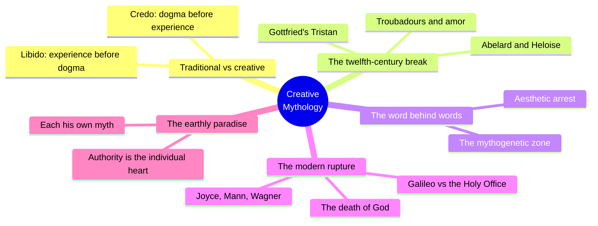
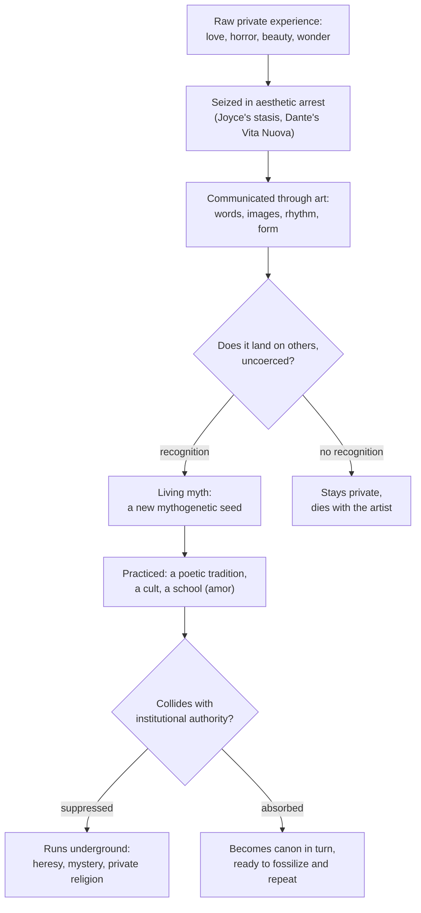
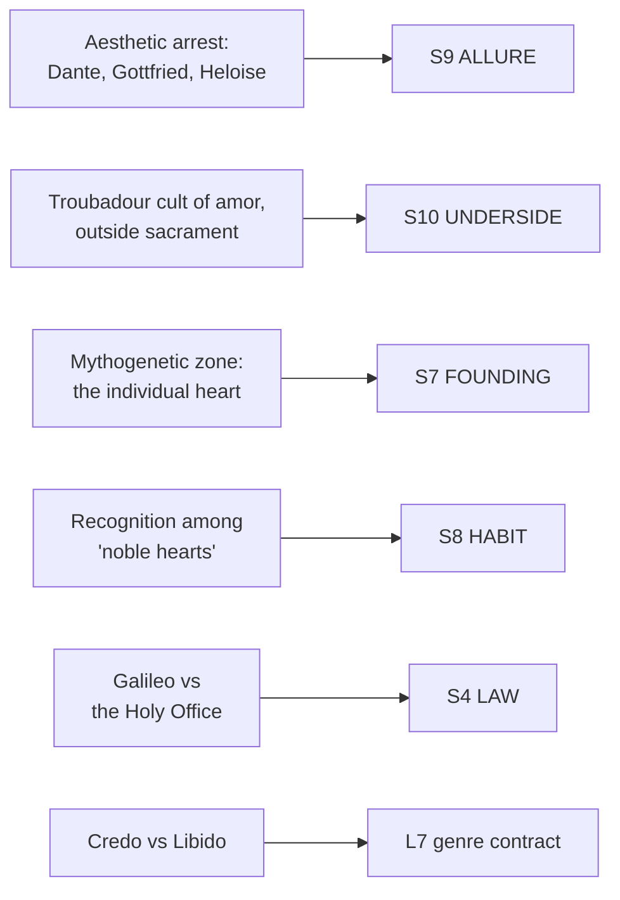

# BVX.0836 — The Masks of God, Volume IV: Creative Mythology — Joseph Campbell (1968)
### Knowledge Entry — Distill

The fourth volume of Campbell's comparative mythology, on the Western turn since the twelfth century from myth handed down by priesthood to myth authored by individuals; read here not for its literary history but for its mechanism: how one person's private experience, rendered in art, becomes a culture's shared belief.

## TABLE OF CONTENTS
- [Core Thesis](#1-core-thesis)
- [Mind Models](#2-mind-models)
- [Framework](#3-framework--structure)
- [Key Concepts](#4-key-concepts)
- [Heuristics](#5-heuristics--decision-rules)
- [Invariants](#6-invariants)
- [Pitfalls](#7-pitfalls--myths)
- [Application](#8-application)
- [Cross-References](#9-cross-references)
- [Provenance](#10-provenance--confidence)

---

## 1 · CORE THESIS

Traditional mythology is inherited and enforced by authority; creative mythology begins when an individual's private experience of love, horror, or beauty gets rendered in art with enough force that strangers recognize it as their own. Recognized, that private vision becomes the culture's working myth, running against institutional law rather than descending from it.

---

## 2 · MIND MODELS

*Required. Minimum two diagrams, maximum five.*

**Diagram 1 — the whole argument.**
Caption: *five movements, one relocation: mythic authority moves from the priesthood's dogma to the individual's own experience, and stays there.*

**Diagram 2 — the central mechanism (a process: private experience to cultural institution).**
Caption: *a myth is born the moment it lands on someone else uncoerced -- everything after that is the practiced tradition either fossilizing into a new orthodoxy or going underground against the old one.*

**Diagram 3 — mapped onto the Command's SETTING SLICE.**
Caption: *the book's whole argument lands on the layer that holds tension between a setting's public face and its private truth -- S10 UNDERSIDE is where this source does its heaviest lifting.*

---

## 3 · FRAMEWORK / STRUCTURE

Four parts, ten chapters, each pushing the same relocation of authority one stage further:

| Part | Chapters | What it traces |
|---|---|---|
| **I — The Ancient Vine** | 1 Experience and Authority · 2 The World Transformed · 3 The Word Behind Words | States the whole thesis (Credo vs. Libido) then runs it through the individual love-cases -- Heloise, the troubadours -- that founded the West's habit of authoring its own myths |
| **II — The Waste Land** | 4 The Love-Death · 5 Phoenix Fire · 6 The Balance | Gottfried's Tristan as the fullest worked example: amor as a third, discriminating principle set against both agape (church charity) and eros (animal lust), consecrated by the couple alone, not by clergy |
| **III — The Way and the Life** | 7 The Crucified · 8 The Paraclete | Wolfram's Parzival as the counter-case: a private quest that still arrives at a communal Grail company -- individual revelation reincorporated as a new, deliberately imperfect church |
| **IV — New Wine** | 9 The Death of "God" · 10 The Earthly Paradise | The modern rupture (Galileo, then Nietzsche) strips away the last fixed cosmology; Joyce, Mann, and Picasso complete the turn -- the mythogenetic zone is now flatly the individual heart, with no communal horizon left to fall back on |

---

## 4 · KEY CONCEPTS

| Concept | What it is | Why it matters |
|---|---|---|
| **Credo vs. Libido** | Dogma imposed from outside (Credo) versus conviction generated by one's own experience (Libido) | The book's whole organizing axis; every case study is one more instance of Libido displacing Credo |
| **Aesthetic arrest** | The seizure (Joyce's "stasis," Dante's Vita Nuova at age nine) in which an artist's entire later output germinates from one dated, private instant | The mechanism by which a private revelation becomes the seed of a public body of art, not a one-off feeling |
| **The mythogenetic zone** | Historically, a shared community or place where myth naturally arose; in the modern West, relocated entirely inside the individual | Explains why Campbell can say flatly that communities no longer generate myth -- individuals in contact with their own interior life do |
| **Amor** | The troubadours' third principle of love: neither church-sanctioned charity (agape) nor indiscriminate lust (eros), but personal, selective, and consecrated by the lovers alone | A worked example of a fully-formed rival doctrine growing up beside, not descending from, official theology |
| **The Heloise/Abelard split** | Heloise's testament of an actual, felt experience of love versus Abelard's return to sacrament, dogma, and fear | The book's clearest demonstration that a private myth and its official counterpart can diverge completely inside two people who lived the same event |
| **The Galileo trial** | The Holy Office's 1615/1633 condemnation of the Copernican, earth-moves cosmology, reproduced by Campbell in full | The paradigm collision: an individually verified truth against an institution that has already ruled the matter settled |
| **Determined-by vs. determinant-of** | Ortega y Gasset's formula: traditional myth is a "collective faith" individuals must reckon with regardless of belief; creative myth reverses the vector, letting individual conviction become the culture's new determinant | Names precisely what changes when a setting's myth-authorship shifts from communal to individual |
| **The pale criminal** | Nietzsche's figure, applied to Abelard: a man whose own deed (loving Heloise) outran the courage of the self left to receive it, so he retreated into the sacrament he had already outgrown | Shows the mechanism failing -- not every private revelation is carried through; some are abandoned back to Credo |

---

## 5 · HEURISTICS & DECISION RULES

| Situation | Do this | Not this |
|---|---|---|
| Building a faction's founding myth in an individually-authored setting | Trace it to one person's dated, specific private experience, later recorded or performed | Write it as an anonymous communal legend with no author |
| Writing a forbidden love-cult, art movement, or philosophy | Give it its own coherent doctrine, deliberately distinct from the two extremes it sits between (amor between agape and eros) | Make it mere "rebellion" with no internal logic of its own |
| Deciding when a character's private vision becomes public myth | Gate it on recognition: does it land, uncoerced, on other people | Assume any artist's private statement automatically becomes cultural canon |
| Depicting institutional response to an individually-authored truth | Stage a real collision (trial, censure) with the institution's own reasoning intact, per Galileo | Have authority simply concede, or vanish without resistance |
| Aging a private myth across the story's timeline | Let it either fossilize into a new orthodoxy or persist as an underground layer beneath the public one | Leave it static forever, unchanged by its own success |
| Writing an artist- or founder-character's origin | Anchor their whole output to one dated aesthetic-arrest scene | Give them an "always talented" backstory with no triggering incident |
| Running two rival belief systems in the same setting | Model them as Credo (imposed) versus Libido (experienced) competing for the same population | Treat every religion or ideology in the setting as equally top-down |

---

## 6 · INVARIANTS

1. **Traditional myth precedes and controls experience; creative myth is produced by experience** and, if it lands, comes to control others' experience in turn.
2. **A private revelation becomes public myth only through communication in a shared code** -- word, image, rhythm, form; it cannot remain a code of one and still spread.
3. **Institutional authority under pressure from an individually verified truth asserts its prior ruling formally** (trial, doctrine, censure) before it revises -- the Galileo pattern.
4. **A belief that sits outside official sanction still needs its own positive doctrine to survive**, not mere negation of the sanctioned one -- amor was disciplined, not licentious.
5. **Recognition, not proclamation, promotes a private myth to a living one**: those who receive and respond to it "of themselves, uncoerced."
6. **Every authored myth is a candidate future orthodoxy.** What begins as one person's Libido can fossilize into the next generation's Credo.
7. **The individual who authors a new myth and the institution that must absorb or reject it are both changed by the collision**; neither returns to its prior state unaltered.

---

## 7 · PITFALLS / MYTHS

- Treating "individual creativity" as automatically opposed to all structure -- amor was a discriminating, disciplined doctrine, not mere license.
- Writing the artist-founder as instantly believed; recognition is the actual gate, and most private visions stay with the artist and die there.
- Making institutional authority a strawman that simply loses -- Anselm, the Inquisition, and the Church all carry coherent internal logic even where the book sides against them.
- Confusing the death of one cosmology (Galileo's) with the disappearance of myth altogether -- Campbell's claim is relocation into the individual, not extinction.
- Flattening every secret or underground belief into a single undifferentiated "heresy" -- amor, Gnosticism, and mystery cult are shown as structurally distinct solutions to the same pressure.
- Assuming a founder's private experience must be flattering or triumphant to found a culture -- horror and dread seed myth as readily as love does, in Campbell's own account.

---

## 8 · APPLICATION

- **Spine level:** L0 (a root-theory claim about what myth is and where it comes from) and SETTING (its payload is a setting-authoring mechanism, per the v4 template's binding rule that setting sits beside the L0–L7 spine as a Domain embodied)
- **12-layer character stack:** none directly -- aesthetic arrest is structurally the same *shape* of move as an L7 ORIGIN-triggering event for a character, but this source stays setting-side
- **plot_systems:** contextual candidate -- the "does it land, uncoerced" recognition test (Diagram 2) is a ready-made scene mechanism for any moment a character's private conviction goes public and either takes or doesn't
- **Setting:** primary -- feeds S9 ALLURE, S10 UNDERSIDE, and S7 FOUNDING at primary strength, S8 HABIT and S4 LAW at supporting strength, plus L7 genre-contract contextually

This book is the theoretical case for a move DCUS's own instance in `ssot_03` already makes without naming it. DCUS's S9 ALLURE record is "the meritocratic promise" Tori must stop believing, and its S10 UNDERSIDE record is "the first name under the second" -- legacy students committing a small violation every time they say "Red Hills" instead of the sanctioned name. Read against Heloise and Abelard, that's the same structure exactly: an officially sanctioned narrative (Abelard's theology; the Administration's Star-Rating) sitting over a privately held, still-felt truth (Heloise's love; the buried founding name) that surfaces as a small, repeated, recognizable violation rather than open rebellion. The book supplies the mechanism DCUS's design already assumes -- a private myth does not need to win outright to matter; it only needs enough people to recognize it, uncoerced, for it to keep operating underneath the public one. As a direct TTRPG steal: give any faction founder, cult leader, or artist-NPC one dated aesthetic-arrest scene as their actual origin, then gate whether their private myth spreads on a recognition beat (does it land on a specific listener, uncoerced) rather than treating charisma or canon-status as automatic. The Galileo case is the ready template for staging the moment that private myth collides with an S4 LAW institution formally, with the institution's own reasoning left intact rather than played as cartoon villainy.

---

## 9 · CROSS-REFERENCES

| Related entry | Relation |
|---|---|
| [[BVX.0835]] | Campbell, The Masks of God, Volume II: Oriental Mythology — direct sibling; that volume traces collective, geography-driven cosmology across a civilization, this one traces individually-authored myth inside a single culture once collective cosmology fractures |
| [[BVX.0834]] | Campbell, The Masks of God, Volume III: Occidental Mythology — undistilled direct sibling; presumably covers the Levant/Christian doctrinal frame that this volume's twelfth-century individuals are shown breaking from |
| [[BVX.0616]] | Campbell, The Hero with a Thousand Faces — same author; the Monomyth's individual hero-journey is the psychological substrate this volume shows real historical artists actually living out |
| [[BVX.0458]] | Kobold Guide to Worldbuilding — craft-side sibling; Cook's mystery-cult essay (feeding S10 UNDERSIDE there too) is the TTRPG-design version of this book's public/official-versus-private/personal religion split |

---

## 10 · PROVENANCE & CONFIDENCE

Full text, JCF digital edition (2016), pdftotext extraction, ~277,000 words including reference notes and illustration lists; 732 page-break marks in the extraction (an ebook proxy for pagination, not a printed page count). Structure mapped in full via chapter- and part-header search across the whole text. Read in full: Chapter 1, "Experience and Authority" (both its "Creative Symbolization" and "Where Words Turn Back" sections, ~1,300 lines) -- the book's founding statement of Credo versus Libido; the closing pages of Chapter 10, "The Earthly Paradise" (the "mythogenetic zone is the individual heart" passage through the book's final paragraph). Deep-sampled with targeted ranged reads: Chapter 3, "The Word Behind Words," section IV "The Crystalline Bed" (the Abelard/Heloise sequence and the rise of the troubadours, amor, and the "new mythology of self-discovery") and section on aesthetic arrest (Joyce's Stephen Dedalus, Dante's Vita Nuova); the "mythogenetic zone" passage in the same chapter's later pages; Chapter 4's opening section, "Eros, Agape, and Amor" (amor defined against both church charity and Gnostic/Manichaean asceticism); Chapter 9's opening section, "The Crime of Galileo" (the Holy Office's condemnation, reproduced as Campbell quotes it). Not deep-read: the bulk of Chapters 2, 5–8, and the middle of Chapter 10 (~15,000 further lines extending the same case-study method across Wagner's Tristan, Wolfram's Parzival, Nietzsche, Mann, and Joyce in full) -- confirmed by keyword search not to depart from the Credo/Libido, aesthetic-arrest, and mythogenetic-zone argument already extracted, per the brief's reading budget and its aim at the setting-authoring mechanism rather than the full comparative-literature survey.

`year: 1968` is taken from the title page's own copyright line ("Text copyright © 1968, Joseph Campbell"), not the 2016 digital-edition copyright beside it, matching the convention set by the BVX.0835 sibling entry. The S-layer keying in `feeds:` and Diagram 3 is this distill's own synthesis against `ssot_03_setting_system.md`'s twelve-layer SETTING SLICE, tested directly against the DCUS starter instance's existing S9 and S10 records as noted in §8.

## META
- Template: BVX-LEARN-v4.0
- Source classification: full-text extraction, deep read on Chapter 1 and the Chapter 10 close, sampled on Chapters 3, 4, and 9, keyword-confirmed on Chapters 2, 5–8, and the Chapter 10 midsection
- Created / Updated: 2026-09-29
