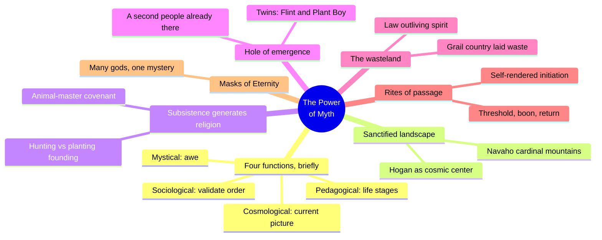
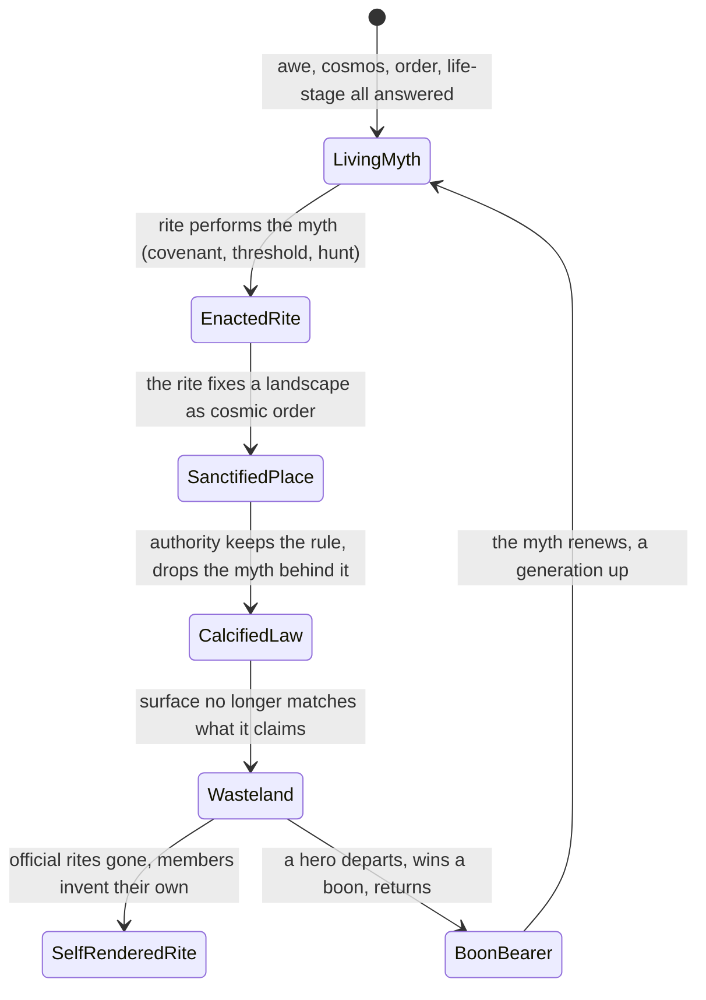
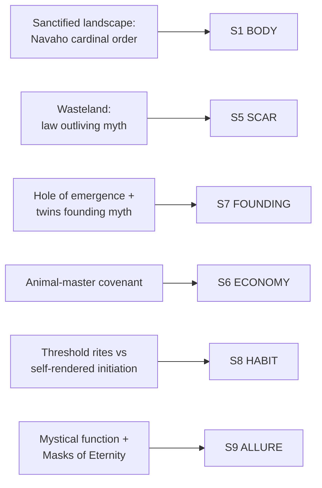

# BVX.0841 — The Power of Myth — Joseph Campbell with Bill Moyers (1991)
### Knowledge Entry — Distill

Campbell's television-conversation book with Bill Moyers, read here not for its four-function scaffolding (BVX.0823 already carries that systematically) but for its concrete, place-bound scenes of myth doing work: a landscape sanctified, a hunt made sacred, a founding told through twins, a wasteland diagnosed, a rite gone missing.

## TABLE OF CONTENTS
- [Core Thesis](#1-core-thesis)
- [Mind Models](#2-mind-models)
- [Framework](#3-framework--structure)
- [Key Concepts](#4-key-concepts)
- [Heuristics](#5-heuristics--decision-rules)
- [Invariants](#6-invariants)
- [Pitfalls](#7-pitfalls--myths)
- [Application](#8-application)
- [Cross-References](#9-cross-references)
- [Provenance](#10-provenance--confidence)

---

## 1 · CORE THESIS

Myth is a working system: it wakes awe, updates the cosmos, validates a group's law, and carries each member through life's thresholds. Rite is that system enacted in place and body, a landscape sanctified, an animal covenant honored, a threshold crossed. When law outlives the myth behind it, the setting goes to wasteland: order on the surface, nothing underneath.

---

## 2 · MIND MODELS

*Required. Minimum two diagrams, maximum five.*

**Diagram 1 — the whole argument.**
Caption: *eight conversation chapters compress to six setting-grade scenes; the four-function theory is here too, but only as the frame the scenes hang on.*

**Diagram 2 — the central mechanism (a state change: how a living myth curdles into a wasteland, and how it renews).**
Caption: *the wasteland is not the absence of religion, it is religion's law running on with its living myth switched off; the fix is a boon carried back, not a new rule handed down.*

**Diagram 3 — mapped onto the Command's SETTING SLICE (S1-S12).**
Caption: *six scenes land on five S-layers, with the wasteland's fit going to SCAR rather than LAW: the damage is the mismatch, not the rule itself.*

---

## 3 · FRAMEWORK / STRUCTURE

Eight conversation chapters, unscripted and recursive rather than sequential; the load-bearing material for a setting-builder clusters in five of the eight:

| Chapter | Governing question | Setting-grade material |
|---|---|---|
| I. Myth and the Modern World | Why myths at all? | The four functions (mystical, cosmological, sociological, pedagogical); the sanctification of local landscape (Navaho hogan, cardinal mountains) |
| II. The Journey Inward | Follow your bliss | Personal psychology; thin for setting work, not load-bearing here |
| III. The First Storytellers | How did hunting peoples' myth work? | The animal-master covenant; killing-guilt discharged through ritual, not law |
| IV. Sacrifice and Bliss | What does a planting culture's myth do? | The hole of emergence; the Flint/Plant-Boy twins; the wasteland (Chartres, the Grail, courtly love as protest) |
| V. The Hero's Adventure | What shape does the hero's path take? | Departure-fulfillment-return; the boon; self-rendered initiation once official rites vanish |
| VI. The Gift of the Goddess | Mother-earth mythology | Sampled only, not load-bearing here |
| VII. Tales of Love and Marriage | Romantic love as a myth | Sampled only, not load-bearing here |
| VIII. Masks of Eternity | Why so many gods? | Gods as personifications of one impersonal energy; the source stays a mystery behind every mask |

---

## 4 · KEY CONCEPTS

| Concept | What it is | Why it matters |
|---|---|---|
| **Four functions of myth** | Mystical (awe), cosmological (a current picture of the universe), sociological (validate the social order), pedagogical (carry a person through life's stages) | Stated here in passing; BVX.0823 (*Myths to Live By*, same author) runs this as the diagnostic engine. Use that entry for the mechanism, this one for the scenes it explains |
| **Sanctification of the local landscape** | "A fundamental function of mythology": the Navaho hogan faces east, its fireplace is a cosmic center, its smoke reaches the gods; sand paintings ring an opening for the incoming spirit | A concrete build technique: orient a structure or settlement to a cosmological order (a world-axis point, a cardinal direction, a founding event) and the place reads as sacred without a word of exposition |
| **The animal-master covenant** | Hunting peoples hold that the principal food animal gives its life willingly under a covenant with an "animal master"; rites of appeasement (feeding the bear its own flesh, drawing and erasing the kill on a hilltop shrine) discharge the guilt of killing what feeds you | Economy generates religion directly: a culture's subsistence base is upstream of its ritual life, not a detail added after the pantheon is drafted |
| **The hole of emergence** | A people climbs out of a prior, unfinished world through one spot; that spot becomes the sacred center, often tied to a specific mountain. On arrival, a second people is already there | A ready-made origin-myth generator, and an honest one: it builds in the awkward fact that "the chosen people" always meets an inconvenient prior claim |
| **Flint and Plant Boy (the founding twins)** | Iroquois twins born of one mother: Flint (the blade, the hunting tradition) and Plant Boy (planting); recast in Genesis as Cain (planter, abominated) and Abel (herder, favored) | A structural template for two factions in conflict over subsistence mode, told as a single origin story rather than two separate ones |
| **The wasteland** | Not physical ruin but a mismatch: a supernatural law imposed from outside that people obey without living, so "the surface does not represent the actuality of what it is supposed to be representing" | The mechanism behind Chartres, the Grail romances, and Eliot's poem alike: the land or the institution looks intact while the life that once justified it is gone |
| **Departure, fulfillment, return (the boon)** | The recurring shape of the vision quest: leave the known world, find what was missing, then face the harder problem of carrying it back into the social world | The template distinguishes a quest from an adventure: an adventure ends at the discovery, a hero's quest ends only when the boon is delivered home |
| **Self-rendered initiation** | With no threshold rites left, "the youngsters invent them themselves... raiding gangs... that is self-rendered initiation" | The mechanism for what HABIT loses when a myth layer collapses: not an empty slot, but an ungoverned rite filling it, with none of a sanctioned rite's containment |
| **Masks of Eternity** | Gods are not the source of the sacred energy they represent, they are its vehicle; "the force or quality of the energy... determines the character and function of the god" | A pantheon-design rule: many gods can read as coherent facets of one mystery rather than a kitchen-sink list, if each is built as a mask on the same underlying source |

---

## 5 · HEURISTICS & DECISION RULES

| Situation | Do this | Not this |
|---|---|---|
| Making a structure or settlement feel sacred | Orient it to a cosmological order: a cardinal direction, a world-axis point, a founding event fixed in the layout | Describe it as impressive architecture with no cosmological logic behind the plan |
| Building a culture's religion from its economy | Derive ritual (taboo, reverence, guilt-discharge) directly from how the culture actually eats or trades | Draft a pantheon first and retrofit an economy to match it |
| Writing two factions in structural conflict | Tell their origin as one founding myth split into two siblings (twins, rival brothers), not two unrelated backstories | Give each faction an origin story that never touches the other's |
| Diagnosing a decayed institution, faith, or region | Ask whether its law still expresses a lived myth, or whether the myth is gone and only the rule remains | Explain the decay as corruption, decadence, or "evil" with no mechanism behind it |
| A culture's threshold rites have vanished | Show what fills the vacuum: an unsanctioned, self-invented rite (a gang initiation, a rogue rite) with none of the old rite's containment | Show an empty space where the rite used to be, with nothing replacing it |
| Sending a character on a quest | Give it a shape: departure, the thing found that was missing, then the harder return and re-entry into the social world | End the arc at the discovery and skip the cost of bringing it home |
| Building a setting's pantheon | Design many gods as masks of one underlying mystery, each a different quality of the same energy | Assign each god an unrelated department with no shared source behind the list |

---

## 6 · INVARIANTS

1. **A landscape becomes sacred by being fixed to a cosmological order**, not by scale or grandeur alone.
2. **Subsistence mode generates religious form.** How a culture eats predicts the shape of its rites of appeasement and guilt-discharge before a single god is named.
3. **An origin myth commonly builds in a prior claimant.** The founding people arrives to find someone already there; erasing that fact is a choice, not a default.
4. **A wasteland is a mismatch, not an absence.** The institution, law, or ritual can be fully intact and still be dead, if the myth that once lived inside it is gone.
5. **A vacated threshold rite does not stay vacant.** Something unsanctioned fills it, and that something carries none of the original rite's containment or authority.
6. **A quest is not complete at discovery.** The harder half is carrying the boon back into the world that sent the hero out.
7. **A pantheon reads as coherent when its gods are masks of one source, not independent, unrelated departments of a supernatural bureaucracy.**

---

## 7 · PITFALLS / MYTHS

- Writing a "sacred" building or city with visual grandeur but no cosmological logic behind its plan, orientation, or center.
- Building a culture's religion in isolation from how it actually eats, trades, or survives, then bolting an economy on afterward.
- Giving two conflicting factions unrelated origin stories instead of one shared founding myth split into rival principles.
- Confusing institutional decay with simple villainy: a wasteland is a law that has outlived its myth, not a law that was evil from the start.
- Depicting a broken initiation system as silence rather than as a rogue rite that has rushed in to fill the gap.
- Ending a hero's arc at the moment of discovery, skipping the return that actually completes the quest.
- Building a pantheon as an unrelated list of departmental gods instead of masks on one shared mystery.

---

## 8 · APPLICATION

- **Spine level:** SETTING (non-story-spine source; setting is a Domain embodied, never an L0-L7 level, per the SSOT's binding rule)
- **12-layer character stack:** none directly fed; the departure-fulfillment-return quest shape runs structurally parallel to an L5/L0 hero arc (see BVX.0822 for that direct character-layer feed) but this entry stays on the setting side
- **plot_systems:** contextual candidate once `04_PLOT_SYSTEMS/` opens; the wasteland state diagram (Diagram 2) is a ready decay-and-renewal arc for a region, faction, or institution: run any drafted place through "does its law still express a lived myth" before trusting it as backstory
- **Setting:** primary; feeds S1 BODY (sanctified landscape), S5 SCAR (wasteland as mismatch), S7 FOUNDING (hole of emergence, founding twins), S6 ECONOMY (animal-master covenant), S8 HABIT (threshold rites and their self-rendered replacements), and S9 ALLURE contextually (the mystical function, Masks of Eternity)

Read this entry beside BVX.0823 (*Myths to Live By*, same author): that book carries the systematic four-function diagnostic, this one supplies the buildable scenes, a hogan's floor plan, a bear-feeding rite, a pair of twins, a stripped-bare Grail country. The most useful move for the setting system: run the wasteland diagnostic in reverse. Draft a place's S4 LAW first, then ask what mystical function or S9 ALLURE it would need to still feel alive under that law. No answer means the place is already a wasteland, worth writing as a present fact rather than hiding. Equally useful: treat a faction pair's founding myth as one twin-story split down the middle, a hunting people and a planting people sharing one origin, opposed by what they eat, rather than two competing lore dumps.

---

## 9 · CROSS-REFERENCES

| Related entry | Relation |
|---|---|
| [[BVX.0823]] | *Myths to Live By*, same author; carries the four-function diagnostic and the economic-base-to-war-myth chain systematically. This entry supplies the concrete scenes (landscape, covenant, twins, wasteland, rites) that book states as mechanism |
| [[BVX.0822]] | *Mythology: The Voyage of the Hero* (Leeming); the departure-fulfillment-return shape here is the same monomyth Leeming runs as an eight-beat character function, the direct L5/L0 feed this entry does not take |
| [[BVX.0458]] | Kobold Guide to Worldbuilding; its "masks of the gods" pantheon-design rule and Apocalypso's precursor-ruin SCAR are the TTRPG-craft counterparts to this book's Masks of Eternity and wasteland-as-mismatch |
| [[BVX.1122]] | GURPS Hot Spots: Renaissance Venice; a worked historical instance of public religion versus private devotion, one register below the public/mystery split this book's masks concept implies |
| [[BVX.0349]] | *Against Worldbuilding, and Other Provocations*; its warning against inert, encyclopedic setting detail parallels this book's wasteland diagnostic, a place can be fully documented and still be dead |

---

## 10 · PROVENANCE & CONFIDENCE

Full text available, plain-text extraction, ~8,400 lines, clean chapter breaks under a machine-readable table of contents (Editor's Note, Introduction, eight chapters I-VIII). Read by targeted extraction: chapter boundaries located, then keyword search (four functions, wasteland, animal master, sanctification, hole of emergence, masks) followed by contextual reads of 20-150 line windows around each hit. Deep-extracted: Chapter I (four functions, sanctified landscape); Chapter III (the animal-master covenant, full scene); Chapter IV (wasteland/Grail/Chartres, hole-of-emergence, founding twins); Chapter V (the boon, departure-fulfillment-return, self-rendered initiation); Chapter VIII (the opening passage on gods as vehicles of one mystery). Not sampled: Chapter II, VI, VII, judged from their titles to carry personal-psychology and romantic-love material outside this pass's setting scope; confidence is set to medium on that basis, not on doubt about the material actually read.

The S-layer keying in frontmatter `feeds:` and Diagram 3 is this distill's own synthesis against `ssot_03_setting_system.md` (PART A, the twelve-layer SETTING SLICE), chosen to complement rather than restate BVX.0823's existing S4/S7/S8/S9 keying: S1 and S5 are new registers this book adds, S7 and S8 are kept but keyed to different, non-overlapping passages (founding twins, not war-myth grammar; self-rendered initiation, not the puberty-rite mechanism), and S6 is a supporting layer neither prior Campbell entry carries. `spine: [SETTING]` follows the v4 template's binding rule that setting is an entity beside the spine, never a story-spine rung.

## META
- Template: BVX-LEARN-v4.0
- Source classification: full-text conversation transcript, targeted deep extraction on 5 of 8 chapters, 3 chapters set aside as out of scope for this pass
- Created / Updated: 2026-09-29
