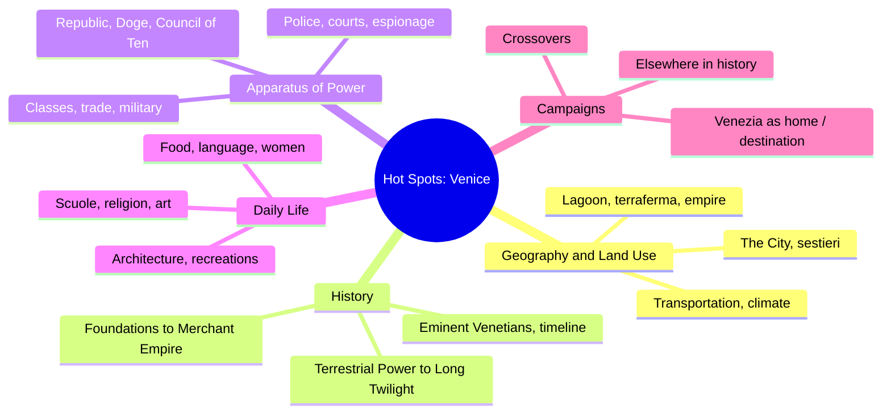
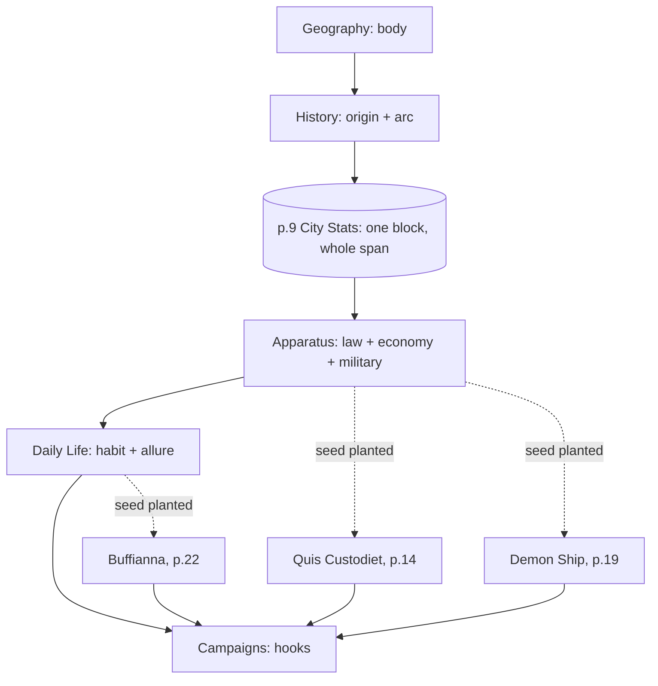
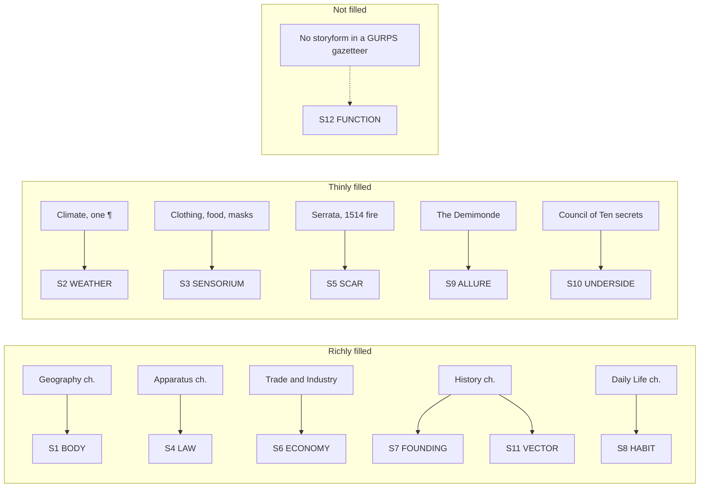

# BVX.1122 — GURPS Hot Spots: Renaissance Venice — Matt Riggsby (2018)
### Knowledge Entry — Distill

Not a craft book: a **worked setting**, a professional sourcebook building one city, at play-table grade, across five chapters and one page-9 stats block — read here for the *engineering* of that build, then filed as the Command's first SETTING SLICE reference instance beside DCUS.

## TABLE OF CONTENTS
- [Core Thesis](#1-core-thesis)
- [Mind Models](#2-mind-models)
- [Framework](#3-framework--structure)
- [Key Concepts](#4-key-concepts)
- [Heuristics](#5-heuristics--decision-rules)
- [Invariants](#6-invariants)
- [Pitfalls](#7-pitfalls--myths)
- [Application](#8-application)
- [Cross-References](#9-cross-references)
- [Provenance](#10-provenance--confidence)

---

## 1 · CORE THESIS

A worked setting is built in **one fixed order** — body, then history, then law/economy, then the patterned life of the people, then hooks — because each later chapter needs the earlier one as load-bearing fact, not backdrop. One compressed stats block (p.9) anchors the whole multi-century span so only a couple of numbers need to change over time; everything else is narrated once and reused everywhere.

---

## 2 · MIND MODELS

*Required. Minimum two diagrams, maximum five.*

**Diagram 1 — the whole book.**
Caption: *five chapters, each a branch of one place — geography and history are load-bearing for everything that follows, campaigns is pure payoff.*

**Diagram 2 — the book's organizing mechanism.**
Caption: *geography and history are consumed silently by everything downstream; the stats block anchors the span so daily life never has to re-derive the city; adventure seeds are planted early and only harvested at the end.*

**Diagram 3 — mapped onto the Command's SETTING SLICE.**
Caption: *six layers fill richly from chapter-length material, five fill thin from a paragraph or a scattered mention, and S12 FUNCTION — the storyform binding — is structurally absent because a GURPS sourcebook is written for any campaign, not one argument.*

---

## 3 · FRAMEWORK / STRUCTURE

The book's skeleton, in the order it commits:

| Chapter | Governing question | What it hands the next chapter |
|---|---|---|
| **Intro** (glossary, recommended works, publication history) | What vocabulary and shelf-position does the reader need first? | Terms (*ca'*, *calle*, *rio*, *doge*) used unglossed from Ch.1 on |
| **1. Geography and Land Use** | What is the physical fact of the place? | The body every institution, economy, and habit sits on top of |
| **2. History** | How did it get this way, and where is it going? | The founding stack and the setting arc (rise → peak → decline) |
| **3. The Apparatus of Power** | What rules bind it — governance, law, economy, military? | The pressure field Daily Life's people live inside |
| **4. Daily Life** | What is it like to actually live there? | The textured, habitable surface a scene would actually show |
| **5. Campaigns** | What can a party *do* here? | Nothing downstream — this chapter is pure payoff, cashing in Ch.1–4 as hooks |

One mechanism crosses every chapter boundary: a single **GURPS City Stats block** (p.9) — Population, Terrain, Hygiene, Appearance, Mana, Language, TL, Wealth, Status, Government, CR, Defense Bonus, Military Resources — stated once, valid for the entire 15th–16th century span the book covers. Only two things are called out as varying with date (search-roll bonuses for spices, books, glassware). This is the book's whole answer to the TIME axis: **narrate once, flag the two numbers that move.**

A second cross-cutting device: **Adventure Seed** sidebars (*Quis Custodiet Ipsos Custodes*, p.14; *Demon Ship*, p.19; *Buffianna, L'ammazzavampiri*, p.22) are planted physically next to the material that inspired them — Council of Ten espionage, the Navy, convents — rather than held back for Ch.5. Campaigns then formally collects the technique (Venezia as Home / as Destination) without having to re-explain any of the three seeds' premises.

---

## 4 · KEY CONCEPTS

| Concept | What it is | Why it matters |
|---|---|---|
| **The single stats block** | One page-9 GURPS sidebar standing for the entire covered span | Pick the two or three values that actually drift (here: search bonuses) and hold the rest as baseline |
| **Sestieri** | Six districts, ~80 parishes, explicitly mixed-class ("no rich or poor part of town") | A SCALE subdivision that refuses the lazy rich-district/poor-district trope |
| **Adventure Seeds in place** | Boxed hooks embedded beside the institution that generates them, not deferred to a hooks chapter | Hooks read as emergent from the fabric, not bolted on at the end |
| **Crossovers section** | An explicit table naming which genre lines and sibling sourcebooks the setting slots into | A worked setting names its own shelf position instead of leaving the reader to infer it |
| **Stated absence as design** | "Venezia doesn't have dungeons. It doesn't even have basements... Anyone trying to adventure underground will drown." | Naming what a setting will never give the party closes a door explicitly, instead of by omission |
| **Home vs. Destination framing** | Campaigns splits into native PCs (Home) and visiting PCs (Destination) | One fabric, two player postures — reads as opportunity or alienation depending which side starts inside |
| **Class as connective tissue** | Patrician / cittadini / popoli status recurs across Apparatus, Daily Life, and Architecture | One stratification axis threaded through many S-layers beats restating class rules per chapter |
| **Indirect sensorium** | Sound, texture, and smell arrive through material culture, not an atmosphere pass | S3 SENSORIUM can be delivered entirely through institutional/economic detail and still land |

---

## 5 · HEURISTICS & DECISION RULES

| Situation | Do this | Not this |
|---|---|---|
| A place spans centuries | Write one baseline, flag the few numbers that actually drift | Write a separate description per decade |
| Building hooks for a worked setting | Plant seeds beside the institution that generates them, collect the technique later | Hold all hooks for a final chapter with no tissue back to the fabric |
| A genre trope doesn't fit the place | State the absence directly ("no dungeons, no basements") | Leave it unaddressed and let the reader assume it applies |
| Setting hosts both native and visiting characters | Write two campaign postures explicitly (Home / Destination) | Write one generic "adventures here" section for both |
| Setting sits on a shared shelf of other books | Name crossovers and boundary conditions explicitly | Assume the reader infers compatibility |
| A stratification system matters | Thread it once through governance, daily life, architecture | Re-explain the class system fresh per chapter |
| Sensory texture wanted, prose space tight | Deliver it through material culture (clothing, food, bells) | Assume sensorium requires its own atmosphere chapter |
| A sibling sourcebook covers adjacent ground | Refer the reader there, cut the overlap | Restate shared material for completeness |

---

## 6 · INVARIANTS

1. **Geography and history are consumed silently downstream** — no later chapter re-derives the body or the founding stack; both are assumed known.
2. **One stats block stands for the whole covered span** — a worked setting does not need a snapshot per date, only a flag on what actually moves.
3. **Hooks are cheapest when planted at the source** — an Adventure Seed next to the institution that inspired it costs less connective prose than one collected cold in a hooks chapter.
4. **A setting's campaign chapter is pure payoff** — it generates nothing new; every hook it offers resolves to material established in the four chapters before it.
5. **Absence stated is stronger than absence implied** — naming what a setting will never contain (no dungeons, no walls, no university) is itself worldbuilding, not a gap.
6. **Class/status threaded once, referenced everywhere** — a stratification axis is written as connective tissue across chapters, not restated per chapter.

---

## 7 · PITFALLS / MYTHS

- Mistaking the stats block for the setting — it's a mechanical anchor point, not the pressure field.
- Reading History as background flavor rather than as the source of S7 FOUNDING and S11 VECTOR — the rise-peak-decline arc is load-bearing structure, not color.
- Expecting comprehensive sensory description (S3) from a worked-setting sourcebook — don't grade a sourcebook against a novel's sensory standard.
- Assuming a GURPS-style gazetteer supplies an S12 FUNCTION binding — it structurally cannot; the argument-role layer is the Command's to add, never the source's to have already filled.
- Treating "Crossovers" as filler — it's the book naming its own shelf position, worth stealing for any setting meant to sit beside others.
- Confusing the Adventure Seed boxes with the SCENE CARD — seeds are premise hooks one level above a scene; they carry no function-mode, sensorium-budget, or value-turn fields.

---

## 8 · APPLICATION

- **Spine level:** SETTING (non-story-structural; a place-grade reference source, not a story-spine source)
- **12-layer character stack:** none — this source has no character-layer content; it feeds only the SETTING SLICE (S1–S11 as detailed below; S12 unfillable from this source)
- **plot_systems:** the Adventure Seed technique (hooks planted in-place beside the institution that generates them, collected formally in a closing chapter) is a directly reusable pattern for any Command worked-setting write-up, independent of the SETTING SLICE itself
- **Setting:** primary — this is the shelf's proof text for `03_SETTING_SYSTEMS/`; §2 diagram 3 above is the mapping, and the table below is the filled instance per the SSOT's own table form

**SETTING SLICE — Venezia (instance, from this source)**

**Header:** `venezia_c15-16` · names: Venezia / Venice / La Serenissima / the Republic of Venice · scale: **settlement** (island city, ~1 sq. mi., 70+ islands) · parent: the lagoon, the terraferma, the Venetian Empire (Istria, Dalmatia, Corfu, Crete, Cyprus, Aegean holdings) · role: worked setting / reference instance, not yet bound to any Command storyform.

| Layer | Venezia |
|---|---|
| S1 BODY | ~70 islands stitched by landfill and pedestrian bridges, six sestieri either side of the S-curved Grand Canal, city ~2.5mi × 1⅓mi, ~1 sq. mi. total; landmarks named and laid out (Rialto, Piazza San Marco, Ghetto, Arsenale, San Michele) |
| S2 WEATHER | Mediterranean; hot but not punishing summers, mild winters, rare freezes, frequent rain, high humidity, fog in cooler seasons. ⧗ **canon-thin — one paragraph, no seasonal-rhythm detail beyond this** |
| S3 SENSORIUM | Assembled indirectly: Arsenale bells marking the workday, white masks for men / black for women, sumptuary-regulated clothing, sweet-and-savory food combinations. No direct atmosphere pass in the source |
| S4 LAW | Maggior Consiglio → Senate (Consiglio dei Pregadi) → Doge → Council of Ten (the real power, secret); Capi di Sestieri, Signori di Contrabanni, night watchmen; sumptuary law widely evaded (*pagare le pompe*) |
| S5 SCAR | ⧗ **canon-thin** — no erasure/rename narrative; closest analogues are the 1297 *serrata* (locking Grand Council membership into a hereditary oligarchy) and the 1514 fire that destroyed most of the Rialto |
| S6 ECONOMY | Trade empire: spices, dyes, medicines from the East; native salt, silk, glass (Murano), publishing (150+ publishers by 1500); the ducat/zecchino and piccolo/soldo coinage; the Arsenale as the city's largest single economic engine |
| S7 FOUNDING | Traditional founding 421 A.D., refugees from barbarian migrations settling the lagoon under Byzantine authority; first doge elected 726; seat of government settles at the Rialto c.821 |
| S8 HABIT | Scuole (grandi and piccole) providing social services; compagnie delle calze; Carnival (Christmas to Lent, masks worn nearly half the year); *mediocritas* as an enforced patrician virtue; rigid but not fully impermeable class lines |
| S9 ALLURE | The Demimonde (*cortigiane oneste* as near-celebrities); "the best place in the Western world to find any book"; luxury and spectacle for visitors. ⧗ **canon-thin relative to S1/S4/S6 — present but brief** |
| S10 UNDERSIDE | Council of Ten's secret chancery (guards kept illiterate to protect its secrets); an underground gay subculture centered on named taverns, barbers, and pastry shops; lax enforcement of sodomy and sumptuary law behind a strict-looking legal facade. Notably, the *literal* underside (basements, undergrounds) is stated absent — the city is built on landfill at sea level |
| S11 VECTOR | Explicit rise → peak → decline arc: Merchant Empire (to early 15th c.) → Terrestrial Power (territorial height, mid-late 15th c.) → Long Twilight (from Lepanto, 1571, to Napoleon's conquest, 1797) |
| S12 FUNCTION | ⧗ **absent** — no `storyform_id`; a GURPS gazetteer is written for any campaign, so it carries no throughline Domain, argument role, or `narrative_invariant` set. Binding this instance to a Command storyform, should Venezia ever be used as a location, is future work, not something this source can supply |

**The proof reads:** six of eleven physical/social layers fill richly on the first pass (S1, S4, S6, S7, S8, S11), five fill thin from a paragraph or a scattered mention (S2, S3, S5, S9, S10), and S12 is cleanly, structurally empty — the schema separates "how much raw material a source gives a place" from "whether that place has been bound to a story," exactly as intended.

---

## 9 · CROSS-REFERENCES

| Related entry | Relation |
|---|---|
| [[BVX.0268]] | Buckham, *Writing Active Setting* Bk.1 — the Command's setting-taxonomy source (Axis 3 FUNCTION modes); this entry shows what a *filled instance* of that taxonomy looks like at settlement scale |
| [[BVX.0349]] | Kennedy, *Against Worldbuilding* — the counter-argument (worldbuilding serves pressure, not inventory); useful check against reading this entry's rich S1/S6/S7 fill as license to inventory rather than pressure |
| [[BVX.0458]] | Kobold Guide to Worldbuilding — the TTRPG gazetteer-structure sibling this book's own chapter skeleton (geography → history → society → daily life → hooks) draws its lineage from |
| [[BVX.0067]] | Collaborative Worldbuilding for Writers & Gamers — shares the worked-setting-as-shared-shelf concern (this book's Crossovers section) |
| [[BVX.0447]] | GURPS Steampunk 1: Settings and Style — same GURPS gazetteer family; a second data point for whether the chapter skeleton and single-stats-block mechanism generalize across GURPS worked settings |

---

## 10 · PROVENANCE & CONFIDENCE

Full text, pdftotext extraction, ~28,000 words, clean text layer, 34 numbered content pages plus front matter and index. All five chapters and every named section in §3's table were read in full, including the three Adventure Seed sidebars and the alternate-history sidebar "A Man, a Plan, a Canal." GURPS mechanical content (the p.9 City Stats block, Status/Wealth tables, search-roll bonuses) was noted for where it sits structurally but not extracted mechanically — this distill treats it as a *device* (one block anchoring the TIME axis), not as rules content.

The SETTING SLICE table in §8 is this distill's synthesis, filled against `ShroomsQ/_CANON/_SSOT/03_SETTING_SYSTEMS/📐 ssot_03_setting_system.md`'s twelve-layer schema and table form (mirroring the DCUS starter instance) — inference from the source's content, not asserted by the source itself, which has no knowledge of the Command's schema. S12 FUNCTION's absence is a structural fact about the source type (a GURPS gazetteer carries no storyform), not a reading gap.

Bibliography and Discography (p.33) sampled at heading level only, not extracted — they name further primary sources (Ackroyd, Brown, Calimani, Lane, Laven, Mattingly, Muir, Strathern, Trincanato) that could deepen S2 WEATHER, S3 SENSORIUM, and S5 SCAR in a future pass if a richer instance is wanted.

## META
- Template: BVX-LEARN-v4.0
- Source classification: full-text sourcebook, complete read, worked-setting distill (not a craft-book distill)
- Created / Updated: 2026-09-16
