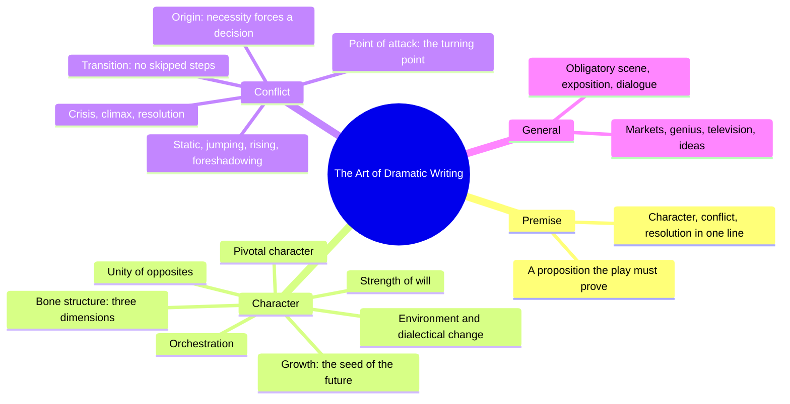
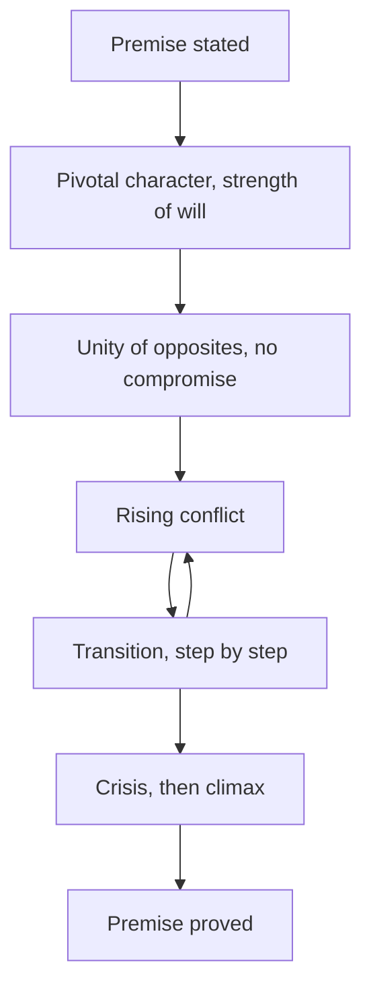
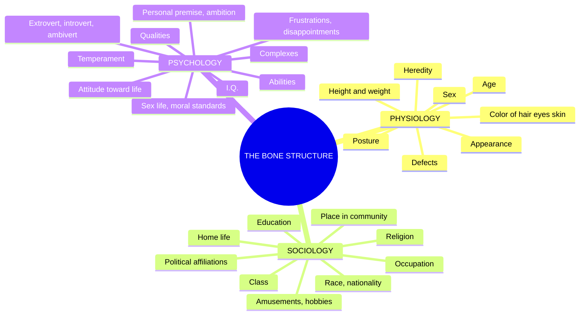
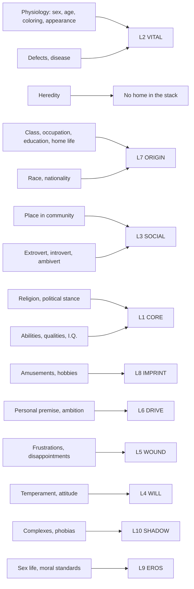

# BVX.1123 — The Art of Dramatic Writing: Its Basis in the Creative Interpretation of Human Motives — Lajos Egri (1946)
### Knowledge Entry — Distill

The 1946 craft book that named the premise, the pivotal character, and the tridimensional bone structure decades before any book on the character shelf; the direct ancestor both of Davis's super-objective (BVX.0075) and of Dramatica's storyform argument (BVX.0089). No Zotero record: sourced from a drop-folder PDF (pdftotext, 320 pages).

## TABLE OF CONTENTS
- [Core Thesis](#1-core-thesis)
- [Mind Models](#2-mind-models)
- [Framework](#3-framework--structure)
- [Key Concepts](#4-key-concepts)
- [Heuristics](#5-heuristics--decision-rules)
- [Invariants](#6-invariants)
- [Pitfalls](#7-pitfalls--myths)
- [Application](#8-application)
- [Cross-References](#9-cross-references)
- [Provenance](#10-provenance--confidence)

---

## 1 · CORE THESIS

A character is a tridimensional bone structure, physiology, sociology, psychology, whose psychology generates a personal premise strong enough to force decisions once conflict starts. Character makes plot: a pivotal character, orchestrated against an equally strong antagonist in an unbreakable unity of opposites, proves the play's premise through rising, untruncated transition.

---

## 2 · MIND MODELS

*Required. Minimum two diagrams, maximum five. See template §C for the rules.*

**Diagram 1 — the whole argument.**
Caption: *four books, one throughline: prove a premise, through a tridimensional character, by way of rising conflict, using craft.*

**Diagram 2 — the central mechanism.**
Caption: *the premise does not sit in the dialogue, it runs the whole machine, from the first want to the last proof.*

**Diagram 3 — the Bone Structure, Egri's own outline.**
Caption: *twenty-seven named fields under three headings, not a trait list; this is the outline the character shelf keeps rediscovering piecemeal.*

**Diagram 4 — the Bone Structure mapped onto the 12-layer character stack.**
Caption: *most of Egri's outline already has a home in the twelve layers; Heredity is the one field the stack has never named.*

---

## 3 · FRAMEWORK / STRUCTURE

Four books, thirty-eight chapters, one governing move: the premise, stated in Book I, is proved by the character built in Book II, through the conflict mechanics of Book III, using the craft notes of Book IV.

| Book | Chapters | Governing question |
|---|---|---|
| **I · Premise** | (unnumbered, one continuous argument) | What is the play trying to prove, in one sentence containing character, conflict, and conclusion? |
| **II · Character** | 1 The Bone Structure · 2 Environment · 3 The Dialectical Approach · 4 Character Growth · 5 Strength of Will · 6 Plot or Character, Which? · 7 Characters Plotting Their Own Play · 8 Pivotal Character · 9 The Antagonist · 10 Orchestration · 11 Unity of Opposites | Who is this person, in three dimensions, and what makes them strong enough to carry a play's whole weight? |
| **III · Conflict** | 1 Origin of Action · 2 Cause and Effect · 3 Static · 4 Jumping · 5 Rising · 6 Movement · 7 Foreshadowing Conflict · 8 Point of Attack · 9 Transition · 10 Crisis, Climax, Resolution | Once the character wants something, what makes the conflict rise instead of stalling, jumping, or repeating? |
| **IV · General** | 1 Obligatory Scene · 2 Exposition · 3 Dialogue · 4 Experimentation · 5 Timeliness · 6 Entrances and Exits · 7 Why Bad Plays Succeed · 8 Melodrama · 9 On Genius · 10 What Is Art? · 11 When You Write a Play · 12 How to Get Ideas · 13 Writing for Television · 14 Conclusion | Given premise, character, and conflict, what remains is craft: how do you actually assemble and sell the thing? |

Book II's spine: the bone structure (ch1) feeds everything after. Environment and the dialectical approach (ch2-3) explain *why* character changes; growth and strength of will (ch4-5) establish *that* it must change and *how hard* it resists; plot-or-character (ch6-7) settles the priority fight for character; pivotal character through unity of opposites (ch8-11) assemble the cast. Book III pivots from person to mechanism: chapters 1-7 diagnose why conflict fails; chapters 8-10 (Point of Attack, Transition, Crisis-Climax-Resolution) are the fix.

---

## 4 · KEY CONCEPTS

| Concept | What it is | Why it matters |
|---|---|---|
| **Premise** | One sentence, three parts: character, conflict ("leads to"), conclusion, e.g. "Frugality leads to waste" | Everything else exists to prove one premise, never two |
| **The Bone Structure** | Tridimensional outline: physiology, sociology, psychology, 8+9+10 named fields | The shelf's earliest complete character checklist; Diagram 3 |
| **The Dialectical Approach** | Thesis, antithesis, synthesis (Hegel, Zeno): every trait contains its own contradiction | Root of McKee's and Davis's later contradiction-as-engine claims |
| **Character Growth** | The change a character undergoes by the end must be seeded, visibly, on page one | Arc is a planted premise, not a late authorial decision |
| **Strength of Will** | Not toughness, the capacity to decide and act; Jeeter Lester and Iago are equally "strong" | "A weak character is one who cannot make a decision to act" |
| **Plot or Character, Which?** | Egri's rebuttal of Aristotle's "structure of the incidents, not of man" | Verdict: "character makes the plot" |
| **Pivotal Character** | The protagonist, forced into the role by necessity, not choice | Grows *less* than other characters; the decision predates the curtain |
| **The Antagonist** | Must be as strong, ruthless, and resourceful as the pivotal character | A weak antagonist is a construction defect, not a moral question |
| **Orchestration** | Choosing characters deliberately dissimilar so pairing them generates conflict | Nora/Helmer orchestrate; Joe/Iola (*Black Pit*) do not |
| **Unity of Opposites** | Two characters bound so tightly neither can walk away; compromise is impossible | A real conflict, not a street fight that ends in a handshake |
| **Point of Attack** | The moment the curtain rises: a decision, or its threshold, with something vital at stake | Where necessity becomes visible to the audience |
| **Transition** | The named intermediate steps between two poles (friendship to murder passes five stops) | Skipping a step is a "jump," a structural fault |

---

## 5 · HEURISTICS & DECISION RULES

| Situation | Do this | Not this |
|---|---|---|
| Starting a new script | Write the premise as one sentence: character, conflict, conclusion | Start from a situation and hope a premise emerges later |
| A play has two premises | Cut one; only one premise can be proved | Let both run and call it "complexity" |
| Judging if a character can carry the play | Ask if they can decide and act under pressure | Judge by outward toughness or likability |
| Building the antagonist | Make them as strong and resourceful as the protagonist | Write a weak obstacle to flatter the hero |
| Choosing the cast | Pick characters who differ in temper and speech from whoever they'll clash with | Populate a scene with one type and expect friction |
| Anchoring a scene's opening | Open at the decision, or its threshold | Open with exposition or "getting to know" the cast |
| Moving between emotional poles | Write every intermediate step | Jump straight from start-emotion to end-emotion |
| Judging if conflict can end in compromise | Check whether the two are bound by something neither can walk away from | Assume any disagreement is a "unity of opposites" |
| A character reads flat despite a trait list | Run physiology, then sociology, then psychology as their product | Add more adjectives to psychology alone |

---

## 6 · INVARIANTS

1. Every character has three dimensions, physiology, sociology, psychology; omit one and the character stays flat.
2. A premise must contain character, conflict, and conclusion in one sentence; two premises cannot both be steered.
3. Character makes plot, not the reverse; the plot "automatically unfolds itself" from a settled character.
4. A weak character is defined by an inability to decide, not by softness or passivity.
5. A pivotal character is forced into that role by necessity; he cannot relinquish it without betraying the premise.
6. A real unity of opposites admits no compromise; it ends only when a dominant trait is destroyed or transformed.
7. Orchestration requires contrast; two characters built alike cannot sustain rising conflict.
8. Transition never skips a pole; every step between two states must be present, even if compressed.
9. A character who ends the story where they began it is proof of bad writing.

---

## 7 · PITFALLS / MYTHS

- Starting from a striking situation and assuming a premise will surface later; most playwrights do this, and most fail for it.
- Writing two premises into one play (Egri's examples: *The Philadelphia Story*, *Skylark*), which produces a confused middle.
- Mistaking outward aggression for strength and passivity for weakness; Jeeter Lester's inaction is, by definition, as strong as Iago's scheming.
- Building an antagonist weaker than the protagonist to flatter the hero, which kills the fight before it starts.
- Choosing two similar characters (Joe and Iola, *Black Pit*) and expecting conflict regardless.
- Jumping a transition: moving a character straight from one emotional pole to another with no intermediate steps.
- Delivering bone-structure details (age, height, coloring) as exposition instead of letting them surface through behavior.
- Treating premise as a slogan stamped on the play; it "should not stand out like a sore thumb."

---

## 8 · APPLICATION

- **Spine level:** L5 (bone structure, pivotal character's arc) primary; L6 (premise as the proposition proved) equally load-bearing, hence `spine: [L5, L6, L0]` — L0 because premise-as-proof reads as a root theory of dramatic structure, not one spine level.
- **12-layer character stack:** primary on **L2 VITAL**, **L7 ORIGIN**, **L1 CORE**, **L6 DRIVE**, **L4 WILL**; supporting on **L5 WOUND**, **L3 SOCIAL**, **L10 SHADOW**; contextual on **L9 EROS**, **L8 IMPRINT** — Diagram 4 has the full map.
- **plot_systems:** the premise, "a proposition antecedently supposed or proved," is the ancestor argument every downstream storyform resolves to; one premise per play is the discipline Dramatica (BVX.0089) encodes as one Grand Argument Story per storyform.
- **Setting:** touched only through sociology (class, home life, community); Egri treats environment as pressure on character, never as its own system.

Egri and the shelf's later books **agree**: personal premise runs unbroken into Davis's want (BVX.0075); the dialectical approach's contradiction-as-engine claim roots McKee's under-pressure test (BVX.0064) and Corbett's tyranny of motive (BVX.0196). He predates their terminology: no arc typing, no ghost/revenant mechanism, no cast-role taxonomy past protagonist and antagonist; his unity of opposites is a precondition for conflict, not a trait, which is why it lands on the relationship rather than inside one person.

Against Dramatica (BVX.0089): Egri's premise, one sentence proved by the whole play, is functionally a single storyform's Grand Argument argued to one Story Judgement. The difference is granularity: Dramatica's four throughlines decompose the argument into an engine independent of any character, while Egri's premise lives and dies with the pivotal character. He is the Grand Argument's direct ancestor in the sense the SSOT names him.

**For the character system:**
- The bone structure's fields map onto Tier 1 and Tier 2: physiology to **L2 VITAL**, most of sociology to **L7 ORIGIN**, psychology splits three ways, personal premise to **L6 DRIVE**, frustrations to **L5 WOUND**, temperament and attitude to **L4 WILL** — Diagram 4 has the full breakdown.
- **Heredity** (Physiology field 8) is the one field genuinely homeless: ORIGIN covers socioeconomic and family formation, not genetic predisposition. OPEN candidate: a `hereditary_predisposition` sub-field on L7 or L2, whichever proves load-bearing on a second character.
- Tier 1's numeric CORE/VITAL/SOCIAL should carry Egri's descriptive sub-fields as a text stack beneath the number: Victoria Midnight's `VITAL 14` already reads as a sentence, which is a physiology-outline answer in miniature; formalizing that would make the number auditable against Egri's checklist rather than freestanding.
- "Strength of will" is a purer, prior definition of **L4 WILL** than anything on the shelf, not toughness but the capacity to decide, which reframes Stress Threshold as decision-capacity under load. "Pivotal character," forced into the role by necessity, argues that **L12 FUNCTION**'s Protagonist archetype should require a documented necessity, not just a storyform assignment.
- The premise, one proposition, one proof, says to **L6 DRIVE** that a character's value should trace to a single stated personal premise, the way Victoria Midnight's does implicitly ("merit earns freedom"); it says to Dramatica's argument that Egri is the shelf's oldest statement of the single-proposition discipline the schema already inherits.

---

## 9 · CROSS-REFERENCES

| Related entry | Relation |
|---|---|
| [[BVX.0089]] | Dramatica: Egri's premise, proved by one play, is the Grand Argument's direct ancestor; see §8 |
| [[BVX.0075]] | Davis: Egri's "personal premise, ambition" is the named ancestor of the super-objective the schema already cites as L6 DRIVE's source |
| [[BVX.0196]] | Corbett: the dialectical approach's contradiction-as-motion claim roots the Tyranny of Motive's warning against a too-clean stated cause |
| [[BVX.0064]] | McKee: strength of will and the true-character-under-pressure test both define character as decision under load, not trait |
| [[BVX.0193]] | Truby: compare his moral argument and web of characters against Egri's unity of opposites for two routes to characters bound, not merely opposed |

---

## 10 · PROVENANCE & CONFIDENCE

Distilled from a full pdftotext extraction of the drop-folder PDF (the Scribd file, 320 pages, ~97,000 words); no Zotero record exists. Read closely: Book I Premise in full; all of Book II Character (the Bone Structure reproduced verbatim in Diagram 3, Environment, the Dialectical Approach, Character Growth, Strength of Will, Plot or Character, Characters Plotting Their Own Play, Pivotal Character, the Antagonist, Orchestration, Unity of Opposites). Book III read at chapter-opening level, with Point of Attack and Transition in full. Book IV read at heading level only, per the assignment; its fourteen craft/market chapters do not bear on the character system and appear only in Diagram 1 and the Framework table.

The twelve-page student slide deck "Lajos Egri's Character Bone Structure," also in the drop folder, is a class presentation, not Egri's own text, and was not used as a source.

## META
- Template: BVX-LEARN-v4.0
- Source classification: full-text pdftotext extraction (drop folder, no Zotero key); Books I-II read in full, Book III at chapter-opening level plus two chapters read in full, Book IV at heading level only
- Created / Updated: 2026-09-16
