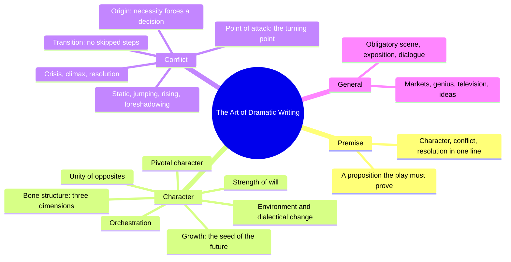
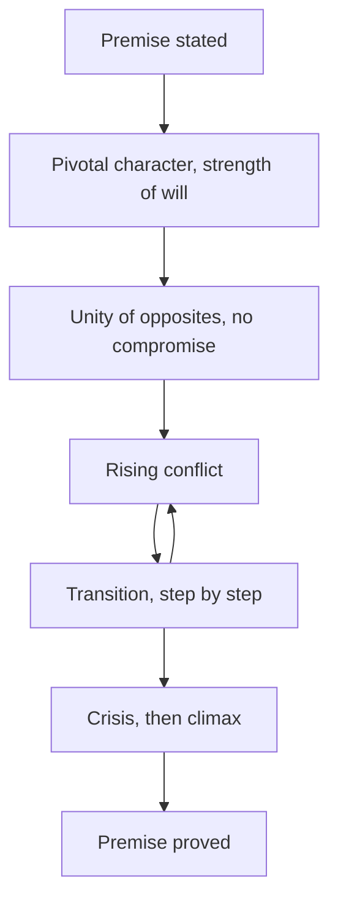
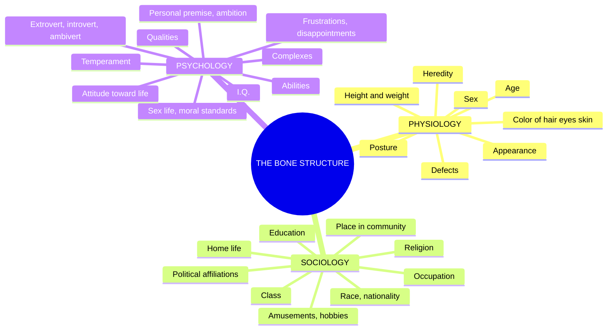
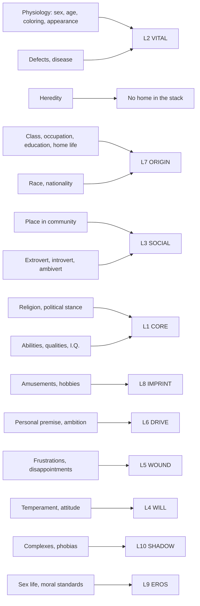

# BVX.1123 — The Art of Dramatic Writing: Its Basis in the Creative Interpretation of Human Motives — Lajos Egri (1946)
### Knowledge Entry — Distill

The 1946 craft book that named the premise, the pivotal character, and the tridimensional bone structure decades before any book on the character shelf; the direct ancestor both of Davis's super-objective (BVX.0075) and of Dramatica's storyform argument (BVX.0089). No Zotero record: sourced from a drop-folder PDF (pdftotext, 320 pages).

## TABLE OF CONTENTS
- [Core Thesis](#1-core-thesis)
- [Mind Models](#2-mind-models)
- [Framework](#3-framework--structure)
- [Key Concepts](#4-key-concepts)
- [Heuristics](#5-heuristics--decision-rules)
- [Invariants](#6-invariants)
- [Pitfalls](#7-pitfalls--myths)
- [Application](#8-application)
- [Cross-References](#9-cross-references)
- [Provenance](#10-provenance--confidence)

---

## 1 · CORE THESIS

A character is a tridimensional bone structure, physiology, sociology, psychology, whose psychology generates a personal premise strong enough to force decisions once conflict starts. Character makes plot: a pivotal character, orchestrated against an equally strong antagonist in an unbreakable unity of opposites, proves the play's premise through rising, untruncated transition.

---

## 2 · MIND MODELS

*Required. Minimum two diagrams, maximum five. See template §C for the rules.*

**Diagram 1 — the whole argument.**
Caption: *four books, one throughline: prove a premise, through a tridimensional character, by way of rising conflict, using craft.*

**Diagram 2 — the central mechanism.**
Caption: *the premise does not sit in the dialogue, it runs the whole machine, from the first want to the last proof.*

**Diagram 3 — the Bone Structure, Egri's own outline.**
Caption: *twenty-seven named fields under three headings, not a trait list; this is the outline the character shelf keeps rediscovering piecemeal.*

**Diagram 4 — the Bone Structure mapped onto the 12-layer character stack.**
Caption: *most of Egri's outline already has a home in the twelve layers; Heredity is the one field the stack has never named.*

---

## 3 · FRAMEWORK / STRUCTURE

Four books, thirty-eight chapters, one governing move: the premise, stated in Book I, is proved by the character built in Book II, through the conflict mechanics of Book III, using the craft notes of Book IV.

| Book | Chapters | Governing question |
|---|---|---|
| **I · Premise** | (unnumbered, one continuous argument) | What is the play trying to prove, in one sentence containing character, conflict, and conclusion? |
| **II · Character** | 1 The Bone Structure · 2 Environment · 3 The Dialectical Approach · 4 Character Growth · 5 Strength of Will · 6 Plot or Character, Which? · 7 Characters Plotting Their Own Play · 8 Pivotal Character · 9 The Antagonist · 10 Orchestration · 11 Unity of Opposites | Who is this person, in three dimensions, and what makes them strong enough to carry a play's whole weight? |
| **III · Conflict** | 1 Origin of Action · 2 Cause and Effect · 3 Static · 4 Jumping · 5 Rising · 6 Movement · 7 Foreshadowing Conflict · 8 Point of Attack · 9 Transition · 10 Crisis, Climax, Resolution | Once the character wants something, what makes the conflict rise instead of stalling, jumping, or repeating? |
| **IV · General** | 1 Obligatory Scene · 2 Exposition · 3 Dialogue · 4 Experimentation · 5 Timeliness · 6 Entrances and Exits · 7 Why Bad Plays Succeed · 8 Melodrama · 9 On Genius · 10 What Is Art? · 11 When You Write a Play · 12 How to Get Ideas · 13 Writing for Television · 14 Conclusion | Given premise, character, and conflict, what remains is craft: how do you actually assemble and sell the thing? |

Book II's spine: the bone structure (ch1) feeds everything after it. Environment and the dialectical approach (ch2-3) explain *why* character changes; growth and strength of will (ch4-5) establish *that* it must change and *how hard* it resists; plot-or-character (ch6-7) settles the priority fight in character's favor; pivotal character through unity of opposites (ch8-11) assemble the cast that carries the premise to proof. Book III pivots from person to mechanism: chapters 1-7 diagnose why conflict fails (static, jumping, unforeshadowed); chapters 8-10 (Point of Attack, Transition, Crisis-Climax-Resolution) are Egri's fix.

---

## 4 · KEY CONCEPTS

| Concept | What it is | Why it matters |
|---|---|---|
| **Premise** | A one-sentence proposition with three parts: character, conflict ("leads to"), and conclusion, e.g. "Frugality leads to waste" | The single load-bearing structure of the whole book; everything else (bone structure, pivotal character, orchestration, transition) exists to prove one premise, never two |
| **The Bone Structure** | The tridimensional outline: physiology, sociology, psychology, with 8, 9, and 10 named sub-fields respectively | The character shelf's earliest complete character-construction checklist; Diagram 3 reproduces it verbatim |
| **The Dialectical Approach** | Thesis, antithesis, synthesis (via Hegel and Zeno) applied to character: every trait contains its own contradiction, which is what makes the person move | Egri's argument for why contradiction is not decoration but the mechanism of motion itself, the deepest root of McKee's and Davis's later contradiction-as-engine claims |
| **Character Growth** | A character must contain, from the first page, the visible "seed" of the change they undergo by the last; a character unchanged at the end is proof of bad writing | Reframes arc as a planted premise, not an author's late decision; Nora's stubbornness is present in scene one of *A Doll's House*, not invented in act three |
| **Strength of Will** | Not toughness or aggression, but the capacity to make a decision and act on it; Jeeter Lester's passive endurance and Iago's active scheming are equally "strong" | Redefines weakness precisely: "a weak character is one who, for any reason, cannot make a decision to act" |
| **Plot or Character, Which?** | Egri's direct rebuttal of Aristotle's "structure of the incidents, not of man"; his verdict, "character makes the plot" | Positions the whole book against the oldest argument in dramatic theory and settles it in character's favor before Book III even begins |
| **Pivotal Character** | The protagonist, forced into the role by necessity (inner or outer), not by choice; wants something so badly he will destroy or be destroyed to get it | The engine that starts and sustains conflict; a pivotal character grows *less* than any other character because the story starts after his decision is already made |
| **The Antagonist** | Must be as strong, as ruthless, and as resourceful as the pivotal character, or the fight is not interesting | A structural requirement, not a moral judgment; a weak antagonist is a construction defect, independent of how sympathetic they are |
| **Orchestration** | Choosing characters deliberately dissimilar (in temper, philosophy, speech) so that placing them together generates conflict without forcing it | Nora and Helmer "orchestrated" because everything Helmer is, Nora is not; two similar characters (Joe and Iola in *Black Pit*) cannot sustain conflict |
| **Unity of Opposites** | Two characters bound together (by love, law, debt, blood) so tightly that neither can simply walk away; compromise is structurally impossible, like a germ and a white corpuscle | Distinguishes a real dramatic conflict from a street fight that can end in a handshake; the bond, not the disagreement, is what makes conflict inescapable |
| **Point of Attack** | The exact moment the curtain should rise: a turning point, a decision, or the threshold of one, with something vital at stake immediately | "It is pointless to write about a person who doesn't know what he wants"; the point of attack is where necessity becomes visible |
| **Transition** | The intermediate emotional steps between two poles (e.g. friendship to murder passes through disappointment, annoyance, irritation, anger, assault); skipping a step is a "jump," a structural fault | Egri's clearest craft rule: rising conflict is built from named intermediate states, never leapt between endpoints |

---

## 5 · HEURISTICS & DECISION RULES

| Situation | Do this | Not this |
|---|---|---|
| Starting a new script | Write the premise as one sentence: character, conflict, conclusion | Start from a situation or an idea and hope a premise emerges on its own |
| A play has two premises | Cut one; a play can only prove one premise, however phrased | Let both run and call the confusion "complexity" |
| Deciding if a character can carry the play | Ask whether they can make a decision and act on it under pressure | Judge by outward toughness, aggression, or likability |
| Building the antagonist | Make them as strong, resourceful, and ruthless as the protagonist | Write a weak or purely evil obstacle to make the hero look good |
| Choosing your cast | Pick characters who differ in temper, philosophy, and speech from whoever they'll clash with | Populate a scene with several characters of the same type and expect friction |
| A scene needs an anchor point | Open at the turning point, the decision, or the threshold of one | Open with exposition, backstory, or "getting to know" the characters first |
| Moving a character from one emotional pole to another | Write every intermediate step (disappointment, annoyance, irritation...) | Jump straight from the starting emotion to the ending one |
| Deciding whether two characters' conflict can end in compromise | Check whether they're bound by something neither can walk away from | Assume any two people who disagree are in a "unity of opposites" |
| A character seems flat despite a full trait list | Run the bone structure: physiology, sociology, then psychology as the product of the first two | Add more adjectives to the psychology column alone |
| Deciding if a character has grown by the end | Check whether the seed of that change was visible from page one | Introduce a change with no earlier trace, then call it development |

---

## 6 · INVARIANTS

1. Every character has three dimensions, physiology, sociology, psychology; omit one and the character stays flat regardless of plot excitement.
2. A premise must contain character, conflict, and conclusion in a single sentence; a play with no premise, or two, cannot be steered.
3. Character makes plot, not the reverse; once premise and character exist, the plot "automatically unfolds itself."
4. A weak character is defined by an inability to decide, not by softness, passivity, or outward gentleness.
5. A pivotal character is forced into that role by inner or outer necessity; he does not choose it, and he cannot relinquish it without betraying the premise.
6. A real unity of opposites admits no compromise; it ends only when a dominant trait in one party is destroyed or transformed.
7. Orchestration requires contrast; two characters built alike cannot sustain rising conflict between them.
8. Transition never skips a pole; every step between two emotional or moral states must be present, even if compressed.
9. A character who ends the story exactly where they began it is proof of a badly drawn character.
10. Psychology is the product of physiology and sociology combined, never an independent, freestanding layer.

---

## 7 · PITFALLS / MYTHS

- Starting from a "good idea" or striking situation and assuming a premise will surface later; nine hundred ninety-nine playwrights out of a thousand do this, and most fail for exactly this reason.
- Writing two premises into one play (Egri's own examples: *The Philadelphia Story*, *Skylark*), which necessarily produces a confused middle.
- Mistaking outward aggression for strength and outward passivity for weakness; Jeeter Lester's stubborn inaction is, by Egri's definition, as strong as Iago's scheming.
- Building an antagonist who is weaker or less resourceful than the protagonist to flatter the hero, which kills the fight before it starts.
- Choosing two similar characters (Joe and Iola in *Black Pit*) and expecting conflict to appear between them regardless.
- Jumping a transition, moving a character from one emotional pole straight to another without the intermediate steps a reader or audience needs to believe it.
- Delivering the bone structure's details (age, height, coloring) as exposition or dialogue instead of letting them surface through behavior.
- Treating premise as a slogan stamped onto the play rather than a proposition the entire structure is built to prove; a premise "should not stand out like a sore thumb."
- Believing character can be studied as psychology alone, skipping the physiological and sociological grounding that produces it.

---

## 8 · APPLICATION

- **Spine level:** L5 (character, the bone structure and the pivotal character's arc) primary; L6 (theme, the premise as the proposition the story proves) equally load-bearing, hence `spine: [L5, L6, L0]` — L0 because the premise-as-proof mechanism is closer to a root theory of dramatic structure than to any single spine level.
- **12-layer character stack:** primary on **L2 VITAL** (physiology), **L7 ORIGIN** (sociology), **L1 CORE** (I.Q., ideology), **L6 DRIVE** (personal premise), and **L4 WILL** (strength of will); supporting on **L5 WOUND**, **L3 SOCIAL**, **L10 SHADOW**; contextual on **L9 EROS** and **L8 IMPRINT** — see Diagram 4 for the full field-by-field map.
- **plot_systems:** the premise itself, "a proposition antecedently supposed or proved," is the ancestor argument every downstream storyform must resolve to; Egri's insistence that a play prove exactly one premise is the same discipline Dramatica (BVX.0089) encodes as a single Grand Argument Story per storyform.
- **Setting:** touched only incidentally, through sociology (class, home life, community); Egri treats environment as a pressure on character, never as a system in its own right the way the setting slice (03) requires.

Where Egri and the character shelf's later books **agree**: the personal-premise-to-super-objective line runs unbroken from Egri's Psychology field 2 straight through Davis's want (BVX.0075), and the contradiction-as-engine claim (Egri's dialectical approach) is the direct root both of McKee's true-character-under-pressure test (BVX.0064) and of Corbett's tyranny-of-motive warning against a too-clean stated cause (BVX.0196). Where Egri differs, and predates the terminology: he has no "arc typing" (growth vs. transformation, Corbett's distinction), no ghost/revenant relational mechanism, and no cast-role taxonomy beyond protagonist and antagonist; his unity of opposites is closer to a structural precondition for conflict than to a character trait, which is why it lands on the relationship between two characters rather than inside one.

Against Dramatica specifically (BVX.0089): Egri's premise, one sentence, proved by the whole play, is functionally identical in shape to a single storyform's Grand Argument, argued to a single Story Judgement. The difference is granularity: Dramatica's four throughlines and eight archetypes decompose the argument into a structural engine that can be built independently of any one character; Egri's premise lives and dies with his pivotal character, no throughline exists apart from the person carrying it. Egri is the Grand Argument's direct ancestor in exactly the sense the SSOT names him: the claim that a play must prove one proposition through conflict is present in full in 1942, decades before the storyform formalized it.

**For the character system:**
- The bone structure's twenty-seven fields map cleanly onto Tier 1 and Tier 2: physiology to **L2 VITAL**, most of sociology to **L7 ORIGIN**, and psychology splits three ways, personal premise to **L6 DRIVE**, frustrations to **L5 WOUND**, temperament and attitude to **L4 WILL** — see Diagram 4 for the full breakdown, field by field.
- **Heredity** (Physiology field 8) is the one bone-structure field genuinely homeless in the twelve layers: ORIGIN covers socioeconomic and family formation, not genetic or hereditary predisposition; OPEN candidate, a `hereditary_predisposition` sub-field on L7 or a new L2 sub-field, whichever proves load-bearing on a second character.
- Tier 1's numeric CORE/VITAL/SOCIAL should carry Egri's descriptive sub-fields as a text stack beneath the number: Victoria Midnight's `VITAL 14` already reads as a sentence ("motion under pressure, never ornamental"), which is a physiology-outline answer in miniature; formalizing that as an explicit sub-field list (per Diagram 4's physiology and sociology branches) would make the number auditable against Egri's original checklist rather than freestanding.
- "Strength of will" (Book II ch5) is a purer, prior definition of **L4 WILL** than anything on the shelf: not toughness but "the capacity to make a decision and act on it," which reframes WILL's derived Stress Threshold as measuring decision-capacity under load, not endurance. The "pivotal character," forced into the role by necessity rather than choice, is a strong argument that **L12 FUNCTION**'s Protagonist archetype should require a documented necessity (inner or outer) as a precondition, not just a storyform assignment.
- The premise, one proposition, one proof, says to **L6 DRIVE** that a character's `DRIVE` value should trace to a single stated personal premise (Egri's own phrase) the way Victoria Midnight's does implicitly ("merit earns freedom"); it says to Dramatica's argument that Egri is the shelf's oldest and plainest statement of the single-storyform, single-proposition discipline the schema already inherits.
- The dialectical approach (thesis, antithesis, synthesis) is a candidate root explanation for why the schema's derived statistics work the way they do: WOUND and WILL in tension, DRIVE and SHADOW in tension, are contradiction pairs in Egri's sense, not arbitrary formula choices; worth a future OPEN note tying the derived-statistics formulas explicitly back to dialectical opposition rather than leaving the resemblance implicit.

---

## 9 · CROSS-REFERENCES

| Related entry | Relation |
|---|---|
| [[BVX.0089]] | Dramatica: Egri's premise, proved by one play, is the Grand Argument's direct ancestor; see §8 for the granularity comparison |
| [[BVX.0075]] | Davis *Creating Compelling Characters*: Egri's "personal premise, ambition" (Psychology field 2) is the named ancestor of Davis's super-objective, which the schema already cites as L6 DRIVE's source |
| [[BVX.0196]] | Corbett *The Art of Character*: the dialectical approach's contradiction-as-motion claim is the deep root of Corbett's Tyranny of Motive warning against a too-clean stated cause |
| [[BVX.0064]] | McKee *Character*: Egri's strength-of-will chapter and McKee's true-character-under-pressure test both define character as revealed by decision under load, not by trait or temperament |
| [[BVX.0193]] | Truby *The Anatomy of Story*: compare Truby's moral argument and web of characters against Egri's unity of opposites and orchestration for two independent routes to the same requirement, characters bound and contrasted, not merely opposed |

---

## 10 · PROVENANCE & CONFIDENCE

Distilled from a full pdftotext extraction of the drop-folder PDF (the Scribd file, 320 pages, ~97,000 words), no Zotero record exists for this source. Read closely: Book I Premise in full (the premise as a three-part proposition, its worked examples across a dozen plays, the Aunt Clara case study); all of Book II Character (the Bone Structure outline reproduced verbatim in Diagram 3, Environment, the Dialectical Approach with the Irene case, Character Growth with the Nora and Orgon analyses, Strength of Will, Plot or Character, Characters Plotting Their Own Play, Pivotal Character, the Antagonist, Orchestration, Unity of Opposites). Book III Conflict read at chapter-opening level throughout, with the Point of Attack and Transition chapters read in full (both directly load-bearing for craft heuristics above). Book IV General read at heading level only, per the assignment; its fourteen chapters are craft and market notes (exposition, dialogue, television, getting ideas, marketing) that do not bear on the character system and are represented only in Diagram 1 and the Framework table.

The twelve-page student slide deck "Lajos Egri's Character Bone Structure" that also landed in the drop folder is a class presentation, not Egri's own text, and was not used as a source for this distill; every quotation and field name above traces to the pdftotext extraction of the book itself.

## META
- Template: BVX-LEARN-v4.0
- Source classification: full-text pdftotext extraction (drop folder, no Zotero key); Books I-II read in full, Book III at chapter-opening level plus two chapters read in full, Book IV at heading level only
- Created / Updated: 2026-09-16
