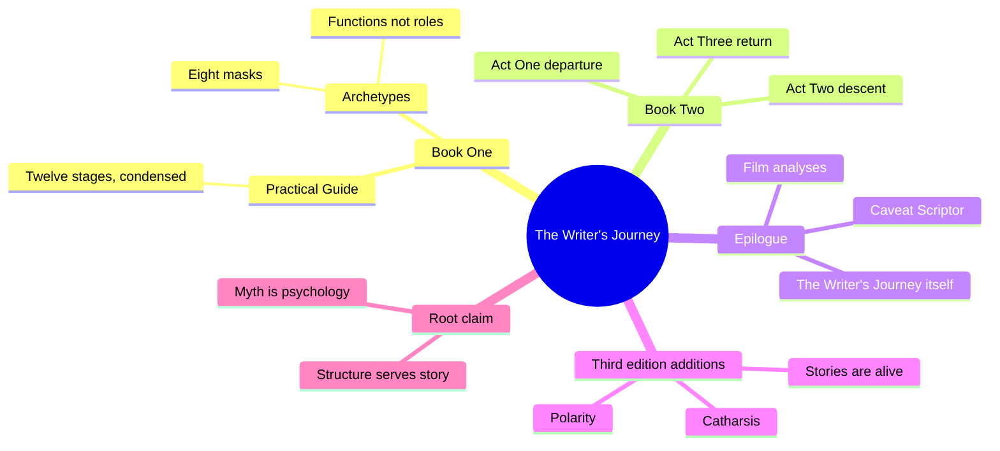
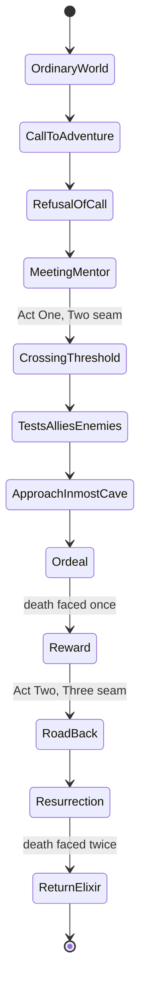
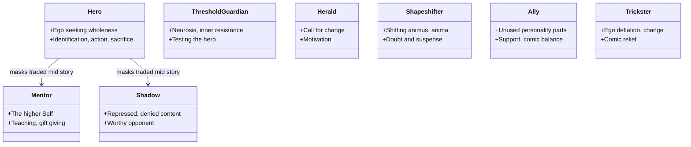
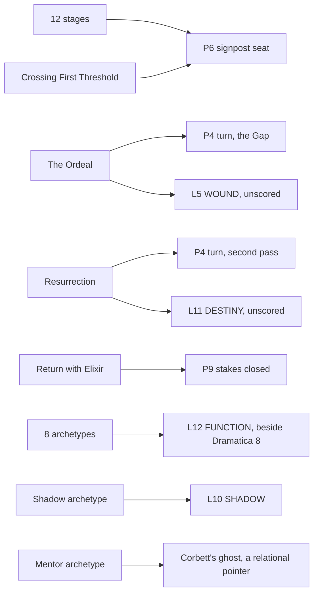

# BVX.1124 — The Writer's Journey: Mythic Structure for Writers — Christopher Vogler (2007)
### Knowledge Entry — Distill

Vogler's Disney-story-department memo grown into a book: Campbell's monomyth compressed into a twelve-stage practical map and eight archetypal masks, tested here against the spine's own verdict that Campbell/Vogler is "the MC throughline in mythic dress, one line mistaken for the whole."

## TABLE OF CONTENTS
- [Core Thesis](#1-core-thesis)
- [Mind Models](#2-mind-models)
- [Framework](#3-framework--structure)
- [Key Concepts](#4-key-concepts)
- [Heuristics](#5-heuristics--decision-rules)
- [Invariants](#6-invariants)
- [Pitfalls](#7-pitfalls--myths)
- [Application](#8-application)
- [Cross-References](#9-cross-references)
- [Provenance](#10-provenance--confidence)

---

## 1 · CORE THESIS

The Hero's Journey compresses Campbell's monomyth into twelve stages any story can shuffle, skip, or merge, and eight archetypes into masks any character can wear and trade mid-scene. Vogler insists the map is a guideline, not a formula, form follows the story's own needs. The third edition adds polarity and catharsis as the mechanics underneath both.

---

## 2 · MIND MODELS

*Required. Minimum two diagrams, maximum five.*

**Diagram 1 — the whole argument.**
Caption: *one map, two resolutions, plus a late layer of physics borrowed to explain why it works on a body.*

**Diagram 2 — the central mechanism (the twelve stages, one circuit, three act seams).**
Caption: *the two death-and-rebirth beats, Ordeal and Resurrection, are not the same beat repeated, the second one is the toll for re-entering the Ordinary World.*

**Diagram 3 — the eight archetypes as masks, not fixed roles.**
Caption: *every entry carries a psychological half and a dramatic half, and any character, including the Hero, can put on any mask for a scene.*

**Diagram 4 — mapped onto the Command's systems.**
Caption: *the twelve stages fill Dramatica's signpost seats and the plot slice's turn mechanism, but Vogler's eight sit beside L12, they never merge into it.*

---

## 3 · FRAMEWORK / STRUCTURE

Three movements plus a late appendix layer, built on Campbell's *Hero with a Thousand Faces* Chapter IV outline, which Vogler states he has "amended" for movie use (Table One maps his twelve terms against Campbell's seventeen).

| Part | Content |
|---|---|
| **Book One, Mapping the Journey** | Ch.1 "A Practical Guide," a condensed pass through all twelve stages with film examples. Ch.2 "The Archetypes," introduces the eight functions as masks, each under PSYCHOLOGICAL FUNCTION and DRAMATIC FUNCTION headings. |
| **Book Two, Stages of the Journey** | The same twelve stages as full chapters, each closing with "Questioning the Journey" exercises. |
| **Epilogue, Looking Back on the Journey** | Caveat Scriptor and Form Follows Function warnings, then Hero's Journey analyses of five films, closing with "The Writer's Journey" chapter. |
| **Appendices (third edition only)** | Stories Are Alive, Polarity, Catharsis, The Wisdom of the Body, Trust the Path, added nine years after the second edition from Vogler's studio and lecture work. |

The twelve-stage map recurs at two resolutions in the same book, the Practical Guide's fast pass and Book Two's slow pass, describing one structure, not two.

---

## 4 · KEY CONCEPTS

| Concept | What it is | Why it matters |
|---|---|---|
| **Archetypes as masks** | "The archetypes can be thought of as masks, worn by the characters temporarily as they are needed." A character can enter as Herald, switch to Trickster, then Mentor, then Shadow | Borrowed from Propp's function analysis; keeps the eight from becoming eight rigid character types |
| **Two questions per archetype** | What psychological function does it represent, and what is its dramatic function in the story | The repeatable diagnostic Vogler applies to all eight; failing both means a character "isn't pulling her full weight" |
| **The Mentor's limit** | "The Mentor can only go so far with the hero. Eventually the hero must face the unknown alone." | The Mentor exists only in relation to what the hero still lacks, a relational function, not a portable trait |
| **The Ordeal as death-and-rebirth** | "An Ordeal in which the hero must die or appear to die so that she can be born again." | The stated mechanism for audience identification: emotions "temporarily depressed so that they can be revived by the hero's return from death" |
| **Caveat Scriptor** | "Let the writer beware! The Hero's Journey model is a guideline... not a cookbook recipe." | Vogler's own disclaimer against literal, checklist use of his own model, stated before the film analyses |
| **Form follows function** | "The needs of the story dictate its structure." | Pairs with Caveat Scriptor to frame the twelve stages as one metaphor among several |
| **Polarity** | Unity implies duality: naming one theme generates its opposite; five rules govern how polarized elements attract, suspend, and reverse | Reframes the Hero's Journey as one instance of a more general two-pole engine, not the engine itself |
| **Catharsis, ritual lineage** | Recovered from Greek ritual: Mortification, Purgation (tragedy), then Invigoration, Jubilation (comedy), two halves of one cycle | Grounds the Ordeal's effect in a specific mechanism, not a loose synonym for any strong feeling |
| **The Writer's Journey itself** | "The Hero's Journey and the Writer's Journey are one and the same." Self-doubt is the Shadow, an editor the Threshold Guardian | Folds the writer's own process back into the twelve-stage map as its final worked example |

---

## 5 · HEURISTICS & DECISION RULES

| Situation | Do this | Not this |
|---|---|---|
| A character seems flat or one-note | Ask the two questions: psychological function, dramatic function, right now | Cast her permanently as "the Mentor" or "the Shadow" |
| A scene needs a stronger antagonist | Let the Shadow mask migrate onto an ally, a mentor, or the Hero himself under pressure | Assume the Shadow must be a single, dedicated villain character |
| Story structure feels rigid or forced | Delete, add, or reorder stages freely, per Vogler's own text | Force every beat of a draft to hit all twelve stages in order |
| Choosing what a hero loses at the Ordeal | Stage a literal or symbolic death, a mentor, a relationship, an old identity | Skip a stakes-of-death moment because the plot is a comedy or romance |
| The Return feels unfinished | Check that an Elixir actually crosses back into the Ordinary World | End on the Ordeal's high point and assume the audience infers the change |
| Ending a subplot | Give every named subplot beats across all three acts, close each at the Return | Let secondary character threads dangle once the main plot resolves |
| A two-character relationship feels inert | Polarize them deliberately, then let the polarity reverse at least once | Keep both characters agreeing or evenly matched throughout |

---

## 6 · INVARIANTS

1. The Hero's Journey is one of many possible maps, not the map: "the order of the stages given here is only one of many possible variations."
2. Every archetype is a function or mask, never a rigid role; the Shadow mask specifically can fall on the Hero.
3. The Ordeal is always staged as a death-and-rebirth, literal or symbolic, regardless of genre.
4. A Return that brings back no Elixir leaves the journey incomplete; "the hero is doomed to repeat the adventure."
5. Naming a unifying theme automatically generates its polar opposite ("unity begets duality").
6. Catharsis is two-part: tragedy's Mortification/Purgation must be balanced by comedy's Invigoration/Jubilation, or the effect exhausts rather than cleanses.
7. The Hero's Journey and the Writer's Journey are asserted as literally the same structure, not an analogy.

---

## 7 · PITFALLS / MYTHS

- Applying the twelve stages as a rigid checklist, the exact misuse Caveat Scriptor warns against.
- Treating an archetype as a fixed cast slot ("she is the Mentor") rather than a temporary function.
- Reading the Practical Guide's condensed chapter and Book Two's full chapters as two systems; they are one map at two resolutions.
- Assuming polarity requires flat moral opposites; sophisticated stories need "small shadings and contradictions."
- Reducing catharsis to "any strong emotional reaction," dropping its ritual and comedic half.
- Ending on the Ordeal's climax without a Return beat, or padding the Return with too many endings, both named craft failures.
- Missing that the Threshold Guardian (neurosis) and the Shadow (psychosis) are graded in severity, not interchangeable labels.

---

## 8 · APPLICATION

- **Spine level:** L4 primary (twelve stages as a plot-journey instance), L5 secondary (archetypes as character functions), L0 (Vogler/Campbell's myth-transmission theory, a named rival root claim to Dramatica's Grand Argument)
- **12-layer character stack:** primary on L12 FUNCTION and L10 SHADOW; supporting on L5 WOUND (the Ordeal) and L11 DESTINY (Resurrection and Return)
- **plot_systems:** candidate feed for P6 SIGNPOST/JOURNEY SEAT and P4 TURN (the Ordeal, close kin to McKee's Gap)
- **Setting:** not applicable; the Special World is a narrative role, not a modeled place

The spine's rival map calls Campbell/Vogler "the MC throughline in mythic dress, one line mistaken for the whole," and the text mostly earns that verdict: the twelve stages track one hero's inner and outer arc start to finish, with no separate accounting for the four-throughline apparatus a Grand Argument needs. But the verdict needs one qualification: Vogler pre-empts the "mistaken for the whole" reading himself. Caveat Scriptor and Form Follows Function both deny the twelve stages are a required formula, and the closing "Writer's Journey" chapter reframes the map as one flexible metaphor among several, not the one true structure of story. The mistake the spine diagnoses is real, but readers make it more often than Vogler does on the page.

**For the plot system:**
- The twelve stages read cleanly onto P6 SIGNPOST/JOURNEY SEAT as a single-throughline act-seam instance: Crossing the First Threshold and the Road Back are named act breaks in the text itself, a second, non-Dramatica act-seam vocabulary alongside Snyder's page marks.
- "One line mistaken for the whole" holds as a structural claim (one throughline, not four) but not as a methodological one; Vogler's own Caveat Scriptor already argues against rigid application, so the corrective the spine wants is one the source partly performs on itself.
- The Ordeal is P4 TURN at its highest-stakes instance, independently phrased almost like McKee's Gap ("the fortunes of the hero hit bottom"); Resurrection then forces a second full value-in/turn/value-out pass before Return, a repeat-turn need P9 STAKES/ESCALATION's single "trend up" rule doesn't yet name.

**For the character system:**
- Archetypes as masks (Vogler's own phrase, from Propp) confirms Schmidt's non-collision argument (BVX.0045, §8) from a second source: Vogler's eight are situational functions any character, including the Hero, can trade mid-scene, sitting beside L12 FUNCTION rather than filling it, since Dramatica's eight are fixed Story Mind bundles and Vogler's are not fixed to anyone.
- Shadow and Shapeshifter split for L10: Shadow is a mask "worn at different times by any of the characters," including the Hero under guilt, matching shadow_content directly; Shapeshifter's function ("is he faithful, will she betray me") is relational uncertainty closer to L9 EROS or L3 SOCIAL, with no clean single-layer home yet.
- The Mentor is a relational pointer, not a portable attribute: "the Mentor can only go so far" because the role is defined by what the hero currently lacks, functionally the same problem Corbett's ghost/revenant taxonomy names (BVX.0196, OPEN call 1), a meaning keyed to another character's WOUND, a cross-link the schema still can't natively express.

---

## 9 · CROSS-REFERENCES

| Related entry | Relation |
|---|---|
| [[BVX.0089]] | Dramatica, the spine's canonical root claim; this entry's L0 placement tests the rival map's "one line mistaken for the whole" verdict against the four-throughline Grand Argument |
| [[BVX.0045]] | Schmidt, same Jung/Campbell lineage; her sixteen archetypes with light/shadow faces and two nine-stage journeys are a parallel non-collision case for L10/L11/L12 |
| [[BVX.0163]] | Snyder, a second page-timed act-seam instance for P6/P10; Snyder's fifteen beats are a commercial-screenplay case, Vogler's twelve the older, medium-agnostic one |
| [[BVX.0193]] | Truby, the strongest rival synthesis on the spine's map; his 22-step organic model contrasts with Vogler's mythic template, both single-throughline models ranked below Dramatica |
| [[BVX.0175]] | McKee, whose Gap at the scene level is close kin to the Ordeal's death-and-rebirth at the story level, described independently in near-identical terms |
| [[BVX.0196]] | Corbett, whose ghost/revenant taxonomy names the same relational-pointer problem found here in the Mentor archetype |

---

## 10 · PROVENANCE & CONFIDENCE

Full-text pdftotext extraction, 404 pages. Third edition (2007, Michael Wiese Productions) confirmed from the text: "Introduction: Third Edition" is dated "Venice, California, February 26, 2007," describing new chapters "on the mechanism of polarity that rules in storytelling... catharsis, and other concepts," gathered as an appendix after "Looking Back on the Journey."

**Read closely:** both introductions/preface; Book One's "A Practical Guide" in full (all twelve stages, Table One against Campbell's terms); "The Archetypes" opening and all eight archetype chapters' PSYCHOLOGICAL/DRAMATIC FUNCTION headings and openings/closings; each Book Two stage chapter's opening and closing, including the Return chapter's "Pitfalls of the Return"; the Epilogue's Caveat Scriptor, Form Follows Function, and Choose Your Metaphor sections; the closing "The Writer's Journey" chapter in full; the Polarity appendix (five rules, Aristotle's peripateia) and Catharsis appendix (the ritual Mortification/Purgation/Invigoration/Jubilation cycle).

**Sampled:** Book Two's middle-chapter interiors beyond opening/closing; "Stories Are Alive" (Rumpelstiltskin example only); Wisdom of the Body and Trust the Path not read, outside scope. One film analysis, Titanic, read at full depth; the other four confirmed present at heading level only.

`confidence: high`: every function, stage, and third-edition claim above is a verified quote or close paraphrase; the film-analysis sampling and two unread appendices are the entry's honest, out-of-scope gaps.

## META
- Template: BVX-LEARN-v4.0
- Source classification: full-text book, pdftotext extraction (404 pages); Book One and the twelve stage-chapter openings/closings read in full, one Book Two film analysis (Titanic) sampled at full depth, Polarity and Catharsis appendices read closely per the third-edition-additions instruction, Wisdom of the Body and Trust the Path appendices out of scope
- Created / Updated: 2026-09-16
