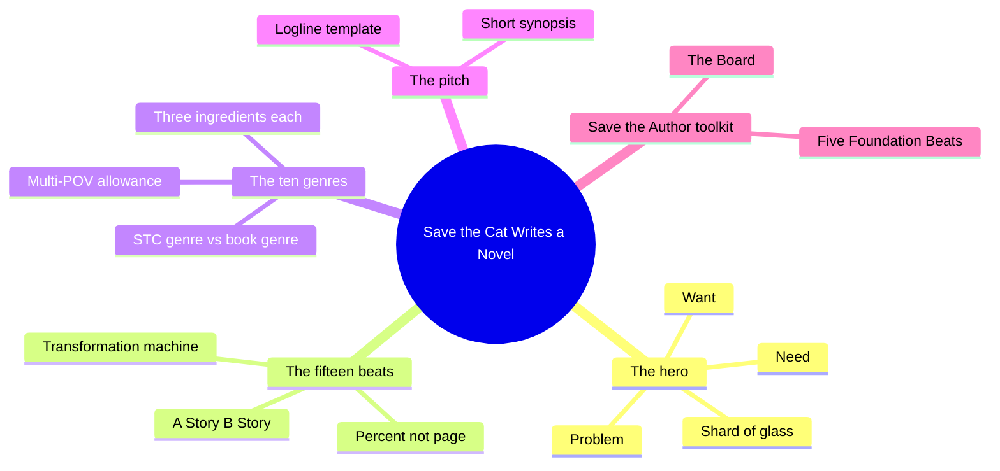
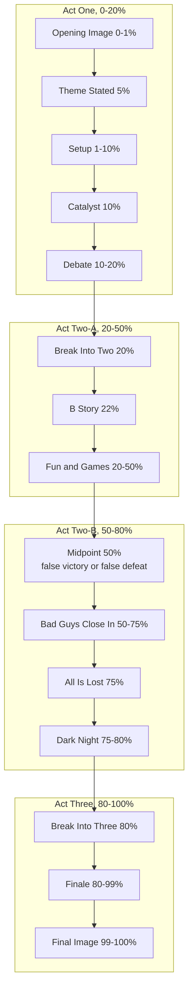
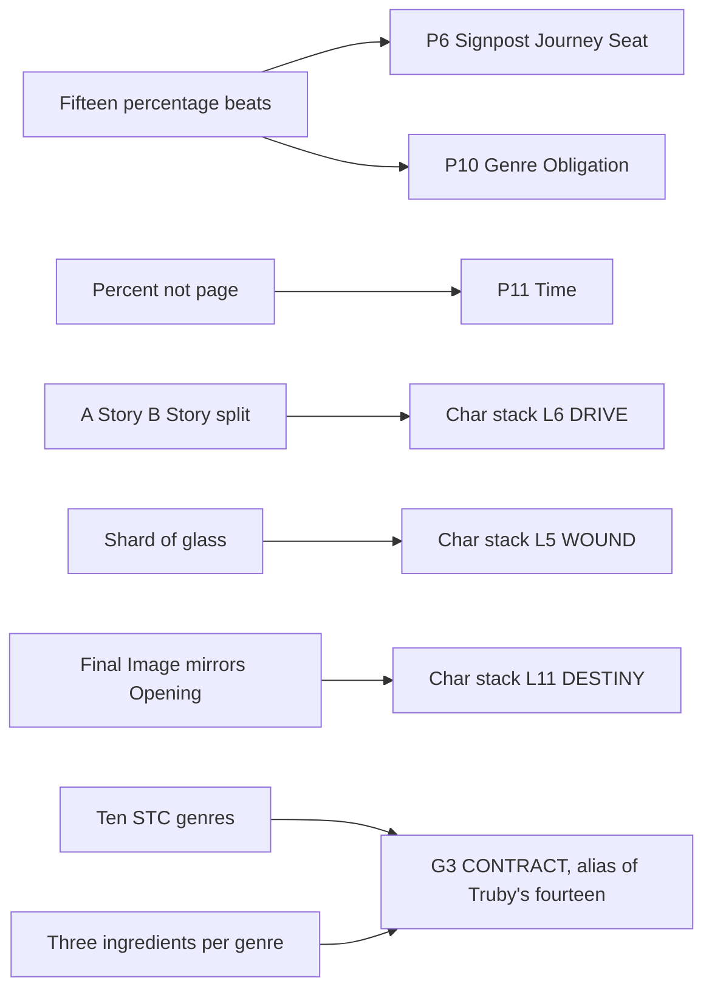
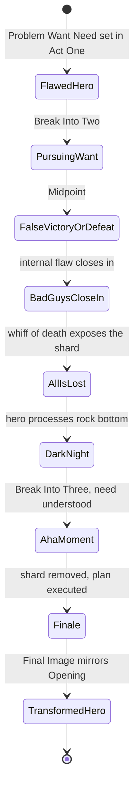

# BVX.1125 — Save the Cat! Writes a Novel: The Last Book on Novel Writing You'll Ever Need — Jessica Brody (2018)
### Knowledge Entry — Distill

The novel-side port of [[BVX.0163]]: Snyder's fifteen page-keyed screenplay beats re-cast as percentages of manuscript length, wrapped in an A-story/B-story frame and a want/need engine Brody names the transformation machine.

## TABLE OF CONTENTS
- [Core Thesis](#1-core-thesis)
- [Mind Models](#2-mind-models)
- [Framework](#3-framework--structure)
- [Key Concepts](#4-key-concepts)
- [Heuristics](#5-heuristics--decision-rules)
- [Invariants](#6-invariants)
- [Pitfalls](#7-pitfalls--myths)
- [Application](#8-application)
- [Cross-References](#9-cross-references)
- [Provenance](#10-provenance--confidence)

---

## 1 · CORE THESIS

Brody re-keys Snyder's fifteen-beat screenplay template to percentages of a novel's word count rather than script pages, then wraps it in an A-story/B-story split and a want/need engine she calls the transformation machine. The ten genres, the beats, and the reader-contract logic survive intact; only the unit of measure and the multi-POV allowance for novels are new.

---

## 2 · MIND MODELS

*Required. Minimum two diagrams, maximum five.*

**Diagram 1 — the whole argument.**
Caption: *five modules, one machine: build a flawed hero, run them through fifteen percentage-keyed beats, pick one of ten genre recipes, then pitch the finished shape.*

**Diagram 2 — the central mechanism (the fifteen beats, grouped by act and percentage).**
Caption: *every beat keeps Snyder's proportional shape (Catalyst still lands at 10%, Midpoint dead center, All Is Lost at 75%), the only change is the ruler: percent of manuscript instead of page 1 through 110.*

**Diagram 3 — mapped onto the Command's systems.**
Caption: *Brody's percentage beats and genre triads slot into the plot slice's P-layers and the genre register without forcing anything; her want/need split and shard of glass are the character stack's own vocabulary already, just staged on a beat-by-beat schedule.*

**Diagram 4 — the transformation machine (want vs need, the shard of glass, dark night to finale).**
Caption: *the machine only opens once, at the All Is Lost beat, forcing the hero past the want they chased since Break Into Two toward the need the B Story was quietly arguing for all along.*

---

## 3 · FRAMEWORK / STRUCTURE

Brody's own table of contents states the port directly: chapter 1 builds the hero (problem, want, need); chapter 2 lays the fifteen beats; chapters 3 to 13 run the ten genres, each with a sample novel's full beat-by-beat breakdown; chapter 14 converts the finished shape into a logline and short synopsis; chapter 15 is a troubleshooting FAQ. She calls plot, structure, and character transformation together the "Holy Trinity of Story" and organizes the whole book to build all three at once rather than in sequence.

**The hero, built before a single beat is drafted:** a Problem (the flaw needing fixing), a Want (the external, conscious goal driving the A Story), and a Need (the internal, subconscious life lesson driving the B Story). The Need is drawn from one of ten named universal lessons (forgiveness, love, acceptance, faith, fear, trust, survival, selflessness, responsibility, redemption).

**The fifteen beats, percentage-keyed instead of page-keyed:** the same fifteen units Snyder pins to a ~110-page script, re-anchored to 0 to 100 percent of the manuscript so the template survives a novel of any length. Percentages preserve Snyder's proportions exactly: Catalyst still fires at 10%, Break Into Two at 20%, Midpoint dead center at 50%, All Is Lost at 75%, Break Into Three at 80%.

**The ten genres, unchanged in name and count from Snyder,** each now paired with a "STC GENRE" label plus a "BOOK GENRE" (marketing) label on its worked example, and each defined by exactly three required ingredients (see Key Concepts). Chapters 3 to 13 run the overview, then a full-length worked beat sheet for one contemporary novel per genre.

**The pitch:** the Save the Cat! logline template (a stasis-is-death moment, a flawed hero, Break Into Two, the Midpoint, the Theme Stated, the All Is Lost, chained into one sentence) plus a short-synopsis format for query letters.

**Save the Author! toolkit:** the Five Foundation Beats (Catalyst, Break Into 2, Midpoint, Break Into 3, All Is Lost) as the order Brody actually drafts in, and the novel-adapted Board (a four-row corkboard, one row per act-quarter, index cards per scene or chapter).

---

## 4 · KEY CONCEPTS

| Concept | What it is | Why it matters |
|---|---|---|
| **Problem, Want, Need** | The hero's three load-bearing components, fixed before any beat is drafted: a flaw, an external goal (A Story), an internal lesson (B Story) | "The want is only half the story. Heroes aren't complete until they also have a need." Skipping Need produces plot with no point |
| **Shard of glass** | Brody's coined term for the psychological wound buried in the hero, planted before the story starts and staged through Setup, All Is Lost, and Finale | Names the same wound mechanism [[BVX.0163]] never names explicitly under its own vocabulary; gives it a beat-by-beat staging schedule a screenplay's page count can't |
| **A Story / B Story** | A Story = external plot, the Want; B Story = internal plot, the Need, usually carried by a new helper character introduced at 22% | The B Story is "what your novel is really about"; the A Story is only the vehicle |
| **Transformation machine** | Brody's name for the whole beat sheet: a flawed hero enters, is "reprogrammed" beat by beat, and exits changed | Reframes structure as a mechanism for forcing character change, not a plot-event checklist |
| **Percentage-keyed beats** | Every beat given a percent-of-manuscript range instead of a script page number | Makes the same fifteen-beat proportions portable to a novel of any length, unlike Snyder's fixed ~110-page assumption |
| **Ten universal Needs** | Forgiveness, love, acceptance, faith, fear, trust, survival, selflessness, responsibility, redemption | Constrains the B Story's thematic content to a short, checkable list rather than an open-ended "message" |
| **Genre ingredient triad** | Every one of the ten genres reduces to exactly three required ingredients (example: Whydunit = a detective, a secret, a dark turn; Institutionalized = a group, a choice, a sacrifice) | A fast completeness check: a genre draft missing one ingredient reads as an unfinished version of its type |
| **STC Genre vs Book Genre** | Each worked example is labeled with both its Save the Cat! genre (mechanism) and its marketing genre (shelf category) | Makes explicit, on every sample, that the two label systems answer different questions and neither substitutes for the other |
| **Five Foundation Beats** | Catalyst, Break Into 2, Midpoint, Break Into 3, All Is Lost, drafted first, in that order, ahead of the rest of the sheet | These five single-scene, directional beats fix the story's turning points; the remaining ten beats fall into place once they hold |
| **The Board (novel version)** | A four-row corkboard mirroring Snyder's, but populated with scene or chapter cards keyed to percentage ranges instead of page numbers | Explicitly allows multiple B/C/D story cards interleaved with the A Story to fill long stretches like Fun and Games |
| **The Save the Cat! logline template** | "On the verge of a stasis = death moment, a flawed hero Breaks Into 2; but when the Midpoint happens, they must learn the Theme Stated before the All Is Lost." | A fill-in-the-beats sentence generator; if the beats are sound, the logline is close to free |

---

## 5 · HEURISTICS & DECISION RULES

| Situation | Do this | Not this |
|---|---|---|
| Don't know where to start plotting | Draft the Five Foundation Beats first (Catalyst, Break 2, Midpoint, Break 3, All Is Lost) | Draft beat 1 through beat 15 in reading order |
| Hero's stated want is vague ("wants to be happy") | Force a concrete, trackable object (a house, a trophy, an escape) | Accept an abstract want the reader can't verify was achieved |
| Fun and Games section is dragging | Cut to a B, C, or D story card on the Board for a scene or two | Keep grinding forward on the A Story alone |
| Unsure which genre a story belongs to | Check it against all three required ingredients of a candidate genre | Pick a marketing shelf category (romance, sci-fi) and stop there |
| Writing multiple POV characters (Institutionalized, ensemble casts) | Give each POV its own instance of the fifteen beats, but name one hero with the biggest transformation as primary | Alternate POV without deciding whose arc the beat sheet is actually tracking |
| Final Image feels flat | Check it mirrors and visibly inverts the Opening Image | Write an ending image unrelated to how the story opened |
| Genre draft feels generic | Study the sample beat sheet for that genre and confirm all three ingredients land at their proportional beats | Write a plot that merely resembles the genre by mood or setting |
| Query letter or pitch meeting looms | Build the logline from the beats already drafted (stasis, hero, Break 2, Midpoint, Theme, All Is Lost) | Try to summarize the whole plot from scratch under pressure |

---

## 6 · INVARIANTS

1. **Beats are percentage ranges of total manuscript length, not fixed pages.** A 60,000-word novel and a 120,000-word novel both hit Midpoint at 50%.
2. **The hero needs all three of Problem, Want, and Need before any beat is drafted**, or the beats have no character engine to run on.
3. **The A Story (Want) and B Story (Need) are always distinct threads**, and the B Story is where the theme actually gets argued.
4. **The Opening Image and Final Image must be visibly opposite**, exactly as in Snyder, proof in one paired snapshot that transformation occurred.
5. **Every genre reduces to exactly three required ingredients**; a genre draft is only "finished" as that type once all three are present.
6. **The Five Foundation Beats are single-scene and directional**; every other beat is either built around them or fills the space between them.
7. **A multi-POV novel runs one full instance of the fifteen beats per POV hero**, layered on a shared timeline, rather than one shared beat sheet for the cast.
8. **The Board and beat sheet remain pre-writing tools**, exactly as in Snyder; they can be abandoned once drafting starts but the structural work still has to happen somewhere.

---

## 7 · PITFALLS / MYTHS

- Treating the Want as the whole story and leaving the Need unbuilt: "My hero wants to be happy" is not specific enough to plot against.
- Building a genre draft that hits two of its three required ingredients and calling it done; the missing third reads as an unfinished version of the type.
- Confusing the STC genre (a mechanism) with the marketing genre printed on the spine; they answer different questions and a novel needs both labels, not one standing in for the other.
- Padding a sagging Fun and Games section with more A-story plot instead of cutting away to a B, C, or D story card.
- Drafting beats in strict page-one order instead of starting from the Five Foundation Beats, which she reports causes writers to stall.
- Writing an ensemble cast without deciding which character's transformation the beat sheet is primarily tracking.
- Assuming percentages must be exact to the beat name's number; Brody notes the beats routinely jumble order in practice (Theme Stated after Catalyst, a "double bump" Catalyst) without breaking the template.

---

## 8 · APPLICATION

- **Spine level:** L4 (plot: the fifteen beats are a percentage-keyed instance filling the same signpost/journey slots Snyder's page-keyed instance fills, portable across manuscript length instead of pinned to a ~110-page script) and L7 (genre: the ten genres are identical in name, count, and mechanism to Snyder's, now each formalized as an explicit three-ingredient checklist)
- **12-layer character stack:** L5 (WOUND, primary) via the shard of glass; L6 (DRIVE, primary) via the A Story/B Story want-need split; L11 (DESTINY, supporting) via the Opening Image/Final Image mirror as a generic before/after measure of arc completion
- **plot_systems:** direct feed candidate. Where Snyder's page marks need a fixed ~110-page assumption to serve as a QA baseline, Brody's percentage marks are immediately portable to `04_PLOT_SYSTEMS`' P1 ADDRESS ladder regardless of a given OXO unit's actual word count; the genre ingredient triads are a ready-made completeness check for P10 GENRE OBLIGATION
- **Setting:** n/a

Where [[BVX.0163]] is the originating text, this entry is its delta, not a second description of the same machine. Every structural claim (the fifteen beats, their four-act grouping, the ten genres, the reader-contract logic) is unchanged; what Brody adds is a change of unit (percent instead of page), a formalized three-ingredient checklist per genre, an explicit A-story/B-story vocabulary Snyder gestures at but never names as such, and a documented allowance for multiple simultaneous beat-sheet instances under one novel's cover (the Institutionalized/Help worked example runs three). None of this reopens the spine's existing keying of Save the Cat! to L4 as "a timed commercial instance sitting under the signpost layer," it just proves that instance travels to the novel form without modification to its proportional shape, only to its ruler.

**For the plot and genre systems:**
- **The delta from Snyder, unit by unit:** page marks become percentage marks (form-portable rather than page-count-pinned), an implicit want/need engine becomes an explicit A Story/B Story label pair, and a single-protagonist assumption becomes an explicit multi-POV allowance (one full fifteen-beat instance per POV hero, proven on the Institutionalized/Help example).
- **What her beats say to P1 ADDRESS and P10 GENRE OBLIGATION:** percentage-keyed beats are a cleaner P1 ADDRESS baseline than Snyder's page marks for any unit not already fixed to a known total length; her genre ingredient triads (three required elements per genre, always exactly three) are a portable per-genre completeness test to run against P10 before calling an obligatory beat discharged.
- **How her ten genres alias onto Truby's fourteen on the GENRE CARD register:** unchanged from [[BVX.0163]]'s own ten, since Brody neither adds nor removes a genre; the register's existing alignments hold (Monster in the House to Horror, Institutionalized to Coming-of-Age's family and to Truby's dystopia-adjacent Society genres, Buddy Love to Love), and the same gaps persist (Golden Fleece and Whydunit still have no clean Truby or Coyne name).
- **What she argues the model needs that the Command hasn't named:** a formal "genre ingredient triad" field, exactly three required elements per genre stated as a checklist rather than a prose description of obligatory scenes; the closest existing field, G3 CONTRACT, currently holds Coyne's obligatory-scene lists and Selbo's component lists but no fixed cardinality rule. OPEN candidate: add "ingredient count, fixed at 3" as a G3 sub-field, since Brody's own ten genres satisfy it cleanly and it would tighten P10 GENRE OBLIGATION's completeness check.
- **Multi-POV as an unaddressed plot-slice case:** the plot doc's row-9 proof and its OPEN list assume one throughline-bearing hero per unit; Brody's Institutionalized/Help example runs three parallel fifteen-beat instances under one manuscript, which P6 SIGNPOST/JOURNEY SEAT does not yet have a documented method for stacking. OPEN candidate for `04_PLOT_SYSTEMS`.

---

## 9 · CROSS-REFERENCES

| Related entry | Relation |
|---|---|
| [[BVX.0163]] | Snyder, *Save the Cat!*, the originating screenplay text this entry ports to the novel; same fifteen beats and ten genres, delta is percentage-keying, the A Story/B Story vocabulary, and the multi-POV allowance |
| [[BVX.0236]] | Coyne, *The Story Grid*, the diagnostic counterpart; where Coyne X-rays a manuscript at any scale with no fixed position, Brody, like Snyder, prescribes a fixed, ordered, now percentage-timed checklist |
| [[BVX.0191]] | Truby, *The Anatomy of Genres*, the fourteen-genre spine of the GENRE CARD register that Brody's unchanged ten alias onto, with the same gaps (Golden Fleece, Whydunit) [[BVX.0163]] already documents |
| [[BVX.0175]] | McKee, *Story*, the value-turn and Gap vocabulary the plot slice's P3 to P5 layers already draw on; Brody's want/need engine and shard of glass are a beat-scheduled instance of the same value-charged-condition logic |

---

## 10 · PROVENANCE & CONFIDENCE

**Read in full or near-full:** the Introduction (the screenwriting-to-novel pitch, the "Holy Trinity" framing, the plotter/pantser section, the book's own chapter map); Chapter 1, "Why Do We Care?" (Problem, Want, Need, the shard of glass, the A Story/B Story split, the ten universal Needs); Chapter 2, "The Save the Cat! Beat Sheet" (all fifteen beats at summary and full-detail level, including the percentage table, the Five-Point Finale, and the Transformation Machine section); Chapter 3, "Not Your Mother's Genres" (the ten-genre overview and the "same thing only different" framing). Chapter 6, "Institutionalized," and Chapter 4, "Whydunit," were read at full chapter-opening-plus-worked-beat-sheet depth to source the three-ingredient formula and to sample one genre's beat-by-beat breakdown against a real novel (*The Help*'s three-POV instance, *The Girl on the Train*'s single-POV instance). Chapter 14, "Pitch It to Me!" (the logline template and synopsis method) and Chapter 15, "Save the Author!" (the Five Foundation Beats and the novel-adapted Board) were read in full.

**Sampled at opening-and-closing level, not read in full:** Chapters 5, 7 to 13 (Rites of Passage, Superhero, Dude with a Problem, Fool Triumphant, Buddy Love, Out of the Bottle, Golden Fleece, Monster in the House). Each chapter's genre-definition opening and three-ingredient recap closing were confirmed to follow the identical schema found in Whydunit and Institutionalized (STC Genre/Book Genre labels, definition, three ingredients, popular-novels list, one full worked beat sheet), but the worked beat sheets themselves were not read scene-by-scene. Exercises and checklists at chapter ends were not transcribed or evaluated.

`confidence: high` reflects that the fifteen beats, their percentages, the three-ingredient formula, the A Story/B Story vocabulary, and the transformation machine framing are all verified from the correct full text (not inferred, unlike the earlier BVX.0164 mis-cataloguing episode recorded in [[BVX.0163]]'s own Provenance). The book carries no Zotero record of its own in this library; the record formerly filed under this title (key `3T7PKFVI`, retitled and reserved as noted in [[BVX.0163]]) points at Snyder's PDF, not this one, so `zotero_key` is left empty pending acquisition of a correct record for this drop-folder PDF.

## META
- Template: BVX-LEARN-v4.0
- Source classification: full-text book (pdftotext, 340pp, ~101,000 words), targeted-chapter extraction: introduction and beat-sheet chapter read in full, two genre chapters read at full worked-example depth, remaining eight genre chapters sampled at opening/closing schema level, closing toolkit chapters read in full
- Created / Updated: 2026-09-16
