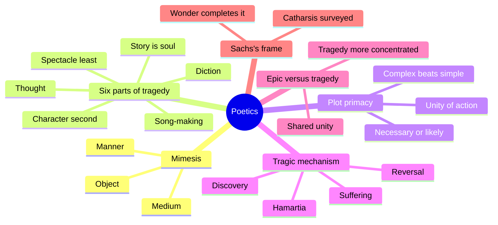
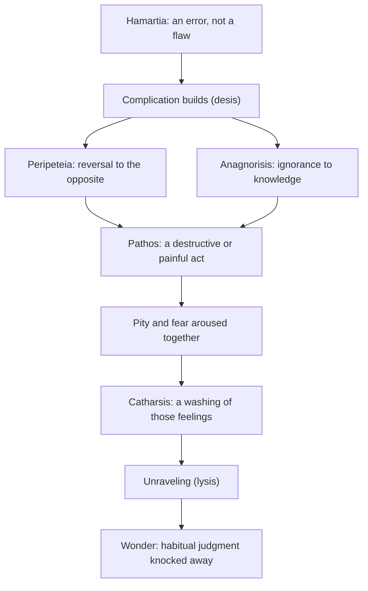
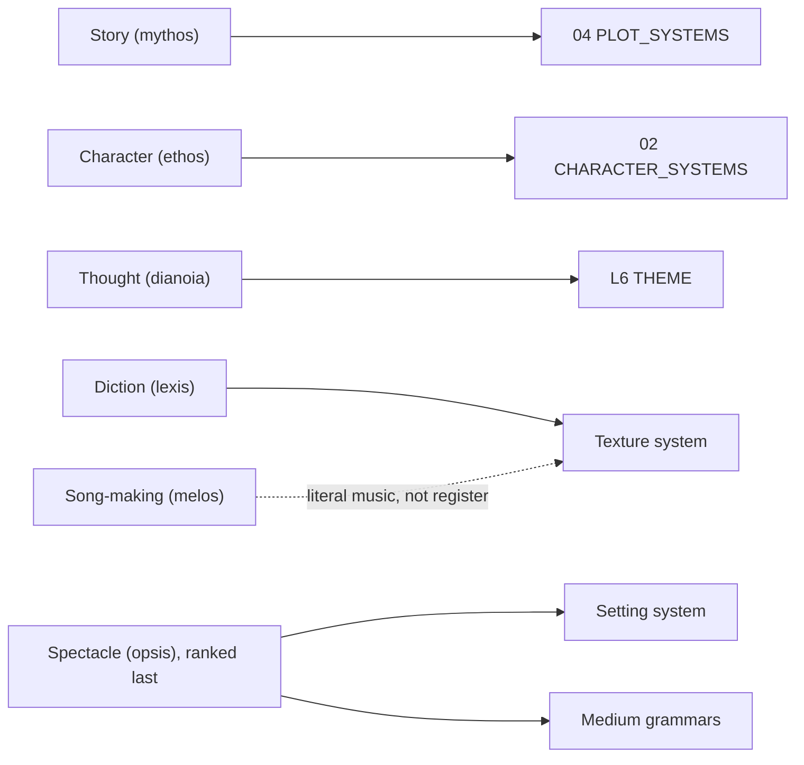
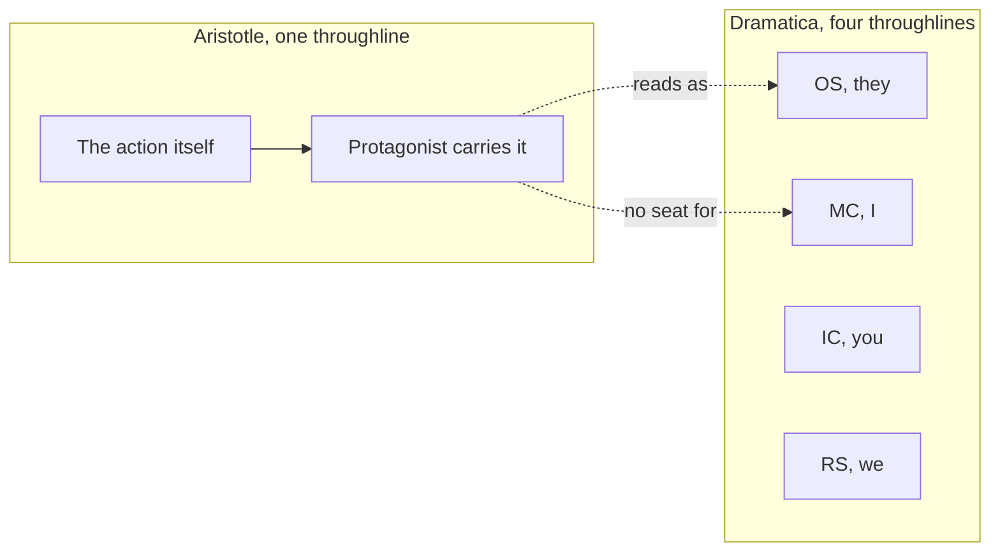

# BVX.1126 — Poetics — Aristotle, trans. Joe Sachs (2006)
### Knowledge Entry — Distill

The rival map's root ancestor, finally read from the primary text rather than cited secondhand: the first taxonomy of story (plot, character, thought, diction, melody, spectacle) and the source of hamartia, catharsis, peripeteia, and anagnorisis, all four terms the house already uses without their original argument attached.

## TABLE OF CONTENTS
- [Core Thesis](#1-core-thesis)
- [Mind Models](#2-mind-models)
- [Framework](#3-framework--structure)
- [Key Concepts](#4-key-concepts)
- [Heuristics](#5-heuristics--decision-rules)
- [Invariants](#6-invariants)
- [Pitfalls](#7-pitfalls--myths)
- [Application](#8-application)
- [Cross-References](#9-cross-references)
- [Provenance](#10-provenance--confidence)

---

## 1 · CORE THESIS

Tragedy imitates a complete, serious action, not a person, and through pity and fear accomplishes a catharsis of those feelings, a definition completed eighteen chapters later in wonder. Story is the soul of tragedy; character exists to serve the action. Hamartia names an error of missing the mark, never a moral flaw.

---

## 2 · MIND MODELS

**Diagram 1 — the whole argument.**
Caption: *six branches, one claim: the story is the soul, everything else, including spectacle, is graded by how much it serves the action.*

**Diagram 2 — the central mechanism (the tragic plot).**
Caption: *hamartia is not the flaw itself, it is the error that sets the whole chain moving toward catharsis and, past it, wonder.*

**Diagram 3 — the six parts mapped onto the Command's five systems.**
Caption: *the mapping mostly holds, but melody is literal sung music in Aristotle, not the modern texture system's register, and spectacle is demoted where the setting system is not.*

**Diagram 4 — the OS-bias test.**
Caption: *Aristotle's "single central character" is an outside-in organizing rule for the action, not a dramatized "I"; this is exactly what the rival map's OS-biased verdict is pointing at.*

---

## 3 · FRAMEWORK / STRUCTURE

Twenty-six chapters, four movements. **Chs.1-5** establish imitation (mimesis) itself: three variables (medium, object, manner) distinguish the arts from one another, tragedy and comedy split by imitating people better or worse than us, and poetry's two natural causes are the instinct to imitate and the delight taken in understanding an image once recognized. **Chs.6-18** are the plot core: Ch.6 defines tragedy and ranks its six parts (story, character, thought, diction, song-making, spectacle); Chs.7-9 set magnitude, unity of action, and poetry's superiority to history (the universal over the particular); Chs.10-11 define simple versus complex plots and name reversal (peripeteia) and discovery (anagnorisis); Ch.13 rules the single best plot-shape (good-to-bad fortune, through hamartia, in a decent middling person); Ch.14 insists fear and pity come from plot structure, not spectacle; Chs.15-18 cover character requirements, ranked forms of discovery, compositional method (visualize, then outline, then fill in episodes), and the four species of tragedy built on complication (desis) and unraveling (lysis). **Chs.19-22** cover thought (subordinated to rhetoric) and diction, culminating in metaphor as the one part of wording that cannot be taught. **Chs.23-26** turn to epic poetry, judge it by the same unity-of-action standard, and close by ranking tragedy above epic because it achieves the same end (imitation of a complete action producing pity and fear) more concentratedly, in less time, with music and spectacle epic does not have.

Sachs's Introduction runs a separate, parallel argument across five named sections (Experiencing and Thinking, Imitation, Stories, Fear and Pity, A Fatal Flaw, Katharsis, Wonder): action is knowable only through choice and imagination, not sense-perception alone, which is why tragedy's imitation of action can disclose more than any original; hamartia is a mistranslation-prone term whose root sense (missing a mark with a spear) rules out reading it as a character flaw; and catharsis, introduced in Ch.6 and never explained, is deliberately left open until Ch.24 completes the definition of tragedy's effect with wonder (ekplexis, thaumaston) instead.

---

## 4 · KEY CONCEPTS

| Concept | What it is | Why it matters |
|---|---|---|
| **Mimesis** | Imitation, the shared root of all poetic and visual arts, differentiated by medium, object, manner (Chs.1-3) | Poetry is one instance of a wider human capacity, not a special case |
| **The six parts** | Story, character, thought, diction, song-making, spectacle (Ch.6) | First taxonomy of a dramatic work; ranked, not a flat list |
| **Story (mythos) as soul** | "The story is the soul of the tragedy... what breathes life into all the tragedy's parts" (Sachs, p.4, on 1450a38-39) | Structure precedes and organizes character, reversed from a characterization-first model |
| **Praxis (action)** | Doing that proceeds through choice toward an end; only this has the completeness tragedy imitates (1449b24-25) | The philosophical ground under "unity of action" |
| **Magnitude** | Length "easily held in memory"; enough space for a good-to-bad change by necessary or likely sequence (Ch.7) | A structural, not arbitrary, length rule |
| **Unity of action** | One action, not one person; Homer cuts Odysseus's life to one organized action (Ch.8) | Rules out biography-shaped plotting (the Heracleid critique) |
| **Universal over particular** | Poetry speaks what a kind of person does by necessity or likelihood; history, only what one person did (Ch.9) | "Poetry is more philosophical and more serious than history" |
| **Simple vs. complex plot** | Simple: no reversal or discovery. Complex: involves one or both (Ch.10) | Complex plots are structurally superior, not merely busier |
| **Peripeteia (reversal)** | "The change to the opposite of the things being done" (Ch.11) | The Oedipus messenger scene: meant to reassure, produces the opposite |
| **Anagnorisis (discovery)** | "A change from ignorance to recognition," best when simultaneous with a reversal (Ch.11) | Ch.16 ranks it least artful (a scar) to best (from the actions themselves) |
| **Pathos (suffering)** | "A destructive or painful action," third part of plot alongside reversal, discovery (Ch.11) | An on-stage event category, not an audience feeling |
| **Hamartia** | "Missing the mark," archery imagery, never badness of character; lets a decent person fall without reading as deserved (Ch.13, Sachs p.7-9) | Corrects the "tragic flaw" tradition traced to Butcher's 1895 translation |
| **Epieikes / chrestos** | "Decent" / "solid," Sachs's terms for the tragic figure, deliberately not spoudaios (surpassing excellence) | Target is a middling, credible person, not a paragon with one blemish |
| **Catharsis** | The washing-away named once (1449b27-28), never explained; Sachs surveys purgation, purification, intellectual clarification | A live scholarly problem, not a settled house term |
| **Wonder** | Ekplexis / thaumaston, the knocking-away of habitual judgment; Ch.24 completes the definition begun at catharsis in Ch.6 | Sachs's central claim: tragedy's telos is wonder, not a guaranteed lesson |
| **Desis / lysis** | Complication (build-up to the turn) and unraveling (resolving after it) (Ch.18) | The macro-shape all four tragedy-species share |
| **Metaphor** | "A carrying over of a word belonging to something else... insight into what is alike" (Ch.22, 1459a5-8) | The one part of wording that "cannot be gotten from anyone else" |

---

## 5 · HEURISTICS & DECISION RULES

| Situation | Do this | Not this |
|---|---|---|
| Protagonist's downfall needs a cause | Give a hamartia: an error, an act of ignorance, a missed mark | Bolt on a "tragic flaw," a vice that makes the fall feel deserved |
| Choosing how virtuous the central figure should be | Aim for decent/middling (epieikes), between surpassing virtue and vice | Write a paragon undone by one blemish, or a villain who simply gets what's coming |
| Ending feels moralized or too neat | Let fear and pity come from the plot's organization (reversal + discovery + suffering) | Lean on spectacle, or an explicit stated lesson, to produce the feeling |
| A discovery scene feels cheap | Derive it from the actions themselves (Oedipus, the Iphigenia letter) | Use an external sign (scar, birthmark) as the only mechanism |
| Deciding a story's shape (good/bad fortune) | Rule single: good fortune to bad, never the reverse, never a fully wicked person's fall | Use a "double" ending where good and bad people both end happily (Aristotle calls this comedy's pleasure, not tragedy's) |
| Tempted to add an unaccountable event (a god, a coincidence) | Push it outside the drama itself, before or after the action shown | Put it inside the action, where it breaks the necessary-or-likely chain |
| Reaching for a word to elevate prose | Reach for metaphor by analogy (A:B :: C:D) before foreign words or coinages | Overload with foreign/coined words until the passage reads as a riddle or a barbarism |
| A scene needs urgency | Check whether the story's magnitude still fits in the audience's memory | Let episodes run past the point the whole can be "taken in together" |

---

## 6 · INVARIANTS

1. Story (mythos) organizes and precedes character; tragedy imitates action and life, not persons.
2. A whole action has a beginning, middle, and end bound by necessary or likely sequence, never mere chronological adjacency.
3. Unity of action, not unity of person: many events belong to one person without becoming one story.
4. The single best plot-shape changes a decent, middling person from good fortune to bad, through hamartia, never the reverse and never a thoroughly wicked person's fall.
5. Fear and pity must arise from the plot's own organization; producing them through spectacle alone is a lesser, and less artful, achievement.
6. Discovery is most beautiful exactly when it coincides with a reversal.
7. Poetry is more philosophical than history because it speaks the universal (what a kind of person does or says by necessity or likelihood), history only the particular.
8. Metaphor cannot be taught; using it well is the one sign of natural poetic gift no other part of wording provides.
9. Tragedy's own definition is not complete at catharsis (Ch.6); it completes eighteen chapters later, at wonder (Ch.24).

---

## 7 · PITFALLS / MYTHS

- Reading hamartia as "tragic flaw": traced to Butcher's 1895 translation, a misreading Sachs says "turns Aristotle's account of tragedy upside down."
- Assuming the tragic figure must be flawless or vicious: Aristotle rules out both a virtuous person falling (repellent) and a vicious one falling (arouses no pity or fear).
- Treating spectacle as tragedy's main emotional lever: Aristotle calls it "the component most foreign to the art," noting tragedy's power survives without actors or a theater.
- Confusing plot ("a skeletal framework of events") with story (mythos, "a genuine whole that already has a life of its own"): a translation choice with real stakes, not a synonym swap.
- Treating catharsis as settled: purgation, purification, ritual cleansing, and intellectual clarification all have textual support and real problems; none is "the" reading.
- Assuming a big cast or many events makes a richer story: unity of action disciplines against this.
- Believing wonder is only a surprise byproduct: it is the stated aim (Ch.24, 1460a11-12), not incidental.

---

## 8 · APPLICATION

- **Spine level:** L0 (root claim: mimesis of a complete action, plot primacy, as against Dramatica's argument-of-a-mind claim), L4 (magnitude, unity, reversal/discovery/suffering, complication/unraveling, the plot floor every later plot theory sits on), L6 (thought/dianoia and hamartia as an early, unstructured theme layer), L7 (the tragedy/comedy/epic split by imitated-object and manner, the ancestor of genre-as-taxonomy, thin compared to Truby's moral-argument traditions).
- **12-layer character stack:** contextual only, this entry's `feeds:` list is deliberately thin. DRAMATICA throughline (contextual): the single-central-character rule reads as an Overall Story seat, not a dramatized MC. L5 WOUND (contextual, flagged as a likely mismatch): hamartia is an error, not a wound. L12 FUNCTION (supporting): the good-to-bad, hamartia-driven shape is a proto-Outcome/Judgment reading. L6 theme (supporting): dianoia is proto-theme, subordinated to rhetoric.
- **plot_systems:** direct material for P4 TURN (peripeteia is the oldest named reversal mechanism the house holds) and P7 REVEAL (anagnorisis, with Ch.16's own ranked taxonomy of discovery types, arguably richer than Truby's revelations sequence at the single-scene grain). Also feeds P9 STAKES/ESCALATION loosely, via the magnitude and necessary-or-likely-sequence rules.
- **Setting:** not applicable in any positive sense; spectacle (opsis) is explicitly the part Aristotle ranks last and calls least inherent to the art, the opposite of the setting system's and the medium grammars' treatment of the visual/physical layer as load-bearing.

**For the five systems:**
- The six parts are the ancestor of three of five Command models (story→04, character→02, thought→L6), but the join breaks on the rest: melos is literal sung music, not the texture system's register, and opsis is Aristotle's least-important part where the setting/medium layer is load-bearing.
- "OS-biased" holds. The single-central-character rule organizes action from the outside, by necessity and likelihood, with no dramatized "I," no Impact Character, no Relationship Story. It is a plot-coherence device, not a subjectivity model, which is what an Overall Story seat is and an MC seat is not.
- Peripeteia and anagnorisis map cleanly onto P4 TURN and P7 REVEAL, and may outperform Truby's and Coyne's versions at single-scene grain: the Oedipus messenger scene is a textbook Gap two and a half millennia early, and Ch.16's ranked discovery taxonomy is a finer reveal-quality ladder than anything else on the L4 shelf.
- Hamartia is an error, not a wound. Its root sense is missing a physical mark, its Ethics usage covers negligence and forgivable ignorance, and Aristotle never calls the tragic figure flawed. L5 WOUND, a psychological injury generating a persistent pattern, is a later, more Freudian concept hamartia should not be folded into.
- Catharsis resists G4 ARGUMENT's binary shape: Sachs is explicit that "it does not follow that the poet has taught us anything," ruling out catharsis as proof of a core binary. It maps better onto the texture system's mood curve, an affective arc of rising pity and fear then a washing, not a propositional argument.
- Adopt as house terms: "missing the mark" for hamartia over "flaw"; "story" for mythos over "plot," keeping the organic-whole sense; "decent"/"solid" (epieikes/chrestos) over language implying perfection or a hidden defect; and "wonder" as tragedy's actual telos, wherever the house currently stops at catharsis.

---

## 9 · CROSS-REFERENCES

| Related entry | Relation |
|---|---|
| [[BVX.0089]] | Dramatica, the ruled spine; this entry is the primary-text test of the rival map's "root ancestor, OS-biased" verdict on Aristotle |
| [[BVX.0175]] | McKee, *Story*; shares the plot-primacy claim (structure and character are one thing) and a value-turn mechanism strikingly close to peripeteia |
| [[BVX.0193]] | Truby, *Anatomy of Story*; the moral-argument model dianoia (thought) is the unstructured ancestor of, without Aristotle's own Issue/Counterpoint machinery |
| [[BVX.1123]] | Egri, *Art of Dramatic Writing* (distilling in parallel); the premise is the direct modern heir of dianoia, argued as proof rather than demonstrated in a speech |
| [[BVX.0614]] | Todorov, *The Fantastic*; both models are reader/audience-response theories (fear-and-pity vs. the hesitation) rather than pure structure theories, a kinship worth naming at G5 |

---

## 10 · PROVENANCE & CONFIDENCE

Visual read of a scanned PDF with no text layer, via the Read tool's page-image rendering, at the drop-folder path (no Zotero key). The file is 156 PDF pages but contains the book's ~74 content pages twice over (a duplicate-scan artifact starting around PDF page 77); confirmed by comparing the tail of the second copy (PDF pp.147-156) against already-read material, so no unique content was missed.

**Read in full, page by page:** the entire Introduction (book pp.1-18) and the entire *Poetics* text, all 26 chapters (book pp.19-68), via PDF pages 1-76. Covers Chs.1-5 (imitation, comedy/tragedy split), Ch.6 (definition, six parts), Chs.7-14 (magnitude, unity, universal-vs-particular, simple/complex plots, reversal, discovery, suffering, the best-plot ruling, fear/pity from structure), Chs.15-18 (character requirements, ranked discovery forms, method, complication/unraveling, tragedy-species), Chs.19-22 (thought, diction, metaphor), Chs.23-26 (epic poetry, problems and solutions, epic-vs-tragedy).

**Read closely for terminology:** the Glossary of Names (book pp.69-71) and Glossary of Greek Words (book pp.72-74), Sachs's own entries for alogon, epieikes/chrestos, ethos, hamartia, katharsis, mimesis, muthos, poiesis, praxis, spoudaios, systasis, and tragodia, cited above by Sachs's gloss rather than paraphrase.

**Not independently verified:** the Greek text itself; the secondary literature Sachs surveys on catharsis (Bernays, Freud, Milton, Lessing, Golden, Nussbaum) is reported as Sachs summarizes it. No page was unreadable.

The rival-map verdict this entry tests ("root ancestor, OS-biased," per [[BVX.0089]], primary text previously not held) is addressed in §8; that gap is now closed.

## META
- Template: BVX-LEARN-v4.0
- Source classification: full-text book, visual scan read (no text layer, drop-folder PDF, no Zotero key)
- Created / Updated: 2026-09-16
