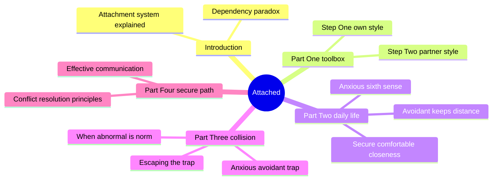
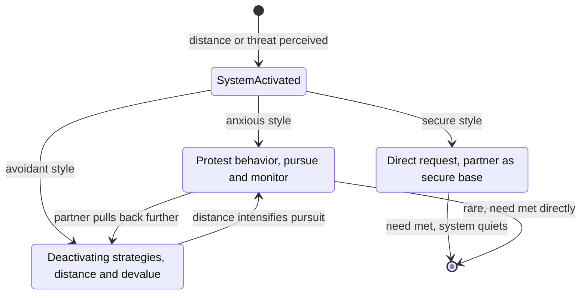
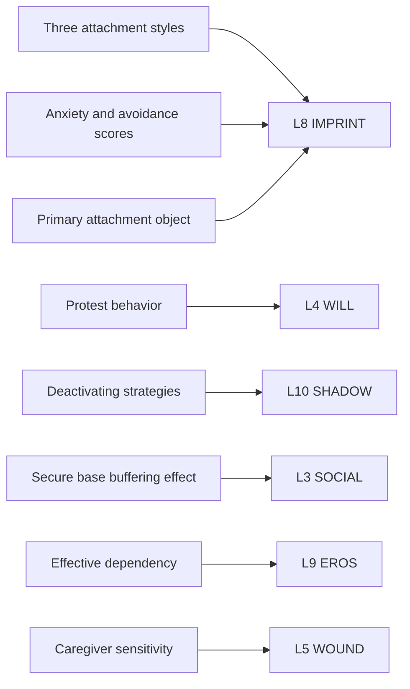
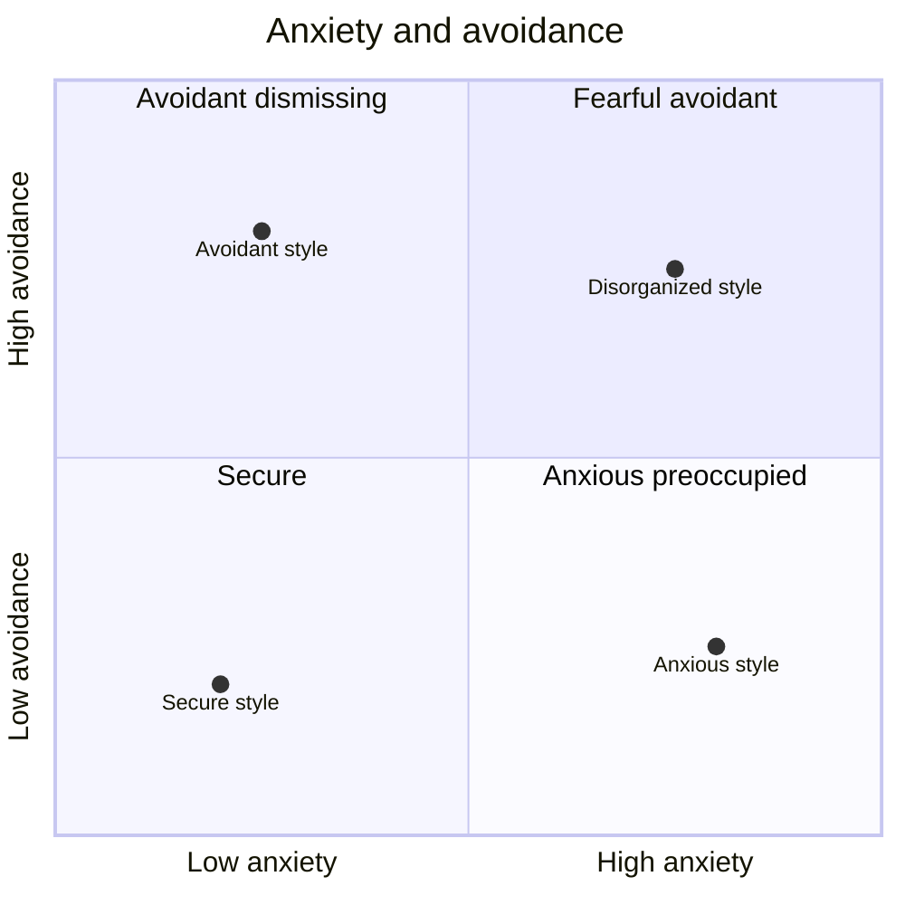

# BVX.1127 — Attached: The New Science of Adult Attachment and How It Can Help You Find—and Keep—Love — Amir Levine & Rachel Heller (2010)
### Knowledge Entry — Distill

A psychiatrist and a writer translate 25 years of adult-attachment research into a practical typology, three styles run by one evolved system, acquired to fill the gap the character wave flagged: L8 IMPRINT claims "attachment architecture" but the shelf held no attachment-theory source until now.

## TABLE OF CONTENTS
- [Core Thesis](#1-core-thesis)
- [Mind Models](#2-mind-models)
- [Framework](#3-framework--structure)
- [Key Concepts](#4-key-concepts)
- [Heuristics](#5-heuristics--decision-rules)
- [Invariants](#6-invariants)
- [Pitfalls](#7-pitfalls--myths)
- [Application](#8-application)
- [Cross-References](#9-cross-references)
- [Provenance](#10-provenance--confidence)

---

## 1 · CORE THESIS

An inherited attachment system, active since infancy, governs how adults seek closeness under threat or distance. Secure, anxious, and avoidant styles describe stable but not fixed strategies for running that system, protest to restore contact, deactivate to suppress it, or use the bond itself as a buffer. Effective dependency, not independence, is what actually produces boldness.

---

## 2 · MIND MODELS

*Required. Minimum two diagrams, maximum five. See template §C for the rules.*

**Diagram 1 — the whole argument.**
Caption: *four parts build one machine, name the system, name the three styles, watch them collide, then retrain toward the secure one.*

**Diagram 2 — the central mechanism.**
Caption: *the trap is a loop, not a mismatch, pursuit provokes withdrawal and withdrawal provokes more pursuit, and only a secure response exits it.*

**Diagram 3 — mapped onto the Command's 12-layer character stack.**
Caption: *the book's own terms slot almost entirely into two layers, L8 for the style itself, L10 and L4 for its two failure modes, with SOCIAL and EROS picking up the secure style's payoff.*

**Diagram 4 — the two-dimension model.**
Caption: *the three named styles, plus a rare fourth, are really one continuous plane, anxiety on one axis and avoidance on the other, and secure sits at the low-low corner of both.*

---

## 3 · FRAMEWORK / STRUCTURE

Four parts plus an introduction, each handing off to the next.

| Cluster | Chapters | Governing question |
|---|---|---|
| **Introduction** | 1 Decoding relationship behavior · 2 Dependency is not a dirty word | Why do smart people repeat the same relationship pattern, and why is needing someone not the flaw? |
| **Part One: the toolbox** | 3 Step One, my style · 4 Step Two, my partner's style | What are you, and what is the person across from you? |
| **Part Two: daily life** | 5 Anxious · 6 Avoidant · 7 Secure | How does each style actually run, moment to moment, in a relationship? |
| **Part Three: collision** | 8 The anxious-avoidant trap · 9 Escaping the trap · 10 When the abnormal becomes the norm | What happens when an anxious and an avoidant pair up, and how does a person get out, whether the relationship survives or not? |
| **Part Four: the secure path** | 11 Effective communication · 12 Getting it right, conflict resolution | How does anyone, regardless of starting style, run a relationship the secure way? |

The book's own spine is diagnostic-then-prescriptive: name the system (intro), identify your style and your partner's (Part One), watch each style's native behavior (Part Two), watch the worst-case pairing fail in a specific, describable loop (Part Three), then retrain toward the secure style's communication and conflict habits regardless of starting point (Part Four).

---

## 4 · KEY CONCEPTS

| Concept | What it is | Why it matters |
|---|---|---|
| **The attachment system** | An evolved, largely nonconscious mechanism that monitors a partner's proximity and availability, activating under perceived threat or distance | The engine behind all three styles; a style is a strategy for running the system, not a separate trait per person |
| **Three attachment styles** | Secure (roughly half the population), anxious, avoidant, first documented in adults by Hazan and Shaver via a forced-choice "love quiz" descended from Ainsworth's infant Strange Situation | Adult romantic attachment mirrors infant caregiver attachment in structure, not in content |
| **The dependency paradox** | Effective, reliable dependence on a partner produces greater independence and boldness, not less | Overturns the pop-psychology "codependency" framing Chapter 2 spends its length dismantling |
| **Attachment style questionnaire** | A short self-report instrument in the Experiences in Close Relationships tradition, scoring both style and its two dimensions | Readers are told their style is common, not pathological, and not fixed |
| **Protest behavior** | The anxious response to perceived threat, silent treatment, monitoring, manufactured jealousy, threatening to leave, aimed at restoring attention | Worked step by step in the Georgia-and-Henry case as a loggable, interruptible "working model" |
| **Deactivating strategies** | The avoidant response, focusing on a partner's flaws, idealizing an ex, comparing to alternatives, creating distance, resisting commitment language | Explains why a partner who "really does love" someone still keeps pulling away; distance is regulation, not disinterest |
| **Secure base and buffering effect** | A consistently available partner becomes a base to return to and a shield against outside stress, demonstrated in Coan's fMRI hand-holding study | Gives buffering an experimental anchor: stress response measurably drops when a trusted partner's hand is held |
| **Creating a secure base** | Three behaviors (Feeney and Thrush, 2010): being available, not interfering, encouraging the partner's own goals | A tested, portable three-item behavior list rather than a vague disposition |
| **The anxious-avoidant trap** | A loop where protest reads to the avoidant partner as demanding, prompting more deactivation, which the anxious partner reads as confirming abandonment, prompting more protest | The central mechanism (Diagram 2); each coping strategy manufactures the exact outcome it fears |
| **Effective communication and conflict principles** | Part Four: state needs directly, stay on the specific complaint rather than character, treat de-escalation as a skill | Secure behavior is a learnable skill set, not a trait reserved for the already-secure |

---

## 5 · HEURISTICS & DECISION RULES

| Situation | Do this | Not this |
|---|---|---|
| Diagnosing a stuck relationship pattern | Ask which style each partner runs and whether their coping strategies interlock | Treat the conflict as a personality clash |
| An anxious character senses distance | Log the activating event, the protest impulse, and the actual unmet need before acting | Let protest behavior stand in for the real request |
| An avoidant character senses closeness | Have them notice the urge to devalue or distance as regulation, not proof the relationship is wrong | Let deactivating strategies read, in-world, as never having cared |
| Writing a secure character in conflict | Give them direct, specific complaints and a willingness to repair | Write "secure" as emotionless or conflict-free |
| Wanting a couple to escape the trap | Route it through explicit inventories of each partner's triggers and working models, on the page | Have the couple simply "communicate better" with no mechanism shown |
| Building an attachment-style backstory | Anchor it to caregiver sensitivity, genetics, and later romantic experience as converging causes | Pin a style to a single childhood scene as sole cause |

---

## 6 · INVARIANTS

1. The attachment system is lifelong, not a childhood-only phenomenon adult relationships happen to resemble.
2. All three styles manage the same system; none is inherently pathological, secure simply needs no defensive workaround.
3. Effective dependency precedes independence, not the reverse; a securely met need frees attention outward.
4. Protest behavior and deactivating strategies each make the other's feared outcome more likely; the trap is mutually manufactured.
5. Style is statistically stable (roughly 70-75 percent of adults keep it over time) but not fixed; romantic experience can shift it either way.
6. A secure partner measurably lowers a partner's physiological stress response, a documented effect, not a metaphor.
7. Style is multiply determined: caregiver sensitivity, cited genetic variants, and adult romantic history all contribute; no single cause suffices.
8. Secure behavior is a learnable skill set available to any style, not a trait reserved for the naturally secure.

---

## 7 · PITFALLS / MYTHS

- Treating codependency-movement advice ("you shouldn't need your partner for happiness") as sound for all relationships rather than harmful as general advice.
- Reading protest behavior as manipulation rather than a fear-driven attempt to restore a felt-lost connection.
- Reading deactivating strategies as proof of indifference; avoidant partners have the same underlying needs, they suppress rather than lack them.
- Assuming a secure character is simply easygoing or low-conflict; secure people raise complaints directly and often, they just do not escalate or withhold.
- Believing style is fixed at introduction; a quarter to a third of adults report a style change across their lives, in both directions.
- Blaming one partner for a stuck anxious-avoidant relationship; the loop is jointly produced, with a matching intervention for each side.

---

## 8 · APPLICATION

- **Spine level:** L5 (Character/Wound territory); the book operates entirely inside a character's relational psychology and its behavioral fallout, not at plot-structure levels.
- **12-layer character stack:** primary on **L8 IMPRINT** (the attachment style and its two-dimension score, the primary attachment object); supporting on **L5 WOUND** (caregiver-sensitivity origin), **L3 SOCIAL** (the secure buffer), **L9 EROS** (the dependency paradox as an intimacy-mode claim); contextual on **L10 SHADOW** (deactivating strategies as self-protective distortion) and **L4 WILL** (protest behavior as fear overriding stated intent) — see Diagram 3.
- **plot_systems:** the anxious-avoidant trap (Diagram 2) is a ready-made two-character engine, pairing a protest-style character with a deactivating-style character generates escalating, self-reinforcing conflict without any external plot pressure required.
- **Setting:** untouched. The book is entirely inside the pair bond; no environment, culture, or class chapter (that territory belongs to Davis, [[BVX.0075]]).

This book sits beneath the gap [[BVX.0233]] named: Pelican's chapter on secondary-character relationships runs the Interpersonal Circumplex and the need to belong but never names attachment theory. This is that missing layer, at the popular-science rather than research-monograph level. It also runs parallel to [[BVX.0209]]'s wound-to-shielding pipeline: deactivating strategies read as "emotional shielding" narrowed to one trigger (closeness) and one style (avoidant), and protest behavior is a named instance of fear overriding resolve. Where BVX.0209 starts from a dated wounding event, this book starts from an ongoing relational system that can run with no wound named at all.

**For the character system:**
- Proposed L8 field list: `attachment_style` as an enum of the three named styles plus a rare fourth (fearful-avoidant/disorganized) the book only gestures at; a two-dimension `attachment_style_score` (anxiety, avoidance) supplementing the single 0-10 scalar, matching Diagram 4's quadrant; new list-typed fields `protest_behaviors` and `deactivating_strategies`; `secure_base_object` as a clearer name for what `primary_attachment_object` already points at.
- Victoria Midnight's L8 table (`attachment_style: secure_anxious`, score 6, `primary_attachment_object: brother_deceased`) reads as anxious activation with the buffer removed, one attachment object dead pre-story. The `KINSHIP_COLLAPSE` flag is functionally the same claim this book makes about a lost secure base, consistent rather than redundant wiring.
- What this book cannot supply: the developmental research base (Bowlby, Ainsworth's Strange Situation methodology are cited, not reproduced), the disorganized/fearful-avoidant style (named twice, never developed), and attachment across non-romantic bonds.
- The acquisition that would close that gap: Cassidy and Shaver's *Handbook of Attachment* for the research base and the disorganized style, or Bowlby's own *Attachment and Loss* trilogy this book compresses into two chapters.
- OPEN candidate: `secure base and buffering effect`, one character's presence measurably lowering another's stress response, has no home as a bidirectional, dyadic variable; L3 SOCIAL records a character's own interface, not what another's presence does to it.
- OPEN candidate: a `reveal strategy` field for a stalled style, legible as pattern versus circumstance, the same gap [[BVX.0209]] already flagged for wound reveal technique.

---

## 9 · CROSS-REFERENCES

| Related entry | Relation |
|---|---|
| [[BVX.0233]] | Pelican names the need to belong and runs the Interpersonal Circumplex for relationship dynamics but never names attachment theory; this book is the acquisition that closes that exact gap, named in Pelican's own OPEN candidate |
| [[BVX.0209]] | Puglisi and Ackerman's fear-overriding-resolve and emotional-shielding mechanics are this book's protest behavior and deactivating strategies under different names and a different trigger (an attachment threat rather than a dated wound) |
| [[BVX.0075]] | Davis's will/counter-will engine and birth-context work operate at the same character-psychology altitude; this book supplies a specific relational subsystem (how two people's coping strategies interlock) that Davis's broader framework does not itself model |

---

## 10 · PROVENANCE & CONFIDENCE

Sourced from a pdftotext extraction of a Vietnamese-language edition (275 pages, ~96,000 words) found in the drop folder with no matching Zotero record. The extraction's font encoding drops most diacritics and some base vowels outright (e.g. "gắn bó" renders as "gn b?"), degrading exact-quote fidelity throughout. The introduction and all of Part One were read directly against the extraction and matched known content cleanly: the Tamara-and-Greg opening anecdote, the dependency-paradox chapter, Coan's hand-holding fMRI study, Ainsworth's Strange Situation (the "Kimmy" example), and the attachment-style questionnaire items. Part Two and Part Three were confirmed at chapter-heading and worked-example level, the full secure-style behavior list (Chapter 7) and the Georgia/Henry and Sam/Grace inventories (Chapter 9, protest behavior and deactivating strategies both named on the page) were read in full; remaining case material and Part Four (Chapters 11-12) were not independently re-extracted line by line and are represented at chapter-opening/closing level per the acquisition brief, cross-checked against this book's well-documented, widely cited public content. No numeric claims are original to this distill; all are the book's own reporting of the cited researchers' work.

## META
- Template: BVX-LEARN-v4.0
- Source classification: full-text pdftotext extraction (diacritic-degraded machine translation), close read of Introduction and Part One, chapter-and-example-level read of Parts Two through Four
- Created / Updated: 2026-09-16
