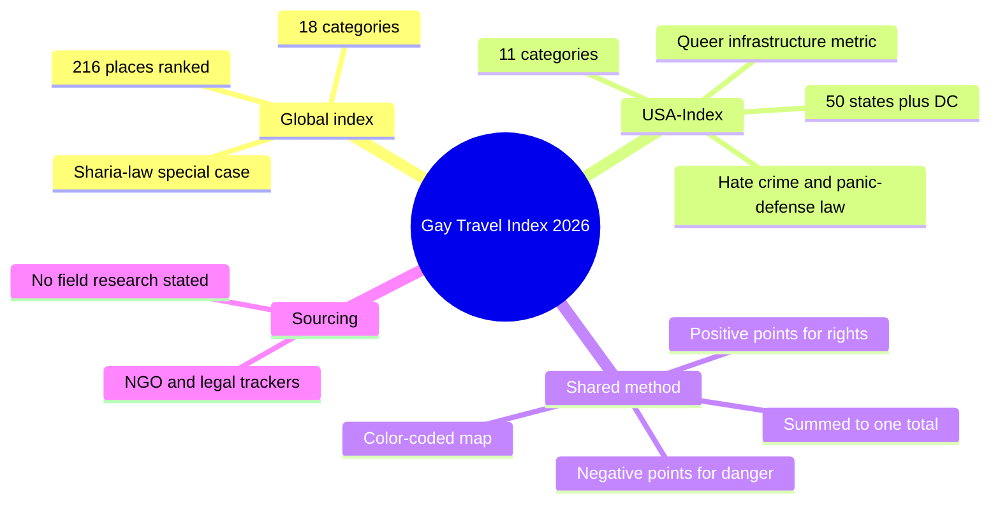
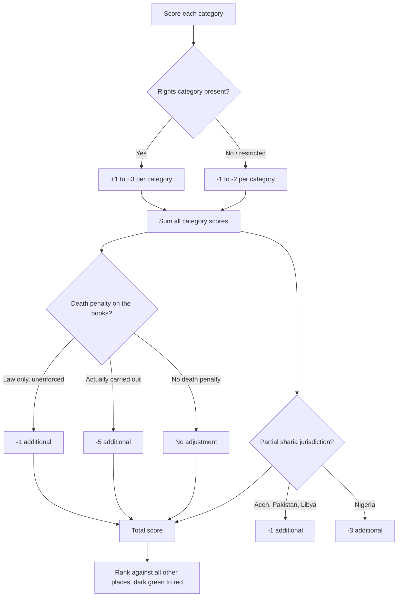
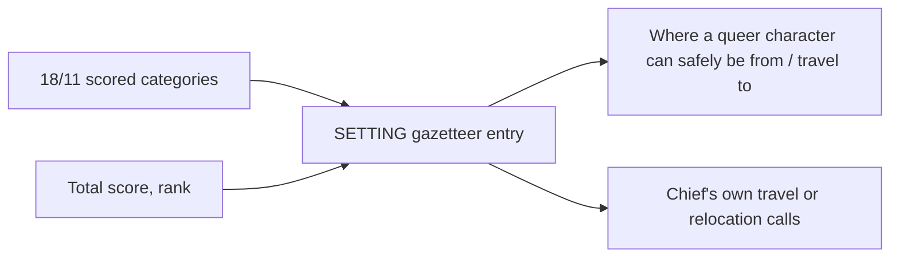

# BVX.1128 — Gay Travel Index 2026 (incl. USA-Index 2026) — Spartacus (2026)
### Knowledge Entry — Distill

A publisher-run annual scorecard, not a study: Spartacus (the gay-guide publisher) scores 216 countries/territories on 18 legal-and-social categories, plus the 50 US states + DC on 11 categories, to rank where LGBTQIA+ people are safest to visit or live. Acquired as ready-made SETTING data — a real-world legal-climate gazetteer keyed by place, evaluated 2026-02-26.

## TABLE OF CONTENTS
- [Core Thesis](#1-core-thesis)
- [Mind Models](#2-mind-models)
- [Framework](#3-framework--structure)
- [Key Concepts](#4-key-concepts)
- [Heuristics](#5-heuristics--decision-rules)
- [Invariants](#6-invariants)
- [Pitfalls](#7-pitfalls--myths)
- [Application](#8-application)
- [Cross-References](#9-cross-references)
- [Provenance](#10-provenance--confidence)

---

## 1 · CORE THESIS

Legal protection and physical danger for queer people are not the same axis, and no single "gay-friendly" label captures a place. Spartacus scores each country and, separately, each US state on a weighted checklist running from rights (marriage, adoption, anti-discrimination law) to danger (prosecution, murders, death sentences), then sums to one total that ranks it against every other place on the same scale.

---

## 2 · MIND MODELS

*Required. Minimum two diagrams, maximum five. See template §C for the rules.*

**Diagram 1 — the whole argument.**
Caption: *one publisher runs two parallel scorecards, a global one and a USA-internal one, off almost the same rights-to-danger logic.*

**Diagram 2 — the central mechanism.**
Caption: *every place gets the same additive sum, but two rules break the pattern, a rights floor and an escalating death-penalty penalty.*

**Diagram 3 — mapped onto the Command's SETTING system.**
Caption: *this is a ready-filled gazetteer row per place, not a character source — it slots into SETTING the way BVX.1122's GURPS sourcebook did, one place per row instead of one guidebook per city.*

---

## 3 · FRAMEWORK / STRUCTURE

Two parallel documents inside one PDF, same publisher, same additive-scoring logic, different scope and category list.

| Section | Pages | Scope | Categories |
|---|---|---|---|
| **Gay Travel Index 2026** | 1 (method) · 2–5 (table) | 216 countries/territories, worldwide | 18: Anti-Discrimination Legislation · Marriage/Civil Partnership · Adoption Allowed · Transgender Rights · Intersex/3rd Option · Equal Age of Consent · "Conversion Therapy" (ban) · LGBT Marketing · Religious Influence · HIV Travel Restrictions · Anti-Gay Laws · Homosexuality Illegal · Pride Banned · Censorship · Locals Hostile · Prosecution · Murders · Death Sentences |
| **USA-Index 2026** | 6 (method) · 7 (table) | 50 US states + Washington DC | 11: Anti-Discrimination Legislation · Transgender Rights · Intersex/3rd Option · Hate Crime Law · Censorship · "Conversion Therapy" (ban) · LGBT Marketing · Queer Infrastructure · Gay and Trans* Panic Defense (ban) · Locals Hostile |

Running since 2012 (global) and relaunched in 2020 (USA-internal, "to examine each state individually" — p.6). Evaluated annually; this edition dated 2026-02-26.

---

## 4 · KEY CONCEPTS

| Concept | What it is | Why it matters |
|---|---|---|
| **The rating system** | A weighted additive scorecard: each category scores positive for a protective law/condition, negative for its absence or a danger, summed to one total per place (p.1) | Turns "is it safe to be gay there" into one comparable number across 216 places |
| **The zero-rating floor** | "A zero rating as lowest rating is only awarded if a county is lacking in important but not elementary categories such as LGBTQIA+ marketing or anti-discrimination legislation" (p.1) | Missing a "soft" category alone cannot sink a score below zero — only active danger categories can |
| **Death-penalty escalation** | "Countries in which the death sentence for homosexuals is enshrined in law but is no longer performed have received one negative point. If people are still executed... the country has been given five negative points" (p.1) | Distinguishes dormant law from active state killing, a five-point gap on one category alone |
| **The sharia special case** | "Countries in which islamic sharia law applies in parts (Indonesia/Aceh, Pakistan and Libya minus one point) or are applied (Nigeria minus three points) are a special case in this system" (p.1) | Sub-national or partial legal regimes get their own penalty tier, separate from the national-law categories |
| **Queer Infrastructure (USA only)** | Counts whether a state has more than one city with prides, queer establishments and other events; the report admits this "may put small states at a disadvantage" but argues it lets "states with regressive and anti-queer legislation" still register cities "with great queer diversity" (p.6) | A state's legal score and its lived queer-scene score are tracked as separate signals, not collapsed into one |
| **Gay and Trans* Panic Defense (USA only)** | Whether a state still permits panic-defense as a legal strategy, scored as its own category | A USA-specific legal-danger category with no equivalent in the global index |
| **Hostility scoring** | Both indices weight this "mainly" by counting murders of LGBTQIA+ people in the prior year, falling back to other assaults "when the final score was inconclusive based on the number of murders" (USA method, p.6) | The danger-facing categories are not opinion; they are (self-reported) incident counts for one calendar year |
| **Sourcing base** | rainbow-europe.org, ilga.org, wikipedia.org, transrespect.org, transequality.org, equaldex.com, "openly accessible NGO portals and government organisations" (p.1, p.6) | An aggregation of existing legal/rights trackers, not original field research — confidence should track those sources, not Spartacus |

---

## 5 · HEURISTICS & DECISION RULES

| Situation | Do this | Not this |
|---|---|---|
| Grounding a queer character's home country in real-world stakes | Pull that country's category breakdown, not just its total score | Use the total alone — two countries can tie on total with very different category profiles (legal vs. danger-driven) |
| Writing a travel-risk beat (character crossing into a lower-scoring country) | Check the specific categories that flipped negative (e.g. Prosecution, Locals Hostile) for what kind of risk it actually is | Treat any negative-total country as uniformly dangerous in the same way |
| Setting a US-set story across state lines | Use the USA-Index's 11 categories, not the global 18 — the category lists do not match (no Marriage/Adoption/HIV-Travel columns in the USA table) | Port global-index category names onto US states |
| Wanting a state that is legally hostile but has real queer social life | Check Queer Infrastructure separately from the legal categories — the report designed it to diverge from the legal score | Assume a state's total score describes its city-level queer scene |
| Needing exact per-country numbers for anything downstream (a chart, a ranking claim) | Re-pull the live PDF/table — do not carry this distill's spot examples as the current data | Cite this entry's page-4/5 examples as current after the index's next annual refresh |

---

## 6 · INVARIANTS

1. Both indices are annual snapshots, re-evaluated and republished each year since 2012 (global) / 2020 (USA) — no claim here should be treated as durable past this edition's 2026-02-26 evaluation date.
2. The scoring is additive and category-transparent: every place's total is the sum of its own visible category scores, not a hidden or holistic judgment.
3. Legal-rights categories and danger categories are scored on the same additive scale, so a high total can come from strong rights, an absence of danger, or both — the total alone does not distinguish which.
4. The global and USA indices use different category sets (18 vs. 11) and are not directly comparable place-to-place across the two tables.
5. This is a publisher's compiled index from other trackers' data (rainbow-europe, ILGA, Wikipedia, etc.), not Spartacus's own field research.

---

## 7 · PITFALLS / MYTHS

- Reading a country's total score as a single "how gay-friendly is it" verdict — the same total can be reached by very different category mixes (e.g. strong marketing/marriage rights vs. simple absence of active persecution).
- Assuming the USA-Index uses the same 18 categories as the global index; it does not (11 categories, several USA-specific: Hate Crime Law, Queer Infrastructure, Gay and Trans* Panic Defense).
- Treating "Locals Hostile" and "Murders" as interchangeable; the report's own method note says hostility is scored "mainly" by murder counts with other assault data used only as a tiebreak, not as a routine input.
- Assuming a low legal score means no queer scene exists in a US state — the Queer Infrastructure category was built specifically to counter that assumption for city-level scenes in legally regressive states.
- Citing this distill's specific rank numbers as current beyond this edition; the index is explicitly re-scored yearly and points are described as revisable ("subject to constant editorial monitoring," p.1).

---

## 8 · APPLICATION

- **Spine level:** SETTING. This is a real-world legal/social gazetteer by place, not a story-structure or character-psychology source — the same shelf as BVX.1122 (GURPS *Renaissance Venice*), one sourcebook-style data table instead of a narrative sourcebook.
- **12-layer character stack:** none. `feeds: []` — the index reports on places, not people; it has no direct field-level claim about a character's psychology, wound, or interface the way an attachment or personality source would.
- **plot_systems:** a usable risk lever rather than a formal field — a character's home country or state's category breakdown (not just its total) can motivate emigration, closeting, travel caution, or a specific legal jeopardy beat (e.g. a "Homosexuality Illegal" or "Prosecution" category actually being live where a scene is set).
- **Setting:** primary use. Grounds any queer character's home country/US state, or a travel-destination beat, in a specific, cited legal-and-social profile instead of an invented or vague one. Also usable outside fiction — Chief's own real-world travel or relocation research (the Command runs both trunks; this data serves either).

BOLO 78 is the victory lap, 21 days in Berlin in July 2028, and this index is its legal-climate check. On the 2026 global table (p.2): **Germany ranks 4th (score 12)**, Spain 2nd (12), Colombia and the Netherlands tied 15th (9), Brazil and Mexico tied 32nd (6). Berlin sits in a top-five country for rights and safety. (Correction by the main line, 2026-09-24: the first draft read BOLO 78 as a physique plan.)

---

## 9 · CROSS-REFERENCES

| Related entry | Relation |
|---|---|
| [[BVX.1122]] | GURPS *Renaissance Venice* is the prior SETTING-SLICE instance, a place-level gazetteer filed on the setting shelf; this entry is the same shelf's real-world, present-day, place-scored counterpart |
| [[BVX.1129]] | Sex Tourism, Condomless Anal Intercourse, and HIV Risk Among MSM covers individual travel motivation and risk behavior for gay male travelers; this entry supplies the national/state-level legal-and-danger climate those travelers move through |

---

## 10 · PROVENANCE & CONFIDENCE

Sourced from a clean `pdftotext -layout` extraction of the full 7-page PDF (`Q:\_PDF_DROP\gaytravelindex.pdf`); the document has no chapters or TOC, so it was read whole, page by page (`-f`/`-l` per page confirmed section boundaries: p.1 global method, p.2–5 global 216-place table, p.6 USA method, p.7 USA 51-place table). All quoted method text is verbatim from the extraction.

Two extraction artifacts, flagged rather than guessed past:
1. **The top row of each ranking table is missing its rank number and place name.** On p.2, a row totaling 14 (internally consistent: its category values sum to 14) appears above "1 Iceland" (total 13); on p.7, a row totaling 16 appears above "1 New York" (total 14). The scores are real and internally consistent, but the PDF's text layer lost whichever rank/name token sits in that top position — this distill does not guess which country or state that row belongs to.
2. **The USA table's last row is cut off mid-entry.** The document ends after "49 Tennessee" with no score recorded; this is the literal end of the 7-page PDF, not a missing page, so Tennessee's rank and score are not available from this file.

No numeric claims beyond what appears in the extracted table were invented. No private-individual information appears in the source; the only named party is the publisher, Spartacus.

## META
- Template: BVX-LEARN-v4.0
- Source classification: full-text pdftotext extraction, complete document read (7 of 7 pages, no chapters/TOC to select)
- Created / Updated: 2026-09-24
